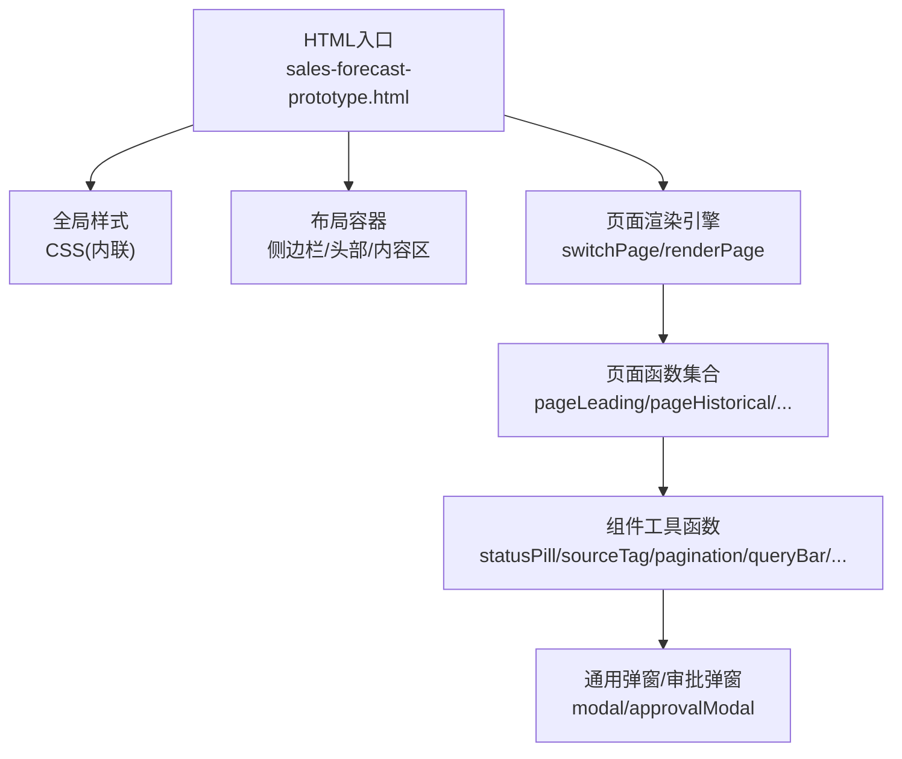
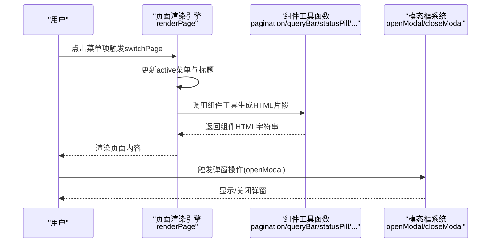
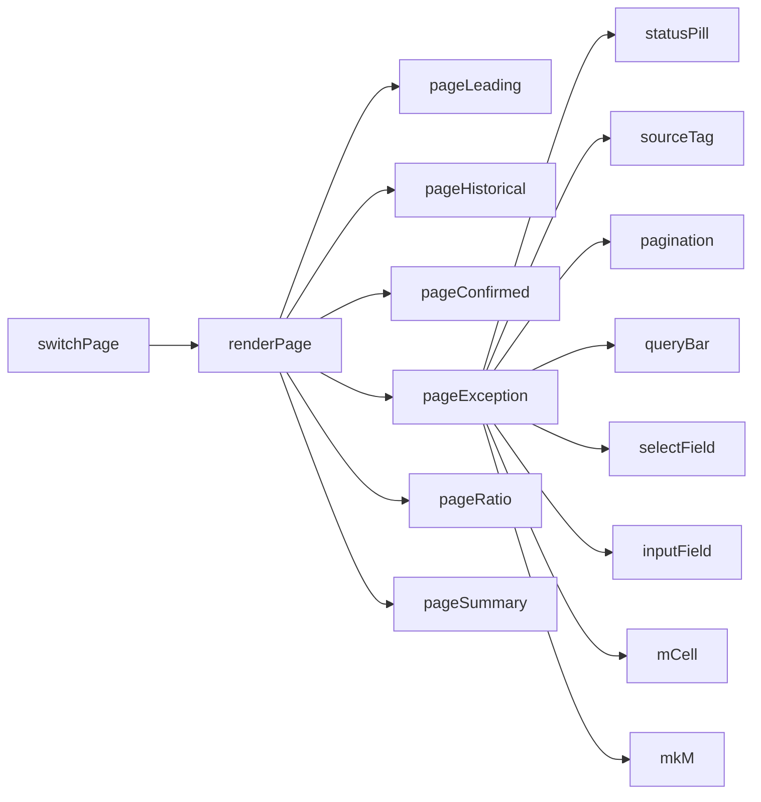

# UI组件库

<cite>
**本文引用的文件**   
- [sales-forecast-prototype.html](file://sales-forecast-prototype.html)
- [sales-forecast-prototype_副本.html](file://sales-forecast-prototype_副本.html)
</cite>

## 目录
1. [简介](#简介)
2. [项目结构](#项目结构)
3. [核心组件](#核心组件)
4. [架构总览](#架构总览)
5. [组件详解](#组件详解)
6. [依赖关系分析](#依赖关系分析)
7. [性能与可访问性建议](#性能与可访问性建议)
8. [故障排查指南](#故障排查指南)
9. [结论](#结论)
10. [附录：响应式与兼容性说明](#附录响应式与兼容性说明)

## 简介
本文件为销售预测原型的UI组件库文档，聚焦于原型中自研的UI组件体系，包括统计卡片(stat)、标签(tag)、状态徽章(pill)、按钮(btn)、表单元素、表格组件、分页器、查询栏、弹窗/模态框等。文档从样式定义、使用方法、自定义选项、组合模式与最佳实践等方面展开，帮助开发者快速理解并复用这些UI元素。

## 项目结构
该原型采用单页应用（SPA）风格，通过内联CSS与JavaScript在单个HTML文件中组织布局、组件样式与页面渲染逻辑。整体结构如下：
- 全局样式：重置、字体、颜色、间距、栅格、卡片、按钮、表单、表格、分页、弹窗等
- 布局容器：侧边栏、主内容区、顶部面包屑
- 页面路由：基于JS函数切换不同业务页面
- 组件工具：统计单元格、状态徽章、来源标签、分页、查询栏、表单字段、模态框等

图表来源
- [sales-forecast-prototype.html:108-126](file://sales-forecast-prototype.html#L108-L126)
- [sales-forecast-prototype.html:283-292](file://sales-forecast-prototype.html#L283-L292)
- [sales-forecast-prototype.html:140-182](file://sales-forecast-prototype.html#L140-L182)

章节来源
- [sales-forecast-prototype.html:1-106](file://sales-forecast-prototype.html#L1-L106)
- [sales-forecast-prototype_副本.html:1-110](file://sales-forecast-prototype_副本.html#L1-L110)

## 核心组件
- 统计卡片(stat)：用于展示关键指标数值、单位与描述
- 标签(tag)：用于分类或类型标识，支持多种语义色
- 状态徽章(pill)：用于流程状态展示，支持多状态配色
- 按钮(btn)：基础交互按钮，支持主次、危险、禁用、尺寸变体
- 表单元素：输入框、下拉选择、文本域，统一焦点与校验提示样式
- 表格组件：数据列表展示，支持固定表头、对齐、斑马纹
- 分页器：每页条数、页码导航、记录总数
- 查询栏：筛选条件区域，包含多个表单控件与操作按钮
- 弹窗/模态框：通用弹窗与审批弹窗，支持动态内容与操作

章节来源
- [sales-forecast-prototype.html:29-89](file://sales-forecast-prototype.html#L29-L89)
- [sales-forecast-prototype.html:140-182](file://sales-forecast-prototype.html#L140-L182)

## 架构总览
原型采用“样式+模板字符串”的方式构建UI，所有组件以CSS类名与JS函数组合使用。页面由renderPage根据当前路由调用对应pageXxx函数生成DOM，组件工具函数负责返回标准化HTML片段。

图表来源
- [sales-forecast-prototype.html:283-292](file://sales-forecast-prototype.html#L283-L292)
- [sales-forecast-prototype.html:167-182](file://sales-forecast-prototype.html#L167-L182)

## 组件详解

### 统计卡片(stat)
- 样式定义
  - 容器：card.stat，内部分别为stat-label、stat-value、stat-unit、stat-desc
  - 数值强调：text-success/text-warning/text-primary等语义色
- 使用方法
  - 在grid布局中放置多个stat卡片，形成KPI面板
  - 示例位置：先行指标预测页面的四个统计卡片
- 自定义选项
  - 可通过语义色类改变数值颜色
  - 可在stat-value后追加stat-unit显示单位
  - stat-desc用于补充说明变化趋势或备注

章节来源
- [sales-forecast-prototype.html:29-36](file://sales-forecast-prototype.html#L29-L36)
- [sales-forecast-prototype.html:59](file://sales-forecast-prototype.html#L59)
- [sales-forecast-prototype.html:299](file://sales-forecast-prototype.html#L299)

### 标签(tag)
- 样式定义
  - tag基础样式，支持tag-blue/tag-green/tag-orange/tag-red/tag-gray等语义色
- 使用方法
  - 用于分类、类型、趋势等短文本标识
  - 示例：先行指标趋势、确定性需求状态、来源类型
- 自定义选项
  - 通过语义色类控制背景与文字颜色
  - 也可通过JS函数sourceTag动态生成带样式的标签

章节来源
- [sales-forecast-prototype.html:60-61](file://sales-forecast-prototype.html#L60-L61)
- [sales-forecast-prototype.html:162-166](file://sales-forecast-prototype.html#L162-L166)

### 状态徽章(pill)
- 样式定义
  - pill基础样式，圆角胶囊形态
- 使用方法
  - 通过statusPill函数传入状态值，自动匹配背景与前景色
  - 示例：草稿、审批中、已通过、已驳回、已撤回、已废弃
- 自定义选项
  - 新增状态需在statusPill映射表中添加bg与fg颜色对

章节来源
- [sales-forecast-prototype.html:62](file://sales-forecast-prototype.html#L62)
- [sales-forecast-prototype.html:157-161](file://sales-forecast-prototype.html#L157-L161)

### 按钮(btn)
- 样式定义
  - btn基础样式，hover边框与文字色变化
  - 变体：btn-primary(主按钮)、btn-danger(危险)、btn-sm(小尺寸)、btn-link(链接式)、btn-disabled(禁用)
- 使用方法
  - 在action-bar、查询栏、表格操作列等场景使用
- 自定义选项
  - 通过组合类实现不同语义与尺寸
  - 禁用状态需同时设置disabled属性与样式类

章节来源
- [sales-forecast-prototype.html:38-45](file://sales-forecast-prototype.html#L38-L45)
- [sales-forecast-prototype.html:301](file://sales-forecast-prototype.html#L301)

### 表单元素
- 样式定义
  - form-group垂直布局，form-label标签样式
  - input/select/textarea统一边框、圆角、focus高亮
- 使用方法
  - 通过selectField与inputField工具函数生成标准表单控件
  - 示例：查询栏中的年份、产品线、客户名称等筛选条件
- 自定义选项
  - 可为input设置width样式控制宽度
  - textarea支持resize:vertical与min-height

章节来源
- [sales-forecast-prototype.html:46-52](file://sales-forecast-prototype.html#L46-L52)
- [sales-forecast-prototype.html:173-178](file://sales-forecast-prototype.html#L173-L178)

### 表格组件
- 样式定义
  - table-wrap包裹table，th固定表头sticky定位，斑马纹行背景
  - td-right/td-center对齐辅助类
- 使用方法
  - 在确定性需求、例外需求、比例维护、汇总明细等页面广泛使用
  - 支持多选checkbox列、操作列按钮组
- 自定义选项
  - 通过style="min-width:xxxpx"控制横向滚动
  - 单元格内容过长可使用title属性提供tooltip

章节来源
- [sales-forecast-prototype.html:53-58](file://sales-forecast-prototype.html#L53-L58)
- [sales-forecast-prototype.html:326](file://sales-forecast-prototype.html#L326)

### 分页器
- 样式定义
  - pagination容器，page-btn按钮样式，active状态高亮
- 使用方法
  - 通过pagination(total)函数生成，包含每页条数选择、上一页/下一页、页码信息
- 自定义选项
  - 可根据total计算总页数与当前页展示
  - 支持禁用首尾页按钮

章节来源
- [sales-forecast-prototype.html:68-72](file://sales-forecast-prototype.html#L68-L72)
- [sales-forecast-prototype.html:167-169](file://sales-forecast-prototype.html#L167-L169)

### 查询栏
- 样式定义
  - query-bar容器，内部row布局排列筛选控件与操作按钮
- 使用方法
  - 通过queryBar(fields)函数封装，fields由selectField/inputField拼接而成
- 自定义选项
  - 可自由组合多个表单控件作为筛选条件

章节来源
- [sales-forecast-prototype.html:67](file://sales-forecast-prototype.html#L67)
- [sales-forecast-prototype.html:170-172](file://sales-forecast-prototype.html#L170-L172)

### 弹窗/模态框
- 样式定义
  - modal-overlay遮罩层，modal主体容器，header/body/footer三段式结构
- 使用方法
  - openModal(title,body,footer)动态填充内容并显示
  - 专用审批弹窗approvalModal支持多级审批人选择与附件上传
- 自定义选项
  - 可调整max-width与max-height适配不同内容密度
  - 审批弹窗内置文件上传限制与校验逻辑

章节来源
- [sales-forecast-prototype.html:73-79](file://sales-forecast-prototype.html#L73-L79)
- [sales-forecast-prototype.html:179-182](file://sales-forecast-prototype.html#L179-L182)
- [sales-forecast-prototype.html:130-139](file://sales-forecast-prototype.html#L130-L139)

### 月份对比单元格(m-cell)
- 样式定义
  - m-cell单元格，m-before修改前（删除线），m-after修改后（高亮）
- 使用方法
  - 通过mkM(b,a)生成before/after数组，再由mCell渲染
  - 支持clickable与onClick回调，用于钻取明细
- 自定义选项
  - 当before与after相等时，不显示删除线与高亮

章节来源
- [sales-forecast-prototype.html:80-85](file://sales-forecast-prototype.html#L80-L85)
- [sales-forecast-prototype.html:150-156](file://sales-forecast-prototype.html#L150-L156)

## 依赖关系分析
- 页面渲染依赖：switchPage → renderPage → pageXxx函数 → 组件工具函数
- 组件工具依赖：statusPill、sourceTag、pagination、queryBar、selectField、inputField、mCell、mkM
- 弹窗依赖：openModal、closeModal、approvalModal专用逻辑（addApprover/removeApprover/handleFiles/submitApproval）

图表来源
- [sales-forecast-prototype.html:283-292](file://sales-forecast-prototype.html#L283-L292)
- [sales-forecast-prototype.html:140-182](file://sales-forecast-prototype.html#L140-L182)

章节来源
- [sales-forecast-prototype.html:283-292](file://sales-forecast-prototype.html#L283-L292)
- [sales-forecast-prototype.html:140-182](file://sales-forecast-prototype.html#L140-L182)

## 性能与可访问性建议
- 性能
  - 大量表格数据建议使用虚拟滚动或分页加载，避免一次性渲染过多DOM
  - 模板字符串拼接频繁，可考虑缓存常用片段或使用轻量模板引擎
- 可访问性
  - 为交互元素添加aria-label与键盘事件支持
  - 确保颜色对比度满足WCAG AA标准，特别是状态色与背景色
- 可维护性
  - 将组件样式抽离为独立CSS模块，便于主题定制
  - 组件工具函数集中管理，减少重复代码

[本节为通用建议，不直接分析具体文件]

## 故障排查指南
- 弹窗无法显示
  - 检查modal-overlay是否添加了show类
  - 确认openModal参数body与footer是否正确注入
- 状态徽章颜色异常
  - 检查statusPill映射表中是否存在对应状态键
- 表格横向滚动失效
  - 确认table-wrap与table样式未被覆盖
  - 检查min-width是否合理
- 表单焦点样式不生效
  - 检查:focus伪类是否被其他样式覆盖
  - 确认outline与box-shadow设置正确

章节来源
- [sales-forecast-prototype.html:179-182](file://sales-forecast-prototype.html#L179-L182)
- [sales-forecast-prototype.html:157-161](file://sales-forecast-prototype.html#L157-L161)
- [sales-forecast-prototype.html:53-58](file://sales-forecast-prototype.html#L53-L58)
- [sales-forecast-prototype.html:49-51](file://sales-forecast-prototype.html#L49-L51)

## 结论
该UI组件库以简洁的CSS类与JS工具函数为核心，实现了统计卡片、标签、状态徽章、按钮、表单、表格、分页、查询栏、弹窗等常用组件。通过统一的命名约定与组合模式，开发者可以快速搭建一致性的界面。建议在后续迭代中将样式与逻辑模块化，提升可维护性与扩展性。

[本节为总结，不直接分析具体文件]

## 附录：响应式与兼容性说明
- 响应式设计原则
  - 使用flex与grid布局实现自适应排版
  - 通过媒体查询或容器宽度控制组件在不同屏幕下的表现
- 跨浏览器兼容性
  - 使用现代CSS特性如sticky、flex、grid，主流浏览器均支持
  - 注意旧版IE对某些特性的兼容问题，必要时提供降级方案

[本节为概念性说明，不直接分析具体文件]