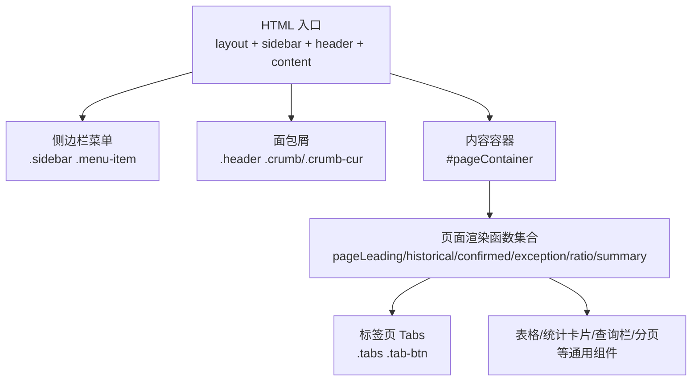
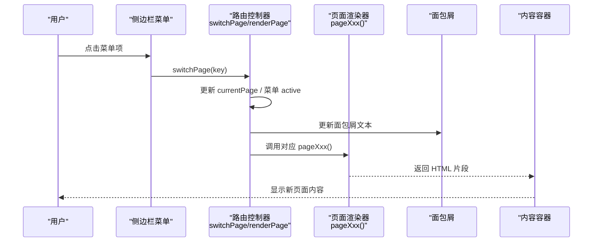
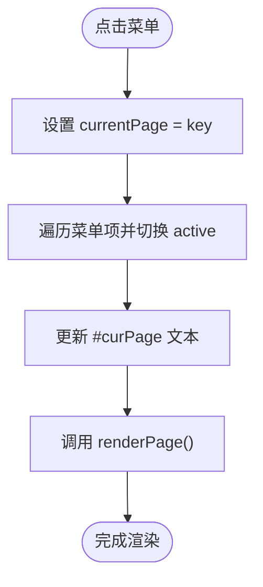
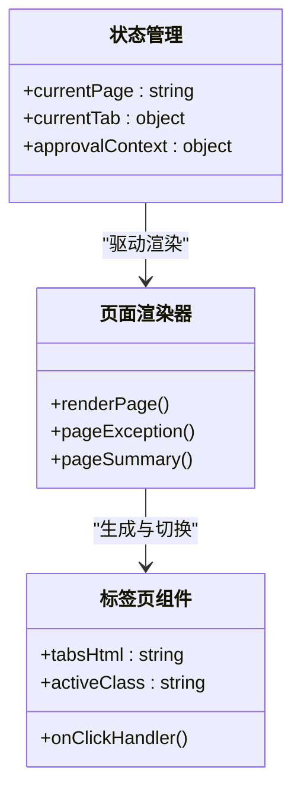
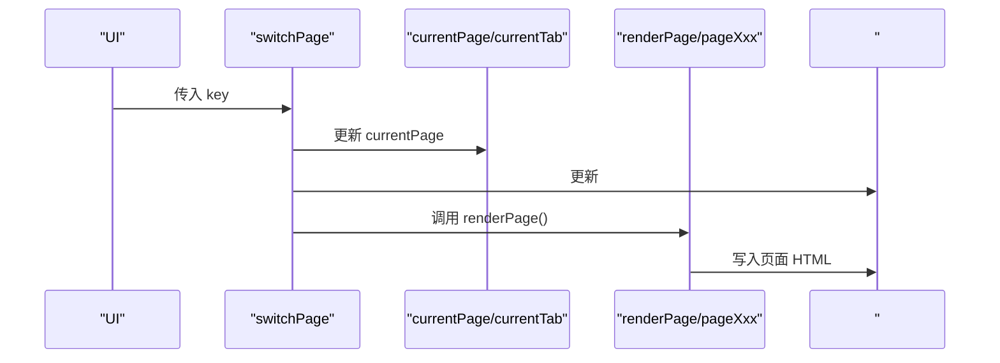
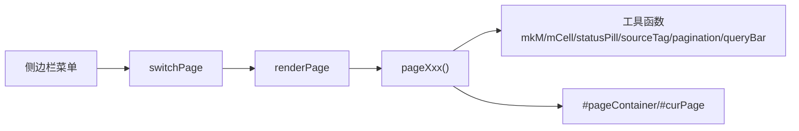

# 导航组件

<cite>
**本文档中引用的文件**
- [sales-forecast-prototype.html](file://sales-forecast-prototype.html)
- [sales-forecast-prototype_副本.html](file://sales-forecast-prototype_副本.html)
</cite>

## 目录
1. [简介](#简介)
2. [项目结构](#项目结构)
3. [核心组件](#核心组件)
4. [架构总览](#架构总览)
5. [详细组件分析](#详细组件分析)
6. [依赖关系分析](#依赖关系分析)
7. [性能与可访问性](#性能与可访问性)
8. [故障排查指南](#故障排查指南)
9. [结论与建议](#结论与建议)
10. [附录：交互流程图](#附录交互流程图)

## 简介
本文件面向“销售预测原型”的导航子系统，系统性说明侧边栏菜单（menu-item）、标签页（tabs）、面包屑（crumb）等导航元素的实现方式、页面切换逻辑、路由管理、状态保持、高亮与层级结构、移动端适配策略，以及交互优化建议。原型采用单页应用模式，通过内联脚本驱动视图渲染与状态更新，适合快速验证与演示。

## 项目结构
- 入口文件为单一 HTML 文件，包含样式、结构与脚本。
- 布局采用 Flex 布局，左侧固定宽度侧边栏，右侧主区域承载头部（面包屑）与内容区。
- 页面内容以函数式渲染为主，每个页面对应一个渲染函数，统一由容器注入。

图表来源
- [sales-forecast-prototype.html:108-126](file://sales-forecast-prototype.html#L108-L126)
- [sales-forecast-prototype.html:140-146](file://sales-forecast-prototype.html#L140-L146)
- [sales-forecast-prototype.html:282-292](file://sales-forecast-prototype.html#L282-L292)

章节来源
- [sales-forecast-prototype.html:108-126](file://sales-forecast-prototype.html#L108-L126)
- [sales-forecast-prototype.html:140-146](file://sales-forecast-prototype.html#L140-L146)

## 核心组件
- 侧边栏菜单（menu-item）
  - 作用：一级导航，点击后切换页面并更新面包屑与高亮状态。
  - 关键实现：onclick 绑定 switchPage(key)，内部维护 currentPage 与菜单 active 类名切换。
  - 高亮规则：根据当前 key 与预设顺序匹配，动态添加/移除 active 类。
- 面包屑（crumb）
  - 作用：展示当前页面路径，首段固定“销售预测”，末段为当前页面名称。
  - 关键实现：switchPage 更新 #curPage 文本为 PAGE_NAMES[key]。
- 标签页（tabs）
  - 作用：页面内二级导航，如“例外需求”的双 Tab、“销售预测3+9需求汇总”的四 Tab。
  - 关键实现：使用 currentTab 对象按页面维度保存当前 tab，点击时修改状态并调用 renderPage() 重新渲染。
- 通用组件
  - 查询栏（query-bar）、分页（pagination）、统计卡片（stat）、模态框（modal）等，均通过模板字符串生成，便于复用。

章节来源
- [sales-forecast-prototype.html:109-121](file://sales-forecast-prototype.html#L109-L121)
- [sales-forecast-prototype.html:123-124](file://sales-forecast-prototype.html#L123-L124)
- [sales-forecast-prototype.html:140-146](file://sales-forecast-prototype.html#L140-L146)
- [sales-forecast-prototype.html:282-292](file://sales-forecast-prototype.html#L282-L292)

## 架构总览
导航子系统围绕“状态驱动渲染”的核心思想构建：
- 状态层：currentPage、currentTab、approvalContext 等全局变量。
- 控制层：switchPage、renderPage、各 pageXxx 渲染函数。
- 表现层：DOM 模板字符串与 CSS 类名控制视觉状态（active、tag、pill 等）。

图表来源
- [sales-forecast-prototype.html:282-292](file://sales-forecast-prototype.html#L282-L292)
- [sales-forecast-prototype.html:140-146](file://sales-forecast-prototype.html#L140-L146)

## 详细组件分析

### 侧边栏菜单（menu-item）
- 数据结构
  - 菜单项通过 DOM 元素与 onclick 事件绑定，key 映射到 PAGE_NAMES。
  - 高亮通过数组索引与 key 比较，动态切换 active 类。
- 交互流程
  - 点击菜单 → switchPage(key) → 更新 currentPage → 更新面包屑 → 渲染页面。
- 可访问性与体验
  - 提供 hover 与 active 反馈；建议增加键盘可达性与焦点样式。
- 扩展点
  - 可通过配置化菜单数据源替代硬编码，支持权限控制与动态加载。

图表来源
- [sales-forecast-prototype.html:282-292](file://sales-forecast-prototype.html#L282-L292)

章节来源
- [sales-forecast-prototype.html:109-121](file://sales-forecast-prototype.html#L109-L121)
- [sales-forecast-prototype.html:282-292](file://sales-forecast-prototype.html#L282-L292)

### 面包屑（crumb）
- 结构
  - 固定前缀“销售预测”，分隔符“/”，当前页名为动态文本。
- 更新机制
  - 每次页面切换时，依据 PAGE_NAMES 映射更新 #curPage。
- 设计原则
  - 简洁明确，避免层级过深；在复杂应用中可引入多级面包屑。

章节来源
- [sales-forecast-prototype.html:123-124](file://sales-forecast-prototype.html#L123-L124)
- [sales-forecast-prototype.html:140-146](file://sales-forecast-prototype.html#L140-L146)

### 标签页（tabs）
- 适用场景
  - “例外需求”双 Tab（汇总表/明细表）
  - “销售预测3+9需求汇总”四 Tab（大区/国区/国家/明细）
- 状态管理
  - 使用 currentTab 对象按页面维度存储当前 tab，如 currentTab.exception、currentTab.summary。
- 渲染逻辑
  - 渲染函数读取 currentTab 对应值，生成 tabsHtml 并判断分支渲染不同内容。
- 交互优化
  - 点击 Tab 仅更新状态并触发 renderPage，避免整页刷新；建议加入过渡动画提升体验。

图表来源
- [sales-forecast-prototype.html:140-146](file://sales-forecast-prototype.html#L140-L146)
- [sales-forecast-prototype.html:345-365](file://sales-forecast-prototype.html#L345-L365)
- [sales-forecast-prototype.html:412-453](file://sales-forecast-prototype.html#L412-L453)

章节来源
- [sales-forecast-prototype.html:345-365](file://sales-forecast-prototype.html#L345-L365)
- [sales-forecast-prototype.html:412-453](file://sales-forecast-prototype.html#L412-L453)

### 页面切换与路由管理
- 路由模型
  - 前端键值路由：leading、historical、confirmed、exception、ratio、summary。
- 切换流程
  - switchPage 负责状态更新与面包屑同步，renderPage 负责选择渲染函数并注入容器。
- 状态保持
  - currentTab 跨渲染保持 Tab 状态；如需持久化，可扩展至 localStorage 或 URL hash。
- 扩展建议
  - 引入 history API 或 hash 路由，支持浏览器前进后退与分享链接。

图表来源
- [sales-forecast-prototype.html:282-292](file://sales-forecast-prototype.html#L282-L292)

章节来源
- [sales-forecast-prototype.html:282-292](file://sales-forecast-prototype.html#L282-L292)

### 高亮与层级结构
- 高亮
  - 菜单项通过 active 类高亮；Tab 通过 .active 类与底部边框颜色标识。
- 层级
  - 一级：侧边栏菜单；二级：页面内 Tab；三级：可选的弹窗/详情视图。
- 一致性
  - 统一的色彩体系与字体大小，确保视觉层次清晰。

章节来源
- [sales-forecast-prototype.html:15-18](file://sales-forecast-prototype.html#L15-L18)
- [sales-forecast-prototype.html:63-65](file://sales-forecast-prototype.html#L63-L65)

### 移动端适配
- 现状
  - 布局使用 Flex，侧边栏固定宽度；未提供折叠与响应式断点。
- 建议
  - 小屏下隐藏侧边栏，提供汉堡菜单；内容区自适应宽度；表格横向滚动。
  - 增大触控目标尺寸，优化触摸交互。

[本节为概念性建议，不直接分析具体文件]

## 依赖关系分析
- 组件耦合
  - 侧边栏与路由控制器强耦合（onclick→switchPage）。
  - 页面渲染函数依赖 currentTab 与工具函数（mkM、mCell、statusPill、sourceTag、pagination、queryBar）。
- 外部依赖
  - 无第三方库，纯原生 JS/CSS，利于轻量部署。
- 潜在风险
  - 全局状态集中，易产生隐式依赖；建议在大型项目中拆分模块与状态管理。

图表来源
- [sales-forecast-prototype.html:140-146](file://sales-forecast-prototype.html#L140-L146)
- [sales-forecast-prototype.html:282-292](file://sales-forecast-prototype.html#L282-L292)

章节来源
- [sales-forecast-prototype.html:140-146](file://sales-forecast-prototype.html#L140-L146)
- [sales-forecast-prototype.html:282-292](file://sales-forecast-prototype.html#L282-L292)

## 性能与可访问性
- 性能
  - 全量 DOM 替换可能导致重排重绘；对大数据表格建议虚拟滚动与增量更新。
  - 减少模板拼接开销，可考虑预编译模板或组件化框架。
- 可访问性
  - 为菜单与 Tab 添加 role、aria-selected、tabindex；键盘导航支持 Enter/Space/方向键。
  - 表单控件提供 label 与错误提示，增强屏幕阅读器可读性。

[本节为通用指导，不直接分析具体文件]

## 故障排查指南
- 常见问题
  - 菜单高亮异常：检查 switchPage 中的索引与 key 映射是否一致。
  - Tab 状态丢失：确认 currentTab 对象是否正确初始化并在渲染前保留。
  - 面包屑不更新：确认 #curPage 是否存在且被正确赋值。
- 调试建议
  - 在 switchPage 与 renderPage 中加入日志输出，观察状态变化。
  - 使用浏览器开发者工具检查 DOM 类名与事件绑定。

章节来源
- [sales-forecast-prototype.html:282-292](file://sales-forecast-prototype.html#L282-L292)
- [sales-forecast-prototype.html:140-146](file://sales-forecast-prototype.html#L140-L146)

## 结论与建议
- 总结
  - 导航子系统以简单高效的方式实现了菜单、面包屑与标签页的联动，满足原型阶段的快速迭代需求。
- 建议
  - 引入路由与状态管理库，提升可维护性与扩展性。
  - 完善移动端适配与可访问性，提升用户体验。
  - 将页面组件化，降低模板复杂度，提高复用率。

[本节为总结性内容，不直接分析具体文件]

## 附录：交互流程图
- 页面切换序列图
  - 见“架构总览”中的 sequence diagram。
- 标签页切换流程图
  - 见“标签页（tabs）”中的 flowchart。

[本节为概念性图示，不直接映射具体代码结构]