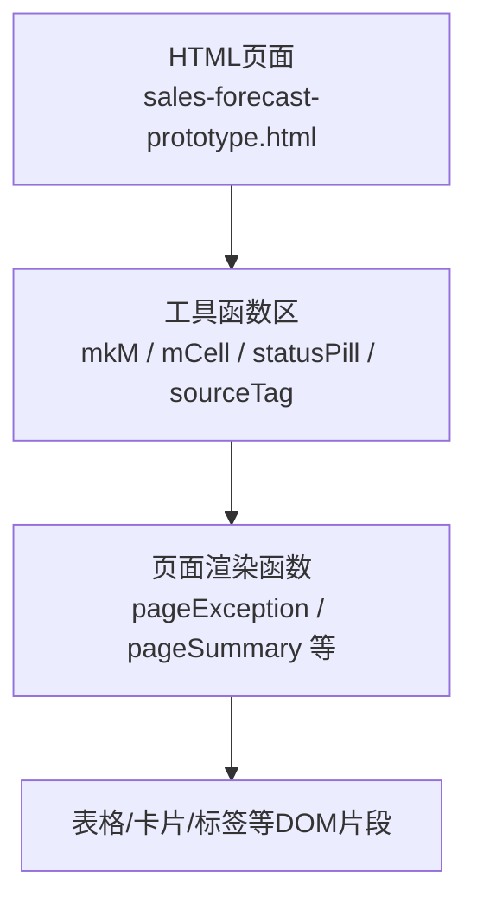
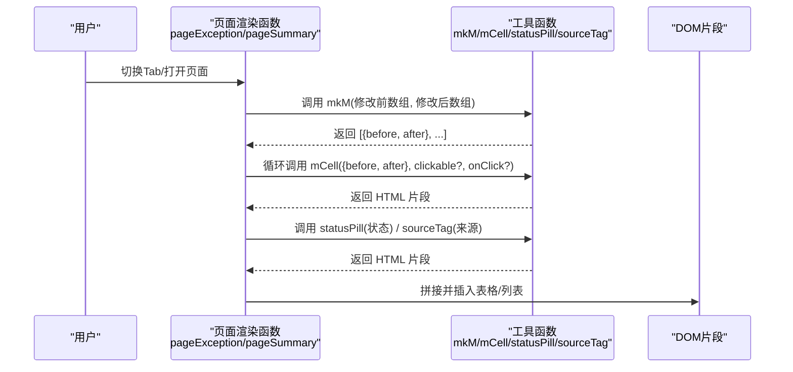
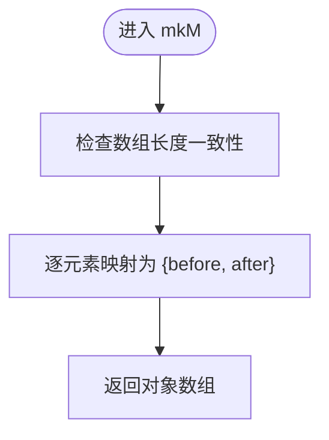
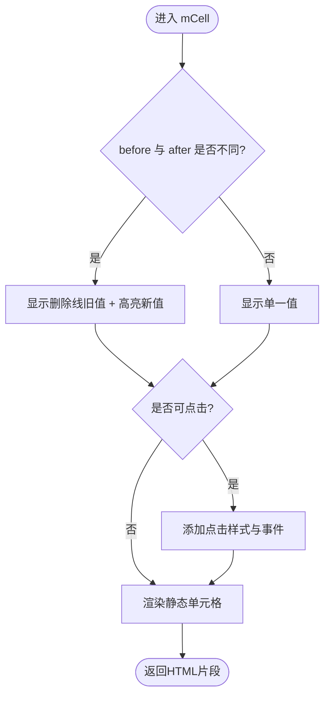
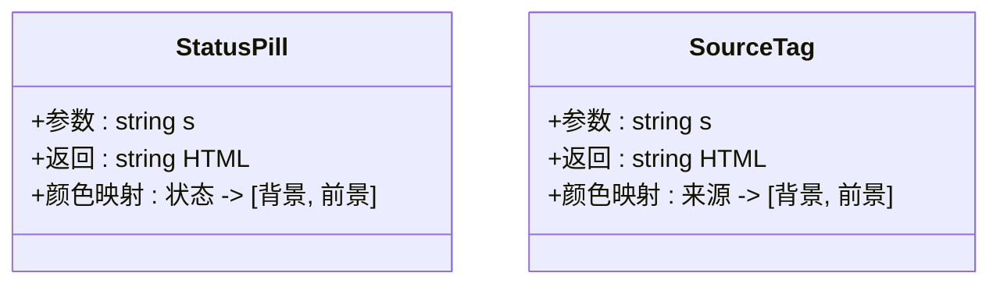
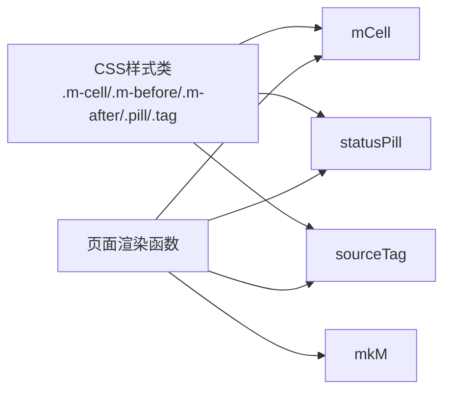

# UI辅助函数

<cite>
**本文引用的文件**   
- [sales-forecast-prototype.html](file://sales-forecast-prototype.html)
- [sales-forecast-prototype_副本.html](file://sales-forecast-prototype_副本.html)
</cite>

## 目录
1. [简介](#简介)
2. [项目结构](#项目结构)
3. [核心组件](#核心组件)
4. [架构总览](#架构总览)
5. [详细组件分析](#详细组件分析)
6. [依赖关系分析](#依赖关系分析)
7. [性能考量](#性能考量)
8. [故障排查指南](#故障排查指南)
9. [结论](#结论)
10. [附录](#附录)

## 简介
本文件聚焦销售预测原型中的UI辅助函数，系统性说明 mkM、mCell、statusPill、sourceTag 四个核心工具函数的实现原理、参数与返回值、使用示例与最佳实践。这些函数用于：
- 生成前后对比数据（mkM）
- 渲染可点击的单元格（mCell）
- 生成状态标签（statusPill）
- 显示数据来源标签（sourceTag）

通过统一封装，提升表格与汇总页面的渲染一致性与可维护性。

## 项目结构
该原型为单页HTML应用，所有样式与脚本内联在HTML文件中。UI辅助函数集中在脚本区域的“工具函数”部分，并在多个页面渲染函数中被复用。

图表来源
- [sales-forecast-prototype.html:148-166](file://sales-forecast-prototype.html#L148-L166)
- [sales-forecast-prototype.html:331-453](file://sales-forecast-prototype.html#L331-L453)

章节来源
- [sales-forecast-prototype.html:148-166](file://sales-forecast-prototype.html#L148-L166)
- [sales-forecast-prototype.html:331-453](file://sales-forecast-prototype.html#L331-L453)

## 核心组件
本节对四个关键工具函数进行逐一解析，包括功能、参数、返回值、典型用法与注意事项。

### mkM：生成前后对比数据
- 功能：将两个长度相同的数组（修改前、修改后）映射为对象数组，每个对象包含 before 与 after 字段，便于后续渲染对比。
- 参数：
  - b：number[]，修改前的数值序列
  - a：number[]，修改后的数值序列
- 返回值：Array<{before: number, after: number}>
- 复杂度：O(n)，n为数组长度
- 典型用法：
  - 在例外需求汇总表与销售预测汇总表中，作为月份列的数据源，配合 mCell 渲染前后对比单元。
- 注意事项：
  - 要求两个数组长度一致；否则会出现索引越界或错位。
  - 若需支持空值或缺失值，应在调用方做预处理。

章节来源
- [sales-forecast-prototype.html:150](file://sales-forecast-prototype.html#L150)
- [sales-forecast-prototype_副本.html:144](file://sales-forecast-prototype_副本.html#L144)

### mCell：渲染可点击的单元格
- 功能：根据传入的 {before, after} 对象渲染一个单元格，当 before 与 after 不同时，显示删除线的旧值与高亮的新值；可选地添加点击交互。
- 参数：
  - m：{before: number|string, after: number|string}，待渲染的前后值
  - clickable：boolean，是否启用点击样式与事件
  - onClick：string|undefined，onclick属性字符串（如 openModal(...)），仅在clickable为true时生效
- 返回值：string，HTML片段
- 视觉行为：
  - 无变化：仅显示当前值，颜色默认深色
  - 有变化：上方显示删除线旧值，下方显示加粗新值
  - 可点击：悬停背景高亮，新值下划线提示可操作
- 典型用法：
  - 在月份列中循环渲染每个月的对比单元格
  - 在“国家维度”明细弹窗中，展示具体月份的修改前后值
- 注意事项：
  - onClick 直接拼接为 HTML 属性，应避免注入不可信内容，防止XSS风险
  - 建议对数字进行格式化后再传入，保证对齐与可读性

章节来源
- [sales-forecast-prototype.html:151-156](file://sales-forecast-prototype.html#L151-L156)
- [sales-forecast-prototype_副本.html:145-150](file://sales-forecast-prototype_副本.html#L145-L150)

### statusPill：生成状态标签
- 功能：根据状态文本返回带样式的胶囊标签，不同状态对应不同的背景与文字颜色。
- 参数：
  - s：string，状态文本（如“已通过”、“审批中”、“草稿”、“已驳回”、“已撤回”、“已废弃”、“新建”）
- 返回值：string，HTML片段 状态文本
- 颜色映射：
  - 已通过：浅绿底+深绿字
  - 审批中：浅蓝底+蓝字
  - 草稿/新建：浅灰底+灰色字
  - 已驳回：浅橙红底+红色字
  - 已撤回：浅黄底+橙色字
  - 已废弃：浅灰底+灰色字
- 典型用法：
  - 在例外需求明细表与销售预测明细表中渲染审批状态
- 注意事项：
  - 未知状态会回退到默认灰底灰字，避免样式缺失
  - 如需新增状态，请在映射表中补充

章节来源
- [sales-forecast-prototype.html:157-161](file://sales-forecast-prototype.html#L157-L161)
- [sales-forecast-prototype_副本.html:151-155](file://sales-forecast-prototype_副本.html#L151-L155)

### sourceTag：显示数据来源标签
- 功能：根据数据来源类型返回带样式的标签，区分“确定性需求”、“例外需求”、“历史销售预测”。
- 参数：
  - s：string，数据来源类型
- 返回值：string，HTML片段 来源类型
- 颜色映射：
  - 确定性需求：浅绿底+深绿字
  - 例外需求：浅黄底+橙色字
  - 历史销售预测：浅蓝底+蓝字
- 典型用法：
  - 在销售预测3+9需求明细表中展示每条记录的需求来源
- 注意事项：
  - 未知来源会回退到默认灰底灰字

章节来源
- [sales-forecast-prototype.html:162-166](file://sales-forecast-prototype.html#L162-L166)
- [sales-forecast-prototype_副本.html:156-160](file://sales-forecast-prototype_副本.html#L156-L160)

## 架构总览
下图展示了工具函数在页面渲染流程中的位置与调用关系。

图表来源
- [sales-forecast-prototype.html:331-453](file://sales-forecast-prototype.html#L331-L453)
- [sales-forecast-prototype.html:148-166](file://sales-forecast-prototype.html#L148-L166)

## 详细组件分析

### mkM 数据流与复杂度
- 输入：两个等长数组
- 处理：按索引映射为对象数组
- 输出：可用于渲染的对比数据结构
- 时间复杂度：O(n)
- 空间复杂度：O(n)

图表来源
- [sales-forecast-prototype.html:150](file://sales-forecast-prototype.html#L150)

章节来源
- [sales-forecast-prototype.html:150](file://sales-forecast-prototype.html#L150)

### mCell 渲染逻辑与交互
- 判断是否有变化：before !== after
- 动态类名：基础类 + 可选点击类
- 条件样式：变化时旧值删除线、新值高亮；未变化时默认色
- 事件绑定：可选 onclick 属性拼接

图表来源
- [sales-forecast-prototype.html:151-156](file://sales-forecast-prototype.html#L151-L156)

章节来源
- [sales-forecast-prototype.html:151-156](file://sales-forecast-prototype.html#L151-L156)

### statusPill 与 sourceTag 的颜色映射
- 两者均基于键值映射选择背景与前景色
- 未知值回退到默认灰调，确保健壮性

图表来源
- [sales-forecast-prototype.html:157-166](file://sales-forecast-prototype.html#L157-L166)

章节来源
- [sales-forecast-prototype.html:157-166](file://sales-forecast-prototype.html#L157-L166)

## 依赖关系分析
- 工具函数之间无相互依赖，彼此独立
- 页面渲染函数依赖工具函数生成HTML片段
- CSS样式类由HTML头部定义，工具函数通过类名控制外观

图表来源
- [sales-forecast-prototype.html:80-88](file://sales-forecast-prototype.html#L80-L88)
- [sales-forecast-prototype.html:148-166](file://sales-forecast-prototype.html#L148-L166)
- [sales-forecast-prototype.html:331-453](file://sales-forecast-prototype.html#L331-L453)

章节来源
- [sales-forecast-prototype.html:80-88](file://sales-forecast-prototype.html#L80-L88)
- [sales-forecast-prototype.html:148-166](file://sales-forecast-prototype.html#L148-L166)
- [sales-forecast-prototype.html:331-453](file://sales-forecast-prototype.html#L331-L453)

## 性能考量
- mkM：线性遍历，适合中等规模数组；若数据量极大，考虑分页或虚拟滚动
- mCell：每次渲染都生成HTML片段，频繁调用时应注意模板拼接开销；可在批量渲染时缓存结果
- statusPill/sourceTag：颜色映射查找为常数时间，开销极低
- 整体建议：
  - 避免在循环中重复创建复杂字符串，必要时预计算
  - 对大表格采用按需渲染或懒加载

[本节为通用指导，不直接分析具体文件]

## 故障排查指南
- 现象：月份对比单元格显示异常或错位
  - 排查：确认 mkM 的两个数组长度一致且顺序对应
- 现象：点击无效或报错
  - 排查：mCell 的 onClick 参数是否正确拼接；避免注入不可信内容导致XSS
- 现象：状态或来源标签颜色不正确
  - 排查：传入的状态/来源是否在映射表中；未知值会回退默认样式
- 现象：表格渲染缓慢
  - 排查：减少不必要的DOM重绘；合并多次渲染；避免在循环中执行昂贵操作

章节来源
- [sales-forecast-prototype.html:150-166](file://sales-forecast-prototype.html#L150-L166)
- [sales-forecast-prototype.html:331-453](file://sales-forecast-prototype.html#L331-L453)

## 结论
mkM、mCell、statusPill、sourceTag 四个工具函数以最小耦合实现了销售预测原型中常见的对比渲染、状态与来源标签展示能力。它们被多处页面复用，保证了UI一致性与开发效率。遵循本文的参数约定与最佳实践，可有效降低错误率并提升可维护性。

[本节为总结，不直接分析具体文件]

## 附录

### 函数参考速查
- mkM(b, a)
  - 作用：生成前后对比数据
  - 参数：b(number[])，a(number[])
  - 返回：Array<{before:number, after:number}>
  - 示例路径：[sales-forecast-prototype.html:150](file://sales-forecast-prototype.html#L150)

- mCell(m, clickable, onClick)
  - 作用：渲染对比单元格，支持点击
  - 参数：m({before, after})，clickable(boolean)，onClick(string|undefined)
  - 返回：string（HTML片段）
  - 示例路径：[sales-forecast-prototype.html:151-156](file://sales-forecast-prototype.html#L151-L156)

- statusPill(s)
  - 作用：生成状态胶囊标签
  - 参数：s(string)
  - 返回：string（HTML片段）
  - 示例路径：[sales-forecast-prototype.html:157-161](file://sales-forecast-prototype.html#L157-L161)

- sourceTag(s)
  - 作用：生成数据来源标签
  - 参数：s(string)
  - 返回：string（HTML片段）
  - 示例路径：[sales-forecast-prototype.html:162-166](file://sales-forecast-prototype.html#L162-L166)

### 使用示例（路径引用）
- 在例外需求汇总表中渲染月份对比单元格：
  - [sales-forecast-prototype.html:354](file://sales-forecast-prototype.html#L354)
- 在国家维度明细弹窗中展示来源标签：
  - [sales-forecast-prototype.html:443](file://sales-forecast-prototype.html#L443)
- 在明细表中渲染审批状态：
  - [sales-forecast-prototype.html:362](file://sales-forecast-prototype.html#L362)

章节来源
- [sales-forecast-prototype.html:354](file://sales-forecast-prototype.html#L354)
- [sales-forecast-prototype.html:443](file://sales-forecast-prototype.html#L443)
- [sales-forecast-prototype.html:362](file://sales-forecast-prototype.html#L362)