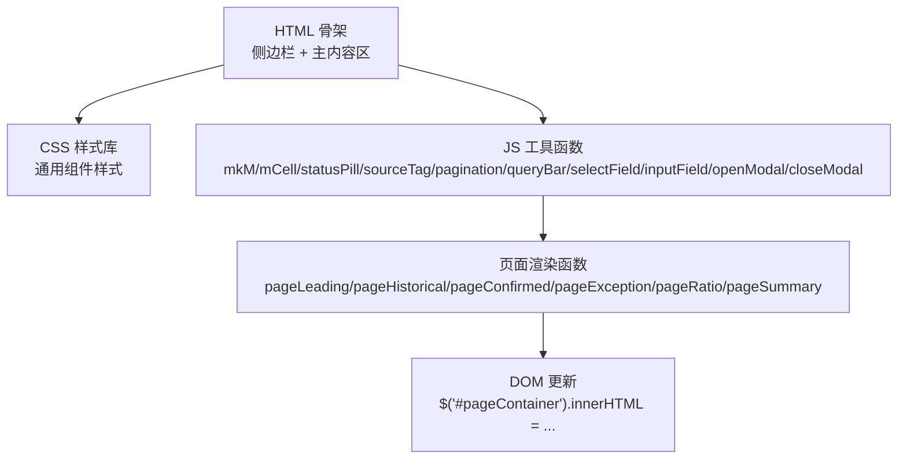
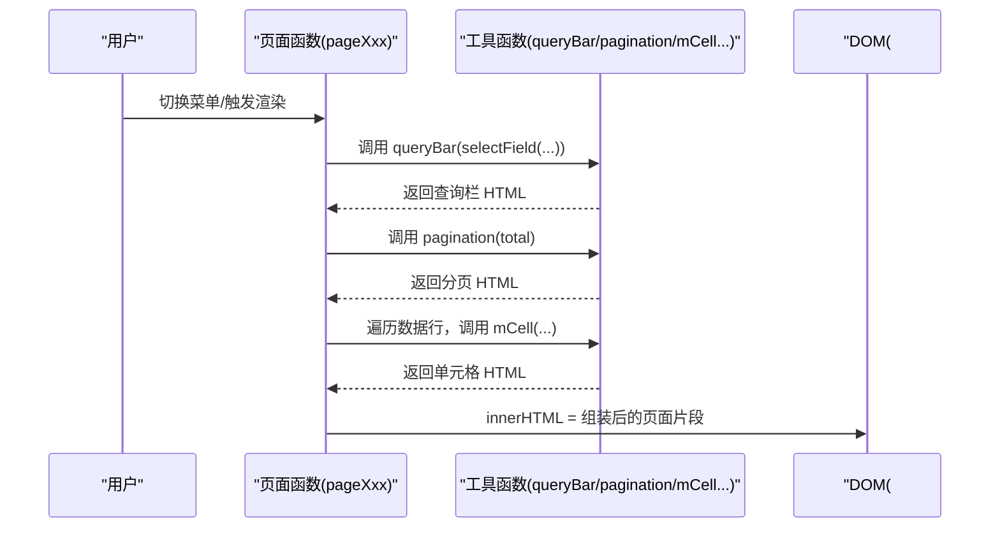
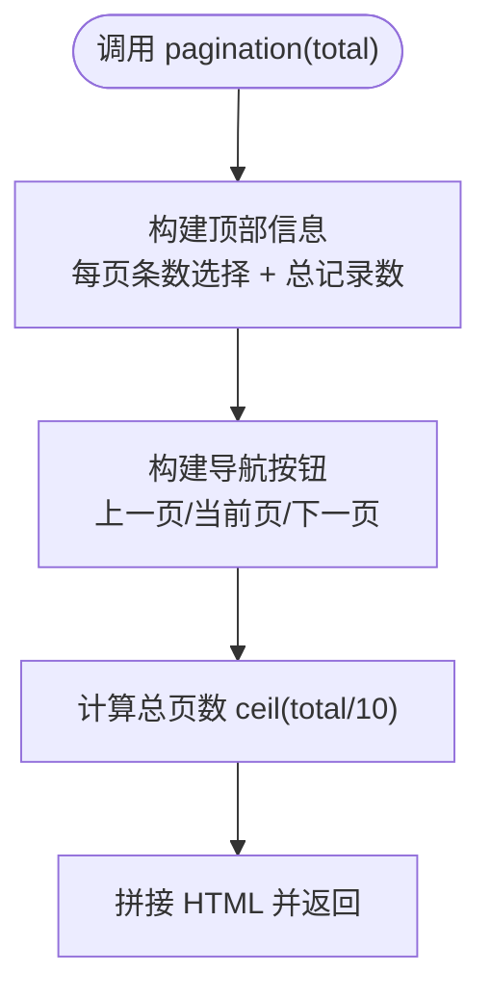
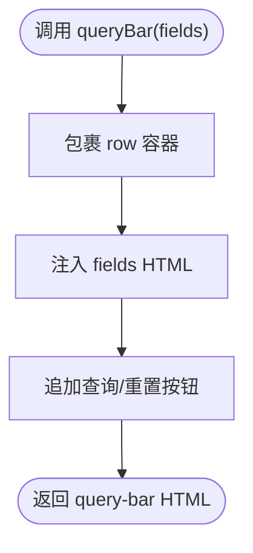
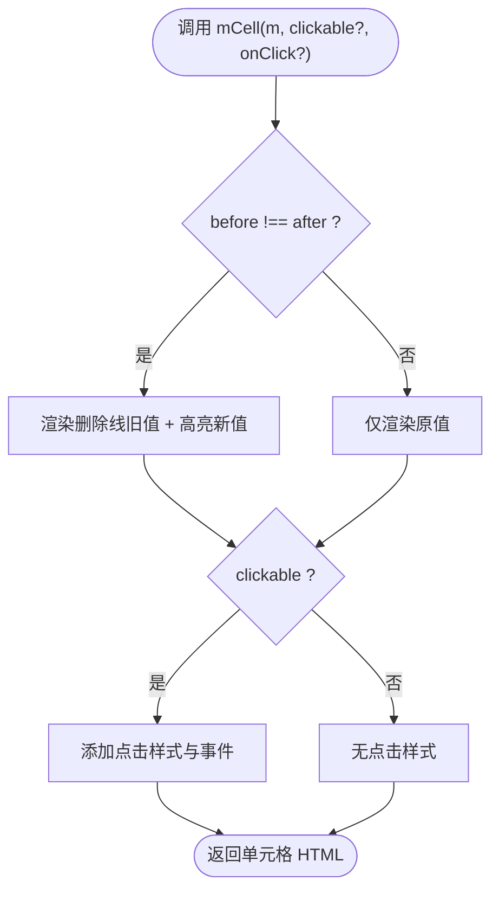
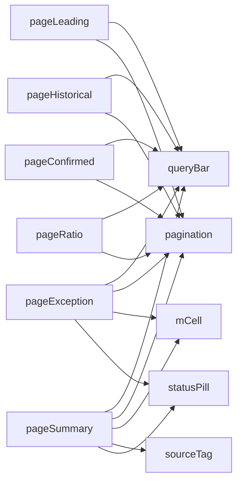

# 工具组件

<cite>
**本文引用的文件**   
- [sales-forecast-prototype.html](file://sales-forecast-prototype.html)
- [sales-forecast-prototype_副本.html](file://sales-forecast-prototype_副本.html)
</cite>

## 目录
1. [简介](#简介)
2. [项目结构](#项目结构)
3. [核心组件](#核心组件)
4. [架构总览](#架构总览)
5. [详细组件分析](#详细组件分析)
6. [依赖关系分析](#依赖关系分析)
7. [性能考虑](#性能考虑)
8. [故障排查指南](#故障排查指南)
9. [结论](#结论)
10. [附录：工具函数使用与扩展指南](#附录工具函数使用与扩展指南)

## 简介
本文件为销售预测原型中的“工具组件”提供系统化文档，聚焦以下辅助UI元素与工具函数：
- 分页器 pagination
- 查询栏 queryBar（含 selectField、inputField）
- 按钮 btn（基础样式与变体）
- 单元格渲染 mCell
- 状态标签 statusPill
- 来源标签 sourceTag
- 数据构造 mkM
- 弹窗 openModal / closeModal

内容涵盖组件组合方式、样式定制要点、事件绑定方法，以及工具函数的使用指南与扩展建议。

## 项目结构
该原型由单页 HTML 构成，包含：
- 全局样式：布局、卡片、表格、统计卡片、标签/胶囊、分页、弹窗等
- 页面容器与侧边导航
- JavaScript：工具函数、页面渲染函数、交互逻辑（如审批弹窗、文件上传）

图表来源
- [sales-forecast-prototype.html:108-126](file://sales-forecast-prototype.html#L108-L126)
- [sales-forecast-prototype.html:148-182](file://sales-forecast-prototype.html#L148-L182)
- [sales-forecast-prototype.html:289-292](file://sales-forecast-prototype.html#L289-L292)

章节来源
- [sales-forecast-prototype.html:108-126](file://sales-forecast-prototype.html#L108-L126)
- [sales-forecast-prototype.html:148-182](file://sales-forecast-prototype.html#L148-L182)
- [sales-forecast-prototype.html:289-292](file://sales-forecast-prototype.html#L289-L292)

## 核心组件
本节概述各工具组件的职责与典型用法。

- 分页器 pagination(total)
  - 作用：生成每页条数选择、记录总数、上一页/下一页与当前页码展示
  - 参数：total（总记录数）
  - 输出：分页区域 HTML
  - 使用位置：多个列表页底部

- 查询栏 queryBar(fields)
  - 作用：将一组表单字段拼接成查询栏，并附带“查询/重置”按钮
  - 参数：fields（selectField/inputField 返回的 HTML 片段拼接字符串）
  - 输出：查询栏 HTML

- 表单字段
  - selectField(label, opts)：下拉框字段
  - inputField(label, ph)：文本输入框字段

- 按钮 btn
  - 通过 CSS 类控制样式：btn、btn-primary、btn-danger、btn-sm、btn-link、btn-disabled
  - 在 HTML 中直接添加类名即可

- 单元格渲染 mCell(m, clickable?, onClick?)
  - 作用：渲染“修改前/后”对比单元格，支持点击态
  - 参数：m（{before, after}）、clickable（布尔）、onClick（回调字符串）
  - 输出：单元格 HTML

- 状态标签 statusPill(s)
  - 作用：根据状态值渲染带背景色和文字色的胶囊标签
  - 参数：s（状态字符串）
  - 输出：胶囊标签 HTML

- 来源标签 sourceTag(s)
  - 作用：根据数据来源渲染不同颜色的标签
  - 参数：s（来源类型字符串）
  - 输出：标签 HTML

- 数据构造 mkM(beforeArr, afterArr)
  - 作用：将两个数组映射为 {before, after} 对象数组，供 mCell 渲染
  - 参数：beforeArr、afterArr（数值或字符串数组）
  - 输出：对象数组

- 弹窗 openModal(title, body, footer?) / closeModal()
  - 作用：打开/关闭通用弹窗，动态设置标题、内容与底部按钮

章节来源
- [sales-forecast-prototype.html:148-182](file://sales-forecast-prototype.html#L148-L182)
- [sales-forecast-prototype.html:167-178](file://sales-forecast-prototype.html#L167-L178)
- [sales-forecast-prototype.html:179-182](file://sales-forecast-prototype.html#L179-L182)

## 架构总览
整体采用“模板字符串 + DOM 替换”的轻量渲染模式：
- 工具函数负责生成 UI 片段
- 页面函数拼装业务视图
- renderPage 统一注入到 #pageContainer

图表来源
- [sales-forecast-prototype.html:289-292](file://sales-forecast-prototype.html#L289-L292)
- [sales-forecast-prototype.html:170-172](file://sales-forecast-prototype.html#L170-L172)
- [sales-forecast-prototype.html:167-169](file://sales-forecast-prototype.html#L167-L169)
- [sales-forecast-prototype.html:151-156](file://sales-forecast-prototype.html#L151-L156)

## 详细组件分析

### 分页器 pagination
- 功能点
  - 每页显示条数选择（静态选项）
  - 总记录数提示
  - 上一页/下一页按钮与当前页高亮
  - 计算总页数（基于 total）
- 使用示例
  - 在列表页底部插入 ${pagination(总数)}
- 注意事项
  - 当前实现为静态交互，未绑定翻页事件；如需真实翻页，需扩展事件处理与数据源切换

图表来源
- [sales-forecast-prototype.html:167-169](file://sales-forecast-prototype.html#L167-L169)

章节来源
- [sales-forecast-prototype.html:167-169](file://sales-forecast-prototype.html#L167-L169)

### 查询栏 queryBar
- 功能点
  - 接收 fields（selectField/inputField 拼接结果）
  - 自动附加“查询/重置”按钮
- 使用示例
  - ${queryBar(selectField('年份',['2026年','2025年']) + selectField('产品线',['全部产品','A系列']))}
- 扩展建议
  - 增加日期范围选择、搜索框、高级筛选开关

图表来源
- [sales-forecast-prototype.html:170-172](file://sales-forecast-prototype.html#L170-L172)

章节来源
- [sales-forecast-prototype.html:170-172](file://sales-forecast-prototype.html#L170-L172)

### 按钮 btn
- 样式类
  - 基础：btn
  - 主要：btn-primary
  - 危险：btn-danger
  - 尺寸：btn-sm
  - 链接式：btn-link、btn-link-danger
  - 禁用：btn-disabled
- 使用方式
  - 在 <button> 上添加对应类名即可
- 交互
  - 通过 onclick 或事件委托绑定行为

章节来源
- [sales-forecast-prototype.html:38-45](file://sales-forecast-prototype.html#L38-L45)

### 单元格渲染 mCell
- 功能点
  - 对比 before/after 差异，差异存在时显示删除线与高亮新值
  - 可选点击态（hover 高亮、下划线）
- 参数
  - m: {before, after}
  - clickable?: boolean
  - onClick?: string（内联事件字符串）
- 使用示例
  - 在表格列中：${mCell({before: 100, after: 120})}
  - 可点击：${mCell({before: 100, after: 120}, true, 'openModal(...)')}

图表来源
- [sales-forecast-prototype.html:151-156](file://sales-forecast-prototype.html#L151-L156)

章节来源
- [sales-forecast-prototype.html:151-156](file://sales-forecast-prototype.html#L151-L156)

### 状态标签 statusPill
- 功能点
  - 根据状态映射背景与前景色，输出胶囊标签
- 支持状态
  - 已通过、审批中、草稿、已驳回、已撤回、已废弃、新建（以主文件为准）
- 使用示例
  - ${statusPill('审批中')}

章节来源
- [sales-forecast-prototype.html:157-161](file://sales-forecast-prototype.html#L157-L161)

### 来源标签 sourceTag
- 功能点
  - 根据来源类型映射颜色，输出标签
- 支持来源
  - 确定性需求、例外需求、历史销售预测
- 使用示例
  - ${sourceTag('确定性需求')}

章节来源
- [sales-forecast-prototype.html:162-166](file://sales-forecast-prototype.html#L162-L166)

### 数据构造 mkM
- 功能点
  - 将前后两期数组映射为对象数组，便于 mCell 渲染
- 使用示例
  - const months = mkM([100,120],[110,130])
  - 在表格列中循环渲染：months.map(m => `<td>${mCell(m)}</td>`)

章节来源
- [sales-forecast-prototype.html:150](file://sales-forecast-prototype.html#L150)

### 弹窗 openModal / closeModal
- 功能点
  - 动态设置弹窗标题、内容、底部按钮
  - 控制遮罩层显示/隐藏
- 使用示例
  - openModal('标题', '
内容
', '<button class=btn>确定</button>')
  - closeModal()

章节来源
- [sales-forecast-prototype.html:179-182](file://sales-forecast-prototype.html#L179-L182)

## 依赖关系分析
- 页面函数依赖工具函数进行 UI 片段生成
- 工具函数之间低耦合，彼此独立
- DOM 操作集中在 openModal/closeModal 与 renderPage

图表来源
- [sales-forecast-prototype.html:295-304](file://sales-forecast-prototype.html#L295-L304)
- [sales-forecast-prototype.html:307-316](file://sales-forecast-prototype.html#L307-L316)
- [sales-forecast-prototype.html:319-328](file://sales-forecast-prototype.html#L319-L328)
- [sales-forecast-prototype.html:345-365](file://sales-forecast-prototype.html#L345-L365)
- [sales-forecast-prototype.html:375-382](file://sales-forecast-prototype.html#L375-L382)
- [sales-forecast-prototype.html:412-453](file://sales-forecast-prototype.html#L412-L453)

章节来源
- [sales-forecast-prototype.html:295-304](file://sales-forecast-prototype.html#L295-L304)
- [sales-forecast-prototype.html:345-365](file://sales-forecast-prototype.html#L345-L365)
- [sales-forecast-prototype.html:412-453](file://sales-forecast-prototype.html#L412-L453)

## 性能考虑
- 模板字符串拼接开销小，适合原型阶段快速迭代
- 大量 innerHTML 替换可能引发重排，建议在数据量大时引入虚拟节点或分页加载
- 避免频繁重复渲染同一区域，可将稳定部分缓存

[本节为通用指导，不直接分析具体文件]

## 故障排查指南
- 分页器不生效
  - 检查是否传入正确的 total
  - 确认 pagination 被正确插入到页面底部
- 查询栏字段不显示
  - 检查 selectField/inputField 返回值是否正确拼接
  - 确认 queryBar 接收到的 fields 非空
- mCell 无差异高亮
  - 确保 before 与 after 不相等
  - 若需要点击态，传入 clickable=true 与 onClick 字符串
- statusPill/sourceTag 颜色异常
  - 检查传入的状态/来源是否在映射表中
  - 新增状态或来源需在映射中添加配色
- 弹窗无法打开/关闭
  - 确认 openModal 的参数顺序与内容合法
  - 检查遮罩层类名 show 是否正确切换

章节来源
- [sales-forecast-prototype.html:167-182](file://sales-forecast-prototype.html#L167-L182)
- [sales-forecast-prototype.html:151-166](file://sales-forecast-prototype.html#L151-L166)

## 结论
本原型通过简洁的工具函数与模板字符串实现了高效的前端渲染，覆盖分页、查询、按钮、单元格、状态与来源标签等常见场景。其优势在于快速迭代与易扩展；后续可在保持现有接口不变的前提下，增强交互与性能优化。

[本节为总结性内容，不直接分析具体文件]

## 附录：工具函数使用与扩展指南

### 使用清单
- 分页器
  - 调用：${pagination(总数)}
  - 扩展：增加页码跳转、异步刷新数据
- 查询栏
  - 调用：${queryBar(selectField(...) + inputField(...))}
  - 扩展：增加日期选择、多条件联动
- 按钮
  - 使用：在 button 上添加 btn、btn-primary、btn-danger、btn-sm、btn-link、btn-disabled
  - 扩展：增加图标、loading 态
- 单元格
  - 调用：${mCell({before, after}, clickable?, onClick?)}
  - 扩展：支持格式化数字、单位、百分比
- 状态标签
  - 调用：${statusPill(状态)}
  - 扩展：新增状态映射配色
- 来源标签
  - 调用：${sourceTag(来源)}
  - 扩展：新增来源映射配色
- 数据构造
  - 调用：const arr = mkM(beforeArr, afterArr)
  - 扩展：支持更多字段映射
- 弹窗
  - 调用：openModal(标题, 内容, 底部按钮), closeModal()
  - 扩展：支持拖拽、ESC 关闭、焦点管理

章节来源
- [sales-forecast-prototype.html:148-182](file://sales-forecast-prototype.html#L148-L182)
- [sales-forecast-prototype.html:167-178](file://sales-forecast-prototype.html#L167-L178)
- [sales-forecast-prototype.html:179-182](file://sales-forecast-prototype.html#L179-L182)