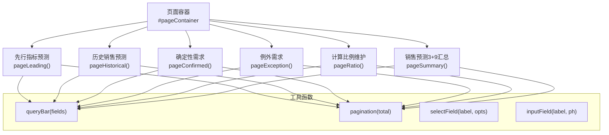
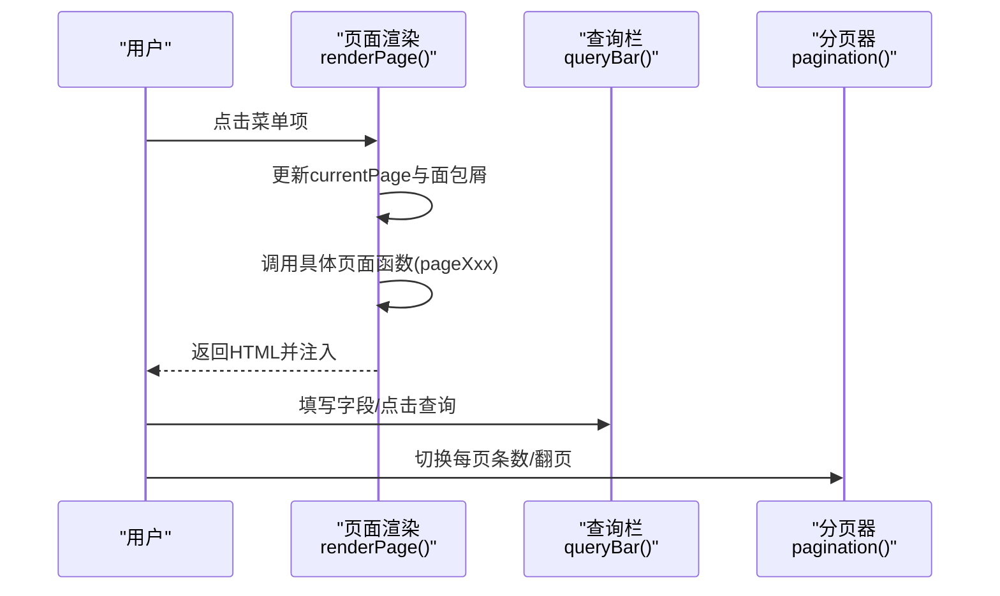
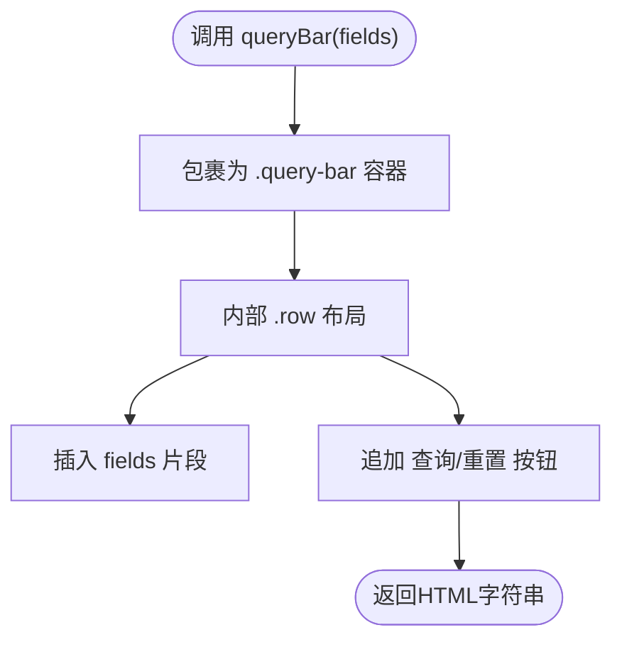
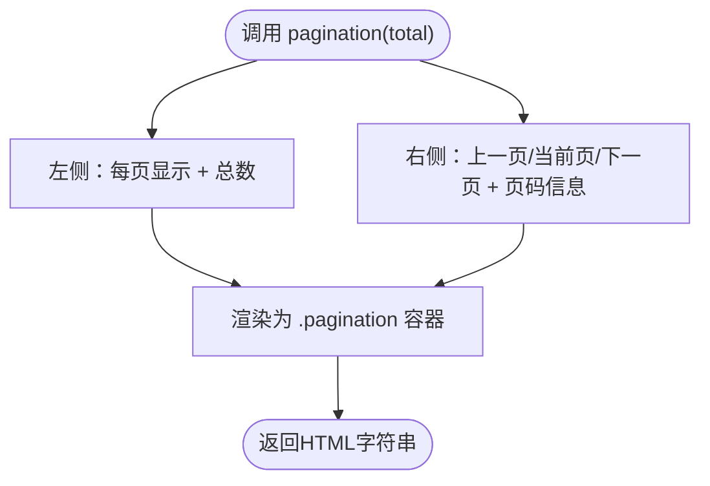
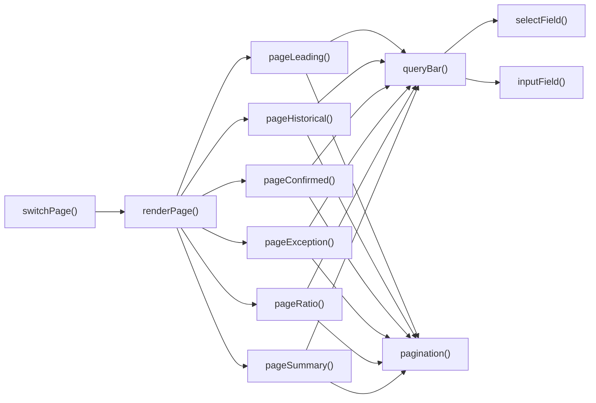

# 布局组件

<cite>
**本文引用的文件**   
- [sales-forecast-prototype.html](file://sales-forecast-prototype.html)
- [sales-forecast-prototype_副本.html](file://sales-forecast-prototype_副本.html)
</cite>

## 目录
1. [简介](#简介)
2. [项目结构](#项目结构)
3. [核心组件](#核心组件)
4. [架构总览](#架构总览)
5. [详细组件分析](#详细组件分析)
6. [依赖关系分析](#依赖关系分析)
7. [性能考虑](#性能考虑)
8. [故障排查指南](#故障排查指南)
9. [结论](#结论)
10. [附录](#附录)

## 简介
本文件面向销售预测原型的“布局辅助组件”，重点解析查询栏（queryBar）与分页器（pagination）的实现原理、字段配置方式、数据绑定与响应式布局适配，并给出组合使用、样式定制、性能优化等高级特性与最佳实践。原型采用单页HTML+内联CSS+原生JS实现，通过函数式渲染页面内容，便于快速迭代与演示。

## 项目结构
- 单文件原型：主文件包含全局样式、布局容器、弹窗模板与脚本逻辑。
- 布局容器：侧边导航 + 主内容区，顶部面包屑显示当前页面名称。
- 页面渲染：每个页面由独立函数返回HTML字符串，统一注入到主内容区。
- 工具函数：提供查询栏、分页器、表单字段、状态标签等通用能力。

图表来源
- [sales-forecast-prototype.html:289-292](file://sales-forecast-prototype.html#L289-L292)
- [sales-forecast-prototype.html:295-304](file://sales-forecast-prototype.html#L295-L304)
- [sales-forecast-prototype.html:307-316](file://sales-forecast-prototype.html#L307-L316)
- [sales-forecast-prototype.html:319-328](file://sales-forecast-prototype.html#L319-L328)
- [sales-forecast-prototype.html:345-365](file://sales-forecast-prototype.html#L345-L365)
- [sales-forecast-prototype.html:375-382](file://sales-forecast-prototype.html#L375-L382)
- [sales-forecast-prototype.html:412-453](file://sales-forecast-prototype.html#L412-L453)

章节来源
- [sales-forecast-prototype.html:1-126](file://sales-forecast-prototype.html#L1-L126)
- [sales-forecast-prototype.html:289-292](file://sales-forecast-prototype.html#L289-L292)

## 核心组件
- 查询栏 queryBar：接收一组表单字段HTML片段，自动包裹为查询区域，并提供“查询”和“重置”按钮。
- 分页器 pagination：根据总记录数渲染每页条数选择、页码按钮与页码信息。
- 表单字段 selectField / inputField：用于快速生成下拉框与输入框的HTML片段，供queryBar组合使用。

章节来源
- [sales-forecast-prototype.html:167-178](file://sales-forecast-prototype.html#L167-L178)
- [sales-forecast-prototype_副本.html:161-172](file://sales-forecast-prototype_副本.html#L161-L172)

## 架构总览
整体采用“函数式渲染 + 模板拼接”的轻量架构：
- 页面切换：switchPage更新当前页标识与面包屑，renderPage调用对应页面函数生成HTML并注入容器。
- 查询栏：各页面通过queryBar传入selectField或inputField生成的字段片段，形成统一的查询入口。
- 分页器：各页面在表格底部调用pagination(total)渲染分页控件。

图表来源
- [sales-forecast-prototype.html:283-292](file://sales-forecast-prototype.html#L283-L292)
- [sales-forecast-prototype.html:170-172](file://sales-forecast-prototype.html#L170-L172)
- [sales-forecast-prototype.html:167-169](file://sales-forecast-prototype.html#L167-L169)

## 详细组件分析

### 查询栏 queryBar
- 作用：将多个表单字段以行内Flex布局展示，右侧固定“查询”“重置”按钮。
- 参数：fields为字符串形式的多个表单字段片段（通常由selectField/inputField拼接）。
- 样式：白色背景、圆角、边框，内部使用.row进行水平排列与换行。
- 交互：按钮目前为静态占位，实际业务中可绑定事件触发筛选逻辑。

图表来源
- [sales-forecast-prototype.html:170-172](file://sales-forecast-prototype.html#L170-L172)

章节来源
- [sales-forecast-prototype.html:170-172](file://sales-forecast-prototype.html#L170-L172)
- [sales-forecast-prototype_副本.html:164-166](file://sales-forecast-prototype_副本.html#L164-L166)

### 表单字段 selectField / inputField
- selectField：生成带label的下拉框，支持多选项；常用于年份、产品线、状态等枚举型筛选。
- inputField：生成带label的文本输入框，适合模糊搜索类字段。
- 组合方式：通过字符串拼接将多个字段传给queryBar，形成复合查询条件。

章节来源
- [sales-forecast-prototype.html:173-178](file://sales-forecast-prototype.html#L173-L178)
- [sales-forecast-prototype_副本.html:167-172](file://sales-forecast-prototype_副本.html#L167-L172)

### 分页器 pagination
- 作用：展示每页条数选择、页码按钮与页码信息，默认第一页高亮。
- 参数：total为总记录数，用于计算总页数与显示统计文案。
- 行为：原型中按钮为静态占位，未绑定翻页事件；可在实际项目中接入后端接口或前端过滤逻辑。

图表来源
- [sales-forecast-prototype.html:167-169](file://sales-forecast-prototype.html#L167-L169)

章节来源
- [sales-forecast-prototype.html:167-169](file://sales-forecast-prototype.html#L167-L169)
- [sales-forecast-prototype_副本.html:161-163](file://sales-forecast-prototype_副本.html#L161-L163)

### 响应式布局适配
- 基础布局：.layout使用flex，侧边栏固定宽度，主内容区自适应。
- 栅格系统：.grid配合.grid-2~.grid-6实现多列布局，适用于统计卡片与表单分组。
- 行布局：.row使用flex-wrap实现自动换行，保证在小屏下字段自动折行。
- 表格滚动：.table-wrap对宽表启用横向滚动，避免破坏整体布局。

章节来源
- [sales-forecast-prototype.html:9-31](file://sales-forecast-prototype.html#L9-L31)
- [sales-forecast-prototype.html:53-58](file://sales-forecast-prototype.html#L53-L58)

### 组件组合使用示例
- 先行指标预测：queryBar包含“年份”“指标类型”两个下拉字段；表格下方使用pagination(3)。
- 历史销售预测：queryBar包含“产品线”“年份”“准确率”三个字段；表格下方使用pagination(3)。
- 确定性需求：queryBar包含“状态”“产品线”“客户”输入框；表格下方使用pagination(3)。
- 例外需求：双Tab（汇总表/明细表），各自拥有独立的queryBar与pagination。
- 计算比例维护：queryBar包含“作战区域”“国区”“状态”；表格下方使用pagination(数量)。
- 销售预测3+9汇总：四个Tab（大区/国区/国家/明细），统一复用queryBar与pagination。

章节来源
- [sales-forecast-prototype.html:295-304](file://sales-forecast-prototype.html#L295-L304)
- [sales-forecast-prototype.html:307-316](file://sales-forecast-prototype.html#L307-L316)
- [sales-forecast-prototype.html:319-328](file://sales-forecast-prototype.html#L319-L328)
- [sales-forecast-prototype.html:345-365](file://sales-forecast-prototype.html#L345-L365)
- [sales-forecast-prototype.html:375-382](file://sales-forecast-prototype.html#L375-L382)
- [sales-forecast-prototype.html:412-453](file://sales-forecast-prototype.html#L412-L453)

### 样式定制要点
- 主题色：主色#1890ff，成功/警告/危险语义色分别定义，便于统一风格。
- 卡片与表格：统一圆角、阴影与边框，提升视觉一致性。
- 按钮与链接：提供btn、btn-primary、btn-link等变体，禁用态样式清晰。
- 标签与徽章：tag与pill用于状态与来源标记，颜色映射集中管理。

章节来源
- [sales-forecast-prototype.html:36-72](file://sales-forecast-prototype.html#L36-L72)

## 依赖关系分析
- 页面函数依赖queryBar与pagination，二者又依赖selectField与inputField。
- 页面切换依赖switchPage与renderPage，后者负责路由到具体页面函数。
- 弹窗与审批流程与布局组件解耦，不影响查询与分页。

图表来源
- [sales-forecast-prototype.html:283-292](file://sales-forecast-prototype.html#L283-L292)
- [sales-forecast-prototype.html:170-178](file://sales-forecast-prototype.html#L170-L178)
- [sales-forecast-prototype.html:167-169](file://sales-forecast-prototype.html#L167-L169)

章节来源
- [sales-forecast-prototype.html:283-292](file://sales-forecast-prototype.html#L283-L292)
- [sales-forecast-prototype.html:167-178](file://sales-forecast-prototype.html#L167-L178)

## 性能考虑
- 渲染策略：当前采用innerHTML拼接字符串，简单直接但频繁重绘可能影响性能。建议：
  - 对大数据量表格引入虚拟滚动或分页加载。
  - 将queryBar与pagination抽离为可复用模块，减少重复DOM操作。
- 事件绑定：原型中按钮未绑定事件，实际接入时建议使用事件委托，避免过多监听器。
- 样式与布局：合理使用flex-wrap与grid，避免复杂嵌套导致的回流重排。
- 资源占用：图表占位符未引入重型库，保持原型轻量化；生产环境按需引入图表库并懒加载。

[本节为通用指导，不直接分析具体文件]

## 故障排查指南
- 查询无效：检查queryBar中的字段是否正确拼接，确认字段值是否被读取并参与过滤逻辑。
- 分页异常：确认pagination传入的total与实际数据一致，若需动态翻页，需补充事件处理与数据刷新。
- 布局错乱：检查.row与.grid的使用是否符合预期，确保父容器具备足够宽度与高度。
- 弹窗遮挡：确认modal-overlay层级与z-index设置，避免与其他浮层冲突。

章节来源
- [sales-forecast-prototype.html:167-178](file://sales-forecast-prototype.html#L167-L178)
- [sales-forecast-prototype.html:167-169](file://sales-forecast-prototype.html#L167-L169)
- [sales-forecast-prototype.html:73-78](file://sales-forecast-prototype.html#L73-L78)

## 结论
该原型通过简洁的queryBar与pagination组件实现了常见的查询与分页场景，结合selectField与inputField快速构建表单字段，满足多页面复用需求。建议在后续开发中：
- 将组件模块化，增强事件绑定与数据双向绑定能力。
- 完善分页交互与查询联动，提升用户体验。
- 针对大表格与复杂查询进行性能优化，如虚拟列表与增量渲染。

[本节为总结性内容，不直接分析具体文件]

## 附录

### 常用样式类速览
- 布局：.layout、.sidebar、.main、.header、.content
- 排版：.stack、.row、.row-between、.grid、.grid-N
- 组件：.card、.action-bar、.query-bar、.pagination
- 表单：.form-group、.form-label、input/select样式
- 表格：.table-wrap、th/td样式、.td-right/.td-center
- 状态：.tag、.pill、statusPill映射

章节来源
- [sales-forecast-prototype.html:9-72](file://sales-forecast-prototype.html#L9-L72)

### 扩展方法建议
- 新增查询字段：通过selectField或inputField生成片段，拼接后传入queryBar。
- 自定义分页：扩展pagination函数，增加跳转页码、批量选择等功能。
- 主题切换：抽取CSS变量，支持明暗主题或品牌色替换。
- 国际化：将文案抽离为字典，按语言包切换。

[本节为通用指导，不直接分析具体文件]