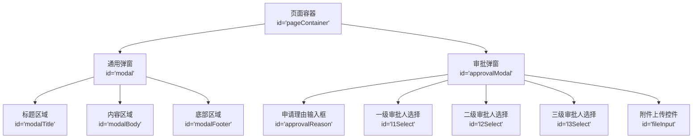
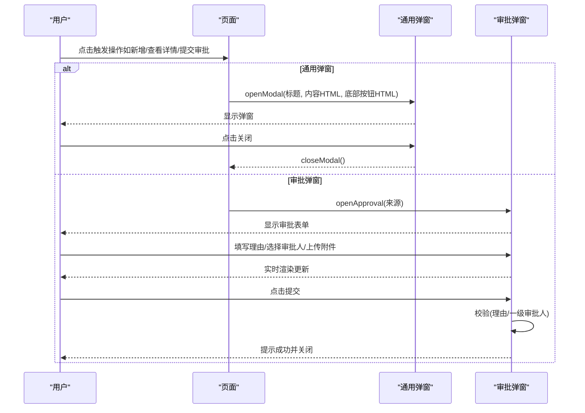
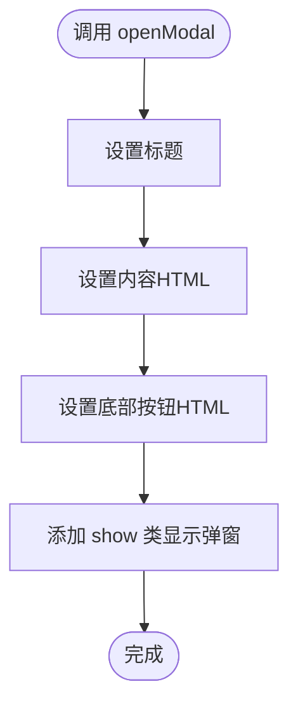
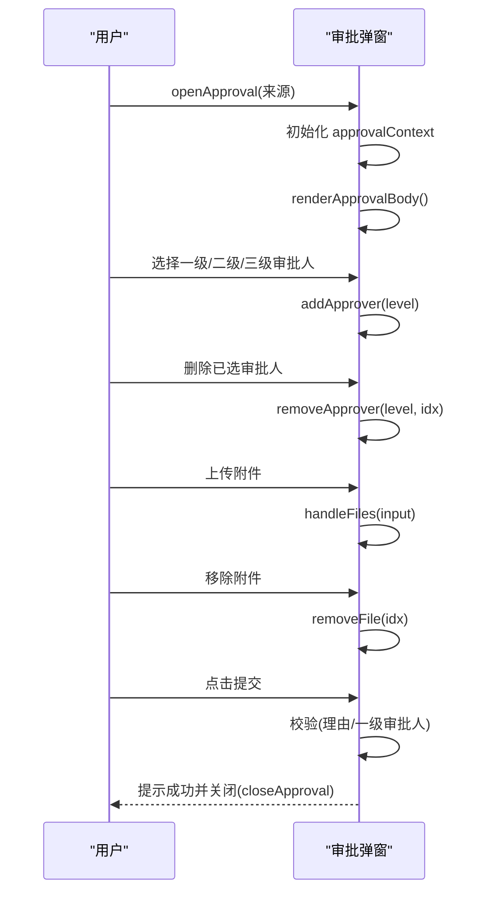
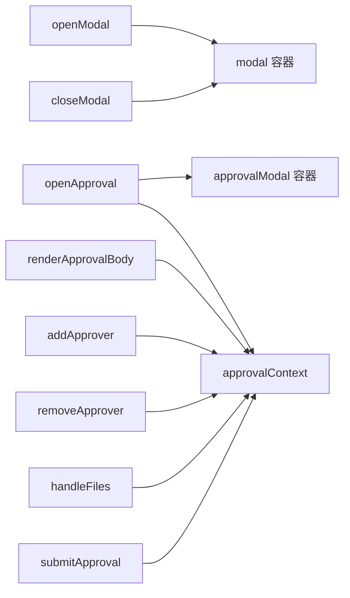

# 弹窗系统

<cite>
**本文引用的文件**   
- [sales-forecast-prototype.html](file://sales-forecast-prototype.html)
</cite>

## 目录
1. [简介](#简介)
2. [项目结构](#项目结构)
3. [核心组件](#核心组件)
4. [架构总览](#架构总览)
5. [详细组件分析](#详细组件分析)
6. [依赖关系分析](#依赖关系分析)
7. [性能与可用性建议](#性能与可用性建议)
8. [故障排查指南](#故障排查指南)
9. [结论](#结论)
10. [附录：扩展与自定义开发指南](#附录扩展与自定义开发指南)

## 简介
本文件面向销售预测原型中的“弹窗系统”，系统性说明通用弹窗（openModal、closeModal）的实现原理与使用方式，并重点解析审批弹窗（openApproval）的三级审批人选择、附件上传、表单校验等特性。文档同时覆盖弹窗生命周期管理、事件处理、数据传递机制，并提供扩展方法与自定义弹窗的开发指南，帮助读者快速理解并在现有基础上进行二次开发。

## 项目结构
该原型为单页应用，所有页面与弹窗逻辑集中在一个 HTML 文件中，通过内联样式与脚本实现。弹窗相关的关键元素包括：
- 通用弹窗容器：id="modal"，包含标题、内容区与底部操作区
- 审批弹窗容器：id="approvalModal"，包含申请理由、三级审批人选择、附件上传与提交/取消按钮
- 全局状态对象：approvalContext，用于保存审批弹窗上下文数据（来源、审批人、理由、附件）

图表来源
- [sales-forecast-prototype.html:127-139](file://sales-forecast-prototype.html#L127-L139)

章节来源
- [sales-forecast-prototype.html:127-139](file://sales-forecast-prototype.html#L127-L139)

## 核心组件
本节聚焦弹窗系统的核心函数与数据结构，解释其职责与交互流程。

- 通用弹窗
  - openModal(title, body, footer)：设置弹窗标题、内容与底部按钮，并显示弹窗
  - closeModal()：隐藏弹窗
- 审批弹窗
  - openApproval(source)：初始化审批上下文，渲染审批表单并显示弹窗
  - closeApproval()：关闭审批弹窗
  - renderApprovalBody()：根据 approvalContext 动态渲染审批表单（申请理由、三级审批人、附件列表）
  - addApprover(level)、removeApprover(level, idx)：添加/移除审批人
  - handleFiles(input)、removeFile(idx)：处理附件上传与移除
  - submitApproval()：表单校验与提交反馈

章节来源
- [sales-forecast-prototype.html:179-182](file://sales-forecast-prototype.html#L179-L182)
- [sales-forecast-prototype.html:185-280](file://sales-forecast-prototype.html#L185-L280)

## 架构总览
弹窗系统采用“单一容器 + 动态内容”的模式：
- 通用弹窗通过 openModal 注入任意 HTML 片段作为内容，适合轻量级提示、表单或详情查看
- 审批弹窗是专用弹窗，具备复杂交互（多级审批人选择、附件上传、实时校验），通过 approvalContext 维护状态

图表来源
- [sales-forecast-prototype.html:179-182](file://sales-forecast-prototype.html#L179-L182)
- [sales-forecast-prototype.html:185-280](file://sales-forecast-prototype.html#L185-L280)

## 详细组件分析

### 通用弹窗（openModal / closeModal）
- 功能要点
  - 动态设置标题、内容与底部按钮
  - 通过 CSS class 控制显示/隐藏
  - 支持任意 HTML 片段，便于复用
- 使用示例
  - 在页面中调用 openModal('标题', '内容HTML', '底部按钮HTML')
  - 在底部按钮中调用 closeModal() 关闭弹窗
- 注意事项
  - 内容区由 innerHTML 注入，注意 XSS 防护（原型环境可忽略）
  - 若需绑定事件，建议在注入后重新查询 DOM 并绑定

图表来源
- [sales-forecast-prototype.html:179-182](file://sales-forecast-prototype.html#L179-L182)

章节来源
- [sales-forecast-prototype.html:179-182](file://sales-forecast-prototype.html#L179-L182)

### 审批弹窗（openApproval）
- 功能要点
  - 三级审批人选择：一级必选（可多选，串行审批），二/三级可选（可多选）
  - 申请理由必填
  - 附件上传：支持图片、Excel、Word、PDF；单文件不超过 30MB，最多 3 个
  - 提交前校验：理由非空、至少选择一个一级审批人
  - 提交成功后生成审批单号并提示，随后关闭弹窗
- 数据模型
  - approvalContext：{ source, selectedL1[], selectedL2[], selectedL3[], reason, files[] }
- 交互流程

图表来源
- [sales-forecast-prototype.html:185-280](file://sales-forecast-prototype.html#L185-L280)

章节来源
- [sales-forecast-prototype.html:185-280](file://sales-forecast-prototype.html#L185-L280)

### 审批弹窗的生命周期与事件处理
- 生命周期
  - 打开：openApproval -> 初始化上下文 -> 渲染表单 -> 显示弹窗
  - 交互：用户选择审批人、上传附件、编辑理由
  - 关闭：closeApproval 或提交成功后自动关闭
- 事件处理
  - 审批人选择：addApprover、removeApprover
  - 附件上传：handleFiles、removeFile
  - 提交：submitApproval（含校验与反馈）

章节来源
- [sales-forecast-prototype.html:185-280](file://sales-forecast-prototype.html#L185-L280)

### 数据传递机制
- 通用弹窗
  - 通过参数传入 title、body、footer，直接注入到对应 DOM 节点
- 审批弹窗
  - 通过 approvalContext 共享状态，renderApprovalBody 读取并渲染
  - 用户操作修改 approvalContext，再触发重新渲染

章节来源
- [sales-forecast-prototype.html:179-182](file://sales-forecast-prototype.html#L179-L182)
- [sales-forecast-prototype.html:185-280](file://sales-forecast-prototype.html#L185-L280)

## 依赖关系分析
- 依赖关系
  - 通用弹窗依赖 DOM 选择器 $ 与 modal 容器
  - 审批弹窗依赖 SCM_USERS 列表、approvalContext 状态与多个子函数
- 耦合度
  - 通用弹窗与页面解耦，仅负责显示与关闭
  - 审批弹窗与业务数据（SCM_USERS）和状态（approvalContext）强耦合

图表来源
- [sales-forecast-prototype.html:179-182](file://sales-forecast-prototype.html#L179-L182)
- [sales-forecast-prototype.html:185-280](file://sales-forecast-prototype.html#L185-L280)

章节来源
- [sales-forecast-prototype.html:179-182](file://sales-forecast-prototype.html#L179-L182)
- [sales-forecast-prototype.html:185-280](file://sales-forecast-prototype.html#L185-L280)

## 性能与可用性建议
- 性能
  - 避免频繁 innerHTML 重绘，可在批量更新时合并渲染
  - 附件上传限制在前端校验，减少无效请求
- 可用性
  - 提供清晰的错误提示与操作指引
  - 对必填项进行即时校验与高亮提示
  - 支持键盘操作（Esc 关闭弹窗）

[本节为通用建议，不直接分析具体文件]

## 故障排查指南
- 常见问题
  - 弹窗未显示：检查 modal 容器的 class 是否被正确切换
  - 审批弹窗无法提交：确认申请理由与一级审批人是否填写
  - 附件上传失败：检查文件大小与格式是否符合限制
- 定位方法
  - 在浏览器控制台查看 alert 提示与错误信息
  - 检查 approvalContext 的状态变化是否正确

章节来源
- [sales-forecast-prototype.html:185-280](file://sales-forecast-prototype.html#L185-L280)

## 结论
弹窗系统以简洁的通用弹窗为基础，结合专用的审批弹窗满足复杂业务需求。通过统一的生命周期管理与清晰的数据传递机制，实现了良好的可扩展性与可维护性。在实际使用中，建议遵循现有模式进行扩展，确保一致的用户体验与代码质量。

[本节为总结性内容，不直接分析具体文件]

## 附录：扩展与自定义开发指南
- 扩展通用弹窗
  - 在 openModal 中增加更多配置项（如宽度、高度、遮罩层透明度）
  - 支持回调函数（onOpen、onClose、onConfirm）
- 自定义审批弹窗
  - 扩展审批级别（如四级审批）
  - 增加审批意见、抄送人员、电子签名等功能
  - 集成后端 API 进行真实提交与状态同步
- 最佳实践
  - 保持状态集中管理（如 approvalContext）
  - 分离 UI 渲染与业务逻辑
  - 提供单元测试覆盖关键交互路径

[本节为概念性指导，不直接分析具体文件]