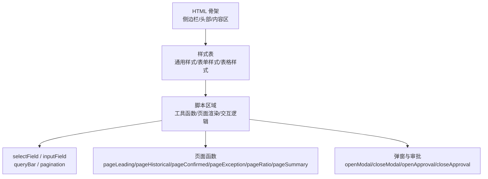
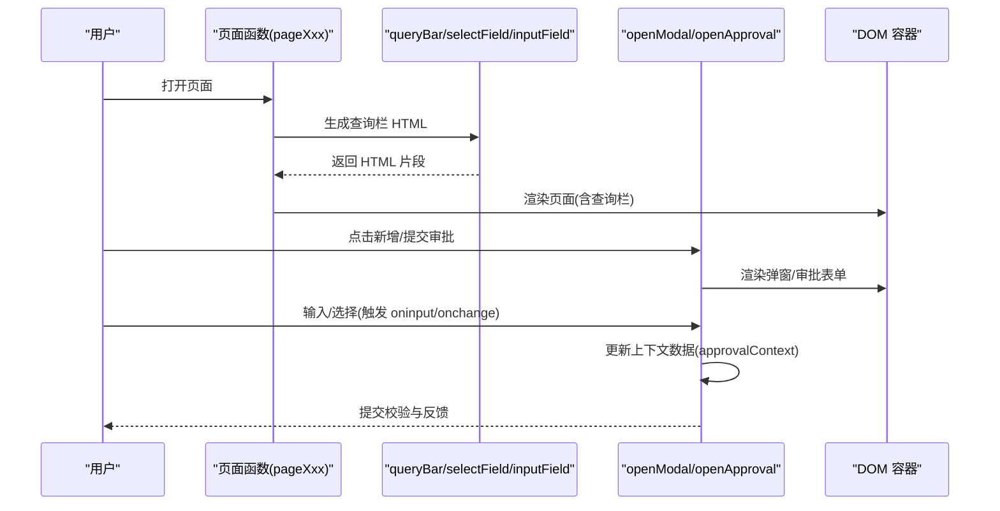
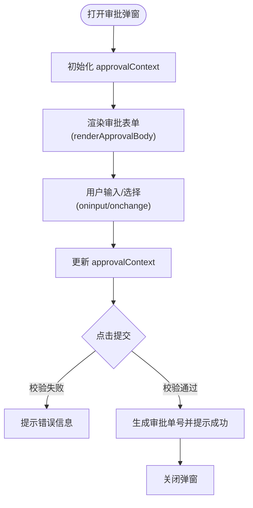
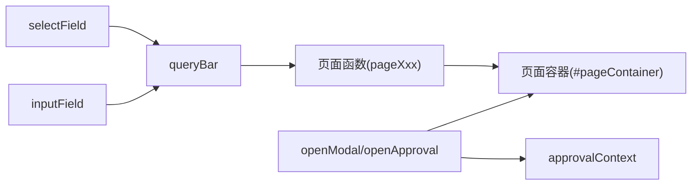

# 表单组件

<cite>
**本文引用的文件**   
- [sales-forecast-prototype.html](file://sales-forecast-prototype.html)
- [sales-forecast-prototype_副本.html](file://sales-forecast-prototype_副本.html)
</cite>

## 目录
1. [简介](#简介)
2. [项目结构](#项目结构)
3. [核心组件](#核心组件)
4. [架构总览](#架构总览)
5. [详细组件分析](#详细组件分析)
6. [依赖关系分析](#依赖关系分析)
7. [性能与可维护性建议](#性能与可维护性建议)
8. [故障排查指南](#故障排查指南)
9. [结论](#结论)
10. [附录：使用示例与最佳实践](#附录使用示例与最佳实践)

## 简介
本文件面向销售预测原型中的表单组件，重点说明 selectField、inputField 等输入组件的实现方式、样式定制、事件绑定机制，以及表单验证、数据绑定、动态生成等特性的使用方法。文档同时提供组合使用的最佳实践和常见问题解决方案，帮助读者快速掌握在原型中构建查询栏、弹窗表单、审批表单等场景的要点。

## 项目结构
本项目为单页高保真原型，包含页面布局、样式、脚本逻辑与多个页面渲染函数。表单相关能力集中在脚本区域，通过工具函数动态生成 HTML 片段并插入到页面容器中。

图表来源
- [sales-forecast-prototype.html:108-126](file://sales-forecast-prototype.html#L108-L126)
- [sales-forecast-prototype.html:140-188](file://sales-forecast-prototype.html#L140-L188)

章节来源
- [sales-forecast-prototype.html:108-126](file://sales-forecast-prototype.html#L108-L126)
- [sales-forecast-prototype.html:140-188](file://sales-forecast-prototype.html#L140-L188)

## 核心组件
- selectField(label, opts): 根据标签与选项数组生成下拉选择框 HTML 片段。
- inputField(label, placeholder): 根据标签与占位符生成文本输入框 HTML 片段。
- queryBar(fields): 将多个字段拼接成查询栏容器，内置“查询”“重置”按钮。
- pagination(total): 生成分页控件（每页条数、页码）。
- openModal(title, body, footer)/closeModal(): 通用弹窗显示与关闭。
- openApproval(source)/closeApproval()/renderApprovalBody(): 提交审批弹窗及审批人、附件管理。

这些组件以字符串模板形式返回 HTML，配合 CSS 类名实现统一样式；事件通过内联 onclick/onchange/oninput 绑定到全局函数或上下文变量。

章节来源
- [sales-forecast-prototype.html:167-178](file://sales-forecast-prototype.html#L167-L178)
- [sales-forecast-prototype.html:173-178](file://sales-forecast-prototype.html#L173-L178)
- [sales-forecast-prototype.html:167-172](file://sales-forecast-prototype.html#L167-L172)
- [sales-forecast-prototype.html:179-182](file://sales-forecast-prototype.html#L179-L182)
- [sales-forecast-prototype.html:184-280](file://sales-forecast-prototype.html#L184-L280)

## 架构总览
表单组件在整个页面渲染流程中的作用如下：
- 页面函数（如 pageLeading）调用 queryBar(selectField(...), inputField(...)) 生成查询条件。
- 查询结果触发页面重新渲染（当前原型未实现真实查询，仅展示 UI）。
- 弹窗与审批弹窗通过 openModal/openApproval 动态注入表单 HTML，并在 oninput/onchange 中更新上下文数据。

图表来源
- [sales-forecast-prototype.html:289-292](file://sales-forecast-prototype.html#L289-L292)
- [sales-forecast-prototype.html:173-178](file://sales-forecast-prototype.html#L173-L178)
- [sales-forecast-prototype.html:179-182](file://sales-forecast-prototype.html#L179-L182)
- [sales-forecast-prototype.html:184-280](file://sales-forecast-prototype.html#L184-L280)

## 详细组件分析

### selectField 组件
- 功能：接收 label 与 opts 数组，输出带 form-group/form-label 的下拉选择 HTML。
- 样式：继承 .form-group/.form-label 样式，默认最小宽度由 select 控制。
- 事件：当前版本未绑定 onchange，如需联动或过滤，可在外层包裹自定义事件处理。
- 扩展建议：增加 value、disabled、required、id 等属性支持，便于表单验证与数据绑定。

章节来源
- [sales-forecast-prototype.html:173-175](file://sales-forecast-prototype.html#L173-L175)
- [sales-forecast-prototype.html:46-51](file://sales-forecast-prototype.html#L46-L51)

### inputField 组件
- 功能：接收 label 与 placeholder，输出文本输入框 HTML。
- 样式：继承 .form-group/.form-label，固定宽度 160px，可通过 style 覆盖。
- 事件：无默认事件绑定，适合在父级表单中集中处理 oninput/onchange。
- 扩展建议：增加 type（number/date）、value、min/max、placeholder、disabled、required、id 等属性，增强可用性。

章节来源
- [sales-forecast-prototype.html:176-178](file://sales-forecast-prototype.html#L176-L178)
- [sales-forecast-prototype.html:46-51](file://sales-forecast-prototype.html#L46-L51)

### queryBar 组件
- 功能：将多个字段（selectField/inputField 等）拼接为查询栏，内含“查询”“重置”按钮。
- 使用：在各页面函数中通过 ${queryBar(selectField(...)+inputField(...))} 插入。
- 事件：按钮目前为静态，未绑定实际查询逻辑；可扩展为触发页面刷新或 API 调用。

章节来源
- [sales-forecast-prototype.html:170-172](file://sales-forecast-prototype.html#L170-L172)
- [sales-forecast-prototype.html:298-322](file://sales-forecast-prototype.html#L298-L322)

### 弹窗与审批表单
- openModal/closeModal：用于通用弹窗，支持标题、主体内容与底部按钮。
- openApproval/closeApproval/renderApprovalBody：审批弹窗，包含申请理由、多级审批人选择、附件上传与校验。
- 数据绑定：通过 approvalContext 对象保存状态，oninput/onchange 直接更新上下文。
- 验证：提交前检查必填项（申请理由、一级审批人），限制附件数量与大小。

图表来源
- [sales-forecast-prototype.html:184-280](file://sales-forecast-prototype.html#L184-L280)

章节来源
- [sales-forecast-prototype.html:179-182](file://sales-forecast-prototype.html#L179-L182)
- [sales-forecast-prototype.html:184-280](file://sales-forecast-prototype.html#L184-L280)

## 依赖关系分析
- 样式依赖：所有表单元素依赖 .form-group/.form-label 以及 input/select 基础样式。
- 脚本依赖：页面函数依赖 queryBar/selectField/inputField 生成 HTML；弹窗依赖 openModal/openApproval。
- 数据流：审批弹窗通过 approvalContext 集中管理状态，避免分散的全局变量。

图表来源
- [sales-forecast-prototype.html:170-178](file://sales-forecast-prototype.html#L170-L178)
- [sales-forecast-prototype.html:289-292](file://sales-forecast-prototype.html#L289-L292)
- [sales-forecast-prototype.html:184-280](file://sales-forecast-prototype.html#L184-L280)

章节来源
- [sales-forecast-prototype.html:170-178](file://sales-forecast-prototype.html#L170-L178)
- [sales-forecast-prototype.html:289-292](file://sales-forecast-prototype.html#L289-L292)
- [sales-forecast-prototype.html:184-280](file://sales-forecast-prototype.html#L184-L280)

## 性能与可维护性建议
- 减少重复字符串拼接：可将常用字段封装为配置对象，统一生成 HTML，降低模板复杂度。
- 事件委托：对动态生成的元素使用事件委托，避免大量内联 onclick。
- 表单验证集中化：将校验逻辑抽离为独立函数，提高复用性与可测试性。
- 样式模块化：将表单样式抽取为独立样式块，便于主题切换与复用。

[本节为通用建议，不直接分析具体文件]

## 故障排查指南
- 表单无法获取值：确认是否通过 oninput/onchange 更新上下文；若未绑定事件，需补充相应处理。
- 弹窗不显示：检查 openModal/openApproval 是否正确设置 innerHTML 与 classList.add('show')。
- 附件上传失败：确认 accept 属性与文件大小限制逻辑；注意最多 3 个文件的约束。
- 查询无效：当前原型未实现查询逻辑，需在“查询”按钮上绑定刷新或 API 调用。

章节来源
- [sales-forecast-prototype.html:168-172](file://sales-forecast-prototype.html#L168-L172)
- [sales-forecast-prototype.html:179-182](file://sales-forecast-prototype.html#L179-L182)
- [sales-forecast-prototype.html:263-273](file://sales-forecast-prototype.html#L263-L273)

## 结论
selectField 与 inputField 提供了简洁的表单字段生成能力，结合 queryBar 与弹窗/审批组件，能够快速搭建销售预测原型的查询与交互界面。建议在后续迭代中完善事件绑定、数据绑定与验证逻辑，提升可维护性与用户体验。

[本节为总结，不直接分析具体文件]

## 附录：使用示例与最佳实践
- 查询栏组合：在页面函数中使用 queryBar(selectField(...)+inputField(...)) 快速生成筛选条件。
- 弹窗表单：通过 openModal 传入动态 HTML，使用 form-group/form-label 保持样式一致。
- 审批表单：使用 openApproval 管理多级审批人与附件，确保必填项与大小限制。
- 数据绑定：优先使用 oninput/onchange 更新上下文对象，避免频繁 DOM 操作。
- 验证策略：在提交前进行集中校验，给出明确提示信息。

章节来源
- [sales-forecast-prototype.html:298-322](file://sales-forecast-prototype.html#L298-L322)
- [sales-forecast-prototype.html:360-380](file://sales-forecast-prototype.html#L360-L380)
- [sales-forecast-prototype.html:184-280](file://sales-forecast-prototype.html#L184-L280)