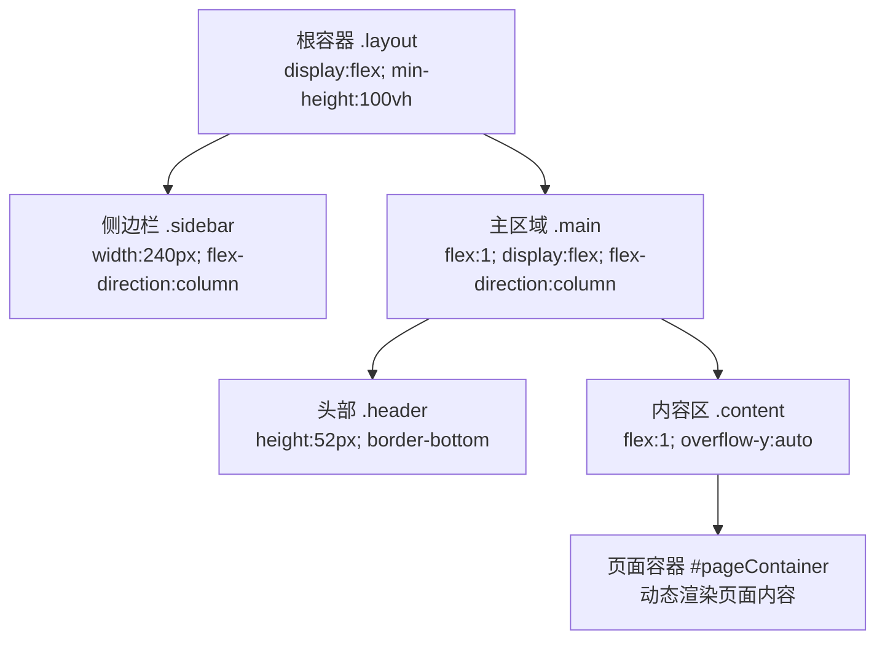
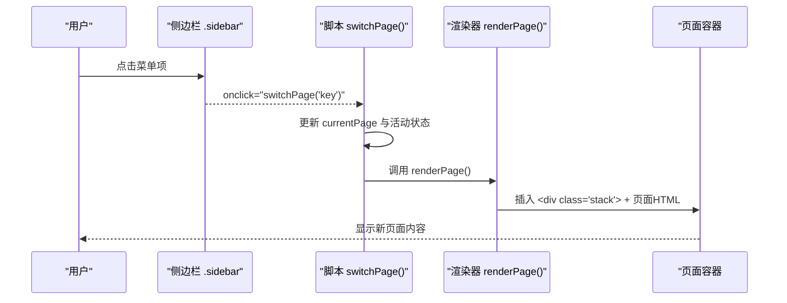
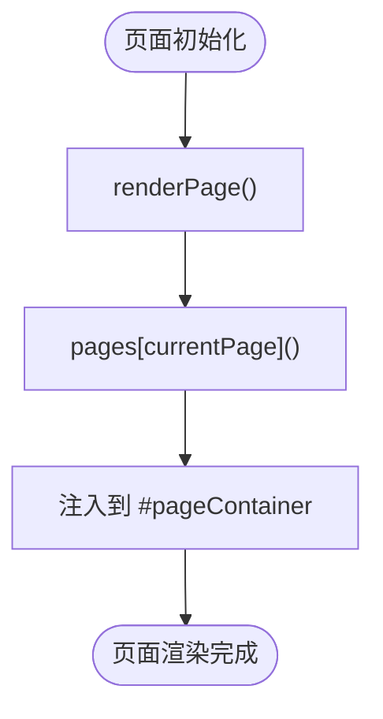

# 布局组件

<cite>
**本文档引用的文件**
- [sales-forecast-prototype.html](file://sales-forecast-prototype.html)
- [sales-forecast-prototype_副本.html](file://sales-forecast-prototype_副本.html)
</cite>

## 目录
1. [简介](#简介)
2. [项目结构](#项目结构)
3. [核心组件](#核心组件)
4. [架构总览](#架构总览)
5. [详细组件分析](#详细组件分析)
6. [依赖关系分析](#依赖关系分析)
7. [性能考量](#性能考量)
8. [故障排查指南](#故障排查指南)
9. [结论](#结论)
10. [附录](#附录)

## 简介
本文件面向销售预测原型的“布局组件”，系统性说明整体页面布局结构与样式实现，包括侧边栏导航（sidebar）、主内容区域（main）、头部（header）等核心布局元素；详解 CSS Grid 与 Flexbox 的使用方式、响应式布局的实现原理，以及各布局组件的样式定义与可定制选项；并提供布局组合模式与最佳实践，帮助开发者理解并扩展页面结构。

## 项目结构
原型采用单页应用（SPA）结构，所有页面通过 JavaScript 动态渲染到主内容区，布局由外层容器统一控制：
- 根容器 .layout：使用 Flex 布局，左侧固定宽度侧边栏，右侧自适应主内容区
- 侧边栏 .sidebar：垂直 Flex 列布局，包含 Logo、菜单组与底部信息
- 主区域 .main：Flex 列布局，包含头部 .header 与内容区 .content
- 内容区 .content：承载具体页面模块，内部使用 .stack/.row/.grid 等通用布局类

图表来源
- [sales-forecast-prototype.html:108-126](file://sales-forecast-prototype.html#L108-L126)

章节来源
- [sales-forecast-prototype.html:108-126](file://sales-forecast-prototype.html#L108-L126)

## 核心组件
- 布局容器 .layout
  - 作用：全局布局容器，左右分栏（侧边栏+主内容）
  - 关键属性：display:flex; min-height:100vh
- 侧边栏 .sidebar
  - 作用：导航菜单与品牌展示
  - 关键属性：width:240px; background:#001529; color:#8c99ab; display:flex; flex-direction:column; flex-shrink:0
  - 子组件：
    - .logo：品牌标识与图标
    - .menu-group：菜单分组，含 .menu-title 与 .menu-item
    - .sidebar-footer：版本信息
- 主区域 .main
  - 作用：承载头部与内容区
  - 关键属性：flex:1; display:flex; flex-direction:column; min-width:0; background:#f0f2f5
- 头部 .header
  - 作用：面包屑导航与当前页面标题
  - 关键属性：height:52px; background:#fff; border-bottom:1px solid #e8e8e8; display:flex; align-items:center; padding:0 24px
- 内容区 .content
  - 作用：页面内容滚动区域
  - 关键属性：flex:1; padding:20px 24px; overflow-y:auto

章节来源
- [sales-forecast-prototype.html:9-23](file://sales-forecast-prototype.html#L9-L23)
- [sales-forecast-prototype.html:108-126](file://sales-forecast-prototype.html#L108-L126)

## 架构总览
整体采用“布局容器 + 动态页面”的架构：
- 布局层：.layout 作为根容器，划分侧边栏与主区域
- 导航层：.sidebar 提供页面切换入口，点击后更新活动项与头部标题
- 渲染层：JavaScript 根据 currentPage 调用对应 pageXxx() 函数生成 HTML，注入 #pageContainer
- 组件层：页面内复用 .card/.table-wrap/.query-bar/.action-bar/.pagination 等通用组件

图表来源
- [sales-forecast-prototype.html:283-292](file://sales-forecast-prototype.html#L283-L292)

章节来源
- [sales-forecast-prototype.html:283-292](file://sales-forecast-prototype.html#L283-L292)

## 详细组件分析

### 侧边栏导航（Sidebar）
- 结构
  - .logo：品牌图标与名称
  - .menu-group：菜单分组，包含 .menu-title 与多个 .menu-item
  - .sidebar-footer：版本信息
- 交互
  - 点击 .menu-item 触发 switchPage(key)，更新活动项与头部标题
  - 活动项通过 .active 类高亮
- 样式要点
  - 固定宽度 240px，深色背景，文字色 #8c99ab
  - 菜单项 hover/active 状态通过背景与边框颜色变化反馈
  - 使用 gap 与 padding 控制间距与对齐

章节来源
- [sales-forecast-prototype.html:109-121](file://sales-forecast-prototype.html#L109-L121)
- [sales-forecast-prototype.html:283-288](file://sales-forecast-prototype.html#L283-L288)

### 头部（Header）
- 结构
  - 面包屑：.crumb / .crumb-sep / .curPage
- 功能
  - 显示当前页面名称，随页面切换更新
- 样式要点
  - 高度 52px，白底，下边框分隔
  - 居中对齐，文本大小与颜色区分层级

章节来源
- [sales-forecast-prototype.html:122-124](file://sales-forecast-prototype.html#L122-L124)
- [sales-forecast-prototype.html:283-288](file://sales-forecast-prototype.html#L283-L288)

### 内容区（Content）与页面容器
- 结构
  - .content：滚动区域，承载 #pageContainer
  - #pageContainer：动态渲染页面内容，包裹在 
 中
- 功能
  - 每个页面返回一段 HTML，包含查询栏、统计卡片、表格、分页等
- 样式要点
  - 自适应高度，溢出滚动
  - 内部使用 .stack 纵向堆叠组件

章节来源
- [sales-forecast-prototype.html:124-125](file://sales-forecast-prototype.html#L124-L125)
- [sales-forecast-prototype.html:289-292](file://sales-forecast-prototype.html#L289-L292)

### 通用布局类（Stack/Row/Grid）
- .stack：纵向堆叠，gap:12px
- .row：横向排列，align-items:center，支持换行
- .grid：CSS Grid 网格布局，提供 grid-2~grid-6 多列模板
- 用途
  - 统计卡片、表单字段、工具栏、分页等常用场景

章节来源
- [sales-forecast-prototype.html:24-28](file://sales-forecast-prototype.html#L24-L28)

### 卡片（Card）
- 结构
  - .card-header：标题与操作按钮
  - .card-body：内容区域，支持 sm/none 变体
- 用途
  - 数据概览、图表占位、表单区块等

章节来源
- [sales-forecast-prototype.html:29-32](file://sales-forecast-prototype.html#L29-L32)

### 表格（Table）
- 结构
  - .table-wrap：外框与滚动
  - table：标准表格，thead 固定顶部（sticky）
- 特性
  - 斑马纹行、右对齐数值列、居中列
  - 最小宽度控制以适应宽表

章节来源
- [sales-forecast-prototype.html:53-58](file://sales-forecast-prototype.html#L53-L58)

### 查询栏（QueryBar）与表单控件
- .query-bar：白色背景圆角卡片，内含表单字段与查询/重置按钮
- 表单控件
  - .form-group：标签与输入控件组合
  - input/select/textarea：统一边框、聚焦态与过渡效果

章节来源
- [sales-forecast-prototype.html:66-67](file://sales-forecast-prototype.html#L66-L67)
- [sales-forecast-prototype.html:46-52](file://sales-forecast-prototype.html#L46-L52)

### 分页（Pagination）
- 结构
  - 每页条数选择、记录总数、上一页/下一页、当前页码
- 样式
  - 按钮 hover/active/disabled 状态清晰

章节来源
- [sales-forecast-prototype.html:68-72](file://sales-forecast-prototype.html#L68-L72)

### 模态框（Modal）
- 结构
  - .modal-overlay：遮罩层
  - .modal：弹窗主体，包含 header/body/footer
- 交互
  - openModal/closeModal 控制显示与隐藏
  - 审批弹窗具备独立结构与逻辑

章节来源
- [sales-forecast-prototype.html:73-79](file://sales-forecast-prototype.html#L73-L79)
- [sales-forecast-prototype.html:127-139](file://sales-forecast-prototype.html#L127-L139)

### 月份单元格（m-cell）
- 结构
  - 显示修改前/修改后值，差异时以删除线与高亮表示
- 交互
  - 可选点击行为，用于钻取明细

章节来源
- [sales-forecast-prototype.html:80-85](file://sales-forecast-prototype.html#L80-L85)

### 图例（Legend）与图表占位（Chart Placeholder）
- .legend：图例说明，点状与文字组合
- .chart-placeholder：图表占位，渐变背景与虚线边框

章节来源
- [sales-forecast-prototype.html:86-88](file://sales-forecast-prototype.html#L86-L88)

## 依赖关系分析
- 布局与渲染
  - .layout 依赖 .sidebar 与 .main
  - .main 依赖 .header 与 .content
  - .content 依赖 #pageContainer 的动态渲染
- 交互流程
  - 侧边栏菜单项绑定 onclick=switchPage(key)
  - switchPage 更新 currentPage 与活动项，调用 renderPage
  - renderPage 根据 pages 映射调用对应 pageXxx() 生成 HTML
- 组件复用
  - queryBar、selectField、inputField、pagination、statusPill、sourceTag 等工具函数被多处复用

图表来源
- [sales-forecast-prototype.html:289-292](file://sales-forecast-prototype.html#L289-L292)

章节来源
- [sales-forecast-prototype.html:283-292](file://sales-forecast-prototype.html#L283-L292)

## 性能考量
- 渲染策略
  - 使用 innerHTML 直接注入 HTML，避免频繁 DOM 操作
  - 大表格建议按需加载或虚拟滚动（未来优化方向）
- 样式性能
  - 使用 CSS Grid/Flexbox 减少复杂嵌套
  - 避免过度阴影与动画，保持交互流畅
- 交互优化
  - 事件委托与最小化重绘，避免重复计算

[本节为通用指导，不直接分析具体文件]

## 故障排查指南
- 页面未切换
  - 检查 .menu-item 的 onclick 是否正确绑定 switchPage(key)
  - 确认 currentPage 与 PAGE_NAMES 映射一致
- 内容区空白
  - 检查 renderPage 是否成功调用对应 pageXxx()
  - 查看 #pageContainer 是否被正确注入
- 表格错位或溢出
  - 检查 table 的最小宽度设置
  - 确认 .table-wrap 的 overflow 属性
- 模态框不显示
  - 检查 .modal-overlay.show 类是否添加
  - 确认 openModal/closeModal 调用路径

章节来源
- [sales-forecast-prototype.html:283-292](file://sales-forecast-prototype.html#L283-L292)
- [sales-forecast-prototype.html:179-182](file://sales-forecast-prototype.html#L179-L182)

## 结论
该原型采用清晰的“布局容器 + 动态页面”架构，通过 Flexbox 与 CSS Grid 构建稳定且可扩展的页面结构。侧边栏、头部与内容区职责明确，通用组件与工具函数提升复用性。建议在后续迭代中引入更细粒度的组件封装与按需加载，进一步提升可维护性与性能。

[本节为总结，不直接分析具体文件]

## 附录

### CSS Grid 与 Flexbox 使用方式
- Flexbox
  - .layout：左右分栏（侧边栏固定宽度，主内容自适应）
  - .sidebar/.main：纵向堆叠布局，便于内部组件排列
  - .row：横向排列，支持换行与对齐
- CSS Grid
  - .grid：网格容器，配合 grid-2~grid-6 快速实现多列布局
  - 适用于统计卡片、表单字段、工具栏等场景

章节来源
- [sales-forecast-prototype.html:9-28](file://sales-forecast-prototype.html#L9-L28)

### 响应式布局实现原理
- 视口适配
  - viewport meta 确保移动端缩放正常
- 弹性布局
  - 使用 flex 与 min-width:0 防止主内容溢出
- 网格自适应
  - grid-template-columns 使用 1fr 自动分配空间
- 注意事项
  - 当前原型未使用媒体查询进行断点适配，可在需要时补充 @media 规则

章节来源
- [sales-forecast-prototype.html:4](file://sales-forecast-prototype.html#L4)
- [sales-forecast-prototype.html:22-28](file://sales-forecast-prototype.html#L22-L28)

### 布局组合模式与最佳实践
- 组合模式
  - 页面 = 查询栏 + 统计卡片 + 图表占位 + 表格 + 分页
  - 使用 .stack 纵向堆叠，.row 横向排列，.grid 多列布局
- 最佳实践
  - 保持组件职责单一，避免样式耦合
  - 使用语义化类名与一致的间距系统
  - 对大表格与长列表考虑虚拟化与分页
  - 交互反馈清晰（hover/active/disabled）

章节来源
- [sales-forecast-prototype.html:24-32](file://sales-forecast-prototype.html#L24-L32)
- [sales-forecast-prototype.html:53-72](file://sales-forecast-prototype.html#L53-L72)