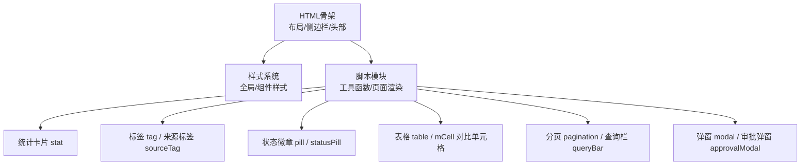
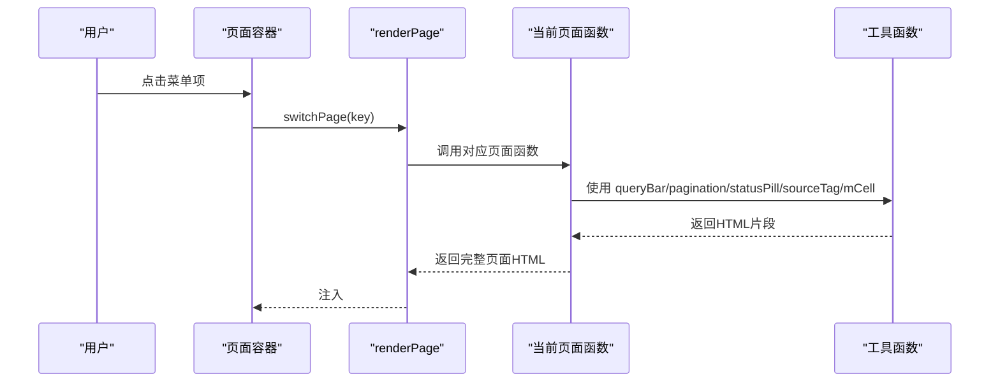
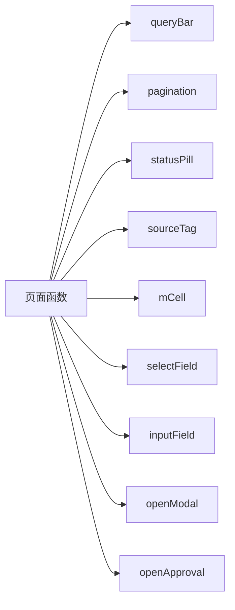

# 数据展示组件

<cite>
**本文档中引用的文件**   
- [sales-forecast-prototype.html](file://sales-forecast-prototype.html)
- [sales-forecast-prototype_副本.html](file://sales-forecast-prototype_副本.html)
</cite>

## 目录
1. [简介](#简介)
2. [项目结构](#项目结构)
3. [核心组件](#核心组件)
4. [架构总览](#架构总览)
5. [组件详解](#组件详解)
6. [依赖关系分析](#依赖关系分析)
7. [性能与可访问性](#性能与可访问性)
8. [故障排查指南](#故障排查指南)
9. [结论](#结论)
10. [附录：样式与主题](#附录样式与主题)

## 简介
本文件面向“销售预测原型”中的数据展示组件，系统性说明统计卡片（stat）、标签（tag）、状态徽章（pill）、表格（table）等元素的实现方式、样式定义、使用方法与自定义选项。同时覆盖数据格式化、状态显示、颜色主题、交互流程、可视化最佳实践与性能优化建议，帮助读者快速理解并扩展这些组件。

## 项目结构
该原型为单HTML文件，内嵌CSS与JS，采用“页面函数+模板字符串”的方式渲染各页面，并通过通用工具函数生成统计卡片、标签、状态徽章、表格单元格、分页与查询栏等UI片段。整体结构清晰，便于维护与扩展。

图表来源
- [sales-forecast-prototype.html:1-126](file://sales-forecast-prototype.html#L1-L126)
- [sales-forecast-prototype.html:140-188](file://sales-forecast-prototype.html#L140-L188)

章节来源
- [sales-forecast-prototype.html:1-126](file://sales-forecast-prototype.html#L1-L126)
- [sales-forecast-prototype.html:140-188](file://sales-forecast-prototype.html#L140-L188)

## 核心组件
- 统计卡片（stat）：用于关键指标概览，支持单位、描述、颜色语义化。
- 标签（tag）：用于分类、类型、趋势等轻量标识，提供多色变体。
- 状态徽章（pill）：用于业务状态流转，如草稿、审批中、已通过等。
- 表格（table）：承载大量结构化数据，含固定表头、对齐、操作列等。
- 月度对比单元格（mCell）：对比修改前后数值，突出差异。
- 分页（pagination）：统一的分页控件。
- 查询栏（queryBar）：统一的筛选表单容器。
- 弹窗（modal）：通用弹窗与审批弹窗，支持动态内容注入。

章节来源
- [sales-forecast-prototype.html:53-72](file://sales-forecast-prototype.html#L53-L72)
- [sales-forecast-prototype.html:157-175](file://sales-forecast-prototype.html#L157-L175)
- [sales-forecast-prototype.html:289-292](file://sales-forecast-prototype.html#L289-L292)

## 架构总览
页面由多个“页面函数”组成，每个函数返回一段HTML模板字符串，通过renderPage统一挂载到容器。工具函数负责生成可复用的UI片段，保证一致性与可维护性。

图表来源
- [sales-forecast-prototype.html:283-292](file://sales-forecast-prototype.html#L283-L292)
- [sales-forecast-prototype.html:148-175](file://sales-forecast-prototype.html#L148-L175)

## 组件详解

### 统计卡片（stat）
- 样式要点
  - 容器：card.stat，具备圆角、阴影与边框。
  - 标签：stat-label，灰色小字。
  - 数值：stat-value，大号加粗；单位stat-unit，灰色小字。
  - 描述：stat-desc，灰色小字。
  - 颜色语义：text-success/text-warning/text-primary等。
- 使用方法
  - 在grid布局中放置多个.card.stat形成指标面板。
  - 根据业务含义选择颜色类名以表达趋势或重要性。
- 自定义选项
  - 可通过外层容器调整padding与间距。
  - 数值单位与描述文案自由替换。
  - 颜色可通过text-*类或行内样式覆盖。
- 数据格式化
  - 金额/数量建议在数据层格式化后再渲染，或使用toLocaleString进行千分位。
- 示例路径
  - [先行指标预测统计卡片:295-304](file://sales-forecast-prototype.html#L295-L304)
  - [历史销售预测统计卡片:307-316](file://sales-forecast-prototype.html#L307-L316)
  - [确定性需求统计卡片:319-328](file://sales-forecast-prototype.html#L319-L328)

章节来源
- [sales-forecast-prototype.html:59](file://sales-forecast-prototype.html#L59)
- [sales-forecast-prototype.html:295-304](file://sales-forecast-prototype.html#L295-L304)
- [sales-forecast-prototype.html:307-316](file://sales-forecast-prototype.html#L307-L316)
- [sales-forecast-prototype.html:319-328](file://sales-forecast-prototype.html#L319-L328)

### 标签（tag）与来源标签（sourceTag）
- 样式要点
  - 基础：.tag，内联块、小字号、圆角。
  - 颜色变体：tag-blue/green/orange/red/gray。
  - 来源标签：sourceTag函数按数据类型映射背景与前景色。
- 使用方法
  - 直接插入span.tag包裹文本。
  - 使用sourceTag传入数据来源类型，自动着色。
- 自定义选项
  - 新增颜色变体可在CSS中添加.tag-{color}。
  - sourceTag的映射表可按需扩展。
- 示例路径
  - [标签样式定义:60-61](file://sales-forecast-prototype.html#L60-L61)
  - [来源标签函数:162-166](file://sales-forecast-prototype.html#L162-L166)
  - [表格中使用来源标签:447-452](file://sales-forecast-prototype.html#L447-L452)

章节来源
- [sales-forecast-prototype.html:60-61](file://sales-forecast-prototype.html#L60-L61)
- [sales-forecast-prototype.html:162-166](file://sales-forecast-prototype.html#L162-L166)
- [sales-forecast-prototype.html:447-452](file://sales-forecast-prototype.html#L447-L452)

### 状态徽章（pill）与状态映射（statusPill）
- 样式要点
  - 基础：.pill，胶囊形、中等字号、半透明背景。
  - 颜色映射：statusPill函数将状态文本映射为背景与前景色。
- 使用方法
  - 使用statusPill(statusText)生成带色的状态徽章。
  - 在表格操作列或汇总区域集中展示状态分布。
- 自定义选项
  - 扩展状态映射表即可支持新状态。
  - 可通过CSS覆盖默认配色。
- 示例路径
  - [状态徽章函数:157-161](file://sales-forecast-prototype.html#L157-L161)
  - [例外需求明细状态列:357-365](file://sales-forecast-prototype.html#L357-L365)
  - [汇总页状态条:448-452](file://sales-forecast-prototype.html#L448-L452)

章节来源
- [sales-forecast-prototype.html:62](file://sales-forecast-prototype.html#L62)
- [sales-forecast-prototype.html:157-161](file://sales-forecast-prototype.html#L157-L161)
- [sales-forecast-prototype.html:357-365](file://sales-forecast-prototype.html#L357-L365)
- [sales-forecast-prototype.html:448-452](file://sales-forecast-prototype.html#L448-L452)

### 表格（table）与对比单元格（mCell）
- 样式要点
  - 容器：.table-wrap，滚动与圆角。
  - 表头：th固定定位sticky，浅灰背景，分隔线。
  - 行交替：奇偶行不同背景提升可读性。
  - 对齐：td-right/td-center。
  - 对比单元格：m-cell，before/after双行显示，差异高亮。
- 使用方法
  - 构建thead/th列表，tbody中逐行渲染。
  - 对需要对比的字段使用mCell(before, after)。
  - 操作列使用按钮链接btn-link/btn-link-danger。
- 自定义选项
  - 列宽与最小宽度通过style="min-width:..."控制。
  - 可添加checkbox多选列。
  - 可结合tooltip展示长文本。
- 示例路径
  - [表格样式定义:53-58](file://sales-forecast-prototype.html#L53-L58)
  - [对比单元格函数:151-156](file://sales-forecast-prototype.html#L151-L156)
  - [例外需求汇总表:345-356](file://sales-forecast-prototype.html#L345-L356)
  - [例外需求明细表:357-365](file://sales-forecast-prototype.html#L357-L365)
  - [汇总明细表:447-452](file://sales-forecast-prototype.html#L447-L452)

章节来源
- [sales-forecast-prototype.html:53-58](file://sales-forecast-prototype.html#L53-L58)
- [sales-forecast-prototype.html:151-156](file://sales-forecast-prototype.html#L151-L156)
- [sales-forecast-prototype.html:345-365](file://sales-forecast-prototype.html#L345-L365)
- [sales-forecast-prototype.html:447-452](file://sales-forecast-prototype.html#L447-L452)

### 分页（pagination）与查询栏（queryBar）
- 样式要点
  - 分页：.pagination，左右布局，按钮hover与active态。
  - 查询栏：.query-bar，白底圆角，内部row排列。
- 使用方法
  - pagination(total)返回分页HTML。
  - queryBar(fields)接收字段HTML数组拼接成查询区。
  - selectField/inputField辅助生成表单控件。
- 自定义选项
  - 每页条数下拉框可配置。
  - 查询字段可自由组合。
- 示例路径
  - [分页函数:167-169](file://sales-forecast-prototype.html#L167-L169)
  - [查询栏函数:170-172](file://sales-forecast-prototype.html#L170-L172)
  - [表单辅助函数:173-178](file://sales-forecast-prototype.html#L173-L178)
  - [各页面查询栏使用:295-304](file://sales-forecast-prototype.html#L295-L304)

章节来源
- [sales-forecast-prototype.html:68-72](file://sales-forecast-prototype.html#L68-L72)
- [sales-forecast-prototype.html:167-178](file://sales-forecast-prototype.html#L167-L178)
- [sales-forecast-prototype.html:295-304](file://sales-forecast-prototype.html#L295-L304)

### 弹窗（modal）与审批弹窗（approvalModal）
- 样式要点
  - 遮罩：.modal-overlay，固定定位，半透明背景。
  - 弹窗：.modal，圆角、阴影、最大高度限制。
  - 头部/主体/底部：.modal-header/.modal-body/.modal-footer。
- 使用方法
  - openModal(title, body, footer)打开通用弹窗。
  - openApproval(source)打开审批弹窗，支持多级审批人选择与附件上传。
- 自定义选项
  - 弹窗尺寸可通过style.max-width调整。
  - 审批弹窗支持动态渲染审批人与附件列表。
- 示例路径
  - [通用弹窗](file://sales-forecast-prototype.html:128-L128)
  - [审批弹窗](file://sales-forecast-prototype.html:130-L139)
  - [openModal/closeModal](file://sales-forecast-prototype.html:179-L182)
  - [审批弹窗逻辑](file://sales-forecast-prototype.html:185-L280)

章节来源
- [sales-forecast-prototype.html:73-79](file://sales-forecast-prototype.html#L73-L79)
- [sales-forecast-prototype.html:128-139](file://sales-forecast-prototype.html#L128-L139)
- [sales-forecast-prototype.html:179-182](file://sales-forecast-prototype.html#L179-L182)
- [sales-forecast-prototype.html:185-280](file://sales-forecast-prototype.html#L185-L280)

## 依赖关系分析
- 页面函数依赖工具函数：所有页面渲染都依赖queryBar、pagination、selectField、inputField、statusPill、sourceTag、mCell等。
- 工具函数之间低耦合：各自独立生成HTML片段，便于复用与测试。
- 状态与颜色映射集中管理：statusPill与sourceTag的映射表集中定义，便于主题切换与扩展。

图表来源
- [sales-forecast-prototype.html:148-178](file://sales-forecast-prototype.html#L148-L178)
- [sales-forecast-prototype.html:289-292](file://sales-forecast-prototype.html#L289-L292)

章节来源
- [sales-forecast-prototype.html:148-178](file://sales-forecast-prototype.html#L148-L178)
- [sales-forecast-prototype.html:289-292](file://sales-forecast-prototype.html#L289-L292)

## 性能与可访问性
- 渲染策略
  - 使用模板字符串一次性拼接HTML，减少DOM操作次数。
  - 大表格建议使用虚拟滚动或分页加载，避免一次性渲染过多节点。
- 样式与主题
  - 颜色语义化（成功/警告/危险/主色）有助于无障碍阅读。
  - 对比度遵循WCAG标准，确保可读性。
- 交互体验
  - 按钮hover与active态反馈明确。
  - 表格固定表头提升长列表浏览效率。
- 可访问性建议
  - 为关键交互元素添加aria-label。
  - 表单控件关联label，确保键盘可达。
  - 图片与图标提供alt文本。

[本节为通用指导，不直接分析具体文件]

## 故障排查指南
- 状态显示异常
  - 检查statusPill映射是否包含该状态值。
  - 确认传入的状态文本与映射键一致。
- 标签颜色不正确
  - 检查sourceTag映射表是否包含该来源类型。
  - 确认CSS中是否存在对应的.tag-{color}类。
- 表格错位或溢出
  - 检查列宽与min-width设置。
  - 确认.m-cell与.m-before/.m-after样式生效。
- 弹窗无法关闭
  - 检查closeModal是否正确移除.show类。
  - 确认事件绑定未被覆盖。
- 审批弹窗提交失败
  - 校验必填项（申请理由、一级审批人）。
  - 检查附件数量与大小限制。

章节来源
- [sales-forecast-prototype.html:157-161](file://sales-forecast-prototype.html#L157-L161)
- [sales-forecast-prototype.html:162-166](file://sales-forecast-prototype.html#L162-L166)
- [sales-forecast-prototype.html:179-182](file://sales-forecast-prototype.html#L179-L182)
- [sales-forecast-prototype.html:274-280](file://sales-forecast-prototype.html#L274-L280)

## 结论
该原型通过简洁的HTML/CSS/JS实现了完善的数据展示组件体系，涵盖统计卡片、标签、状态徽章、表格、分页、查询栏与弹窗等常用元素。组件间职责清晰、复用性强，易于扩展与维护。建议在实际工程中进一步引入组件化框架与状态管理，以提升可测试性与性能表现。

[本节为总结，不直接分析具体文件]

## 附录：样式与主题
- 颜色体系
  - 主色：#1890ff
  - 成功：#52c41a
  - 警告：#faad14
  - 危险：#ff4d4f
  - 次要/中性：#8c8c8c/#bfbfbf/#f0f0f5
- 字体与排版
  - 系统字体栈，中文优先PingFang SC/Microsoft YaHei。
  - 字号层级：标题h2=20px，正文14px，辅助12px/11px。
- 组件样式
  - 卡片：圆角8px，阴影轻微，边框浅色。
  - 表格：固定表头、交替行背景、右对齐数值列。
  - 标签/徽章：小字号、圆角、语义化颜色。
- 主题扩展
  - 新增颜色变体：在CSS中添加.tag-{color}/.pill相关样式。
  - 新增状态：在statusPill映射表中添加键值对。
  - 新增来源类型：在sourceTag映射表中添加键值对。

章节来源
- [sales-forecast-prototype.html:7-42](file://sales-forecast-prototype.html#L7-L42)
- [sales-forecast-prototype.html:53-72](file://sales-forecast-prototype.html#L53-L72)
- [sales-forecast-prototype.html:157-166](file://sales-forecast-prototype.html#L157-L166)