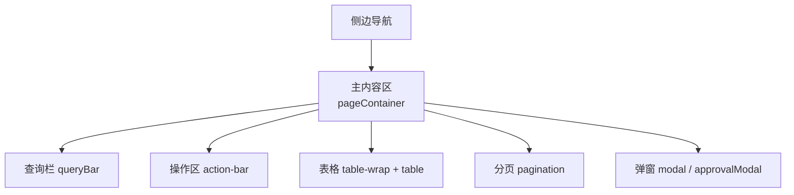
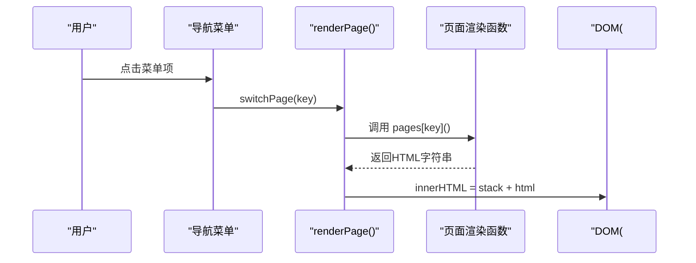
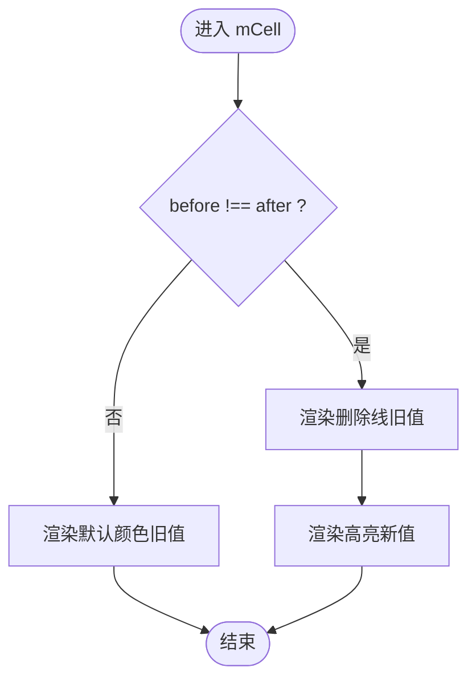
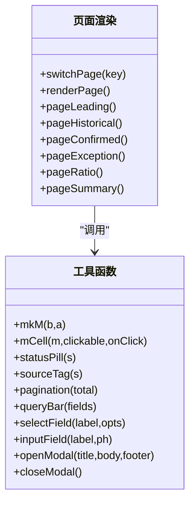

# 数据表格组件

<cite>
**本文档中引用的文件**   
- [sales-forecast-prototype.html](file://sales-forecast-prototype.html)
- [sales-forecast-prototype_副本.html](file://sales-forecast-prototype_副本.html)
</cite>

## 目录
1. [简介](#简介)
2. [项目结构](#项目结构)
3. [核心组件](#核心组件)
4. [架构总览](#架构总览)
5. [详细组件分析](#详细组件分析)
6. [依赖关系分析](#依赖关系分析)
7. [性能考量](#性能考量)
8. [故障排查指南](#故障排查指南)
9. [结论](#结论)
10. [附录](#附录)

## 简介
本文件面向销售预测原型中的数据表格（table）组件，系统性说明其整体布局、表头固定、行高亮等样式特性；深入解析 mCell 函数实现的“对比单元格”能力（修改前后数据对比显示、可点击交互）；并提供分页组件（pagination）、查询栏（queryBar）的使用方式与最佳实践。最后给出复杂表格场景的实现示例，包括多维度需求汇总表格与例外需求明细表等。

## 项目结构
该原型为单页应用，通过侧边导航切换页面，每个页面由对应渲染函数生成 HTML，包含：
- 查询栏（queryBar）
- 操作区（action-bar）
- 统计卡片（stat）
- 表格容器（table-wrap + table）
- 分页器（pagination）
- 弹窗（modal）与审批弹窗（approvalModal）

图表来源
- [sales-forecast-prototype.html:108-126](file://sales-forecast-prototype.html#L108-L126)
- [sales-forecast-prototype.html:128-139](file://sales-forecast-prototype.html#L128-L139)

章节来源
- [sales-forecast-prototype.html:108-126](file://sales-forecast-prototype.html#L108-L126)
- [sales-forecast-prototype.html:128-139](file://sales-forecast-prototype.html#L128-L139)

## 核心组件
- 表格容器与表头固定
  - 使用 .table-wrap 包裹 table，实现横向滚动与圆角边框
  - th 设置 position: sticky; top: 0; z-index: 1，实现表头固定
  - tr 奇偶行背景色交替，提升可读性
- 对比单元格 mCell
  - 输入对象 { before, after }，当 before !== after 时显示删除线与高亮的新值
  - 支持 clickable 模式与 onClick 回调，用于展开详情或跳转
- 分页 pagination
  - 展示每页条数选择、总记录数、页码按钮与当前页提示
- 查询栏 queryBar
  - 组合 selectField/inputField 字段，提供查询/重置按钮

章节来源
- [sales-forecast-prototype.html:53-58](file://sales-forecast-prototype.html#L53-L58)
- [sales-forecast-prototype.html:80-85](file://sales-forecast-prototype.html#L80-L85)
- [sales-forecast-prototype.html:167-172](file://sales-forecast-prototype.html#L167-L172)
- [sales-forecast-prototype.html:170-178](file://sales-forecast-prototype.html#L170-L178)

## 架构总览
页面渲染流程采用“函数式视图”模式：每个页面一个渲染函数，返回 HTML 字符串，注入到 #pageContainer。工具函数负责通用 UI 片段（mCell、pagination、queryBar）。

图表来源
- [sales-forecast-prototype.html:283-292](file://sales-forecast-prototype.html#L283-L292)

章节来源
- [sales-forecast-prototype.html:283-292](file://sales-forecast-prototype.html#L283-L292)

## 详细组件分析

### 表格整体布局与样式
- 容器与滚动
  - .table-wrap 提供 overflow:auto，确保宽表格可横向滚动
  - 圆角与边框统一视觉风格
- 表头固定
  - th 的 sticky 定位使表头在纵向滚动时始终可见
- 行高亮与可读性
  - tr:nth-child(even/odd) 交替背景
  - td-right/td-center 对齐辅助类
- 列宽与最小宽度
  - 复杂表格通过 style="min-width:..." 控制整体宽度，避免列挤压

章节来源
- [sales-forecast-prototype.html:53-58](file://sales-forecast-prototype.html#L53-L58)
- [sales-forecast-prototype.html:354-365](file://sales-forecast-prototype.html#L354-L365)

### 对比单元格 mCell 实现与用法
- 功能要点
  - 比较 before 与 after，若不同则显示删除线旧值与高亮新值
  - 支持 clickable 模式，鼠标悬停高亮，适合点击展开详情
  - 支持传入 onClick 回调，绑定具体交互逻辑
- 数据结构
  - mkM(beforeArr, afterArr) 生成 [{before, after}, ...] 数组
- 使用位置
  - 例外需求汇总表、销售预测3+9需求汇总（大区/国区/国家维度）均使用 mCell 渲染多个月度对比列

图表来源
- [sales-forecast-prototype.html:151-156](file://sales-forecast-prototype.html#L151-L156)

章节来源
- [sales-forecast-prototype.html:150-156](file://sales-forecast-prototype.html#L150-L156)
- [sales-forecast-prototype.html:331-336](file://sales-forecast-prototype.html#L331-L336)
- [sales-forecast-prototype.html:385-403](file://sales-forecast-prototype.html#L385-L403)

### 分页组件 pagination
- 参数
  - total: 总记录数
- 输出
  - 每页条数下拉（10/20/50/100）
  - 上一页/下一页按钮与当前页提示
- 使用建议
  - 结合后端分页或前端切片，动态更新 total 与页码状态

章节来源
- [sales-forecast-prototype.html:167-169](file://sales-forecast-prototype.html#L167-L169)

### 查询栏 queryBar
- 参数
  - fields: 由 selectField 与 inputField 拼接的 HTML 片段
- 输出
  - 一行表单控件 + 查询/重置按钮
- 使用建议
  - 将筛选条件与表格数据源联动，提交后刷新表格与分页

章节来源
- [sales-forecast-prototype.html:170-172](file://sales-forecast-prototype.html#L170-L172)
- [sales-forecast-prototype.html:173-178](file://sales-forecast-prototype.html#L173-L178)

### 复杂表格场景一：多维度需求汇总表格
- 维度
  - 大区维度、国区维度、国家维度
- 特点
  - 大量月度对比列（M月~M+12），使用 mCell 渲染
  - 图例说明“修改前/修改后”
  - 支持向下钻取（查看详情 →）
- 关键实现
  - 通过 M_LABELS 定义月份标签
  - 使用 mkM 生成对比数据数组
  - 国家维度下对某月单元格启用 clickable，点击弹出当月明细弹窗

章节来源
- [sales-forecast-prototype.html:142-143](file://sales-forecast-prototype.html#L142-L143)
- [sales-forecast-prototype.html:385-403](file://sales-forecast-prototype.html#L385-L403)
- [sales-forecast-prototype.html:412-445](file://sales-forecast-prototype.html#L412-L445)

### 复杂表格场景二：例外需求明细表
- 特点
  - 超宽列集（单据号、行号、审批单号、需求类型、区域、产品、数量、金额、运输、贸易术语、客户、时间戳、版本、审批状态、操作等）
  - “生效数量(修改前/修改后)”两列根据差异高亮显示
  - 操作列按审批状态动态禁用/启用编辑与删除
- 关键实现
  - 行内计算 ch = qtyBefore !== qtyAfter，控制样式与字体粗细
  - 状态胶囊 statusPill 展示审批状态
  - 批量操作（新增、提交审批、撤回、废弃、编辑、删除、导入、下载模板）

章节来源
- [sales-forecast-prototype.html:337-344](file://sales-forecast-prototype.html#L337-L344)
- [sales-forecast-prototype.html:356-365](file://sales-forecast-prototype.html#L356-L365)

### 审批弹窗与附件上传
- 功能
  - 申请理由必填
  - 三级审批人选择（一级必选，串行；二级/三级可选）
  - 附件上传（限制数量与大小）
- 交互
  - 打开/关闭弹窗
  - 添加/移除审批人与附件
  - 提交校验并生成审批单号

章节来源
- [sales-forecast-prototype.html:184-280](file://sales-forecast-prototype.html#L184-L280)

## 依赖关系分析
- 页面渲染依赖
  - renderPage 根据 currentPage 调用对应页面函数
  - 页面函数依赖工具函数：mkM、mCell、statusPill、sourceTag、pagination、queryBar、selectField、inputField、openModal、closeModal
- 数据与视图
  - 数据以常量数组形式定义（如 excSummRows、regionRows、zoneRows、countryRows、summaryDetailRows）
  - 视图通过模板字符串拼接渲染

图表来源
- [sales-forecast-prototype.html:148-178](file://sales-forecast-prototype.html#L148-L178)
- [sales-forecast-prototype.html:283-292](file://sales-forecast-prototype.html#L283-L292)

章节来源
- [sales-forecast-prototype.html:148-178](file://sales-forecast-prototype.html#L148-L178)
- [sales-forecast-prototype.html:283-292](file://sales-forecast-prototype.html#L283-L292)

## 性能考量
- 大表格渲染
  - 超宽列（如例外需求明细表）建议使用虚拟滚动或分页加载，减少一次性渲染节点数
- 对比单元格
  - mCell 每次渲染都进行字符串拼接，数据量大时可考虑缓存或按需渲染
- 事件绑定
  - 内联 onclick 在大数据量时可能影响性能，建议改用事件委托
- 滚动体验
  - sticky 表头在超长表格中需确保父容器高度与滚动区域正确设置

[本节为通用指导，不直接分析具体文件]

## 故障排查指南
- 表头未固定
  - 检查 th 是否设置了 position: sticky; top: 0; z-index: 1
  - 确认 .table-wrap 存在且允许纵向滚动
- 对比单元格不显示差异
  - 检查 before 与 after 是否严格不等（类型一致）
  - 确认传入的是 mkM 生成的对象数组
- 分页不更新
  - 检查 pagination(total) 的 total 是否正确传入
  - 确认查询后触发了重新渲染
- 弹窗无法关闭
  - 检查 modal-overlay 的 show 类名切换逻辑
  - 确认 closeModal 被正确调用

章节来源
- [sales-forecast-prototype.html:53-58](file://sales-forecast-prototype.html#L53-L58)
- [sales-forecast-prototype.html:167-172](file://sales-forecast-prototype.html#L167-L172)
- [sales-forecast-prototype.html:179-182](file://sales-forecast-prototype.html#L179-L182)

## 结论
该数据表格组件以简洁的工具函数为核心，配合统一的样式体系，实现了表头固定、行高亮、对比单元格、分页与查询栏等常用能力。在多维度需求汇总与例外需求明细等复杂场景中，mCell 的对比展示与可点击交互显著提升了数据可读性与操作效率。建议在真实项目中引入虚拟滚动与事件委托优化性能，并将工具函数抽象为独立模块以提升复用性。

[本节为总结，不直接分析具体文件]

## 附录

### 使用示例：构建一个带对比单元格的表格
- 步骤
  - 准备数据：使用 mkM(beforeArr, afterArr) 生成对比数组
  - 渲染列：在 <td> 中调用 mCell(item, clickable=false, onClick=null)
  - 如需点击：设置 clickable=true 并传入 onClick 回调
- 参考路径
  - 对比数据构造：[sales-forecast-prototype.html:150](file://sales-forecast-prototype.html#L150)
  - 对比单元格渲染：[sales-forecast-prototype.html:151-156](file://sales-forecast-prototype.html#L151-L156)
  - 国家维度点击展开：[sales-forecast-prototype.html:440-445](file://sales-forecast-prototype.html#L440-L445)

### 使用示例：分页与查询栏集成
- 步骤
  - 在页面顶部插入 queryBar(selectField(...)+inputField(...))
  - 查询按钮触发数据过滤与重新渲染
  - 底部插入 pagination(total) 展示分页信息
- 参考路径
  - 查询栏与字段：[sales-forecast-prototype.html:170-178](file://sales-forecast-prototype.html#L170-L178)
  - 分页器：[sales-forecast-prototype.html:167-169](file://sales-forecast-prototype.html#L167-L169)

### 复杂表格参考
- 例外需求汇总表（双Tab）
  - 汇总视图：[sales-forecast-prototype.html:345-355](file://sales-forecast-prototype.html#L345-L355)
  - 明细视图：[sales-forecast-prototype.html:356-365](file://sales-forecast-prototype.html#L356-L365)
- 销售预测3+9需求汇总（四Tab）
  - 大区维度：[sales-forecast-prototype.html:423-429](file://sales-forecast-prototype.html#L423-L429)
  - 国区维度：[sales-forecast-prototype.html:431-437](file://sales-forecast-prototype.html#L431-L437)
  - 国家维度：[sales-forecast-prototype.html:439-445](file://sales-forecast-prototype.html#L439-L445)
  - 明细表：[sales-forecast-prototype.html:447-453](file://sales-forecast-prototype.html#L447-L453)

章节来源
- [sales-forecast-prototype.html:345-365](file://sales-forecast-prototype.html#L345-L365)
- [sales-forecast-prototype.html:412-453](file://sales-forecast-prototype.html#L412-L453)