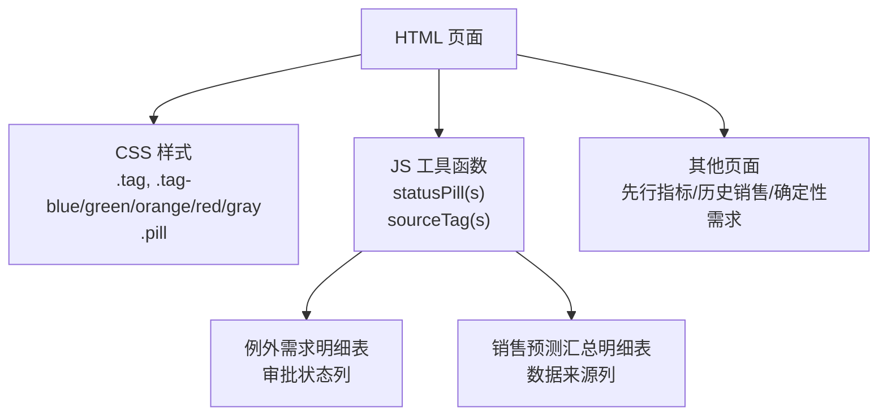
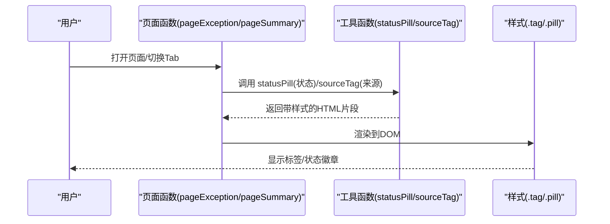
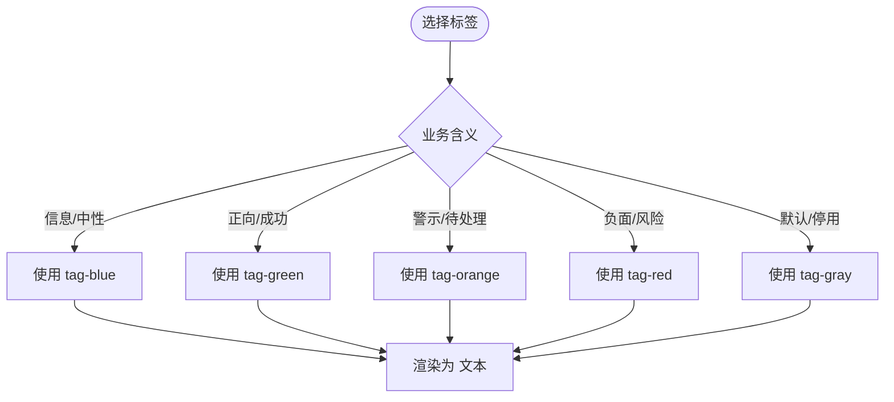
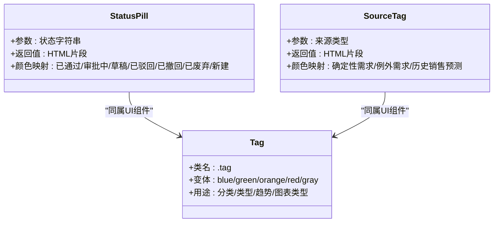
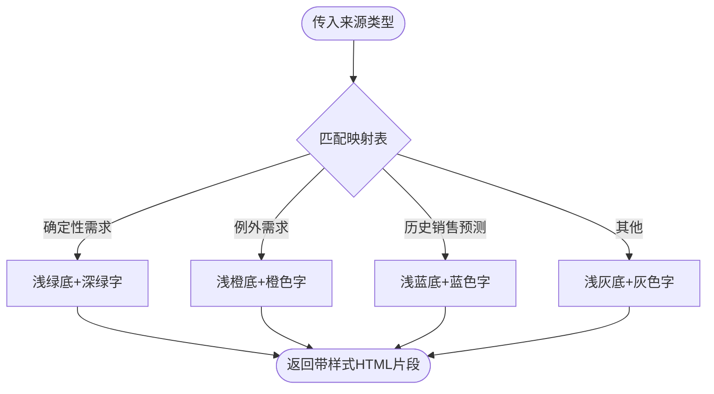
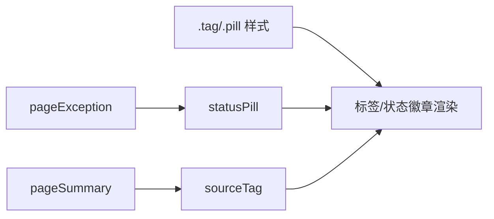

# 标签和状态徽章

<cite>
**本文档中引用的文件**   
- [sales-forecast-prototype.html](file://sales-forecast-prototype.html)
- [sales-forecast-prototype_副本.html](file://sales-forecast-prototype_副本.html)
</cite>

## 目录
1. [简介](#简介)
2. [项目结构](#项目结构)
3. [核心组件](#核心组件)
4. [架构总览](#架构总览)
5. [详细组件分析](#详细组件分析)
6. [依赖关系分析](#依赖关系分析)
7. [性能考虑](#性能考虑)
8. [故障排查指南](#故障排查指南)
9. [结论](#结论)
10. [附录：使用示例与最佳实践](#附录使用示例与最佳实践)

## 简介
本文件面向销售预测原型中的“标签(tag)”和“状态徽章(pill)”组件，系统性说明各类标签的样式与适用场景、状态徽章的颜色映射规则（已通过、审批中、草稿、已驳回等），以及数据来源标签显示逻辑（sourceTag）。同时提供在业务页面中的正确使用方式与最佳实践，帮助设计与开发团队统一视觉表达与交互体验。

## 项目结构
- 两个HTML文件均包含统一的CSS样式与JS工具函数，用于渲染表格、卡片、分页、弹窗及标签/状态徽章。
- 标签与状态徽章的核心实现集中在样式类与工具函数中，被多个页面函数复用。

图表来源
- [sales-forecast-prototype.html:60-62](file://sales-forecast-prototype.html#L60-L62)
- [sales-forecast-prototype.html:157-166](file://sales-forecast-prototype.html#L157-L166)
- [sales-forecast-prototype_副本.html:68-70](file://sales-forecast-prototype_副本.html#L68-L70)
- [sales-forecast-prototype_副本.html:151-160](file://sales-forecast-prototype_副本.html#L151-L160)

章节来源
- [sales-forecast-prototype.html:60-62](file://sales-forecast-prototype.html#L60-L62)
- [sales-forecast-prototype.html:157-166](file://sales-forecast-prototype.html#L157-L166)
- [sales-forecast-prototype_副本.html:68-70](file://sales-forecast-prototype_副本.html#L68-L70)
- [sales-forecast-prototype_副本.html:151-160](file://sales-forecast-prototype_副本.html#L151-L160)

## 核心组件
- 标签(tag)
  - 基础样式类：.tag
  - 颜色变体：.tag-blue、.tag-green、.tag-orange、.tag-red、.tag-gray
  - 用途：分类、类型、趋势、图表类型等轻量级标识
- 状态徽章(pill)
  - 基础样式类：.pill
  - 通过 statusPill(status) 动态生成背景色与文字色
  - 用途：审批流程状态、启用/停用等状态展示
- 数据来源标签(sourceTag)
  - 通过 sourceTag(sourceType) 根据来源类型渲染不同颜色的标签
  - 用途：区分“确定性需求”“例外需求”“历史销售预测”等来源

章节来源
- [sales-forecast-prototype.html:60-62](file://sales-forecast-prototype.html#L60-L62)
- [sales-forecast-prototype.html:157-166](file://sales-forecast-prototype.html#L157-L166)
- [sales-forecast-prototype_副本.html:68-70](file://sales-forecast-prototype_副本.html#L68-L70)
- [sales-forecast-prototype_副本.html:151-160](file://sales-forecast-prototype_副本.html#L151-L160)

## 架构总览
标签与状态徽章由“样式层 + 工具函数层 + 页面渲染层”构成：
- 样式层定义通用外观与颜色语义
- 工具函数将业务值映射为带样式的HTML片段
- 页面函数在表格或统计区调用工具函数进行渲染

图表来源
- [sales-forecast-prototype.html:157-166](file://sales-forecast-prototype.html#L157-L166)
- [sales-forecast-prototype.html:356-364](file://sales-forecast-prototype.html#L356-L364)
- [sales-forecast-prototype.html:447-452](file://sales-forecast-prototype.html#L447-L452)

## 详细组件分析

### 标签(tag)样式与使用场景
- 基础样式
  - 内联块元素、小字号、圆角、内边距适中，适合行内标注
- 颜色变体与语义
  - tag-blue：信息型、中性说明（如“月度”“柱状图”“堆叠图”）
  - tag-green：正向结果（如“上升”“已确认”）
  - tag-orange：警示或待处理（如“临时大单”“紧急调拨”）
  - tag-red：负面或风险（如“下降”）
  - tag-gray：默认/未激活（如“停用”）
- 典型使用位置
  - 卡片标题右侧：图表类型或时间维度
  - 表格列：趋势、需求类型、状态等
  - 统计区：启用/停用等开关态

章节来源
- [sales-forecast-prototype.html:60-62](file://sales-forecast-prototype.html#L60-L62)
- [sales-forecast-prototype.html:302](file://sales-forecast-prototype.html#L302)
- [sales-forecast-prototype.html:326](file://sales-forecast-prototype.html#L326)
- [sales-forecast-prototype.html:362](file://sales-forecast-prototype.html#L362)
- [sales-forecast-prototype_副本.html:68-70](file://sales-forecast-prototype_副本.html#L68-L70)
- [sales-forecast-prototype_副本.html:198](file://sales-forecast-prototype_副本.html#L198)
- [sales-forecast-prototype_副本.html:222](file://sales-forecast-prototype_副本.html#L222)
- [sales-forecast-prototype_副本.html:262](file://sales-forecast-prototype_副本.html#L262)

### 状态徽章(statusPill)颜色映射规则
- 输入：状态字符串（如“已通过”“审批中”“草稿”“已驳回”“已撤回”“已废弃”“新建”）
- 输出：带背景色与文字色的 pill 片段
- 颜色映射
  - 已通过：浅绿底+深绿字
  - 审批中：浅蓝底+蓝色字
  - 草稿：浅灰底+灰色字
  - 已驳回：浅红底+红色字
  - 已撤回：浅橙底+橙色字
  - 已废弃：极浅灰底+浅灰字
  - 新建：浅灰底+灰色字（主版本新增）
- 使用位置
  - 例外需求明细表的“审批状态”列
  - 销售预测汇总明细表的“审批状态”列
  - 顶部状态条（用于展示状态流转提示）

图表来源
- [sales-forecast-prototype.html:157-161](file://sales-forecast-prototype.html#L157-L161)
- [sales-forecast-prototype_副本.html:151-155](file://sales-forecast-prototype_副本.html#L151-L155)

章节来源
- [sales-forecast-prototype.html:157-161](file://sales-forecast-prototype.html#L157-L161)
- [sales-forecast-prototype.html:362](file://sales-forecast-prototype.html#L362)
- [sales-forecast-prototype.html:450](file://sales-forecast-prototype.html#L450)
- [sales-forecast-prototype_副本.html:151-155](file://sales-forecast-prototype_副本.html#L151-L155)
- [sales-forecast-prototype_副本.html:262](file://sales-forecast-prototype_副本.html#L262)

### 数据来源标签(sourceTag)显示逻辑
- 输入：来源类型字符串（如“确定性需求”“例外需求”“历史销售预测”）
- 输出：带背景色与文字色的 tag 片段
- 颜色映射
  - 确定性需求：浅绿底+深绿字
  - 例外需求：浅橙底+橙色字
  - 历史销售预测：浅蓝底+蓝色字
  - 未知来源：默认浅灰底+灰色字
- 使用位置
  - 销售预测汇总明细表的“数据来源(需求预测类型)”列
  - 国家维度点击单元格弹出的详情表中，作为数据来源标识

图表来源
- [sales-forecast-prototype.html:162-166](file://sales-forecast-prototype.html#L162-L166)
- [sales-forecast-prototype.html:443](file://sales-forecast-prototype.html#L443)
- [sales-forecast-prototype.html:451](file://sales-forecast-prototype.html#L451)
- [sales-forecast-prototype_副本.html:156-160](file://sales-forecast-prototype_副本.html#L156-L160)

章节来源
- [sales-forecast-prototype.html:162-166](file://sales-forecast-prototype.html#L162-L166)
- [sales-forecast-prototype.html:443](file://sales-forecast-prototype.html#L443)
- [sales-forecast-prototype.html:451](file://sales-forecast-prototype.html#L451)
- [sales-forecast-prototype_副本.html:156-160](file://sales-forecast-prototype_副本.html#L156-L160)

### 在页面中的具体应用
- 例外需求明细表
  - “需求类型”列使用 tag-orange 表示临时大单/紧急调拨等
  - “审批状态”列使用 statusPill 渲染状态徽章
- 销售预测汇总明细表
  - “数据来源(需求预测类型)”列使用 sourceTag 渲染来源标签
  - “需求类型”列使用 tag-blue 表示预测需求/合同订单等
  - “审批状态”列使用 statusPill 渲染状态徽章
- 其他页面
  - 先行指标趋势卡片的图表类型标签使用 tag-blue
  - 确定性需求列表的状态列使用 tag-green/tag-orange

章节来源
- [sales-forecast-prototype.html:362](file://sales-forecast-prototype.html#L362)
- [sales-forecast-prototype.html:451](file://sales-forecast-prototype.html#L451)
- [sales-forecast-prototype.html:302](file://sales-forecast-prototype.html#L302)
- [sales-forecast-prototype.html:326](file://sales-forecast-prototype.html#L326)
- [sales-forecast-prototype_副本.html:198](file://sales-forecast-prototype_副本.html#L198)
- [sales-forecast-prototype_副本.html:222](file://sales-forecast-prototype_副本.html#L222)
- [sales-forecast-prototype_副本.html:262](file://sales-forecast-prototype_副本.html#L262)

## 依赖关系分析
- 样式依赖
  - .tag 与 .pill 是基础样式；颜色变体通过附加类名实现
- 函数依赖
  - statusPill 与 sourceTag 仅依赖内置映射表，不依赖外部库
- 页面依赖
  - pageException 与 pageSummary 分别调用 statusPill 与 sourceTag 渲染对应列

图表来源
- [sales-forecast-prototype.html:60-62](file://sales-forecast-prototype.html#L60-L62)
- [sales-forecast-prototype.html:157-166](file://sales-forecast-prototype.html#L157-L166)
- [sales-forecast-prototype.html:356-364](file://sales-forecast-prototype.html#L356-L364)
- [sales-forecast-prototype.html:447-452](file://sales-forecast-prototype.html#L447-L452)

章节来源
- [sales-forecast-prototype.html:60-62](file://sales-forecast-prototype.html#L60-L62)
- [sales-forecast-prototype.html:157-166](file://sales-forecast-prototype.html#L157-L166)
- [sales-forecast-prototype.html:356-364](file://sales-forecast-prototype.html#L356-L364)
- [sales-forecast-prototype.html:447-452](file://sales-forecast-prototype.html#L447-L452)

## 性能考虑
- 渲染开销
  - 标签与状态徽章为轻量级HTML片段，渲染成本极低
- 可优化点
  - 若数据量大，可在批量渲染时缓存映射表结果，减少重复计算
  - 避免频繁重建DOM，优先使用局部更新

[本节为通用指导，无需引用具体文件]

## 故障排查指南
- 状态徽章颜色不正确
  - 检查传入的状态字符串是否与映射键一致（如“已通过”“审批中”“草稿”“已驳回”“已撤回”“已废弃”“新建”）
  - 若未命中映射，将回退到默认浅灰底+灰色字
- 数据来源标签颜色异常
  - 检查传入的来源类型是否为“确定性需求”“例外需求”“历史销售预测”之一
  - 未知来源会回退到默认样式
- 样式类缺失
  - 确保页面包含 .tag 与 .pill 的基础样式，以及对应的颜色变体类名

章节来源
- [sales-forecast-prototype.html:157-166](file://sales-forecast-prototype.html#L157-L166)
- [sales-forecast-prototype_副本.html:151-160](file://sales-forecast-prototype_副本.html#L151-L160)

## 结论
标签与状态徽章组件通过统一的样式与工具函数，实现了清晰、一致的视觉表达。statusPill 与 sourceTag 将业务语义转化为直观的颜色映射，便于用户在复杂表格中快速识别关键信息。遵循本文档的使用规范与最佳实践，可有效提升用户体验与一致性。

[本节为总结性内容，无需引用具体文件]

## 附录：使用示例与最佳实践
- 标签(tag)使用建议
  - 信息型描述用 tag-blue（如“月度”“柱状图”）
  - 正向结果用 tag-green（如“上升”“已确认”）
  - 警示或待处理用 tag-orange（如“临时大单”“紧急调拨”）
  - 负面或风险用 tag-red（如“下降”）
  - 默认/停用用 tag-gray（如“停用”）
- 状态徽章(statusPill)使用建议
  - 严格使用映射内的状态字符串，避免自由文本导致样式不一致
  - 在状态流转区域（如顶部提示条）集中展示所有可能状态，帮助用户理解流程
- 数据来源标签(sourceTag)使用建议
  - 仅在明确来源类型的字段中使用，保持语义清晰
  - 在跨维度钻取（如国家维度点击展开）时，保留来源标签以增强上下文

章节来源
- [sales-forecast-prototype.html:302](file://sales-forecast-prototype.html#L302)
- [sales-forecast-prototype.html:326](file://sales-forecast-prototype.html#L326)
- [sales-forecast-prototype.html:362](file://sales-forecast-prototype.html#L362)
- [sales-forecast-prototype.html:450](file://sales-forecast-prototype.html#L450)
- [sales-forecast-prototype.html:451](file://sales-forecast-prototype.html#L451)
- [sales-forecast-prototype_副本.html:198](file://sales-forecast-prototype_副本.html#L198)
- [sales-forecast-prototype_副本.html:222](file://sales-forecast-prototype_副本.html#L222)
- [sales-forecast-prototype_副本.html:262](file://sales-forecast-prototype_副本.html#L262)