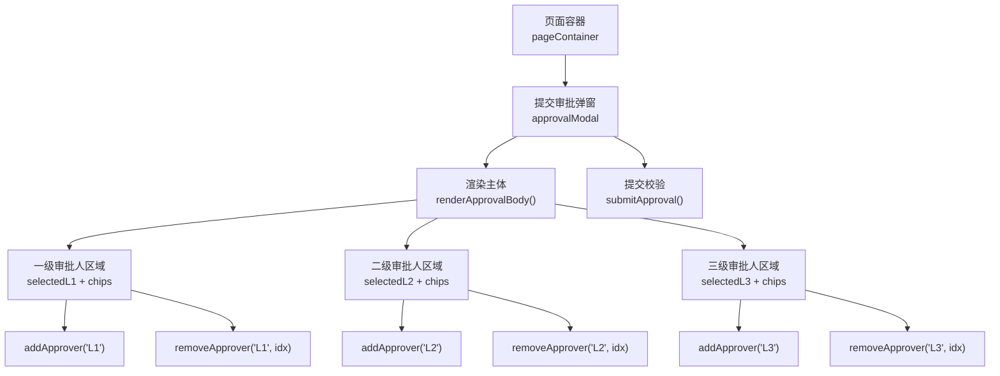
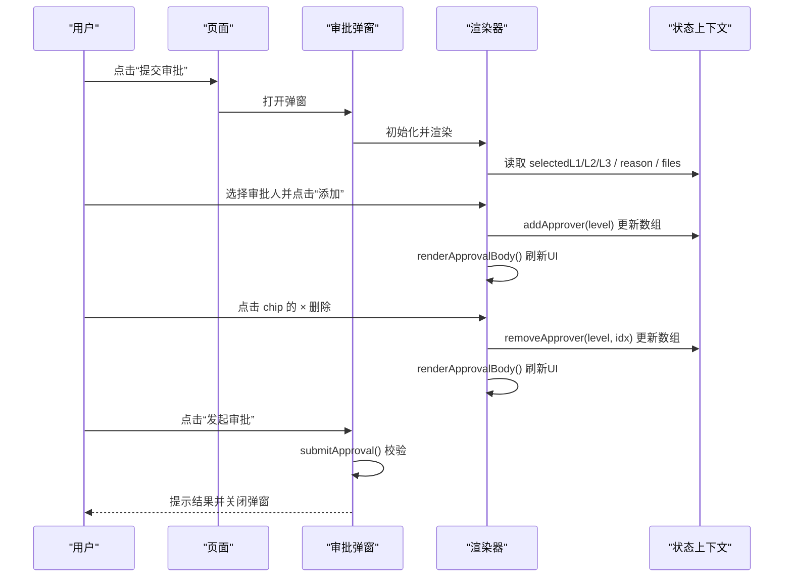
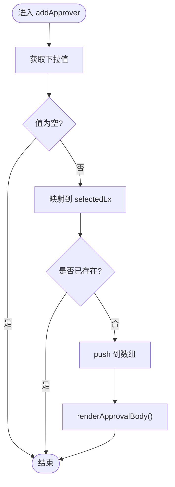
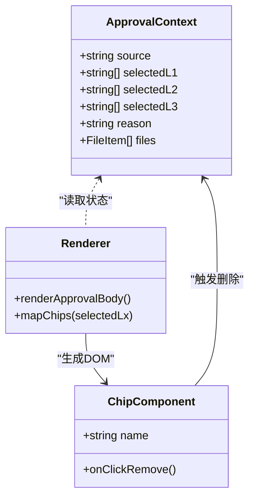
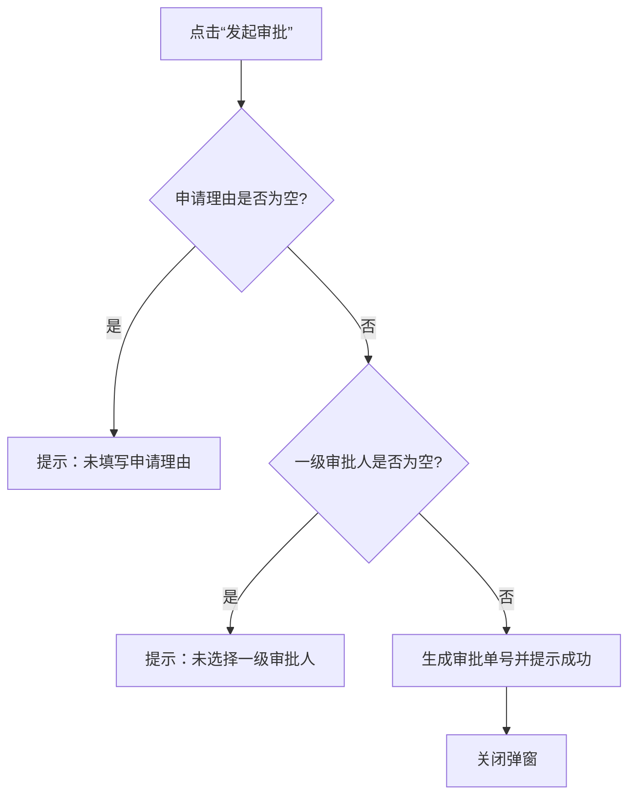
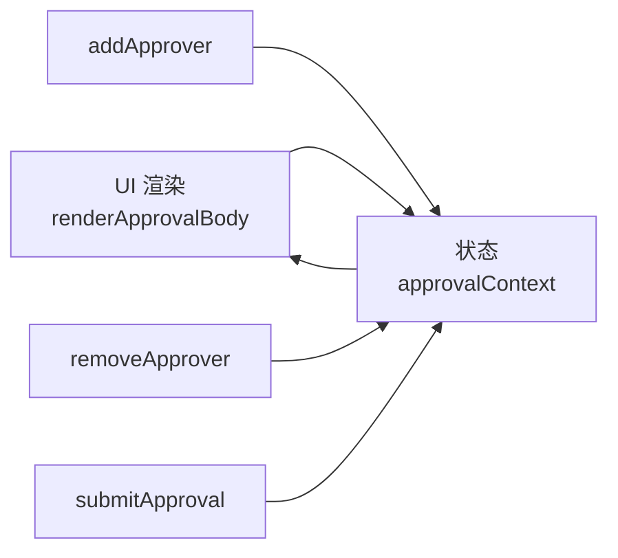

# 审批人管理

<cite>
**本文引用的文件**   
- [sales-forecast-prototype.html](file://sales-forecast-prototype.html)
</cite>

## 目录
1. [简介](#简介)
2. [项目结构](#项目结构)
3. [核心组件](#核心组件)
4. [架构总览](#架构总览)
5. [详细组件分析](#详细组件分析)
6. [依赖关系分析](#依赖关系分析)
7. [性能考量](#性能考量)
8. [故障排查指南](#故障排查指南)
9. [结论](#结论)
10. [附录：最佳实践与示例路径](#附录最佳实践与示例路径)

## 简介
本文件聚焦“审批人管理”功能，围绕 addApprover 与 removeApprover 两个核心函数展开，详细说明一级、二级、三级审批人的添加与删除逻辑；解释审批人芯片（chip）组件的渲染与交互，包括 chip-remove 按钮的事件处理、重复检查机制、数组状态更新等；并说明不同级别审批人的业务规则（如一级必选、串行审批等约束）。文档同时提供完整的代码片段路径与最佳实践建议，帮助读者快速理解与扩展实现。

## 项目结构
该原型为单页 HTML 应用，所有样式与脚本内联在同一个文件中。审批人管理相关逻辑集中在“提交审批弹窗”区域，包含：
- 数据上下文 approvalContext：保存来源、各级审批人选择数组、申请理由与附件列表
- 渲染函数 renderApprovalBody：根据上下文动态生成表单与芯片列表
- 操作函数 addApprover/removeApprover：维护各级审批人数组并刷新视图
- 提交校验 submitApproval：确保必填项满足业务规则后发起审批

图表来源
- [sales-forecast-prototype.html:184-280](file://sales-forecast-prototype.html#L184-L280)

章节来源
- [sales-forecast-prototype.html:184-280](file://sales-forecast-prototype.html#L184-L280)

## 核心组件
- 数据上下文 approvalContext
  - 字段：source（来源）、selectedL1/L2/L3（各级审批人数组）、reason（申请理由）、files（附件列表）
  - 作用：集中管理弹窗内的用户输入与选择状态
- 渲染器 renderApprovalBody
  - 将 selectedL1/L2/L3 映射为可移除的 chip 元素，并为每个 chip 绑定 chip-remove 点击事件
  - 同步下拉选项，过滤已选人员避免重复
- 操作函数
  - addApprover(level)：从对应下拉框取值，去重后推入 selectedLx，再刷新渲染
  - removeApprover(level, idx)：按索引从 selectedLx 中移除一项，再刷新渲染
- 提交函数 submitApproval
  - 校验申请理由与一级审批人是否填写/选择，通过后生成审批单号并提示成功

章节来源
- [sales-forecast-prototype.html:184-280](file://sales-forecast-prototype.html#L184-L280)

## 架构总览
审批人管理的整体流程如下：
- 用户触发“提交审批”，打开弹窗并初始化 approvalContext
- 渲染器根据当前上下文生成 UI（含各级审批人 chip）
- 用户通过下拉选择添加审批人，或点击 chip 上的 × 删除
- 每次状态变更后调用 renderApprovalBody 保持视图与数据一致
- 提交时进行业务校验，通过后完成提交并关闭弹窗

图表来源
- [sales-forecast-prototype.html:184-280](file://sales-forecast-prototype.html#L184-L280)

## 详细组件分析

### 一级、二级、三级审批人的添加与删除逻辑
- 数据来源与映射
  - 一级：l1Select → selectedL1
  - 二级：l2Select → selectedL2
  - 三级：l3Select → selectedL3
- 添加流程 addApprover(level)
  - 获取对应下拉框的值
  - 若为空则忽略
  - 使用 includes 进行重复检查，未存在则 push 到对应数组
  - 调用 renderApprovalBody 刷新界面
- 删除流程 removeApprover(level, idx)
  - 根据 level 映射到对应数组 key
  - splice(idx, 1) 删除指定位置的审批人
  - 调用 renderApprovalBody 刷新界面

图表来源
- [sales-forecast-prototype.html:250-262](file://sales-forecast-prototype.html#L250-L262)

章节来源
- [sales-forecast-prototype.html:250-262](file://sales-forecast-prototype.html#L250-L262)

### 审批人芯片组件的渲染与交互
- 渲染策略
  - 将 selectedLx 数组映射为多个 approver-chip span，内部包含 chip-remove 按钮
  - 每个 chip-remove 绑定 onclick="removeApprover('Lx', index)"
  - 若数组为空，显示占位文本“暂未选择X级审批人”
- 交互行为
  - 点击 chip-remove 触发 removeApprover，删除对应项并重新渲染
  - 下拉选项通过 filter(!includes) 自动排除已选人员，防止重复添加
- 视觉样式
  - approver-chip：浅蓝背景、圆角、蓝色边框
  - chip-remove：灰色×，悬停变红，提升可感知性

图表来源
- [sales-forecast-prototype.html:191-249](file://sales-forecast-prototype.html#L191-L249)

章节来源
- [sales-forecast-prototype.html:191-249](file://sales-forecast-prototype.html#L191-L249)

### 不同级别审批人的业务规则
- 一级审批人
  - 必选：提交前校验 selectedL1.length > 0
  - 可多选：支持添加多个一级审批人
  - 串行审批：文案标注“串行审批”，表示一级审批人需依次审批（前端仅做展示与约束，实际顺序由后端控制）
- 二级、三级审批人
  - 可选：不强制要求选择
  - 可多选：支持添加多个二级/三级审批人
- 提交校验
  - 申请理由必填
  - 一级审批人必须至少选择一人
  - 通过后生成审批单号并提示“数据状态已更新为【审批中】”

图表来源
- [sales-forecast-prototype.html:274-280](file://sales-forecast-prototype.html#L274-L280)

章节来源
- [sales-forecast-prototype.html:274-280](file://sales-forecast-prototype.html#L274-L280)

## 依赖关系分析
- 模块耦合
  - renderApprovalBody 依赖 approvalContext 的状态与 SCM_USERS 列表
  - addApprover/removeApprover 直接修改 approvalContext.selectedLx 并触发渲染
  - submitApproval 依赖 reason 与 selectedL1 的完整性
- 外部依赖
  - DOM API：querySelector、classList、innerHTML
  - 文件上传：input[type=file] 与 handleFiles
- 潜在循环依赖
  - 无循环依赖，均为单向调用：UI→状态→渲染

图表来源
- [sales-forecast-prototype.html:184-280](file://sales-forecast-prototype.html#L184-L280)

章节来源
- [sales-forecast-prototype.html:184-280](file://sales-forecast-prototype.html#L184-L280)

## 性能考量
- 渲染频率
  - 每次添加/删除都会触发 renderApprovalBody，导致整块 HTML 重建
  - 对于小规模数据（几十条以内）影响不大；若后续扩展为大量审批人或复杂表单，建议采用虚拟滚动或局部更新
- 字符串拼接
  - 使用 innerHTML 拼接模板字符串，简洁但频繁重建 DOM 可能带来开销
  - 优化建议：对稳定部分缓存模板，或使用更高效的渲染方案（如框架化组件）
- 事件绑定
  - 当前通过 inline onclick 绑定，简单直观；如需解耦，可改用事件委托

[本节为通用指导，无需具体文件引用]

## 故障排查指南
- 常见问题
  - 重复添加：检查 addApprover 中的 includes 判断是否正确执行
  - 删除无效：确认 removeApprover 传入的 level 与 idx 是否与渲染时的索引一致
  - 提交失败：检查 reason 非空与 selectedL1 长度大于 0 的校验逻辑
- 调试建议
  - 在 addApprover/removeApprover 中打印 approvalContext 变化
  - 在 renderApprovalBody 中输出 selectedLx 的长度与内容
  - 浏览器控制台查看 DOM 结构与事件绑定情况

章节来源
- [sales-forecast-prototype.html:250-280](file://sales-forecast-prototype.html#L250-L280)

## 结论
审批人管理功能通过简单的状态管理与渲染机制实现了多级审批人的选择与删除，具备清晰的职责划分与良好的可扩展性。addApprover 与 removeApprover 分别负责状态的增删与视图刷新，配合 submitApproval 的业务校验，保证了数据的完整性与一致性。建议在后续迭代中引入更稳健的渲染策略与事件解耦，以应对更复杂的业务场景与性能需求。

[本节为总结性内容，无需具体文件引用]

## 附录：最佳实践与示例路径
- 代码片段路径（用于定位实现细节）
  - 审批弹窗初始化与渲染：[sales-forecast-prototype.html:184-249](file://sales-forecast-prototype.html#L184-L249)
  - 添加审批人逻辑：[sales-forecast-prototype.html:250-257](file://sales-forecast-prototype.html#L250-L257)
  - 删除审批人逻辑：[sales-forecast-prototype.html:258-262](file://sales-forecast-prototype.html#L258-L262)
  - 提交校验与成功提示：[sales-forecast-prototype.html:274-280](file://sales-forecast-prototype.html#L274-L280)
- 最佳实践
  - 统一状态管理：将 approvalContext 作为单一数据源，避免分散状态
  - 防重复添加：始终在 addApprover 中进行 includes 检查
  - 明确必填项：在 submitApproval 中严格校验 reason 与 selectedL1
  - 用户体验：chip-remove 提供悬停反馈，下拉自动过滤已选项，减少误操作
  - 可扩展性：如需增加更多级别或规则，可在 level 映射与校验逻辑中扩展

章节来源
- [sales-forecast-prototype.html:184-280](file://sales-forecast-prototype.html#L184-L280)