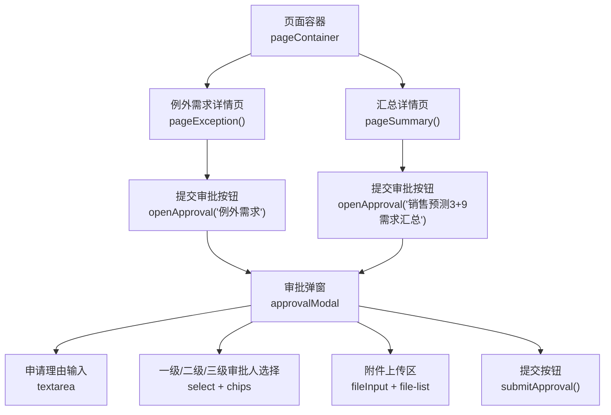
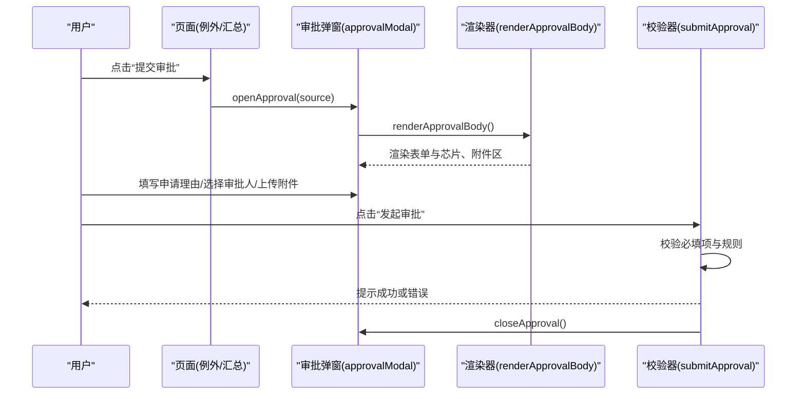
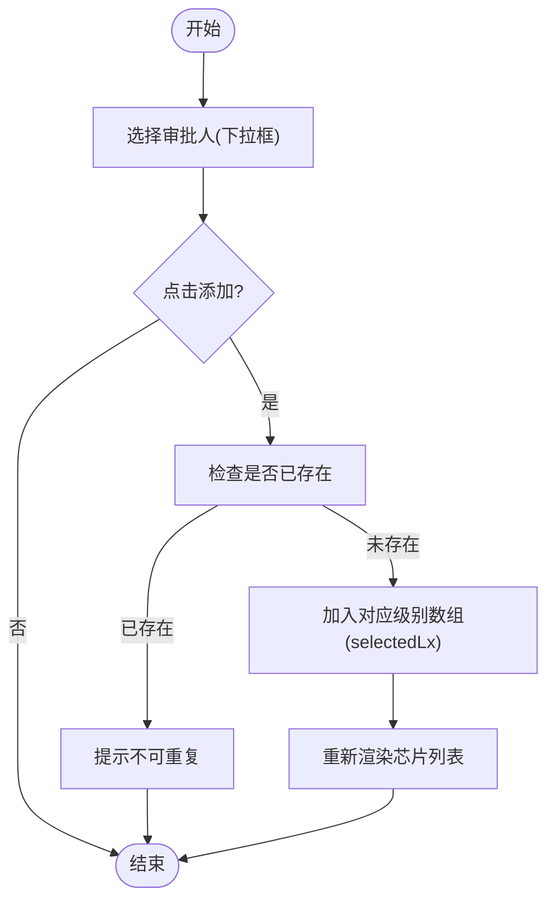
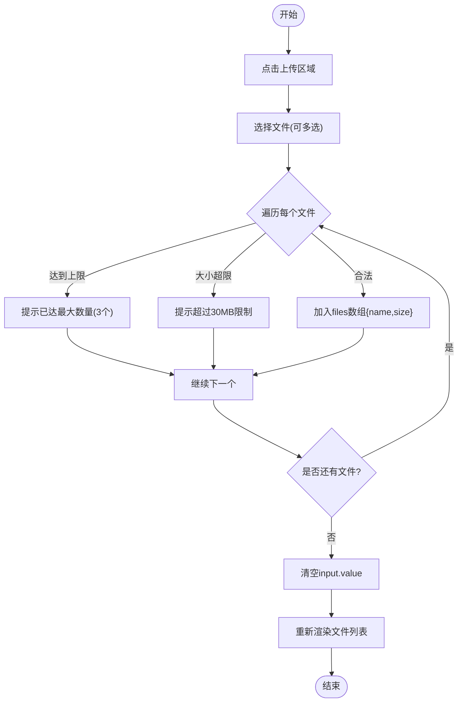
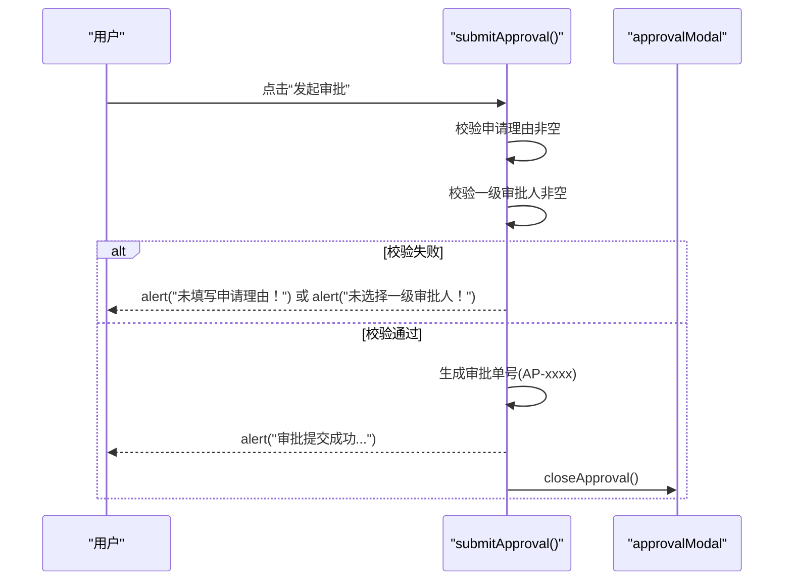
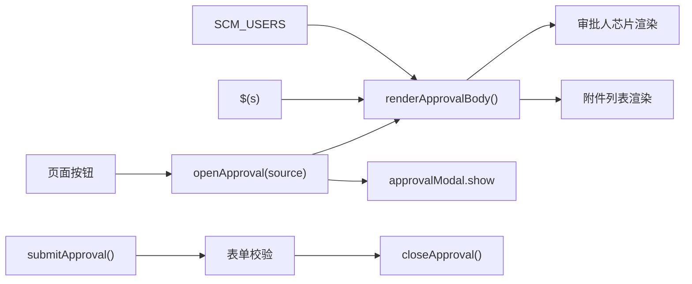

# 审批弹窗系统

<cite>
**本文引用的文件**   
- [sales-forecast-prototype.html](file://sales-forecast-prototype.html)
</cite>

## 目录
1. [引言](#引言)
2. [项目结构](#项目结构)
3. [核心组件](#核心组件)
4. [架构总览](#架构总览)
5. [详细组件分析](#详细组件分析)
6. [依赖关系分析](#依赖关系分析)
7. [性能考虑](#性能考虑)
8. [故障排查指南](#故障排查指南)
9. [结论](#结论)
10. [附录](#附录)

## 引言
本文件面向销售预测原型中的“审批弹窗系统”，聚焦 openApproval 与 closeApproval 的实现机制，以及三级审批人选择、申请理由填写、附件上传等关键功能。文档同时解释审批上下文管理、状态维护、数据验证、文件上传处理、审批人芯片组件、表单校验等高级特性，并提供最佳实践与错误处理方案，帮助读者快速理解并扩展该模块。

## 项目结构
该原型为单页应用（SPA）形态，所有页面与交互逻辑集中在一个 HTML 文件中。审批弹窗作为通用弹窗体系的一部分，通过模态容器与脚本函数协同工作：
- 模态容器：用于承载各类弹窗内容，包括“提交审批”弹窗。
- 页面渲染：根据当前菜单切换不同页面视图。
- 审批弹窗：独立模态，包含申请理由、三级审批人选择、附件上传区域与提交按钮。

图表来源 
- [sales-forecast-prototype.html:128-139](file://sales-forecast-prototype.html#L128-L139)
- [sales-forecast-prototype.html:360](file://sales-forecast-prototype.html#L360)
- [sales-forecast-prototype.html:449](file://sales-forecast-prototype.html#L449)

章节来源
- [sales-forecast-prototype.html:128-139](file://sales-forecast-prototype.html#L128-L139)
- [sales-forecast-prototype.html:282-292](file://sales-forecast-prototype.html#L282-L292)

## 核心组件
- 审批上下文对象 approvalContext：集中管理审批弹窗的临时状态，包括来源、各级审批人列表、申请理由、附件列表。
- 打开/关闭弹窗：openApproval(source)、closeApproval()。
- 渲染主体：renderApprovalBody()，动态生成申请理由、审批人选择、附件上传区域及芯片展示。
- 审批人操作：addApprover(level)、removeApprover(level, idx)。
- 附件处理：handleFiles(input)、removeFile(idx)。
- 提交校验与反馈：submitApproval()。

章节来源
- [sales-forecast-prototype.html:146](file://sales-forecast-prototype.html#L146)
- [sales-forecast-prototype.html:185-190](file://sales-forecast-prototype.html#L185-L190)
- [sales-forecast-prototype.html:191-249](file://sales-forecast-prototype.html#L191-L249)
- [sales-forecast-prototype.html:250-273](file://sales-forecast-prototype.html#L250-L273)
- [sales-forecast-prototype.html:274-280](file://sales-forecast-prototype.html#L274-L280)

## 架构总览
审批弹窗系统的调用时序如下：用户从页面触发“提交审批”，系统初始化上下文并渲染弹窗；用户在弹窗内完成信息填写与附件上传；点击“发起审批”后执行前端校验并给出结果提示，随后关闭弹窗。

图表来源 
- [sales-forecast-prototype.html:185-190](file://sales-forecast-prototype.html#L185-L190)
- [sales-forecast-prototype.html:191-249](file://sales-forecast-prototype.html#L191-L249)
- [sales-forecast-prototype.html:274-280](file://sales-forecast-prototype.html#L274-L280)

## 详细组件分析

### 审批上下文管理与状态维护
- 数据结构：approvalContext 包含 source、selectedL1/L2/L3、reason、files。每次打开弹窗时重置为初始状态，确保无残留数据。
- 状态更新：添加/移除审批人与附件后，立即重新渲染界面，保证 UI 与数据一致。
- 数据来源：SCM_USERS 提供可选审批人名单，过滤已选人员避免重复。

章节来源
- [sales-forecast-prototype.html:146](file://sales-forecast-prototype.html#L146)
- [sales-forecast-prototype.html:185-189](file://sales-forecast-prototype.html#L185-L189)
- [sales-forecast-prototype.html:250-262](file://sales-forecast-prototype.html#L250-L262)

### 三级审批人选择与芯片组件
- 选择方式：每级对应一个 select 下拉框与“添加”按钮，支持多选。
- 芯片展示：使用 approver-chip 样式呈现已选审批人，支持点击移除。
- 去重逻辑：添加前检查是否已存在，避免重复。
- 必选约束：一级审批人为必填，提交时校验。

图表来源 
- [sales-forecast-prototype.html:250-262](file://sales-forecast-prototype.html#L250-L262)
- [sales-forecast-prototype.html:191-249](file://sales-forecast-prototype.html#L191-L249)

章节来源
- [sales-forecast-prototype.html:191-249](file://sales-forecast-prototype.html#L191-L249)
- [sales-forecast-prototype.html:250-262](file://sales-forecast-prototype.html#L250-L262)

### 申请理由填写与表单验证
- 输入控件：textarea 绑定 oninput 事件，实时更新 approvalContext.reason。
- 必填校验：提交时若为空则提示错误，阻止提交。
- 用户体验：占位符引导说明用途，提升填写质量。

章节来源
- [sales-forecast-prototype.html:197-201](file://sales-forecast-prototype.html#L197-L201)
- [sales-forecast-prototype.html:274-276](file://sales-forecast-prototype.html#L274-L276)

### 附件上传处理与限制
- 上传入口：隐藏 fileInput，通过点击上传区域触发选择文件。
- 多文件支持：accept 属性限定图片、Excel、Word、PDF 等格式。
- 数量限制：最多 3 个附件，超出时提示并停止继续添加。
- 大小限制：单个文件不超过 30MB，超限则跳过并提示。
- 列表展示：显示文件名与大小，支持逐个移除。

图表来源 
- [sales-forecast-prototype.html:263-273](file://sales-forecast-prototype.html#L263-L273)
- [sales-forecast-prototype.html:238-247](file://sales-forecast-prototype.html#L238-L247)

章节来源
- [sales-forecast-prototype.html:238-247](file://sales-forecast-prototype.html#L238-L247)
- [sales-forecast-prototype.html:263-273](file://sales-forecast-prototype.html#L263-L273)

### 提交审批流程与状态反馈
- 校验顺序：先校验申请理由是否为空，再校验一级审批人是否至少选择一个。
- 成功路径：生成随机审批单号，提示成功信息，包含来源、一级审批人列表，并声明数据状态更新为“审批中”。
- 关闭弹窗：提交成功后自动关闭弹窗。

图表来源 
- [sales-forecast-prototype.html:274-280](file://sales-forecast-prototype.html#L274-L280)

章节来源
- [sales-forecast-prototype.html:274-280](file://sales-forecast-prototype.html#L274-L280)

### 弹窗生命周期与渲染
- 打开弹窗：openApproval(source) 重置上下文、渲染主体、显示模态。
- 关闭弹窗：closeApproval() 仅移除 show 类名隐藏弹窗。
- 渲染主体：renderApprovalBody() 动态构建 DOM，绑定事件，刷新芯片与文件列表。

章节来源
- [sales-forecast-prototype.html:185-190](file://sales-forecast-prototype.html#L185-L190)
- [sales-forecast-prototype.html:191-249](file://sales-forecast-prototype.html#L191-L249)

## 依赖关系分析
- 全局变量与工具：
  - SCM_USERS：审批人候选名单。
  - $：DOM 查询辅助函数。
  - mkM、mCell、statusPill、sourceTag、pagination、queryBar、selectField、inputField、openModal、closeModal：其他页面与弹窗使用的工具函数。
- 页面触发点：
  - 例外需求详情页与汇总详情页均提供“提交审批”按钮，调用 openApproval(source) 并传入来源标识。

图表来源 
- [sales-forecast-prototype.html:146](file://sales-forecast-prototype.html#L146)
- [sales-forecast-prototype.html:149](file://sales-forecast-prototype.html#L149)
- [sales-forecast-prototype.html:185-190](file://sales-forecast-prototype.html#L185-L190)
- [sales-forecast-prototype.html:191-249](file://sales-forecast-prototype.html#L191-L249)
- [sales-forecast-prototype.html:274-280](file://sales-forecast-prototype.html#L274-L280)

章节来源
- [sales-forecast-prototype.html:146](file://sales-forecast-prototype.html#L146)
- [sales-forecast-prototype.html:149](file://sales-forecast-prototype.html#L149)
- [sales-forecast-prototype.html:185-190](file://sales-forecast-prototype.html#L185-L190)
- [sales-forecast-prototype.html:191-249](file://sales-forecast-prototype.html#L191-L249)
- [sales-forecast-prototype.html:274-280](file://sales-forecast-prototype.html#L274-L280)

## 性能考虑
- 渲染频率：每次添加/移除审批人或附件都会触发 renderApprovalBody()，在大数据量场景下可能频繁重绘。建议对高频操作进行节流或增量更新。
- DOM 操作：innerHTML 全量替换可能导致布局抖动，可考虑局部更新或使用虚拟 DOM 策略。
- 文件处理：大量文件选择时循环校验与 push 操作开销较大，可在浏览器端做批量校验与预览优化。
- 内存占用：approvalContext.files 存储文件元数据，注意及时清理以避免内存泄漏。

[本节为通用指导，不直接分析具体文件]

## 故障排查指南
- 常见问题与定位
  - 未填写申请理由：提交时弹出提示，需补充理由。
  - 未选择一级审批人：提交时弹出提示，需至少选择一个。
  - 附件数量超限：提示最多 3 个，需移除多余附件。
  - 文件大小超限：提示超过 30MB，需压缩或更换文件。
  - 重复添加审批人：添加前会去重，无需额外处理。
- 调试建议
  - 在 addApprover/removeApprover/handleFiles/removeFile 中增加 console.log 观察上下文变化。
  - 在 submitApproval 中打印 approvalContext.reason 与 selectedL1 以确认校验条件。
  - 检查 fileInput 的 accept 属性是否正确配置，确保类型限制生效。

章节来源
- [sales-forecast-prototype.html:274-280](file://sales-forecast-prototype.html#L274-L280)
- [sales-forecast-prototype.html:263-273](file://sales-forecast-prototype.html#L263-L273)
- [sales-forecast-prototype.html:250-262](file://sales-forecast-prototype.html#L250-L262)

## 结论
审批弹窗系统通过清晰的上下文管理与渲染机制，实现了三级审批人选择、申请理由填写与附件上传等核心能力。前端校验保证了基础数据质量，芯片组件提升了交互体验。建议在后续迭代中引入更稳健的状态管理、增量渲染与后端集成，以提升性能与可靠性。

[本节为总结性内容，不直接分析具体文件]

## 附录
- 最佳实践
  - 将审批人名单与权限控制移至后端，前端仅做展示与选择。
  - 将附件上传改为分片与进度条展示，提升大文件体验。
  - 统一错误提示为 Toast 或消息中心，替代 alert。
  - 对审批流程增加版本化与审计日志，便于追溯。
  - 使用表单库（如 Ant Design Form）增强校验与联动能力。

[本节为通用指导，不直接分析具体文件]