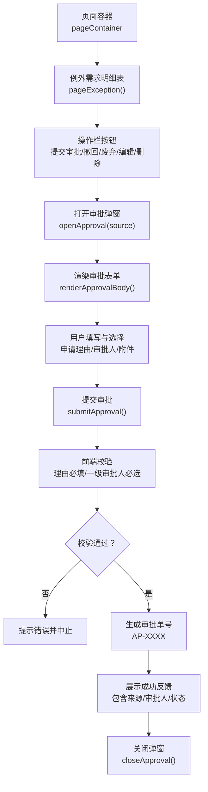
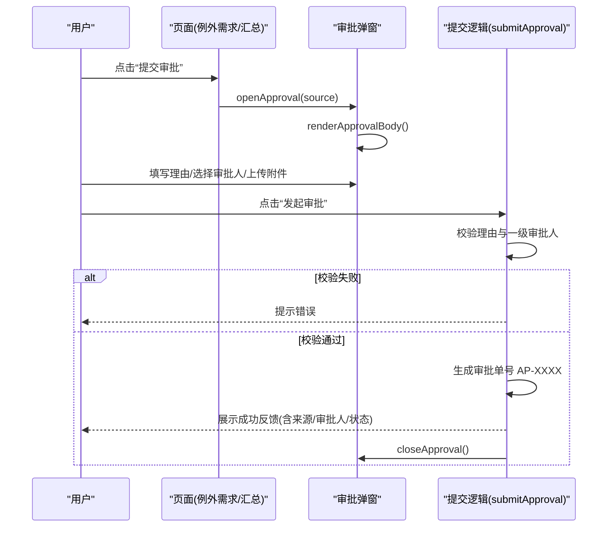
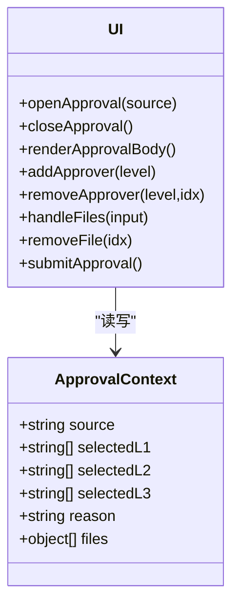

# 审批提交处理

<cite>
**本文引用的文件**   
- [sales-forecast-prototype.html](file://sales-forecast-prototype.html)
</cite>

## 目录
1. [简介](#简介)
2. [项目结构](#项目结构)
3. [核心组件](#核心组件)
4. [架构总览](#架构总览)
5. [详细组件分析](#详细组件分析)
6. [依赖关系分析](#依赖关系分析)
7. [性能与可用性考虑](#性能与可用性考虑)
8. [故障排查指南](#故障排查指南)
9. [结论](#结论)
10. [附录：接口设计与数据规范（建议）](#附录接口设计与数据规范建议)

## 简介
本文件聚焦于“审批提交处理”功能，围绕原型中的 submitApproval 函数及其相关交互进行系统化说明。内容涵盖表单验证逻辑（申请理由必填、一级审批人必选）、审批单号生成算法、数据状态更新、成功反馈等核心能力；同时解释审批流程的业务规则与数据流转（状态变更、通知机制、错误处理），并给出与后端集成的接口设计建议与数据格式规范，以及完整的提交流程示例和异常处理方案。

## 项目结构
该原型为单页 HTML 应用，所有页面与交互逻辑集中在一个文件中。审批提交弹窗与提交逻辑位于脚本区域，通过全局上下文 approvalContext 管理用户输入与选择，并在点击“发起审批”时触发 submitApproval。

图表来源
- [sales-forecast-prototype.html:184-280](file://sales-forecast-prototype.html#L184-L280)

章节来源
- [sales-forecast-prototype.html:184-280](file://sales-forecast-prototype.html#L184-L280)

## 核心组件
- 审批上下文对象 approvalContext
  - 字段：source（来源）、selectedL1/L2/L3（各级审批人列表）、reason（申请理由）、files（附件列表）
  - 作用：集中管理审批弹窗的输入与选择状态，供渲染与提交使用
- 审批弹窗控制
  - openApproval(source)：初始化上下文并渲染表单，显示弹窗
  - closeApproval()：隐藏弹窗
  - renderApprovalBody()：根据上下文动态渲染表单（理由、审批人、附件）
- 审批人管理
  - addApprover(level)：从下拉选择添加审批人到对应级别数组，去重
  - removeApprover(level, idx)：移除指定级别的某位审批人
- 附件管理
  - handleFiles(input)：校验数量与大小限制，追加到 files 列表
  - removeFile(idx)：移除已选附件
- 提交审批
  - submitApproval()：执行表单校验、生成审批单号、展示成功反馈并关闭弹窗

章节来源
- [sales-forecast-prototype.html:184-280](file://sales-forecast-prototype.html#L184-L280)

## 架构总览
审批提交流程在前端完成，主要步骤包括：
- 用户从“例外需求明细表”或“销售预测3+9需求汇总”的操作栏点击“提交审批”
- 打开审批弹窗并渲染表单
- 用户填写申请理由、选择各级审批人、上传附件
- 点击“发起审批”，前端校验通过后生成审批单号并展示成功信息
- 关闭弹窗，后续可对接后端持久化与流程引擎

图表来源
- [sales-forecast-prototype.html:184-280](file://sales-forecast-prototype.html#L184-L280)

## 详细组件分析

### 表单验证逻辑
- 申请理由必填
  - 实现：在提交前检查 reason 是否为空（去除空白后判断）
  - 行为：为空则弹出提示并中止提交
- 一级审批人必选
  - 实现：检查 selectedL1 长度是否大于 0
  - 行为：未选择则弹出提示并中止提交
- 二级/三级审批人可选
  - 实现：不强制校验 selectedL2/selctedL3 的长度
- 附件限制
  - 数量：最多 3 个
  - 大小：单个不超过 30MB
  - 类型：图片、Excel、Word、PDF 等（由 accept 属性约束）

章节来源
- [sales-forecast-prototype.html:274-280](file://sales-forecast-prototype.html#L274-L280)
- [sales-forecast-prototype.html:263-272](file://sales-forecast-prototype.html#L263-L272)

### 审批单号生成算法
- 规则：以固定前缀 “AP-” 拼接随机四位数（1000~9999）
- 复杂度：O(1)，仅一次随机数计算与字符串拼接
- 注意：当前为前端随机生成，存在重复风险；生产环境应改为后端唯一性保证

章节来源
- [sales-forecast-prototype.html:277](file://sales-forecast-prototype.html#L277)

### 数据状态更新与成功反馈
- 状态更新：成功后提示“数据状态已更新为【审批中】”
- 反馈内容：包含审批单号、来源、一级审批人列表
- 交互结果：关闭弹窗，等待后续后端确认与流程推进

章节来源
- [sales-forecast-prototype.html:278-279](file://sales-forecast-prototype.html#L278-L279)

### 审批流程业务规则与数据流转
- 状态流转（前端展示）
  - 草稿 → 提交审批 → 审批中 → 已通过 / 已驳回 / 已撤回
  - 已驳回 / 已撤回 → 废弃 → 已废弃
- 数据来源
  - 支持从“例外需求”、“销售预测3+9需求汇总”等页面发起审批
- 通知机制（当前）
  - 前端 alert 提示；无后台通知集成
- 错误处理（当前）
  - 前端校验失败直接提示；无网络异常处理

章节来源
- [sales-forecast-prototype.html:449-451](file://sales-forecast-prototype.html#L449-L451)
- [sales-forecast-prototype.html:274-280](file://sales-forecast-prototype.html#L274-L280)

### 与后端集成的接口设计与数据格式规范（建议）
以下为建议的后端接口契约，便于将前端原型升级为真实系统：
- 接口路径：POST /api/approval/submit
- 请求体字段
  - source: string（来源页面标识，如“例外需求”、“销售预测3+9需求汇总”）
  - reason: string（申请理由，必填）
  - approvers: object
    - level1: string[]（一级审批人，必填且至少1人）
    - level2: string[]（二级审批人，可选）
    - level3: string[]（三级审批人，可选）
  - attachments: array
    - name: string（文件名）
    - size: number（字节）
    - url: string（可选，上传后的地址）
- 响应体
  - code: number（业务码，200 表示成功）
  - message: string（提示信息）
  - data: object
    - approvalNo: string（审批单号）
    - status: string（初始状态：“审批中”）
    - createdAt: string（时间戳）
- 错误码建议
  - 400：参数校验失败（如理由为空、一级审批人为空）
  - 409：审批单号冲突（后端生成时）
  - 500：服务器内部错误

[本节为概念性接口设计，不直接映射具体源码]

## 依赖关系分析
- 模块内依赖
  - openApproval 依赖 approvalContext 初始化与 renderApprovalBody 渲染
  - renderApprovalBody 依赖 SCM_USERS 与 approvalContext 的状态
  - addApprover/removeApprover 依赖 approvalContext 的数组字段
  - handleFiles/removeFile 依赖 approvalContext.files
  - submitApproval 依赖上述所有上下文与 DOM 元素
- 外部依赖
  - 当前无外部库依赖，纯原生 JS + DOM
  - 未来需引入后端 API 调用与可能的消息通知服务

图表来源
- [sales-forecast-prototype.html:184-280](file://sales-forecast-prototype.html#L184-L280)

章节来源
- [sales-forecast-prototype.html:184-280](file://sales-forecast-prototype.html#L184-L280)

## 性能与可用性考虑
- 性能
  - 表单渲染为纯 DOM 操作，开销小；附件列表渲染随条目线性增长
  - 建议：当附件较多时采用虚拟滚动或分页展示
- 可用性
  - 必填项明确标注（红色星号）
  - 附件限制即时提示（数量与大小）
  - 建议：增加实时校验反馈（如输入框边框变色、禁用提交按钮直到满足条件）

[本节为通用指导，不直接分析具体文件]

## 故障排查指南
- 常见问题
  - 未填写申请理由：检查 reason 是否为空
  - 未选择一级审批人：检查 selectedL1 是否为空
  - 附件超限：检查 files.length 与 f.size
- 定位方法
  - 在浏览器控制台查看 alert 提示
  - 检查 DOM 元素是否存在（如 l1Select、approvalReason、fileInput）
- 改进建议
  - 将 alert 替换为统一的提示组件
  - 增加 try/catch 与网络错误处理（接入后端后）

章节来源
- [sales-forecast-prototype.html:274-280](file://sales-forecast-prototype.html#L274-L280)
- [sales-forecast-prototype.html:263-272](file://sales-forecast-prototype.html#L263-L272)

## 结论
当前原型实现了审批提交的前端基础能力：表单校验、审批人选择、附件管理与简单反馈。提交逻辑集中在 submitApproval，审批单号由前端随机生成。为达到生产可用，建议引入后端接口统一生成审批单号、持久化数据、驱动审批工作流，并完善错误处理与通知机制。

[本节为总结，不直接分析具体文件]

## 附录：接口设计与数据规范（建议）
- 前端提交数据结构
  - { source, reason, approvers: { level1, level2, level3 }, attachments: [{ name, size, url }] }
- 后端返回数据结构
  - { code, message, data: { approvalNo, status, createdAt } }
- 状态枚举
  - 草稿、审批中、已通过、已驳回、已撤回、已废弃
- 附件规范
  - 最大数量：3
  - 单文件大小：≤30MB
  - 允许类型：image/*, .xls, .xlsx, .doc, .docx, .pdf

[本节为概念性规范，不直接映射具体源码]