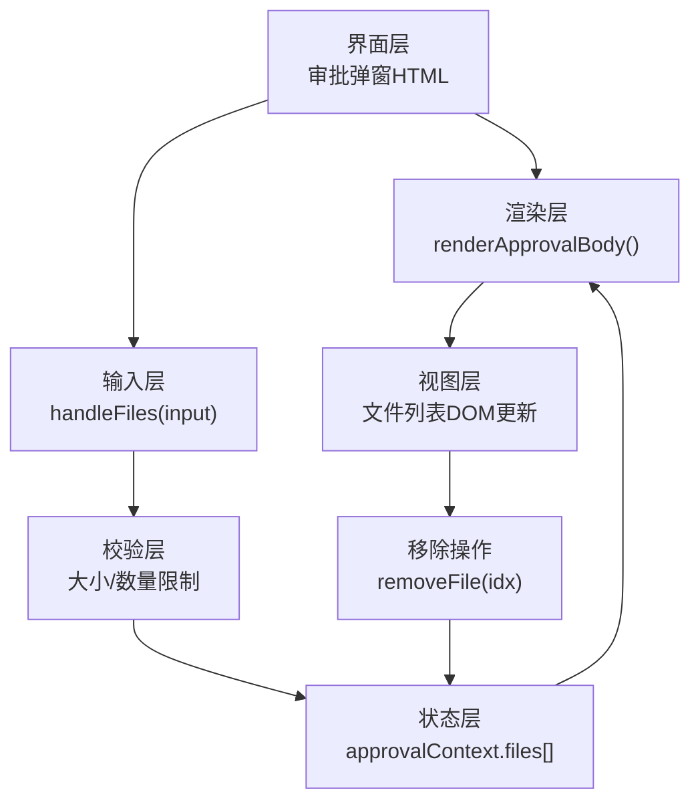
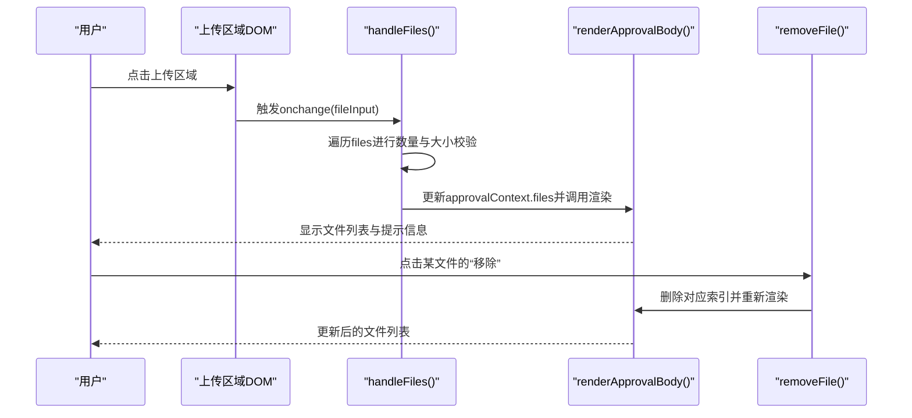
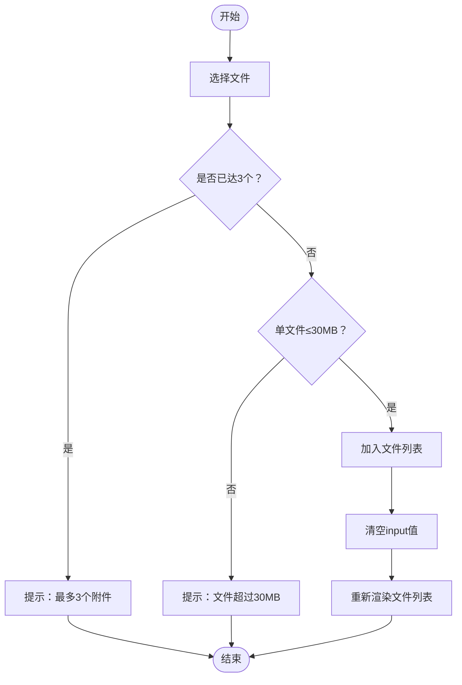
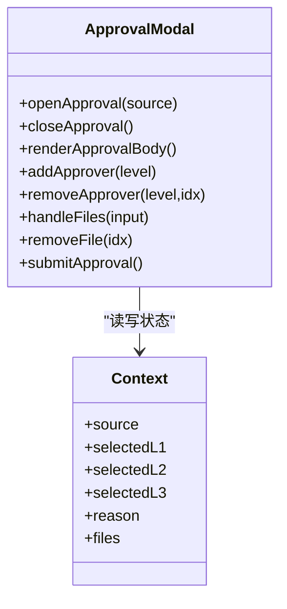

# 文件上传系统

<cite>
**本文档中引用的文件**   
- [sales-forecast-prototype.html](file://sales-forecast-prototype.html)
</cite>

## 目录
1. [简介](#简介)
2. [项目结构](#项目结构)
3. [核心组件](#核心组件)
4. [架构总览](#架构总览)
5. [详细组件分析](#详细组件分析)
6. [依赖关系分析](#依赖关系分析)
7. [性能考虑](#性能考虑)
8. [故障排查指南](#故障排查指南)
9. [结论](#结论)
10. [附录：扩展与最佳实践](#附录扩展与最佳实践)

## 简介
本文件为“审批弹窗”的文件上传子系统提供完整文档，聚焦以下能力与实现机制：
- 文件选择事件处理与渲染
- 文件大小验证（单文件不超过30MB）
- 文件格式过滤与提示
- 数量限制（最多3个附件）
- 文件列表展示、移除操作与错误提示
- 文件类型支持配置与扩展方法
- 最佳实践与错误处理方案

该功能位于“提交审批”弹窗内，用户可在此处添加附件作为审批依据。

## 项目结构
- 前端采用单页应用形式，所有页面与交互逻辑集中在一个HTML文件中。
- 审批弹窗通过模态框容器渲染，包含申请理由、审批人选择、附件上传区域等模块。
- 文件上传相关逻辑由若干函数协同完成：打开/关闭弹窗、渲染主体、处理文件选择、移除文件、提交审批等。

图表来源
- [sales-forecast-prototype.html:185-280](file://sales-forecast-prototype.html#L185-L280)

章节来源
- [sales-forecast-prototype.html:185-280](file://sales-forecast-prototype.html#L185-L280)

## 核心组件
- 审批弹窗上下文对象 approvalContext：集中管理申请理由、各级审批人、附件列表等状态。
- 渲染函数 renderApprovalBody：根据当前上下文动态生成弹窗内容，包括文件列表与提示信息。
- 文件处理函数 handleFiles：接收input.files，执行数量与大小校验，维护附件数组并刷新视图。
- 移除函数 removeFile：按索引删除附件并重新渲染。
- 提交函数 submitApproval：校验必填项后模拟提交成功流程。

章节来源
- [sales-forecast-prototype.html:185-280](file://sales-forecast-prototype.html#L185-L280)

## 架构总览
下图展示了从用户点击上传到文件列表渲染的完整调用链，以及移除操作的闭环。

图表来源
- [sales-forecast-prototype.html:244-273](file://sales-forecast-prototype.html#L244-L273)

## 详细组件分析

### 文件选择事件处理与校验（handleFiles）
- 触发时机：当用户在隐藏的文件输入框中选择文件时，触发onchange事件并传入input元素。
- 主要流程：
  - 将input.files转换为数组以便遍历。
  - 对每个文件执行数量限制检查（最多3个），若已达上限则提示并中断后续处理。
  - 对每个文件执行大小限制检查（单文件不超过30MB），超过则提示具体文件名并跳过该文件。
  - 将符合条件的文件信息（名称、大小）追加至approvalContext.files。
  - 清空input.value以避免重复选择同一文件不触发onchange的问题。
  - 调用渲染函数更新视图。
- 复杂度分析：时间复杂度O(n)，n为本次选择的文件数；空间复杂度O(1)（仅临时变量）。

章节来源
- [sales-forecast-prototype.html:263-272](file://sales-forecast-prototype.html#L263-L272)

### 文件列表渲染（renderApprovalBody）
- 渲染位置：在“添加附件”区块中，包含上传区域、隐藏的input[type=file]、文件列表容器及提示信息。
- 文件列表渲染：
  - 遍历approvalContext.files，生成每项包含图标、文件名、大小（MB）、移除按钮的DOM片段。
  - 文件大小以MB为单位保留两位小数显示。
  - 移除按钮绑定removeFile(idx)回调。
- 提示信息：
  - 当文件数量达到上限（3个）时，在列表下方显示红色提示文字“已达到最大附件数量（3个）”。
- 交互细节：
  - 上传区域点击会触发隐藏的fileInput.click()，从而打开系统文件选择器。
  - fileInput设置multiple与accept属性，限制多选与格式。

章节来源
- [sales-forecast-prototype.html:191-249](file://sales-forecast-prototype.html#L191-L249)

### 移除文件（removeFile）
- 行为：根据索引从approvalContext.files中删除对应项，随后调用渲染函数刷新视图。
- 注意事项：确保索引有效，避免越界；删除后立即重绘保证UI一致性。

章节来源
- [sales-forecast-prototype.html:273-273](file://sales-forecast-prototype.html#L273-L273)

### 提交审批（submitApproval）
- 前置校验：
  - 申请理由不能为空。
  - 一级审批人必须至少选择一个。
- 成功后：
  - 生成随机审批单号。
  - 弹出成功提示，包含审批单号、来源、一级审批人等信息。
  - 关闭弹窗。

章节来源
- [sales-forecast-prototype.html:274-280](file://sales-forecast-prototype.html#L274-L280)

### 文件类型支持与扩展方法
- 当前支持的类型：
  - 图片：image/*
  - Excel：.xls, .xlsx
  - Word：.doc, .docx
  - PDF：.pdf
- 配置位置：fileInput的accept属性。
- 扩展方法：
  - 在accept中添加新的MIME或扩展名，如video/*、audio/*或其他业务需要的格式。
  - 如需更严格的客户端校验，可在handleFiles中增加后缀或MIME判断逻辑。
  - 建议同时在前端与后端进行双重校验，确保安全性与一致性。

章节来源
- [sales-forecast-prototype.html:244-244](file://sales-forecast-prototype.html#L244-L244)

### 数据流与状态图

图表来源
- [sales-forecast-prototype.html:263-272](file://sales-forecast-prototype.html#L263-L272)

## 依赖关系分析
- 组件耦合：
  - handleFiles依赖approvalContext.files与renderApprovalBody。
  - removeFile依赖approvalContext.files与renderApprovalBody。
  - renderApprovalBody依赖approvalContext的所有字段（reason、selectedL1/L2/L3、files）。
- 外部依赖：
  - DOM API（querySelector、classList、innerHTML等）。
  - File API（input.files、size、name等）。
- 潜在循环依赖：无直接循环依赖，但渲染函数频繁被调用，需注意性能优化。

图表来源
- [sales-forecast-prototype.html:185-280](file://sales-forecast-prototype.html#L185-L280)

章节来源
- [sales-forecast-prototype.html:185-280](file://sales-forecast-prototype.html#L185-L280)

## 性能考虑
- 渲染频率：每次文件增删都会触发整体渲染，建议在大数据量场景下使用虚拟滚动或增量更新。
- DOM操作：innerHTML全量替换可能引起重排，可考虑局部更新（如只更新文件列表容器）。
- 事件处理：避免在大量文件上执行复杂计算，保持handleFiles轻量。
- 内存占用：及时清理input.value，避免重复选择导致的事件失效问题。

[本节为通用指导，无需引用具体文件]

## 故障排查指南
- 常见问题与定位：
  - 无法触发onchange：确认fileInput的display:none且点击的是可见的上传区域，而非直接操作隐藏input。
  - 选择相同文件不触发onchange：已在handleFiles末尾清空input.value，确保再次选择能触发事件。
  - 文件未显示：检查approvalContext.files是否正确更新，以及renderApprovalBody是否被调用。
  - 提示未出现：确认条件判断（数量=3、大小>30MB）与DOM渲染逻辑一致。
- 调试建议：
  - 在handleFiles与renderApprovalBody中加入日志输出，观察数据变化。
  - 使用浏览器开发者工具查看DOM结构与事件绑定。
  - 检查accept属性是否符合预期，必要时放宽或收紧格式限制。

章节来源
- [sales-forecast-prototype.html:244-273](file://sales-forecast-prototype.html#L244-L273)

## 结论
审批弹窗的文件上传系统实现了基本的文件选择、校验、渲染与移除能力，满足常见的附件上传需求。通过合理的状态管理与渲染策略，保证了交互的流畅性与用户体验。未来可在此基础上增强格式校验、进度反馈、预览与拖拽等功能，进一步提升可用性。

[本节为总结性内容，无需引用具体文件]

## 附录：扩展与最佳实践
- 扩展文件类型：
  - 修改fileInput.accept属性，新增所需格式。
  - 在handleFiles中增加后缀或MIME校验，提升前端拦截能力。
- 增强用户体验：
  - 增加文件预览（图片缩略图、PDF预览）。
  - 支持拖拽上传与粘贴上传。
  - 显示上传进度与失败重试。
- 安全与合规：
  - 前端校验仅为辅助，务必在后端进行严格校验与病毒扫描。
  - 限制总大小与并发上传数量，防止资源滥用。
- 错误处理：
  - 统一错误提示样式与文案，提升可读性。
  - 记录关键错误日志，便于问题追踪。

[本节为通用指导，无需引用具体文件]