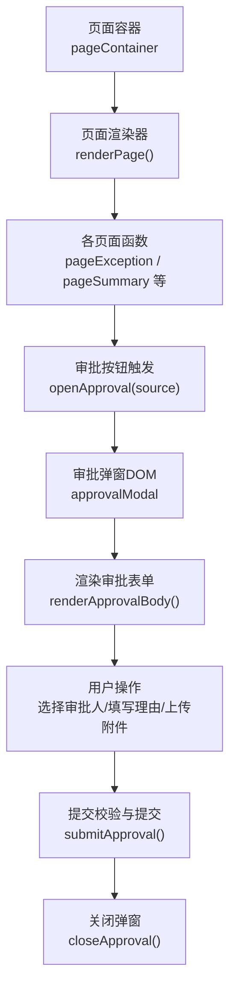
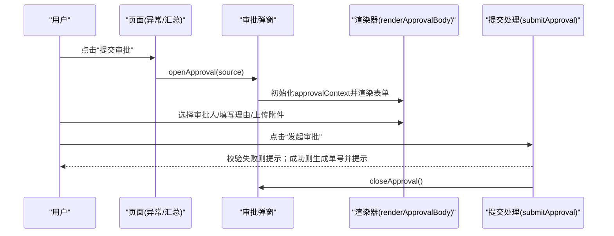
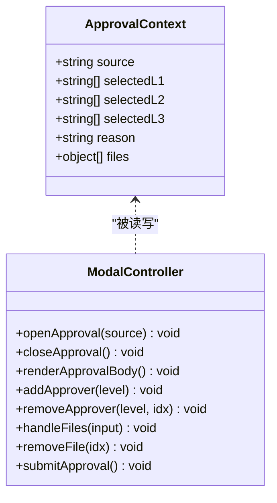
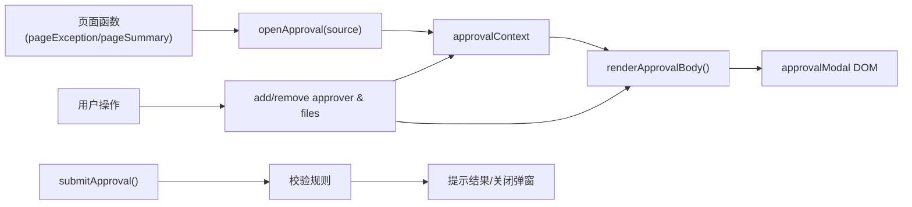

# 核心审批逻辑

<cite>
**本文档中引用的文件**
- [sales-forecast-prototype.html](file://sales-forecast-prototype.html)
</cite>

## 目录
1. [简介](#简介)
2. [项目结构](#项目结构)
3. [核心组件](#核心组件)
4. [架构总览](#架构总览)
5. [详细组件分析](#详细组件分析)
6. [依赖关系分析](#依赖关系分析)
7. [性能考虑](#性能考虑)
8. [故障排查指南](#故障排查指南)
9. [结论](#结论)
10. [附录：使用场景与示例路径](#附录使用场景与示例路径)

## 简介
本文件聚焦于“销售预测3+9需求汇总原型”中的审批弹窗系统核心逻辑，重点解析以下能力：
- openApproval 与 closeApproval 的实现机制
- 审批上下文 approvalContext 的数据结构与维护逻辑
- 模态框显示控制、状态初始化与渲染流程
- 审批流程的状态管理与数据流转
- 典型使用场景与代码片段路径（不直接粘贴代码）

该原型为单页应用，所有交互逻辑集中在一个 HTML 文件中，通过内联脚本驱动页面与弹窗行为。

## 项目结构
- 单一 HTML 文件包含样式、模板与脚本
- 全局变量与工具函数集中定义
- 页面切换与表格渲染由多个 pageXxx 函数负责
- 审批弹窗以独立模态框 DOM 节点存在，并通过 class 切换显示/隐藏

图表来源
- [sales-forecast-prototype.html:128-139](file://sales-forecast-prototype.html#L128-L139)
- [sales-forecast-prototype.html:184-190](file://sales-forecast-prototype.html#L184-L190)
- [sales-forecast-prototype.html:191-249](file://sales-forecast-prototype.html#L191-L249)
- [sales-forecast-prototype.html:274-280](file://sales-forecast-prototype.html#L274-L280)

章节来源
- [sales-forecast-prototype.html:128-139](file://sales-forecast-prototype.html#L128-L139)
- [sales-forecast-prototype.html:282-292](file://sales-forecast-prototype.html#L282-L292)

## 核心组件
- 审批上下文对象 approvalContext
  - source: 数据来源（如“例外需求”、“销售预测3+9需求汇总”）
  - selectedL1: 一级审批人数组（必选，可多选，串行审批）
  - selectedL2: 二级审批人数组（可选，可多选）
  - selectedL3: 三级审批人数组（可选，可多选）
  - reason: 申请理由（必填）
  - files: 附件列表，元素为 {name, size}，最多3个，单文件不超过30MB
- 弹窗控制函数
  - openApproval(source): 初始化上下文并渲染表单，显示弹窗
  - closeApproval(): 隐藏弹窗
- 表单渲染与交互
  - renderApprovalBody(): 根据 approvalContext 动态渲染表单
  - addApprover(level)/removeApprover(level, idx): 管理各级审批人
  - handleFiles(input)/removeFile(idx): 管理附件上传与移除
  - submitApproval(): 校验并模拟提交，生成审批单号，提示成功信息

章节来源
- [sales-forecast-prototype.html:146](file://sales-forecast-prototype.html#L146)
- [sales-forecast-prototype.html:184-190](file://sales-forecast-prototype.html#L184-L190)
- [sales-forecast-prototype.html:191-249](file://sales-forecast-prototype.html#L191-L249)
- [sales-forecast-prototype.html:250-273](file://sales-forecast-prototype.html#L250-L273)
- [sales-forecast-prototype.html:274-280](file://sales-forecast-prototype.html#L274-L280)

## 架构总览
审批弹窗的调用链与数据流如下：

图表来源
- [sales-forecast-prototype.html:184-190](file://sales-forecast-prototype.html#L184-L190)
- [sales-forecast-prototype.html:191-249](file://sales-forecast-prototype.html#L191-L249)
- [sales-forecast-prototype.html:274-280](file://sales-forecast-prototype.html#L274-L280)

## 详细组件分析

### 审批上下文 approvalContext 数据结构与维护
- 字段说明
  - source: 字符串，记录触发审批的来源页面或模块名称
  - selectedL1/L2/L3: 字符串数组，分别存储已选择的各级审批人姓名
  - reason: 字符串，申请理由文本
  - files: 对象数组，每个元素包含 name（文件名）与 size（字节大小）
- 维护逻辑
  - 初始化：在 openApproval(source) 中重置为默认值，确保每次打开都是干净状态
  - 审批人添加：addApprover(level) 从对应下拉框取值并去重后推入数组
  - 审批人删除：removeApprover(level, idx) 按索引移除
  - 附件添加：handleFiles(input) 进行数量与大小限制校验后加入数组
  - 附件删除：removeFile(idx) 按索引移除
  - 渲染：renderApprovalBody() 读取当前上下文并生成表单HTML

章节来源
- [sales-forecast-prototype.html:146](file://sales-forecast-prototype.html#L146)
- [sales-forecast-prototype.html:184-190](file://sales-forecast-prototype.html#L184-L190)
- [sales-forecast-prototype.html:250-273](file://sales-forecast-prototype.html#L250-L273)
- [sales-forecast-prototype.html:191-249](file://sales-forecast-prototype.html#L191-L249)

### 模态框显示控制与状态初始化
- 显示控制
  - openApproval(source) 将 approvalModal 的 show 类添加到 overlay，从而显示弹窗
  - closeApproval() 移除 show 类，隐藏弹窗
- 状态初始化
  - 每次打开都会重新赋值 approvalContext，避免跨次使用的脏数据
  - 表单控件的值来源于 approvalContext，保证视图与数据一致

章节来源
- [sales-forecast-prototype.html:184-190](file://sales-forecast-prototype.html#L184-L190)
- [sales-forecast-prototype.html:128-139](file://sales-forecast-prototype.html#L128-L139)

### 审批表单渲染与交互
- 表单结构
  - 申请理由：textarea，绑定 oninput 更新 approvalContext.reason
  - 审批人选择：三个级别的下拉框与“添加”按钮，支持多选与移除
  - 附件上传：点击区域触发 fileInput，支持多文件，限制数量与大小
- 交互流程
  - 选择审批人：addApprover -> 更新数组 -> 重新渲染
  - 移除审批人：removeApprover -> 更新数组 -> 重新渲染
  - 上传附件：handleFiles -> 校验 -> 更新数组 -> 重新渲染
  - 移除附件：removeFile -> 更新数组 -> 重新渲染

章节来源
- [sales-forecast-prototype.html:191-249](file://sales-forecast-prototype.html#L191-L249)
- [sales-forecast-prototype.html:250-273](file://sales-forecast-prototype.html#L250-L273)

### 提交校验与数据流转
- 校验规则
  - 申请理由不能为空
  - 一级审批人必须至少选择一个
- 提交流程
  - 生成随机审批单号（AP-XXXX）
  - 弹出成功提示，包含来源、一级审批人等信息
  - 关闭弹窗
- 数据流转
  - 前端仅做展示与校验，未涉及后端接口调用
  - 若需持久化，可在 submitApproval 中扩展为异步请求

章节来源
- [sales-forecast-prototype.html:274-280](file://sales-forecast-prototype.html#L274-L280)

### 审批流程状态管理与状态流转
- 状态集合
  - 草稿、审批中、已通过、已驳回、已撤回、已废弃
- 状态流转
  - 草稿 → 提交审批 → 审批中 → 已通过/已驳回/已撤回
  - 已驳回/已撤回 → 废弃 → 已废弃
- 可视化提示
  - 页面顶部提供状态标签与流转说明，便于用户理解当前状态与后续动作

章节来源
- [sales-forecast-prototype.html:449-451](file://sales-forecast-prototype.html#L449-L451)

### 类图（代码级结构）

图表来源
- [sales-forecast-prototype.html:146](file://sales-forecast-prototype.html#L146)
- [sales-forecast-prototype.html:184-280](file://sales-forecast-prototype.html#L184-L280)

## 依赖关系分析
- 页面到弹窗
  - 页面函数（如 pageException、pageSummary）通过按钮事件调用 openApproval(source)
- 弹窗到上下文
  - 渲染与交互函数均读写 approvalContext，保持视图与数据同步
- 弹窗到DOM
  - 通过类名 show/hide 控制 modal-overlay 的显示与隐藏
- 外部数据
  - 审批人候选来自 SCM_USERS 常量数组
  - 页面状态标签与来源标签通过 statusPill/sourceTag 辅助函数渲染

图表来源
- [sales-forecast-prototype.html:144](file://sales-forecast-prototype.html#L144)
- [sales-forecast-prototype.html:184-280](file://sales-forecast-prototype.html#L184-L280)

章节来源
- [sales-forecast-prototype.html:144](file://sales-forecast-prototype.html#L144)
- [sales-forecast-prototype.html:184-280](file://sales-forecast-prototype.html#L184-L280)

## 性能考虑
- 渲染频率
  - 每次用户操作（添加/删除审批人或附件）都会重新渲染整个表单，建议在数据量大时采用局部更新策略
- 文件校验
  - 客户端限制最大数量与大小，减少无效请求与内存占用
- 字符串拼接
  - 大量 innerHTML 拼接可能影响性能，可考虑模板引擎或虚拟DOM优化

[本节为通用建议，不直接分析具体文件]

## 故障排查指南
- 常见问题
  - 未填写申请理由导致提交失败：检查 reason 是否为空
  - 未选择一级审批人导致提交失败：检查 selectedL1 长度是否大于0
  - 附件超过3个或单个超过30MB：检查 handleFiles 的校验逻辑
  - 弹窗不显示：检查 approvalModal 的 show 类是否正确添加/移除
- 定位方法
  - 在浏览器控制台查看 alert 提示信息
  - 检查 DOM 中 approvalModal 的 class 列表
  - 确认 approvalContext 字段是否符合预期

章节来源
- [sales-forecast-prototype.html:274-280](file://sales-forecast-prototype.html#L274-L280)
- [sales-forecast-prototype.html:184-190](file://sales-forecast-prototype.html#L184-L190)

## 结论
该审批弹窗系统通过简单的上下文对象与函数式交互实现了完整的审批提交流程。其优势在于：
- 数据结构清晰，职责分离明确
- 交互直观，校验完备
- 易于扩展（如接入后端API、增加更多校验规则）

建议后续优化方向：
- 引入更细粒度的状态管理（如局部渲染）
- 增加表单验证反馈（错误提示而非仅alert）
- 支持撤销/恢复与版本历史

[本节为总结性内容，不直接分析具体文件]

## 附录：使用场景与示例路径
- 场景一：从“例外需求明细表”提交审批
  - 触发位置：页面按钮调用 openApproval('例外需求')
  - 参考路径：[sales-forecast-prototype.html:360](file://sales-forecast-prototype.html#L360)
- 场景二：从“销售预测3+9需求汇总明细表”提交审批
  - 触发位置：页面按钮调用 openApproval('销售预测3+9需求汇总')
  - 参考路径：[sales-forecast-prototype.html:449](file://sales-forecast-prototype.html#L449)
- 场景三：审批弹窗初始化与渲染
  - 参考路径：[sales-forecast-prototype.html:184-190](file://sales-forecast-prototype.html#L184-L190)、[sales-forecast-prototype.html:191-249](file://sales-forecast-prototype.html#L191-L249)
- 场景四：审批人选择与附件上传
  - 参考路径：[sales-forecast-prototype.html:250-273](file://sales-forecast-prototype.html#L250-L273)
- 场景五：提交校验与成功提示
  - 参考路径：[sales-forecast-prototype.html:274-280](file://sales-forecast-prototype.html#L274-L280)