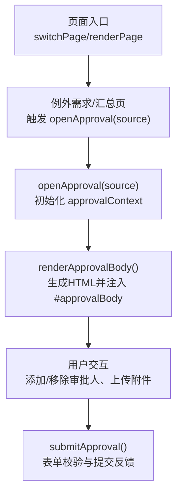
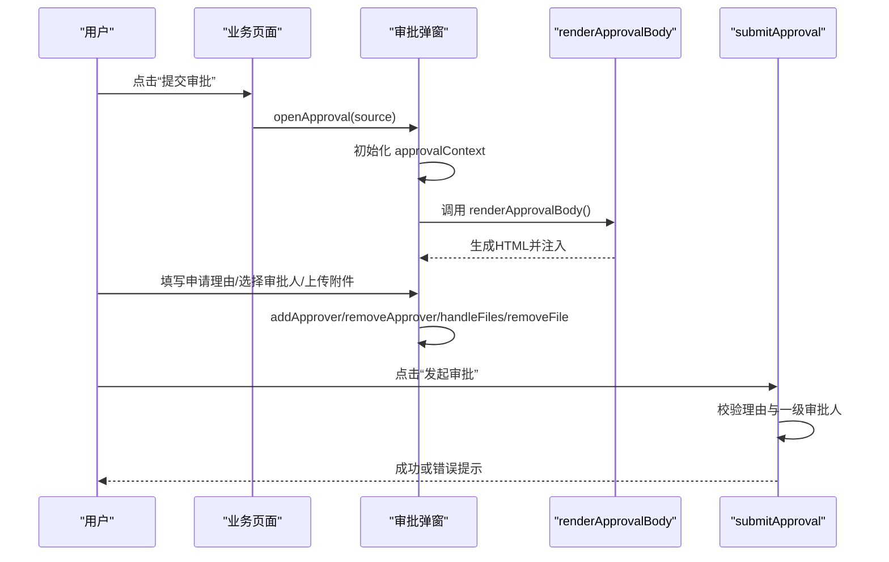
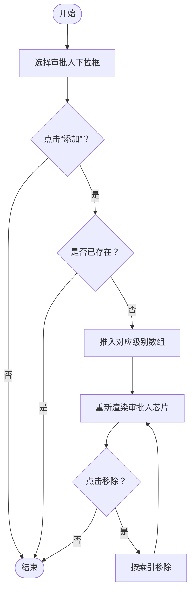
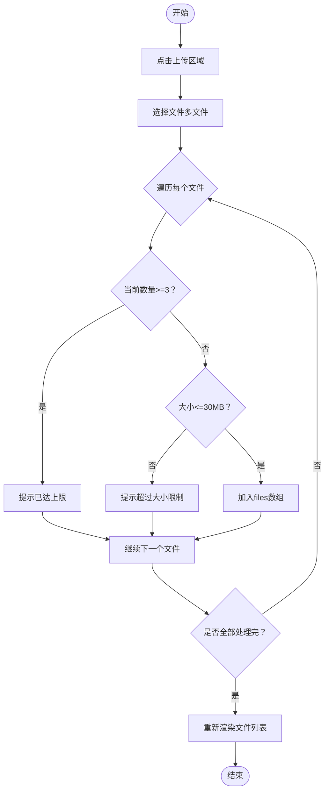
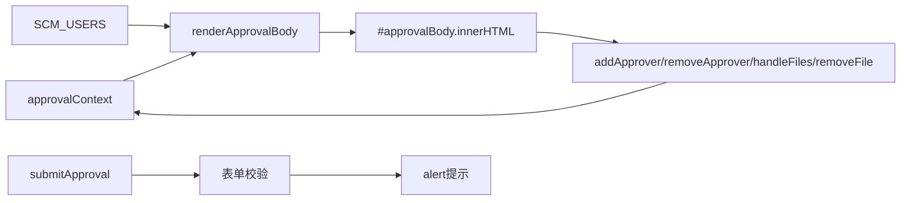

# 表单渲染系统

<cite>
**本文档引用的文件**
- [sales-forecast-prototype.html](file://sales-forecast-prototype.html)
</cite>

## 目录
1. [简介](#简介)
2. [项目结构](#项目结构)
3. [核心组件](#核心组件)
4. [架构总览](#架构总览)
5. [详细组件分析](#详细组件分析)
6. [依赖关系分析](#依赖关系分析)
7. [性能考量](#性能考量)
8. [故障排查指南](#故障排查指南)
9. [结论](#结论)

## 简介
本文件面向“销售预测3+9需求汇总”原型中的审批弹窗表单渲染系统，重点解析 renderApprovalBody 函数的实现与动态渲染逻辑，涵盖申请理由输入框、三级审批人选择区域、附件上传区域的生成机制；解释HTML模板字符串的构建方式（审批人芯片组件、文件列表展示、必填标识等UI元素）；并说明表单验证规则与用户交互反馈的实现方式。

## 项目结构
该原型为单页应用，所有页面与弹窗逻辑集中在一个HTML文件中，通过内联脚本与样式组织。审批弹窗相关的关键位置包括：
- 弹窗容器与DOM节点定义（标题、主体、底部按钮）
- 全局状态 approvalContext 用于维护审批上下文数据
- 渲染函数 renderApprovalBody 负责将状态转换为HTML并注入到弹窗主体
- 事件处理函数 addApprover、removeApprover、handleFiles、removeFile、submitApproval 等驱动交互与校验

图表来源
- [sales-forecast-prototype.html:127-139](file://sales-forecast-prototype.html#L127-L139)
- [sales-forecast-prototype.html:185-189](file://sales-forecast-prototype.html#L185-L189)
- [sales-forecast-prototype.html:191-249](file://sales-forecast-prototype.html#L191-L249)
- [sales-forecast-prototype.html:274-280](file://sales-forecast-prototype.html#L274-L280)

章节来源
- [sales-forecast-prototype.html:127-139](file://sales-forecast-prototype.html#L127-L139)
- [sales-forecast-prototype.html:185-189](file://sales-forecast-prototype.html#L185-L189)
- [sales-forecast-prototype.html:191-249](file://sales-forecast-prototype.html#L191-L249)
- [sales-forecast-prototype.html:274-280](file://sales-forecast-prototype.html#L274-L280)

## 核心组件
- 弹窗容器与DOM节点
  - 弹窗遮罩与主体容器：包含标题、主体、底部操作区
  - 主体容器ID用于动态注入HTML
- 全局状态 approvalContext
  - 字段：source（来源）、selectedL1/L2/L3（各级审批人数组）、reason（申请理由）、files（附件数组）
- 渲染函数 renderApprovalBody
  - 根据 approvalContext 生成三段式HTML：申请理由、审批人选择、附件上传
  - 动态构建审批人芯片、文件列表、必填标识、空态提示
- 交互函数
  - addApprover(level)：从下拉选择添加审批人到对应级别
  - removeApprover(level, idx)：移除指定级别的审批人
  - handleFiles(input)：处理多文件上传，限制数量与大小
  - removeFile(idx)：移除已选附件
  - submitApproval()：表单校验与提交反馈

章节来源
- [sales-forecast-prototype.html:146](file://sales-forecast-prototype.html#L146)
- [sales-forecast-prototype.html:191-249](file://sales-forecast-prototype.html#L191-L249)
- [sales-forecast-prototype.html:250-273](file://sales-forecast-prototype.html#L250-L273)
- [sales-forecast-prototype.html:274-280](file://sales-forecast-prototype.html#L274-L280)

## 架构总览
审批弹窗渲染流程采用“状态驱动视图”的模式：
- 打开弹窗时初始化状态
- 渲染函数将状态映射为HTML片段
- 用户交互更新状态后重新渲染
- 提交时执行校验并给出即时反馈

图表来源
- [sales-forecast-prototype.html:185-189](file://sales-forecast-prototype.html#L185-L189)
- [sales-forecast-prototype.html:191-249](file://sales-forecast-prototype.html#L191-L249)
- [sales-forecast-prototype.html:250-273](file://sales-forecast-prototype.html#L250-L273)
- [sales-forecast-prototype.html:274-280](file://sales-forecast-prototype.html#L274-L280)

## 详细组件分析

### 申请理由输入框
- 渲染逻辑
  - 在HTML模板中生成 textarea 元素，绑定 oninput 事件以实时同步 approvalContext.reason
  - 显示必填标识（红色星号），占位符引导用户输入原因
- 数据绑定
  - 使用 innerHTML 直接写入 value 初始值，确保打开弹窗时回填历史内容
- 交互反馈
  - 提交时校验 reason.trim() 是否为空，为空则弹出提示阻止提交

章节来源
- [sales-forecast-prototype.html:197-201](file://sales-forecast-prototype.html#L197-L201)
- [sales-forecast-prototype.html:274-276](file://sales-forecast-prototype.html#L274-L276)

### 三级审批人选择区域
- 渲染逻辑
  - 每个级别包含：
    - 标签与必填标识（一级为必选，二三级可选）
    - 下拉选择框，过滤掉已选人员避免重复
    - “添加”按钮，触发 addApprover(level)
    - 芯片区域，动态渲染已选人员，支持逐个移除
  - 未选择时显示空态提示文本
- 数据结构
  - selectedL1/L2/L3 为字符串数组，存储已选审批人姓名
- 交互逻辑
  - addApprover(level)：读取对应下拉值，去重后推入数组并重新渲染
  - removeApprover(level, idx)：按索引删除并重新渲染
- 视觉组件
  - 审批人芯片使用 approver-chip 类，内含可点击的移除图标 chip-remove

章节来源
- [sales-forecast-prototype.html:193-236](file://sales-forecast-prototype.html#L193-L236)
- [sales-forecast-prototype.html:250-262](file://sales-forecast-prototype.html#L250-L262)

### 附件上传区域
- 渲染逻辑
  - 生成虚线边框的上传区域，点击触发隐藏的 fileInput
  - 限制 accept 属性为图片与常见办公文档格式
  - 文件列表区域动态渲染每个附件的名称、大小与移除按钮
  - 当达到最大数量（3个）时显示限制提示
- 数据处理
  - handleFiles(input)：遍历 input.files，校验数量上限与单个文件大小（不超过30MB）
  - 将合法文件对象包装为 {name, size} 存入 approvalContext.files
  - removeFile(idx)：按索引移除文件并重新渲染
- 交互反馈
  - 超出数量或大小限制时通过 alert 提示用户

章节来源
- [sales-forecast-prototype.html:238-247](file://sales-forecast-prototype.html#L238-L247)
- [sales-forecast-prototype.html:263-273](file://sales-forecast-prototype.html#L263-L273)

### HTML模板字符串生成机制
- 模板拼接策略
  - 使用模板字符串与数组 map/join 组合生成动态HTML片段
  - 审批人芯片：基于 selectedLx 数组生成多个 span.approver-chip，每个包含移除按钮
  - 文件列表：基于 files 数组生成 div.file-item，显示名称与大小，附带移除操作
  - 必填标识：在标题旁插入红色星号，区分必填与非必填字段
- 条件渲染
  - 空态提示：当某级审批人未选择时显示灰色提示文本
  - 附件上限提示：当 files.length >= 3 时显示红色提示
- 事件绑定
  - 通过内联 onclick 绑定 addApprover、removeApprover、handleFiles、removeFile 等函数

章节来源
- [sales-forecast-prototype.html:193-247](file://sales-forecast-prototype.html#L193-L247)

### 表单验证规则与用户交互反馈
- 验证规则
  - 申请理由：非空校验（trim后判断）
  - 一级审批人：至少选择一个
  - 二级/三级审批人：可选，无强制要求
  - 附件：最多3个，单个不超过30MB，格式受 accept 限制
- 反馈方式
  - 前端即时提示：使用 alert 显示错误信息（如未填写理由、未选择一级审批人、文件超限等）
  - 成功反馈：提交成功后生成随机审批单号并弹窗确认，同时关闭弹窗
- 状态一致性
  - 每次交互后调用 renderApprovalBody 保证视图与状态一致

章节来源
- [sales-forecast-prototype.html:274-280](file://sales-forecast-prototype.html#L274-L280)
- [sales-forecast-prototype.html:263-273](file://sales-forecast-prototype.html#L263-L273)

### 流程图：审批人添加与移除

图表来源
- [sales-forecast-prototype.html:250-262](file://sales-forecast-prototype.html#L250-L262)

### 流程图：附件上传与校验

图表来源
- [sales-forecast-prototype.html:263-273](file://sales-forecast-prototype.html#L263-L273)

## 依赖关系分析
- 模块耦合
  - renderApprovalBody 依赖 approvalContext 状态与 SCM_USERS 数据源
  - 交互函数依赖 DOM 查询与 innerHTML 更新
  - 提交函数依赖全局 alert 进行反馈
- 外部依赖
  - 无第三方库，纯原生JS与CSS
- 潜在循环依赖
  - 无循环引用，函数间单向调用

图表来源
- [sales-forecast-prototype.html:146](file://sales-forecast-prototype.html#L146)
- [sales-forecast-prototype.html:191-249](file://sales-forecast-prototype.html#L191-L249)
- [sales-forecast-prototype.html:250-280](file://sales-forecast-prototype.html#L250-L280)

章节来源
- [sales-forecast-prototype.html:146](file://sales-forecast-prototype.html#L146)
- [sales-forecast-prototype.html:191-280](file://sales-forecast-prototype.html#L191-L280)

## 性能考量
- 渲染频率
  - 每次交互都重新渲染整个弹窗主体，可能在大列表场景下产生不必要的开销
- 优化建议
  - 对审批人芯片与文件列表进行局部更新（仅变更受影响节点）
  - 使用防抖减少频繁 oninput 触发的渲染
  - 预计算下拉选项列表，避免每次渲染时重复 filter

[本节为通用指导，不直接分析具体文件]

## 故障排查指南
- 常见问题
  - 审批人重复添加：检查 addApprover 的去重逻辑
  - 附件无法上传：检查 accept 属性与浏览器兼容性
  - 提交失败：确认理由与一级审批人是否满足校验规则
- 调试技巧
  - 在 handleFiles 与 submitApproval 中添加 console.log 观察状态变化
  - 检查 DOM 节点是否存在（如 #approvalBody、#fileInput）

章节来源
- [sales-forecast-prototype.html:263-280](file://sales-forecast-prototype.html#L263-L280)

## 结论
本审批弹窗表单渲染系统采用简洁的状态驱动模式，通过 renderApprovalBody 将 approvalContext 动态映射为HTML，实现了申请理由输入、三级审批人选择与附件上传的核心功能。其优势在于实现简单、易于理解；改进空间在于局部渲染优化与更丰富的交互反馈。整体设计符合原型快速迭代的需求，具备良好的可扩展性。