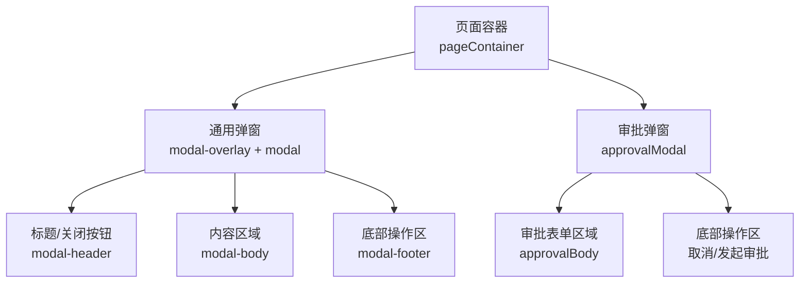
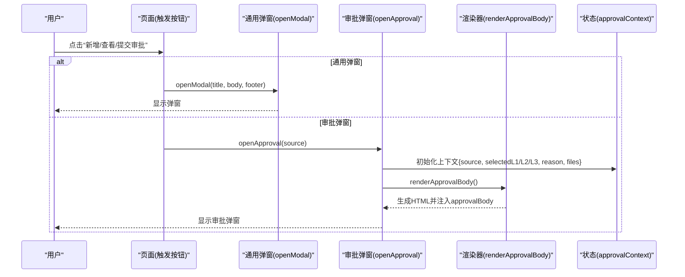
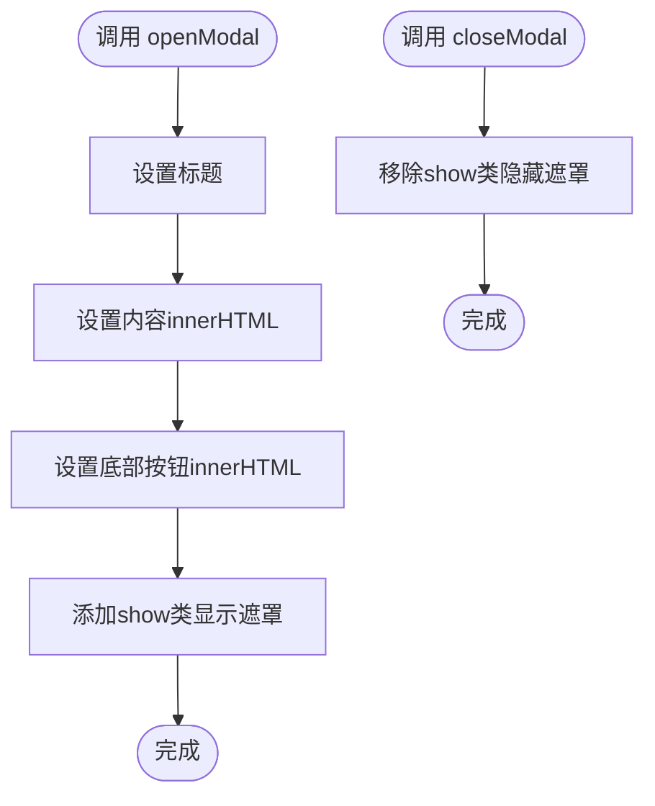
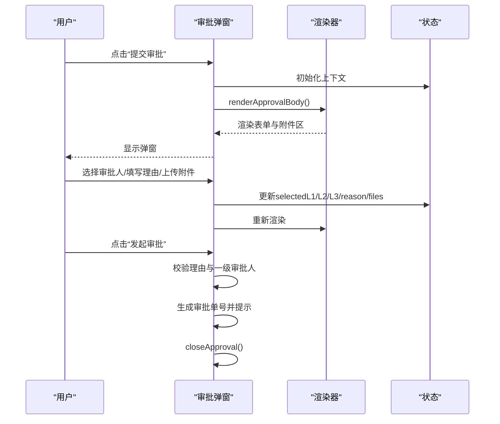
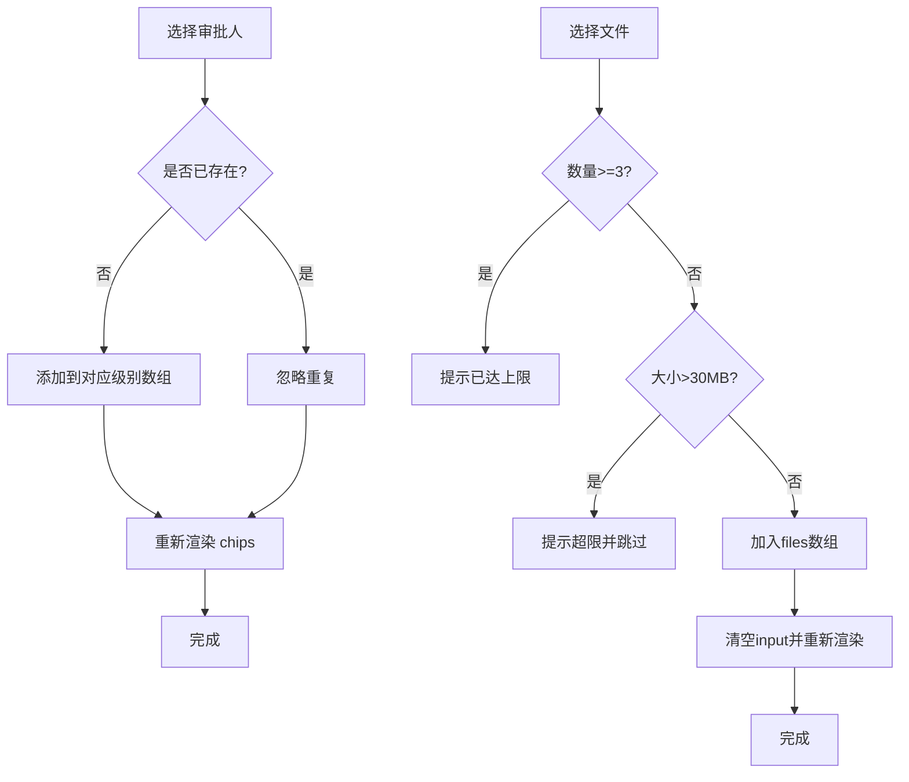
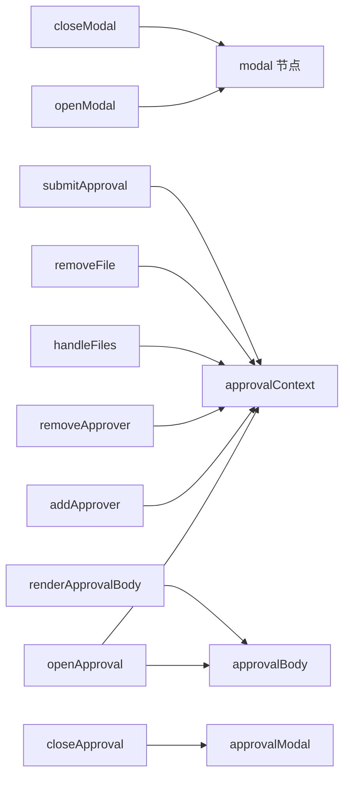

# 模态弹窗系统

<cite>
**本文引用的文件**   
- [sales-forecast-prototype.html](file://sales-forecast-prototype.html)
</cite>

## 目录
1. [简介](#简介)
2. [项目结构](#项目结构)
3. [核心组件](#核心组件)
4. [架构总览](#架构总览)
5. [详细组件分析](#详细组件分析)
6. [依赖关系分析](#依赖关系分析)
7. [性能与体验优化](#性能与体验优化)
8. [故障排查指南](#故障排查指南)
9. [结论](#结论)
10. [附录：最佳实践清单](#附录最佳实践清单)

## 简介
本文件为销售预测原型中的“模态弹窗系统”提供完整、深入的技术文档。内容覆盖通用弹窗（openModal、closeModal）与专用审批弹窗（openApproval、closeApproval）的实现机制，包括弹窗内容渲染、事件处理、状态管理、文件上传、审批人选择、附件管理等高级特性，并给出用户体验优化、性能考虑与错误处理的实践建议。

## 项目结构
该原型为单页应用，所有页面与弹窗逻辑集中在一个 HTML 文件中，通过内联样式与脚本实现。弹窗相关的关键位置如下：
- 通用弹窗容器与 DOM 节点定义
- 提交审批弹窗容器与 DOM 节点定义
- 工具函数与弹窗控制函数（openModal、closeModal、openApproval、closeApproval）
- 审批弹窗的渲染与交互逻辑（renderApprovalBody、addApprover、removeApprover、handleFiles、removeFile、submitApproval）

图表来源
- [sales-forecast-prototype.html:128-139](file://sales-forecast-prototype.html#L128-L139)

章节来源
- [sales-forecast-prototype.html:128-139](file://sales-forecast-prototype.html#L128-L139)

## 核心组件
- 通用弹窗 openModal/closeModal
  - 功能：动态设置标题、内容与底部按钮；显示/隐藏遮罩层。
  - 使用场景：新增/编辑/查看等轻量级交互。
- 审批弹窗 openApproval/closeApproval
  - 功能：初始化审批上下文、渲染多级审批人选择、申请理由输入、附件上传与管理、提交校验与反馈。
  - 使用场景：例外需求、汇总发布等需要审批的业务流程。

章节来源
- [sales-forecast-prototype.html:179-182](file://sales-forecast-prototype.html#L179-L182)
- [sales-forecast-prototype.html:185-190](file://sales-forecast-prototype.html#L185-L190)

## 架构总览
弹窗系统采用“单一容器 + 动态内容注入”的模式，配合全局状态对象管理审批上下文。整体数据流如下：

图表来源
- [sales-forecast-prototype.html:179-190](file://sales-forecast-prototype.html#L179-L190)
- [sales-forecast-prototype.html:191-249](file://sales-forecast-prototype.html#L191-L249)

## 详细组件分析

### 通用弹窗（openModal / closeModal）
- 打开流程
  - 设置标题文本、内容 innerHTML、底部按钮 innerHTML
  - 为遮罩层添加 show 类以显示
- 关闭流程
  - 移除 show 类以隐藏遮罩层
- 典型调用点
  - 新增/编辑/查看详情等按钮直接传入 HTML 片段作为内容

图表来源
- [sales-forecast-prototype.html:179-182](file://sales-forecast-prototype.html#L179-L182)

章节来源
- [sales-forecast-prototype.html:179-182](file://sales-forecast-prototype.html#L179-L182)

### 审批弹窗（openApproval / closeApproval）
- 打开流程
  - 重置 approvalContext（来源、各级审批人列表、申请理由、附件数组）
  - 调用 renderApprovalBody 渲染表单
  - 显示遮罩层
- 关闭流程
  - 移除遮罩层 show 类
- 渲染逻辑
  - 根据 selectedL1/L2/L3 生成可删除的“标签芯片”
  - 根据 files 生成文件列表项（名称、大小、移除按钮）
  - 动态绑定选择框与“添加”按钮的事件
  - 限制最大附件数量与单个文件大小提示
- 交互逻辑
  - addApprover：从下拉选择中追加审批人到对应级别，去重后重新渲染
  - removeApprover：按索引移除指定级别的审批人并重新渲染
  - handleFiles：校验数量上限与大小限制，将文件元信息加入 files 并刷新视图
  - removeFile：按索引移除文件并刷新视图
  - submitApproval：校验必填字段（申请理由、一级审批人），生成审批单号并提示成功，随后关闭弹窗

图表来源
- [sales-forecast-prototype.html:185-190](file://sales-forecast-prototype.html#L185-L190)
- [sales-forecast-prototype.html:191-249](file://sales-forecast-prototype.html#L191-L249)
- [sales-forecast-prototype.html:250-280](file://sales-forecast-prototype.html#L250-L280)

章节来源
- [sales-forecast-prototype.html:185-190](file://sales-forecast-prototype.html#L185-L190)
- [sales-forecast-prototype.html:191-249](file://sales-forecast-prototype.html#L191-L249)
- [sales-forecast-prototype.html:250-280](file://sales-forecast-prototype.html#L250-L280)

### 审批人选择与附件管理
- 审批人选择
  - 支持三级审批人（L1 必选且多选，L2/L3 可选且多选）
  - 通过下拉选择与“添加”按钮组合，避免重复选择
  - 每个审批人以“芯片”形式展示，支持一键移除
- 附件管理
  - 点击上传区域触发隐藏的 file input，支持多文件
  - 限制最多 3 个附件，单文件不超过 30MB
  - 上传成功后在列表中显示文件名与大小，并提供移除操作

图表来源
- [sales-forecast-prototype.html:250-273](file://sales-forecast-prototype.html#L250-L273)

章节来源
- [sales-forecast-prototype.html:250-273](file://sales-forecast-prototype.html#L250-L273)

### 事件处理与状态管理
- 事件处理
  - 通过内联 onclick 绑定到 DOM 元素，如“添加审批人”、“移除审批人”、“上传文件”、“移除附件”、“提交审批”
  - 渲染时动态拼接事件字符串，确保每次渲染后事件有效
- 状态管理
  - 使用全局对象 approvalContext 集中管理审批弹窗的状态（来源、各级审批人、理由、附件）
  - 任何状态变更都触发 renderApprovalBody 进行视图同步

章节来源
- [sales-forecast-prototype.html:191-249](file://sales-forecast-prototype.html#L191-L249)
- [sales-forecast-prototype.html:250-280](file://sales-forecast-prototype.html#L250-L280)

## 依赖关系分析
- 通用弹窗依赖
  - DOM 节点：modal、modalTitle、modalBody、modalFooter
  - CSS 类：modal-overlay.show 控制显示
- 审批弹窗依赖
  - DOM 节点：approvalModal、approvalBody
  - 全局状态：approvalContext
  - 辅助函数：renderApprovalBody、addApprover、removeApprover、handleFiles、removeFile、submitApproval

图表来源
- [sales-forecast-prototype.html:179-190](file://sales-forecast-prototype.html#L179-L190)
- [sales-forecast-prototype.html:191-249](file://sales-forecast-prototype.html#L191-L249)
- [sales-forecast-prototype.html:250-280](file://sales-forecast-prototype.html#L250-L280)

章节来源
- [sales-forecast-prototype.html:179-190](file://sales-forecast-prototype.html#L179-L190)
- [sales-forecast-prototype.html:191-249](file://sales-forecast-prototype.html#L191-L249)
- [sales-forecast-prototype.html:250-280](file://sales-forecast-prototype.html#L250-L280)

## 性能与体验优化
- 渲染性能
  - 审批弹窗频繁 re-render，建议在大数据量或复杂表单场景下引入虚拟滚动或按需渲染
  - 避免在渲染过程中执行耗时计算，必要时使用 requestAnimationFrame 或 Web Worker
- 内存与资源
  - 文件仅保存元信息（名称、大小），不保留 Blob 引用，减少内存占用
  - 及时清空 file input 的值，防止重复选择无效
- 交互体验
  - 对必填项进行即时校验与友好提示（申请理由、一级审批人）
  - 对附件数量与大小限制进行前置提示，避免用户误操作
  - 提供清晰的“移除”操作与二次确认（如需）
- 可访问性
  - 为关键控件增加 aria-label 与键盘可达性（Esc 关闭弹窗）
  - 焦点管理：打开弹窗时将焦点置于标题或首个输入框，关闭时恢复焦点

[本节为通用指导，不直接分析具体文件]

## 故障排查指南
- 常见问题
  - 弹窗不显示：检查遮罩层是否添加了 show 类；确认 DOM 节点 ID 正确
  - 审批人未生效：确认 selectedL1/L2/L3 数组是否正确更新；检查渲染时是否重新赋值 innerHTML
  - 附件无法上传：检查 accept 属性与类型过滤；确认大小限制与数量限制逻辑
  - 提交失败：检查申请理由是否为空；检查一级审批人是否为空
- 调试建议
  - 在关键函数入口打印 approvalContext 状态变化
  - 使用浏览器开发者工具的“事件监听器”面板定位内联事件绑定问题
  - 对渲染后的 DOM 快照比对，确认模板拼接是否符合预期

章节来源
- [sales-forecast-prototype.html:191-249](file://sales-forecast-prototype.html#L191-L249)
- [sales-forecast-prototype.html:250-280](file://sales-forecast-prototype.html#L250-L280)

## 结论
本弹窗系统以简洁的“通用弹窗 + 专用审批弹窗”模式满足销售预测原型的交互需求。通用弹窗负责轻量级内容展示与操作，审批弹窗则承载复杂的表单与附件管理。通过全局状态与渲染函数协同，实现了良好的可维护性与扩展性。后续可在性能、可访问性与错误处理方面进一步加固，以提升用户体验与稳定性。

[本节为总结性内容，不直接分析具体文件]

## 附录：最佳实践清单
- 统一弹窗 API
  - 封装 openModal/closeModal 的参数规范（标题、内容、底部按钮）
  - 统一返回 Promise 或回调，便于异步处理
- 审批流程增强
  - 支持审批历史与审计日志
  - 增加审批人搜索与分组筛选
  - 支持批量选择与导入审批人
- 附件管理升级
  - 支持拖拽上传与预览
  - 增加文件类型白名单与病毒扫描提示
  - 支持分片上传与大文件断点续传
- 错误处理与提示
  - 统一错误码与提示文案
  - 网络异常重试与降级策略
- 性能优化
  - 延迟渲染非关键区域
  - 防抖/节流高频事件（如输入、滚动）
- 可访问性与国际化
  - 完善 ARIA 属性与键盘导航
  - 文案抽离至 i18n 文件

[本节为通用指导，不直接分析具体文件]