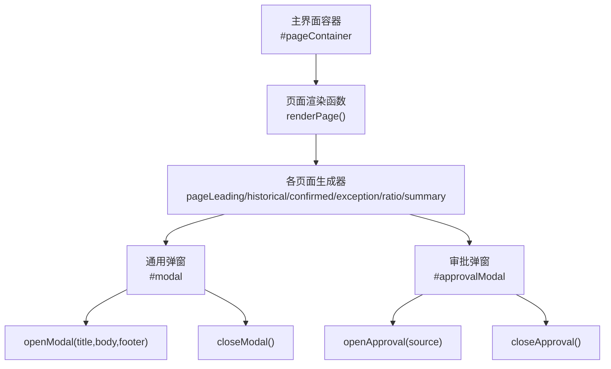
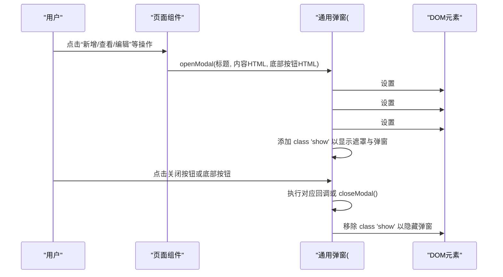
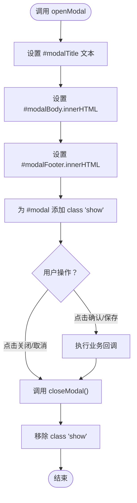
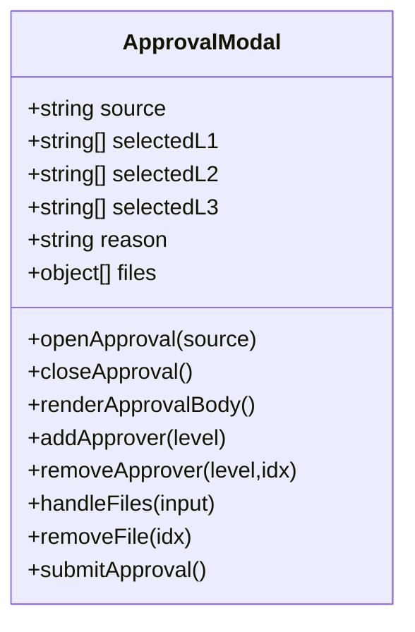
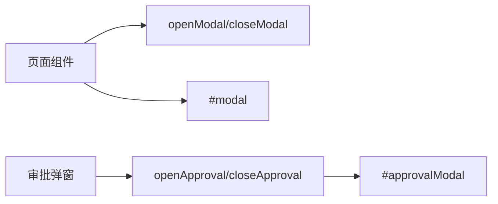

# 通用弹窗系统

<cite>
**本文引用的文件**   
- [sales-forecast-prototype.html](file://sales-forecast-prototype.html)
- [sales-forecast-prototype_副本.html](file://sales-forecast-prototype_副本.html)
</cite>

## 目录
1. [简介](#简介)
2. [项目结构](#项目结构)
3. [核心组件](#核心组件)
4. [架构总览](#架构总览)
5. [详细组件分析](#详细组件分析)
6. [依赖关系分析](#依赖关系分析)
7. [性能与可访问性](#性能与可访问性)
8. [故障排查指南](#故障排查指南)
9. [结论](#结论)
10. [附录：使用示例与最佳实践](#附录使用示例与最佳实践)

## 简介
本文件为销售预测原型中的“通用弹窗系统”提供完整的技术文档。重点说明 openModal 与 closeModal 的实现机制，包括弹窗标题设置、内容渲染、底部按钮配置、显示/隐藏逻辑、事件处理与 DOM 操作方式；同时覆盖样式设计、响应式布局与用户体验优化要点，并给出通用弹窗的使用示例与最佳实践。

## 项目结构
该原型采用单页应用（SPA）模式，页面通过 JavaScript 动态渲染不同模块。通用弹窗作为全局 UI 能力，被多处业务页面调用，用于新增、编辑、查看等交互场景。

图表来源
- [sales-forecast-prototype.html:122-128](file://sales-forecast-prototype.html#L122-L128)
- [sales-forecast-prototype.html:179-182](file://sales-forecast-prototype.html#L179-L182)
- [sales-forecast-prototype.html:185-190](file://sales-forecast-prototype.html#L185-L190)

章节来源
- [sales-forecast-prototype.html:122-128](file://sales-forecast-prototype.html#L122-L128)
- [sales-forecast-prototype.html:179-182](file://sales-forecast-prototype.html#L179-L182)

## 核心组件
- 通用弹窗 DOM 结构
  - 遮罩层：#modal（类名 modal-overlay），控制显示/隐藏
  - 弹窗容器：.modal，承载头部、主体、底部
  - 头部：#modalTitle（标题）、关闭按钮（.modal-close）
  - 主体：#modalBody（动态内容）
  - 底部：#modalFooter（动态按钮）
- 关键函数
  - openModal(title, body, footer)：设置标题、注入内容、渲染底部按钮并显示弹窗
  - closeModal()：移除 show 类以隐藏弹窗
  - 审批弹窗相关：openApproval、closeApproval、renderApprovalBody 等

章节来源
- [sales-forecast-prototype.html:128](file://sales-forecast-prototype.html#L128)
- [sales-forecast-prototype.html:179-182](file://sales-forecast-prototype.html#L179-L182)
- [sales-forecast-prototype.html:185-190](file://sales-forecast-prototype.html#L185-L190)

## 架构总览
通用弹窗的调用链路清晰：业务页面触发 → 调用 openModal → 更新 DOM → 切换显示状态 → 用户交互 → 调用 closeModal 或业务回调。

图表来源
- [sales-forecast-prototype.html:179-182](file://sales-forecast-prototype.html#L179-L182)
- [sales-forecast-prototype.html:128](file://sales-forecast-prototype.html#L128)

## 详细组件分析

### 通用弹窗 openModal/closeModal 实现机制
- 标题设置
  - 通过选择器获取 #modalTitle，直接赋值文本内容
- 内容渲染
  - 将传入的 HTML 字符串注入到 #modalBody 的 innerHTML
- 底部按钮配置
  - 将传入的 HTML 字符串注入到 #modalFooter 的 innerHTML；若未传则清空
- 显示/隐藏逻辑
  - 显示：给 #modal 添加 class 'show'（CSS 中 .modal-overlay.show 使用 flex 居中显示）
  - 隐藏：移除 class 'show'
- 事件处理
  - 关闭按钮绑定 closeModal，直接移除 show 类
  - 底部按钮可通过内联 onclick 调用 closeModal 或自定义回调

图表来源
- [sales-forecast-prototype.html:179-182](file://sales-forecast-prototype.html#L179-L182)

章节来源
- [sales-forecast-prototype.html:179-182](file://sales-forecast-prototype.html#L179-L182)

### 审批弹窗（专用）
- 用途：提交审批流程，包含申请理由、多级审批人选择、附件上传
- 数据结构：approvalContext 维护当前上下文（来源、各级审批人、理由、附件）
- 渲染：renderApprovalBody 根据上下文动态生成表单与列表
- 交互：addApprover/removeApprover、handleFiles/removeFile、submitApproval 等

图表来源
- [sales-forecast-prototype.html:185-280](file://sales-forecast-prototype.html#L185-L280)

章节来源
- [sales-forecast-prototype.html:185-280](file://sales-forecast-prototype.html#L185-L280)

### 样式设计与响应式布局
- 遮罩层与定位
  - .modal-overlay：固定定位覆盖全屏，背景半透明，z-index 较高，flex 居中
  - .modal-overlay.show：display:flex 显示遮罩与弹窗
- 弹窗容器
  - .modal：圆角、阴影、最大高度 85vh、内部滚动
  - 宽度默认 90%，在部分场景通过 style 指定 max-width（如 680px、720px）
- 头部/主体/底部
  - .modal-header：标题与关闭按钮，左右分布
  - .modal-body：内容区域，内边距适中
  - .modal-footer：右对齐按钮组，间距统一
- 关闭按钮
  - .modal-close：无背景边框，字体大小 18px，悬停变色
- 响应式
  - 使用百分比宽度与 max-height，适配移动端与桌面端
  - 表格与表单在小屏下通过滚动与换行保证可用性

章节来源
- [sales-forecast-prototype.html:73-79](file://sales-forecast-prototype.html#L73-L79)
- [sales-forecast-prototype.html:128](file://sales-forecast-prototype.html#L128)

### 数据流与 DOM 操作
- 数据流
  - 页面组件生成 HTML 片段 → 传入 openModal → 写入 #modalBody/#modalFooter
  - 用户输入通过内联事件或后续脚本读取 DOM 值
- DOM 操作
  - 使用 document.querySelector 简化选择器
  - 通过 textContent/innerHTML 更新标题与内容
  - 通过 classList.add/remove 控制显示/隐藏

章节来源
- [sales-forecast-prototype.html:149-150](file://sales-forecast-prototype.html#L149-L150)
- [sales-forecast-prototype.html:179-182](file://sales-forecast-prototype.html#L179-L182)

## 依赖关系分析
- 组件耦合
  - 页面组件与弹窗解耦：仅通过 openModal 接口传递 HTML 字符串，不直接操作弹窗 DOM
  - 审批弹窗独立于通用弹窗，拥有自己的 DOM 结构与状态管理
- 外部依赖
  - CSS 类名约定（modal-overlay、modal、modal-header/body/footer）
  - 工具函数 $(s) 用于快速选择元素

图表来源
- [sales-forecast-prototype.html:179-182](file://sales-forecast-prototype.html#L179-L182)
- [sales-forecast-prototype.html:185-190](file://sales-forecast-prototype.html#L185-L190)

章节来源
- [sales-forecast-prototype.html:179-182](file://sales-forecast-prototype.html#L179-L182)
- [sales-forecast-prototype.html:185-190](file://sales-forecast-prototype.html#L185-L190)

## 性能与可访问性
- 性能
  - 使用 innerHTML 批量渲染，减少多次 DOM 操作开销
  - 避免在高频事件中重复创建大段 HTML，建议缓存模板或使用轻量模板引擎
- 可访问性
  - 弹窗焦点管理：打开时聚焦到弹窗内第一个可交互元素，关闭后返回触发元素
  - 键盘支持：Esc 关闭弹窗，Tab 顺序合理
  - 语义化标签：标题使用 h2/h3，按钮具备 aria-label
- 无障碍与体验
  - 遮罩层阻止背景滚动（可添加 overflow:hidden 到 body）
  - 动画过渡：增加淡入淡出提升体验（需兼容考虑）

[本节为通用指导，不直接分析具体文件]

## 故障排查指南
- 常见问题
  - 弹窗不显示：检查 #modal 是否添加了 class 'show'；确认 CSS 未被覆盖
  - 内容未渲染：确认传入的 HTML 字符串是否正确，是否存在转义问题
  - 按钮无效：检查内联 onclick 是否正确绑定，或是否在动态内容后重新绑定事件
  - 审批弹窗校验失败：检查必填字段与审批人选择逻辑
- 调试建议
  - 在 openModal/closeModal 中添加 console.log 观察参数与 DOM 变化
  - 使用浏览器开发者工具检查 #modalBody 与 #modalFooter 的内容
  - 对审批弹窗，检查 approvalContext 的状态变化

章节来源
- [sales-forecast-prototype.html:179-182](file://sales-forecast-prototype.html#L179-L182)
- [sales-forecast-prototype.html:274-280](file://sales-forecast-prototype.html#L274-L280)

## 结论
通用弹窗系统通过简洁的 openModal/closeModal 接口，实现了标题设置、内容渲染与底部按钮配置的标准化流程。其样式与布局具备良好的响应式特性，适用于多场景的交互需求。结合审批弹窗的专用实现，原型在功能与体验上达到了较高的保真度。建议在后续迭代中引入模板引擎与焦点管理，进一步提升可维护性与可访问性。

[本节为总结，不直接分析具体文件]

## 附录：使用示例与最佳实践

### 使用示例
- 基础用法
  - 调用 openModal('标题', '
内容
', '<button>确定</button>')
  - 在按钮的 onclick 中调用 closeModal() 或业务回调
- 复杂表单
  - 在 body 中嵌入表单 HTML，使用统一的 form-group、form-label 等类名
  - 在 footer 中放置“取消”“保存”按钮，分别调用 closeModal() 与业务逻辑
- 查看详情
  - 使用只读输入框展示数据，footer 仅保留“关闭”按钮

章节来源
- [sales-forecast-prototype.html:360](file://sales-forecast-prototype.html#L360)
- [sales-forecast-prototype.html:379](file://sales-forecast-prototype.html#L379)
- [sales-forecast-prototype.html:380](file://sales-forecast-prototype.html#L380)
- [sales-forecast-prototype.html:443](file://sales-forecast-prototype.html#L443)

### 最佳实践
- 保持 HTML 片段简洁，避免过长字符串拼接
- 统一使用现有样式类，确保视觉一致性
- 对用户输入进行必要校验，及时反馈错误信息
- 注意弹窗层级与焦点管理，提升可访问性
- 对于频繁使用的弹窗，考虑封装为组件或模板函数

[本节为通用指导，不直接分析具体文件]