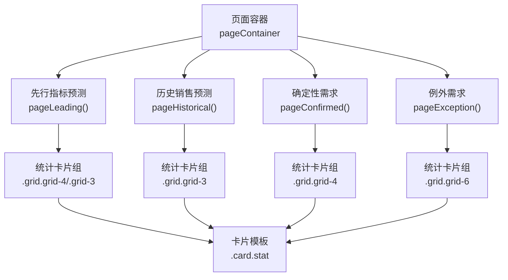
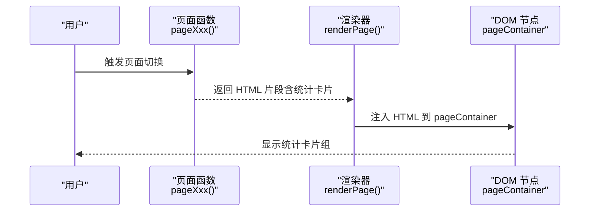
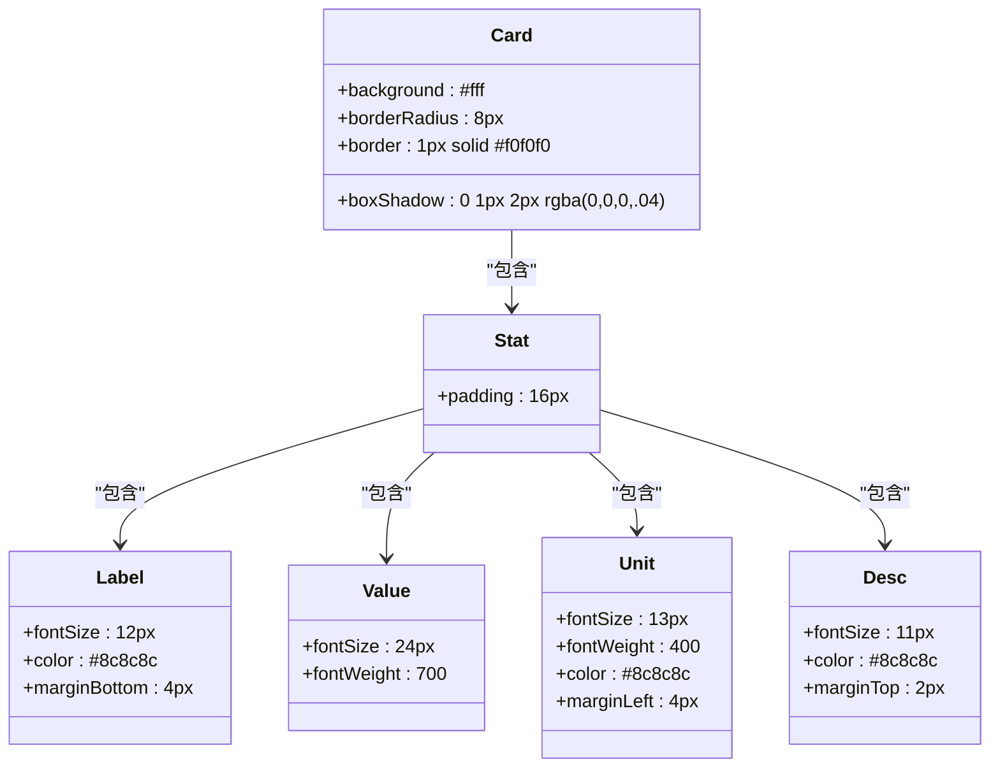

# 统计卡片组件

<cite>
**本文引用的文件**   
- [sales-forecast-prototype.html](file://sales-forecast-prototype.html)
- [sales-forecast-prototype_副本.html](file://sales-forecast-prototype_副本.html)
</cite>

## 目录
1. [简介](#简介)
2. [项目结构](#项目结构)
3. [核心组件](#核心组件)
4. [架构总览](#架构总览)
5. [详细组件分析](#详细组件分析)
6. [依赖关系分析](#依赖关系分析)
7. [性能考量](#性能考量)
8. [故障排查指南](#故障排查指南)
9. [结论](#结论)
10. [附录](#附录)

## 简介
本文件为销售预测原型中的“统计卡片（stat）”组件提供系统化文档，覆盖样式定义、数据展示格式与颜色主题系统；详解 stat-label、stat-value、stat-unit、stat-desc 等子元素的用途与规范；并给出数值格式化、单位显示、趋势指示等实践方法。同时提供多业务场景下的使用示例，如 PMI 指数、销售额、订单数量等统计数据的展示方式。

## 项目结构
该原型采用单页 HTML + 内联 CSS/JS 的结构，统计卡片通过通用样式类 .card.stat 组合呈现，并在多个页面中复用：
- 先行指标预测：PMI、消费者信心、原材料价格、综合趋势
- 历史销售预测：平均预测准确率、累计实际/预测销售额
- 确定性需求：已确认/待确认订单数、总需求数量、预计交付金额
- 例外需求：按审批状态分布的统计卡片（草稿、审批中、已通过、已驳回、已撤回、总计）

图表来源
- [sales-forecast-prototype.html:289-292](file://sales-forecast-prototype.html#L289-L292)
- [sales-forecast-prototype.html:295-304](file://sales-forecast-prototype.html#L295-L304)
- [sales-forecast-prototype.html:307-316](file://sales-forecast-prototype.html#L307-L316)
- [sales-forecast-prototype.html:319-328](file://sales-forecast-prototype.html#L319-L328)
- [sales-forecast-prototype.html:345-365](file://sales-forecast-prototype.html#L345-L365)

章节来源
- [sales-forecast-prototype.html:289-292](file://sales-forecast-prototype.html#L289-L292)
- [sales-forecast-prototype.html:295-304](file://sales-forecast-prototype.html#L295-L304)
- [sales-forecast-prototype.html:307-316](file://sales-forecast-prototype.html#L307-L316)
- [sales-forecast-prototype.html:319-328](file://sales-forecast-prototype.html#L319-L328)
- [sales-forecast-prototype.html:345-365](file://sales-forecast-prototype.html#L345-L365)

## 核心组件
统计卡片由以下关键样式类构成：
- .card：卡片容器，白色背景、圆角、轻微阴影与边框
- .stat：统计卡片内边距与布局基础
- .stat-label：指标名称，字号小、次要色
- .stat-value：主数值，字号大、加粗，可叠加语义化文本颜色类
- .stat-unit：单位，字号中等、次要色，位于数值右侧
- .stat-desc：描述信息，字号更小、次要色，用于趋势或说明

在原型中，统计卡片通常以网格布局 .grid 组织，常见列数为 grid-3、grid-4、grid-6，以适应不同页面的信息密度。

章节来源
- [sales-forecast-prototype.html:29-32](file://sales-forecast-prototype.html#L29-L32)
- [sales-forecast-prototype.html:59](file://sales-forecast-prototype.html#L59)
- [sales-forecast-prototype.html:28](file://sales-forecast-prototype.html#L28)

## 架构总览
统计卡片组件在页面渲染流程中的位置如下：
- 页面函数（如 pageLeading、pageHistorical、pageConfirmed、pageException）生成 HTML 字符串
- 使用 .grid 与 .card.stat 构建卡片组
- 每个卡片内部包含 stat-label、stat-value、stat-unit、stat-desc 四个子元素
- 通过语义化文本颜色类（text-success、text-warning、text-danger、text-primary）表达趋势与状态

图表来源
- [sales-forecast-prototype.html:289-292](file://sales-forecast-prototype.html#L289-L292)
- [sales-forecast-prototype.html:295-304](file://sales-forecast-prototype.html#L295-L304)
- [sales-forecast-prototype.html:307-316](file://sales-forecast-prototype.html#L307-L316)
- [sales-forecast-prototype.html:319-328](file://sales-forecast-prototype.html#L319-L328)
- [sales-forecast-prototype.html:345-365](file://sales-forecast-prototype.html#L345-L365)

## 详细组件分析

### 样式定义与视觉规范
- 容器与布局
  - .card：统一卡片外观（白底、圆角、阴影、边框）
  - .stat：卡片内容区的基础样式（内边距）
  - .grid-*：栅格布局，控制每行卡片数量
- 子元素样式
  - .stat-label：12px，次要色，底部间距
  - .stat-value：24px，加粗，主数值
  - .stat-unit：13px，次要色，左间距，紧跟数值
  - .stat-desc：11px，次要色，顶部间距，用于趋势或说明
- 文本颜色语义
  - text-success：正向/健康（绿色 #52c41a）
  - text-warning：警告/中性偏负（黄色 #faad14）
  - text-danger：负面/错误（红色 #ff4d4f）
  - text-primary：品牌主色（蓝色 #1890ff）

章节来源
- [sales-forecast-prototype.html:29-32](file://sales-forecast-prototype.html#L29-L32)
- [sales-forecast-prototype.html:59](file://sales-forecast-prototype.html#L59)
- [sales-forecast-prototype.html:36](file://sales-forecast-prototype.html#L36)

### 数据展示格式
- 数值与单位
  - 数值直接写入 .stat-value
  - 单位通过  插入，例如“万”“件”
- 描述与趋势
  - 使用 .stat-desc 展示“较上月 +0.5”“下一季度预期增长 8.5%”等
  - 可通过 text-* 类强化趋势语义（上升用 success，下降用 danger 等）
- 百分比与千分位
  - 百分比直接在数值后拼接“%”，如“97.4%”
  - 金额与数量可使用千分位分隔符（原型中使用字符串形式），保持可读性

章节来源
- [sales-forecast-prototype.html:299](file://sales-forecast-prototype.html#L299)
- [sales-forecast-prototype.html:311](file://sales-forecast-prototype.html#L311)
- [sales-forecast-prototype.html:323](file://sales-forecast-prototype.html#L323)

### 颜色主题系统
- 语义化文本颜色
  - text-success：正向指标（如准确率、上升趋势）
  - text-warning：中性或需关注（如待确认、预警）
  - text-danger：负面指标（如驳回、下降）
  - text-primary：品牌强调（如趋势文字“上升”）
- 标签与徽章
  - tag-*：用于状态标签（蓝、绿、橙、红、灰）
  - pill：用于状态胶囊（如审批状态）
- 交互与焦点
  - 按钮与输入聚焦时采用品牌主色边框与阴影

章节来源
- [sales-forecast-prototype.html:36](file://sales-forecast-prototype.html#L36)
- [sales-forecast-prototype.html:61](file://sales-forecast-prototype.html#L61)
- [sales-forecast-prototype.html:40-44](file://sales-forecast-prototype.html#L40-L44)
- [sales-forecast-prototype.html:50](file://sales-forecast-prototype.html#L50)

### 子元素用途与规范
- stat-label
  - 用途：指标名称（如“PMI 指数”“累计实际销售额”）
  - 规范：12px，次要色，底部留白
- stat-value
  - 用途：核心数值（如“51.6”“13,380”“97.4%”）
  - 规范：24px，加粗，可叠加 text-* 语义色
- stat-unit
  - 用途：单位（如“万”“件”）
  - 规范：13px，次要色，紧邻数值右侧
- stat-desc
  - 用途：趋势或说明（如“较上月 +0.5”“下一季度预期增长 8.5%”）
  - 规范：11px，次要色，位于数值下方

章节来源
- [sales-forecast-prototype.html:59](file://sales-forecast-prototype.html#L59)
- [sales-forecast-prototype.html:299](file://sales-forecast-prototype.html#L299)
- [sales-forecast-prototype.html:311](file://sales-forecast-prototype.html#L311)
- [sales-forecast-prototype.html:323](file://sales-forecast-prototype.html#L323)

### 数值格式化、单位显示与趋势指示
- 数值格式化
  - 整数与小数：直接使用字符串值，保留必要的小数位（如“51.6”）
  - 千分位：金额与数量使用逗号分隔（如“13,380”“4,280”）
  - 百分比：直接拼接“%”（如“97.4%”）
- 单位显示
  - 通过 .stat-unit 插入单位，避免与数值混排
- 趋势指示
  - 使用 text-* 语义色表达趋势方向（success/warning/danger）
  - 在 .stat-desc 中补充具体变化量（如“较上月 +0.5”）

章节来源
- [sales-forecast-prototype.html:299](file://sales-forecast-prototype.html#L299)
- [sales-forecast-prototype.html:311](file://sales-forecast-prototype.html#L311)
- [sales-forecast-prototype.html:323](file://sales-forecast-prototype.html#L323)

### 业务场景使用示例
- PMI 指数
  - 标签：PMI 指数
  - 数值：51.6（可用 text-success 表示正向）
  - 描述：较上月 +0.5
- 销售额
  - 标签：累计实际销售额 / 累计预测销售额
  - 数值：13,380 / 13,280（带单位“万”）
- 订单数量
  - 标签：已确认订单数 / 待确认订单数 / 总需求数量
  - 数值：156 / 23 / 4,280（单位“件”）
- 审批状态分布（例外需求）
  - 标签：草稿 / 审批中 / 已通过 / 已驳回 / 已撤回 / 总计
  - 数值：对应计数（可按状态使用 text-* 语义色）

章节来源
- [sales-forecast-prototype.html:299](file://sales-forecast-prototype.html#L299)
- [sales-forecast-prototype.html:311](file://sales-forecast-prototype.html#L311)
- [sales-forecast-prototype.html:323](file://sales-forecast-prototype.html#L323)
- [sales-forecast-prototype.html:361](file://sales-forecast-prototype.html#L361)

## 依赖关系分析
- 组件依赖
  - 统计卡片依赖 .card 与 .grid-* 布局
  - 语义化文本颜色依赖 .text-* 类
  - 单位与描述依赖 .stat-unit 与 .stat-desc
- 页面级依赖
  - 各页面函数负责生成统计卡片 HTML
  - 渲染器将 HTML 注入 pageContainer

图表来源
- [sales-forecast-prototype.html:29-32](file://sales-forecast-prototype.html#L29-L32)
- [sales-forecast-prototype.html:59](file://sales-forecast-prototype.html#L59)

章节来源
- [sales-forecast-prototype.html:29-32](file://sales-forecast-prototype.html#L29-L32)
- [sales-forecast-prototype.html:59](file://sales-forecast-prototype.html#L59)

## 性能考量
- 渲染性能
  - 统计卡片为纯静态 HTML 片段，无复杂计算，渲染开销低
  - 使用字符串拼接生成 HTML，适合原型阶段快速迭代
- 样式性能
  - 样式类复用度高，减少重复样式定义
  - 语义化颜色类集中管理，便于维护与扩展
- 可扩展性
  - 如需动态更新数值，可在页面函数中根据数据源替换字符串值
  - 建议后续引入组件化框架以提升可维护性与复用性

[本节为通用指导，不直接分析具体文件]

## 故障排查指南
- 数值未显示或单位错位
  - 检查 .stat-value 与 .stat-unit 的嵌套关系是否正确
  - 确保单位 span 紧跟数值之后
- 趋势颜色不正确
  - 确认是否使用了正确的 text-* 类（success/warning/danger/primary）
  - 检查是否有内联样式覆盖
- 描述信息未显示
  - 检查 .stat-desc 是否存在且内容非空
  - 确认父容器 .stat 的内边距未被覆盖
- 网格布局异常
  - 检查 .grid 与 .grid-* 类是否正确应用
  - 确认卡片数量与列数匹配

章节来源
- [sales-forecast-prototype.html:59](file://sales-forecast-prototype.html#L59)
- [sales-forecast-prototype.html:28](file://sales-forecast-prototype.html#L28)
- [sales-forecast-prototype.html:36](file://sales-forecast-prototype.html#L36)

## 结论
统计卡片组件通过简洁的样式类与语义化颜色体系，实现了清晰、一致的数据展示。其子元素职责明确，支持数值格式化、单位显示与趋势指示，适用于多种业务场景。建议在后续开发中进一步组件化，提升可维护性与复用性。

[本节为总结，不直接分析具体文件]

## 附录
- 相关样式类参考
  - 卡片与布局：.card、.stat、.grid、.grid-3、.grid-4、.grid-6
  - 子元素：.stat-label、.stat-value、.stat-unit、.stat-desc
  - 语义化颜色：.text-success、.text-warning、.text-danger、.text-primary
- 典型用法路径
  - 先行指标预测：[sales-forecast-prototype.html:299](file://sales-forecast-prototype.html#L299)
  - 历史销售预测：[sales-forecast-prototype.html:311](file://sales-forecast-prototype.html#L311)
  - 确定性需求：[sales-forecast-prototype.html:323](file://sales-forecast-prototype.html#L323)
  - 例外需求状态分布：[sales-forecast-prototype.html:361](file://sales-forecast-prototype.html#L361)

章节来源
- [sales-forecast-prototype.html:299](file://sales-forecast-prototype.html#L299)
- [sales-forecast-prototype.html:311](file://sales-forecast-prototype.html#L311)
- [sales-forecast-prototype.html:323](file://sales-forecast-prototype.html#L323)
- [sales-forecast-prototype.html:361](file://sales-forecast-prototype.html#L361)