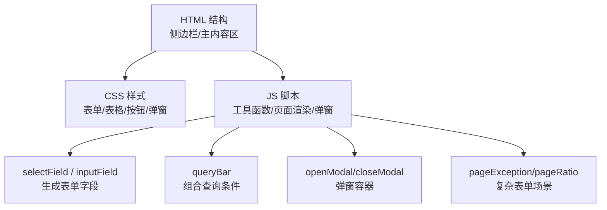
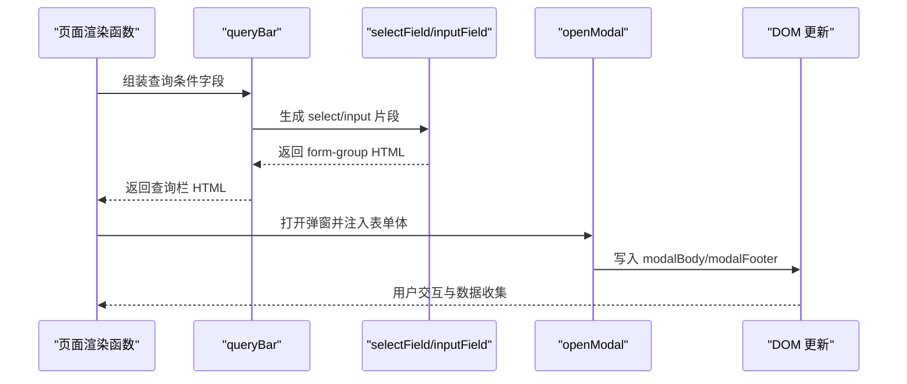
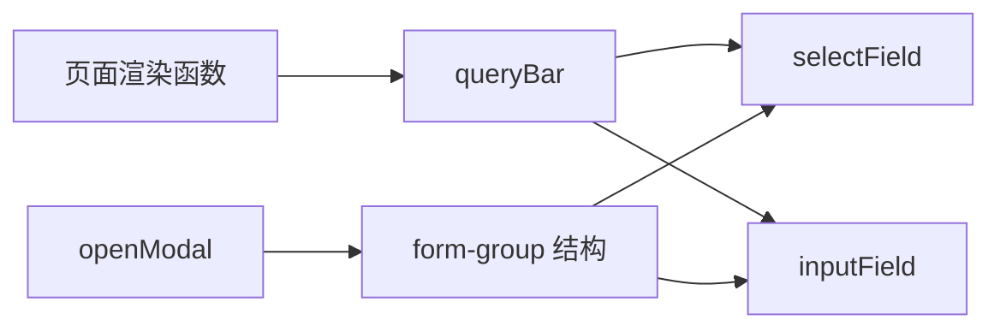

# 表单输入组件

<cite>
**本文引用的文件**   
- [sales-forecast-prototype.html](file://sales-forecast-prototype.html)
- [sales-forecast-prototype_副本.html](file://sales-forecast-prototype_副本.html)
</cite>

## 目录
1. [简介](#简介)
2. [项目结构](#项目结构)
3. [核心组件](#核心组件)
4. [架构总览](#架构总览)
5. [详细组件分析](#详细组件分析)
6. [依赖关系分析](#依赖关系分析)
7. [性能与可访问性](#性能与可访问性)
8. [故障排查指南](#故障排查指南)
9. [结论](#结论)
10. [附录：样式与交互规范](#附录样式与交互规范)

## 简介
本文件面向销售预测原型中的表单输入组件，聚焦 selectField 与 inputField 两个函数及其在查询栏、弹窗表单中的使用方式。文档涵盖下拉选择框与文本输入框的样式规范、必填标记、占位符提示、焦点状态、布局与响应式策略，并给出复杂表单场景（新增例外需求、比例维护）的实现示例与最佳实践建议。

## 项目结构
- 单页原型由一个 HTML 文件承载，包含全局样式、页面结构与脚本逻辑。
- 表单相关能力集中在脚本区：通用工具函数（selectField、inputField、queryBar）、页面渲染函数（各业务页面）、弹窗与审批流程。
- 样式集中在 <style> 中，提供统一的表单控件样式、栅格布局与按钮等基础 UI 元素。

图表来源
- [sales-forecast-prototype.html:108-126](file://sales-forecast-prototype.html#L108-L126)
- [sales-forecast-prototype.html:46-52](file://sales-forecast-prototype.html#L46-L52)
- [sales-forecast-prototype.html:170-178](file://sales-forecast-prototype.html#L170-L178)

章节来源
- [sales-forecast-prototype.html:108-126](file://sales-forecast-prototype.html#L108-L126)
- [sales-forecast-prototype.html:46-52](file://sales-forecast-prototype.html#L46-L52)

## 核心组件
- selectField(label, opts)
  - 作用：生成一个带标签的下拉选择框，用于筛选或选择枚举值。
  - 参数：label（字符串，作为 label 文本），opts（字符串数组，作为选项列表）。
  - 输出：form-group 包裹的 label + select 结构，便于统一样式与对齐。
- inputField(label, ph)
  - 作用：生成一个带标签的文本输入框，支持占位符提示。
  - 参数：label（字符串，作为 label 文本），ph（字符串，placeholder 提示文案）。
  - 输出：form-group 包裹的 label + input[type=text] 结构，默认宽度 160px。

使用位置
- 查询栏：通过 queryBar(fields) 将多个 selectField/inputField 组合为查询条件行。
- 弹窗表单：在 openModal 的 body 中直接拼接 form-group 结构，实现新增/编辑表单。

章节来源
- [sales-forecast-prototype.html:170-178](file://sales-forecast-prototype.html#L170-L178)
- [sales-forecast-prototype.html:170-172](file://sales-forecast-prototype.html#L170-L172)

## 架构总览
表单输入组件在整个原型中的调用链如下：
- 页面渲染函数（如 pageConfirmed、pageException、pageRatio）调用 queryBar，传入由 selectField/inputField 生成的字段片段。
- 弹窗通过 openModal 注入包含 form-group 结构的表单体，配合按钮触发保存/提交。
- 样式层提供统一的 .form-group/.form-label 及 input/select 的默认外观与焦点态。

图表来源
- [sales-forecast-prototype.html:170-178](file://sales-forecast-prototype.html#L170-L178)
- [sales-forecast-prototype.html:179-182](file://sales-forecast-prototype.html#L179-L182)

## 详细组件分析

### selectField 下拉选择框
- 结构与样式
  - 外层 .form-group 采用纵向 Flex 布局，间距 2px，保证 label 与 select 对齐。
  - .form-label 字号 12px，颜色 #8c8c8c；可选 .req 红色星号表示必填。
  - select 默认最小宽度 120px，边框圆角 4px，字体继承。
- 交互与焦点
  - 焦点态：border-color 变为 #1890ff，并带有 2px 蓝色阴影，提升可见性。
- 使用示例
  - 查询栏：年份、产品线、状态等筛选。
  - 弹窗表单：作战区域、国家、大区、国区等选择。

章节来源
- [sales-forecast-prototype.html:46-52](file://sales-forecast-prototype.html#L46-L52)
- [sales-forecast-prototype.html:173-175](file://sales-forecast-prototype.html#L173-L175)
- [sales-forecast-prototype.html:378-379](file://sales-forecast-prototype.html#L378-L379)

### inputField 文本输入框
- 结构与样式
  - 外层 .form-group 同上，确保与 select 一致的对齐与间距。
  - input[type=text] 默认内边距 6px 10px，边框 1px #d9d9d9，圆角 4px，字号 12px。
  - 默认宽度 160px，可通过 inline style 覆盖。
- 交互与焦点
  - 焦点态与 select 一致，边框变蓝并带阴影。
- 占位符与必填
  - placeholder 通过 ph 参数传入，提示用户输入内容。
  - 必填标记通过 label 内的 .req 星号标识，常见于新增/编辑弹窗。

章节来源
- [sales-forecast-prototype.html:46-52](file://sales-forecast-prototype.html#L46-L52)
- [sales-forecast-prototype.html:176-178](file://sales-forecast-prototype.html#L176-L178)
- [sales-forecast-prototype.html:360](file://sales-forecast-prototype.html#L360)

### 表单验证与必填标记
- 必填标记
  - 通过 label 内插入 * 表示必填项。
- 前端校验
  - 在提交审批时进行简单校验：申请理由非空、一级审批人至少选择一个，否则弹出 alert 提示。
- 占位符提示
  - inputField 的 placeholder 提供输入引导，textarea 也支持 placeholder。

章节来源
- [sales-forecast-prototype.html:48](file://sales-forecast-prototype.html#L48)
- [sales-forecast-prototype.html:274-279](file://sales-forecast-prototype.html#L274-L279)
- [sales-forecast-prototype.html:200](file://sales-forecast-prototype.html#L200)

### 布局与响应式设计
- 布局
  - 查询栏使用 .row 横向排列，支持 flex-wrap 换行。
  - 弹窗表单常用 grid 布局（grid-2、grid-5）组织多列字段。
- 响应式
  - 基于 CSS Grid/Flexbox，在小屏下自动换行；select 最小宽度保障可读性。
  - 表格区域通过 table-wrap 滚动展示宽表。

章节来源
- [sales-forecast-prototype.html:24-28](file://sales-forecast-prototype.html#L24-L28)
- [sales-forecast-prototype.html:360](file://sales-forecast-prototype.html#L360)
- [sales-forecast-prototype.html:379](file://sales-forecast-prototype.html#L379)

### 复杂表单场景示例
- 新增例外需求表单（弹窗）
  - 字段：作战区域、国家、预计入库日期、产品编码等，含必填标记。
  - 布局：两列 grid，字段间间距 12px。
  - 交互：点击“保存”关闭弹窗，实际业务需对接后端。
- 比例维护表单（弹窗）
  - 字段：作战区域、大区、国区、国家，以及 M/M1/M2~M4/M5~M6/M7~M12 五个百分比输入。
  - 布局：五列 grid，数字输入框带 placeholder 范围提示。
  - 交互：保存后刷新列表或提示成功。

章节来源
- [sales-forecast-prototype.html:360](file://sales-forecast-prototype.html#L360)
- [sales-forecast-prototype.html:379](file://sales-forecast-prototype.html#L379)

## 依赖关系分析
- 组件耦合
  - selectField/inputField 仅依赖 CSS 类名，无外部库依赖，低耦合高复用。
  - queryBar 依赖 selectField/inputField 的输出片段，组合查询条件。
  - openModal/closeModal 负责弹窗生命周期，与表单结构解耦。
- 外部依赖
  - 无第三方库，纯原生 HTML/CSS/JS。
- 潜在循环依赖
  - 当前实现为单向调用，无循环依赖风险。

图表来源
- [sales-forecast-prototype.html:170-178](file://sales-forecast-prototype.html#L170-L178)
- [sales-forecast-prototype.html:179-182](file://sales-forecast-prototype.html#L179-L182)

章节来源
- [sales-forecast-prototype.html:170-182](file://sales-forecast-prototype.html#L170-L182)

## 性能与可访问性
- 性能
  - 表单字段以字符串模板生成，避免频繁 DOM 操作；建议在大数据量表单中使用虚拟滚动或分页加载。
- 可访问性
  - 每个输入都有对应 label，符合无障碍要求；焦点态清晰，利于键盘导航。
- 扩展建议
  - 可为 selectField/inputField 增加 id/name 属性，便于表单序列化与自动化测试。
  - 对必填项可增加 aria-required 与实时错误提示，提升用户体验。

[本节为通用指导，不直接分析具体文件]

## 故障排查指南
- 常见问题
  - 下拉框未显示选项：检查 opts 是否为空数组或字符串格式不正确。
  - 输入框宽度异常：确认是否被父级样式覆盖，必要时调整 inline style。
  - 必填校验无效：检查提交逻辑是否正确读取表单值并进行非空判断。
- 调试建议
  - 在浏览器控制台查看 openModal 注入的 HTML 结构是否符合预期。
  - 使用开发者工具检查 :focus 样式是否生效，确认 CSS 优先级。

章节来源
- [sales-forecast-prototype.html:179-182](file://sales-forecast-prototype.html#L179-L182)
- [sales-forecast-prototype.html:274-279](file://sales-forecast-prototype.html#L274-L279)

## 结论
selectField 与 inputField 提供了简洁一致的表单输入能力，结合 queryBar 与 openModal 可快速构建查询栏与弹窗表单。通过统一的 CSS 类与焦点态，保证了良好的视觉与交互体验。在复杂场景中，借助 grid 布局与必填标记，可实现高可用性的业务表单。建议后续增强验证反馈与无障碍支持，进一步提升用户体验。

[本节为总结，不直接分析具体文件]

## 附录：样式与交互规范
- 表单字段
  - .form-group：纵向 Flex，gap 2px。
  - .form-label：12px，#8c8c8c；.req 红色星号。
  - input/select：内边距 6px 10px，边框 1px #d9d9d9，圆角 4px，字号 12px。
  - 焦点态：边框 #1890ff，阴影 2px rgba(24,144,255,.1)。
- 布局
  - .row：横向 Flex，flex-wrap 换行。
  - .grid-2/.grid-5：两列/五列网格，gap 12px。
- 交互
  - 查询栏：selectField/inputField 组合，按钮“查询/重置”。
  - 弹窗：openModal 注入表单体，footer 放置操作按钮。

章节来源
- [sales-forecast-prototype.html:46-52](file://sales-forecast-prototype.html#L46-L52)
- [sales-forecast-prototype.html:24-28](file://sales-forecast-prototype.html#L24-L28)
- [sales-forecast-prototype.html:170-182](file://sales-forecast-prototype.html#L170-L182)