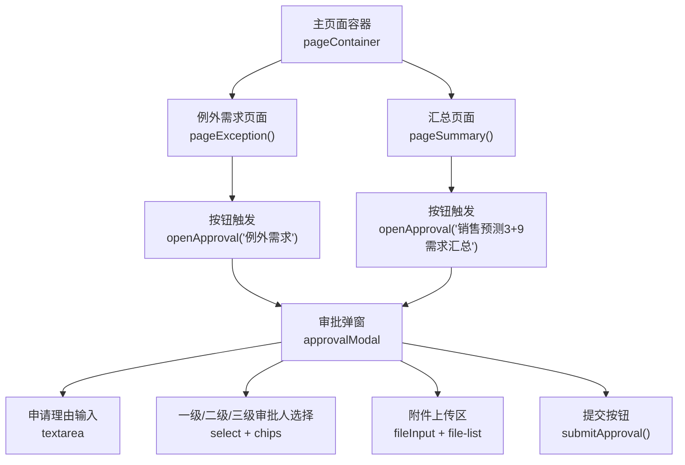
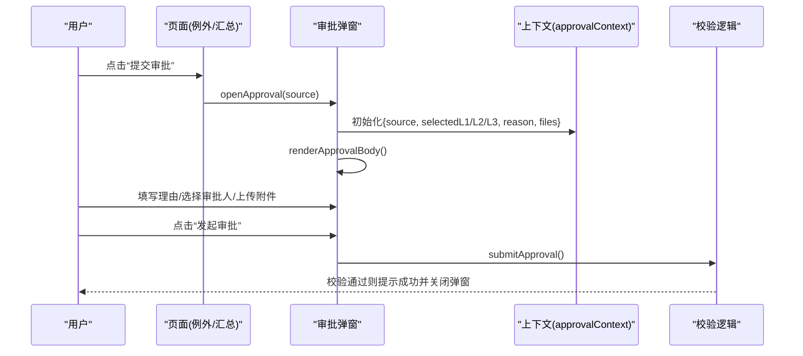
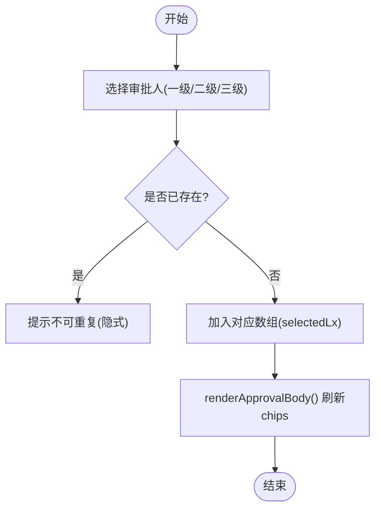
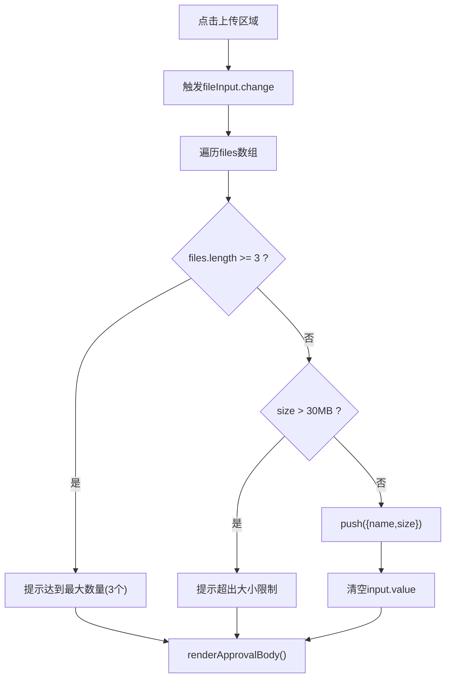
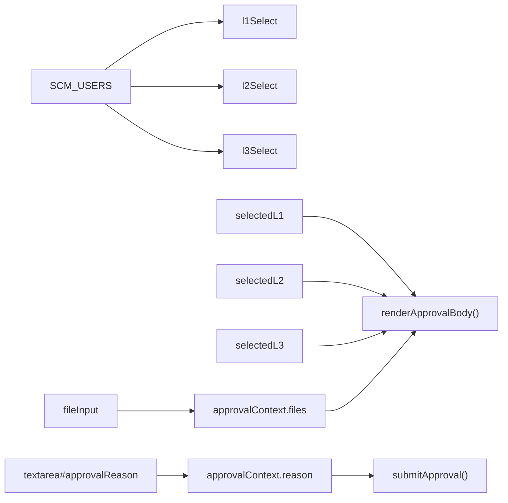

# 审批流程弹窗

<cite>
**本文引用的文件**   
- [sales-forecast-prototype.html](file://sales-forecast-prototype.html)
</cite>

## 目录
1. [简介](#简介)
2. [项目结构](#项目结构)
3. [核心组件](#核心组件)
4. [架构总览](#架构总览)
5. [详细组件分析](#详细组件分析)
6. [依赖关系分析](#依赖关系分析)
7. [性能考量](#性能考量)
8. [故障排查指南](#故障排查指南)
9. [结论](#结论)
10. [附录：使用示例与错误处理](#附录使用示例与错误处理)

## 简介
本文件针对销售预测原型中的“提交审批”弹窗进行深度文档化，重点解析以下核心函数与交互逻辑：
- openApproval：打开审批弹窗并初始化上下文
- renderApprovalBody：渲染审批表单（申请理由、三级审批人选择、附件上传）
- submitApproval：提交审批前的校验与提交反馈

同时说明三级审批人的选择机制（一级必选串行、二级可选、三级可选）、申请理由输入验证、附件上传规则（支持格式、大小限制、数量限制），以及审批上下文状态管理、用户交互处理和表单验证规则。文末提供完整的使用示例与常见错误处理方案。

## 项目结构
该原型为单页应用，所有页面与弹窗逻辑集中在一个HTML文件中。审批弹窗相关代码位于全局脚本区域，包含数据定义、工具函数、页面渲染与弹窗控制等。

图表来源
- [sales-forecast-prototype.html:127-139](file://sales-forecast-prototype.html#L127-L139)
- [sales-forecast-prototype.html:360](file://sales-forecast-prototype.html#L360)
- [sales-forecast-prototype.html:449](file://sales-forecast-prototype.html#L449)

章节来源
- [sales-forecast-prototype.html:127-139](file://sales-forecast-prototype.html#L127-L139)
- [sales-forecast-prototype.html:360](file://sales-forecast-prototype.html#L360)
- [sales-forecast-prototype.html:449](file://sales-forecast-prototype.html#L449)

## 核心组件
- 审批上下文状态：用于保存当前审批的来源、各级审批人选择、申请理由与附件列表
- 审批弹窗DOM：包含标题、关闭按钮、内容区域与底部操作按钮
- 核心函数：
  - openApproval(source)：初始化上下文并渲染弹窗
  - renderApprovalBody()：根据上下文动态生成表单与附件列表
  - addApprover(level)、removeApprover(level, idx)：维护各级审批人选择
  - handleFiles(input)、removeFile(idx)：处理附件上传与移除
  - submitApproval()：校验并提交审批

章节来源
- [sales-forecast-prototype.html:146](file://sales-forecast-prototype.html#L146)
- [sales-forecast-prototype.html:185-189](file://sales-forecast-prototype.html#L185-L189)
- [sales-forecast-prototype.html:191-249](file://sales-forecast-prototype.html#L191-L249)
- [sales-forecast-prototype.html:250-273](file://sales-forecast-prototype.html#L250-L273)
- [sales-forecast-prototype.html:274-280](file://sales-forecast-prototype.html#L274-L280)

## 架构总览
审批弹窗的调用链与数据流如下：
- 用户在“例外需求”或“汇总”页面点击“提交审批”按钮
- 调用 openApproval(source) 初始化上下文并渲染表单
- 用户填写申请理由、选择审批人、上传附件
- 点击“发起审批”触发 submitApproval() 进行校验与提示

图表来源
- [sales-forecast-prototype.html:185-189](file://sales-forecast-prototype.html#L185-L189)
- [sales-forecast-prototype.html:191-249](file://sales-forecast-prototype.html#L191-L249)
- [sales-forecast-prototype.html:274-280](file://sales-forecast-prototype.html#L274-L280)

## 详细组件分析

### 审批上下文状态管理
- 数据结构：
  - source：来源页面标识（如“例外需求”、“销售预测3+9需求汇总”）
  - selectedL1/L2/L3：各级审批人数组（字符串姓名）
  - reason：申请理由文本
  - files：附件对象数组{name, size}
- 生命周期：
  - openApproval 时重置为初始空值
  - 用户交互过程中由 add/remove 函数更新
  - submitApproval 前读取并进行校验

章节来源
- [sales-forecast-prototype.html:146](file://sales-forecast-prototype.html#L146)
- [sales-forecast-prototype.html:185-189](file://sales-forecast-prototype.html#L185-L189)

### 申请理由输入验证
- 必填项：reason 不能为空（trim后判断）
- 交互：textarea 实时绑定到 approvalContext.reason
- 错误处理：未填写时弹出提示并阻止提交

章节来源
- [sales-forecast-prototype.html:197-201](file://sales-forecast-prototype.html#L197-L201)
- [sales-forecast-prototype.html:274-276](file://sales-forecast-prototype.html#L274-L276)

### 三级审批人选择机制
- 一级审批人：
  - 必选，可多选，串行审批（按添加顺序依次审批）
  - 从 SCM_USERS 中过滤已选项，避免重复
  - 通过 chips 展示并可移除
- 二级/三级审批人：
  - 可选，可多选
  - 同样基于 SCM_USERS 过滤与去重
- 交互：
  - select 选择后点击“添加”加入对应数组
  - chips 上的“×”可移除指定人员
  - 每次变更都会重新渲染表单

图表来源
- [sales-forecast-prototype.html:204-236](file://sales-forecast-prototype.html#L204-L236)
- [sales-forecast-prototype.html:250-262](file://sales-forecast-prototype.html#L250-L262)

章节来源
- [sales-forecast-prototype.html:204-236](file://sales-forecast-prototype.html#L204-L236)
- [sales-forecast-prototype.html:250-262](file://sales-forecast-prototype.html#L250-L262)

### 附件上传功能
- 支持格式：图片、Excel(.xls/.xlsx)、Word(.doc/.docx)、PDF
- 大小限制：单文件不超过30MB
- 数量限制：最多3个附件
- 交互：
  - 点击上传区域触发隐藏 input[type=file]
  - handleFiles 遍历文件，校验数量与大小，成功后推入 files 数组
  - removeFile 支持移除指定索引的文件
  - 渲染时显示文件名与大小，超过上限时给出提示

图表来源
- [sales-forecast-prototype.html:238-247](file://sales-forecast-prototype.html#L238-L247)
- [sales-forecast-prototype.html:263-273](file://sales-forecast-prototype.html#L263-L273)

章节来源
- [sales-forecast-prototype.html:238-247](file://sales-forecast-prototype.html#L238-L247)
- [sales-forecast-prototype.html:263-273](file://sales-forecast-prototype.html#L263-L273)

### 提交审批逻辑
- 校验规则：
  - 申请理由非空
  - 一级审批人至少选择一人
- 提交反馈：
  - 生成随机审批单号（AP-XXXX）
  - 提示成功信息，包含来源、一级审批人列表与状态更新说明
  - 关闭弹窗

章节来源
- [sales-forecast-prototype.html:274-280](file://sales-forecast-prototype.html#L274-L280)

## 依赖关系分析
- DOM元素依赖：
  - approvalModal：弹窗容器
  - approvalBody：弹窗内容区域
  - l1Select/l2Select/l3Select：各级审批人下拉框
  - fileInput：附件输入控件
- 数据依赖：
  - SCM_USERS：审批人候选名单
  - approvalContext：全局上下文状态
- 事件依赖：
  - onclick：添加审批人、移除审批人、上传附件、提交审批
  - oninput：申请理由实时更新

图表来源
- [sales-forecast-prototype.html:144](file://sales-forecast-prototype.html#L144)
- [sales-forecast-prototype.html:197-247](file://sales-forecast-prototype.html#L197-L247)
- [sales-forecast-prototype.html:250-273](file://sales-forecast-prototype.html#L250-L273)
- [sales-forecast-prototype.html:274-280](file://sales-forecast-prototype.html#L274-L280)

章节来源
- [sales-forecast-prototype.html:144](file://sales-forecast-prototype.html#L144)
- [sales-forecast-prototype.html:197-247](file://sales-forecast-prototype.html#L197-L247)
- [sales-forecast-prototype.html:250-273](file://sales-forecast-prototype.html#L250-L273)
- [sales-forecast-prototype.html:274-280](file://sales-forecast-prototype.html#L274-L280)

## 性能考量
- 渲染频率：每次添加/移除审批人或附件都会触发 renderApprovalBody，建议在高频操作场景下合并更新或使用虚拟滚动优化长列表（当前附件列表较短，影响有限）。
- DOM操作：innerHTML 全量替换可能引起重排，建议对频繁变动的局部区域采用节点级更新。
- 事件绑定：内联 onclick 在大量动态内容中会增加解析开销，可考虑事件委托提升性能。

[本节为通用指导，不直接分析具体文件]

## 故障排查指南
- 无法打开审批弹窗：
  - 检查 approvalModal 是否存在且未被其他样式覆盖
  - 确认 openApproval 被正确调用且传入 source
- 审批人无法添加：
  - 检查 select 是否有值且未重复
  - 确认 addApprover 映射的 key 是否正确
- 附件上传失败：
  - 检查 accept 属性是否匹配期望格式
  - 确认文件大小与数量限制逻辑
- 提交失败：
  - 检查申请理由是否为空
  - 检查一级审批人是否至少选择一人

章节来源
- [sales-forecast-prototype.html:185-189](file://sales-forecast-prototype.html#L185-L189)
- [sales-forecast-prototype.html:250-262](file://sales-forecast-prototype.html#L250-L262)
- [sales-forecast-prototype.html:263-273](file://sales-forecast-prototype.html#L263-L273)
- [sales-forecast-prototype.html:274-280](file://sales-forecast-prototype.html#L274-L280)

## 结论
审批弹窗通过清晰的上下文管理与模块化函数实现了完整的三级审批人选择、申请理由校验与附件上传能力。整体实现简洁直观，适合原型演示；在生产环境中可进一步优化渲染性能与错误提示体验。

[本节为总结性内容，不直接分析具体文件]

## 附录：使用示例与错误处理

### 使用示例
- 在“例外需求”页面点击“提交审批”，传入来源“例外需求”
- 在“销售预测3+9需求汇总”页面点击“提交审批”，传入来源“销售预测3+9需求汇总”
- 填写申请理由，选择至少一名一级审批人，可选添加二级/三级审批人
- 上传附件（支持图片、Excel、Word、PDF，单文件≤30MB，最多3个）
- 点击“发起审批”，系统校验通过后提示成功并关闭弹窗

章节来源
- [sales-forecast-prototype.html:360](file://sales-forecast-prototype.html#L360)
- [sales-forecast-prototype.html:449](file://sales-forecast-prototype.html#L449)
- [sales-forecast-prototype.html:185-189](file://sales-forecast-prototype.html#L185-L189)
- [sales-forecast-prototype.html:274-280](file://sales-forecast-prototype.html#L274-L280)

### 错误处理方案
- 申请理由为空：弹出提示并要求填写
- 未选择一级审批人：弹出提示并要求选择
- 附件数量超限：提示已达到最大数量（3个）
- 单个附件超大小：提示超出30MB限制
- 重复选择审批人：自动过滤，避免重复

章节来源
- [sales-forecast-prototype.html:263-273](file://sales-forecast-prototype.html#L263-L273)
- [sales-forecast-prototype.html:274-280](file://sales-forecast-prototype.html#L274-L280)