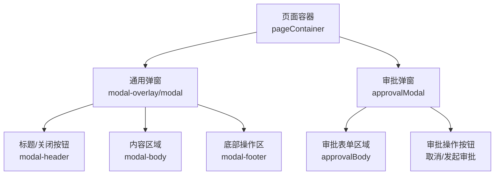
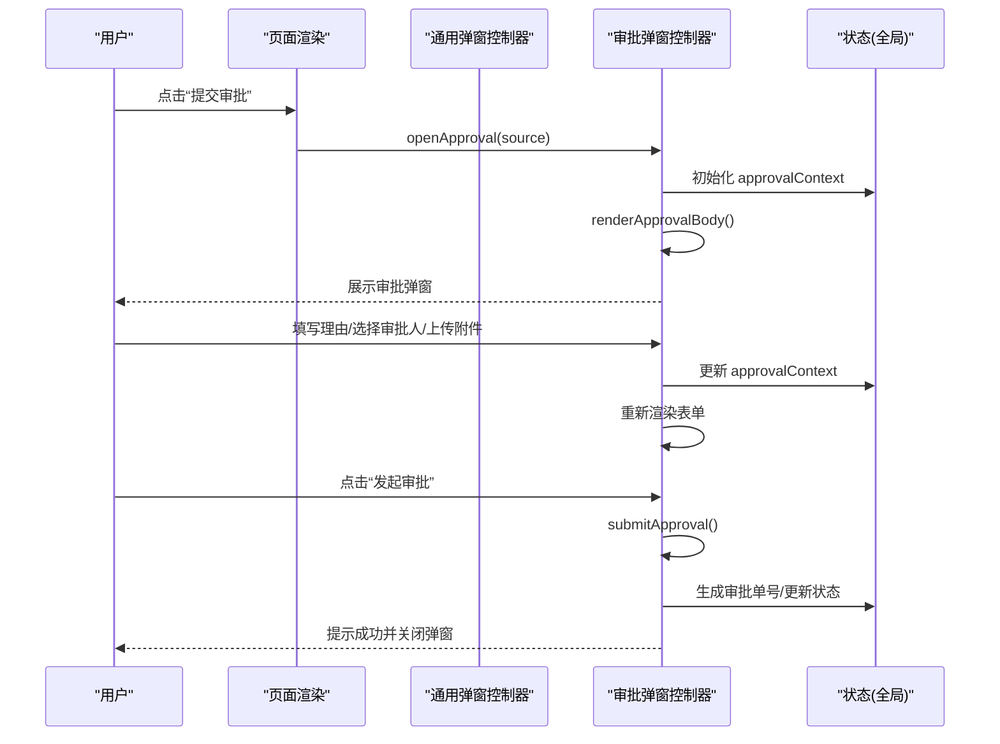
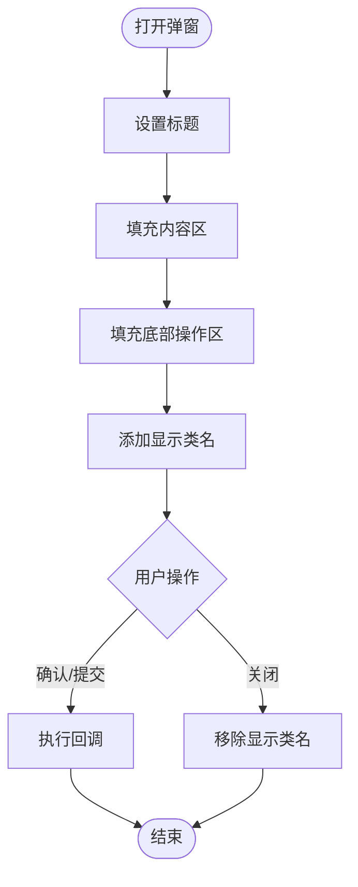
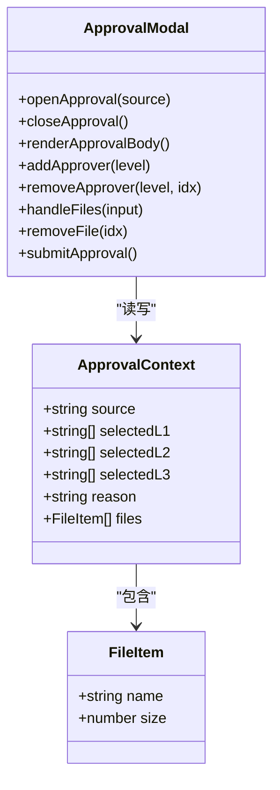
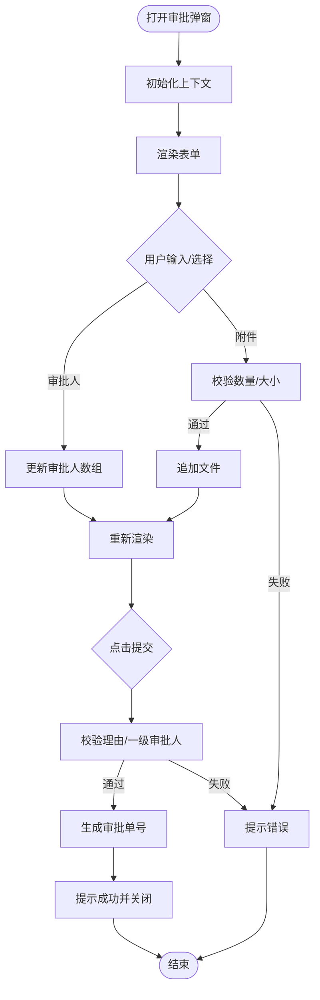
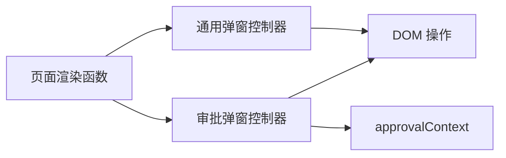

# 模态弹窗系统

<cite>
**本文档引用的文件**   
- [sales-forecast-prototype.html](file://sales-forecast-prototype.html)
- [sales-forecast-prototype_副本.html](file://sales-forecast-prototype_副本.html)
</cite>

## 目录
1. [简介](#简介)
2. [项目结构](#项目结构)
3. [核心组件](#核心组件)
4. [架构总览](#架构总览)
5. [详细组件分析](#详细组件分析)
6. [依赖关系分析](#依赖关系分析)
7. [性能与可访问性](#性能与可访问性)
8. [故障排查指南](#故障排查指南)
9. [结论](#结论)
10. [附录：API与交互规范](#附录api与交互规范)

## 简介
本文件为销售预测原型中的“模态弹窗系统”提供系统化文档，覆盖通用弹窗（modal）与审批弹窗（approvalModal）的实现机制、生命周期管理、内容渲染、事件处理与状态管理。重点说明审批流程弹窗的特殊逻辑，包括审批人选择、附件上传、校验与提交、以及数据状态流转。同时给出设计模式与用户体验优化建议，帮助读者快速理解并扩展该弹窗体系。

## 项目结构
- 单页应用结构：侧边栏导航 + 主内容区，页面通过函数渲染到容器。
- 弹窗层：全局遮罩与弹窗容器，包含通用弹窗与审批弹窗两个独立 DOM 节点。
- 脚本层：工具函数、页面渲染函数、弹窗控制函数集中定义在 HTML 的 script 块中。

图表来源 
- [sales-forecast-prototype.html:127-139](file://sales-forecast-prototype.html#L127-L139)

章节来源
- [sales-forecast-prototype.html:108-139](file://sales-forecast-prototype.html#L108-L139)

## 核心组件
- 通用弹窗（modal）
  - 作用：承载任意业务内容（新增、编辑、详情等），具备统一外观与基础交互。
  - 关键元素：遮罩层、弹窗容器、标题、关闭按钮、内容区、底部操作区。
  - 生命周期：打开时设置标题与内容、显示遮罩；关闭时移除显示类名。
- 审批弹窗（approvalModal）
  - 作用：专门用于提交审批流程，包含申请理由、多级审批人选择、附件上传与校验。
  - 关键元素：申请理由输入、三级审批人选择器与芯片列表、文件上传区域与文件列表、提交/取消按钮。
  - 生命周期：初始化上下文、渲染表单、用户交互更新上下文、提交前校验、成功后关闭并提示。

章节来源
- [sales-forecast-prototype.html:127-139](file://sales-forecast-prototype.html#L127-L139)
- [sales-forecast-prototype.html:179-182](file://sales-forecast-prototype.html#L179-L182)
- [sales-forecast-prototype.html:184-280](file://sales-forecast-prototype.html#L184-L280)

## 架构总览
整体采用“视图-控制器-状态”分离思路：
- 视图：HTML 结构与 CSS 样式，定义弹窗骨架与样式。
- 控制器：JS 函数负责打开/关闭弹窗、渲染内容、绑定事件。
- 状态：全局变量保存弹窗上下文（如审批上下文 approvalContext）。

图表来源 
- [sales-forecast-prototype.html:184-280](file://sales-forecast-prototype.html#L184-L280)

章节来源
- [sales-forecast-prototype.html:179-182](file://sales-forecast-prototype.html#L179-L182)
- [sales-forecast-prototype.html:184-280](file://sales-forecast-prototype.html#L184-L280)

## 详细组件分析

### 通用弹窗（modal）
- 结构与样式
  - 遮罩层使用固定定位覆盖全屏，弹窗居中显示，支持最大高度与滚动。
  - 头部包含标题与关闭按钮，底部预留操作按钮区域。
- 生命周期
  - 打开：设置标题、填充内容区、填充底部操作区、添加显示类名。
  - 关闭：移除显示类名，隐藏弹窗。
- 事件处理
  - 关闭按钮直接调用关闭函数。
  - 底部操作按钮由调用方传入 HTML 片段，按需绑定事件。
- 使用场景
  - 新增/编辑表单、详情查看、简单确认对话框等。

图表来源 
- [sales-forecast-prototype.html:179-182](file://sales-forecast-prototype.html#L179-L182)

章节来源
- [sales-forecast-prototype.html:127-129](file://sales-forecast-prototype.html#L127-L129)
- [sales-forecast-prototype.html:179-182](file://sales-forecast-prototype.html#L179-L182)

### 审批弹窗（approvalModal）
- 结构与样式
  - 独立的遮罩与弹窗容器，内部包含审批表单区域与操作按钮。
  - 审批人选择区采用下拉选择与芯片列表组合，支持多选与移除。
  - 附件上传区支持拖拽点击上传，限制数量与大小，展示文件列表与移除操作。
- 生命周期
  - 打开：重置上下文（来源、审批人、理由、附件）、渲染表单、显示弹窗。
  - 交互：用户输入或选择后实时更新上下文并重新渲染。
  - 提交：校验必填项与规则，生成审批单号，提示成功并关闭。
- 事件处理
  - 审批人添加/移除：根据级别映射选择器 ID，更新对应数组并渲染。
  - 附件上传：读取文件信息，校验数量与大小，追加到上下文并渲染。
  - 提交：校验申请理由与一级审批人，生成单号，提示结果。
- 状态管理
  - 使用全局对象 approvalContext 维护当前审批上下文，确保跨函数共享状态。

图表来源 
- [sales-forecast-prototype.html:184-280](file://sales-forecast-prototype.html#L184-L280)

章节来源
- [sales-forecast-prototype.html:184-280](file://sales-forecast-prototype.html#L184-L280)

### 审批流程特殊逻辑
- 审批人选择
  - 一级审批人必选且可多选，二级/三级可选且可多选。
  - 选择器过滤已选人员，避免重复添加。
  - 芯片列表支持逐个移除，实时同步上下文。
- 附件上传
  - 支持图片、Excel、Word、PDF 等格式，单文件不超过 30MB，最多 3 个。
  - 上传后展示文件名与大小，支持移除。
  - 达到上限时提示并阻止继续添加。
- 状态管理与提交
  - 提交前校验申请理由与一级审批人。
  - 生成随机审批单号，提示成功并关闭弹窗。
  - 数据状态更新为“审批中”，并在界面以标签形式展示。

图表来源 
- [sales-forecast-prototype.html:184-280](file://sales-forecast-prototype.html#L184-L280)

章节来源
- [sales-forecast-prototype.html:184-280](file://sales-forecast-prototype.html#L184-L280)

### 页面集成与触发点
- 例外需求明细表
  - 提供“提交审批”按钮，调用 openApproval('例外需求')。
- 销售预测3+9需求汇总明细表
  - 提供“提交审批”按钮，调用 openApproval('销售预测3+9需求汇总')。
- 其他页面
  - 通用弹窗用于新增/编辑/查看详情等操作，通过 openModal(title, body, footer) 动态注入内容与按钮。

章节来源
- [sales-forecast-prototype.html:360](file://sales-forecast-prototype.html#L360)
- [sales-forecast-prototype.html:449](file://sales-forecast-prototype.html#L449)

## 依赖关系分析
- 组件耦合
  - 通用弹窗与审批弹窗均依赖全局 DOM 查询函数与类名操作。
  - 审批弹窗依赖全局状态对象 approvalContext，形成松耦合的状态共享。
- 外部依赖
  - 无第三方库依赖，纯原生 HTML/CSS/JS 实现。
- 潜在循环依赖
  - 当前实现无循环依赖，函数间调用方向清晰。

图表来源 
- [sales-forecast-prototype.html:179-182](file://sales-forecast-prototype.html#L179-L182)
- [sales-forecast-prototype.html:184-280](file://sales-forecast-prototype.html#L184-L280)

章节来源
- [sales-forecast-prototype.html:179-182](file://sales-forecast-prototype.html#L179-L182)
- [sales-forecast-prototype.html:184-280](file://sales-forecast-prototype.html#L184-L280)

## 性能与可访问性
- 性能
  - 渲染策略：每次交互后局部重新渲染表单区域，避免整页刷新。
  - 文件处理：前端仅做校验与展示，不阻塞主线程；建议后续引入异步上传与进度反馈。
- 可访问性
  - 表单字段应增加 aria-label 与焦点管理，提升键盘导航体验。
  - 关闭弹窗时应将焦点返回触发元素，避免焦点丢失。
- 可扩展性
  - 建议将审批流程抽象为配置化模板，支持不同业务场景的动态表单。
  - 文件上传模块可封装为独立组件，复用至其他弹窗。

[本节为通用指导，不直接分析具体文件]

## 故障排查指南
- 常见问题
  - 弹窗未显示：检查遮罩层是否被其他元素遮挡，确认类名是否正确切换。
  - 审批人无法添加：检查选择器 ID 映射是否正确，确认未重复添加。
  - 附件上传失败：检查文件大小与类型限制，确认 input 的 accept 属性。
  - 提交校验失败：检查申请理由是否为空，一级审批人是否至少选择一个。
- 调试建议
  - 在关键函数入口打印上下文状态，观察数据变化。
  - 使用浏览器开发者工具监听 DOM 变更与事件触发。

章节来源
- [sales-forecast-prototype.html:184-280](file://sales-forecast-prototype.html#L184-L280)

## 结论
本模态弹窗系统以简洁的原生实现提供了通用弹窗与审批弹窗两大能力，满足销售预测原型中的常见交互需求。审批弹窗通过上下文驱动的状态管理，实现了审批人选择、附件上传与校验等复杂逻辑。建议在后续迭代中引入组件化与异步上传，以提升可维护性与用户体验。

[本节为总结，不直接分析具体文件]

## 附录：API与交互规范
- 通用弹窗 API
  - openModal(title, body, footer)：设置标题、内容区与底部操作区，显示弹窗。
  - closeModal()：隐藏弹窗。
- 审批弹窗 API
  - openApproval(source)：初始化上下文并渲染审批表单，显示弹窗。
  - closeApproval()：隐藏审批弹窗。
  - addApprover(level)：添加审批人到指定级别。
  - removeApprover(level, idx)：从指定级别移除审批人。
  - handleFiles(input)：处理文件上传，校验并更新上下文。
  - removeFile(idx)：移除指定文件。
  - submitApproval()：提交审批，校验并提示结果。

章节来源
- [sales-forecast-prototype.html:179-182](file://sales-forecast-prototype.html#L179-L182)
- [sales-forecast-prototype.html:184-280](file://sales-forecast-prototype.html#L184-L280)