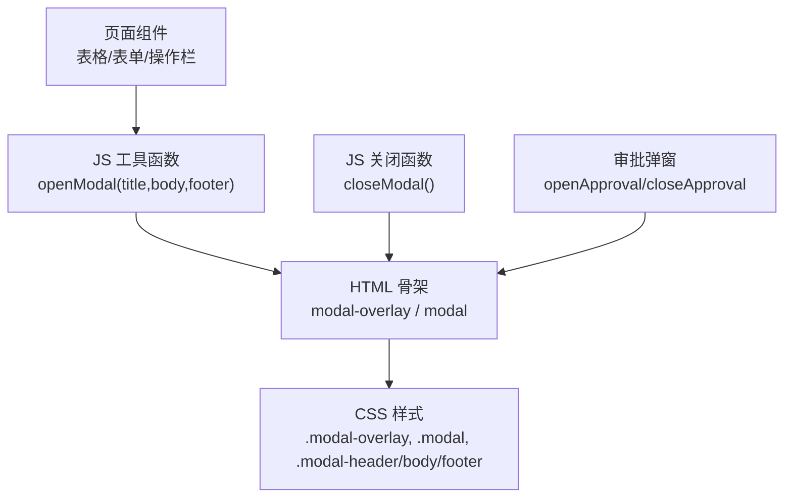
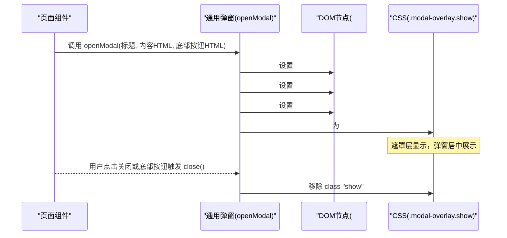
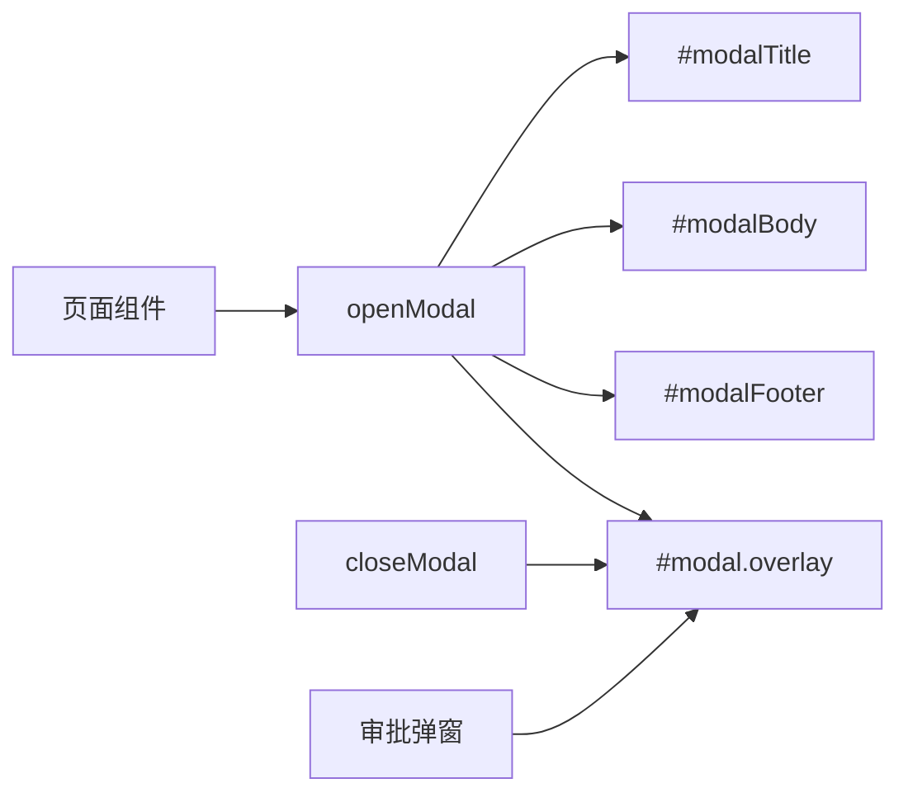

# 通用弹窗系统

<cite>
**本文引用的文件**   
- [sales-forecast-prototype.html](file://sales-forecast-prototype.html)
- [sales-forecast-prototype_副本.html](file://sales-forecast-prototype_副本.html)
</cite>

## 目录
1. [引言](#引言)
2. [项目结构](#项目结构)
3. [核心组件](#核心组件)
4. [架构总览](#架构总览)
5. [详细组件分析](#详细组件分析)
6. [依赖关系分析](#依赖关系分析)
7. [性能考量](#性能考量)
8. [故障排查指南](#故障排查指南)
9. [结论](#结论)
10. [附录：使用示例与最佳实践](#附录使用示例与最佳实践)

## 引言
本文件面向销售预测原型中的“通用弹窗系统”，聚焦 openModal 与 closeModal 的实现机制，解释弹窗生命周期管理、动态内容渲染、事件处理等关键能力；同时梳理模态框的 HTML 结构与 CSS 样式设计，并说明与其他页面组件的交互方式。文末提供通用弹窗的使用示例与最佳实践，包括标题设置、内容模板、底部按钮配置等。

## 项目结构
该原型为单页应用（SPA）形态，所有页面通过 JavaScript 动态渲染到主容器内。弹窗相关代码集中在两个文件中：
- sales-forecast-prototype.html：包含完整的通用弹窗与审批弹窗实现、页面逻辑与样式
- sales-forecast-prototype_副本.html：精简版，仅包含通用弹窗基础实现与部分页面片段

图表来源
- [sales-forecast-prototype.html:127-139](file://sales-forecast-prototype.html#L127-L139)
- [sales-forecast-prototype.html:73-85](file://sales-forecast-prototype.html#L73-L85)
- [sales-forecast-prototype.html:179-182](file://sales-forecast-prototype.html#L179-L182)
- [sales-forecast-prototype.html:185-190](file://sales-forecast-prototype.html#L185-L190)

章节来源
- [sales-forecast-prototype.html:127-139](file://sales-forecast-prototype.html#L127-L139)
- [sales-forecast-prototype_副本.html:134-136](file://sales-forecast-prototype_副本.html#L134-L136)

## 核心组件
- 通用弹窗 DOM 结构
  - 遮罩层：id="modal"，类名 "modal-overlay"
  - 弹窗容器：类名 "modal"，内部包含头部、主体、底部三个区域
  - 头部：id="modalTitle" 显示标题，右侧有关闭按钮
  - 主体：id="modalBody" 用于动态注入内容
  - 底部：id="modalFooter" 用于注入操作按钮
- 核心函数
  - openModal(title, body, footer)：设置标题、主体内容与底部按钮，并显示弹窗
  - closeModal()：移除 show 类以隐藏弹窗
- 专用弹窗（审批弹窗）
  - id="approvalModal"，独立于通用弹窗，用于复杂审批流程
  - openApproval(source)、closeApproval()、renderApprovalBody() 等配套函数

章节来源
- [sales-forecast-prototype.html:127-139](file://sales-forecast-prototype.html#L127-L139)
- [sales-forecast-prototype.html:179-182](file://sales-forecast-prototype.html#L179-L182)
- [sales-forecast-prototype.html:185-190](file://sales-forecast-prototype.html#L185-L190)

## 架构总览
通用弹窗系统采用“轻量级 DOM + 字符串模板”的方式实现，避免引入第三方库，便于在原型中快速迭代。其调用链如下：

图表来源
- [sales-forecast-prototype.html:179-182](file://sales-forecast-prototype.html#L179-L182)
- [sales-forecast-prototype.html:73-85](file://sales-forecast-prototype.html#L73-L85)

章节来源
- [sales-forecast-prototype.html:179-182](file://sales-forecast-prototype.html#L179-L182)

## 详细组件分析

### 通用弹窗 HTML 结构
- 遮罩层：固定定位覆盖全屏，z-index 较高，默认 display:none，显示时切换为 flex 布局以居中
- 弹窗容器：白色背景、圆角、阴影、最大高度限制，支持滚动
- 头部：标题文本与关闭按钮
- 主体：可插入任意 HTML 片段（表单、表格、提示等）
- 底部：右对齐按钮组，常用于确认/取消

章节来源
- [sales-forecast-prototype.html:127-139](file://sales-forecast-prototype.html#L127-L139)

### CSS 样式设计要点
- 遮罩层与显示控制
  - .modal-overlay：display:none；.modal-overlay.show：display:flex 居中显示
- 弹窗容器
  - .modal：宽度 90%，最大高度 85vh，溢出自动滚动
- 头部/主体/底部
  - 统一内边距与分割线，保证视觉一致性
- 关闭按钮
  - 无背景边框，字体大小适中，悬停反馈

章节来源
- [sales-forecast-prototype.html:73-85](file://sales-forecast-prototype.html#L73-L85)

### openModal 与 closeModal 实现机制
- openModal(title, body, footer)
  - 设置标题文本
  - 将 body 作为 innerHTML 注入主体区域
  - 将 footer 作为 innerHTML 注入底部区域（可选）
  - 为遮罩层添加 show 类以显示弹窗
- closeModal()
  - 移除 show 类以隐藏弹窗

章节来源
- [sales-forecast-prototype.html:179-182](file://sales-forecast-prototype.html#L179-L182)

### 事件处理与生命周期
- 打开弹窗
  - 由页面组件调用 openModal，传入标题、内容 HTML、底部按钮 HTML
  - 若内容中包含交互元素（如按钮），需在 body 字符串中直接绑定 onclick 事件
- 关闭弹窗
  - 点击头部关闭按钮或底部按钮调用 closeModal
  - 也可在业务逻辑完成后主动关闭
- 生命周期阶段
  - 初始化：页面加载后 DOM 就绪，弹窗可用
  - 打开：设置内容并显示
  - 交互：用户在弹窗内进行输入、选择等操作
  - 关闭：清理状态（如需）、移除显示类

章节来源
- [sales-forecast-prototype.html:179-182](file://sales-forecast-prototype.html#L179-L182)

### 与其他组件的交互方式
- 表格行内操作
  - 在表格单元格中通过字符串拼接生成按钮，并在 onclick 中调用 openModal，传递上下文数据
- 查询与筛选
  - 查询结果可通过弹窗进行详情查看或编辑
- 审批流程
  - 专用审批弹窗 openApproval 与通用弹窗配合使用，前者负责复杂表单与附件上传，后者用于简单提示或确认

章节来源
- [sales-forecast-prototype.html:360-365](file://sales-forecast-prototype.html#L360-L365)
- [sales-forecast-prototype.html:443-445](file://sales-forecast-prototype.html#L443-L445)
- [sales-forecast-prototype.html:185-190](file://sales-forecast-prototype.html#L185-L190)

### 审批弹窗（专用）
- 结构
  - id="approvalModal"，独立于通用弹窗，包含头部、主体、底部
- 功能
  - openApproval(source)：初始化上下文并渲染主体
  - renderApprovalBody()：根据上下文动态生成审批人选择、附件列表等
  - submitApproval()：校验必填项，模拟提交成功并关闭弹窗
- 交互
  - 审批人多选、附件上传与数量限制、理由填写校验

章节来源
- [sales-forecast-prototype.html:129-139](file://sales-forecast-prototype.html#L129-L139)
- [sales-forecast-prototype.html:185-280](file://sales-forecast-prototype.html#L185-L280)

## 依赖关系分析
- DOM 依赖
  - openModal/closeModal 依赖 #modal、#modalTitle、#modalBody、#modalFooter
- 样式依赖
  - .modal-overlay.show 控制显示
- 页面组件依赖
  - 各页面函数（如 pageException、pageRatio、pageSummary）通过字符串拼接调用 openModal

图表来源
- [sales-forecast-prototype.html:179-182](file://sales-forecast-prototype.html#L179-L182)
- [sales-forecast-prototype.html:127-139](file://sales-forecast-prototype.html#L127-L139)

章节来源
- [sales-forecast-prototype.html:179-182](file://sales-forecast-prototype.html#L179-L182)

## 性能考量
- 字符串拼接渲染
  - 优点：简单直观，适合原型快速迭代
  - 风险：大量 innerHTML 可能导致重排重绘；建议对频繁更新的内容进行局部更新
- 事件绑定
  - 直接在字符串中绑定 onclick 会创建新函数实例，注意复用或避免重复绑定
- 遮罩层层级
  - z-index 需确保高于页面内容，避免被遮挡
- 滚动与尺寸
  - 弹窗最大高度限制与 overflow:auto 保证长内容可滚动，避免撑破视口

[本节为通用指导，不直接分析具体文件]

## 故障排查指南
- 弹窗无法显示
  - 检查 #modal 是否存在且未被其他样式覆盖
  - 确认 openModal 是否成功添加 show 类
- 内容未渲染
  - 检查传入的 body 字符串是否正确闭合
  - 确认 #modalBody 存在
- 按钮无效
  - 检查 onclick 事件是否在字符串中正确绑定
  - 确认相关函数作用域可见
- 审批弹窗异常
  - 检查必填项校验逻辑
  - 确认附件数量与大小限制

章节来源
- [sales-forecast-prototype.html:179-182](file://sales-forecast-prototype.html#L179-L182)
- [sales-forecast-prototype.html:274-280](file://sales-forecast-prototype.html#L274-L280)

## 结论
通用弹窗系统以极简的 DOM 结构与字符串模板为核心，实现了高效的弹窗生命周期管理与动态内容渲染。通过 openModal 与 closeModal 的封装，页面组件可以便捷地展示信息、收集输入与执行操作。结合审批弹窗的专用实现，可满足复杂业务场景。建议在后续演进中引入更健壮的事件管理与状态管理，以提升可维护性与性能。

[本节为总结性内容，不直接分析具体文件]

## 附录：使用示例与最佳实践

### 基本用法
- 打开弹窗
  - 调用 openModal(标题, 内容HTML, 底部按钮HTML)
  - 内容 HTML 可为表单、表格、提示信息等
  - 底部按钮 HTML 可包含“取消”“保存”等常用操作
- 关闭弹窗
  - 在按钮的 onclick 中调用 closeModal

章节来源
- [sales-forecast-prototype.html:179-182](file://sales-forecast-prototype.html#L179-L182)

### 标题设置
- 通过 openModal 的第一个参数设置标题
- 标题应简洁明确，反映弹窗目的

章节来源
- [sales-forecast-prototype.html:179-182](file://sales-forecast-prototype.html#L179-L182)

### 内容模板
- 表单模板
  - 使用 form-group、form-label、input/select 等类构建表单
  - 必填项标注“*”并做前端校验
- 表格模板
  - 使用 table-wrap、table、th、td 等类构建表格
  - 可在单元格中嵌入按钮，触发 openModal 或业务逻辑
- 提示模板
  - 使用卡片、标签、统计块等组件组合提示信息

章节来源
- [sales-forecast-prototype.html:179-182](file://sales-forecast-prototype.html#L179-L182)

### 底部按钮配置
- 常用按钮
  - 取消：调用 closeModal
  - 保存/确认：执行业务逻辑后调用 closeModal
- 按钮样式
  - 使用 btn、btn-primary、btn-danger 等类区分主次与危险操作

章节来源
- [sales-forecast-prototype.html:179-182](file://sales-forecast-prototype.html#L179-L182)

### 与页面组件交互
- 表格行内操作
  - 在表格单元格中生成按钮，onclick 中调用 openModal 并传递行数据
- 查询结果详情
  - 点击“查看详情”按钮，弹出详情弹窗
- 审批流程
  - 使用 openApproval 打开审批弹窗，完成复杂表单与附件上传

章节来源
- [sales-forecast-prototype.html:360-365](file://sales-forecast-prototype.html#L360-L365)
- [sales-forecast-prototype.html:443-445](file://sales-forecast-prototype.html#L443-L445)
- [sales-forecast-prototype.html:185-280](file://sales-forecast-prototype.html#L185-L280)

### 最佳实践
- 内容隔离
  - 弹窗内容尽量自包含，避免依赖外部全局变量
- 事件管理
  - 避免重复绑定事件，必要时在关闭前解绑
- 错误提示
  - 在前端进行必要校验，给出清晰的用户提示
- 可访问性
  - 为重要按钮添加 aria 属性，提升可访问性

[本节为通用指导，不直接分析具体文件]