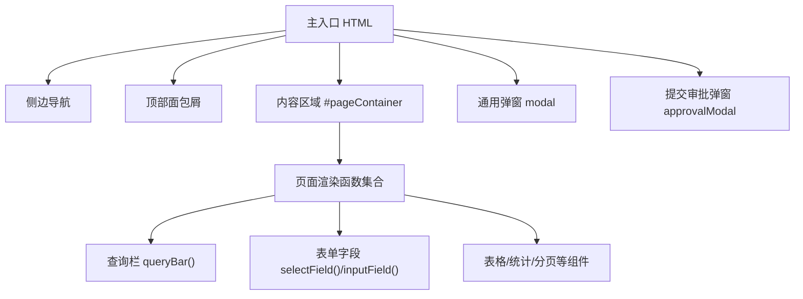
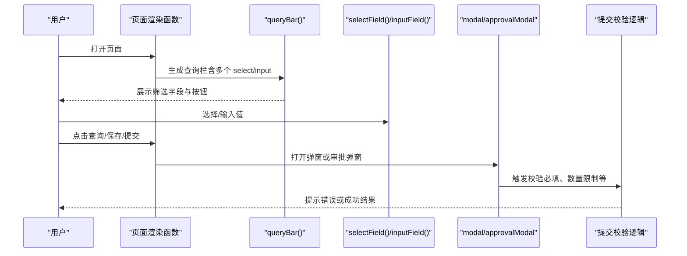
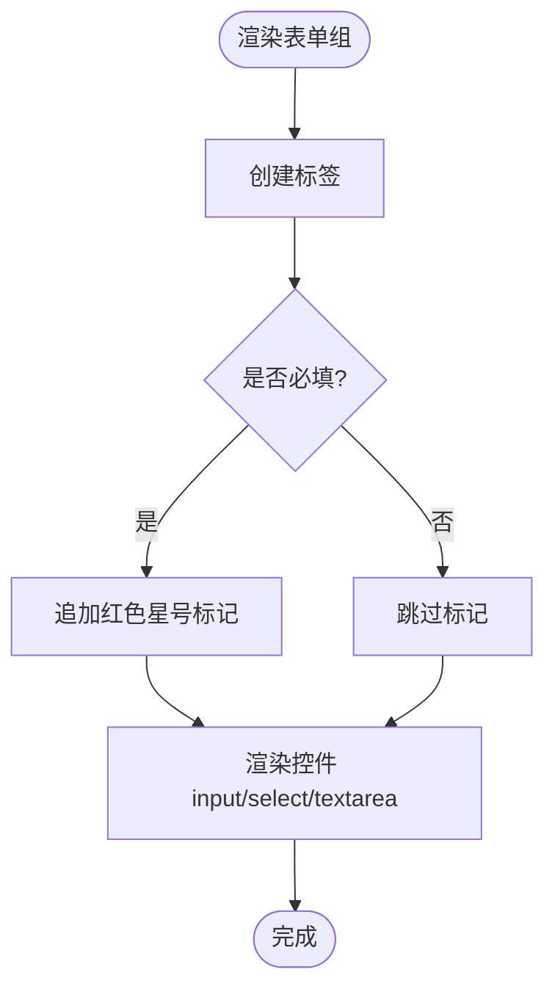
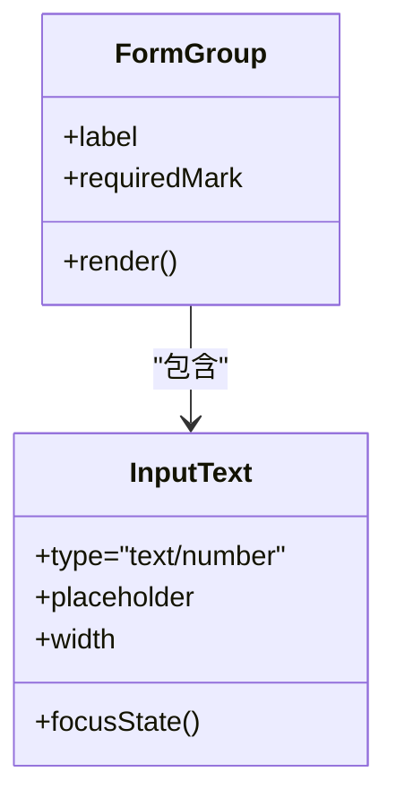
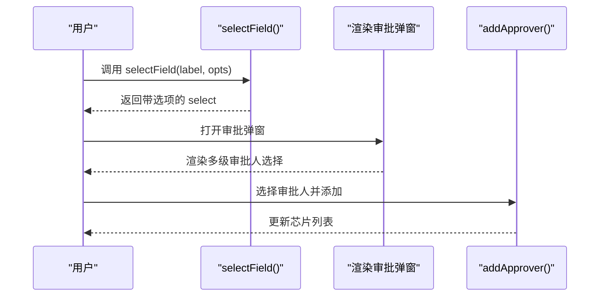
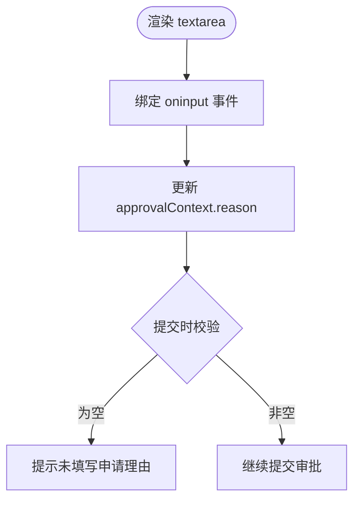
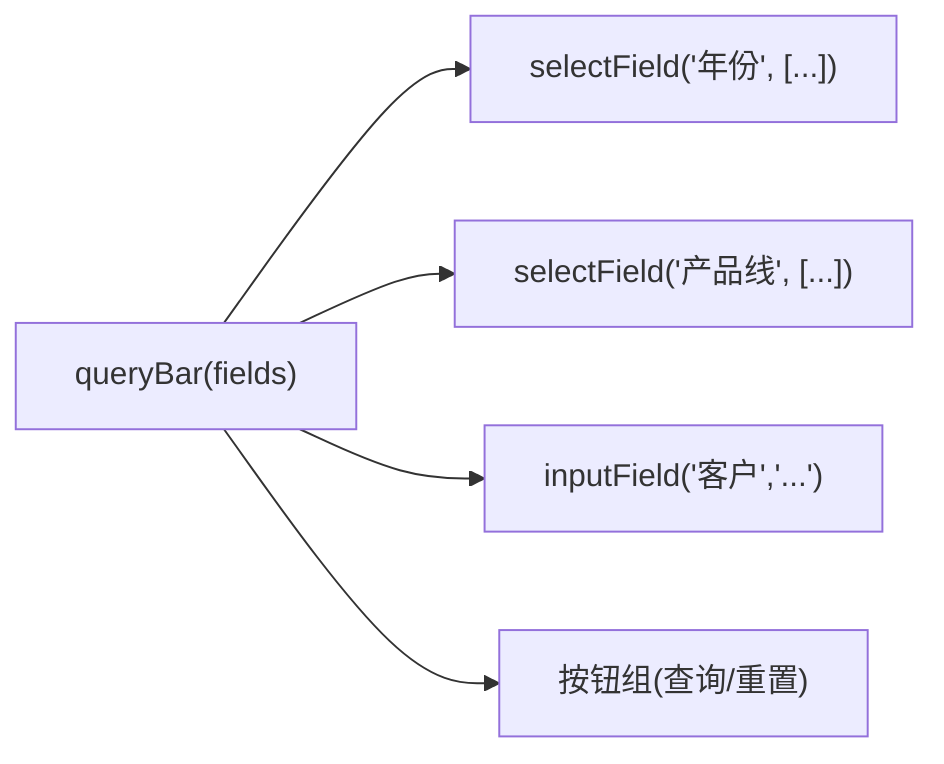
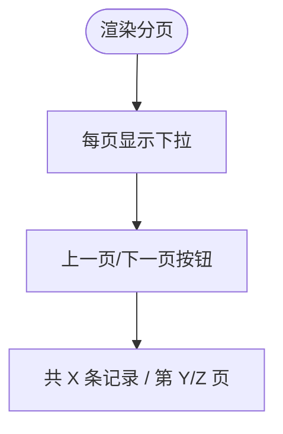
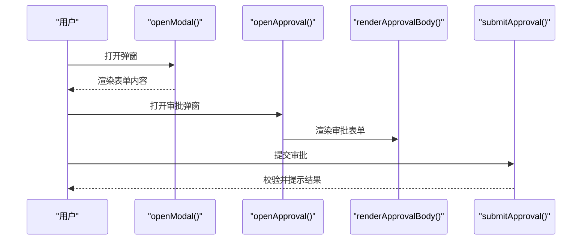
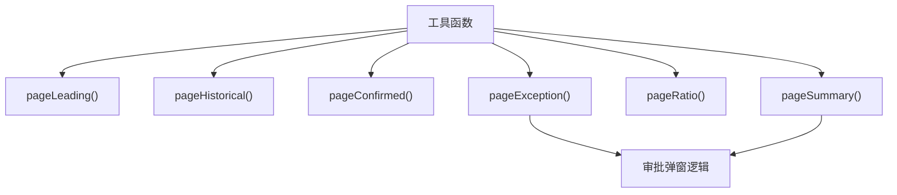

# 表单组件

<cite>
**本文引用的文件**   
- [sales-forecast-prototype.html](file://sales-forecast-prototype.html)
- [sales-forecast-prototype_副本.html](file://sales-forecast-prototype_副本.html)
</cite>

## 目录
1. [简介](#简介)
2. [项目结构](#项目结构)
3. [核心组件](#核心组件)
4. [架构总览](#架构总览)
5. [详细组件分析](#详细组件分析)
6. [依赖关系分析](#依赖关系分析)
7. [性能考量](#性能考量)
8. [故障排查指南](#故障排查指南)
9. [结论](#结论)
10. [附录：表单设计模式与体验优化建议](#附录表单设计模式与体验优化建议)

## 简介
本文件面向“销售预测原型”中的表单组件，系统性梳理输入框（input）、选择器（select）、文本域（textarea）、表单组（form-group）等元素的实现方式，并围绕表单验证、错误提示、必填标记、布局与响应式、无障碍访问等方面给出可操作的说明与建议。文档同时提供流程图与时序图，帮助读者快速理解交互流程与数据流向。

## 项目结构
本项目为单页高保真原型，包含两个HTML文件：
- sales-forecast-prototype.html：完整功能版本，包含审批弹窗、附件上传、多Tab页面等
- sales-forecast-prototype_副本.html：精简版，保留基础查询栏与部分页面逻辑

整体采用内联样式与内嵌脚本的方式组织，通过函数渲染页面内容，使用通用工具函数生成查询栏、分页、表格等UI。

图表来源
- [sales-forecast-prototype.html:108-126](file://sales-forecast-prototype.html#L108-L126)
- [sales-forecast-prototype.html:170-178](file://sales-forecast-prototype.html#L170-L178)
- [sales-forecast-prototype.html:179-182](file://sales-forecast-prototype.html#L179-L182)
- [sales-forecast-prototype.html:127-139](file://sales-forecast-prototype.html#L127-L139)

章节来源
- [sales-forecast-prototype.html:1-126](file://sales-forecast-prototype.html#L1-L126)
- [sales-forecast-prototype_副本.html:1-133](file://sales-forecast-prototype_副本.html#L1-L133)

## 核心组件
- 表单组 form-group：统一的垂直布局容器，标签与控件间距一致，便于对齐与扩展
- 标签 form-label：统一字体大小与颜色，支持必填标记（红色星号）
- 输入框 input[type=text/number]：统一边框、圆角、聚焦态高亮
- 选择器 select：最小宽度约束，下拉选项动态生成
- 文本域 textarea：支持纵向调整高度，用于长文本输入
- 查询栏 queryBar：组合多个表单字段与操作按钮的快捷筛选区
- 分页 pagination：每页条数选择与翻页控制
- 弹窗 modal / 审批弹窗 approvalModal：承载复杂表单与审批流程

章节来源
- [sales-forecast-prototype.html:46-52](file://sales-forecast-prototype.html#L46-L52)
- [sales-forecast-prototype.html:167-178](file://sales-forecast-prototype.html#L167-L178)
- [sales-forecast-prototype.html:167-172](file://sales-forecast-prototype.html#L167-L172)
- [sales-forecast-prototype.html:167-172](file://sales-forecast-prototype.html#L167-L172)
- [sales-forecast-prototype.html:167-172](file://sales-forecast-prototype.html#L167-L172)
- [sales-forecast-prototype.html:167-172](file://sales-forecast-prototype.html#L167-L172)
- [sales-forecast-prototype.html:167-172](file://sales-forecast-prototype.html#L167-L172)
- [sales-forecast-prototype.html:167-172](file://sales-forecast-prototype.html#L167-L172)
- [sales-forecast-prototype.html:167-172](file://sales-forecast-prototype.html#L167-L172)
- [sales-forecast-prototype.html:167-172](file://sales-forecast-prototype.html#L167-L172)
- [sales-forecast-prototype.html:167-172](file://sales-forecast-prototype.html#L167-L172)
- [sales-forecast-prototype.html:167-172](file://sales-forecast-prototype.html#L167-L172)
- [sales-forecast-prototype.html:167-172](file://sales-forecast-prototype.html#L167-L172)
- [sales-forecast-prototype.html:167-172](file://sales-forecast-prototype.html#L167-L172)
- [sales-forecast-prototype.html:167-172](file://sales-forecast-prototype.html#L167-L172)
- [sales-forecast-prototype.html:167-172](file://sales-forecast-prototype.html#L167-L172)
- [sales......

## 架构总览
表单组件通过工具函数与页面渲染函数组合，形成“查询栏-数据表格-弹窗/审批”的交互闭环。核心流程如下：

图表来源
- [sales-forecast-prototype.html:170-178](file://sales-forecast-prototype.html#L170-L178)
- [sales-forecast-prototype.html:179-182](file://sales-forecast-prototype.html#L179-L182)
- [sales-forecast-prototype.html:185-280](file://sales-forecast-prototype.html#L185-L280)

章节来源
- [sales-forecast-prototype.html:170-182](file://sales-forecast-prototype.html#L170-L182)
- [sales-forecast-prototype.html:185-280](file://sales-forecast-prototype.html#L185-L280)

## 详细组件分析

### 表单组 form-group 与标签 form-label
- 布局：垂直堆叠，间距统一，保证标签与控件对齐
- 标签样式：小字号、中性色；支持红色星号标记必填项
- 适用场景：所有输入控件的统一容器

图表来源
- [sales-forecast-prototype.html:46-48](file://sales-forecast-prototype.html#L46-L48)
- [sales-forecast-prototype.html:173-178](file://sales-forecast-prototype.html#L173-L178)

章节来源
- [sales-forecast-prototype.html:46-48](file://sales-forecast-prototype.html#L46-L48)
- [sales-forecast-prototype.html:173-178](file://sales-forecast-prototype.html#L173-L178)

### 输入框 input[type=text/number]
- 样式：统一边框、圆角、聚焦态高亮与阴影
- 行为：占位符提示、宽度约束（如固定宽度或自适应）
- 使用位置：查询栏、弹窗表单、比例维护等

图表来源
- [sales-forecast-prototype.html:49-50](file://sales-forecast-prototype.html#L49-L50)
- [sales-forecast-prototype.html:177](file://sales-forecast-prototype.html#L177)

章节来源
- [sales-forecast-prototype.html:49-50](file://sales-forecast-prototype.html#L49-L50)
- [sales-forecast-prototype.html:177](file://sales-forecast-prototype.html#L177)

### 选择器 select
- 样式：最小宽度约束，聚焦态高亮
- 行为：动态选项列表，常用于筛选条件与审批人选择
- 使用位置：查询栏、审批弹窗的多级审批人选择

图表来源
- [sales-forecast-prototype.html:173-175](file://sales-forecast-prototype.html#L173-L175)
- [sales-forecast-prototype.html:207-234](file://sales-forecast-prototype.html#L207-L234)
- [sales-forecast-prototype.html:250-257](file://sales-forecast-prototype.html#L250-L257)

章节来源
- [sales-forecast-prototype.html:173-175](file://sales-forecast-prototype.html#L173-L175)
- [sales-forecast-prototype.html:207-234](file://sales-forecast-prototype.html#L207-L234)
- [sales-forecast-prototype.html:250-257](file://sales-forecast-prototype.html#L250-L257)

### 文本域 textarea
- 样式：可纵向调整高度，默认最小高度
- 行为：实时绑定输入值，用于申请理由等长文本
- 使用位置：审批弹窗的申请理由

图表来源
- [sales-forecast-prototype.html:52](file://sales-forecast-prototype.html#L52)
- [sales-forecast-prototype.html:200](file://sales-forecast-prototype.html#L200)
- [sales-forecast-prototype.html:274-280](file://sales-forecast-prototype.html#L274-L280)

章节来源
- [sales-forecast-prototype.html:52](file://sales-forecast-prototype.html#L52)
- [sales-forecast-prototype.html:200](file://sales-forecast-prototype.html#L200)
- [sales-forecast-prototype.html:274-280](file://sales-forecast-prototype.html#L274-L280)

### 查询栏 queryBar
- 结构：一行内放置多个表单字段与操作按钮（查询、重置）
- 用途：快速筛选数据，提升信息获取效率
- 实现：组合 selectField/inputField 的结果字符串

图表来源
- [sales-forecast-prototype.html:170-172](file://sales-forecast-prototype.html#L170-L172)
- [sales-forecast-prototype.html:173-178](file://sales-forecast-prototype.html#L173-L178)

章节来源
- [sales-forecast-prototype.html:170-172](file://sales-forecast-prototype.html#L170-L172)
- [sales-forecast-prototype.html:173-178](file://sales-forecast-prototype.html#L173-L178)

### 分页 pagination
- 功能：每页条数选择、翻页按钮、当前页与总页数显示
- 行为：静态原型中仅展示，无实际数据切换逻辑

图表来源
- [sales-forecast-prototype.html:167-169](file://sales-forecast-prototype.html#L167-L169)

章节来源
- [sales-forecast-prototype.html:167-169](file://sales-forecast-prototype.html#L167-L169)

### 弹窗 modal 与审批弹窗 approvalModal
- 通用弹窗：承载新增/编辑等复杂表单
- 审批弹窗：包含申请理由、多级审批人选择、附件上传与校验
- 交互：打开/关闭、内容动态渲染、状态管理

图表来源
- [sales-forecast-prototype.html:179-182](file://sales-forecast-prototype.html#L179-L182)
- [sales-forecast-prototype.html:185-280](file://sales-forecast-prototype.html#L185-L280)

章节来源
- [sales-forecast-prototype.html:179-182](file://sales-forecast-prototype.html#L179-L182)
- [sales-forecast-prototype.html:185-280](file://sales-forecast-prototype.html#L185-L280)

## 依赖关系分析
- 工具函数依赖：queryBar/selectField/inputField/pagination 被各页面函数复用
- 页面函数依赖：pageException/pageSummary 等依赖 mCell/statusPill/sourceTag 等辅助函数
- 弹窗依赖：approvalModal 依赖 handleFiles/addApprover/removeApprover/submitApproval 等逻辑

图表来源
- [sales-forecast-prototype.html:170-178](file://sales-forecast-prototype.html#L170-L178)
- [sales-forecast-prototype.html:294-453](file://sales-forecast-prototype.html#L294-L453)
- [sales-forecast-prototype.html:185-280](file://sales-forecast-prototype.html#L185-L280)

章节来源
- [sales-forecast-prototype.html:170-178](file://sales-forecast-prototype.html#L170-L178)
- [sales-forecast-prototype.html:294-453](file://sales-forecast-prototype.html#L294-L453)
- [sales-forecast-prototype.html:185-280](file://sales-forecast-prototype.html#L185-L280)

## 性能考量
- 内联样式与脚本：适合原型阶段，但需注意重复渲染带来的开销
- 表格与大量单元格：mCell 函数在大数据量下可能影响渲染性能，建议按需渲染或虚拟滚动
- 弹窗内容动态拼接：避免频繁 innerHTML 赋值，可考虑缓存模板或使用更高效的数据绑定方式

[本节为通用指导，不直接分析具体文件]

## 故障排查指南
- 必填校验缺失：检查 submitApproval 中的 reason 与一级审批人校验逻辑
- 附件限制错误：handleFiles 中对数量与大小进行限制，注意提示信息是否正确
- 选择器选项为空：确认 selectField 传入的选项数组是否有效
- 表单布局错乱：检查 form-group 与栅格布局类名是否正确应用

章节来源
- [sales-forecast-prototype.html:274-280](file://sales-forecast-prototype.html#L274-L280)
- [sales-forecast-prototype.html:263-272](file://sales-forecast-prototype.html#L263-L272)
- [sales-forecast-prototype.html:173-175](file://sales-forecast-prototype.html#L173-L175)
- [sales-forecast-prototype.html:46-52](file://sales-forecast-prototype.html#L46-L52)

## 结论
本原型中的表单组件以简洁统一的样式与工具函数为核心，实现了查询、输入、选择、文本域、弹窗与审批等常见业务场景。通过 form-group/form-label 的标准化封装，提升了可维护性与一致性。建议在后续开发中引入更完善的验证框架、无障碍属性与响应式优化，以提升用户体验与可访问性。

[本节为总结性内容，不直接分析具体文件]

## 附录：表单设计模式与体验优化建议
- 表单布局
  - 使用 form-group 包裹 label 与控件，保持垂直对齐与一致间距
  - 对多列布局采用栅格系统（grid-2/grid-3 等），确保在不同屏幕尺寸下的可读性
- 必填标记与错误提示
  - 在 label 中使用红色星号标记必填项
  - 提交时集中校验，并在对应字段下方显示错误信息
- 响应式设计
  - 使用 flex 与 grid 布局，结合媒体查询适配移动端
  - 控制表格横向滚动，避免在小屏上出现挤压
- 无障碍访问
  - 为每个控件添加 aria-label 或关联 label
  - 键盘导航支持（Tab 顺序合理）、焦点可见性
- 交互优化
  - 查询栏提供“重置”按钮，便于快速清空筛选条件
  - 弹窗表单提供明确的“取消/保存”操作反馈
  - 审批流程中提供清晰的步骤提示与状态流转说明

[本节为概念性内容，不直接分析具体文件]