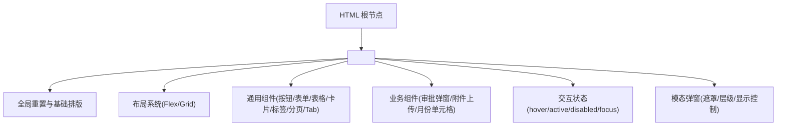
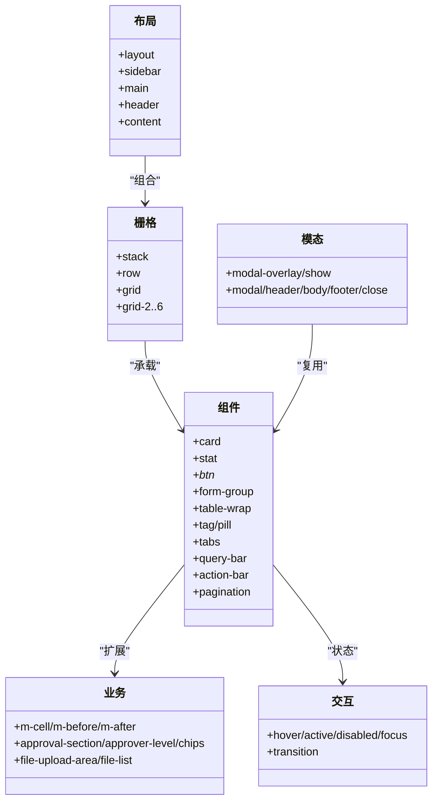
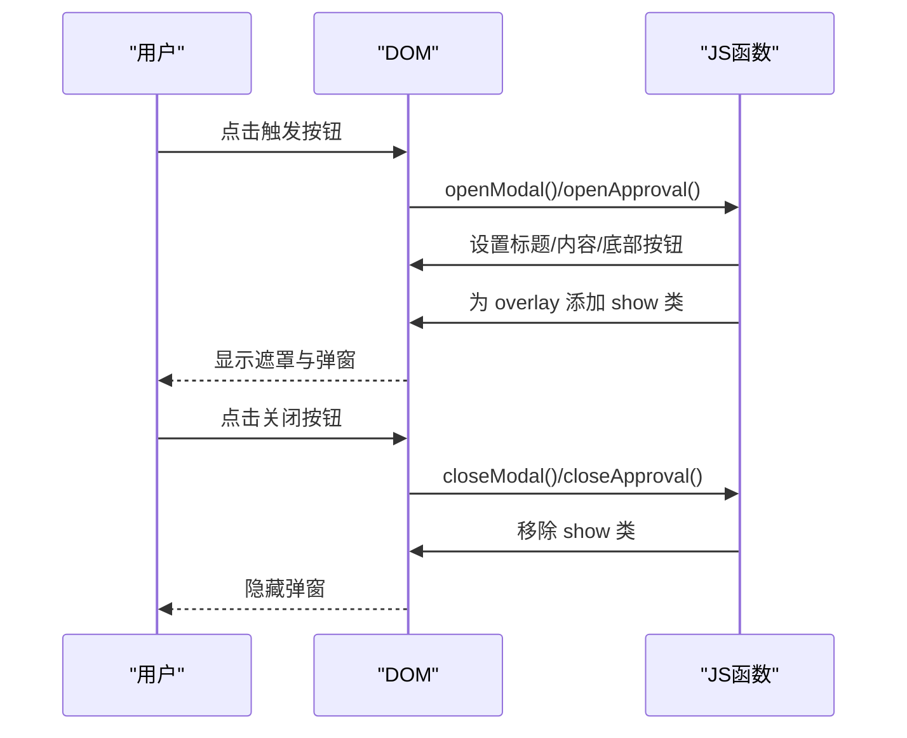
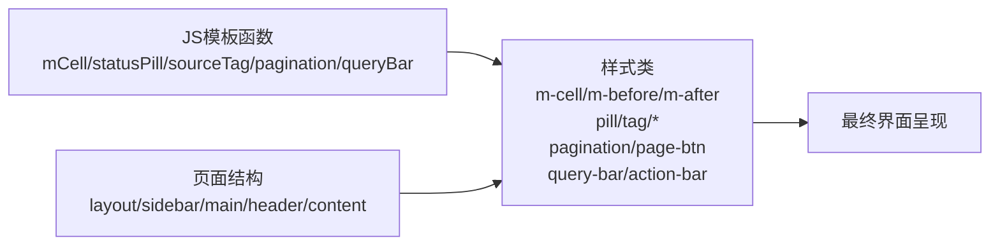

# CSS样式架构

<cite>
**本文档引用的文件**   
- [sales-forecast-prototype.html](file://sales-forecast-prototype.html)
- [sales-forecast-prototype_副本.html](file://sales-forecast-prototype_副本.html)
</cite>

## 目录
1. [简介](#简介)
2. [项目结构](#项目结构)
3. [核心组件](#核心组件)
4. [架构总览](#架构总览)
5. [详细组件分析](#详细组件分析)
6. [依赖关系分析](#依赖关系分析)
7. [性能与可维护性建议](#性能与可维护性建议)
8. [故障排查指南](#故障排查指南)
9. [结论](#结论)

## 简介
本文件系统化梳理销售预测原型中的CSS样式组织与设计规范，覆盖布局系统（Flexbox、Grid）、组件样式（按钮、表格、卡片）、颜色系统与字体规范、响应式策略、交互状态（悬停/激活/禁用）、模态弹窗的层叠与动画实现，以及命名约定、BEM方法论应用与样式复用策略，并给出调试与优化建议。

## 项目结构
- 样式以单页内联方式组织在HTML文件的<style>块中，便于快速原型迭代。
- 两个HTML文件包含基本一致的样式体系，差异主要体现在侧边栏主题配色等局部细节。
- 页面通过JavaScript动态渲染各功能模块，样式类名高度复用，形成“轻量级设计系统”。

图表来源
- [sales-forecast-prototype.html:6-105](file://sales-forecast-prototype.html#L6-L105)
- [sales-forecast-prototype_副本.html:6-110](file://sales-forecast-prototype_副本.html#L6-L110)

章节来源
- [sales-forecast-prototype.html:6-105](file://sales-forecast-prototype.html#L6-L105)
- [sales-forecast-prototype_副本.html:6-110](file://sales-forecast-prototype_副本.html#L6-L110)

## 核心组件
- 布局容器：layout、main、sidebar、header、content
- 栅格与堆叠：stack、row、grid、grid-2~grid-6
- 卡片：card、card-header、card-body、card-body-sm、card-body-none
- 统计卡片：stat、stat-label、stat-value、stat-unit、stat-desc
- 按钮：btn、btn-primary、btn-danger、btn-sm、btn-link、btn-link-danger、btn-disabled
- 表单：form-group、form-label、input/select/textarea 及 focus 状态
- 表格：table-wrap、th/td、sticky th、斑马纹、对齐辅助
- 标签与徽章：tag、tag-*、pill
- Tab：tabs、tab-btn、active
- 查询与操作区：query-bar、action-bar
- 分页：pagination、page-btn、active、disabled
- 月份对比单元格：m-cell、m-before、m-after、m-clickable
- 图例与图表占位：legend、legend-dot、chart-placeholder
- 模态弹窗：modal-overlay、modal、modal-header/body/footer、modal-close、show
- 审批弹窗专用：approval-section、approver-level、approver-chips、chip-remove、file-upload-area、file-list、file-item

章节来源
- [sales-forecast-prototype.html:9-105](file://sales-forecast-prototype.html#L9-L105)
- [sales-forecast-prototype_副本.html:9-110](file://sales-forecast-prototype_副本.html#L9-L110)

## 架构总览
整体采用“原子化+组件化”的内联样式组织：
- 原子层：颜色、字号、间距、圆角、阴影、过渡等基础变量（以类形式暴露）
- 组件层：按钮、表单、表格、卡片、标签、分页、Tab等通用组件
- 业务层：审批弹窗、附件上传、月份对比单元格等特定场景样式
- 布局层：Flex/Gird 组合，支撑多列、堆叠、自适应

图表来源
- [sales-forecast-prototype.html:9-105](file://sales-forecast-prototype.html#L9-L105)
- [sales-forecast-prototype_副本.html:9-110](file://sales-forecast-prototype_副本.html#L9-L110)

## 详细组件分析

### 布局系统（Flexbox 与 Grid）
- Flexbox 用于侧边栏纵向排列、头部面包屑、行内元素对齐、操作区两端分布等。
- Grid 用于统计卡片网格、表单双列/五列布局、复杂表格列宽控制等。
- stack/row/grid 提供统一的间距与对齐语义，减少重复样式。

章节来源
- [sales-forecast-prototype.html:9-31](file://sales-forecast-prototype.html#L9-L31)
- [sales-forecast-prototype_副本.html:9-31](file://sales-forecast-prototype_副本.html#L9-L31)

### 组件样式（按钮、表格、卡片）
- 按钮：统一尺寸、边框、背景、过渡；主色、危险、链接、禁用状态清晰区分。
- 表格：固定表头、斑马纹、右对齐数值、最小宽度保障可读性。
- 卡片：白底、细边框、微阴影，标题与内容区域分离，支持不同body内边距。

章节来源
- [sales-forecast-prototype.html:38-72](file://sales-forecast-prototype.html#L38-L72)
- [sales-forecast-prototype_副本.html:44-85](file://sales-forecast-prototype_副本.html#L44-L85)

### 颜色系统与字体规范
- 色彩：主色蓝色(#1890ff)、成功绿(#52c41a)、警告黄(#faad14)、危险红(#ff4d4f)、中性灰(#8c8c8c/#bfbfbf/#d9d9d9)。
- 文本：字号层级11/12/13/14/15/20，字重400/600/700，行高1.5，强调使用font-semibold。
- 语义化颜色类：text-success/warning/danger/primary、tag-*、pill 状态色。

章节来源
- [sales-forecast-prototype.html:8-41](file://sales-forecast-prototype.html#L8-L41)
- [sales-forecast-prototype_副本.html:8-42](file://sales-forecast-prototype_副本.html#L8-L42)

### 响应式设计实现
- 当前原型未引入媒体查询断点，主要依赖弹性布局与网格自适应。
- 移动端适配建议：
  - 为 .layout 增加媒体查询，在小屏隐藏或折叠侧边栏。
  - 将 grid-4/6 降级为 grid-2 或 grid-1，避免横向滚动。
  - 表格增加横向滚动容器，必要时合并列或启用虚拟滚动。
  - 表单字段在小屏改为全宽，提升输入体验。

章节来源
- [sales-forecast-prototype.html:9-31](file://sales-forecast-prototype.html#L9-L31)
- [sales-forecast-prototype_副本.html:9-31](file://sales-forecast-prototype_副本.html#L9-L31)

### 交互状态样式（悬停、激活、禁用、聚焦）
- 悬停：菜单项、按钮、分页按钮、链接按钮均有 hover 变色与边框变化。
- 激活：菜单项 active、分页 active、Tab active 使用主色与加粗。
- 禁用：按钮与分页 disabled 使用灰色与 not-allowed 光标。
- 聚焦：表单 input/select/textarea 聚焦时边框与外发光提示。

章节来源
- [sales-forecast-prototype.html:15-17,39-45,64-72:15-17](file://sales-forecast-prototype.html#L15-L17)
- [sales-forecast-prototype.html:49-50](file://sales-forecast-prototype.html#L49-L50)
- [sales-forecast-prototype.html:64-72](file://sales-forecast-prototype.html#L64-L72)
- [sales-forecast-prototype_副本.html:17-18,45-51,73-85:17-18](file://sales-forecast-prototype_副本.html#L17-L18)

### 模态弹窗的样式层叠与动画效果
- 层叠：modal-overlay 使用 fixed 定位与 z-index:1000，确保覆盖全屏。
- 显示控制：通过 show 类切换 display:flex，配合居中布局。
- 动画：当前无显式 transition/animation，可通过 overlay 与 modal 的 opacity/transform 添加淡入与上移效果。
- 内容区：modal-header/body/footer 分割明确，close 按钮居右。

图表来源
- [sales-forecast-prototype.html:73-79](file://sales-forecast-prototype.html#L73-L79)
- [sales-forecast-prototype.html:179-182](file://sales-forecast-prototype.html#L179-L182)
- [sales-forecast-prototype.html:185-190](file://sales-forecast-prototype.html#L185-L190)
- [sales-forecast-prototype_副本.html:87-93](file://sales-forecast-prototype_副本.html#L87-L93)

### 命名约定与BEM方法论应用
- 命名风格：短横线分隔的小写类名，语义化强（如 btn-primary、card-body、m-before）。
- BEM实践：
  - Block：btn、card、modal、tabs、pagination
  - Element：btn-primary、card-header、modal-body、tab-btn、page-btn
  - Modifier：btn-sm、btn-disabled、active、disabled、tag-blue/green/orange/red
- 业务修饰：m-before/m-after、approver-chip、file-item 等体现数据对比与业务语义。

章节来源
- [sales-forecast-prototype.html:38-105](file://sales-forecast-prototype.html#L38-L105)
- [sales-forecast-prototype_副本.html:44-110](file://sales-forecast-prototype_副本.html#L44-L110)

### 样式复用策略
- 工具类复用：stack/row/grid/grid-2~6、text-sm/text-xs、text-secondary/tertiary、font-semibold。
- 组件复用：按钮、表单、表格、标签、分页、Tab在各页面一致使用。
- 业务复用：mCell生成器、statusPill、sourceTag、pagination、queryBar等JS模板函数驱动样式一致性。

章节来源
- [sales-forecast-prototype.html:24-37,53-72,167-178:24-37](file://sales-forecast-prototype.html#L24-L37)
- [sales-forecast-prototype_副本.html:27-42,59-85,161-172:27-42](file://sales-forecast-prototype_副本.html#L27-L42)

## 依赖关系分析
- HTML结构与样式耦合度高，样式类名直接决定UI呈现。
- JavaScript模板函数与样式类紧密绑定（如 mCell、statusPill、sourceTag），修改样式需同步更新模板。
- 两套HTML文件共享相同样式基线，副本文件侧重深色侧边栏主题差异。

图表来源
- [sales-forecast-prototype.html:149-178](file://sales-forecast-prototype.html#L149-L178)
- [sales-forecast-prototype_副本.html:143-172](file://sales-forecast-prototype_副本.html#L143-L172)

章节来源
- [sales-forecast-prototype.html:149-178](file://sales-forecast-prototype.html#L149-L178)
- [sales-forecast-prototype_副本.html:143-172](file://sales-forecast-prototype_副本.html#L143-L172)

## 性能与可维护性建议
- 性能优化
  - 将内联样式抽离为独立CSS文件，减少HTML体积与解析开销。
  - 对频繁触发的hover/transition属性进行GPU加速（transform/opacity）。
  - 表格大列表考虑虚拟滚动或分页加载，避免一次性渲染过多DOM。
- 可维护性
  - 引入CSS变量集中管理颜色、字号、间距、圆角、阴影，便于主题切换。
  - 建立组件样式库，统一按钮、表单、表格、卡片等样式入口。
  - 补充媒体查询断点，完善移动端适配与横竖屏兼容。
  - 为模态弹窗添加淡入/上移动画，提升用户体验。

[本节为通用建议，不直接分析具体文件]

## 故障排查指南
- 弹窗不显示
  - 检查是否已为 modal-overlay 添加 show 类。
  - 确认z-index未被其他元素覆盖。
- 表格错位或溢出
  - 检查 table-wrap 的 overflow:auto 是否生效。
  - 确认 th/td 的 white-space 与 min-width 设置合理。
- 表单焦点样式异常
  - 检查 input/select/textarea 的 :focus 伪类是否被覆盖。
- 按钮禁用无效
  - 确认 btn-disabled 类与 disabled 属性同时存在。
- 颜色不一致
  - 核对 text-*、tag-*、pill 的颜色映射是否与业务语义匹配。

章节来源
- [sales-forecast-prototype.html:73-79](file://sales-forecast-prototype.html#L73-L79)
- [sales-forecast-prototype.html:49-50](file://sales-forecast-prototype.html#L49-L50)
- [sales-forecast-prototype.html:45](file://sales-forecast-prototype.html#L45)
- [sales-forecast-prototype_副本.html:87-93](file://sales-forecast-prototype_副本.html#L87-L93)

## 结论
该销售预测原型的CSS样式采用内联、原子化与组件化的组织方式，具备良好的一致性与复用性。通过Flex/Grid布局、统一的组件样式、清晰的交互状态与模态弹窗机制，实现了高保真原型的高效开发。后续建议抽取为独立样式库、引入CSS变量与媒体查询、增强动画与主题能力，以提升性能、可维护性与跨端体验。