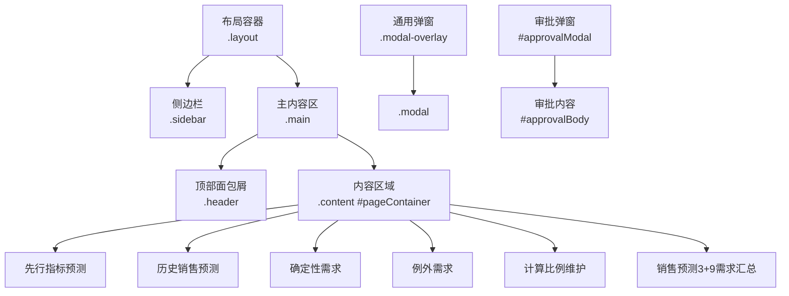
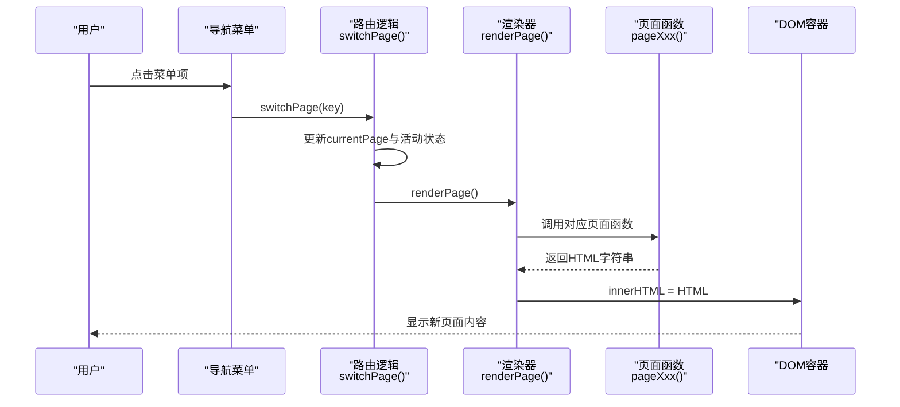
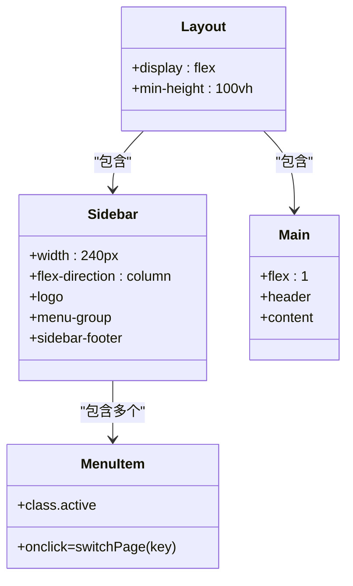
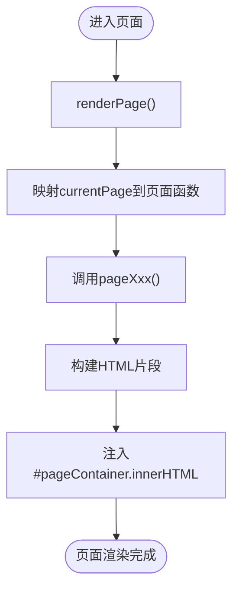
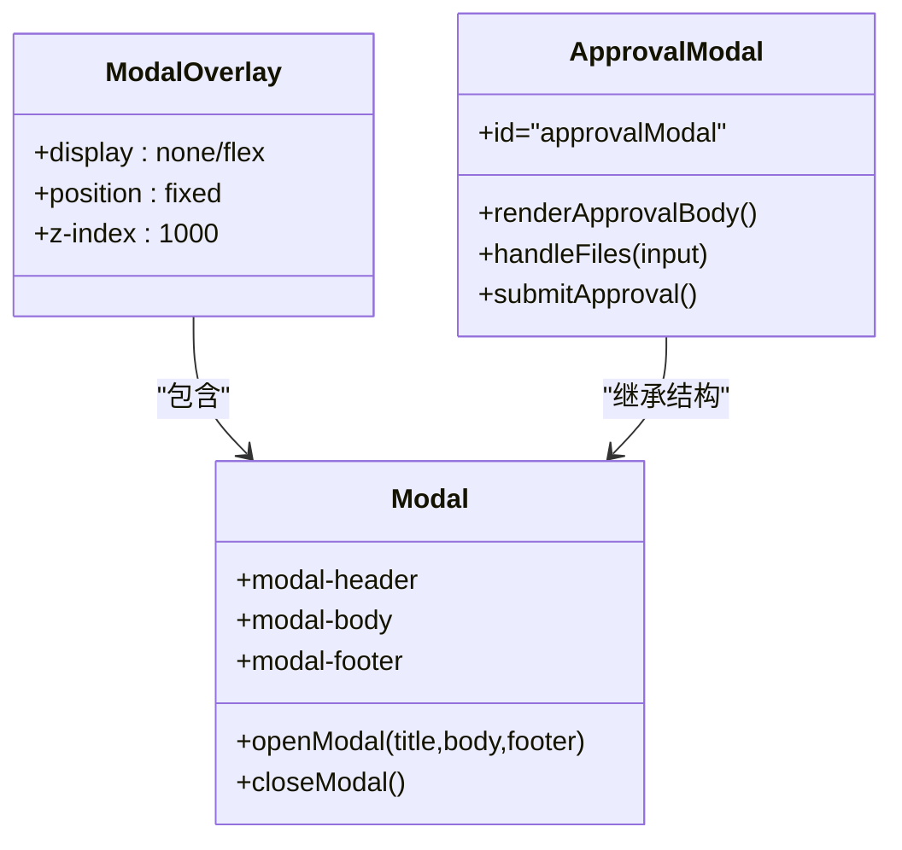
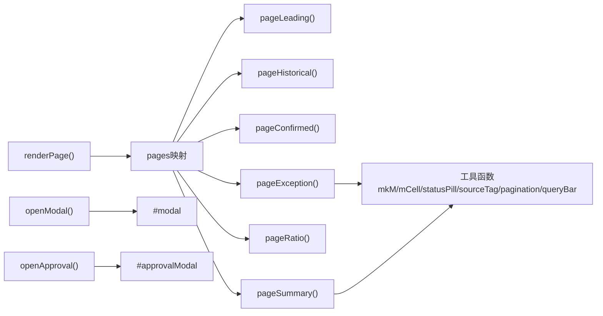

# HTML模板结构

<cite>
**本文档引用的文件**
- [sales-forecast-prototype.html](file://sales-forecast-prototype.html)
- [sales-forecast-prototype_副本.html](file://sales-forecast-prototype_副本.html)
</cite>

## 目录
1. [简介](#简介)
2. [项目结构概览](#项目结构概览)
3. [核心组件分析](#核心组件分析)
4. [架构总览](#架构总览)
5. [详细组件分析](#详细组件分析)
6. [依赖关系分析](#依赖关系分析)
7. [性能与可维护性建议](#性能与可维护性建议)
8. [故障排查指南](#故障排查指南)
9. [结论](#结论)
10. [附录：命名规范与最佳实践](#附录命名规范与最佳实践)

## 简介
本文件系统性梳理销售预测原型中HTML模板的语义化标记结构与组织方式，重点说明页面布局容器（layout、sidebar、main）的层次结构、导航菜单的DOM结构设计、内容区域的动态渲染机制；详述各功能页面的HTML模板结构（表格、表单、卡片组件等），以及模态弹窗与审批流程弹窗的特殊布局；同时给出响应式设计与移动端适配策略，并提供HTML命名规范与最佳实践建议，帮助读者快速理解并扩展该原型。

## 项目结构概览
该原型采用单页应用（SPA）模式，所有页面模板通过JavaScript在运行时动态渲染到主内容区。整体结构包括：
- 全局布局容器：.layout（flex 横向布局）
- 侧边栏导航：.sidebar（固定宽度，垂直菜单）
- 主内容区：.main（flex:1，内部含.header与.content）
- 通用弹窗：.modal-overlay + .modal
- 审批专用弹窗：#approvalModal（独立结构）
- 内容容器：#pageContainer（由JS注入当前页面HTML）

图表来源
- [sales-forecast-prototype.html:108-139](file://sales-forecast-prototype.html#L108-L139)

章节来源
- [sales-forecast-prototype.html:1-139](file://sales-forecast-prototype.html#L1-139)

## 核心组件分析
- 布局容器
  - .layout：使用flex布局实现左右分栏，左侧为侧边栏，右侧为主内容区，保证最小高度占满视口。
  - .sidebar：固定宽度240px，纵向排列logo、菜单组、底部信息。
  - .main：flex:1自适应剩余空间，内部包含.header与.content。
- 导航菜单
  - .menu-group内包含多个.menu-item，每个项绑定onclick事件触发switchPage(key)，切换当前页面并更新活动状态。
  - 活动状态通过.active类控制高亮与左边框颜色。
- 内容区域动态渲染
  - renderPage()根据currentPage映射到对应页面函数（如pageLeading、pageHistorical等），将返回的HTML字符串插入#pageContainer。
  - 每个页面函数返回一段完整的HTML片段，包含查询栏、统计卡片、图表占位、操作栏、数据表格与分页。
- 通用弹窗
  - .modal-overlay作为遮罩层，.modal为弹窗主体，包含.modal-header、.modal-body、.modal-footer三部分。
  - openModal/closeModal用于显示/隐藏弹窗，支持动态设置标题、内容与底部按钮。
- 审批弹窗
  - #approvalModal是独立的模态结构，包含申请理由输入、多级审批人选择（芯片式标签）、附件上传区域与提交按钮。
  - renderApprovalBody()动态渲染审批人选择与附件列表，handleFiles()处理文件选择与校验。

章节来源
- [sales-forecast-prototype.html:108-139](file://sales-forecast-prototype.html#L108-L139)
- [sales-forecast-prototype.html:140-292](file://sales-forecast-prototype.html#L140-L292)
- [sales-forecast-prototype.html:184-280](file://sales-forecast-prototype.html#L184-L280)

## 架构总览
下图展示页面切换与渲染的核心调用链，体现从用户点击导航到内容更新的完整流程。

图表来源
- [sales-forecast-prototype.html:283-292](file://sales-forecast-prototype.html#L283-L292)

章节来源
- [sales-forecast-prototype.html:283-292](file://sales-forecast-prototype.html#L283-L292)

## 详细组件分析

### 布局容器与导航菜单
- 布局容器
  - .layout：flex容器，确保侧边栏与主内容区并列。
  - .sidebar：固定宽度，内含.logo、.menu-group、.sidebar-footer。
  - .main：flex:1，包含.header（面包屑）与.content（滚动内容区）。
- 导航菜单
  - .menu-title：分组标题。
  - .menu-item：菜单项，hover与active状态提供视觉反馈。
  - 交互：onclick="switchPage('key')"驱动页面切换。

图表来源
- [sales-forecast-prototype.html:9-20](file://sales-forecast-prototype.html#L9-L20)
- [sales-forecast-prototype.html:109-121](file://sales-forecast-prototype.html#L109-L121)

章节来源
- [sales-forecast-prototype.html:9-20](file://sales-forecast-prototype.html#L9-L20)
- [sales-forecast-prototype.html:109-121](file://sales-forecast-prototype.html#L109-L121)

### 内容区域与页面模板
- 动态渲染机制
  - renderPage()根据currentPage映射到页面函数，返回HTML字符串后注入#pageContainer。
  - 每个页面函数返回包含查询栏、统计卡片、图表占位、操作栏、表格与分页的完整HTML片段。
- 页面模板结构
  - 查询栏：queryBar(fields)生成筛选字段与查询/重置按钮。
  - 统计卡片：.card.stat展示关键指标。
  - 图表占位：.chart-placeholder预留图表位置。
  - 操作栏：.action-bar放置导出、新增、提交审批等操作按钮。
  - 数据表格：.table-wrap包裹<table>，thead定义列头，tbody动态生成行。
  - 分页：pagination(total)生成分页控件。

图表来源
- [sales-forecast-prototype.html:289-292](file://sales-forecast-prototype.html#L289-L292)

章节来源
- [sales-forecast-prototype.html:294-453](file://sales-forecast-prototype.html#L294-L453)

### 表格组件
- 结构
  - .table-wrap：外层容器，支持横向滚动。
  - <table>：标准表格结构，thead定义列头，tbody动态生成行。
  - th：sticky定位固定在顶部，便于长表格滚动时保持可见。
  - td：对齐方式通过.td-right、.td-center控制。
- 特殊列
  - 月份对比列：m-cell、m-before、m-after组合展示修改前后值差异。
  - 状态列：statusPill()生成彩色状态标签。
  - 来源标签：sourceTag()根据数据来源生成不同颜色标签。

章节来源
- [sales-forecast-prototype.html:53-72](file://sales-forecast-prototype.html#L53-L72)
- [sales-forecast-prototype.html:151-166](file://sales-forecast-prototype.html#L151-L166)

### 表单组件
- 结构
  - .form-group：表单字段容器，包含.form-label与输入控件。
  - 输入控件：input[type=text/number]、select、textarea统一样式。
  - 必填标识：.req红色星号提示必填项。
- 交互
  - focus状态边框高亮与阴影效果。
  - 下拉选择与文本输入支持placeholder提示。

章节来源
- [sales-forecast-prototype.html:46-52](file://sales-forecast-prototype.html#L46-L52)

### 卡片组件
- 结构
  - .card：圆角、阴影、边框的基础卡片容器。
  - .card-header：卡片头部，包含标题与操作按钮。
  - .card-body：卡片主体内容区，支持-sm、-none变体。
- 统计卡片
  - .stat：统计指标卡片，包含.stat-label、.stat-value、.stat-desc。

章节来源
- [sales-forecast-prototype.html:29-37](file://sales-forecast-prototype.html#L29-L37)

### 模态弹窗
- 通用弹窗
  - .modal-overlay：全屏遮罩层，居中显示弹窗。
  - .modal：弹窗主体，包含.modal-header、.modal-body、.modal-footer。
  - openModal/closeModal：控制显示/隐藏与内容注入。
- 审批弹窗
  - #approvalModal：独立结构，包含申请理由、多级审批人选择、附件上传。
  - renderApprovalBody()：动态渲染审批人与附件列表。
  - handleFiles()：处理文件选择与数量限制。

图表来源
- [sales-forecast-prototype.html:73-79](file://sales-forecast-prototype.html#L73-L79)
- [sales-forecast-prototype.html:127-139](file://sales-forecast-prototype.html#L127-L139)
- [sales-forecast-prototype.html:184-280](file://sales-forecast-prototype.html#L184-L280)

章节来源
- [sales-forecast-prototype.html:73-79](file://sales-forecast-prototype.html#L73-L79)
- [sales-forecast-prototype.html:127-139](file://sales-forecast-prototype.html#L127-L139)
- [sales-forecast-prototype.html:184-280](file://sales-forecast-prototype.html#L184-L280)

### 审批流程弹窗的特殊布局
- 申请理由：textarea输入框，必填验证。
- 审批人选择：三级审批人（一级必选，二三级可选），使用芯片式标签展示已选人员，支持移除。
- 附件上传：拖拽区域提示，支持多文件选择，限制数量与大小。
- 提交逻辑：校验申请理由与一级审批人，生成审批单号并提示成功。

章节来源
- [sales-forecast-prototype.html:191-280](file://sales-forecast-prototype.html#L191-L280)

### 响应式设计与移动端适配
- 媒体查询
  - 当前样式未包含@media规则，主要依赖flex布局与百分比宽度实现基础响应式。
- 移动端适配策略建议
  - 侧边栏折叠：在小屏幕下隐藏.sidebar，提供汉堡菜单切换。
  - 表格横向滚动：.table-wrap已支持overflow:auto，确保小屏可横向滚动查看。
  - 弹窗宽度：.modal使用width:90%与max-width限制，适配移动端。
  - 字体与间距：适当调整font-size与padding，提升可读性与触控体验。

章节来源
- [sales-forecast-prototype.html:4-5](file://sales-forecast-prototype.html#L4-L5)
- [sales-forecast-prototype.html:75](file://sales-forecast-prototype.html#L75)

## 依赖关系分析
- 页面函数依赖
  - renderPage()依赖PAGE_NAMES映射与页面函数数组，确保路由正确。
  - 每个页面函数依赖工具函数（mkM、mCell、statusPill、sourceTag、pagination、queryBar等）。
- 弹窗依赖
  - openModal/closeModal依赖#modal元素结构。
  - 审批弹窗依赖#approvalModal结构与相关变量（approvalContext）。
- 数据依赖
  - M_LABELS、SCM_USERS等常量提供静态数据。
  - 页面数据（如regionRows、zoneRows、countryRows等）在页面函数内定义。

图表来源
- [sales-forecast-prototype.html:142-178](file://sales-forecast-prototype.html#L142-L178)
- [sales-forecast-prototype.html:289-292](file://sales-forecast-prototype.html#L289-L292)

章节来源
- [sales-forecast-prototype.html:142-178](file://sales-forecast-prototype.html#L142-L178)
- [sales-forecast-prototype.html:289-292](file://sales-forecast-prototype.html#L289-L292)

## 性能与可维护性建议
- 性能优化
  - 避免频繁innerHTML赋值，考虑使用DocumentFragment或虚拟DOM减少重排。
  - 大数据表格使用虚拟滚动或分页加载。
  - 事件委托替代大量onclick绑定，降低内存占用。
- 可维护性
  - 将页面函数拆分为独立模块，按功能组织文件。
  - 提取公共组件（如表格、表单、弹窗）为可复用函数或模板。
  - 使用CSS变量统一管理主题色与尺寸，便于换肤。

[本节为通用建议，不直接分析具体文件]

## 故障排查指南
- 页面不显示
  - 检查currentPage是否正确映射到页面函数。
  - 确认#pageContainer存在且未被其他样式覆盖。
- 弹窗无法打开
  - 检查.modal-overlay与.modal结构是否完整。
  - 确认openModal参数传递正确。
- 审批弹窗异常
  - 验证approvalContext初始化与更新逻辑。
  - 检查文件上传限制与校验逻辑。

章节来源
- [sales-forecast-prototype.html:283-292](file://sales-forecast-prototype.html#L283-L292)
- [sales-forecast-prototype.html:179-183](file://sales-forecast-prototype.html#L179-L183)
- [sales-forecast-prototype.html:184-280](file://sales-forecast-prototype.html#L184-L280)

## 结论
该销售预测原型采用清晰的HTML模板结构与JavaScript动态渲染机制，实现了模块化页面组织与丰富的交互功能。通过统一的布局容器、导航菜单与弹窗体系，确保了良好的用户体验与可扩展性。建议在后续迭代中引入响应式媒体查询、组件化重构与性能优化，进一步提升系统的可维护性与跨设备兼容性。

[本节为总结性内容，不直接分析具体文件]

## 附录：命名规范与最佳实践
- HTML命名规范
  - 使用语义化标签（nav、main、header、section等）。
  - CSS类名采用BEM或类似约定，如.layout、.sidebar、.menu-item。
  - ID仅用于唯一元素（如#pageContainer、#modal、#approvalModal）。
- JavaScript最佳实践
  - 避免全局变量污染，使用模块或命名空间组织代码。
  - 事件处理使用addEventListener替代inline onclick。
  - 模板字符串与函数封装提高可读性。
- CSS最佳实践
  - 使用CSS变量管理主题与尺寸。
  - 避免过度嵌套，保持样式扁平化。
  - 响应式设计优先，逐步增强。

[本节为通用建议，不直接分析具体文件]