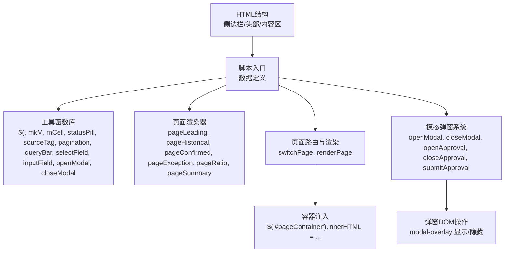
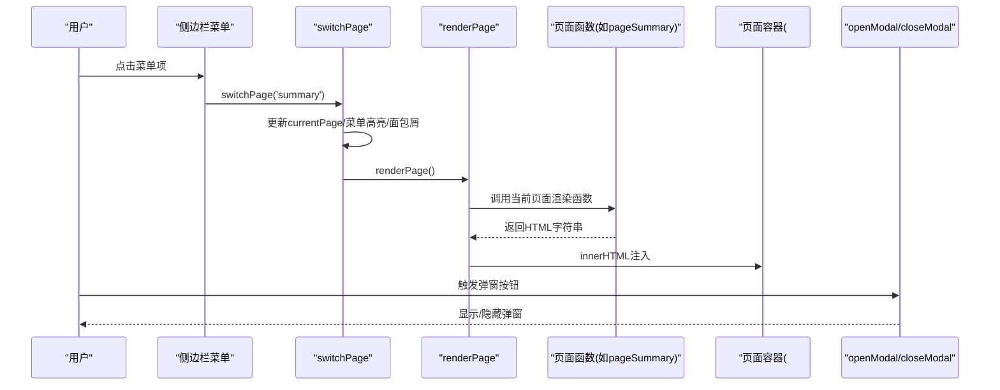
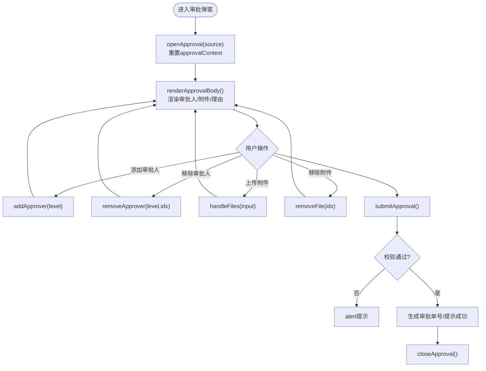
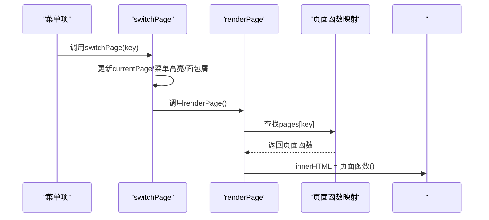
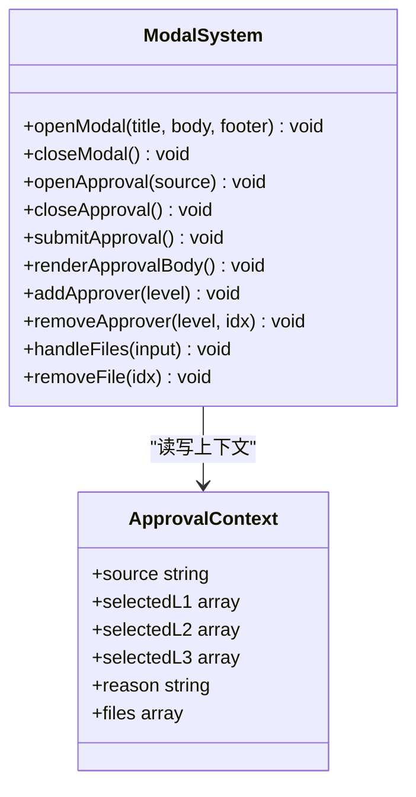
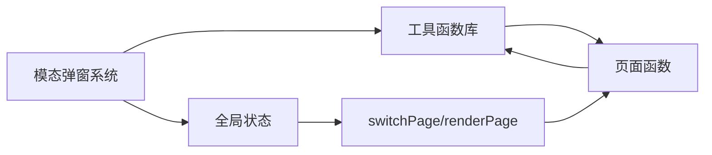

# JavaScript模块设计

<cite>
**本文引用的文件**   
- [sales-forecast-prototype.html](file://sales-forecast-prototype.html)
- [sales-forecast-prototype_副本.html](file://sales-forecast-prototype_副本.html)
</cite>

## 目录
1. [简介](#简介)
2. [项目结构](#项目结构)
3. [核心组件](#核心组件)
4. [架构总览](#架构总览)
5. [详细组件分析](#详细组件分析)
6. [依赖关系分析](#依赖关系分析)
7. [性能考量](#性能考量)
8. [故障排查指南](#故障排查指南)
9. [结论](#结论)
10. [附录](#附录)

## 简介
本文件面向销售预测原型中的JavaScript实现，系统性说明其模块化设计与职责划分、全局状态管理机制（currentPage、currentTab、approvalContext等）、工具函数库（mkM、mCell、statusPill、sourceTag等）的实现原理与使用场景、页面管理系统（switchPage路由切换与renderPage渲染逻辑）、模态弹窗系统（openModal、closeModal等调用模式），以及事件处理机制、数据绑定模式与错误处理策略。最后给出代码重构与扩展建议，帮助读者在保持高保真原型交互体验的同时，提升可维护性与可扩展性。

## 项目结构
该原型采用单页应用（SPA）形态，所有HTML、CSS与JS集中在一个HTML文件中，通过内联脚本组织功能模块。整体结构包括：
- 布局与样式：侧边栏导航、头部面包屑、主内容区、通用UI组件样式（卡片、表格、分页、标签、状态胶囊等）。
- 数据定义：常量数组与映射表（如月份标签、页面名称映射、用户列表等）。
- 工具函数：DOM选择器、单元格渲染、状态标签、来源标签、分页与查询条、表单字段生成、通用弹窗控制等。
- 页面渲染：每个页面对应一个返回HTML字符串的函数，由统一入口根据当前页面键值进行渲染。
- 模态弹窗：通用弹窗与审批弹窗，包含打开/关闭、动态渲染、表单校验与提交。
- 初始化：页面加载后执行一次渲染。

图表来源
- [sales-forecast-prototype.html:108-126](file://sales-forecast-prototype.html#L108-L126)
- [sales-forecast-prototype.html:141-147](file://sales-forecast-prototype.html#L141-L147)
- [sales-forecast-prototype.html:148-183](file://sales-forecast-prototype.html#L148-L183)
- [sales-forecast-prototype.html:282-292](file://sales-forecast-prototype.html#L282-L292)
- [sales-forecast-prototype.html:179-182](file://sales-forecast-prototype.html#L179-L182)
- [sales-forecast-prototype.html:184-280](file://sales-forecast-prototype.html#L184-L280)

章节来源
- [sales-forecast-prototype.html:108-126](file://sales-forecast-prototype.html#L108-L126)
- [sales-forecast-prototype.html:141-147](file://sales-forecast-prototype.html#L141-L147)

## 核心组件
- 全局状态管理
  - currentPage：当前激活的页面键值，用于路由与渲染。
  - currentTab：各页面内部Tab状态，例如exception与summary两个页面的子Tab。
  - approvalContext：审批弹窗上下文，包含来源、各级审批人选择、申请理由、附件列表等。
- 工具函数库
  - $(s)：DOM选择器封装。
  - mkM(b,a)：将“修改前”和“修改后”两列数组映射为对象数组，便于mCell渲染对比。
  - mCell(m,clickable,onClick)：渲染月度单元格的“修改前/修改后”对比视图，支持点击交互。
  - statusPill(s)：根据状态值生成带样式的状态胶囊。
  - sourceTag(s)：根据数据来源类型生成带样式的标签。
  - pagination(total)、queryBar(fields)、selectField(label,opts)、inputField(label,ph)：通用UI片段生成。
  - openModal(title,body,footer)、closeModal()：通用弹窗打开/关闭。
- 页面管理系统
  - switchPage(key)：更新currentPage、菜单高亮、面包屑标题并触发渲染。
  - renderPage()：根据currentPage从页面函数映射中调用对应渲染函数，注入到容器。
- 模态弹窗系统
  - openModal/closeModal：通用弹窗。
  - openApproval/closeApproval/submitApproval：审批弹窗的打开、关闭与提交流程，含表单校验与上下文重置。

章节来源
- [sales-forecast-prototype.html:141-147](file://sales-forecast-prototype.html#L141-L147)
- [sales-forecast-prototype.html:148-183](file://sales-forecast-prototype.html#L148-L183)
- [sales-forecast-prototype.html:282-292](file://sales-forecast-prototype.html#L282-L292)
- [sales-forecast-prototype.html:184-280](file://sales-forecast-prototype.html#L184-L280)

## 架构总览
下图展示了页面路由与渲染的核心流程，以及工具函数与模态弹窗的协作关系。

图表来源
- [sales-forecast-prototype.html:282-292](file://sales-forecast-prototype.html#L282-L292)
- [sales-forecast-prototype.html:179-182](file://sales-forecast-prototype.html#L179-L182)

## 详细组件分析

### 全局状态管理机制
- currentPage
  - 作用：标识当前页面，驱动switchPage与renderPage。
  - 更新方式：switchPage直接赋值；菜单点击时同步高亮与面包屑。
- currentTab
  - 作用：记录各页面内部Tab状态，如exception与summary的双Tab或多Tab。
  - 更新方式：在Tab按钮的onclick中直接修改currentTab对应键，再调用renderPage重绘。
- approvalContext
  - 作用：审批弹窗上下文，集中管理来源、各级审批人选择、申请理由、附件列表。
  - 生命周期：openApproval初始化上下文→渲染审批体→用户交互（添加/移除审批人、上传附件）→submitApproval校验并提交→closeApproval关闭。
  - 关键方法：addApprover、removeApprover、handleFiles、removeFile、submitApproval。

图表来源
- [sales-forecast-prototype.html:184-280](file://sales-forecast-prototype.html#L184-L280)

章节来源
- [sales-forecast-prototype.html:141-147](file://sales-forecast-prototype.html#L141-L147)
- [sales-forecast-prototype.html:184-280](file://sales-forecast-prototype.html#L184-L280)

### 工具函数库设计与使用场景
- $(s)
  - 用途：简化DOM选择，常用于获取容器或输入元素。
  - 使用场景：渲染后更新标题、读取输入框值等。
- mkM(b,a)
  - 用途：将“修改前/修改后”两列数值数组转换为对象数组，供mCell渲染。
  - 复杂度：O(n)，n为月份数量。
- mCell(m,clickable,onClick)
  - 用途：渲染月度单元格，自动判断差异并展示“修改前/修改后”，支持点击回调。
  - 使用场景：例外需求汇总表、汇总表的月度列。
- statusPill(s)
  - 用途：根据状态值生成带背景色与前景色的胶囊标签。
  - 使用场景：审批状态、需求状态等。
- sourceTag(s)
  - 用途：根据数据来源类型生成带样式的标签。
  - 使用场景：汇总明细表的数据来源列。
- pagination(total)、queryBar(fields)、selectField(label,opts)、inputField(label,ph)
  - 用途：快速生成分页控件、查询条、下拉框与文本输入框。
  - 使用场景：各页面的查询与分页区域。
- openModal(title,body,footer)、closeModal()
  - 用途：通用弹窗的打开与关闭，设置标题、内容与底部按钮。
  - 使用场景：新增、查看详情等弹窗。

章节来源
- [sales-forecast-prototype.html:148-183](file://sales-forecast-prototype.html#L148-L183)

### 页面管理系统工作原理
- switchPage(key)
  - 更新currentPage为传入键值。
  - 同步菜单项的高亮状态。
  - 更新头部面包屑的当前页面名称。
  - 调用renderPage进行渲染。
- renderPage()
  - 定义页面函数映射表，按currentPage选择对应渲染函数。
  - 将渲染结果以HTML字符串形式注入到页面容器。
- 页面函数
  - pageLeading、pageHistorical、pageConfirmed、pageException、pageRatio、pageSummary分别返回各自页面的HTML字符串。
  - 复杂页面（如exception与summary）内部通过currentTab切换不同视图。

图表来源
- [sales-forecast-prototype.html:282-292](file://sales-forecast-prototype.html#L282-L292)

章节来源
- [sales-forecast-prototype.html:282-292](file://sales-forecast-prototype.html#L282-L292)

### 模态弹窗系统实现
- 通用弹窗
  - openModal(title,body,footer)：设置标题、内容与底部按钮，并显示overlay。
  - closeModal()：移除show类以隐藏弹窗。
- 审批弹窗
  - openApproval(source)：初始化approvalContext并渲染审批体，显示overlay。
  - closeApproval()：隐藏审批弹窗。
  - submitApproval()：校验申请理由与一级审批人，生成审批单号并提示成功，随后关闭弹窗。
  - 辅助方法：addApprover、removeApprover、handleFiles、removeFile负责审批人与附件的动态管理。

图表来源
- [sales-forecast-prototype.html:179-182](file://sales-forecast-prototype.html#L179-L182)
- [sales-forecast-prototype.html:184-280](file://sales-forecast-prototype.html#L184-L280)

章节来源
- [sales-forecast-prototype.html:179-182](file://sales-forecast-prototype.html#L179-L182)
- [sales-forecast-prototype.html:184-280](file://sales-forecast-prototype.html#L184-L280)

### 事件处理机制与数据绑定模式
- 事件处理
  - 菜单点击：通过onclick直接调用switchPage。
  - Tab切换：在Tab按钮的onclick中直接修改currentTab对应键，然后调用renderPage。
  - 弹窗按钮：通过onclick调用openModal/closeModal或审批相关方法。
  - 文件上传：通过onchange事件监听input.files，调用handleFiles进行处理。
- 数据绑定模式
  - 单向渲染：页面函数返回HTML字符串，通过innerHtml注入，无双向绑定。
  - 状态驱动：全局状态（currentPage、currentTab、approvalContext）变化后，通过重新渲染刷新视图。
  - 行内事件：大量使用内联onclick/onchange，简单直观但耦合度高。

章节来源
- [sales-forecast-prototype.html:113-118](file://sales-forecast-prototype.html#L113-L118)
- [sales-forecast-prototype.html:346-348](file://sales-forecast-prototype.html#L346-L348)
- [sales-forecast-prototype.html:240-248](file://sales-forecast-prototype.html#L240-L248)

### 错误处理策略
- 表单校验
  - 审批提交前检查申请理由是否为空、一级审批人是否已选择，未通过则alert提示。
- 文件限制
  - 附件数量上限（最多3个）、单个文件大小限制（不超过30MB），超限则提示并跳过。
- 交互反馈
  - 使用alert进行即时提示，确保用户感知错误与成功状态。

章节来源
- [sales-forecast-prototype.html:274-280](file://sales-forecast-prototype.html#L274-L280)
- [sales-forecast-prototype.html:263-272](file://sales-forecast-prototype.html#L263-L272)

## 依赖关系分析
- 模块间依赖
  - 页面函数依赖工具函数（mkM、mCell、statusPill、sourceTag、pagination、queryBar、selectField、inputField）。
  - 页面路由依赖全局状态（currentPage、PAGE_NAMES）。
  - 模态弹窗依赖DOM选择器与全局状态（approvalContext）。
- 潜在循环依赖
  - 当前实现为单向依赖，未见循环引用。
- 外部依赖
  - 仅依赖浏览器原生API（document.querySelector、classList、innerHTML等）。

图表来源
- [sales-forecast-prototype.html:148-183](file://sales-forecast-prototype.html#L148-L183)
- [sales-forecast-prototype.html:282-292](file://sales-forecast-prototype.html#L282-L292)
- [sales-forecast-prototype.html:184-280](file://sales-forecast-prototype.html#L184-L280)

章节来源
- [sales-forecast-prototype.html:148-183](file://sales-forecast-prototype.html#L148-L183)
- [sales-forecast-prototype.html:282-292](file://sales-forecast-prototype.html#L282-L292)
- [sales-forecast-prototype.html:184-280](file://sales-forecast-prototype.html#L184-L280)

## 性能考量
- 渲染策略
  - 每次切换页面或Tab都重新生成HTML字符串并注入容器，适合原型阶段，但在大数据量下可能产生性能瓶颈。
- DOM操作
  - 频繁innerHTML替换可能导致重排与重绘，建议在后续版本引入虚拟DOM或增量更新。
- 事件绑定
  - 内联onclick简单高效，但难以解耦；建议改为事件委托以提升可维护性。
- 内存占用
  - approvalContext在弹窗打开时重置，避免累积；注意大附件列表的内存开销。

[本节提供一般性指导，不直接分析具体文件]

## 故障排查指南
- 页面不切换
  - 检查switchPage是否正确更新currentPage与菜单高亮。
  - 确认renderPage中页面函数映射是否存在对应键。
- 弹窗无法显示
  - 检查openModal是否正确设置标题、内容与底部按钮。
  - 确认modal-overlay的show类是否正确添加/移除。
- 审批提交失败
  - 检查submitApproval中的校验逻辑（申请理由、一级审批人）。
  - 确认handleFiles对附件数量与大小的限制。
- 表格渲染异常
  - 检查mkM生成的对象数组结构与mCell期望一致。
  - 确认statusPill与sourceTag的状态值是否在映射表中。

章节来源
- [sales-forecast-prototype.html:282-292](file://sales-forecast-prototype.html#L282-L292)
- [sales-forecast-prototype.html:179-182](file://sales-forecast-prototype.html#L179-L182)
- [sales-forecast-prototype.html:274-280](file://sales-forecast-prototype.html#L274-L280)
- [sales-forecast-prototype.html:263-272](file://sales-forecast-prototype.html#L263-L272)
- [sales-forecast-prototype.html:148-166](file://sales-forecast-prototype.html#L148-L166)

## 结论
该销售预测原型采用简洁的单页架构，通过全局状态驱动页面与弹窗渲染，工具函数库提供了通用的UI构建能力。虽然内联事件与字符串拼接使实现直观，但也带来耦合度高与可维护性不足的问题。建议在后续迭代中引入更清晰的事件委托、数据绑定与组件化方案，以提升性能与可测试性。

[本节总结性内容，不直接分析具体文件]

## 附录
- 代码重构建议
  - 将工具函数与页面函数分离到独立模块文件，减少单文件体积。
  - 引入事件委托与状态订阅机制，降低内联onclick的使用。
  - 将approvalContext抽象为服务层，提供统一的增删改查接口。
  - 对大数据表格引入分页与虚拟化渲染，优化性能。
- 扩展建议
  - 增加国际化支持，将文案抽离为配置。
  - 引入图表库（如ECharts）替代占位图，增强可视化能力。
  - 增加单元测试覆盖工具函数与页面渲染逻辑。

[本节提供概念性指导，不直接分析具体文件]