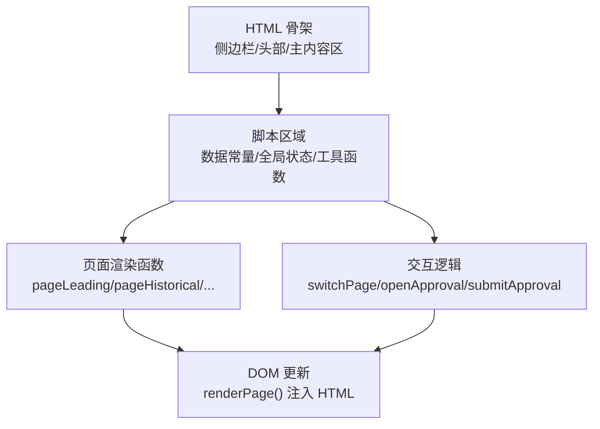
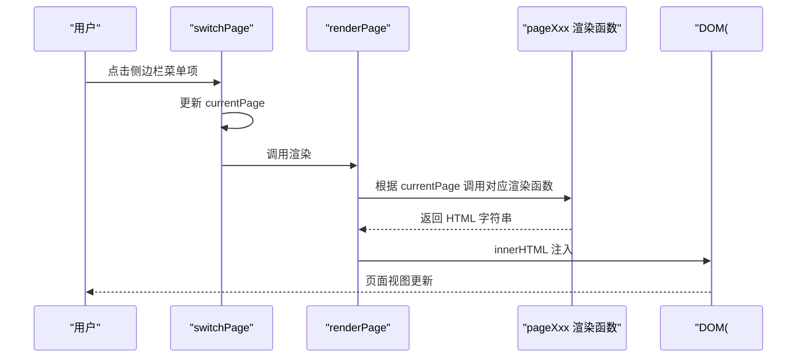
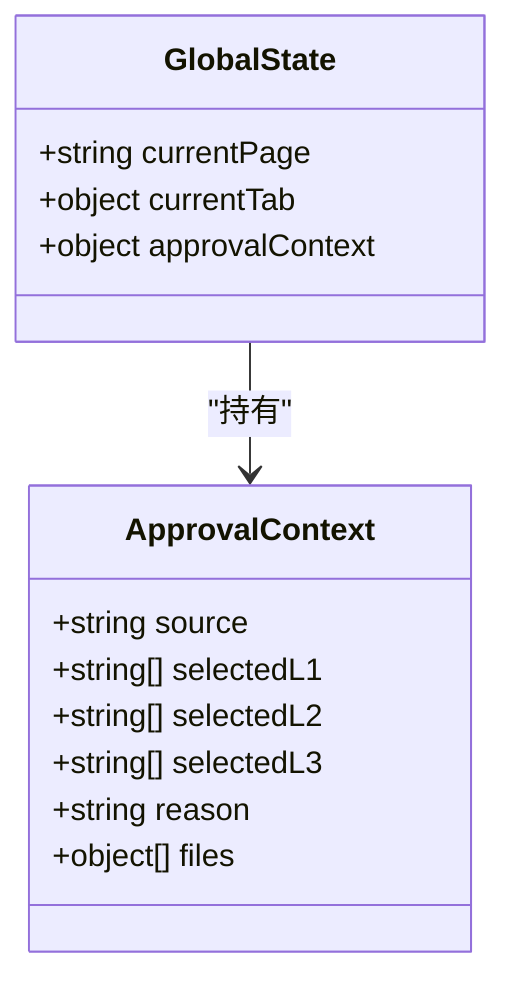
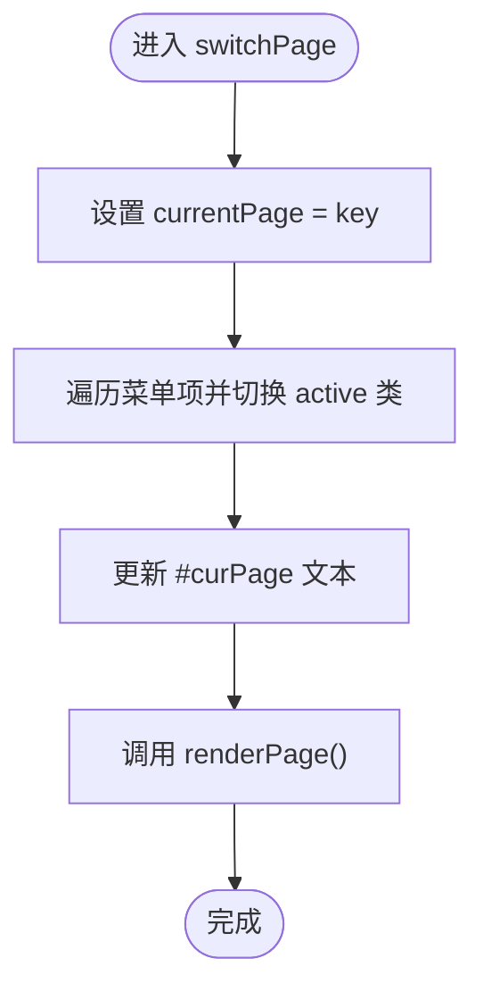
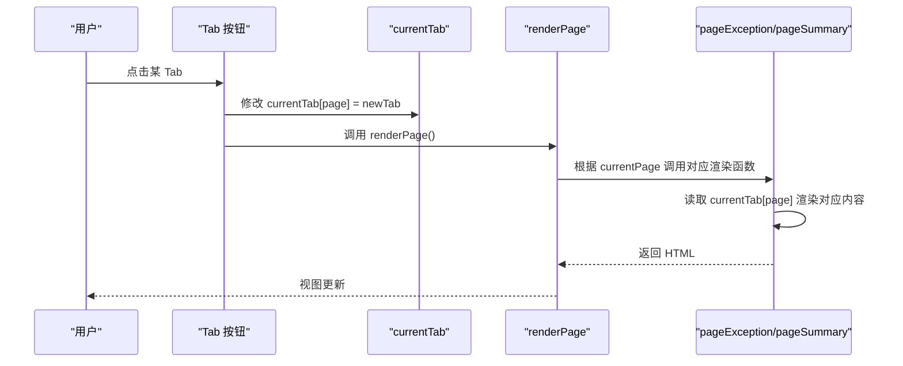
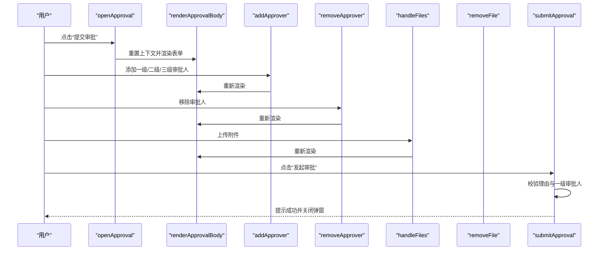
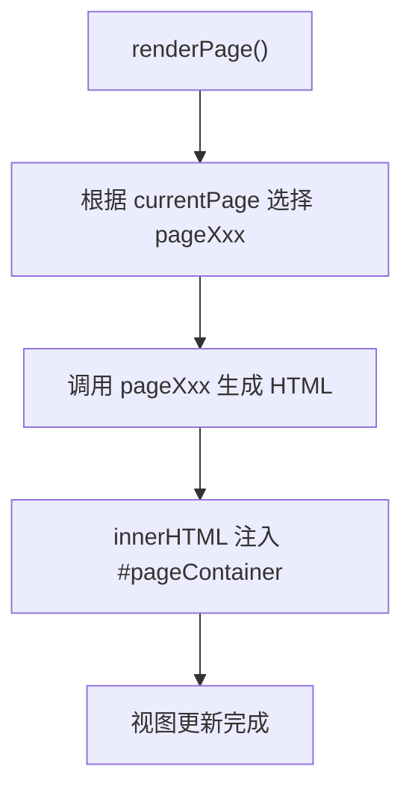
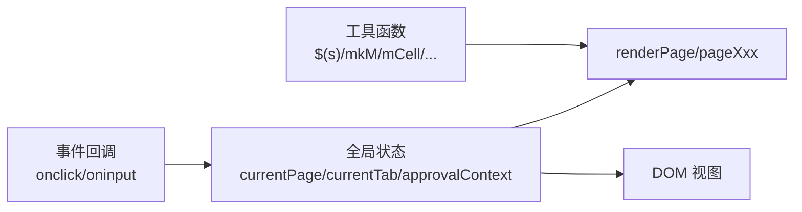

# 全局状态管理

<cite>
**本文档引用的文件**   
- [sales-forecast-prototype.html](file://sales-forecast-prototype.html)
- [sales-forecast-prototype_副本.html](file://sales-forecast-prototype_副本.html)
</cite>

## 目录
1. [简介](#简介)
2. [项目结构](#项目结构)
3. [核心组件](#核心组件)
4. [架构总览](#架构总览)
5. [详细组件分析](#详细组件分析)
6. [依赖关系分析](#依赖关系分析)
7. [性能考虑](#性能考虑)
8. [故障排查指南](#故障排查指南)
9. [结论](#结论)
10. [附录](#附录)

## 简介
本文件聚焦于销售预测原型中的全局状态管理机制，围绕以下目标展开：
- 解释核心状态变量 currentPage、currentTab、approvalContext 的定义与用途
- 描述状态更新模式，包括 switchPage 如何管理页面切换、currentTab 如何维护多标签页状态、approvalContext 如何管理审批流程上下文
- 说明状态持久化策略与状态同步机制
- 提供状态管理的最佳实践与扩展建议

该原型采用单页应用（SPA）模式，通过全局变量集中管理页面与标签页状态，并通过渲染函数将状态映射到 DOM。

## 项目结构
- 入口与布局：HTML 包含侧边栏导航、头部面包屑、主内容区以及通用弹窗容器
- 脚本区域：集中定义数据常量、全局状态、工具函数、页面渲染函数、交互逻辑与初始化
- 样式：内联 CSS，用于布局、表格、表单、弹窗、标签等 UI 组件

图表来源
- [sales-forecast-prototype.html:108-140](file://sales-forecast-prototype.html#L108-L140)
- [sales-forecast-prototype.html:140-188](file://sales-forecast-prototype.html#L140-L188)
- [sales-forecast-prototype.html:282-292](file://sales-forecast-prototype.html#L282-L292)

章节来源
- [sales-forecast-prototype.html:108-140](file://sales-forecast-prototype.html#L108-L140)
- [sales-forecast-prototype.html:140-188](file://sales-forecast-prototype.html#L140-L188)

## 核心组件
- 全局状态变量
  - currentPage：当前激活的页面键值，控制侧边栏高亮与主内容渲染
  - currentTab：对象，维护各页面的内部标签页状态（如 exception、summary）
  - approvalContext：对象，维护提交审批弹窗的上下文（来源、审批人选择、理由、附件）
- 关键函数
  - switchPage(key)：切换页面并刷新视图
  - renderPage()：根据 currentPage 调用对应 pageXxx 函数生成 HTML
  - openApproval(source)/submitApproval()：打开并提交审批弹窗，操作 approvalContext
  - 工具函数：$(s)、mkM(b,a)、mCell、statusPill、sourceTag、pagination、queryBar、selectField、inputField、openModal、closeModal

章节来源
- [sales-forecast-prototype.html:142-146](file://sales-forecast-prototype.html#L142-L146)
- [sales-forecast-prototype.html:148-183](file://sales-forecast-prototype.html#L148-L183)
- [sales-forecast-prototype.html:184-281](file://sales-forecast-prototype.html#L184-L281)
- [sales-forecast-prototype.html:282-292](file://sales-forecast-prototype.html#L282-L292)

## 架构总览
整体为“全局状态 + 渲染函数”的简单 SPA 架构：
- 状态层：currentPage、currentTab、approvalContext
- 行为层：switchPage、openApproval、submitApproval、addApprover、removeApprover、handleFiles、removeFile
- 视图层：renderPage 与各 pageXxx 函数，将状态转换为 HTML 字符串并注入 #pageContainer

图表来源
- [sales-forecast-prototype.html:282-292](file://sales-forecast-prototype.html#L282-L292)
- [sales-forecast-prototype.html:289-292](file://sales-forecast-prototype.html#L289-L292)

章节来源
- [sales-forecast-prototype.html:282-292](file://sales-forecast-prototype.html#L282-L292)

## 详细组件分析

### 全局状态变量：currentPage、currentTab、approvalContext
- currentPage
  - 类型：字符串
  - 作用：标识当前激活的页面（leading/historical/confirmed/exception/ratio/summary）
  - 更新方式：switchPage(key) 直接赋值
  - 影响范围：侧边栏高亮、面包屑标题、renderPage 路由分发
- currentTab
  - 类型：对象，键为页面名，值为当前标签页键（如 exception:'summary' | 'detail'；summary:'region'|'zone'|'country'|'detail'）
  - 作用：维护多标签页的活跃状态
  - 更新方式：在页面渲染函数中直接修改属性后触发 renderPage()
  - 影响范围：页面内 Tab 按钮高亮与对应内容渲染
- approvalContext
  - 类型：对象，字段包括 source、selectedL1/L2/L3、reason、files
  - 作用：承载提交审批弹窗的上下文数据
  - 更新方式：openApproval 重置上下文；addApprover/removeApprover 增删审批人；handleFiles/removeFile 管理附件；submitApproval 校验并提示结果
  - 影响范围：审批弹窗表单渲染与提交逻辑

图表来源
- [sales-forecast-prototype.html:142-146](file://sales-forecast-prototype.html#L142-L146)
- [sales-forecast-prototype.html:184-281](file://sales-forecast-prototype.html#L184-L281)

章节来源
- [sales-forecast-prototype.html:142-146](file://sales-forecast-prototype.html#L142-L146)
- [sales-forecast-prototype.html:184-281](file://sales-forecast-prototype.html#L184-L281)

### 页面切换状态管理：switchPage
- 职责
  - 更新 currentPage
  - 同步侧边栏菜单项的 active 类
  - 更新面包屑标题
  - 调用 renderPage 重新渲染主内容
- 关键点
  - 使用数组索引匹配菜单项顺序，确保高亮正确
  - 面包屑文本来自 PAGE_NAMES 映射

图表来源
- [sales-forecast-prototype.html:282-288](file://sales-forecast-prototype.html#L282-L288)

章节来源
- [sales-forecast-prototype.html:282-288](file://sales-forecast-prototype.html#L282-L288)

### 多标签页状态维护：currentTab
- 设计思路
  - 以页面名为键，存储当前激活的标签页键
  - 在页面渲染函数中读取 currentTab[page] 决定显示哪个 Tab 的内容
  - 点击 Tab 按钮时直接修改 currentTab[page] 并调用 renderPage() 刷新视图
- 示例
  - 例外需求：currentTab.exception 可为 'summary' 或 'detail'
  - 销售预测汇总：currentTab.summary 可为 'region'/'zone'/'country'/'detail'

图表来源
- [sales-forecast-prototype.html:345-365](file://sales-forecast-prototype.html#L345-L365)
- [sales-forecast-prototype.html:412-453](file://sales-forecast-prototype.html#L412-L453)

章节来源
- [sales-forecast-prototype.html:345-365](file://sales-forecast-prototype.html#L345-L365)
- [sales-forecast-prototype.html:412-453](file://sales-forecast-prototype.html#L412-L453)

### 审批流程上下文：approvalContext
- 生命周期
  - 打开：openApproval(source) 重置上下文并渲染表单
  - 编辑：addApprover/removeApprover 增删审批人；handleFiles/removeFile 管理附件；textarea oninput 实时更新 reason
  - 提交：submitApproval 校验必填项，生成审批单号并提示成功，关闭弹窗
- 数据结构
  - source：来源页面名称
  - selectedL1/L2/L3：各级审批人列表（字符串数组）
  - reason：申请理由（字符串）
  - files：附件信息（对象数组，含 name、size）

图表来源
- [sales-forecast-prototype.html:184-281](file://sales-forecast-prototype.html#L184-L281)

章节来源
- [sales-forecast-prototype.html:184-281](file://sales-forecast-prototype.html#L184-L281)

### 渲染与状态同步：renderPage 与 pageXxx
- renderPage
  - 根据 currentPage 从 pages 映射表选择渲染函数
  - 将返回的 HTML 字符串注入 #pageContainer
- pageXxx
  - 每个页面函数负责构建该页面的完整 HTML
  - 读取全局状态（currentPage/currentTab/approvalContext）并生成相应 UI
  - 事件回调直接修改全局状态并触发 renderPage

图表来源
- [sales-forecast-prototype.html:289-292](file://sales-forecast-prototype.html#L289-L292)

章节来源
- [sales-forecast-prototype.html:289-292](file://sales-forecast-prototype.html#L289-L292)

## 依赖关系分析
- 全局状态与渲染函数的耦合
  - 所有 pageXxx 函数依赖 currentPage/currentTab 决定渲染分支
  - approvalContext 被审批相关函数共享与更新
- 工具函数与 UI 组件
  - $(s) 用于快速获取 DOM 元素
  - mkM/mCell/statusPill/sourceTag/pagination/queryBar/selectField/inputField 等辅助生成 UI
- 事件绑定与状态更新
  - 直接在 HTML 模板中嵌入 onclick/oninput 回调，修改全局状态并触发渲染

图表来源
- [sales-forecast-prototype.html:148-183](file://sales-forecast-prototype.html#L148-L183)
- [sales-forecast-prototype.html:282-292](file://sales-forecast-prototype.html#L282-L292)

章节来源
- [sales-forecast-prototype.html:148-183](file://sales-forecast-prototype.html#L148-L183)
- [sales-forecast-prototype.html:282-292](file://sales-forecast-prototype.html#L282-L292)

## 性能考虑
- 渲染成本
  - 每次状态变更都会调用 renderPage 并重建整页 HTML，可能带来不必要的重绘
  - 建议在大数据量场景下引入局部更新或虚拟 DOM
- 内存占用
  - approvalContext.files 仅保存元信息（name、size），避免大对象驻留
- 交互响应
  - 审批弹窗频繁 re-render，可考虑缓存已渲染片段或使用更细粒度的更新策略

## 故障排查指南
- 常见问题
  - 页面未更新：检查是否调用了 renderPage；确认 currentPage/currentTab 是否正确赋值
  - 审批弹窗异常：检查 approvalContext.reason 是否为空；确认至少选择一个一级审批人
  - 附件限制错误：handleFiles 中限制了最多 3 个附件且单个不超过 30MB
- 调试建议
  - 在关键函数入口打印状态快照
  - 使用浏览器开发者工具观察 DOM 变化与事件触发

章节来源
- [sales-forecast-prototype.html:184-281](file://sales-forecast-prototype.html#L184-L281)

## 结论
该原型采用简洁的全局状态管理模式，通过 currentPage、currentTab、approvalContext 三个核心变量驱动页面与交互。其优点是实现简单、易于理解；缺点是缺乏持久化与细粒度更新，扩展性有限。建议后续引入状态持久化（如 localStorage）、统一的状态管理器（如轻量级 store）与受控组件模式，以提升可维护性与性能。

## 附录
- 状态持久化策略（现状与建议）
  - 现状：无持久化，刷新页面后状态丢失
  - 建议：将 currentPage/currentTab 序列化至 localStorage；approvalContext 仅在弹窗期间保留，不持久化
- 状态同步机制（现状与建议）
  - 现状：直接修改全局变量后调用 renderPage 同步视图
  - 建议：引入发布-订阅或响应式更新，减少重复渲染
- 最佳实践
  - 将状态与视图分离，避免在模板中直接写复杂逻辑
  - 对审批流程增加状态机约束，防止非法流转
  - 对输入进行统一校验与格式化，提升健壮性