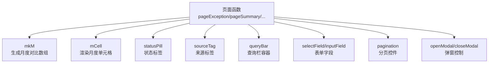
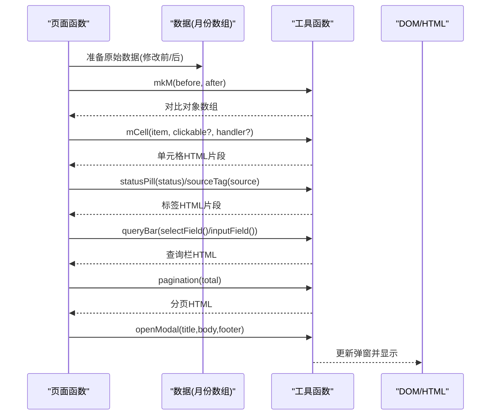
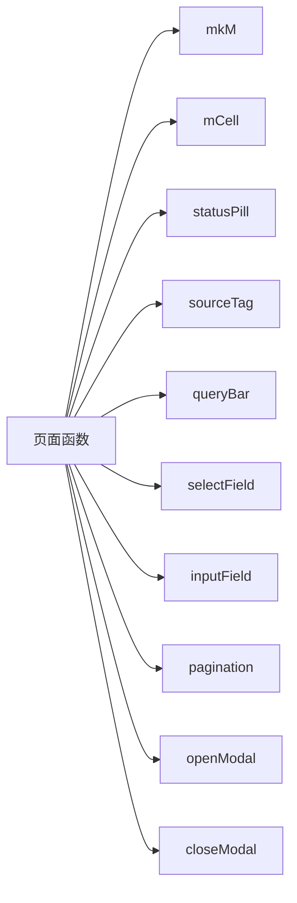

# 工具函数库

<cite>
**本文引用的文件**   
- [sales-forecast-prototype.html](file://sales-forecast-prototype.html)
</cite>

## 目录
1. [简介](#简介)
2. [项目结构](#项目结构)
3. [核心组件](#核心组件)
4. [架构总览](#架构总览)
5. [详细组件分析](#详细组件分析)
6. [依赖关系分析](#依赖关系分析)
7. [性能考量](#性能考量)
8. [故障排查指南](#故障排查指南)
9. [结论](#结论)
10. [附录：函数使用示例与参数说明](#附录函数使用示例与参数说明)

## 简介
本文件聚焦销售预测原型中的“工具函数库”，系统性说明以下函数的设计目标、输入输出、渲染逻辑与使用方式：
- mkM：生成月度数据对比格式（修改前/修改后）
- mCell：渲染可点击的单元格组件，支持差异高亮与交互
- statusPill：生成状态标签（如草稿、审批中、已通过等）
- sourceTag：生成来源标签（确定性需求、例外需求、历史销售预测）
- pagination：分页组件
- queryBar：查询栏容器
- selectField / inputField：表单字段生成器
- openModal / closeModal：通用弹窗管理

这些函数以纯字符串拼接的方式快速构建页面片段，配合统一的样式类名实现一致的视觉风格。

## 项目结构
该原型为单页应用，所有工具函数集中在一个 HTML 文件的 <script> 区块内，通过 DOM 操作与模板字符串渲染页面内容。工具函数被各页面函数复用，形成“页面函数 → 工具函数”的调用链。

图表来源
- [sales-forecast-prototype.html:142-182](file://sales-forecast-prototype.html#L142-L182)

章节来源
- [sales-forecast-prototype.html:142-182](file://sales-forecast-prototype.html#L142-L182)

## 核心组件
本节对工具函数进行逐一解析，涵盖职责、参数、返回值、内部处理逻辑与典型用法路径。

- mkM(b, a)
  - 作用：将两个等长数组 b（修改前）、a（修改后）映射为对象数组，每个对象包含 before 与 after 字段，便于后续统一渲染对比。
  - 复杂度：O(n)，n 为数组长度。
  - 使用位置：在汇总/明细表格中构造月份列数据。
  
- mCell(m, clickable, onClick)
  - 作用：根据 m.before/m.after 是否相等决定显示差异样式；当 clickable 为真时添加可点击样式与事件。
  - 关键点：差异检测、样式类选择、onclick 注入。
  - 使用位置：月度对比列渲染。

- statusPill(s)
  - 作用：根据状态值 s 返回带背景色与前景色的胶囊标签。
  - 默认回退：未知状态使用中性灰。
  - 使用位置：审批状态展示。

- sourceTag(s)
  - 作用：根据数据来源类型返回不同颜色的标签。
  - 使用位置：来源类型展示。

- pagination(total)
  - 作用：返回分页容器 HTML，包含每页条数下拉、记录总数、上一页/下一页按钮与页码信息。
  - 注意：当前版本为静态占位，未绑定实际翻页逻辑。

- queryBar(fields)
  - 作用：将传入的 fields（由 selectField/inputField 组合）包裹进查询栏容器，并附带“查询/重置”按钮。
  - 使用位置：各页面顶部筛选区。

- selectField(label, opts) / inputField(label, ph)
  - 作用：生成标准表单字段 HTML（label + select/input）。
  - 使用位置：queryBar 的参数拼装。

- openModal(title, body, footer) / closeModal()
  - 作用：设置弹窗标题、主体内容与底部按钮，并通过 class 切换显示/隐藏。
  - 使用位置：新增/查看/提交审批等场景。

章节来源
- [sales-forecast-prototype.html:149-182](file://sales-forecast-prototype.html#L149-L182)

## 架构总览
下图展示了工具函数在页面渲染流程中的协作关系与数据流向。

图表来源
- [sales-forecast-prototype.html:149-182](file://sales-forecast-prototype.html#L149-L182)

## 详细组件分析

### mkM：月度对比数据生成
- 输入
  - b: number[] | string[]（修改前序列）
  - a: number[] | string[]（修改后序列）
- 输出
  - Array<{before: number|string; after: number|string}>
- 行为
  - 按索引配对生成对比对象，供 mCell 消费。
- 复杂度
  - 时间 O(n)，空间 O(n)。
- 使用示例路径
  - 在汇总/明细数据中构造 months 字段，随后遍历渲染。

章节来源
- [sales-forecast-prototype.html:150](file://sales-forecast-prototype.html#L150)

### mCell：月度单元格渲染
- 输入
  - m: {before, after}
  - clickable: boolean（是否可点击）
  - onClick: string（可选，内联 onclick 表达式）
- 输出
  - HTML 字符串（div.m-cell，内含 before/after 行）
- 行为
  - 比较 before/after 决定是否显示删除线与高亮新值。
  - 若 clickable 为真，追加可点击样式与 hover 效果。
- 使用示例路径
  - 在表格列中循环调用，生成多个月度对比单元格。

章节来源
- [sales-forecast-prototype.html:151-156](file://sales-forecast-prototype.html#L151-L156)

### statusPill：状态标签
- 输入
  - s: string（状态值）
- 输出
  - HTML 字符串（span.pill，带背景与文字颜色）
- 行为
  - 内置状态到样式的映射，未知状态回退中性色。
- 使用示例路径
  - 在明细表“审批状态”列渲染。

章节来源
- [sales-forecast-prototype.html:157-161](file://sales-forecast-prototype.html#L157-L161)

### sourceTag：来源标签
- 输入
  - s: string（来源类型）
- 输出
  - HTML 字符串（span.tag，带背景与文字颜色）
- 行为
  - 针对“确定性需求/例外需求/历史销售预测”提供配色。
- 使用示例路径
  - 在汇总明细表的“数据来源”列渲染。

章节来源
- [sales-forecast-prototype.html:162-166](file://sales-forecast-prototype.html#L162-L166)

### pagination：分页组件
- 输入
  - total: number（总记录数）
- 输出
  - HTML 字符串（分页容器，含每页条数下拉、记录总数、上一页/下一页、页码信息）
- 行为
  - 当前为静态占位，未实现真实翻页逻辑。
- 使用示例路径
  - 各页面表格底部插入。

章节来源
- [sales-forecast-prototype.html:167-169](file://sales-forecast-prototype.html#L167-L169)

### queryBar：查询栏容器
- 输入
  - fields: string（由 selectField/inputField 拼接的 HTML）
- 输出
  - HTML 字符串（查询栏容器 + 查询/重置按钮）
- 行为
  - 将字段区域与按钮区域组合成一行布局。
- 使用示例路径
  - 页面顶部筛选区。

章节来源
- [sales-forecast-prototype.html:170-172](file://sales-forecast-prototype.html#L170-L172)

### selectField / inputField：表单字段
- selectField(label, opts)
  - 输入：label(string), opts(string[])
  - 输出：form-group + label + select 的 HTML
- inputField(label, ph)
  - 输入：label(string), ph(string)
  - 输出：form-group + label + input[type=text] 的 HTML
- 使用示例路径
  - 作为 queryBar 的 fields 参数拼装。

章节来源
- [sales-forecast-prototype.html:173-178](file://sales-forecast-prototype.html#L173-L178)

### openModal / closeModal：弹窗管理
- openModal(title, body, footer)
  - 作用：设置弹窗标题、主体内容与底部按钮，并显示弹窗。
- closeModal()
  - 作用：移除显示类，隐藏弹窗。
- 使用示例路径
  - 新增/查看/提交审批等操作触发弹窗。

章节来源
- [sales-forecast-prototype.html:179-182](file://sales-forecast-prototype.html#L179-L182)

## 依赖关系分析
- 页面函数依赖工具函数完成 UI 片段生成与交互控制。
- 工具函数之间无直接耦合，各自独立返回 HTML 字符串或执行 DOM 操作。
- 样式依赖全局 CSS 类名（如 .m-cell、.pill、.tag、.pagination、.modal-overlay 等），保证一致外观。

图表来源
- [sales-forecast-prototype.html:149-182](file://sales-forecast-prototype.html#L149-L182)

章节来源
- [sales-forecast-prototype.html:149-182](file://sales-forecast-prototype.html#L149-L182)

## 性能考量
- 字符串拼接渲染简单高效，适合原型阶段；但在大数据量表格下可能产生较多 DOM 节点，建议后续引入虚拟列表或增量更新。
- mCell 的差异判断为 O(1)，mkM 为 O(n)，整体渲染复杂度取决于数据规模。
- 当前分页为静态占位，未做服务端分页或前端分页计算，扩展时需补充逻辑。

[本节为通用指导，不直接分析具体文件]

## 故障排查指南
- 弹窗不显示
  - 检查 modal 元素是否存在且 id 正确。
  - 确认 openModal 已调用并设置了 title/body/footer。
  - 检查 CSS 类 show 是否正确切换。
- 单元格不显示差异
  - 确保 mkM 生成的 before/after 不相等。
  - 确认 mCell 接收到的 m 对象字段完整。
- 状态/来源标签颜色异常
  - 检查传入的状态/来源值是否在映射表中，否则将回退中性色。
- 分页无效
  - 当前为静态占位，需自行实现翻页逻辑与数据切片。

章节来源
- [sales-forecast-prototype.html:179-182](file://sales-forecast-prototype.html#L179-L182)
- [sales-forecast-prototype.html:167-169](file://sales-forecast-prototype.html#L167-L169)

## 结论
工具函数库以最小依赖和简洁接口实现了销售预测原型的核心 UI 能力：月度对比渲染、状态/来源标签、查询栏、分页与弹窗。其优势在于开发效率高、样式统一；改进方向包括增强分页交互、完善表单校验与事件绑定、提升大数据渲染性能。

[本节为总结性内容，不直接分析具体文件]

## 附录：函数使用示例与参数说明

- mkM(before, after)
  - 参数
    - before: number[] | string[]（修改前序列）
    - after: number[] | string[]（修改后序列）
  - 返回
    - Array<{before, after}>
  - 示例路径
    - 在汇总/明细数据中构造 months 字段，再遍历渲染。

- mCell(m, clickable, onClick)
  - 参数
    - m: {before, after}
    - clickable: boolean
    - onClick: string（可选，内联 onclick 表达式）
  - 返回
    - HTML 字符串
  - 示例路径
    - 表格列渲染循环中调用。

- statusPill(status)
  - 参数
    - status: string（如“草稿”“审批中”“已通过”“已驳回”“已撤回”“已废弃”）
  - 返回
    - HTML 字符串（胶囊标签）

- sourceTag(source)
  - 参数
    - source: string（如“确定性需求”“例外需求”“历史销售预测”）
  - 返回
    - HTML 字符串（标签）

- pagination(total)
  - 参数
    - total: number（总记录数）
  - 返回
    - HTML 字符串（分页容器）

- queryBar(fields)
  - 参数
    - fields: string（由 selectField/inputField 拼接）
  - 返回
    - HTML 字符串（查询栏）

- selectField(label, opts)
  - 参数
    - label: string
    - opts: string[]
  - 返回
    - HTML 字符串（下拉字段）

- inputField(label, ph)
  - 参数
    - label: string
    - ph: string（占位符）
  - 返回
    - HTML 字符串（文本输入字段）

- openModal(title, body, footer)
  - 参数
    - title: string
    - body: string（HTML）
    - footer: string（可选，HTML）
  - 行为
    - 设置弹窗内容并显示

- closeModal()
  - 行为
    - 隐藏弹窗

章节来源
- [sales-forecast-prototype.html:149-182](file://sales-forecast-prototype.html#L149-L182)