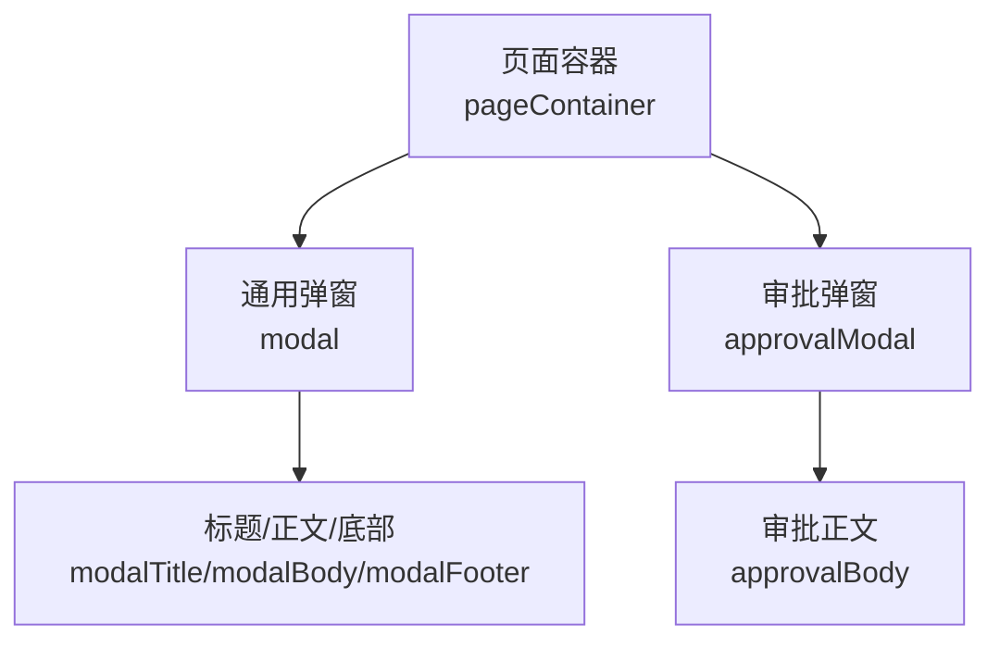
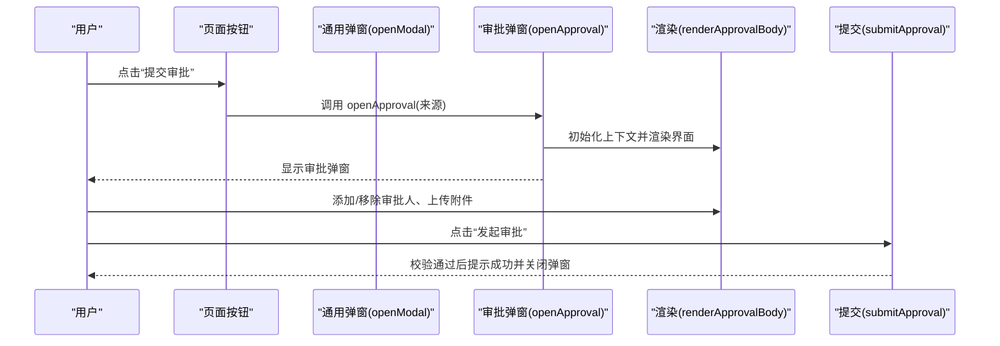
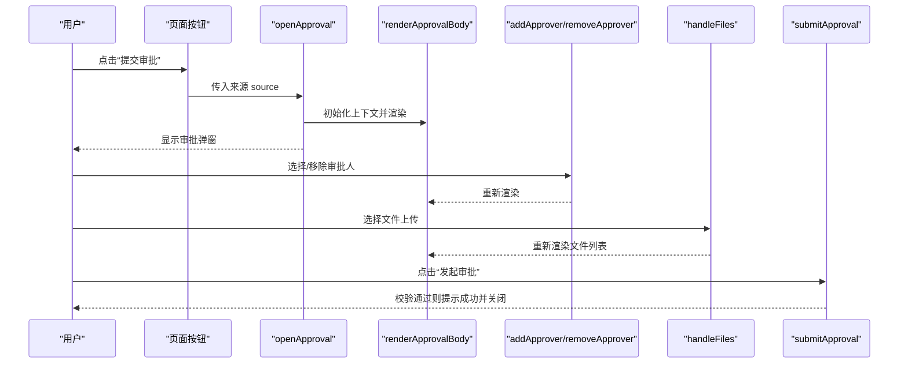
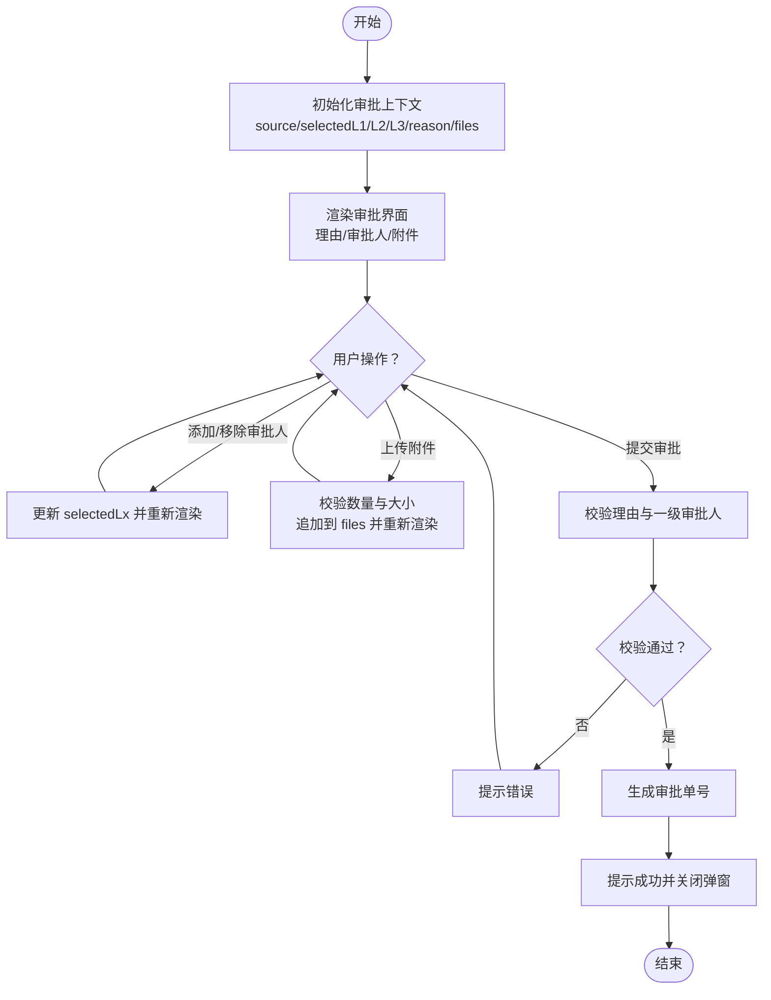
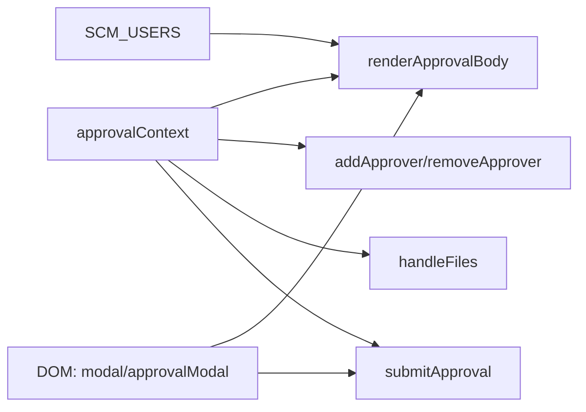

# 模态弹窗系统

<cite>
**本文引用的文件**   
- [sales-forecast-prototype.html](file://sales-forecast-prototype.html)
</cite>

## 目录
1. [简介](#简介)
2. [项目结构](#项目结构)
3. [核心组件](#核心组件)
4. [架构总览](#架构总览)
5. [详细组件分析](#详细组件分析)
6. [依赖关系分析](#依赖关系分析)
7. [性能考量](#性能考量)
8. [故障排查指南](#故障排查指南)
9. [结论](#结论)
10. [附录](#附录)

## 简介
本文件详细说明销售预测原型中的模态弹窗系统实现，重点覆盖：
- 通用弹窗 openModal 与 closeModal 的调用模式与参数结构
- 审批弹窗系统的完整实现：openApproval 初始化上下文、renderApprovalBody 动态渲染界面、addApprover/removeApprover 管理审批人选择、handleFiles 处理附件上传
- 三级审批人的选择逻辑、附件上传验证与审批提交流程
- 弹窗样式定制与扩展方法

该实现基于单页 HTML + 内联脚本，通过 DOM 操作与 CSS 类名切换完成弹窗显示/隐藏与内容渲染。

## 项目结构
- 单一 HTML 文件包含页面布局、样式与脚本
- 全局定义两个弹窗容器：通用弹窗 modal 与审批弹窗 approvalModal
- 工具函数集中在脚本区域，提供表单控件生成、分页、查询栏等辅助能力
- 页面由多个 renderPage* 函数负责渲染，按钮事件直接触发 openModal/openApproval

图表来源
- [sales-forecast-prototype.html:127-139](file://sales-forecast-prototype.html#L127-L139)

章节来源
- [sales-forecast-prototype.html:127-139](file://sales-forecast-prototype.html#L127-L139)

## 核心组件
- 通用弹窗
  - openModal(title, body, footer)：设置标题、正文与底部按钮区并显示
  - closeModal()：移除 show 类以隐藏弹窗
- 审批弹窗
  - openApproval(source)：初始化审批上下文并渲染界面后显示
  - closeApproval()：关闭审批弹窗
  - renderApprovalBody()：根据上下文动态渲染申请理由、审批人选择与附件列表
  - addApprover(level)、removeApprover(level, idx)：增删各级审批人
  - handleFiles(input)、removeFile(idx)：处理多文件上传与移除
  - submitApproval()：校验必填项、生成审批单号并提示提交结果

章节来源
- [sales-forecast-prototype.html:179-182](file://sales-forecast-prototype.html#L179-L182)
- [sales-forecast-prototype.html:185-280](file://sales-forecast-prototype.html#L185-L280)

## 架构总览
通用弹窗与审批弹窗共享同一套 UI 规范（overlay、modal、header/body/footer），差异在于内容与交互逻辑。审批弹窗维护一个全局上下文对象 approvalContext，用于在渲染与用户交互之间保持状态一致性。

图表来源
- [sales-forecast-prototype.html:179-182](file://sales-forecast-prototype.html#L179-L182)
- [sales-forecast-prototype.html:185-280](file://sales-forecast-prototype.html#L185-L280)

## 详细组件分析

### 通用弹窗 openModal/closeModal
- 调用模式
  - openModal(title, body, footer)：传入字符串标题、HTML 正文片段、可选的底部按钮 HTML
  - closeModal()：无参，仅隐藏弹窗
- 参数结构
  - title：字符串，用于更新 modalTitle 文本
  - body：字符串，直接赋值给 modalBody 的 innerHTML
  - footer：字符串，默认空串，赋值给 modalFooter 的 innerHTML
- 使用示例（来自页面按钮）
  - 新增例外需求、新增比例维护、查看详情等场景均通过 openModal 动态注入表单或只读信息

章节来源
- [sales-forecast-prototype.html:179-182](file://sales-forecast-prototype.html#L179-L182)
- [sales-forecast-prototype.html:360-381](file://sales-forecast-prototype.html#L360-L381)

### 审批弹窗 openApproval/renderApprovalBody
- 初始化与渲染
  - openApproval(source)：重置 approvalContext（来源、各级审批人数组、申请理由、附件列表），调用 renderApprovalBody 后显示 approvalModal
  - renderApprovalBody()：根据 approvalContext 生成三段内容：
    - 申请理由：textarea，绑定 oninput 同步到 approvalContext.reason
    - 审批人选择：三个级别（一级必选、二级可选、三级可选），每个级别提供下拉选择与“添加”按钮，已选人员以 chip 展示并可移除
    - 附件上传：点击区域触发 hidden file input，支持多选与格式限制，列表展示文件名与大小，支持移除
- 数据流
  - 用户交互（选择审批人、上传文件）→ 更新 approvalContext → 重新渲染界面

章节来源
- [sales-forecast-prototype.html:185-189](file://sales-forecast-prototype.html#L185-L189)
- [sales-forecast-prototype.html:191-249](file://sales-forecast-prototype.html#L191-L249)

### 审批人管理 addApprover/removeApprover
- 选择逻辑
  - 一级审批人：必选，可多选，串行审批（前端仅做选择与展示）
  - 二级/三级审批人：可选，可多选
- 去重与渲染
  - addApprover(level)：从对应 select 取值，若未重复则加入 approvalContext.selectedLx，随后重新渲染
  - removeApprover(level, idx)：按索引删除已选审批人，随后重新渲染

章节来源
- [sales-forecast-prototype.html:250-262](file://sales-forecast-prototype.html#L250-L262)

### 附件上传 handleFiles 与验证
- 支持类型与限制
  - accept 属性限制为图片、Excel、Word、PDF
  - 最多上传 3 个文件，单个文件大小不超过 30MB
- 处理流程
  - 遍历 selected files，先检查数量上限，再检查大小限制，合法则追加至 approvalContext.files
  - 清空 input.value 以便重复选择相同文件
  - 每次变更后重新渲染文件列表

章节来源
- [sales-forecast-prototype.html:263-272](file://sales-forecast-prototype.html#L263-L272)

### 审批提交流程 submitApproval
- 校验规则
  - 申请理由不能为空
  - 必须至少选择一个一级审批人
- 提交行为
  - 生成随机审批单号 AP-XXXX
  - 弹出提示信息，包含审批单号、来源、一级审批人与状态变更说明
  - 关闭审批弹窗

章节来源
- [sales-forecast-prototype.html:274-280](file://sales-forecast-prototype.html#L274-L280)

### 审批弹窗样式与交互细节
- 样式要点
  - 审批区块标题、分隔线、背景色区分不同区域
  - 审批人 chip 使用蓝色边框与浅蓝背景，移除图标悬停变红
  - 文件上传区域虚线边框，hover 高亮主色
  - 文件列表项展示名称、大小与移除按钮
- 交互要点
  - 选择器默认过滤已选人员，避免重复添加
  - 达到最大附件数时显示提示文案

章节来源
- [sales-forecast-prototype.html:91-105](file://sales-forecast-prototype.html#L91-L105)
- [sales-forecast-prototype.html:191-249](file://sales-forecast-prototype.html#L191-L249)

### 审批弹窗时序图

图表来源
- [sales-forecast-prototype.html:185-280](file://sales-forecast-prototype.html#L185-L280)

### 审批弹窗流程图（算法视角）

图表来源
- [sales-forecast-prototype.html:185-280](file://sales-forecast-prototype.html#L185-L280)

## 依赖关系分析
- 全局变量
  - approvalContext：保存审批弹窗的状态（来源、各级审批人、理由、附件）
  - SCM_USERS：审批人候选池
- DOM 元素
  - #modal、#modalTitle、#modalBody、#modalFooter：通用弹窗
  - #approvalModal、#approvalBody：审批弹窗
- 事件绑定
  - 页面按钮 onclick 直接调用 openModal/openApproval
  - 审批弹窗内部通过内联 onclick/oninput 绑定交互

图表来源
- [sales-forecast-prototype.html:146-147](file://sales-forecast-prototype.html#L146-L147)
- [sales-forecast-prototype.html:185-280](file://sales-forecast-prototype.html#L185-L280)

章节来源
- [sales-forecast-prototype.html:146-147](file://sales-forecast-prototype.html#L146-L147)
- [sales-forecast-prototype.html:185-280](file://sales-forecast-prototype.html#L185-L280)

## 性能考量
- 渲染策略
  - 每次用户交互都重新渲染整个审批弹窗主体，简单直观但频繁 innerHTML 可能带来一定开销
- 优化建议
  - 对大表单或复杂列表可采用局部更新（如仅更新 chip 列表或文件列表）
  - 将模板字符串抽取为函数或片段缓存，减少重复拼接
  - 对文件输入 change 事件进行防抖，避免快速多次触发导致重复渲染

[本节为通用指导，不直接分析具体文件]

## 故障排查指南
- 常见问题
  - 未填写申请理由：提交时提示错误
  - 未选择一级审批人：提交时提示错误
  - 附件超过 3 个或单文件超 30MB：上传时提示并拒绝添加
- 定位方法
  - 打开浏览器控制台查看 alert 提示
  - 检查 approvalContext 当前值是否满足提交条件
  - 确认文件 input 的 accept 属性与 size 校验逻辑

章节来源
- [sales-forecast-prototype.html:274-280](file://sales-forecast-prototype.html#L274-L280)
- [sales-forecast-prototype.html:263-272](file://sales-forecast-prototype.html#L263-L272)

## 结论
该模态弹窗系统以极简方式实现了通用弹窗与审批弹窗的核心功能。通用弹窗通过 openModal/closeModal 提供统一的显示/隐藏接口；审批弹窗通过 openApproval 初始化上下文、renderApprovalBody 动态渲染、addApprover/removeApprover 管理审批人、handleFiles 处理附件上传，并在 submitApproval 中完成校验与提交流程。整体实现清晰易懂，适合原型阶段快速迭代与演示。

[本节为总结性内容，不直接分析具体文件]

## 附录

### 样式定制与扩展方法
- 弹窗尺寸与遮罩
  - .modal-overlay：固定定位、半透明背景、z-index 层级
  - .modal：圆角、阴影、最大高度与滚动
- 审批弹窗专属样式
  - .approval-section/.approval-section-title：区块标题与分隔
  - .approver-level/.approver-chip：审批人选择区与 chip 样式
  - .file-upload-area/.file-item：上传区域与文件列表项
- 扩展建议
  - 增加自定义主题变量（颜色、圆角、阴影）
  - 将审批弹窗拆分为独立模块，便于复用与测试
  - 引入表单校验库统一错误提示风格

章节来源
- [sales-forecast-prototype.html:73-105](file://sales-forecast-prototype.html#L73-L105)