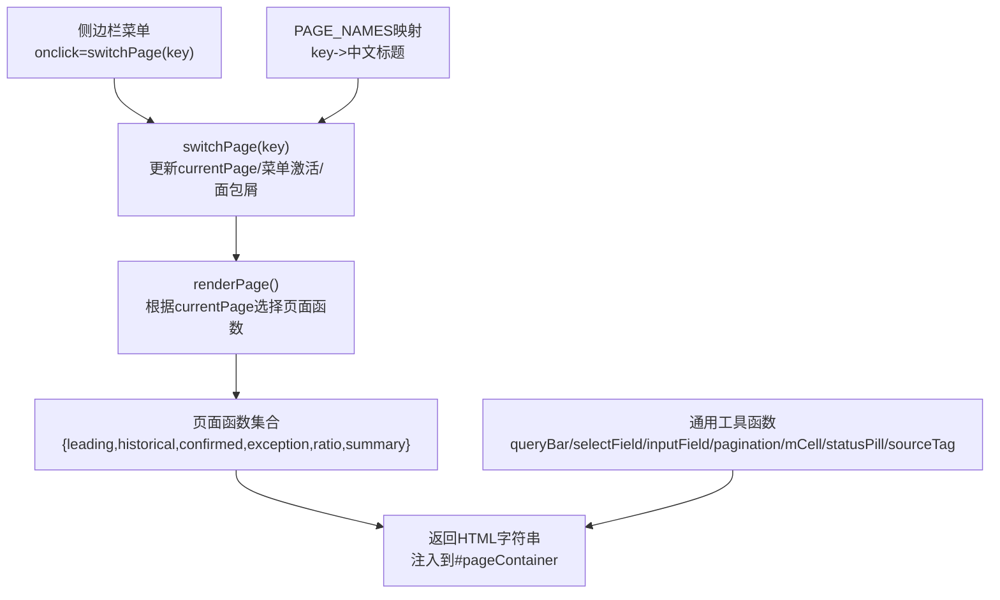
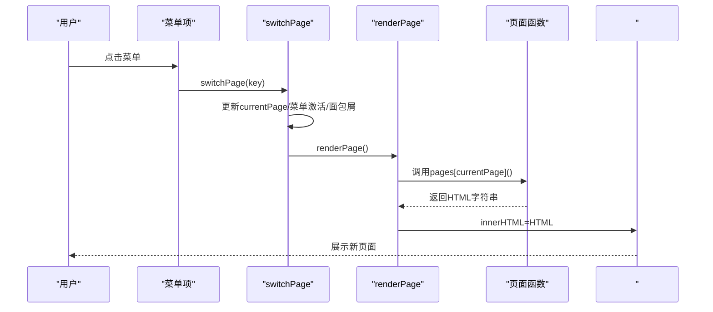
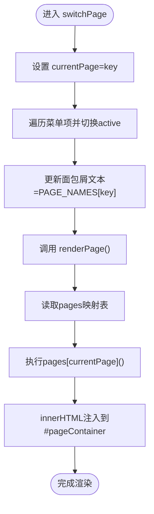
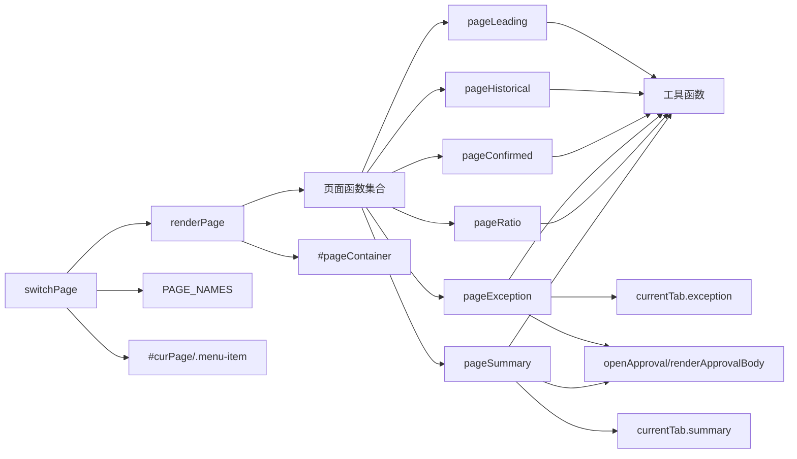

# 页面管理系统

<cite>
**本文档中引用的文件**   
- [sales-forecast-prototype.html](file://sales-forecast-prototype.html)
- [sales-forecast-prototype_副本.html](file://sales-forecast-prototype_副本.html)
</cite>

## 目录
1. [简介](#简介)
2. [项目结构](#项目结构)
3. [核心组件](#核心组件)
4. [架构总览](#架构总览)
5. [详细组件分析](#详细组件分析)
6. [依赖关系分析](#依赖关系分析)
7. [性能考量](#性能考量)
8. [故障排查指南](#故障排查指南)
9. [结论](#结论)
10. [附录：扩展与自定义开发指南](#附录扩展与自定义开发指南)

## 简介
本文件面向销售预测原型系统的“页面管理系统”，聚焦以下目标：
- 解释 switchPage 函数如何实现页面路由切换、菜单激活状态管理与面包屑导航更新
- 说明 renderPage 函数的渲染逻辑，包括页面映射表与动态内容生成
- 阐述 6 个核心页面函数（pageLeading、pageHistorical、pageConfirmed、pageException、pageRatio、pageSummary）的职责分工与数据绑定模式
- 提供页面扩展机制与自定义页面开发指南

该系统采用单页应用（SPA）风格，通过 JavaScript 动态渲染页面内容，结合统一的查询栏、表格、分页、弹窗等通用组件，实现高保真原型交互。

## 项目结构
- 入口文件为 HTML，内嵌 CSS 样式与 JavaScript 逻辑
- 侧边栏菜单项通过 onclick 事件触发 switchPage(key)
- 主内容区由 #pageContainer 承载，renderPage() 负责根据当前页面 key 渲染对应页面函数返回的 HTML
- 顶部面包屑区域显示当前页面名称，由 PAGE_NAMES 映射维护
- 全局工具函数封装了表单控件、表格单元格、状态标签、分页、查询栏、弹窗等通用能力

图表来源
- [sales-forecast-prototype.html:283-292](file://sales-forecast-prototype.html#L283-L292)
- [sales-forecast-prototype.html:141-146](file://sales-forecast-prototype.html#L141-L146)
- [sales-forecast-prototype.html:148-182](file://sales-forecast-prototype.html#L148-L182)

章节来源
- [sales-forecast-prototype.html:108-126](file://sales-forecast-prototype.html#L108-L126)
- [sales-forecast-prototype.html:141-146](file://sales-forecast-prototype.html#L141-L146)
- [sales-forecast-prototype.html:283-292](file://sales-forecast-prototype.html#L283-L292)

## 核心组件
- 页面路由与渲染
  - switchPage(key)：设置 currentPage，更新菜单激活态，更新面包屑文本，调用 renderPage()
  - renderPage()：定义 pages 映射表，按 currentPage 调用对应页面函数，拼接 HTML 并注入容器
- 页面映射表
  - {leading: pageLeading, historical: pageHistorical, confirmed: pageConfirmed, exception: pageException, ratio: pageRatio, summary: pageSummary}
- 面包屑与标题映射
  - PAGE_NAMES = {leading:"先行指标预测", historical:"历史销售预测", confirmed:"确定性需求", exception:"例外需求", ratio:"计算比例维护", summary:"销售预测3+9需求汇总"}
- 通用 UI 组件
  - queryBar(fields)：组合查询条件与按钮
  - selectField(label, opts)、inputField(label, ph)：下拉框与输入框
  - pagination(total)：分页条
  - mCell(m, clickable, onClick)：月份对比单元格（修改前/后）
  - statusPill(s)、sourceTag(s)：状态标签与来源标签
  - openModal()/closeModal()：通用弹窗

章节来源
- [sales-forecast-prototype.html:283-292](file://sales-forecast-prototype.html#L283-L292)
- [sales-forecast-prototype.html:141-146](file://sales-forecast-prototype.html#L141-L146)
- [sales-forecast-prototype.html:148-182](file://sales-forecast-prototype.html#L148-L182)

## 架构总览
页面管理系统采用“路由 + 渲染器”的轻量架构：
- 路由层：switchPage 管理当前页面 key 与 UI 状态（菜单、面包屑）
- 渲染层：renderPage 根据 key 查找页面函数，执行并返回 HTML
- 视图层：各页面函数返回模板化 HTML，使用工具函数拼装表格、统计卡片、图表占位、操作栏等
- 交互层：Tab 切换、弹窗、审批流程等通过全局状态 currentTab 与 modal 控制

图表来源
- [sales-forecast-prototype.html:283-292](file://sales-forecast-prototype.html#L283-L292)
- [sales-forecast-prototype.html:108-126](file://sales-forecast-prototype.html#L108-L126)

## 详细组件分析

### 页面路由与渲染（switchPage 与 renderPage）
- switchPage(key)
  - 更新全局 currentPage
  - 遍历 .menu-item，依据索引与 key 列表匹配，切换 active 类
  - 更新 #curPage 文本为 PAGE_NAMES[key]
  - 调用 renderPage()
- renderPage()
  - 定义 pages 映射表，键为 key，值为页面函数引用
  - 获取 pages[currentPage]() 返回的 HTML
  - 包裹在 
 中，写入 #pageContainer

图表来源
- [sales-forecast-prototype.html:283-292](file://sales-forecast-prototype.html#L283-L292)

章节来源
- [sales-forecast-prototype.html:283-292](file://sales-forecast-prototype.html#L283-L292)

### 页面映射表与动态内容生成
- 页面映射表位于 renderPage() 内部，以对象形式声明 key -> 函数引用
- 每个页面函数返回完整的 HTML 片段，包含：
  - 标题 h2
  - 查询栏 queryBar(...)
  - 统计卡片 grid-4/grid-3
  - 图表占位 chart-placeholder
  - 操作栏 action-bar
  - 表格 table-wrap
  - 分页 pagination(...)
- 动态数据通过数组 rows 或常量 excSummRows/regionRows 等驱动，使用 map 拼接行

章节来源
- [sales-forecast-prototype.html:290-292](file://sales-forecast-prototype.html#L290-L292)
- [sales-forecast-prototype.html:295-304](file://sales-forecast-prototype.html#L295-L304)
- [sales-forecast-prototype.html:307-316](file://sales-forecast-prototype.html#L307-L316)
- [sales-forecast-prototype.html:319-328](file://sales-forecast-prototype.html#L319-L328)

### 六个核心页面函数职责与数据绑定模式

#### pageLeading（先行指标预测）
- 职责：展示先行指标（PMI、消费者信心、原材料价格）趋势与权重，支持年份与指标类型筛选，提供导出与生成预测操作
- 数据绑定：rows 数组驱动表格；统计卡片静态值；图表占位用于后续接入图表库
- 交互：查询栏、导出、生成预测按钮

章节来源
- [sales-forecast-prototype.html:295-304](file://sales-forecast-prototype.html#L295-L304)

#### pageHistorical（历史销售预测）
- 职责：对比实际与预测销售额，展示平均准确率、累计金额等统计，支持产品线/年份/准确率筛选
- 数据绑定：rows 数组驱动表格；统计卡片展示关键指标
- 交互：查询栏、导出、执行预测按钮

章节来源
- [sales-forecast-prototype.html:307-316](file://sales-forecast-prototype.html#L307-L316)

#### pageConfirmed（确定性需求）
- 职责：管理已确认与待确认的需求订单，展示数量与金额分布，支持状态/产品线/客户筛选
- 数据绑定：rows 数组驱动表格；统计卡片展示订单数与金额
- 交互：新增需求、导出、查询重置

章节来源
- [sales-forecast-prototype.html:319-328](file://sales-forecast-prototype.html#L319-L328)

#### pageException（例外需求，双 Tab）
- 职责：提供“汇总表”和“明细表”两个 Tab，支持复杂筛选、批量操作、审批提交、撤回、废弃、编辑、删除、导入/导出
- 数据绑定：
  - 汇总表：excSummRows 数组，使用 mkM([...],[...]) 生成月份对比列
  - 明细表：excDetailRows 数组，字段丰富，含审批状态、时间戳、运输信息等
- 交互：
  - Tab 切换通过 currentTab.exception 控制
  - 打开新增弹窗、提交审批弹窗、查看/编辑/删除等操作
  - 统计卡片按审批状态分组计数

章节来源
- [sales-forecast-prototype.html:331-365](file://sales-forecast-prototype.html#L331-L365)

#### pageRatio（计算比例维护）
- 职责：维护不同区域/国家维度下的预测比例（M、M1、M2~M4、M5~M6、M7~M12），支持启用/停用、查看详情、编辑、删除
- 数据绑定：ratioRows 数组驱动表格，状态 pill 展示启用/停用
- 交互：新增弹窗（含比例输入）、禁用状态下编辑/删除不可用，启用/停用切换

章节来源
- [sales-forecast-prototype.html:368-382](file://sales-forecast-prototype.html#L368-L382)

#### pageSummary（销售预测3+9需求汇总，四 Tab）
- 职责：提供四个维度的汇总与明细：大区、国区、国家、明细表；支持跨层级钻取（查看详情）
- 数据绑定：
  - regionRows/zoneRows/countryRows 分别驱动三个汇总 Tab
  - summaryDetailRows 驱动明细表，包含版本、单据号、审批单号、来源类型、需求类型、区域信息、产品、数量变化、物流、贸易术语、客户、时间戳、审批状态等
- 交互：
  - Tab 切换通过 currentTab.summary 控制
  - 发布、提交审批、撤回、废弃、删除、导出
  - 状态流转提示（草稿→审批中→已通过/已驳回/已撤回；已驳回/已撤回→废弃→已废弃）
  - 国家维度下月份单元格可点击，弹出该月明细弹窗

章节来源
- [sales-forecast-prototype.html:385-453](file://sales-forecast-prototype.html#L385-L453)

### 审批弹窗与附件上传
- openApproval(source)：初始化审批上下文（来源、一级/二级/三级审批人、理由、附件）
- renderApprovalBody()：动态渲染审批人选择、附件列表与限制提示
- addApprover/removeApprover：添加/移除审批人，去重校验
- handleFiles：限制最多 3 个附件，单个不超过 30MB，支持多格式
- submitApproval：校验必填项，生成审批单号，提示成功并关闭弹窗

章节来源
- [sales-forecast-prototype.html:185-280](file://sales-forecast-prototype.html#L185-L280)

## 依赖关系分析
- switchPage 依赖：
  - PAGE_NAMES 映射（用于面包屑）
  - DOM 元素 #curPage 与 .menu-item
  - renderPage
- renderPage 依赖：
  - pages 映射表（页面函数集合）
  - #pageContainer 容器
- 页面函数依赖：
  - 工具函数：queryBar、selectField、inputField、pagination、mCell、statusPill、sourceTag
  - 全局状态：currentTab（用于 Tab 页面）
  - 数据数组：rows、excSummRows、excDetailRows、ratioRows、regionRows、zoneRows、countryRows、summaryDetailRows
- 弹窗与审批依赖：
  - #modal、#approvalModal
  - approvalContext 上下文对象

图表来源
- [sales-forecast-prototype.html:283-292](file://sales-forecast-prototype.html#L283-L292)
- [sales-forecast-prototype.html:141-146](file://sales-forecast-prototype.html#L141-L146)
- [sales-forecast-prototype.html:148-182](file://sales-forecast-prototype.html#L148-L182)
- [sales-forecast-prototype.html:185-280](file://sales-forecast-prototype.html#L185-L280)

章节来源
- [sales-forecast-prototype.html:283-292](file://sales-forecast-prototype.html#L283-L292)
- [sales-forecast-prototype.html:141-146](file://sales-forecast-prototype.html#L141-L146)
- [sales-forecast-prototype.html:148-182](file://sales-forecast-prototype.html#L148-L182)
- [sales-forecast-prototype.html:185-280](file://sales-forecast-prototype.html#L185-L280)

## 性能考量
- 渲染策略：每次切换页面都重新 innerHTML 渲染整个页面，简单直观但可能在大表格场景下造成重绘开销
- 建议优化：
  - 对大表格进行虚拟滚动或分页加载
  - 将静态模板抽离为字符串常量，减少重复拼接
  - 对频繁更新的局部（如 Tab 切换）仅替换子节点而非整页重建
  - 图表占位处延迟加载真实图表库，避免首屏阻塞

[本节为通用指导，不直接分析具体文件]

## 故障排查指南
- 面包屑未更新
  - 检查 PAGE_NAMES 是否包含当前 key
  - 确认 #curPage 元素存在且未被覆盖
- 菜单激活状态异常
  - 检查 .menu-item 顺序是否与 switchPage 中的 key 列表一致
  - 确认 active 类切换逻辑正确
- 页面未渲染或空白
  - 检查 #pageContainer 是否存在
  - 确认 renderPage 中的 pages 映射包含当前 key
  - 检查页面函数是否返回有效 HTML
- Tab 切换无效
  - 确认 currentTab 对象键名与页面函数中使用的键一致
  - 检查 Tab 按钮的 onclick 是否正确更新 currentTab 并调用 renderPage
- 审批弹窗无法提交
  - 检查必填项校验逻辑（申请理由、一级审批人）
  - 确认附件数量与大小限制处理正常

章节来源
- [sales-forecast-prototype.html:283-292](file://sales-forecast-prototype.html#L283-L292)
- [sales-forecast-prototype.html:185-280](file://sales-forecast-prototype.html#L185-L280)

## 结论
该页面管理系统以简洁的路由与渲染机制为核心，配合丰富的通用组件与数据绑定模式，实现了高保真原型的快速迭代与演示。通过明确的页面函数职责划分与可扩展的映射表设计，系统具备良好的扩展性，便于新增页面与功能模块。

[本节为总结，不直接分析具体文件]

## 附录：扩展与自定义开发指南

### 新增页面步骤
- 定义页面函数
  - 在文件中新增一个函数，例如 pageNewPage()，返回完整 HTML 片段
- 注册到页面映射表
  - 在 renderPage() 的 pages 映射中添加键值对，如 newPage: pageNewPage
- 配置面包屑标题
  - 在 PAGE_NAMES 中添加 newPage: "新页面名称"
- 添加菜单项
  - 在侧边栏菜单组中新增 menu-item，onclick="switchPage('newPage')"
- 初始化默认页面（可选）
  - 如需默认进入新页面，调整 currentPage 初始值

### 数据绑定模式建议
- 使用数组驱动表格：rows.map(...) 拼接行
- 使用 mkM([...],[...]) 生成月份对比列（修改前/后）
- 使用 statusPill 与 sourceTag 统一状态与来源标签样式
- 使用 queryBar、selectField、inputField 构建查询条件
- 使用 pagination 统一分页样式

### 交互与弹窗
- 使用 openModal/closeModal 管理通用弹窗
- 对于复杂交互（如审批），使用 openApproval 系列函数管理上下文与渲染
- Tab 页面通过 currentTab 对象维护状态，并在 Tab 按钮中更新状态后调用 renderPage

### 注意事项
- 保持页面函数返回的 HTML 结构与现有样式类一致，确保 UI 一致性
- 谨慎修改 DOM 选择器（如 #pageContainer、#curPage），避免破坏现有逻辑
- 若引入外部库（如图表），建议在图表占位区域按需加载，避免影响首屏性能

章节来源
- [sales-forecast-prototype.html:283-292](file://sales-forecast-prototype.html#L283-L292)
- [sales-forecast-prototype.html:141-146](file://sales-forecast-prototype.html#L141-L146)
- [sales-forecast-prototype.html:148-182](file://sales-forecast-prototype.html#L148-L182)
- [sales-forecast-prototype.html:185-280](file://sales-forecast-prototype.html#L185-L280)