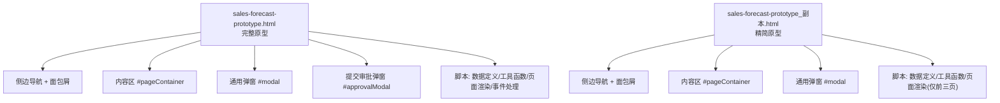
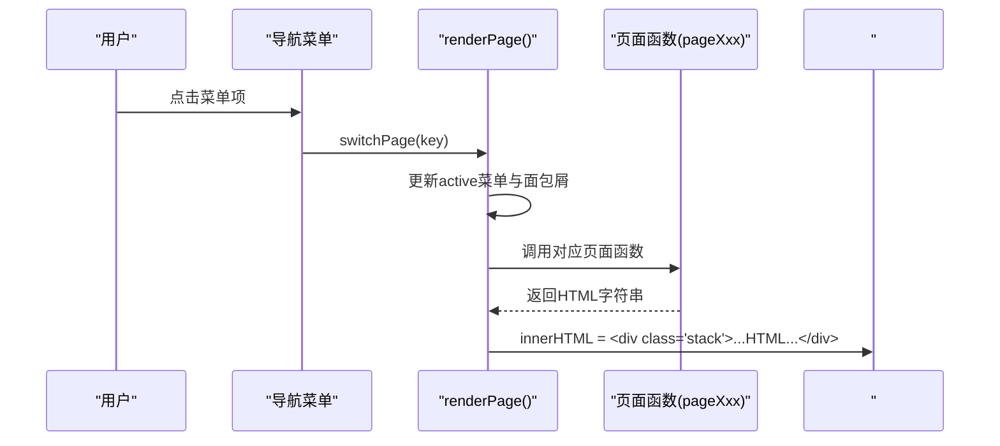
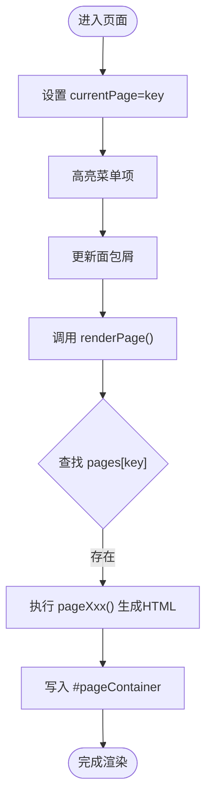
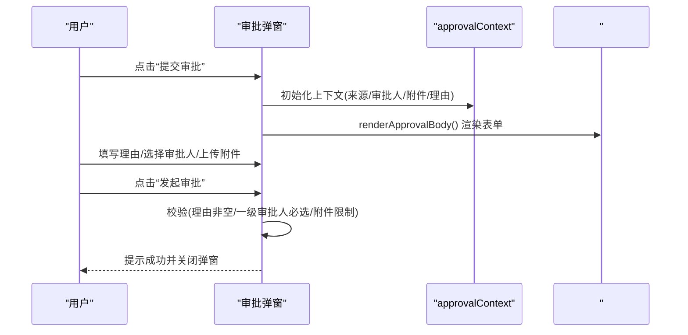
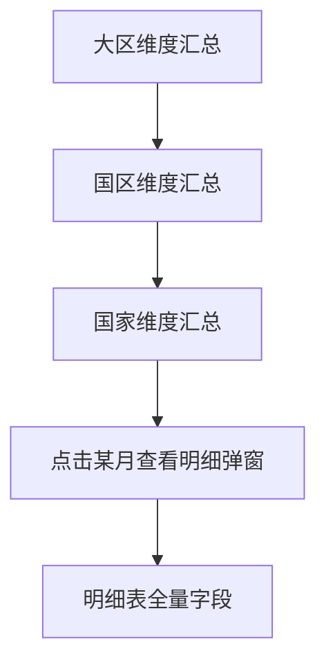
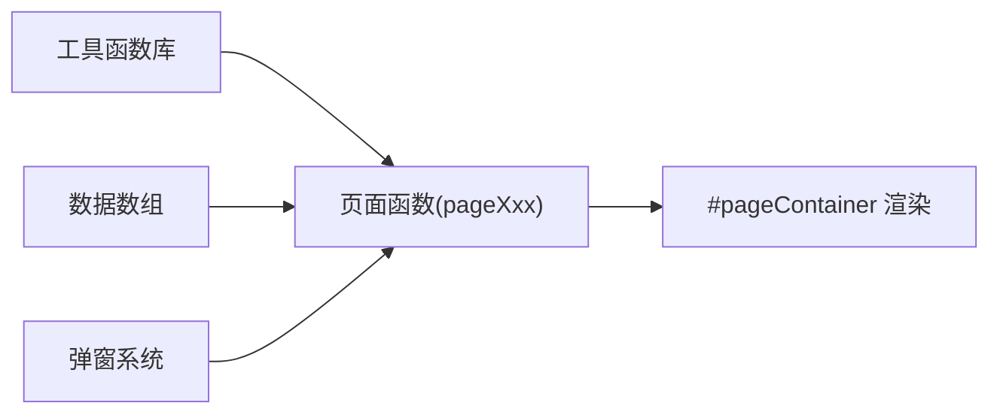

# 代码结构说明

<cite>
**本文引用的文件**   
- [sales-forecast-prototype.html](file://sales-forecast-prototype.html)
- [sales-forecast-prototype_副本.html](file://sales-forecast-prototype_副本.html)
</cite>

## 目录
1. [简介](#简介)
2. [项目结构](#项目结构)
3. [核心组件](#核心组件)
4. [架构总览](#架构总览)
5. [详细组件分析](#详细组件分析)
6. [依赖关系分析](#依赖关系分析)
7. [性能考量](#性能考量)
8. [故障排查指南](#故障排查指南)
9. [结论](#结论)
10. [附录：命名约定与规范建议](#附录：命名约定与规范建议)

## 简介
本文件面向“销售预测原型”的前端实现，系统性梳理其代码结构与组织方式，重点解释：
- HTML模板的语义化标记结构
- CSS样式规范与组织方式
- JavaScript模块化设计与函数职责划分
- 页面管理系统、工具函数库、模态弹窗系统、数据管理层的设计模式
- 命名约定、代码规范与最佳实践建议
- 代码文件映射关系与组件依赖图

该原型采用单页应用（SPA）风格，所有逻辑集中在一个HTML文件中，通过内联CSS与内嵌JS实现。整体以“页面函数+渲染器”的模式驱动视图更新，辅以通用UI组件（表格、分页、查询栏、标签/状态胶囊等）和统一的弹窗系统。

## 项目结构
仓库包含两个HTML文件：
- sales-forecast-prototype.html：完整功能版本，包含全部页面与审批弹窗、附件上传等交互
- sales-forecast-prototype_副本.html：精简版，仅包含前三个页面（先行指标预测、历史销售预测、确定性需求），不含例外需求后续页面与审批弹窗

图表来源
- [sales-forecast-prototype.html:108-140](file://sales-forecast-prototype.html#L108-L140)
- [sales-forecast-prototype_副本.html:113-136](file://sales-forecast-prototype_副本.html#L113-L136)

章节来源
- [sales-forecast-prototype.html:1-140](file://sales-forecast-prototype.html#L1-L140)
- [sales-forecast-prototype_副本.html:1-136](file://sales-forecast-prototype_副本.html#L1-L136)

## 核心组件
- 布局与导航
  - 左侧导航菜单项绑定 switchPage(key) 切换当前页面，并更新面包屑标题
  - 主内容区由 #pageContainer 承载，每次渲染时清空并注入新HTML片段
- 通用UI组件
  - 卡片、统计卡片、按钮、表单控件、表格、分页、查询栏、标签/状态胶囊、Tab切换
  - 月份单元格 mCell 支持“修改前/后”对比展示，可点击触发详情弹窗
- 弹窗系统
  - 通用弹窗 openModal/closeModal
  - 提交审批弹窗 openApproval/closeApproval，含多级审批人选择、附件上传、校验与提交
- 页面渲染器
  - pageLeading/pageHistorical/pageConfirmed/pageException/pageRatio/pageSummary 分别返回对应页面的HTML字符串
- 数据层
  - 常量与静态数据：M_LABELS、PAGE_NAMES、SCM_USERS、各页面数据数组
  - 工具函数：mkM、statusPill、sourceTag、pagination、queryBar、selectField、inputField

章节来源
- [sales-forecast-prototype.html:141-292](file://sales-forecast-prototype.html#L141-L292)
- [sales-forecast-prototype.html:294-453](file://sales-forecast-prototype.html#L294-L453)
- [sales-forecast-prototype_副本.html:137-225](file://sales-forecast-prototype_副本.html#L137-L225)

## 架构总览
整体为“单文件SPA”架构：HTML负责骨架与样式，JS负责数据与渲染。页面切换与渲染流程如下：

图表来源
- [sales-forecast-prototype.html:282-292](file://sales-forecast-prototype.html#L282-L292)
- [sales-forecast-prototype_副本.html:178-188](file://sales-forecast-prototype_副本.html#L178-L188)

## 详细组件分析

### 页面管理系统
- 设计模式
  - 路由表映射：currentPage -> pageXxx 函数
  - 渲染器集中：renderPage() 统一组装HTML并注入容器
- 关键职责
  - 维护当前页面与Tab状态（currentTab.exception/currentTab.summary）
  - 根据key动态渲染不同页面内容
- 扩展性
  - 新增页面只需添加键值映射与对应pageXxx函数

图表来源
- [sales-forecast-prototype.html:282-292](file://sales-forecast-prototype.html#L282-L292)
- [sales-forecast-prototype_副本.html:178-188](file://sales-forecast-prototype_副本.html#L178-L188)

章节来源
- [sales-forecast-prototype.html:282-292](file://sales-forecast-prototype.html#L282-L292)
- [sales-forecast-prototype_副本.html:178-188](file://sales-forecast-prototype_副本.html#L178-L188)

### 工具函数库
- DOM与渲染辅助
  - $(s)：querySelector封装
  - mkM(b,a)：生成“修改前后”月份单元格数据对
  - mCell(m,clickable,onClick)：渲染月份单元格，支持差异高亮与点击
- UI组件生成
  - statusPill(s)：状态胶囊（已通过/审批中/草稿/已驳回/已撤回/已废弃）
  - sourceTag(s)：数据来源标签（确定性需求/例外需求/历史销售预测）
  - pagination(total)：分页控件
  - queryBar(fields)、selectField(label,opts)、inputField(label,ph)：查询栏与表单字段
- 弹窗控制
  - openModal(title,body,footer)、closeModal()

章节来源
- [sales-forecast-prototype.html:148-183](file://sales-forecast-prototype.html#L148-L183)
- [sales-forecast-prototype_副本.html:142-176](file://sales-forecast-prototype_副本.html#L142-L176)

### 模态弹窗系统
- 通用弹窗
  - 通过openModal传入标题、主体HTML与底部按钮，自动显示遮罩与内容
- 提交审批弹窗
  - 上下文对象 approvalContext 管理申请理由、三级审批人选择、附件列表
  - 渲染审批体 renderApprovalBody() 动态生成审批人选择、附件列表与操作按钮
  - 校验规则：必填申请理由、至少选择一个一级审批人；附件数量限制与大小限制
  - 提交 submitApproval() 生成审批单号并提示成功

图表来源
- [sales-forecast-prototype.html:184-280](file://sales-forecast-prototype.html#L184-L280)

章节来源
- [sales-forecast-prototype.html:184-280](file://sales-forecast-prototype.html#L184-L280)

### 数据管理层
- 数据结构
  - 月份标签 M_LABELS：用于多列时间维度展示
  - 页面名称 PAGE_NAMES：用于面包屑标题映射
  - 审批人名单 SCM_USERS：下拉选择候选
  - 各页面数据数组：如 excSummRows、excDetailRows、regionRows、zoneRows、countryRows、summaryDetailRows、ratioRows
- 数据与视图分离
  - 数据数组与渲染函数解耦，便于替换或扩展
- 变更对比
  - 使用 mkM(before[], after[]) 生成“修改前/后”对比数据，配合 mCell 渲染差异

章节来源
- [sales-forecast-prototype.html:141-147](file://sales-forecast-prototype.html#L141-L147)
- [sales-forecast-prototype.html:331-411](file://sales-forecast-prototype.html#L331-L411)
- [sales-forecast-prototype_副本.html:231-244](file://sales-forecast-prototype_副本.html#L231-L244)

### 页面组件详解

#### 先行指标预测
- 功能要点
  - 查询栏：年份、指标类型
  - 统计卡片：PMI指数、消费者信心指数、原材料价格指数、综合趋势
  - 图表占位：折线图
  - 数据表格：月份、PMI、CCI、RPI、趋势、权重
  - 操作：导出、生成预测
- 交互
  - 无复杂交互，主要为展示与导出

章节来源
- [sales-forecast-prototype.html:294-304](file://sales-forecast-prototype.html#L294-L304)
- [sales-forecast-prototype_副本.html:190-200](file://sales-forecast-prototype_副本.html#L190-L200)

#### 历史销售预测
- 功能要点
  - 查询栏：产品线、年份、准确率
  - 统计卡片：平均预测准确率、累计实际销售额、累计预测销售额
  - 图表占位：柱状图对比
  - 数据表格：月份、3个月实际、9个月预测、合计、同比增长
  - 操作：导出、执行预测

章节来源
- [sales-forecast-prototype.html:306-316](file://sales-forecast-prototype.html#L306-L316)
- [sales-forecast-prototype_副本.html:202-212](file://sales-forecast-prototype_副本.html#L202-L212)

#### 确定性需求
- 功能要点
  - 查询栏：状态、产品线、客户名称
  - 统计卡片：已确认订单数、待确认订单数、总需求数量、预计交付金额
  - 图表占位：堆叠柱状图
  - 数据表格：单据号、客户、产品、数量、金额、交付日期、状态
  - 操作：新增需求、导出

章节来源
- [sales-forecast-prototype.html:318-328](file://sales-forecast-prototype.html#L318-L328)
- [sales-forecast-prototype_副本.html:214-224](file://sales-forecast-prototype_副本.html#L214-L224)

#### 例外需求（双Tab）
- Tab结构
  - 汇总表：展示区域/国家/机型/产品等多维度的月度数据（仅展示部分月份，其余用省略）
  - 明细表：展示单据行级详细信息，含审批状态、编辑/删除权限控制
- 交互
  - 汇总→明细跳转
  - 明细表支持新增、提交审批、撤回、废弃、编辑、删除、导入、下载模板
  - 状态统计卡片：草稿、审批中、已通过、已驳回、已撤回、总计
  - 行内操作按钮根据审批状态动态启用/禁用

章节来源
- [sales-forecast-prototype.html:330-365](file://sales-forecast-prototype.html#L330-L365)
- [sales-forecast-prototype_副本.html:230-266](file://sales-forecast-prototype_副本.html#L230-L266)

#### 计算比例维护
- 功能要点
  - 查询栏：作战区域、国区、状态
  - 数据表格：序号、区域编码/名称、国区编码/名称、大区编码/名称、国家编码/名称、各时间段比例、创建时间、状态、操作
  - 操作：新增、删除、查看详情、编辑、停用/启用、导出

章节来源
- [sales-forecast-prototype.html:367-382](file://sales-forecast-prototype.html#L367-L382)

#### 销售预测3+9需求汇总（四Tab）
- Tab结构
  - 大区维度：按大区聚合的多月数据
  - 国区维度：按国区聚合的多月数据
  - 国家维度：按国家聚合的多月数据，支持点击某月查看明细弹窗
  - 明细表：全量字段展示，含版本号、单据号、审批单号、数据来源、需求类型、区域/国家信息、产品配置、数量对比、价格金额、运输贸易条款、客户信息、时间戳、审批状态、操作
- 交互
  - 层级钻取：大区→国区→国家→明细
  - 操作：发布、提交审批、撤回、废弃、删除、导出
  - 状态流转提示：草稿→提交审批→审批中→已通过/已驳回/已撤回 | 已驳回/已撤回→废弃→已废弃

章节来源
- [sales-forecast-prototype.html:384-453](file://sales-forecast-prototype.html#L384-L453)

### 概念总览
以下流程图展示了“3+9需求汇总”从汇总到明细的钻取路径，帮助理解数据层次与交互顺序：

（此图为概念示意，不直接映射具体源码）

## 依赖关系分析
- 模块耦合
  - 页面函数依赖工具函数（mCell、statusPill、sourceTag、pagination、queryBar等）
  - 页面函数依赖数据数组（excSummRows、excDetailRows、regionRows、zoneRows、countryRows、summaryDetailRows、ratioRows）
  - 弹窗系统独立于页面，但被多处调用（新增、提交审批、查看详情）
- 外部依赖
  - 无第三方库，纯原生HTML/CSS/JS实现
- 循环依赖
  - 未发现循环引用，页面函数之间通过 currentTab 状态切换，避免直接互相调用

图表来源
- [sales-forecast-prototype.html:148-183](file://sales-forecast-prototype.html#L148-L183)
- [sales-forecast-prototype.html:294-453](file://sales-forecast-prototype.html#L294-L453)

章节来源
- [sales-forecast-prototype.html:141-453](file://sales-forecast-prototype.html#L141-L453)

## 性能考量
- 渲染策略
  - 使用 innerHTML 批量注入，减少多次DOM操作开销
  - 表格数据量大时，建议分页加载与虚拟滚动（当前为前端静态分页）
- 样式与布局
  - 使用CSS Grid/Flex布局，避免复杂嵌套导致的重排
  - 表格列较多时使用横向滚动，避免换行影响可读性
- 交互优化
  - 弹窗内容按需渲染，避免一次性生成过多节点
  - 附件上传限制数量与大小，防止内存占用过高

[本节为通用指导，无需源码引用]

## 故障排查指南
- 常见问题
  - 页面未渲染：检查 currentPage 是否匹配 pages 映射，确保 renderPage() 被调用
  - 弹窗不显示：确认 modal 或 approvalModal 的 show 类是否正确添加
  - 审批提交失败：检查申请理由是否为空、一级审批人是否至少选择一个、附件数量是否超过限制
  - 表格错位：检查最小宽度样式与列头对齐，必要时调整 td/th 的 padding 与 white-space
- 调试建议
  - 在浏览器控制台打印 approvalContext 与相关数据数组，确认数据完整性
  - 使用开发者工具检查DOM结构，确认类名与ID是否正确

章节来源
- [sales-forecast-prototype.html:184-280](file://sales-forecast-prototype.html#L184-L280)
- [sales-forecast-prototype.html:282-292](file://sales-forecast-prototype.html#L282-L292)

## 结论
该销售预测原型采用简洁的单文件SPA架构，通过“页面函数+渲染器”的模式实现了清晰的职责分离与良好的可扩展性。工具函数库与弹窗系统提供了稳定的UI基础能力，数据层与视图层解耦便于后续演进。建议在后续迭代中引入模块化拆分、状态管理与异步数据加载，以提升可维护性与性能。

[本节为总结，无需源码引用]

## 附录：命名约定与规范建议
- HTML
  - 语义化标签：nav、main、header、section、table、thead、tbody、th、td
  - ID命名：页面容器 #pageContainer、弹窗 #modal、#approvalModal
  - 类名：BEM风格或短横线分隔，如 .menu-item、.card-header、.action-bar
- CSS
  - 颜色体系：主题色 #1890ff，成功 #52c41a，警告 #faad14，危险 #ff4d4f
  - 字体与字号：统一使用系统字体栈，正文14px，小字12px/11px
  - 间距与圆角：统一使用8px圆角，卡片阴影轻微
- JS
  - 变量命名：驼峰式，如 currentPage、currentTab、approvalContext
  - 函数命名：动词开头，如 switchPage、renderPage、openModal、submitApproval
  - 常量命名：大写蛇形，如 M_LABELS、PAGE_NAMES、SCM_USERS
- 最佳实践
  - 将重复的HTML片段抽取为函数返回字符串，保持DRY原则
  - 避免在HTML中嵌入过多内联样式，尽量复用CSS类
  - 对敏感操作（删除、废弃）增加二次确认
  - 表单输入进行前端校验，提升用户体验

[本节为规范建议，无需源码引用]