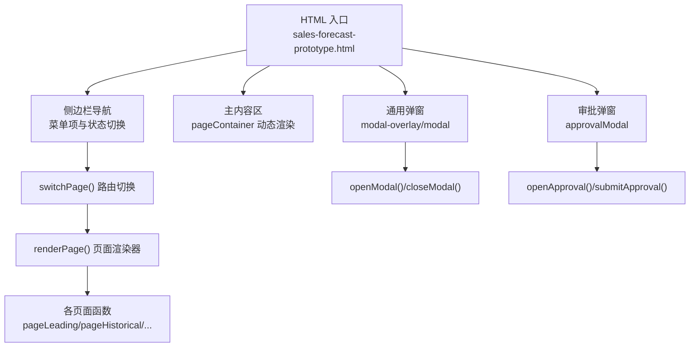
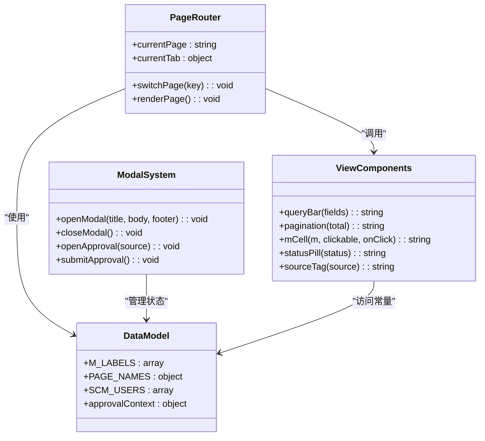
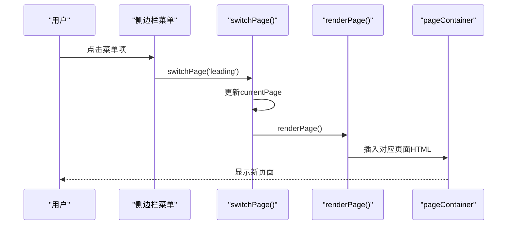
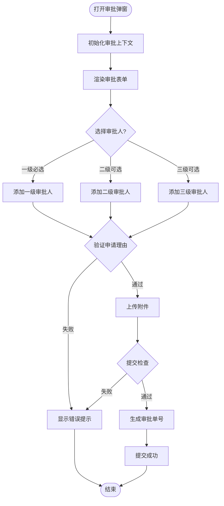
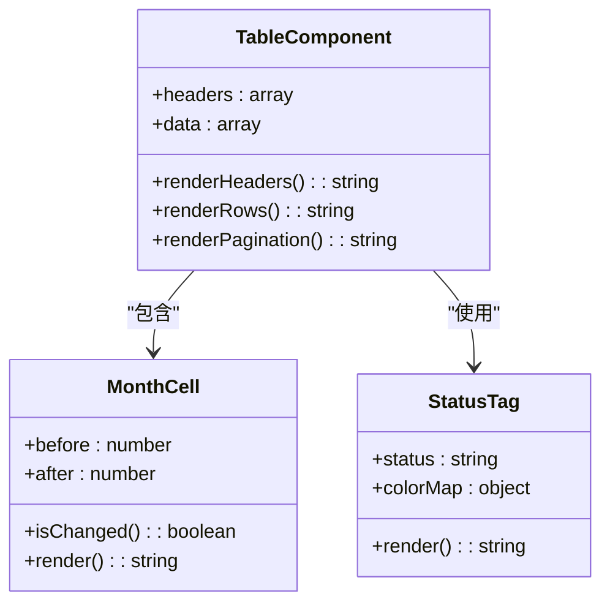
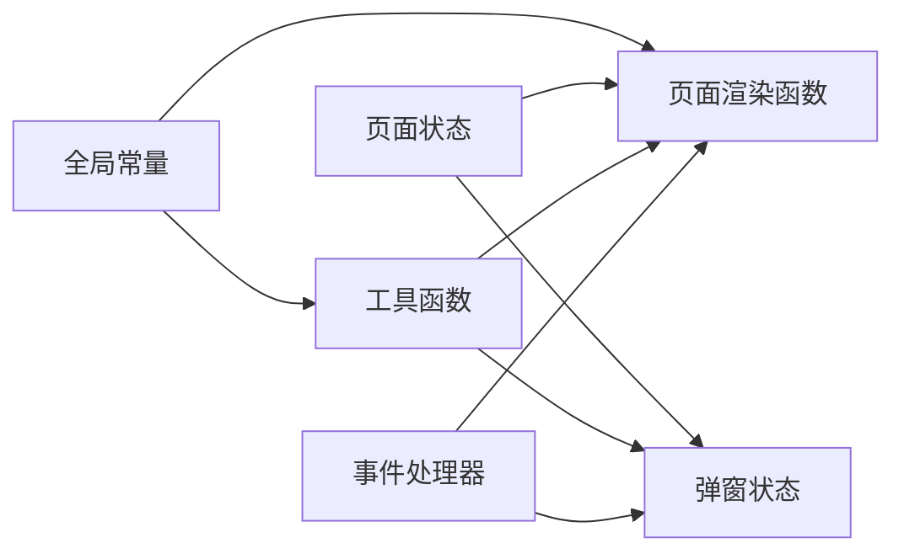

# 开发指南

<cite>
**本文档中引用的文件**   
- [sales-forecast-prototype.html](file://sales-forecast-prototype.html)
- [sales-forecast-prototype_副本.html](file://sales-forecast-prototype_副本.html)
</cite>

## 目录
1. [简介](#简介)
2. [项目结构](#项目结构)
3. [核心组件](#核心组件)
4. [架构总览](#架构总览)
5. [详细组件分析](#详细组件分析)
6. [依赖关系分析](#依赖关系分析)
7. [性能与可维护性建议](#性能与可维护性建议)
8. [扩展开发步骤指南](#扩展开发步骤指南)
9. [代码规范与命名约定](#代码规范与命名约定)
10. [调试技巧与常见问题排查](#调试技巧与常见问题排查)
11. [从原型到生产环境的迁移建议](#从原型到生产环境的迁移建议)
12. [结论](#结论)

## 简介
本指南面向销售预测原型的开发者，提供从代码结构、样式规范、JavaScript模块化设计到扩展开发的完整说明。原型采用单页应用（SPA）模式，通过内联CSS与原生JavaScript实现页面渲染、交互与弹窗流程，包含先行指标预测、历史销售预测、确定性需求、例外需求、计算比例维护以及“3+9”需求汇总等模块。

## 项目结构
当前仓库为单文件原型，包含两个HTML文件：
- sales-forecast-prototype.html：完整版原型，包含全部页面与审批弹窗逻辑
- sales-forecast-prototype_副本.html：精简版原型，仅包含部分页面与基础交互

整体结构特点：
- 单一入口HTML文件，内嵌样式与脚本
- 侧边栏导航 + 主内容区布局
- 多页面通过JS动态渲染，无路由库
- 通用弹窗与审批弹窗复用同一套UI组件

**图表来源** 
- [sales-forecast-prototype.html:108-126](file://sales-forecast-prototype.html#L108-L126)
- [sales-forecast-prototype.html:283-292](file://sales-forecast-prototype.html#L283-L292)

**章节来源**
- [sales-forecast-prototype.html:1-126](file://sales-forecast-prototype.html#L1-L126)
- [sales-forecast-prototype_副本.html:1-133](file://sales-forecast-prototype_副本.html#L1-L133)

## 核心组件
原型包含以下核心组件：

### 布局组件
- **侧边栏导航**：固定宽度240px，深色主题，包含Logo和菜单组
- **头部面包屑**：显示当前页面路径
- **主内容区**：flex布局，自适应高度

### UI组件
- **卡片组件**：白色背景，圆角边框，阴影效果
- **统计卡片**：展示关键指标数据
- **表格组件**：支持横向滚动，粘性表头
- **按钮组件**：多种样式（primary/danger/link/disabled）
- **表单组件**：输入框、下拉选择、文本域
- **标签组件**：tag/pill样式，用于状态标识

### 交互组件
- **分页组件**：支持每页条数选择和页码导航
- **查询栏**：组合多个筛选条件
- **模态弹窗**：通用弹窗和专用审批弹窗
- **Tab切换**：双Tab和多Tab切换机制

**章节来源**
- [sales-forecast-prototype.html:6-105](file://sales-forecast-prototype.html#L6-L105)
- [sales-forecast-prototype.html:128-139](file://sales-forecast-prototype.html#L128-L139)

## 架构总览
原型采用经典的MVC简化模式：
- **Model**：静态数据定义（M_LABELS、PAGE_NAMES、各类数据数组）
- **View**：HTML模板字符串拼接
- **Controller**：事件处理函数和页面渲染逻辑

**图表来源** 
- [sales-forecast-prototype.html:141-146](file://sales-forecast-prototype.html#L141-L146)
- [sales-forecast-prototype.html:148-183](file://sales-forecast-prototype.html#L148-L183)
- [sales-forecast-prototype.html:184-281](file://sales-forecast-prototype.html#L184-L281)

## 详细组件分析

### 页面路由系统
页面切换通过switchPage函数实现，支持6个主要页面：
- leading：先行指标预测
- historical：历史销售预测  
- confirmed：确定性需求
- exception：例外需求（双Tab）
- ratio：计算比例维护
- summary：销售预测3+9需求汇总（四Tab）

**图表来源** 
- [sales-forecast-prototype.html:283-292](file://sales-forecast-prototype.html#L283-L292)

**章节来源**
- [sales-forecast-prototype.html:283-292](file://sales-forecast-prototype.html#L283-L292)

### 审批弹窗系统
审批弹窗是复杂交互的核心，支持三级审批人选择和附件上传：

**图表来源** 
- [sales-forecast-prototype.html:184-281](file://sales-forecast-prototype.html#L184-L281)

**章节来源**
- [sales-forecast-prototype.html:184-281](file://sales-forecast-prototype.html#L184-L281)

### 数据表格组件
表格组件支持大量字段展示，包括月份数据对比、状态标签、操作按钮等：

**图表来源** 
- [sales-forecast-prototype.html:150-156](file://sales-forecast-prototype.html#L150-L156)
- [sales-forecast-prototype.html:157-166](file://sales-forecast-prototype.html#L157-L166)

**章节来源**
- [sales-forecast-prototype.html:345-365](file://sales-forecast-prototype.html#L345-L365)
- [sales-forecast-prototype.html:412-453](file://sales-forecast-prototype.html#L412-L453)

## 依赖关系分析
原型内部依赖关系相对简单，主要通过全局变量和函数进行通信：

**图表来源** 
- [sales-forecast-prototype.html:141-146](file://sales-forecast-prototype.html#L141-L146)

**章节来源**
- [sales-forecast-prototype.html:141-146](file://sales-forecast-prototype.html#L141-L146)

## 性能与可维护性建议
### 性能优化
1. **DOM操作优化**：减少频繁的innerHTML赋值，考虑使用DocumentFragment
2. **事件委托**：为大量表格行绑定事件时使用事件委托
3. **虚拟滚动**：大数据表格考虑实现虚拟滚动
4. **图片懒加载**：图表占位符可以考虑延迟加载

### 代码重构建议
1. **模块化拆分**：将CSS、JS分离到独立文件
2. **组件化**：提取可复用的UI组件
3. **状态管理**：引入简单的状态管理机制
4. **错误处理**：增加统一的错误处理机制

## 扩展开发步骤指南

### 添加新页面
1. **在侧边栏添加菜单项**：
   - 在menu-group中添加新的menu-item
   - 设置onclick事件调用switchPage函数

2. **创建页面渲染函数**：
   - 在script中添加新的pageXxx()函数
   - 返回该页面的HTML模板字符串

3. **注册页面路由**：
   - 在renderPage函数的pages对象中添加映射

4. **更新页面名称映射**：
   - 在PAGE_NAMES对象中添加新页面名称

### 新增功能模块
1. **定义数据结构**：
   - 在顶部常量区域添加新的数据模型
   - 定义相关的工具函数

2. **创建UI组件**：
   - 在CSS中添加相应的样式类
   - 在HTML模板中使用新组件

3. **实现交互逻辑**：
   - 编写事件处理函数
   - 处理用户输入和数据验证

4. **集成到现有页面**：
   - 在相关页面中调用新功能
   - 确保状态同步和数据传递

### 修改现有组件
1. **定位组件代码**：
   - 在HTML中找到对应的组件定义
   - 在CSS中找到相关样式规则

2. **修改样式**：
   - 调整CSS属性值
   - 添加新的样式类

3. **更新交互逻辑**：
   - 修改JavaScript函数
   - 处理新的业务逻辑

4. **测试验证**：
   - 在不同浏览器中测试
   - 验证响应式布局

### 集成第三方库
1. **选择合适的库**：
   - 评估库的功能和体积
   - 确认兼容性要求

2. **引入库文件**：
   - 在head标签中添加link或script标签
   - 配置CDN或本地路径

3. **初始化配置**：
   - 在页面加载后初始化库
   - 设置必要的配置选项

4. **封装接口**：
   - 创建统一的API接口
   - 处理错误和异常情况

**章节来源**
- [sales-forecast-prototype.html:111-121](file://sales-forecast-prototype.html#L111-L121)
- [sales-forecast-prototype.html:283-292](file://sales-forecast-prototype.html#L283-L292)

## 代码规范与命名约定

### HTML结构规范
- 使用语义化标签：header、nav、main、section等
- 合理的嵌套层级，避免过深的DOM结构
- 保持适当的缩进和对齐

### CSS命名约定
- 使用BEM命名法：block__element--modifier
- 组件类名使用描述性名称：card-header、btn-primary
- 布局类名简洁明了：grid-2、row、stack

### JavaScript编码规范
- 函数命名：动词开头，如switchPage、renderPage
- 变量命名：驼峰命名法，如currentPage、approvalContext
- 常量命名：全大写加下划线，如M_LABELS、PAGE_NAMES

### 注释规范
- 重要函数添加JSDoc注释
- 复杂逻辑添加行内注释
- 保持注释的及时更新

## 调试技巧与常见问题排查

### 调试技巧
1. **控制台调试**：
   - 使用console.log输出关键变量
   - 利用断点调试复杂逻辑

2. **网络请求监控**：
   - 查看Network面板的请求情况
   - 检查API响应数据和状态码

3. **性能分析**：
   - 使用Performance面板分析渲染性能
   - 检查内存使用情况

4. **移动端调试**：
   - 使用Chrome DevTools模拟移动设备
   - 测试响应式布局效果

### 常见问题排查
1. **页面不显示**：
   - 检查DOM元素是否存在
   - 验证CSS类名是否正确
   - 确认JavaScript没有语法错误

2. **交互失效**：
   - 检查事件监听器是否正确绑定
   - 验证函数作用域和this指向
   - 确认数据状态是否正确更新

3. **样式错乱**：
   - 检查CSS优先级冲突
   - 验证媒体查询是否正确
   - 确认浏览器兼容性

4. **性能问题**：
   - 识别重绘重排操作
   - 优化DOM操作频率
   - 减少不必要的计算

**章节来源**
- [sales-forecast-prototype.html:148-183](file://sales-forecast-prototype.html#L148-L183)

## 从原型到生产环境的迁移建议

### 技术栈升级
1. **前端框架选择**：
   - React/Vue/Angular等现代框架
   - 组件化开发和状态管理

2. **构建工具链**：
   - Webpack/Vite等打包工具
   - TypeScript类型支持
   - ESLint/Prettier代码规范

3. **后端服务搭建**：
   - Node.js/Python/Java等后端语言
   - RESTful API设计
   - 数据库设计和ORM

### 架构重构
1. **前后端分离**：
   - 独立的API服务
   - 跨域配置和安全策略

2. **微服务架构**：
   - 按业务领域拆分服务
   - 服务间通信机制

3. **容器化部署**：
   - Docker镜像构建
   - Kubernetes编排

### 安全加固
1. **身份认证**：
   - JWT令牌管理
   - 权限控制机制

2. **数据安全**：
   - 输入验证和过滤
   - SQL注入防护

3. **网络安全**：
   - HTTPS强制启用
   - CORS策略配置

### 性能优化
1. **代码优化**：
   - Tree Shaking移除无用代码
   - 代码分割和懒加载

2. **缓存策略**：
   - 浏览器缓存配置
   - CDN加速部署

3. **数据库优化**：
   - 索引优化
   - 查询语句优化

### 监控和维护
1. **日志系统**：
   - 统一日志收集
   - 错误追踪和告警

2. **性能监控**：
   - 前端性能指标
   - 后端服务监控

3. **自动化部署**：
   - CI/CD流水线
   - 自动化测试

## 结论
本销售预测原型展示了完整的业务需求和交互逻辑，为后续开发提供了良好的参考。通过遵循本文档的规范和指南，开发者可以高效地扩展功能、优化性能，并最终完成从原型到生产环境的完整迁移。建议在开发过程中持续关注用户体验和系统性能，确保最终产品能够满足实际业务需求。