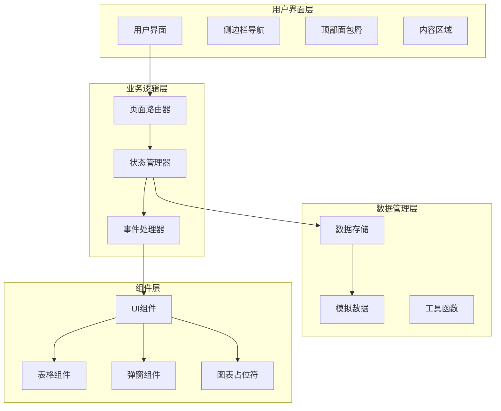
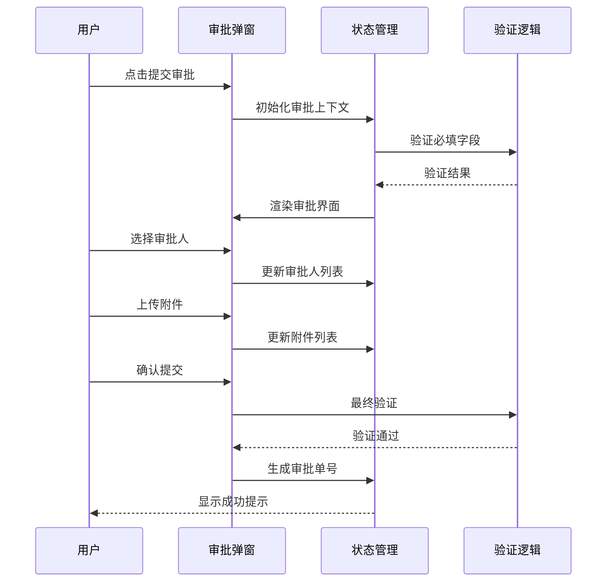

# 扩展开发指南

<cite>
**本文档引用的文件**
- [sales-forecast-prototype.html](file://sales-forecast-prototype.html)
- [sales-forecast-prototype_副本.html](file://sales-forecast-prototype_副本.html)
</cite>

## 目录
1. [项目概述](#项目概述)
2. [系统架构](#系统架构)
3. [核心组件分析](#核心组件分析)
4. [页面注册机制](#页面注册机制)
5. [路由配置详解](#路由配置详解)
6. [数据模型扩展](#数据模型扩展)
7. [UI组件复用](#ui组件复用)
8. [状态管理](#状态管理)
9. [事件绑定与数据处理](#事件绑定与数据处理)
10. [第三方库集成](#第三方库集成)
11. [调试技巧](#调试技巧)
12. [性能优化建议](#性能优化建议)
13. [最佳实践](#最佳实践)
14. [故障排除指南](#故障排除指南)

## 项目概述

智能销售预测系统是一个高保真原型应用，采用单文件HTML架构实现，包含六个主要功能模块：先行指标预测、历史销售预测、确定性需求、例外需求、计算比例维护和销售预测3+9需求汇总。该系统提供了完整的销售预测业务流程，支持多维度数据分析、审批流程管理和报表导出功能。

### 技术栈特点
- **前端框架**: 原生JavaScript + HTML5 + CSS3
- **样式方案**: 内联CSS样式，采用现代CSS Grid和Flexbox布局
- **交互模式**: 事件驱动的单页应用(SPA)
- **数据管理**: 内存中的静态数据模拟
- **响应式设计**: 适配不同屏幕尺寸

**章节来源**
- [sales-forecast-prototype.html:1-459](file://sales-forecast-prototype.html#L1-L459)

## 系统架构

该系统采用经典的前后端分离架构的简化版本，所有逻辑都集中在单个HTML文件中。整体架构分为以下几个层次：



**架构图来源**
- [sales-forecast-prototype.html:140-292](file://sales-forecast-prototype.html#L140-L292)

### 架构设计原则
1. **单一职责**: 每个函数负责特定的业务逻辑
2. **数据驱动**: 通过数据变化驱动UI更新
3. **组件化**: 可复用的UI组件和工具函数
4. **事件驱动**: 用户操作通过事件处理机制响应

**章节来源**
- [sales-forecast-prototype.html:140-292](file://sales-forecast-prototype.html#L140-L292)

## 核心组件分析

### 全局工具函数

系统提供了一系列通用的工具函数，用于简化常见的DOM操作和数据转换：

#### DOM操作工具
- `$()` - 简化querySelector选择器
- `openModal()` / `closeModal()` - 通用弹窗控制
- `pagination()` - 分页组件生成
- `queryBar()` - 查询条件栏构建

#### 数据转换工具
- `mkM()` - 月份数据对比格式转换
- `mCell()` - 单元格渲染（支持修改前后对比）
- `statusPill()` - 状态标签渲染
- `sourceTag()` - 数据来源标签

#### 表单组件工具
- `selectField()` - 下拉选择框生成
- `inputField()` - 文本输入框生成

**章节来源**
- [sales-forecast-prototype.html:148-183](file://sales-forecast-prototype.html#L148-L183)

### 审批弹窗组件

系统实现了复杂的三级审批流程，支持多级审批人选择和附件上传：



**流程图来源**
- [sales-forecast-prototype.html:184-280](file://sales-forecast-prototype.html#L184-L280)

**章节来源**
- [sales-forecast-prototype.html:184-280](file://sales-forecast-prototype.html#L184-L280)

## 页面注册机制

系统的页面注册机制采用函数映射的方式，将页面标识符与对应的渲染函数关联：

### 页面注册表
```javascript
const PAGE_NAMES = {
    leading: "先行指标预测",
    historical: "历史销售预测", 
    confirmed: "确定性需求",
    exception: "例外需求",
    ratio: "计算比例维护",
    summary: "销售预测3+9需求汇总"
};

const pages = {
    leading: pageLeading,
    historical: pageHistorical,
    confirmed: pageConfirmed,
    exception: pageException,
    ratio: pageRatio,
    summary: pageSummary
};
```

### 页面切换流程
1. **菜单点击**: 用户点击侧边栏菜单项
2. **状态更新**: 更新当前页面标识符
3. **UI刷新**: 重新渲染页面容器
4. **面包屑更新**: 更新顶部面包屑导航

**章节来源**
- [sales-forecast-prototype.html:282-292](file://sales-forecast-prototype.html#L282-L292)

## 路由配置详解

系统的路由配置相对简单，主要通过函数映射实现页面跳转：

### 路由配置结构
- **键值对映射**: 使用对象字面量定义页面ID到函数的映射
- **默认页面**: 初始页面设置为'leading'（先行指标预测）
- **Tab状态**: 支持页面内的子标签页状态管理

### 路由扩展步骤
1. **添加新页面函数**: 创建新的页面渲染函数
2. **注册到映射表**: 在pages对象中添加新页面的映射
3. **更新菜单**: 在侧边栏添加新的菜单项
4. **配置名称**: 在PAGE_NAMES中添加页面名称

**章节来源**
- [sales-forecast-prototype.html:143-145](file://sales-forecast-prototype.html#L143-L145)
- [sales-forecast-prototype.html:282-292](file://sales-forecast-prototype.html#L282-L292)

## 数据模型扩展

系统的数据模型设计遵循扁平化结构，便于快速渲染和扩展：

### 核心数据结构

#### 月份数据模型
```javascript
// 月份数据格式：{before: 修改前数值, after: 修改后数值}
const monthData = mkM([120, 100, 140], [130, 110, 150]);
```

#### 业务实体模型
- **需求单据**: 包含完整的业务字段（客户、产品、数量、金额等）
- **审批记录**: 支持多级审批流程和状态跟踪
- **预测数据**: 支持多时间维度的预测数据展示

### 数据扩展指南

#### 新增数据字段
1. **定义字段常量**: 在数据模型中定义新字段
2. **更新渲染函数**: 在相关页面的渲染函数中添加字段显示
3. **添加筛选条件**: 在查询栏中添加相应的筛选控件
4. **更新工具函数**: 如有需要，更新相关的工具函数

#### 数据验证规则
- **必填字段验证**: 在提交时进行必填字段检查
- **格式验证**: 对数字、日期等特定格式进行验证
- **业务规则验证**: 根据业务逻辑进行数据合理性检查

**章节来源**
- [sales-forecast-prototype.html:142-146](file://sales-forecast-prototype.html#L142-L146)
- [sales-forecast-prototype.html:331-411](file://sales-forecast-prototype.html#L331-L411)

## UI组件复用

系统提供了丰富的可复用UI组件，确保界面一致性和开发效率：

### 基础组件

#### 统计卡片组件
```html
<div class="card stat">
    <div class="stat-label">统计标签</div>
    <div class="stat-value">数值</div>
    <div class="stat-desc">描述信息</div>
</div>
```

#### 表格组件
- **固定表头**: 支持滚动时表头固定
- **响应式布局**: 横向滚动适应大量列
- **状态标签**: 内置状态颜色标识

#### 按钮组件
- **主按钮**: btn-primary（蓝色）
- **危险按钮**: btn-danger（红色）
- **链接按钮**: btn-link（无背景）
- **禁用状态**: btn-disabled

### 高级组件

#### 模态框组件
- **通用弹窗**: openModal() / closeModal()
- **审批弹窗**: 专门的审批流程弹窗
- **自定义内容**: 支持动态内容注入

#### 查询组件
- **查询栏**: queryBar() 统一查询界面
- **下拉选择**: selectField() 下拉框生成
- **输入框**: inputField() 文本输入框

**章节来源**
- [sales-forecast-prototype.html:29-88](file://sales-forecast-prototype.html#L29-L88)
- [sales-forecast-prototype.html:167-178](file://sales-forecast-prototype.html#L167-L178)

## 状态管理

系统采用简单的全局状态管理模式，适合中小型应用：

### 全局状态变量
```javascript
let currentPage = 'leading'; // 当前页面
let currentTab = {           // 当前标签页
    exception: 'summary',
    summary: 'region'
};
let approvalContext = {      // 审批上下文
    source: '',
    selectedL1: [],
    selectedL2: [],
    selectedL3: [],
    reason: '',
    files: []
};
```

### 状态更新模式
1. **直接赋值**: 对于简单状态，直接修改变量
2. **对象更新**: 对于复杂状态，更新对象的相应属性
3. **UI同步**: 状态变更后立即触发UI重渲染

### 状态持久化建议
- **本地存储**: 使用localStorage保存用户偏好设置
- **URL参数**: 重要状态可通过URL参数传递
- **会话管理**: 敏感数据避免持久化存储

**章节来源**
- [sales-forecast-prototype.html:145-146](file://sales-forecast-prototype.html#L145-L146)

## 事件绑定与数据处理

系统采用内联事件绑定的方式，将事件处理函数直接写在HTML中：

### 事件绑定模式
```html
<!-- 菜单点击事件 -->
<div onclick="switchPage('leading')">菜单项</div>

<!-- 表单输入事件 -->
<input oninput="handleInput(this.value)" />

<!-- 按钮点击事件 -->
<button onclick="handleSubmit()">提交</button>
```

### 数据处理流程
1. **事件捕获**: 用户操作触发事件
2. **数据验证**: 对输入数据进行验证
3. **状态更新**: 更新应用状态
4. **UI渲染**: 重新渲染相关UI组件
5. **反馈提示**: 向用户提供操作反馈

### 错误处理机制
- **输入验证**: 前端数据格式验证
- **业务校验**: 业务规则验证
- **异常捕获**: try-catch包裹关键逻辑
- **用户提示**: 友好的错误提示信息

**章节来源**
- [sales-forecast-prototype.html:113-118](file://sales-forecast-prototype.html#L113-L118)
- [sales-forecast-prototype.html:274-280](file://sales-forecast-prototype.html#L274-L280)

## 第三方库集成

虽然当前原型未使用第三方库，但系统架构支持轻松集成：

### 推荐的第三方库

#### 图表库
- **ECharts**: 强大的数据可视化库
- **Chart.js**: 轻量级图表库
- **D3.js**: 底层数据可视化库

#### UI组件库
- **Ant Design**: 企业级UI设计语言
- **Element UI**: Vue生态的UI组件库
- **Bootstrap**: 流行的前端框架

#### 工具库
- **Lodash**: JavaScript实用工具库
- **Moment.js**: 日期时间处理库
- **Axios**: HTTP请求库

### 集成步骤
1. **引入依赖**: 通过CDN或npm安装所需库
2. **初始化配置**: 配置库的基本选项
3. **封装组件**: 将第三方组件封装为内部组件
4. **事件代理**: 统一管理第三方库的事件

**章节来源**
- [sales-forecast-prototype.html:1-10](file://sales-forecast-prototype.html#L1-L10)

## 调试技巧

### 浏览器开发者工具
1. **控制台调试**: 使用console.log输出调试信息
2. **网络面板**: 监控API请求和响应
3. **元素检查**: 实时查看DOM结构和样式
4. **性能分析**: 分析页面性能和瓶颈

### 代码调试策略
1. **断点调试**: 在关键位置设置断点
2. **日志输出**: 添加详细的日志记录
3. **错误边界**: 捕获并记录运行时错误
4. **单元测试**: 为核心函数编写测试用例

### 常见问题排查
- **页面不显示**: 检查DOM元素是否存在
- **事件不响应**: 验证事件绑定是否正确
- **样式错乱**: 检查CSS优先级和兼容性
- **数据不更新**: 确认状态更新和渲染逻辑

**章节来源**
- [sales-forecast-prototype.html:148-156](file://sales-forecast-prototype.html#L148-L156)

## 性能优化建议

### 渲染优化
1. **虚拟滚动**: 大数据量表格使用虚拟滚动
2. **懒加载**: 按需加载页面内容和组件
3. **防抖节流**: 对频繁触发的事件进行优化
4. **缓存策略**: 合理使用浏览器缓存

### 代码优化
1. **代码分割**: 按功能模块拆分代码
2. **资源压缩**: 压缩CSS、JS和图片资源
3. **CDN加速**: 使用CDN加速静态资源
4. **预加载**: 预加载关键资源

### 内存管理
1. **及时释放**: 及时清理不再使用的对象
2. **事件解绑**: 移除不必要的事件监听器
3. **定时器清理**: 确保定时器被正确清理
4. **大对象处理**: 避免长时间持有大对象引用

**章节来源**
- [sales-forecast-prototype.html:354-364](file://sales-forecast-prototype.html#L354-L364)

## 最佳实践

### 代码组织规范
1. **命名约定**: 使用清晰的变量和函数命名
2. **模块化**: 按功能模块组织代码结构
3. **注释规范**: 为复杂逻辑添加详细注释
4. **错误处理**: 完善的错误处理和用户提示

### 用户体验优化
1. **加载状态**: 显示适当的加载指示器
2. **操作反馈**: 对用户操作提供即时反馈
3. **错误提示**: 友好的错误信息和解决建议
4. **键盘支持**: 支持键盘快捷键操作

### 数据安全考虑
1. **输入验证**: 前后端双重数据验证
2. **权限控制**: 基于角色的访问控制
3. **敏感信息**: 避免在前端存储敏感数据
4. **XSS防护**: 对用户输入进行转义处理

**章节来源**
- [sales-forecast-prototype.html:179-182](file://sales-forecast-prototype.html#L179-L182)

## 故障排除指南

### 常见问题及解决方案

#### 页面渲染问题
**问题**: 页面无法显示或显示不完整
**解决方案**:
1. 检查DOM元素是否正确创建
2. 验证CSS类名是否匹配
3. 确认JavaScript语法正确性
4. 检查浏览器兼容性

#### 事件响应问题
**问题**: 按钮点击无响应或事件执行错误
**解决方案**:
1. 检查事件绑定是否正确
2. 验证事件处理函数是否存在
3. 确认事件冒泡是否正常
4. 检查是否有其他事件干扰

#### 数据更新问题
**问题**: 数据变更后UI未更新
**解决方案**:
1. 确认状态变量已正确更新
2. 检查渲染函数是否被调用
3. 验证数据绑定逻辑
4. 确认DOM操作是否正确

#### 样式显示问题
**问题**: 样式错乱或样式不生效
**解决方案**:
1. 检查CSS选择器优先级
2. 验证CSS类名拼写
3. 确认样式文件加载顺序
4. 检查浏览器开发者工具的样式面板

### 调试工具推荐
1. **浏览器开发者工具**: F12打开，包含控制台、网络、元素等面板
2. **Vue DevTools**: 如果使用Vue框架，可使用专用调试工具
3. **React Developer Tools**: React应用的专用调试工具
4. **Performance Profiler**: 性能分析和优化工具

**章节来源**
- [sales-forecast-prototype.html:274-280](file://sales-forecast-prototype.html#L274-L280)

## 结论

智能销售预测系统原型展示了现代Web应用的核心架构模式和开发实践。通过本指南，开发者可以：

1. **理解系统架构**: 掌握单文件应用的组织方式和组件化思想
2. **扩展新功能**: 按照标准流程添加新页面和功能模块
3. **优化性能**: 应用性能优化技巧和最佳实践
4. **解决问题**: 快速定位和解决常见开发问题

该原型为后续开发真实的生产环境应用奠定了坚实基础，其设计模式和实践经验可直接迁移到更复杂的企业级应用中。