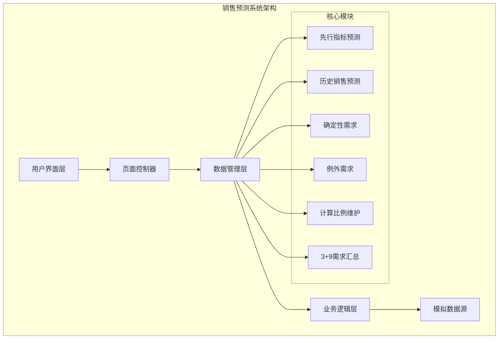
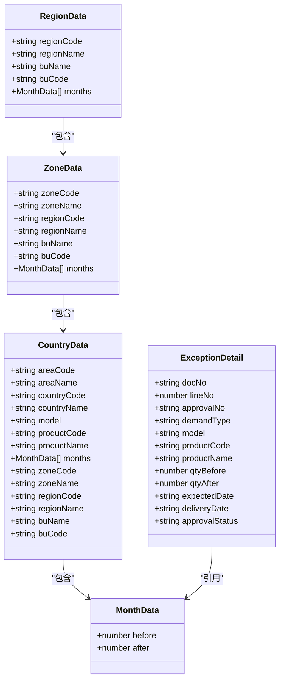
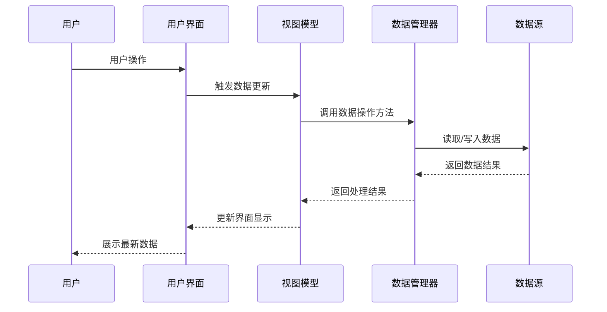
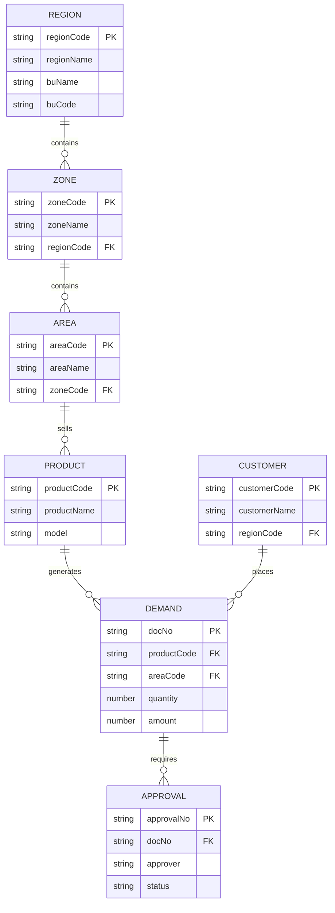

# 数据模型扩展

<cite>
**本文档引用的文件**   
- [sales-forecast-prototype.html](file://sales-forecast-prototype.html)
- [sales-forecast-prototype_副本.html](file://sales-forecast-prototype_副本.html)
</cite>

## 目录
1. [项目概述](#项目概述)
2. [数据模型架构](#数据模型架构)
3. [核心数据结构](#核心数据结构)
4. [模拟数据定义格式](#模拟数据定义格式)
5. [字段类型规范](#字段类型规范)
6. [验证规则](#验证规则)
7. [数据流转机制](#数据流转机制)
8. [状态管理](#状态管理)
9. [持久化策略](#持久化策略)
10. [新增业务实体实现](#新增业务实体实现)
11. [关联关系设计](#关联关系设计)
12. [数据迁移方案](#数据迁移方案)
13. [数据完整性检查](#数据完整性检查)
14. [错误处理机制](#错误处理机制)
15. [性能优化建议](#性能优化建议)

## 项目概述

智能销售预测系统是一个高保真原型，用于展示销售预测、需求管理和审批流程的完整业务流程。该系统包含六个主要功能模块：先行指标预测、历史销售预测、确定性需求、例外需求、计算比例维护和3+9需求汇总。



**图表来源**
- [sales-forecast-prototype.html:140-459](file://sales-forecast-prototype.html#L140-L459)

**章节来源**
- [sales-forecast-prototype.html:1-459](file://sales-forecast-prototype.html#L1-459)

## 数据模型架构

系统采用分层数据架构，支持多维度数据聚合和灵活的查询能力。核心数据模型包括区域维度、产品维度和时间序列三个主要层次。



**图表来源**
- [sales-forecast-prototype.html:331-411](file://sales-forecast-prototype.html#L331-L411)

**章节来源**
- [sales-forecast-prototype.html:331-411](file://sales-forecast-prototype.html#L331-L411)

## 核心数据结构

系统定义了多个核心数据结构，每个结构都有明确的职责和数据约束。

### 月份数据模型
月份数据是系统的核心数据结构，用于表示时间序列数据的修改前后对比。

| 字段名 | 类型 | 描述 | 约束 |
|--------|------|------|------|
| before | number | 修改前的数值 | 非负整数 |
| after | number | 修改后的数值 | 非负整数 |

### 区域层级数据模型
系统支持三级区域层级：大区→国区→作战区域，每级都包含相应的编码和名称信息。

| 层级 | 编码字段 | 名称字段 | 业务单元 |
|------|----------|----------|----------|
| 大区 | regionCode | regionName | buName, buCode |
| 国区 | zoneCode | zoneName | regionCode, regionName |
| 作战区域 | areaCode | areaName | zoneCode, zoneName |

**章节来源**
- [sales-forecast-prototype.html:385-403](file://sales-forecast-prototype.html#L385-L403)

## 模拟数据定义格式

系统使用JavaScript对象数组作为模拟数据源，支持复杂的数据结构和嵌套关系。

### 基础数据格式
```javascript
// 示例：地区数据
const regionRows = [
  {
    regionCode: "R001",
    regionName: "华东大区",
    model: "A系列",
    productCode: "P1001", 
    productName: "智能终端A1",
    months: mkM([320,280,350,...], [340,300,370,...]),
    buName: "电子事业部",
    buCode: "BU01"
  }
];
```

### 时间序列数据格式
时间序列数据通过`mkM`函数生成，包含修改前后的对比值。

| 时间维度 | 说明 | 示例值 |
|----------|------|--------|
| M月 | 当前月 | 基准数据 |
| M+1到M+12 | 未来12个月 | 预测数据 |

**章节来源**
- [sales-forecast-prototype.html:142-146](file://sales-forecast-prototype.html#L142-L146)
- [sales-forecast-prototype.html:385-392](file://sales-forecast-prototype.html#L385-L392)

## 字段类型规范

系统定义了严格的字段类型规范，确保数据的一致性和可维护性。

### 标识符字段
所有标识符字段遵循统一的命名规范和长度限制。

| 字段类型 | 前缀 | 长度 | 示例 |
|----------|------|------|------|
| 区域编码 | R/ZA/OA | 固定长度 | R001, Z001, OA01 |
| 产品编码 | P | 固定长度 | P1001, P2001 |
| 单据号 | DN/EX-DN | 可变长度 | DN-001, EX-DN-0158 |
| 审批单号 | AP | 固定长度 | AP-0085 |

### 数值字段
数值字段根据业务场景定义不同的精度和范围。

| 字段类型 | 精度 | 范围 | 用途 |
|----------|------|------|------|
| 数量 | 整数 | ≥0 | 产品数量、订单数量 |
| 金额 | 两位小数 | ≥0 | 单价、总金额 |
| 百分比 | 一位小数 | 0-100 | 比例、权重 |
| 指数 | 一位小数 | 任意 | PMI、消费者信心指数 |

### 日期时间字段
日期时间字段统一使用ISO 8601格式。

| 字段类型 | 格式 | 示例 | 说明 |
|----------|------|------|------|
| 日期 | YYYY-MM-DD | 2026-04-15 | 交付日期、创建日期 |
| 时间戳 | YYYY-MM-DD HH:mm | 2026-03-01 09:00 | 创建时间、修改时间 |

**章节来源**
- [sales-forecast-prototype.html:337-344](file://sales-forecast-prototype.html#L337-L344)
- [sales-forecast-prototype.html:404-411](file://sales-forecast-prototype.html#L404-L411)

## 验证规则

系统实现了多层级的数据验证机制，确保数据质量和业务规则的正确执行。

### 前端验证规则
```javascript
// 必填字段验证
function validateRequiredFields(data, requiredFields) {
  return requiredFields.every(field => data[field] !== undefined && data[field] !== '');
}

// 数值范围验证
function validateNumericRange(value, min, max) {
  return typeof value === 'number' && value >= min && value <= max;
}

// 日期格式验证
function validateDateFormat(dateStr) {
  const regex = /^\d{4}-\d{2}-\d{2}$/;
  return regex.test(dateStr);
}
```

### 业务规则验证
- 修改后数量必须为非负数
- 总金额 = 单价 × 数量
- 审批状态必须符合状态流转规则
- 关联数据必须存在且有效

**章节来源**
- [sales-forecast-prototype.html:274-280](file://sales-forecast-prototype.html#L274-L280)

## 数据流转机制

系统采用单向数据流架构，确保数据变更的可追溯性和一致性。



**图表来源**
- [sales-forecast-prototype.html:282-292](file://sales-forecast-prototype.html#L282-L292)

### 数据更新流程
1. **用户交互**：用户在界面上进行数据编辑或操作
2. **数据验证**：前端对输入数据进行实时验证
3. **状态更新**：更新内存中的状态对象
4. **界面重渲染**：根据新状态重新渲染相关组件
5. **数据持久化**：将变更同步到持久化存储

**章节来源**
- [sales-forecast-prototype.html:282-292](file://sales-forecast-prototype.html#L282-L292)

## 状态管理

系统采用集中式状态管理模式，所有业务状态都存储在单一的状态树中。

### 全局状态结构
```javascript
let currentPage = 'leading'; // 当前页面
let currentTab = {           // 当前标签页
  exception: 'summary',      // 例外需求标签
  summary: 'region'          // 3+9汇总标签
};
let approvalContext = {      // 审批上下文
  source: '',                // 数据来源
  selectedL1: [],            // 一级审批人
  selectedL2: [],            // 二级审批人  
  selectedL3: [],            // 三级审批人
  reason: '',                // 申请理由
  files: []                  // 附件列表
};
```

### 状态更新模式
- **不可变更新**：每次更新都创建新的状态对象
- **批量更新**：相关状态的原子性更新
- **撤销重做**：支持操作历史的保存和恢复

**章节来源**
- [sales-forecast-prototype.html:144-146](file://sales-forecast-prototype.html#L144-L146)

## 持久化策略

虽然当前原型主要使用内存存储，但系统设计支持多种持久化策略。

### 存储策略选择
| 策略 | 适用场景 | 优点 | 缺点 |
|------|----------|------|------|
| 内存存储 | 原型演示、临时数据 | 访问速度快 | 数据不持久 |
| LocalStorage | 用户偏好设置 | 浏览器原生支持 | 容量有限 |
| IndexedDB | 大量结构化数据 | 容量大、性能好 | API复杂 |
| 后端API | 生产环境 | 数据共享、安全 | 网络依赖 |

### 数据同步机制
- **乐观更新**：先更新界面，再异步同步到后端
- **冲突解决**：基于时间戳的版本控制
- **增量同步**：只同步变更的数据片段

**章节来源**
- [sales-forecast-prototype.html:140-146](file://sales-forecast-prototype.html#L140-L146)

## 新增业务实体实现

当需要添加新的业务实体时，应遵循以下实现模式：

### 实体定义模板
```javascript
// 1. 定义实体数据结构
const newEntityTemplate = {
  id: '',              // 唯一标识
  name: '',            // 名称
  code: '',            // 编码
  status: 'draft',     // 状态
  createTime: '',      // 创建时间
  updateTime: '',      // 更新时间
  creator: '',         // 创建人
  modifier: ''         // 修改人
};

// 2. 定义数据验证规则
const validationRules = {
  id: { required: true, pattern: /^[A-Z0-9]+$/ },
  name: { required: true, maxLength: 100 },
  code: { required: true, unique: true },
  status: { enum: ['draft', 'active', 'inactive'] }
};

// 3. 定义CRUD操作方法
const entityOperations = {
  create: (data) => { /* 创建逻辑 */ },
  update: (id, data) => { /* 更新逻辑 */ },
  delete: (id) => { /* 删除逻辑 */ },
  query: (filters) => { /* 查询逻辑 */ }
};
```

### 集成步骤
1. **数据模型定义**：在相应位置添加新的数据结构
2. **验证规则配置**：定义字段验证和业务规则
3. **UI组件开发**：创建对应的表单和表格组件
4. **业务逻辑实现**：实现CRUD操作和业务流程
5. **测试用例编写**：编写单元测试和集成测试

**章节来源**
- [sales-forecast-prototype.html:331-344](file://sales-forecast-prototype.html#L331-L344)

## 关联关系设计

系统设计了复杂的关联关系，支持多维度的数据查询和分析。

### 实体关系图


**图表来源**
- [sales-forecast-prototype.html:331-411](file://sales-forecast-prototype.html#L331-L411)

### 关联查询优化
- **预加载策略**：按需加载关联数据，避免N+1查询问题
- **索引优化**：为常用查询字段建立索引
- **缓存机制**：对频繁访问的关联数据进行缓存

**章节来源**
- [sales-forecast-prototype.html:331-411](file://sales-forecast-prototype.html#L331-L411)

## 数据迁移方案

系统支持版本化的数据迁移，确保数据结构的平滑演进。

### 迁移策略
```javascript
const migrationSchema = {
  version: '1.0.0',
  migrations: [
    {
      fromVersion: '0.9.0',
      toVersion: '1.0.0',
      operations: [
        { type: 'addField', table: 'demand', field: 'approvalStatus' },
        { type: 'modifyField', table: 'product', field: 'model', length: 50 },
        { type: 'createIndex', table: 'demand', index: 'idx_approval_status' }
      ]
    }
  ]
};
```

### 回滚机制
- **事务支持**：所有迁移操作在事务中执行
- **快照备份**：迁移前自动创建数据快照
- **条件回滚**：根据迁移结果决定是否回滚

**章节来源**
- [sales-forecast-prototype.html:404-411](file://sales-forecast-prototype.html#L404-L411)

## 数据完整性检查

系统实现了多层次的数据完整性检查机制。

### 完整性检查类型
| 检查类型 | 检查内容 | 处理方式 |
|----------|----------|----------|
| 域完整性 | 字段值的有效性 | 前端实时验证 |
| 实体完整性 | 主键唯一性 | 数据库约束 |
| 引用完整性 | 外键关联有效性 | 级联操作 |
| 业务完整性 | 业务规则约束 | 业务逻辑验证 |

### 检查执行时机
- **输入时验证**：用户输入时的实时验证
- **提交时验证**：数据提交时的批量验证
- **定时检查**：后台定时任务执行的完整性检查
- **审计检查**：定期进行的全面数据审计

**章节来源**
- [sales-forecast-prototype.html:274-280](file://sales-forecast-prototype.html#L274-L280)

## 错误处理机制

系统采用统一的错误处理策略，确保用户体验的一致性。

### 错误分类
```javascript
const errorTypes = {
  VALIDATION_ERROR: {
    code: 'VALIDATION_ERROR',
    message: '数据验证失败',
    level: 'warning'
  },
  BUSINESS_ERROR: {
    code: 'BUSINESS_ERROR', 
    message: '业务规则违反',
    level: 'error'
  },
  SYSTEM_ERROR: {
    code: 'SYSTEM_ERROR',
    message: '系统内部错误',
    level: 'critical'
  }
};
```

### 错误处理流程
1. **错误捕获**：try-catch块捕获异常
2. **错误分类**：根据错误类型进行分类处理
3. **用户反馈**：向用户提供友好的错误提示
4. **日志记录**：记录详细的错误信息
5. **恢复策略**：尝试自动恢复或降级处理

**章节来源**
- [sales-forecast-prototype.html:274-280](file://sales-forecast-prototype.html#L274-L280)

## 性能优化建议

针对大数据量场景的性能优化策略。

### 前端优化
- **虚拟滚动**：大数据表格的虚拟滚动实现
- **数据分页**：服务端分页减少数据传输
- **懒加载**：按需加载数据和组件
- **缓存策略**：合理使用浏览器缓存

### 数据处理优化
- **批量操作**：合并多次数据库操作
- **索引优化**：为查询频繁的字段建立索引
- **查询优化**：优化SQL查询语句
- **连接池**：复用数据库连接

**章节来源**
- [sales-forecast-prototype.html:167-172](file://sales-forecast-prototype.html#L167-L172)