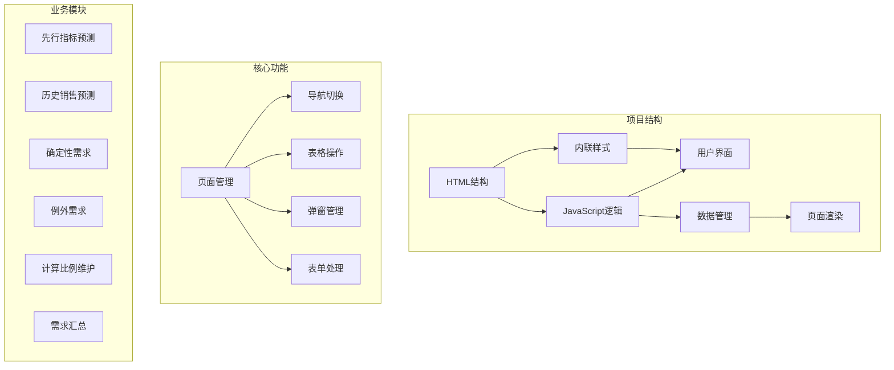
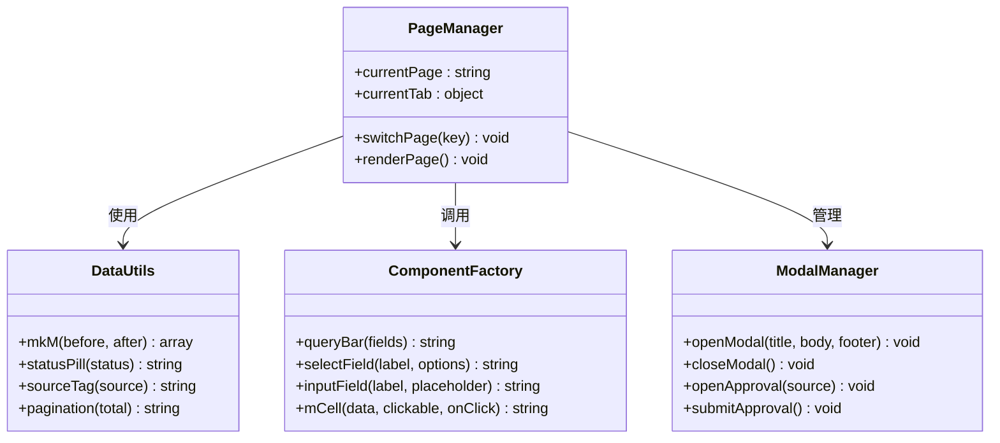
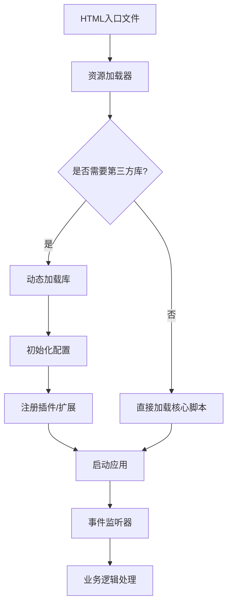
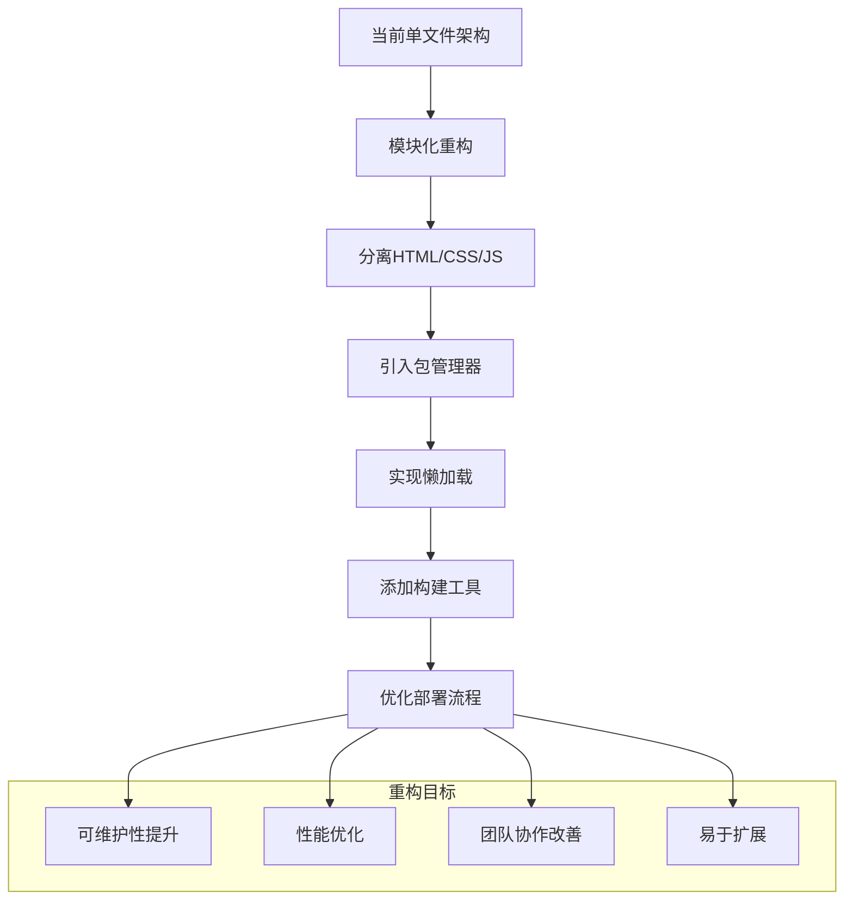

# 第三方库集成

<cite>
**本文档中引用的文件**
- [sales-forecast-prototype.html](file://sales-forecast-prototype.html)
- [sales-forecast-prototype_副本.html](file://sales-forecast-prototype_副本.html)
</cite>

## 目录
1. [项目概述](#项目概述)
2. [当前架构分析](#当前架构分析)
3. [第三方库集成策略](#第三方库集成策略)
4. [CDN引入方式](#cdn引入方式)
5. [模块加载机制](#模块加载机制)
6. [常用库集成指南](#常用库集成指南)
7. [冲突解决策略](#冲突解决策略)
8. [性能优化建议](#性能优化建议)
9. [兼容性处理方案](#兼容性处理方案)
10. [调试技巧和故障排查](#调试技巧和故障排查)
11. [最佳实践总结](#最佳实践总结)

## 项目概述

该项目是一个零依赖的纯前端销售预测系统原型，采用单HTML文件架构，包含完整的UI组件、业务逻辑和数据处理功能。项目具有以下特点：

- **零依赖架构**：完全基于原生JavaScript实现，不依赖任何第三方库
- **模块化设计**：通过函数组织代码，实现页面切换和数据管理
- **响应式布局**：使用CSS Grid和Flexbox实现自适应界面
- **丰富的交互功能**：包含表格操作、弹窗、审批流程等复杂业务逻辑



**图表来源**
- [sales-forecast-prototype.html:1-459](file://sales-forecast-prototype.html#L1-L459)

**章节来源**
- [sales-forecast-prototype.html:1-150](file://sales-forecast-prototype.html#L1-L150)

## 当前架构分析

### 技术栈现状
项目完全基于原生Web技术构建：

- **HTML5**：语义化标签和现代API
- **CSS3**：Flexbox、Grid布局和动画效果
- **JavaScript ES6+**：箭头函数、模板字符串、解构赋值等现代语法
- **DOM API**：直接操作DOM元素进行页面更新

### 代码组织结构



**图表来源**
- [sales-forecast-prototype.html:140-292](file://sales-forecast-prototype.html#L140-L292)

### 现有问题识别
1. **代码耦合度高**：所有逻辑集中在单个文件中
2. **扩展性受限**：添加新功能需要修改主文件
3. **第三方库集成困难**：缺乏模块化管理
4. **性能瓶颈**：大量DOM操作影响渲染性能

**章节来源**
- [sales-forecast-prototype.html:140-459](file://sales-forecast-prototype.html#L140-L459)

## 第三方库集成策略

### 集成原则
在零依赖项目中集成第三方库应遵循以下原则：

1. **最小化依赖**：只引入必要的库和功能
2. **版本锁定**：明确指定库的版本避免兼容性问题
3. **命名空间隔离**：避免全局变量污染
4. **渐进增强**：保持基础功能可用，增强功能可选

### 推荐架构模式



**图表来源**
- [sales-forecast-prototype.html:455-459](file://sales-forecast-prototype.html#L455-L459)

## CDN引入方式

### 基础CDN配置
在HTML头部添加CDN引用是最简单的方式：

```html
<head>
    <!-- 基础样式 -->
    <link rel="stylesheet" href="https://unpkg.com/reset-css@5.0.1/reset.min.css">
    
    <!-- 核心库 -->
    <script src="https://unpkg.com/lodash-es@4.17.21/lodash.min.js"></script>
    <script src="https://unpkg.com/dayjs@1.11.10/dayjs.min.js"></script>
    
    <!-- 图表库 -->
    <script src="https://unpkg.com/echarts@5.4.3/dist/echarts.min.js"></script>
    
    <!-- 加密工具 -->
    <script src="https://unpkg.com/crypto-js@4.1.1/crypto-js.min.js"></script>
</head>
```

### 智能CDN选择策略

| 场景 | 推荐CDN | 优势 | 适用库类型 |
|------|---------|------|-----------|
| 全球访问 | unpkg/jsdelivr | 全球CDN节点，速度快 | 通用库 |
| 国内访问 | bootcdn/staticfile | 国内节点优化 | 国内项目 |
| 企业级 | 自建CDN | 可控性强，安全性高 | 敏感数据 |
| 开发环境 | 本地缓存 | 离线开发，速度快 | 开发调试 |

### CDN降级方案

```javascript
// 智能加载器示例
function loadScript(url, fallbackUrl) {
    const script = document.createElement('script');
    script.src = url;
    script.onerror = function() {
        if (fallbackUrl) {
            script.src = fallbackUrl;
        } else {
            console.warn(`脚本加载失败: ${url}`);
        }
    };
    document.head.appendChild(script);
}

// 使用示例
loadScript(
    'https://unpkg.com/echarts@5.4.3/dist/echarts.min.js',
    './libs/echarts.min.js' // 本地备用
);
```

**章节来源**
- [sales-forecast-prototype.html:1-10](file://sales-forecast-prototype.html#L1-L10)

## 模块加载机制

### 动态导入模式
对于大型项目，推荐使用ES6模块的动态导入：

```javascript
// 按需加载模块
async function loadChartModule() {
    try {
        const echarts = await import('https://unpkg.com/echarts@5.4.3/dist/echarts.esm.min.js');
        return echarts;
    } catch (error) {
        console.error('图表模块加载失败:', error);
        return null;
    }
}

// 使用时调用
async function renderChart(containerId, data) {
    const chart = await loadChartModule();
    if (chart) {
        const instance = chart.init(document.getElementById(containerId));
        instance.setOption({ /* 图表配置 */ });
    }
}
```

### 模块管理器实现

```javascript
class ModuleManager {
    constructor() {
        this.modules = new Map();
        this.dependencies = new Map();
    }
    
    register(name, loader, dependencies = []) {
        this.modules.set(name, loader);
        this.dependencies.set(name, dependencies);
    }
    
    async load(name) {
        if (this.modules.has(name)) {
            const module = await this.modules.get(name)();
            this.modules.set(name, () => module); // 缓存结果
            return module;
        }
        throw new Error(`模块未注册: ${name}`);
    }
    
    async loadAll(names) {
        const modules = [];
        for (const name of names) {
            try {
                modules.push(await this.load(name));
            } catch (error) {
                console.warn(`模块加载失败: ${name}`, error);
            }
        }
        return modules;
    }
}

// 使用示例
const manager = new ModuleManager();
manager.register('echarts', () => import('echarts'));
manager.register('dayjs', () => import('dayjs'));
```

**章节来源**
- [sales-forecast-prototype.html:140-183](file://sales-forecast-prototype.html#L140-L183)

## 常用库集成指南

### 图表库集成（ECharts）

#### 基础配置
```javascript
// 初始化图表实例
function initChart(containerId, option) {
    const chartDom = document.getElementById(containerId);
    const myChart = echarts.init(chartDom);
    myChart.setOption(option);
    
    // 响应式调整
    window.addEventListener('resize', () => {
        myChart.resize();
    });
    
    return myChart;
}

// 销售趋势图配置
const salesTrendOption = {
    title: { text: '销售趋势分析' },
    tooltip: { trigger: 'axis' },
    legend: { data: ['实际销售额', '预测销售额'] },
    xAxis: { type: 'category', data: ['1月', '2月', '3月', '4月', '5月', '6月'] },
    yAxis: { type: 'value' },
    series: [
        { name: '实际销售额', type: 'line', data: [120, 132, 101, 134, 90, 230] },
        { name: '预测销售额', type: 'line', data: [120, 132, 101, 134, 90, 230] }
    ]
};
```

#### 性能优化
```javascript
// 大数据量优化
const bigDataOption = {
    dataset: {
        source: largeDataset // 大数据集
    },
    series: [{
        type: 'line',
        symbol: 'none', // 关闭数据点标记提升性能
        lineStyle: { width: 1 }
    }]
};

// 虚拟滚动支持
function createVirtualScrollChart(containerId, data, itemHeight = 30) {
    const container = document.getElementById(containerId);
    const visibleCount = Math.ceil(container.clientHeight / itemHeight);
    const startIndex = 0;
    const endIndex = Math.min(visibleCount, data.length);
    
    // 只渲染可见区域的数据
    const visibleData = data.slice(startIndex, endIndex);
    return initChart(containerId, { series: [{ data: visibleData }] });
}
```

### 日期处理库（Day.js）

#### 基础用法
```javascript
// 格式化日期
const formattedDate = dayjs().format('YYYY-MM-DD HH:mm:ss');

// 日期计算
const nextMonth = dayjs().add(1, 'month');
const lastWeek = dayjs().subtract(7, 'day');

// 相对时间
const relativeTime = dayjs('2026-03-15').fromNow(); // "2天后"

// 时区处理
const utcTime = dayjs.utc('2026-03-15T10:00:00Z');
const localTime = utcTime.local();
```

#### 插件扩展
```javascript
// 安装插件
dayjs.extend(window.dayjs_plugin_relativeTime);
dayjs.extend(window.dayjs_plugin_locale);

// 中文本地化
dayjs.locale('zh-cn');

// 自定义格式化
dayjs.extend((_, dayjsClass) => {
    dayjsClass.prototype.customFormat = function() {
        return `${this.year()}年${this.month()+1}月`;
    };
});
```

### 加密工具（CryptoJS）

#### 数据加密
```javascript
// AES加密
function encryptData(data, key) {
    const encrypted = CryptoJS.AES.encrypt(JSON.stringify(data), key).toString();
    return encrypted;
}

// AES解密
function decryptData(encryptedData, key) {
    try {
        const bytes = CryptoJS.AES.decrypt(encryptedData, key);
        const decrypted = JSON.parse(bytes.toString(CryptoJS.enc.Utf8));
        return decrypted;
    } catch (error) {
        console.error('解密失败:', error);
        return null;
    }
}

// MD5哈希
function generateHash(data) {
    return CryptoJS.MD5(data).toString();
}

// Base64编码
function encodeBase64(text) {
    return CryptoJS.enc.Base64.stringify(CryptoJS.enc.Utf8.parse(text));
}
```

#### 安全最佳实践
```javascript
// 密钥管理
class KeyManager {
    constructor() {
        this.keys = new Map();
    }
    
    setKey(name, key) {
        this.keys.set(name, btoa(key)); // Base64存储
    }
    
    getKey(name) {
        const encoded = this.keys.get(name);
        return encoded ? atob(encoded) : null;
    }
    
    removeKey(name) {
        this.keys.delete(name);
    }
}

// 数据验证
function validateData(data, schema) {
    const requiredFields = Object.keys(schema);
    const isValid = requiredFields.every(field => 
        data.hasOwnProperty(field) && data[field] !== undefined
    );
    return isValid;
}
```

**章节来源**
- [sales-forecast-prototype.html:148-183](file://sales-forecast-prototype.html#L148-L183)

## 冲突解决策略

### 命名空间隔离

```javascript
// 创建独立命名空间
const AppNamespace = {
    version: '1.0.0',
    utils: {},
    components: {},
    services: {}
};

// 定义全局对象
window.AppNamespace = AppNamespace;

// 在命名空间下添加功能
AppNamespace.utils = {
    formatDate: function(date) {
        return dayjs(date).format('YYYY-MM-DD');
    },
    encrypt: function(data) {
        return CryptoJS.AES.encrypt(JSON.stringify(data), 'key').toString();
    }
};
```

### 版本冲突检测

```javascript
class VersionConflictDetector {
    constructor() {
        this.conflicts = [];
    }
    
    checkLibrary(name, expectedVersion) {
        const globalVar = this.findGlobalVariable(name);
        if (globalVar) {
            const actualVersion = this.extractVersion(globalVar);
            if (actualVersion !== expectedVersion) {
                this.conflicts.push({
                    name,
                    expected: expectedVersion,
                    actual: actualVersion
                });
                console.warn(`版本冲突: ${name} 期望 ${expectedVersion}, 实际 ${actualVersion}`);
            }
        }
    }
    
    findGlobalVariable(name) {
        const parts = name.split('.');
        let obj = window;
        for (const part of parts) {
            if (obj[part]) {
                obj = obj[part];
            } else {
                return null;
            }
        }
        return obj;
    }
    
    extractVersion(obj) {
        return obj.version || obj.VERSION || obj._version || 'unknown';
    }
    
    getConflicts() {
        return this.conflicts;
    }
}

// 使用示例
const detector = new VersionConflictDetector();
detector.checkLibrary('echarts', '5.4.3');
detector.checkLibrary('dayjs', '1.11.10');
```

### 全局变量污染防护

```javascript
// 沙箱环境
function createSandbox() {
    const sandbox = {};
    const originalWindow = window;
    
    Object.defineProperty(window, 'sandbox', {
        value: sandbox,
        writable: true,
        configurable: true
    });
    
    return sandbox;
}

// 安全的函数执行
function safeExecute(code, context = {}) {
    try {
        const fn = new Function('context', `with(context) { ${code} }`);
        return fn(context);
    } catch (error) {
        console.error('代码执行错误:', error);
        return null;
    }
}

// 使用示例
const sandbox = createSandbox();
sandbox.data = { users: [], orders: [] };
safeExecute('data.users.push({id: 1, name: "张三"})', sandbox);
```

**章节来源**
- [sales-forecast-prototype.html:140-147](file://sales-forecast-prototype.html#L140-L147)

## 性能优化建议

### 资源加载优化

```javascript
// 懒加载模块
class LazyLoader {
    constructor() {
        this.loadedModules = new Set();
        this.loadingModules = new Set();
    }
    
    async load(moduleName, url) {
        if (this.loadedModules.has(moduleName)) {
            return this.loadedModules.get(moduleName);
        }
        
        if (this.loadingModules.has(moduleName)) {
            return new Promise((resolve) => {
                const checkLoaded = setInterval(() => {
                    if (this.loadedModules.has(moduleName)) {
                        clearInterval(checkLoaded);
                        resolve(this.loadedModules.get(moduleName));
                    }
                }, 100);
            });
        }
        
        this.loadingModules.add(moduleName);
        
        try {
            const module = await import(url);
            this.loadedModules.set(moduleName, module);
            return module;
        } catch (error) {
            console.error(`模块加载失败: ${moduleName}`, error);
            throw error;
        } finally {
            this.loadingModules.delete(moduleName);
        }
    }
}

// 预加载关键资源
function preloadCriticalResources() {
    const criticalResources = [
        { url: '/css/main.css', type: 'style' },
        { url: '/js/core.js', type: 'script' },
        { url: '/fonts/main.woff2', type: 'font' }
    ];
    
    criticalResources.forEach(resource => {
        const link = document.createElement('link');
        link.rel = 'preload';
        link.as = resource.type;
        link.href = resource.url;
        document.head.appendChild(link);
    });
}
```

### DOM操作优化

```javascript
// 批量DOM更新
function batchUpdateDOM(updates) {
    const fragment = document.createDocumentFragment();
    
    updates.forEach(update => {
        const element = document.createElement(update.tag);
        element.innerHTML = update.content;
        fragment.appendChild(element);
    });
    
    const target = document.getElementById(update.targetId);
    target.innerHTML = '';
    target.appendChild(fragment);
}

// 虚拟列表实现
class VirtualList {
    constructor(container, items, itemHeight) {
        this.container = container;
        this.items = items;
        this.itemHeight = itemHeight;
        this.visibleItems = [];
        this.scrollTop = 0;
        
        this.init();
    }
    
    init() {
        this.container.style.overflow = 'auto';
        this.container.style.height = '400px';
        
        this.container.addEventListener('scroll', () => {
            this.updateVisibleItems();
        });
        
        this.render();
    }
    
    updateVisibleItems() {
        this.scrollTop = this.container.scrollTop;
        const startIndex = Math.floor(this.scrollTop / this.itemHeight);
        const endIndex = Math.min(
            startIndex + Math.ceil(this.container.clientHeight / this.itemHeight) + 1,
            this.items.length
        );
        
        this.visibleItems = this.items.slice(startIndex, endIndex);
        this.render();
    }
    
    render() {
        const html = this.visibleItems.map((item, index) => {
            const absoluteIndex = this.items.indexOf(item);
            return `<div style="height: ${this.itemHeight}px; position: absolute; top: ${absoluteIndex * this.itemHeight}px;">
                ${item.name} - ${item.value}
            </div>`;
        }).join('');
        
        this.container.innerHTML = html;
    }
}
```

### 内存管理

```javascript
// 事件监听器清理
class EventManager {
    constructor() {
        this.listeners = new Map();
    }
    
    addEventListener(element, event, handler, options) {
        const key = `${element.tagName}-${event}-${handler.name}`;
        element.addEventListener(event, handler, options);
        this.listeners.set(key, { element, event, handler, options });
    }
    
    removeAllListeners(element) {
        Array.from(this.listeners.values())
            .filter(listener => listener.element === element)
            .forEach(listener => {
                element.removeEventListener(listener.event, listener.handler, listener.options);
                this.listeners.delete(`${listener.element.tagName}-${listener.event}-${listener.handler.name}`);
            });
    }
    
    cleanup() {
        this.listeners.clear();
    }
}

// 定时器管理
class TimerManager {
    constructor() {
        this.timers = new Set();
    }
    
    setTimeout(callback, delay) {
        const timerId = setTimeout(() => {
            callback();
            this.timers.delete(timerId);
        }, delay);
        this.timers.add(timerId);
        return timerId;
    }
    
    clearTimeout(timerId) {
        clearTimeout(timerId);
        this.timers.delete(timerId);
    }
    
    clearAll() {
        this.timers.forEach(timerId => clearTimeout(timerId));
        this.timers.clear();
    }
}
```

**章节来源**
- [sales-forecast-prototype.html:289-292](file://sales-forecast-prototype.html#L289-L292)

## 兼容性处理方案

### 浏览器特性检测

```javascript
class FeatureDetector {
    static isModernBrowser() {
        return typeof Promise !== 'undefined' && 
               typeof fetch !== 'undefined' &&
               typeof IntersectionObserver !== 'undefined';
    }
    
    static supportsES6() {
        try {
            new Function('let x = 1; const y = 2; return x + y');
            return true;
        } catch (e) {
            return false;
        }
    }
    
    static supportsCanvas() {
        const canvas = document.createElement('canvas');
        return !!(canvas.getContext && canvas.getContext('2d'));
    }
    
    static supportsLocalStorage() {
        try {
            localStorage.setItem('test', 'test');
            localStorage.removeItem('test');
            return true;
        } catch (e) {
            return false;
        }
    }
    
    static getUnsupportedFeatures() {
        const features = [];
        if (!this.isModernBrowser()) features.push('modern-browser');
        if (!this.supportsES6()) features.push('es6');
        if (!this.supportsCanvas()) features.push('canvas');
        if (!this.supportsLocalStorage()) features.push('localstorage');
        return features;
    }
}

// 降级处理
function handleUnsupportedFeatures(features) {
    if (features.includes('es6')) {
        console.warn('检测到不支持ES6的浏览器，将使用降级方案');
        loadPolyfills(['promise', 'fetch', 'arrow-functions']);
    }
    
    if (features.includes('canvas')) {
        console.warn('Canvas不支持，将使用SVG替代方案');
        useSVGFallback();
    }
}
```

### Polyfill注入策略

```javascript
class PolyfillManager {
    constructor() {
        this.polyfills = new Map();
        this.injected = new Set();
    }
    
    register(name, polyfill) {
        this.polyfills.set(name, polyfill);
    }
    
    injectIfNeeded(feature) {
        if (this.injected.has(feature)) return;
        
        const polyfill = this.polyfills.get(feature);
        if (polyfill && !polyfill.isSupported()) {
            polyfill.inject();
            this.injected.add(feature);
            console.log(`已注入polyfill: ${feature}`);
        }
    }
    
    injectAll() {
        this.polyfills.forEach((polyfill, feature) => {
            this.injectIfNeeded(feature);
        });
    }
}

// 使用示例
const polyfillManager = new PolyfillManager();

polyfillManager.register('promise', {
    isSupported: () => typeof Promise !== 'undefined',
    inject: () => {
        const script = document.createElement('script');
        script.src = 'https://cdn.jsdelivr.net/npm/es6-promise@4.2.8/dist/es6-promise.auto.min.js';
        document.head.appendChild(script);
    }
});

polyfillManager.injectAll();
```

### 移动端适配

```javascript
class MobileAdapter {
    static isMobile() {
        return /Android|webOS|iPhone|iPad|iPod|BlackBerry|IEMobile|Opera Mini/i.test(navigator.userAgent);
    }
    
    static getTouchSupport() {
        return 'ontouchstart' in window || navigator.maxTouchPoints > 0;
    }
    
    static adaptForMobile() {
        if (this.isMobile()) {
            document.body.classList.add('mobile');
            
            // 禁用不必要的动画
            document.querySelectorAll('.animate-on-hover').forEach(el => {
                el.classList.remove('animate-on-hover');
            });
            
            // 优化触摸体验
            this.optimizeTouchEvents();
        }
    }
    
    static optimizeTouchEvents() {
        // 移除hover效果
        document.querySelectorAll(':hover').forEach(el => {
            el.classList.remove(':hover');
        });
        
        // 添加触摸反馈
        document.querySelectorAll('.btn, .menu-item').forEach(el => {
            el.addEventListener('touchstart', function() {
                this.classList.add('touch-active');
            });
            el.addEventListener('touchend', function() {
                this.classList.remove('touch-active');
            });
        });
    }
}

// 响应式断点管理
class ResponsiveBreakpoints {
    constructor() {
        this.breakpoints = {
            mobile: 768,
            tablet: 1024,
            desktop: 1200
        };
        this.currentBreakpoint = 'desktop';
        
        this.setupListeners();
    }
    
    setupListeners() {
        window.addEventListener('resize', () => {
            this.updateBreakpoint();
        });
        
        this.updateBreakpoint();
    }
    
    updateBreakpoint() {
        const width = window.innerWidth;
        let newBreakpoint = 'desktop';
        
        if (width <= this.breakpoints.mobile) {
            newBreakpoint = 'mobile';
        } else if (width <= this.breakpoints.tablet) {
            newBreakpoint = 'tablet';
        }
        
        if (newBreakpoint !== this.currentBreakpoint) {
            this.currentBreakpoint = newBreakpoint;
            document.body.dataset.breakpoint = newBreakpoint;
            this.onBreakpointChange(newBreakpoint);
        }
    }
    
    onBreakpointChange(breakpoint) {
        console.log(`断点变化: ${breakpoint}`);
        // 触发相应的响应式逻辑
    }
}
```

**章节来源**
- [sales-forecast-prototype.html:4-5](file://sales-forecast-prototype.html#L4-L5)

## 调试技巧和故障排查

### 开发环境调试

```javascript
// 调试工具类
class DebugTool {
    static enable() {
        window.DEBUG = true;
        console.log('调试模式已启用');
    }
    
    static log(level, message, data = null) {
        if (!window.DEBUG) return;
        
        const timestamp = new Date().toISOString();
        const prefix = `[${timestamp}] ${level.toUpperCase()}`;
        
        switch (level) {
            case 'info':
                console.info(prefix, message, data);
                break;
            case 'warn':
                console.warn(prefix, message, data);
                break;
            case 'error':
                console.error(prefix, message, data);
                break;
            default:
                console.log(prefix, message, data);
        }
    }
    
    static performanceMonitor() {
        const measures = new Map();
        
        return {
            start: (name) => {
                measures.set(name, performance.now());
            },
            end: (name) => {
                const startTime = measures.get(name);
                if (startTime) {
                    const duration = performance.now() - startTime;
                    DebugTool.log('info', `性能测量: ${name} 耗时 ${duration.toFixed(2)}ms`);
                    measures.delete(name);
                }
            }
        };
    }
}

// 使用示例
DebugTool.enable();
const monitor = DebugTool.performanceMonitor();

monitor.start('pageRender');
// 执行页面渲染逻辑
monitor.end('pageRender');
```

### 错误监控和处理

```javascript
class ErrorMonitor {
    constructor(options = {}) {
        this.errors = [];
        this.maxErrors = options.maxErrors || 100;
        this.onError = options.onError || null;
        
        this.setupGlobalHandlers();
    }
    
    setupGlobalHandlers() {
        // 全局错误捕获
        window.addEventListener('error', (event) => {
            this.captureError(event.error, event.filename, event.lineno, event.colno);
        });
        
        // Promise错误捕获
        window.addEventListener('unhandledrejection', (event) => {
            this.captureError(event.reason, 'Promise', null, null);
        });
        
        // 资源加载错误
        window.addEventListener('error', (event) => {
            if (event.target.tagName === 'SCRIPT' || event.target.tagName === 'IMG') {
                this.captureError(
                    new Error(`资源加载失败: ${event.target.src}`),
                    event.target.src,
                    null,
                    null
                );
            }
        }, true);
    }
    
    captureError(error, filename, lineno, colno) {
        const errorInfo = {
            message: error.message || '未知错误',
            stack: error.stack || '无堆栈信息',
            filename: filename || 'unknown',
            lineno: lineno || null,
            colno: colno || null,
            timestamp: new Date().toISOString(),
            userAgent: navigator.userAgent,
            url: window.location.href
        };
        
        this.errors.push(errorInfo);
        
        // 限制错误数量
        if (this.errors.length > this.maxErrors) {
            this.errors.shift();
        }
        
        // 通知回调
        if (this.onError) {
            this.onError(errorInfo);
        }
        
        // 控制台输出
        console.error('错误捕获:', errorInfo);
    }
    
    getErrors() {
        return [...this.errors];
    }
    
    clearErrors() {
        this.errors = [];
    }
}

// 使用示例
const errorMonitor = new ErrorMonitor({
    maxErrors: 50,
    onError: (errorInfo) => {
        // 发送错误到服务器
        sendErrorToServer(errorInfo);
    }
});
```

### 网络请求调试

```javascript
class NetworkDebugger {
    constructor() {
        this.requests = [];
        this.originalFetch = window.fetch;
        this.originalXHR = XMLHttpRequest;
        
        this.setupInterceptors();
    }
    
    setupInterceptors() {
        // 拦截fetch请求
        window.fetch = (url, options = {}) => {
            const requestInfo = {
                url,
                method: options.method || 'GET',
                headers: options.headers,
                timestamp: new Date().toISOString(),
                status: 'pending'
            };
            
            this.requests.push(requestInfo);
            
            return this.originalFetch(url, options)
                .then(response => {
                    requestInfo.status = response.status;
                    requestInfo.responseHeaders = Object.fromEntries(response.headers.entries());
                    return response;
                })
                .catch(error => {
                    requestInfo.status = 'error';
                    requestInfo.error = error.message;
                    throw error;
                });
        };
        
        // 拦截XMLHttpRequest
        const originalOpen = XMLHttpRequest.prototype.open;
        const originalSend = XMLHttpRequest.prototype.send;
        
        XMLHttpRequest.prototype.open = function(method, url) {
            this._requestInfo = {
                method,
                url,
                timestamp: new Date().toISOString()
            };
            return originalOpen.apply(this, arguments);
        };
        
        XMLHttpRequest.prototype.send = function(data) {
            const xhr = this;
            const requestInfo = this._requestInfo;
            
            this.addEventListener('load', () => {
                requestInfo.status = xhr.status;
                requestInfo.responseHeaders = xhr.getAllResponseHeaders();
            });
            
            this.addEventListener('error', () => {
                requestInfo.status = 'error';
                requestInfo.error = 'Network Error';
            });
            
            return originalSend.apply(this, arguments);
        };
    }
    
    getRequestHistory() {
        return [...this.requests];
    }
    
    clearHistory() {
        this.requests = [];
    }
}

// 使用示例
const networkDebugger = new NetworkDebugger();
console.log('网络请求历史:', networkDebugger.getRequestHistory());
```

**章节来源**
- [sales-forecast-prototype.html:179-183](file://sales-forecast-prototype.html#L179-L183)

## 最佳实践总结

### 集成检查清单

```markdown
## 第三方库集成检查清单

### 准备工作
- [ ] 确定需要的功能和库
- [ ] 选择合适的CDN或下载本地版本
- [ ] 制定版本管理策略
- [ ] 准备降级方案

### 集成步骤
- [ ] 在HTML头部添加库引用
- [ ] 实现加载状态管理
- [ ] 添加错误处理和降级逻辑
- [ ] 测试库的功能完整性

### 兼容性处理
- [ ] 检测浏览器支持情况
- [ ] 添加必要的polyfill
- [ ] 实现移动端适配
- [ ] 测试主流浏览器兼容性

### 性能优化
- [ ] 启用懒加载
- [ ] 实现资源预加载
- [ ] 优化DOM操作
- [ ] 管理内存使用

### 调试和监控
- [ ] 添加错误监控
- [ ] 实现性能监控
- [ ] 设置日志记录
- [ ] 准备调试工具

### 部署和维护
- [ ] 版本锁定和更新策略
- [ ] 备份和回滚方案
- [ ] 文档更新
- [ ] 团队培训
```

### 推荐的库组合

| 功能类别 | 推荐库 | 大小 | 用途 |
|----------|--------|------|------|
| 图表可视化 | ECharts, Chart.js | 200KB+ | 数据图表展示 |
| 日期处理 | Day.js, Moment.js | 2-10KB | 日期格式化和计算 |
| 加密工具 | CryptoJS | 100KB+ | 数据安全传输 |
| 工具函数 | Lodash, Underscore | 70KB+ | 通用工具方法 |
| HTTP请求 | Axios, Fetch API | 10-30KB | 网络通信 |
| 状态管理 | Redux, Vuex | 20-50KB | 应用状态管理 |
| 路由管理 | React Router, Vue Router | 15-30KB | 页面路由控制 |

### 项目重构建议



通过以上详细的集成指南和实践建议，您可以在保持零依赖项目简洁性的同时，有效地集成各种第三方库和工具，提升项目的功能性和可维护性。关键在于选择合适的集成策略，确保性能优化和兼容性处理，并建立完善的调试和监控机制。