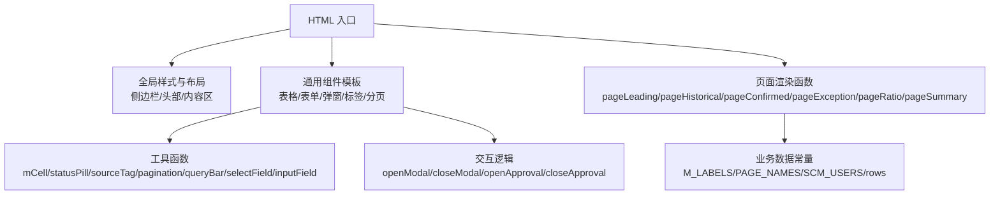
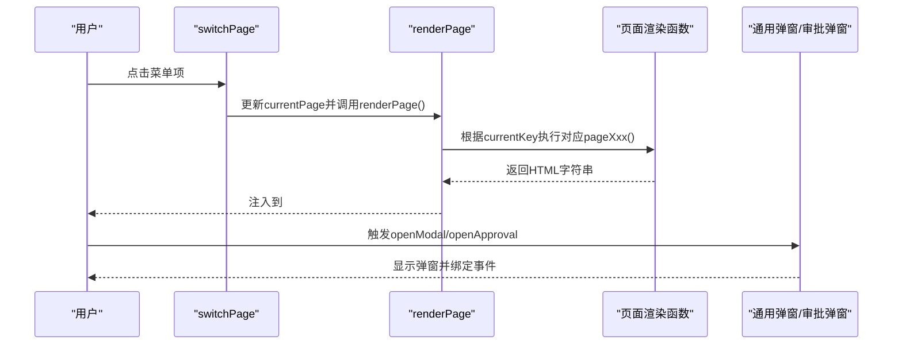
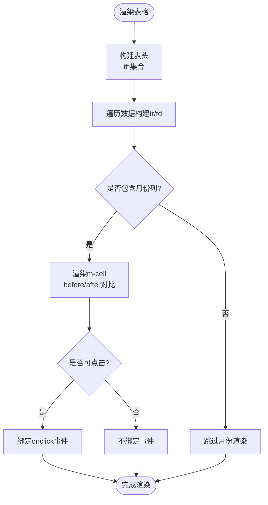
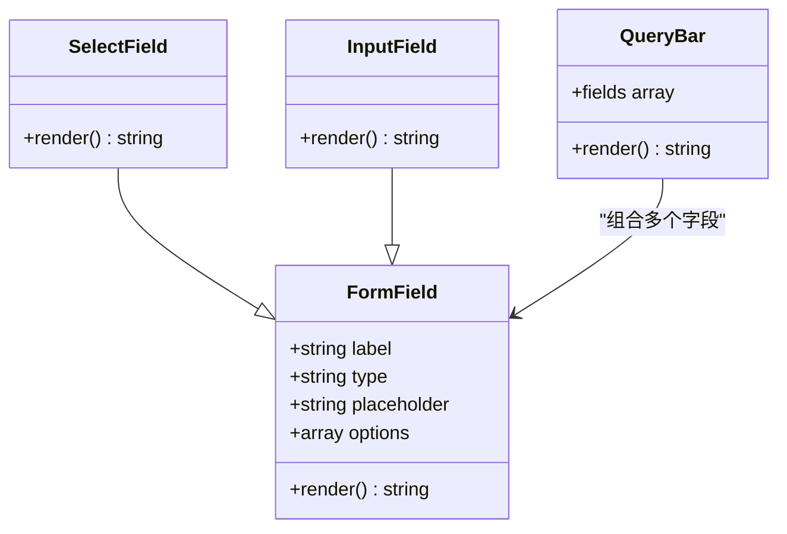
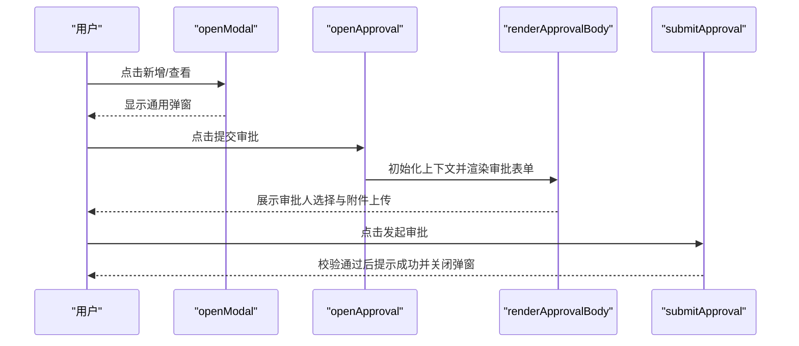
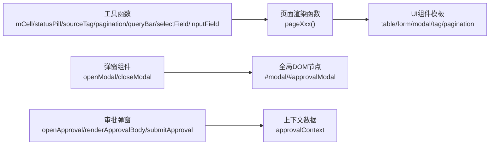

# 组件复用与定制

<cite>
**本文档中引用的文件**
- [sales-forecast-prototype.html](file://sales-forecast-prototype.html)
- [sales-forecast-prototype_副本.html](file://sales-forecast-prototype_副本.html)
</cite>

## 目录
1. [项目概述](#项目概述)
2. [项目结构](#项目结构)
3. [核心组件库](#核心组件库)
4. [架构总览](#架构总览)
5. [详细组件分析](#详细组件分析)
6. [依赖关系分析](#依赖关系分析)
7. [性能考虑](#性能考虑)
8. [故障排查指南](#故障排查指南)
9. [结论](#结论)
10. [附录：响应式与可访问性](#附录响应式与可访问性)

## 项目概述
本仓库为“智能销售预测系统”的高保真原型，采用单HTML文件实现，内置样式与脚本，提供多页面（先行指标预测、历史销售预测、确定性需求、例外需求、计算比例维护、销售预测3+9需求汇总）的完整交互体验。项目内封装了表格、表单、弹窗、状态标签、分页、查询栏、统计卡片等常用UI组件，便于快速复用与二次开发。

## 项目结构
- 单一入口HTML文件包含全局样式、布局、通用组件模板与页面渲染逻辑
- 通过JavaScript函数动态渲染各页面内容，使用类名驱动样式
- 弹窗与审批弹窗作为全局模态框，集中管理显示/隐藏与数据上下文

图表来源
- [sales-forecast-prototype.html:1-126](file://sales-forecast-prototype.html#L1-L126)
- [sales-forecast-prototype.html:140-183](file://sales-forecast-prototype.html#L140-L183)
- [sales-forecast-prototype.html:282-292](file://sales-forecast-prototype.html#L282-L292)

章节来源
- [sales-forecast-prototype.html:1-126](file://sales-forecast-prototype.html#L1-L126)
- [sales-forecast-prototype.html:140-183](file://sales-forecast-prototype.html#L140-L183)

## 核心组件库
- 表格组件
  - 容器与表头固定：table-wrap、th sticky定位、斑马纹行高亮
  - 单元格对齐：td-right、td-center
  - 月份对比单元格：m-cell/m-before/m-after/m-clickable，支持修改前后对比与点击交互
- 表单组件
  - 字段容器：form-group、form-label（含必填标记）
  - 输入控件：input[type=text|number]、select、textarea，统一聚焦边框与阴影
- 弹窗组件
  - 通用弹窗：modal-overlay/modal/modal-header/modal-body/modal-footer/modal-close
  - 提交审批弹窗：approvalModal，支持多级审批人选择、附件上传与校验
- 状态标签
  - 通用标签：tag（蓝/绿/橙/红/灰）
  - 胶囊标签：pill（用于审批状态）
  - 来源标签：sourceTag（确定性需求/例外需求/历史销售预测）
- 分页组件
  - pagination：每页条数选择、页码按钮、当前页提示
- 查询栏组件
  - query-bar：组合多个selectField/inputField，并提供查询与重置按钮
- 统计卡片
  - card + stat：展示关键指标数值、单位与描述
- 选项卡Tabs
  - tabs/tab-btn：用于页面内切换视图（如例外需求汇总表/明细表、3+9汇总多Tab）

章节来源
- [sales-forecast-prototype.html:53-89](file://sales-forecast-prototype.html#L53-L89)
- [sales-forecast-prototype.html:151-178](file://sales-forecast-prototype.html#L151-L178)
- [sales-forecast-prototype.html:179-183](file://sales-forecast-prototype.html#L179-L183)
- [sales-forecast-prototype.html:184-280](file://sales-forecast-prototype.html#L184-L280)

## 架构总览
整体采用“单页应用 + 动态渲染”模式：
- 路由由switchPage控制，根据key映射到对应渲染函数
- 页面容器#pageContainer注入stack包裹的内容
- 通用组件以字符串模板形式返回，配合CSS类名完成样式与交互

图表来源
- [sales-forecast-prototype.html:282-292](file://sales-forecast-prototype.html#L282-L292)
- [sales-forecast-prototype.html:179-183](file://sales-forecast-prototype.html#L179-L183)
- [sales-forecast-prototype.html:184-280](file://sales-forecast-prototype.html#L184-L280)

## 详细组件分析

### 表格组件（Table）
- 结构与样式
  - 外层table-wrap提供滚动与圆角边框
  - th设置sticky顶部固定，确保长列表滚动时列头可见
  - 斑马纹与奇偶行背景色提升可读性
- 特殊单元格
  - m-cell：用于月份对比，支持before/after双值显示与差异高亮
  - m-clickable：点击区域高亮，常用于钻取或详情查看
- 使用示例
  - 在例外需求与3+9汇总页面中广泛使用，结合queryBar与pagination形成标准数据看板

图表来源
- [sales-forecast-prototype.html:53-64](file://sales-forecast-prototype.html#L53-L64)
- [sales-forecast-prototype.html:151-156](file://sales-forecast-prototype.html#L151-L156)
- [sales-forecast-prototype.html:345-365](file://sales-forecast-prototype.html#L345-L365)

章节来源
- [sales-forecast-prototype.html:53-64](file://sales-forecast-prototype.html#L53-L64)
- [sales-forecast-prototype.html:151-156](file://sales-forecast-prototype.html#L151-L156)
- [sales-forecast-prototype.html:345-365](file://sales-forecast-prototype.html#L345-L365)

### 表单组件（Form）
- 字段组织
  - form-group垂直堆叠label与控件，label支持必填标记
  - input/select/textarea统一聚焦样式（边框颜色与阴影）
- 辅助函数
  - selectField(label, opts)：生成下拉字段
  - inputField(label, ph)：生成文本输入字段
- 使用示例
  - 查询栏queryBar组合多个selectField/inputField
  - 新增/编辑弹窗内嵌表单，支持网格布局grid-2/grid-5

图表来源
- [sales-forecast-prototype.html:46-52](file://sales-forecast-prototype.html#L46-L52)
- [sales-forecast-prototype.html:170-178](file://sales-forecast-prototype.html#L170-L178)
- [sales-forecast-prototype.html:170-172](file://sales-forecast-prototype.html#L170-L172)

章节来源
- [sales-forecast-prototype.html:46-52](file://sales-forecast-prototype.html#L46-L52)
- [sales-forecast-prototype.html:170-178](file://sales-forecast-prototype.html#L170-L178)

### 弹窗组件（Modal）
- 通用弹窗
  - openModal(title, body, footer)：设置标题、主体内容与底部操作区
  - closeModal()：移除show类隐藏弹窗
- 提交审批弹窗
  - approvalModal：支持申请理由、三级审批人选择（L1必选）、附件上传（最多3个，单文件≤30MB）
  - 校验逻辑：未填写理由或未选择一级审批人时阻止提交
- 使用示例
  - 新增例外需求、查看详情、提交审批等操作均通过弹窗承载

图表来源
- [sales-forecast-prototype.html:179-183](file://sales-forecast-prototype.html#L179-L183)
- [sales-forecast-prototype.html:184-280](file://sales-forecast-prototype.html#L184-L280)

章节来源
- [sales-forecast-prototype.html:179-183](file://sales-forecast-prototype.html#L179-L183)
- [sales-forecast-prototype.html:184-280](file://sales-forecast-prototype.html#L184-L280)

### 状态标签（Tag/Pill/SourceTag）
- tag：基础标签，支持多种颜色语义（蓝/绿/橙/红/灰）
- pill：胶囊标签，常用于审批状态（已通过/审批中/草稿/已驳回/已撤回/已废弃）
- sourceTag：来源标签，区分确定性需求/例外需求/历史销售预测
- 使用示例
  - 表格中的状态列、来源列、趋势列等

章节来源
- [sales-forecast-prototype.html:60-66](file://sales-forecast-prototype.html#L60-L66)
- [sales-forecast-prototype.html:157-166](file://sales-forecast-prototype.html#L157-L166)

### 分页组件（Pagination）
- 功能
  - 每页条数选择（10/20/50/100）
  - 上一页/下一页按钮与当前页提示
- 使用示例
  - 所有数据列表页底部统一使用

章节来源
- [sales-forecast-prototype.html:167-169](file://sales-forecast-prototype.html#L167-L169)

### 查询栏组件（QueryBar）
- 功能
  - 组合多个selectField/inputField
  - 提供查询与重置按钮
- 使用示例
  - 各页面顶部筛选条件区域

章节来源
- [sales-forecast-prototype.html:170-172](file://sales-forecast-prototype.html#L170-L172)

### 统计卡片（Stat Card）
- 结构
  - card + stat：标签、数值、单位、描述
- 使用示例
  - 首页概览、各页面KPI展示

章节来源
- [sales-forecast-prototype.html:59](file://sales-forecast-prototype.html#L59)

### 选项卡（Tabs）
- 功能
  - 页面内切换不同视图（如例外需求汇总表/明细表、3+9汇总多Tab）
- 使用示例
  - exception与summary页面的Tab切换

章节来源
- [sales-forecast-prototype.html:63-65](file://sales-forecast-prototype.html#L63-L65)

## 依赖关系分析
- 组件间耦合度低，主要通过CSS类名与JS函数解耦
- 页面渲染函数依赖工具函数（mCell、statusPill、sourceTag、pagination、queryBar、selectField、inputField）
- 弹窗组件依赖全局DOM节点（#modal、#approvalModal）与上下文变量（approvalContext）

图表来源
- [sales-forecast-prototype.html:148-178](file://sales-forecast-prototype.html#L148-L178)
- [sales-forecast-prototype.html:184-280](file://sales-forecast-prototype.html#L184-L280)

章节来源
- [sales-forecast-prototype.html:148-178](file://sales-forecast-prototype.html#L148-L178)
- [sales-forecast-prototype.html:184-280](file://sales-forecast-prototype.html#L184-L280)

## 性能考虑
- 表格渲染：大量DOM拼接可能影响性能，建议对大数据集进行虚拟滚动或分页加载
- 弹窗频繁打开/关闭：避免重复innerHTML赋值，可缓存模板片段
- 事件绑定：inline onclick较多，建议改为事件委托以提升性能
- 样式重排：sticky表头与复杂布局可能导致重排，尽量减少动态样式变更

[本节为通用指导，无需源码引用]

## 故障排查指南
- 弹窗无法显示
  - 检查modal-overlay是否添加show类
  - 确认#modal与#approvalModal存在且未被覆盖
- 审批提交失败
  - 校验申请理由是否为空
  - 校验一级审批人是否至少选择一个
  - 附件数量限制（最多3个）与大小限制（单文件≤30MB）
- 表格列错位
  - 检查th与td数量是否一致
  - 确认m-cell宽度与对齐样式正确
- 页面切换无效
  - 检查switchPage是否正确更新currentPage与菜单active状态
  - 确认renderPage能正确映射到对应pageXxx函数

章节来源
- [sales-forecast-prototype.html:179-183](file://sales-forecast-prototype.html#L179-L183)
- [sales-forecast-prototype.html:184-280](file://sales-forecast-prototype.html#L184-L280)
- [sales-forecast-prototype.html:282-292](file://sales-forecast-prototype.html#L282-L292)

## 结论
本项目提供了完整的前端UI组件库与页面渲染框架，涵盖表格、表单、弹窗、标签、分页、查询栏、统计卡片与选项卡等常见组件。通过统一的CSS类名与JS工具函数，实现了高复用性与易扩展性。建议在后续开发中进一步抽象组件为独立模块，引入事件委托与虚拟滚动优化性能，并补充无障碍属性以提升可访问性。

[本节为总结，无需源码引用]

## 附录：响应式与可访问性
- 响应式适配
  - 使用viewport meta与flex/grid布局实现自适应
  - 表格通过table-wrap横向滚动应对窄屏
  - 统计卡片与查询栏在小屏幕下自动换行
- 可访问性考虑
  - 为交互元素添加aria-label与role属性（如button、dialog）
  - 键盘导航：支持Tab顺序与Enter/Escape键操作弹窗
  - 色彩对比度：确保文字与背景对比度符合WCAG标准
  - 表单字段关联label与input的for/id属性

[本节为通用指导，无需源码引用]