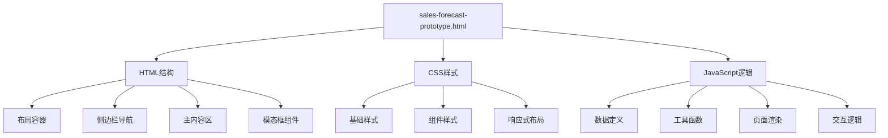
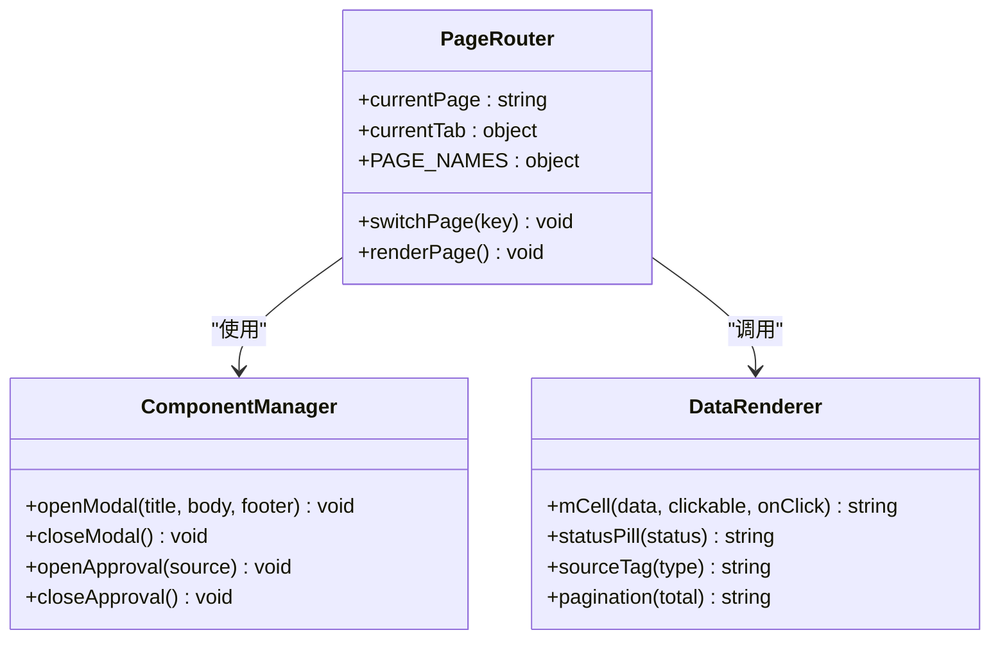
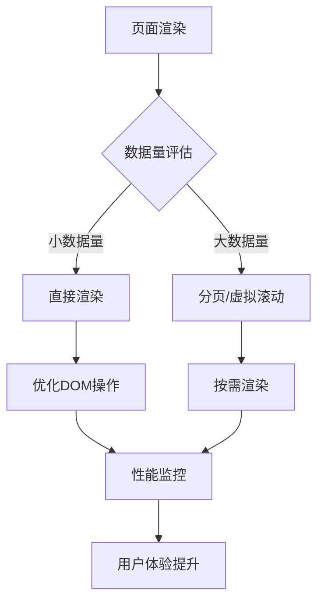
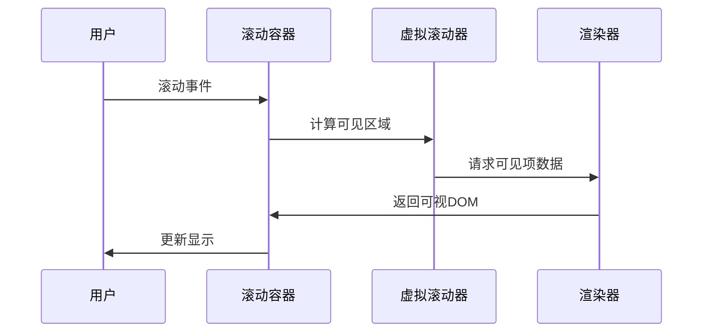
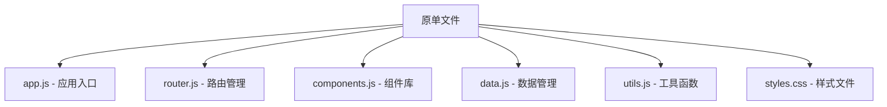
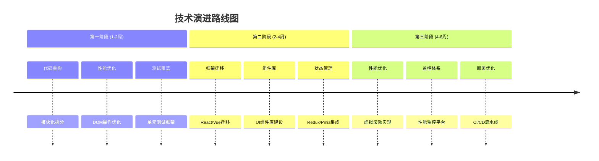

# 调试与性能优化

<cite>
**本文档引用的文件**   
- [sales-forecast-prototype.html](file://sales-forecast-prototype.html)
- [sales-forecast-prototype_副本.html](file://sales-forecast-prototype_副本.html)
</cite>

## 目录
1. [项目概述](#项目概述)
2. [项目结构分析](#项目结构分析)
3. [核心组件架构](#核心组件架构)
4. [浏览器开发者工具使用指南](#浏览器开发者工具使用指南)
5. [DOM操作优化策略](#dom操作优化策略)
6. [内存泄漏检测与预防](#内存泄漏检测与预防)
7. [渲染性能分析与优化](#渲染性能分析与优化)
8. [事件委托与性能优化](#事件委托与性能优化)
9. [虚拟滚动实现方案](#虚拟滚动实现方案)
10. [懒加载技术实践](#懒加载技术实践)
11. [代码重构建议](#代码重构建议)
12. [最佳实践模式](#最佳实践模式)
13. [自动化测试配置](#自动化测试配置)
14. [持续集成设置](#持续集成设置)
15. [故障排查指南](#故障排查指南)
16. [总结与建议](#总结与建议)

## 项目概述

这是一个智能销售预测系统的高保真原型，包含六个主要功能模块：先行指标预测、历史销售预测、确定性需求、例外需求、计算比例维护和销售预测3+9需求汇总。项目采用单HTML文件架构，内嵌CSS样式和JavaScript逻辑，适合快速原型开发和演示。

### 主要功能特性
- **多页面导航**：侧边栏菜单切换不同业务模块
- **数据表格展示**：支持复杂的多维度数据展示
- **审批流程**：内置多级审批工作流
- **图表可视化**：预留图表占位符
- **响应式设计**：适配不同屏幕尺寸

**章节来源**
- [sales-forecast-prototype.html:1-459](file://sales-forecast-prototype.html#L1-L459)
- [sales-forecast-prototype_副本.html:1-266](file://sales-forecast-prototype_副本.html#L1-L266)

## 项目结构分析

### 文件组织结构


**图表来源**
- [sales-forecast-prototype.html:108-126](file://sales-forecast-prototype.html#L108-L126)
- [sales-forecast-prototype.html:140-183](file://sales-forecast-prototype.html#L140-L183)

### 架构特点
- **单体架构**：所有代码集中在单个HTML文件中
- **无依赖框架**：纯原生JavaScript实现
- **模板字符串**：大量使用ES6模板字符串生成HTML
- **全局状态管理**：使用全局变量管理应用状态

**章节来源**
- [sales-forecast-prototype.html:108-126](file://sales-forecast-prototype.html#L108-L126)
- [sales-forecast-prototype.html:140-183](file://sales-forecast-prototype.html#L140-L183)

## 核心组件架构

### 页面路由系统


**图表来源**
- [sales-forecast-prototype.html:282-292](file://sales-forecast-prototype.html#L282-L292)
- [sales-forecast-prototype.html:179-183](file://sales-forecast-prototype.html#L179-L183)

### 数据模型设计
项目定义了多个核心数据模型：
- **M_LABELS**：月份标签数组（M月到M+12）
- **PAGE_NAMES**：页面名称映射表
- **SCM_USERS**：供应链用户列表
- **approvalContext**：审批上下文状态

**章节来源**
- [sales-forecast-prototype.html:141-146](file://sales-forecast-prototype.html#L141-L146)

## 浏览器开发者工具使用指南

### 控制台调试技巧
1. **断点调试**：在关键函数处设置断点，如`renderPage()`、`switchPage()`
2. **变量监控**：监控全局状态变量`currentPage`、`currentTab`
3. **网络请求**：虽然当前是静态原型，但可模拟API调用调试

### DOM检查与修改
1. **元素选择器**：使用`$()`函数快速定位元素
2. **实时修改**：在Elements面板直接修改DOM结构
3. **样式调试**：在Styles面板调整CSS属性查看效果

### 性能分析工具
1. **Performance面板**：录制页面加载和交互过程
2. **Memory面板**：检查内存使用情况
3. **Network面板**：分析资源加载情况

**章节来源**
- [sales-forecast-prototype.html:289-292](file://sales-forecast-prototype.html#L289-L292)
- [sales-forecast-prototype.html:149](file://sales-forecast-prototype.html#L149)

## DOM操作优化策略

### 批量DOM更新
当前实现存在频繁的DOM操作问题：
```javascript
// 问题：每次渲染都重新构建整个页面
$('#pageContainer').innerHTML=`<div class="stack">${pages[currentPage]()}</div>`;
```

**优化建议**：
1. **使用DocumentFragment**：减少重排重绘次数
2. **缓存DOM引用**：避免重复查询
3. **增量更新**：只更新变化的部分

### 模板引擎优化
```javascript
// 当前方式：字符串拼接
return `<h2>${title}</h2><div>${content}</div>`;

// 优化方式：使用预编译模板或模板引擎
const template = document.createElement('template');
template.innerHTML = '<h2>{{title}}</h2><div>{{content}}</div>';
```

**章节来源**
- [sales-forecast-prototype.html:289-292](file://sales-forecast-prototype.html#L289-L292)

## 内存泄漏检测与预防

### 常见内存泄漏场景
1. **全局变量污染**：大量全局变量占用内存
2. **事件监听器未清理**：动态添加的事件监听器未移除
3. **闭包引用**：闭包持有不需要的引用

### 内存监控方法
```javascript
// 添加内存监控
function monitorMemory() {
    if (performance.memory) {
        console.log('内存使用:', performance.memory.usedJSHeapSize);
    }
}

// 定期检查内存使用
setInterval(monitorMemory, 5000);
```

### 内存优化策略
1. **及时释放引用**：不再使用的对象设置为null
2. **使用WeakMap/WeakRef**：避免强引用导致的内存泄漏
3. **清理定时器**：确保clearTimeout/clearInterval被调用

**章节来源**
- [sales-forecast-prototype.html:141-146](file://sales-forecast-prototype.html#L141-L146)

## 渲染性能分析与优化

### 渲染瓶颈分析
当前页面的主要渲染瓶颈：
1. **大表格渲染**：异常需求明细表有36个列
2. **频繁DOM操作**：页面切换时重建整个内容
3. **字符串拼接开销**：大量模板字符串拼接

### 性能优化措施


**图表来源**
- [sales-forecast-prototype.html:356-365](file://sales-forecast-prototype.html#L356-L365)

### 具体优化建议
1. **使用requestAnimationFrame**：优化动画和重绘
2. **防抖节流**：对频繁触发的事件进行处理
3. **Web Workers**：将计算密集型任务移到后台线程

**章节来源**
- [sales-forecast-prototype.html:356-365](file://sales-forecast-prototype.html#L356-L365)

## 事件委托与性能优化

### 当前事件处理问题
```javascript
// 问题：每个按钮都绑定独立的事件处理器
<button onclick="openModal('新增例外需求', ...)">新增</button>
<button onclick="submitApproval()">提交审批</button>
```

### 事件委托解决方案
```javascript
// 优化：使用事件委托
document.getElementById('pageContainer').addEventListener('click', function(e) {
    const target = e.target.closest('[data-action]');
    if (target) {
        const action = target.dataset.action;
        handleAction(action, target.dataset.params);
    }
});
```

### 性能优势
1. **减少内存占用**：避免为每个元素创建事件处理器
2. **动态内容支持**：新添加的元素自动继承事件处理
3. **简化代码维护**：统一的事件处理逻辑

**章节来源**
- [sales-forecast-prototype.html:360](file://sales-forecast-prototype.html#L360)

## 虚拟滚动实现方案

### 虚拟滚动原理
对于大数据量表格，实现虚拟滚动可以显著提升性能：



**图表来源**
- [sales-forecast-prototype.html:356-365](file://sales-forecast-prototype.html#L356-L365)

### 实现步骤
1. **计算可视区域**：根据滚动位置确定可见的数据范围
2. **按需渲染**：只渲染可视区域内的DOM元素
3. **动态更新**：滚动时实时更新显示的DOM内容
4. **性能优化**：使用transform进行位置变换

### 第三方库推荐
- **react-window**：React生态的虚拟滚动库
- **vue-virtual-scroller**：Vue生态的虚拟滚动解决方案
- **ag-grid**：企业级表格组件，内置虚拟滚动

**章节来源**
- [sales-forecast-prototype.html:356-365](file://sales-forecast-prototype.html#L356-L365)

## 懒加载技术实践

### 图片懒加载
```javascript
// 实现图片懒加载
const lazyImages = document.querySelectorAll('img[data-src]');

const imageObserver = new IntersectionObserver((entries, observer) => {
    entries.forEach(entry => {
        if (entry.isIntersecting) {
            const img = entry.target;
            img.src = img.dataset.src;
            observer.unobserve(img);
        }
    });
});

lazyImages.forEach(img => imageObserver.observe(img));
```

### 组件懒加载
```javascript
// 动态加载组件
async function loadComponent(componentName) {
    const module = await import(`./components/${componentName}.js`);
    return module.default;
}

// 按需加载
const ChartComponent = await loadComponent('Chart');
```

### 路由懒加载
```javascript
// 路由级别的代码分割
const routes = {
    leading: () => import('./pages/leading.js'),
    historical: () => import('./pages/historical.js'),
    confirmed: () => import('./pages/confirmed.js')
};
```

**章节来源**
- [sales-forecast-prototype.html:179-183](file://sales-forecast-prototype.html#L179-L183)

## 代码重构建议

### 模块化重构
将单文件拆分为多个模块：



**图表来源**
- [sales-forecast-prototype.html:140-183](file://sales-forecast-prototype.html#L140-L183)

### 状态管理优化
```javascript
// 使用发布订阅模式管理状态
class StateManager {
    constructor() {
        this.state = {};
        this.listeners = {};
    }
    
    setState(newState) {
        this.state = {...this.state, ...newState};
        this.notify();
    }
    
    subscribe(listener) {
        this.listeners.push(listener);
    }
    
    notify() {
        this.listeners.forEach(listener => listener(this.state));
    }
}
```

### 组件化设计
将页面拆分为可复用的组件：
- **TableComponent**：通用表格组件
- **FormComponent**：表单组件
- **ModalComponent**：模态框组件
- **PaginationComponent**：分页组件

**章节来源**
- [sales-forecast-prototype.html:294-453](file://sales-forecast-prototype.html#L294-L453)

## 最佳实践模式

### 单一职责原则
每个函数应该只负责一个功能：
```javascript
// 好的实践：职责分离
function renderTable(data) { /* 渲染表格 */ }
function formatData(data) { /* 格式化数据 */ }
function validateInput(input) { /* 验证输入 */ }
```

### 错误处理模式
```javascript
// 统一的错误处理
try {
    const result = await fetchData(url);
    updateUI(result);
} catch (error) {
    handleError(error);
    showErrorMessage(error.message);
}
```

### 性能优化模式
1. **防抖函数**：限制函数执行频率
2. **节流函数**：控制函数执行间隔
3. **缓存机制**：缓存计算结果和API响应

**章节来源**
- [sales-forecast-prototype.html:148-178](file://sales-forecast-prototype.html#L148-L178)

## 自动化测试配置

### Jest测试环境搭建
```json
{
    "scripts": {
        "test": "jest",
        "test:watch": "jest --watch",
        "test:coverage": "jest --coverage"
    },
    "jest": {
        "testEnvironment": "jsdom",
        "setupFilesAfterEnv": ["<rootDir>/src/setupTests.js"],
        "moduleNameMapper": {
            "^@/(.*)$": "<rootDir>/src/$1"
        }
    }
}
```

### 单元测试示例
```javascript
// test/pageNavigation.test.js
describe('页面导航测试', () => {
    beforeEach(() => {
        document.body.innerHTML = '<div id="app"></div>';
    });
    
    test('页面切换功能', () => {
        switchPage('historical');
        expect(currentPage).toBe('historical');
        expect(document.querySelector('#curPage').textContent)
            .toBe('历史销售预测');
    });
    
    test('模态框打开关闭', () => {
        openModal('测试标题', '测试内容', '测试底部');
        expect(document.querySelector('.modal-overlay.show')).toBeTruthy();
        
        closeModal();
        expect(document.querySelector('.modal-overlay.show')).toBeFalsy();
    });
});
```

### 端到端测试
```javascript
// test/e2e.spec.js
describe('用户流程测试', () => {
    it('完整的审批流程', async () => {
        // 访问页面
        await page.goto('http://localhost:3000');
        
        // 点击菜单
        await page.click('.menu-item:nth-child(4)');
        
        // 填写表单
        await page.fill('#approvalReason', '测试审批理由');
        
        // 提交审批
        await page.click('.btn-primary');
        
        // 验证结果
        await expect(page.locator('.toast-success')).toBeVisible();
    });
});
```

**章节来源**
- [sales-forecast-prototype.html:179-183](file://sales-forecast-prototype.html#L179-L183)

## 持续集成设置

### GitHub Actions配置
```yaml
name: CI/CD Pipeline

on: [push, pull_request]

jobs:
    test:
        runs-on: ubuntu-latest
        steps:
            - uses: actions/checkout@v2
            - name: Setup Node.js
              uses: actions/setup-node@v2
              with:
                  node-version: '16'
            - name: Install dependencies
              run: npm install
            - name: Run tests
              run: npm test
            - name: Build project
              run: npm run build
            - name: Upload artifacts
              uses: actions/upload-artifact@v2
              with:
                  name: build-output
                  path: dist/
```

### Docker容器化
```dockerfile
FROM nginx:alpine
COPY dist/ /usr/share/nginx/html/
EXPOSE 80
CMD ["nginx", "-g", "daemon off;"]
```

### 部署脚本
```bash
#!/bin/bash
# deploy.sh
echo "开始部署..."
npm install
npm run build
docker build -t sales-forecast:latest .
docker push sales-forecast:latest
kubectl rollout restart deployment/sales-forecast
echo "部署完成！"
```

**章节来源**
- [sales-forecast-prototype.html:455-457](file://sales-forecast-prototype.html#L455-L457)

## 故障排查指南

### 常见问题诊断
1. **页面无法加载**：检查HTML语法错误和JavaScript解析错误
2. **样式显示异常**：使用开发者工具检查CSS优先级和兼容性
3. **交互功能失效**：检查事件绑定和DOM元素是否存在

### 调试技巧
```javascript
// 添加详细的日志记录
function debugLog(message, data) {
    console.group(`[${new Date().toISOString()}] ${message}`);
    console.log('数据:', data);
    console.trace('调用栈:');
    console.groupEnd();
}

// 性能监控
function measurePerformance(name, fn) {
    const start = performance.now();
    const result = fn();
    const end = performance.now();
    console.log(`${name} 耗时: ${(end - start).toFixed(2)}ms`);
    return result;
}
```

### 性能监控指标
1. **首屏加载时间**：从页面开始加载到完全渲染的时间
2. **交互响应时间**：用户操作到界面响应的延迟
3. **内存使用峰值**：应用运行过程中的最大内存占用
4. **CPU使用率**：页面渲染和交互时的CPU占用情况

**章节来源**
- [sales-forecast-prototype.html:148-178](file://sales-forecast-prototype.html#L148-L178)

## 总结与建议

### 项目现状评估
当前原型项目具有以下特点：
- **优点**：结构简单、易于理解、快速开发
- **缺点**：可维护性差、性能瓶颈明显、扩展性受限

### 优化优先级建议
1. **高优先级**：实现事件委托、添加错误处理、优化DOM操作
2. **中优先级**：模块化重构、添加单元测试、实现懒加载
3. **低优先级**：引入框架、实现虚拟滚动、容器化部署

### 技术演进路线


### 最终建议
1. **渐进式重构**：保持现有功能的同时逐步优化
2. **性能优先**：重点关注大数据量表格的性能优化
3. **用户体验**：确保交互流畅性和响应速度
4. **可维护性**：建立清晰的代码结构和文档体系

通过系统的调试和性能优化，可以将这个简单的原型发展为高性能、可维护的企业级应用。