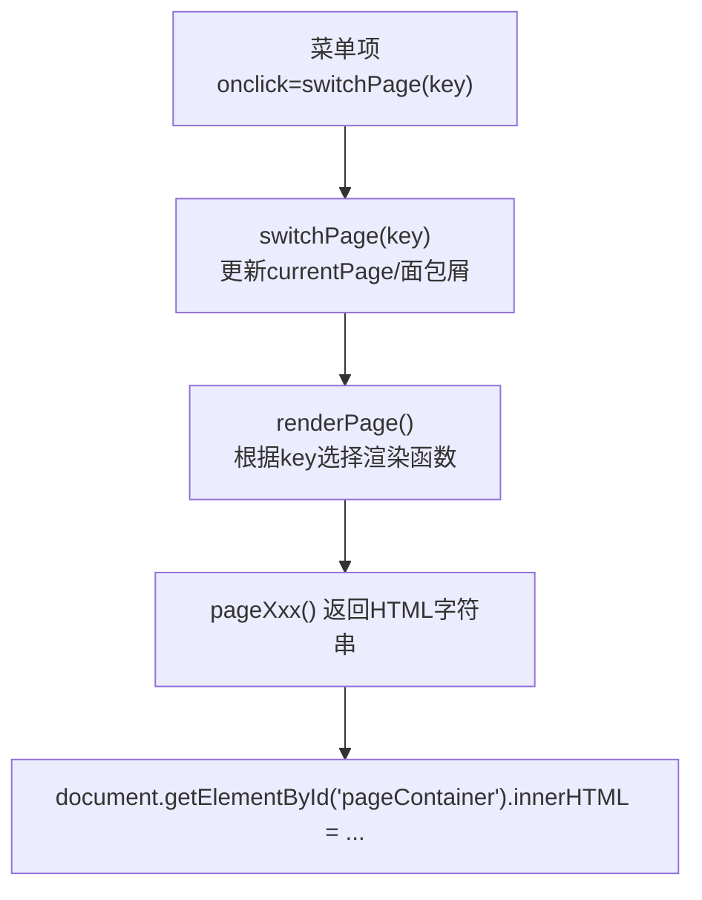
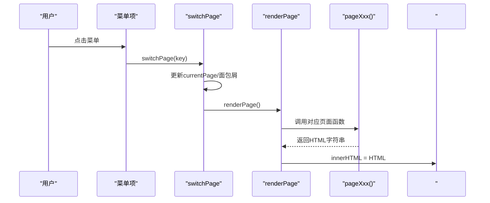
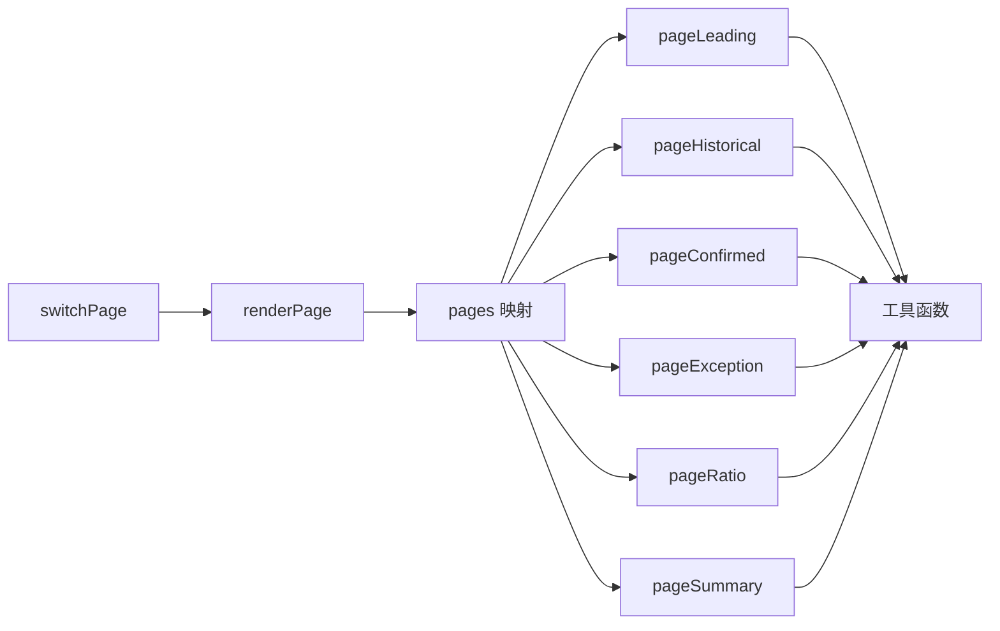

# 页面扩展开发

<cite>
**本文引用的文件**   
- [sales-forecast-prototype.html](file://sales-forecast-prototype.html)
- [sales-forecast-prototype_副本.html](file://sales-forecast-prototype_副本.html)
</cite>

## 目录
1. [引言](#引言)
2. [项目结构](#项目结构)
3. [核心组件](#核心组件)
4. [架构总览](#架构总览)
5. [详细组件分析](#详细组件分析)
6. [依赖关系分析](#依赖关系分析)
7. [性能考虑](#性能考虑)
8. [故障排查指南](#故障排查指南)
9. [结论](#结论)
10. [附录：新增页面完整步骤与示例路径](#附录新增页面完整步骤与示例路径)

## 引言
本指南面向需要在销售预测系统中新增页面的开发者，系统为单页原型（HTML+内联JS），通过“菜单点击 → 路由映射 → 渲染函数”实现页面切换。文档将详细说明：
- 页面函数创建规范
- 路由注册机制
- 菜单项配置
- 页面切换逻辑
- 页面初始化流程、数据绑定方式与事件处理机制
- 最佳实践与常见陷阱
并提供“复制现有页面并改造为新功能页面”的完整操作步骤与代码片段路径指引。

## 项目结构
- 入口与布局
  - 侧边栏菜单：定义各页面入口及点击跳转
  - 主内容区：动态渲染当前页面内容
- 脚本区域
  - 全局常量与状态
  - 工具函数（查询栏、分页、弹窗等）
  - 页面渲染函数（每个页面一个函数）
  - 路由与切换逻辑
  - 初始化调用

图表来源
- [sales-forecast-prototype.html:113-124](file://sales-forecast-prototype.html#L113-L124)
- [sales-forecast-prototype.html:283-292](file://sales-forecast-prototype.html#L283-L292)

章节来源
- [sales-forecast-prototype.html:108-126](file://sales-forecast-prototype.html#L108-L126)
- [sales-forecast-prototype.html:140-178](file://sales-forecast-prototype.html#L140-L178)

## 核心组件
- 菜单与路由
  - 菜单项使用 onclick="switchPage('xxx')" 触发路由切换
  - switchPage 更新当前页面 key、面包屑文本，并调用 renderPage
- 渲染器
  - renderPage 维护 pages 映射：key → pageXxx 函数
  - 将渲染结果注入 #pageContainer
- 页面函数
  - 每个页面一个函数，返回 HTML 字符串
  - 可包含统计卡片、查询栏、表格、操作栏、分页等
- 通用组件
  - 查询栏 queryBar、下拉 selectField、输入 inputField
  - 分页 pagination、状态标签 statusPill、来源标签 sourceTag
  - 弹窗 openModal/closeModal、审批弹窗 openApproval/closeApproval
- 状态管理
  - currentPage 控制当前页面
  - currentTab 控制多 Tab 页面（如例外需求、汇总）

章节来源
- [sales-forecast-prototype.html:142-178](file://sales-forecast-prototype.html#L142-L178)
- [sales-forecast-prototype.html:283-292](file://sales-forecast-prototype.html#L283-L292)
- [sales-forecast-prototype.html:294-453](file://sales-forecast-prototype.html#L294-L453)

## 架构总览
下图展示了从用户点击菜单到页面渲染的完整流程，以及关键变量与函数的交互关系。

图表来源
- [sales-forecast-prototype.html:113-124](file://sales-forecast-prototype.html#L113-L124)
- [sales-forecast-prototype.html:283-292](file://sales-forecast-prototype.html#L283-L292)
- [sales-forecast-prototype.html:294-453](file://sales-forecast-prototype.html#L294-L453)

## 详细组件分析

### 页面函数创建规范
- 命名约定
  - 函数名以 page 开头，后接业务关键词，例如 pageNewFeature
  - 在 pages 映射中注册 key 指向该函数
- 返回值
  - 返回完整的 HTML 字符串，包含标题、查询栏、统计卡片、表格、操作栏、分页等
- 数据组织
  - 页面数据建议定义为模块级常量或局部变量，便于渲染时引用
- 交互
  - 按钮事件通过 inline onclick 调用全局函数（如 openModal、openApproval）
  - 复杂交互建议封装为独立函数，避免过长模板字符串

章节来源
- [sales-forecast-prototype.html:294-453](file://sales-forecast-prototype.html#L294-L453)

### 路由注册机制
- 路由表
  - renderPage 中的 pages 对象是路由表，键为页面 key，值为渲染函数
- 新增页面路由
  - 在 pages 中添加新键值对，指向新页面函数
- 一致性检查
  - 确保菜单项的 key 与 pages 中的键一致

章节来源
- [sales-forecast-prototype.html:283-292](file://sales-forecast-prototype.html#L283-L292)

### 菜单项配置
- 菜单结构
  - 侧边栏 .menu-item 使用 onclick="switchPage('key')" 绑定路由
- 新增菜单项
  - 复制现有菜单项，修改 key 和显示文本
  - 保持顺序与样式一致

章节来源
- [sales-forecast-prototype.html:113-124](file://sales-forecast-prototype.html#L113-L124)

### 页面切换逻辑
- switchPage
  - 更新 currentPage
  - 高亮当前菜单项
  - 更新面包屑文本
  - 调用 renderPage
- renderPage
  - 根据 currentPage 选择渲染函数
  - 将渲染结果注入 #pageContainer

章节来源
- [sales-forecast-prototype.html:283-292](file://sales-forecast-prototype.html#L283-L292)

### 页面初始化流程
- 初始化
  - 页面加载完成后执行 renderPage()
  - 默认 currentPage 为 'leading'
- 多 Tab 状态
  - currentTab 对象保存各页面 Tab 状态

章节来源
- [sales-forecast-prototype.html:145-146](file://sales-forecast-prototype.html#L145-L146)
- [sales-forecast-prototype.html:455-457](file://sales-forecast-prototype.html#L455-L457)

### 数据绑定方式
- 静态数据
  - 页面函数内部定义数组/对象，用于渲染表格、统计卡片等
- 动态渲染
  - 使用模板字符串拼接 HTML，循环渲染列表
- 单元格编辑对比
  - mCell 函数支持展示“修改前/修改后”差异

章节来源
- [sales-forecast-prototype.html:151-156](file://sales-forecast-prototype.html#L151-L156)
- [sales-forecast-prototype.html:294-453](file://sales-forecast-prototype.html#L294-L453)

### 事件处理机制
- 按钮事件
  - 通过 inline onclick 调用全局函数（如 openModal、openApproval）
- 表单事件
  - 输入框 oninput 更新上下文状态（如审批理由）
- 文件上传
  - handleFiles 校验大小与数量，更新附件列表

章节来源
- [sales-forecast-prototype.html:179-182](file://sales-forecast-prototype.html#L179-L182)
- [sales-forecast-prototype.html:185-280](file://sales-forecast-prototype.html#L185-L280)

### 多 Tab 页面模式
- 例外需求
  - 双 Tab：汇总表与明细表
  - 通过 currentTab.exception 控制
- 销售预测3+9需求汇总
  - 四 Tab：大区维度、国区维度、国家维度、明细表
  - 通过 currentTab.summary 控制

章节来源
- [sales-forecast-prototype.html:345-365](file://sales-forecast-prototype.html#L345-L365)
- [sales-forecast-prototype.html:412-453](file://sales-forecast-prototype.html#L412-L453)

### 审批弹窗与附件上传
- 审批弹窗
  - openApproval 初始化上下文，渲染审批人选择、附件上传区域
  - addApprover/removeApprover 管理审批人列表
  - submitApproval 校验并提交
- 附件上传
  - handleFiles 限制数量与大小，渲染文件列表

章节来源
- [sales-forecast-prototype.html:185-280](file://sales-forecast-prototype.html#L185-L280)

## 依赖关系分析
- 组件耦合
  - switchPage 依赖 PAGE_NAMES、currentTab、renderPage
  - renderPage 依赖 pages 映射与各 pageXxx 函数
  - 页面函数依赖工具函数（queryBar、pagination、statusPill、sourceTag、mCell）
- 外部依赖
  - DOM API（querySelector、getElementById）
  - 无第三方库，纯原生 JS

图表来源
- [sales-forecast-prototype.html:283-292](file://sales-forecast-prototype.html#L283-L292)
- [sales-forecast-prototype.html:294-453](file://sales-forecast-prototype.html#L294-L453)

章节来源
- [sales-forecast-prototype.html:140-178](file://sales-forecast-prototype.html#L140-L178)
- [sales-forecast-prototype.html:283-292](file://sales-forecast-prototype.html#L283-L292)

## 性能考虑
- 模板字符串拼接
  - 大量 DOM 操作集中在 innerHTML 赋值，减少多次 DOM 写入
- 列表渲染
  - 使用 map 生成行/列，避免嵌套循环过深
- 分页
  - 前端分页仅适用于小数据集；大数据集应后端分页
- 事件委托
  - 当前使用 inline onclick，适合原型；生产环境建议使用事件委托提升性能

[本节为通用指导，不直接分析具体文件]

## 故障排查指南
- 页面无法切换
  - 检查菜单项 key 是否与 pages 映射一致
  - 确认 switchPage 是否被正确调用
- 页面内容为空
  - 检查 pageXxx 函数是否正确返回 HTML
  - 确认 #pageContainer 是否存在
- 弹窗不显示
  - 检查 modal-overlay 的 show 类是否添加
  - 确认 openModal/closeModal 调用参数正确
- 审批提交失败
  - 校验申请理由与审批人选择
  - 检查附件数量与大小限制

章节来源
- [sales-forecast-prototype.html:179-182](file://sales-forecast-prototype.html#L179-L182)
- [sales-forecast-prototype.html:274-280](file://sales-forecast-prototype.html#L274-L280)

## 结论
本系统采用“菜单 → 路由 → 渲染函数”的简单架构，易于扩展新页面。遵循本文规范，可快速复制现有页面结构并定制新功能。注意保持一致性、合理组织数据与事件，避免常见陷阱，确保用户体验与可维护性。

[本节为总结，不直接分析具体文件]

## 附录：新增页面完整步骤与示例路径

### 步骤一：复制现有页面结构
- 选择一个现有页面函数作为模板（如 pageConfirmed）
- 复制其结构与样式，重命名为 pageNewFeature

参考路径
- [sales-forecast-prototype.html:318-328](file://sales-forecast-prototype.html#L318-L328)

### 步骤二：注册路由
- 在 renderPage 的 pages 映射中添加新键值对
- 确保 key 与菜单项一致

参考路径
- [sales-forecast-prototype.html:289-292](file://sales-forecast-prototype.html#L289-L292)

### 步骤三：添加菜单项
- 在侧边栏 .menu-group 中添加新菜单项
- 设置 onclick="switchPage('newFeature')"

参考路径
- [sales-forecast-prototype.html:113-124](file://sales-forecast-prototype.html#L113-L124)

### 步骤四：实现页面函数
- 定义页面数据（表格、统计卡片等）
- 返回 HTML 字符串，包含查询栏、表格、操作栏、分页
- 如需多 Tab，使用 currentTab.newFeature 管理状态

参考路径
- [sales-forecast-prototype.html:294-453](file://sales-forecast-prototype.html#L294-L453)

### 步骤五：绑定事件与数据
- 按钮事件通过 openModal、openApproval 等全局函数
- 表单输入通过 oninput 更新上下文状态
- 使用 mCell 展示前后对比

参考路径
- [sales-forecast-prototype.html:151-156](file://sales-forecast-prototype.html#L151-L156)
- [sales-forecast-prototype.html:179-182](file://sales-forecast-prototype.html#L179-L182)
- [sales-forecast-prototype.html:185-280](file://sales-forecast-prototype.html#L185-L280)

### 步骤六：测试与验证
- 点击菜单项，确认页面切换正常
- 验证查询、分页、弹窗、审批等功能
- 检查控制台错误与 DOM 结构

参考路径
- [sales-forecast-prototype.html:455-457](file://sales-forecast-prototype.html#L455-L457)

### 最佳实践
- 保持函数单一职责，避免过长模板字符串
- 数据与视图分离，便于维护
- 使用一致的样式类名与组件结构
- 对异常输入进行校验与提示

### 常见陷阱
- 菜单 key 与路由不一致导致页面无法切换
- 忘记在 pages 映射中注册新页面函数
- 未正确处理多 Tab 状态导致渲染异常
- 弹窗未正确关闭或状态未重置

[本节为操作指南，不直接分析具体文件]