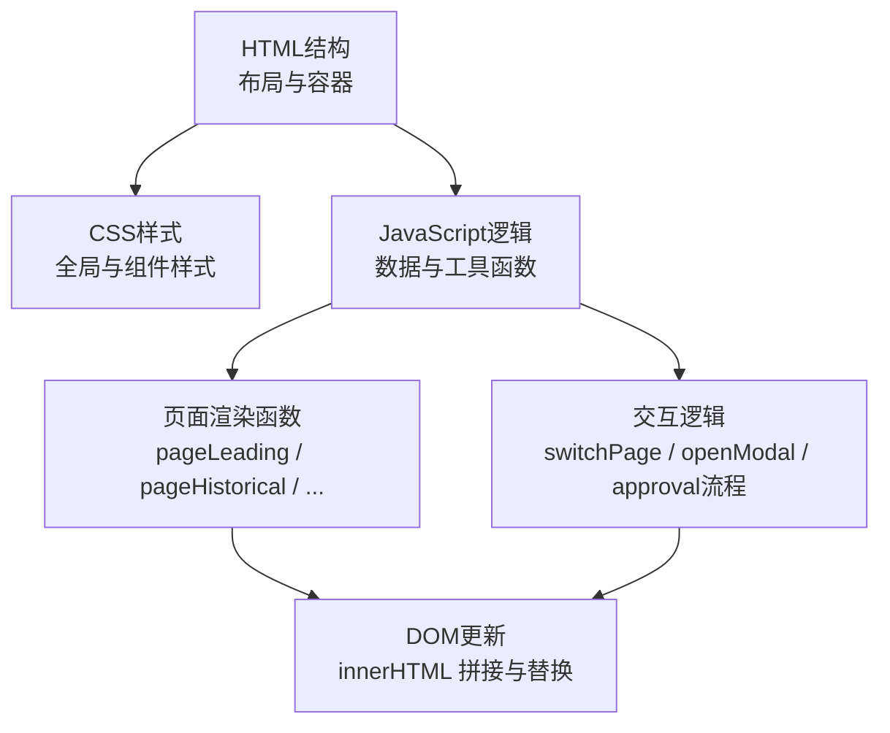
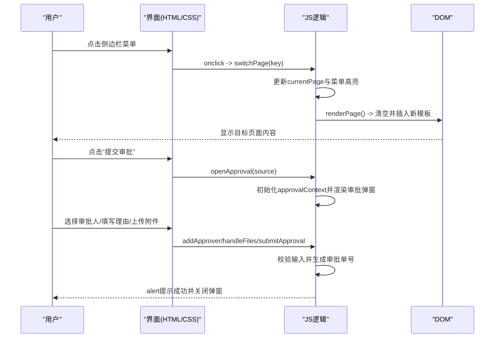
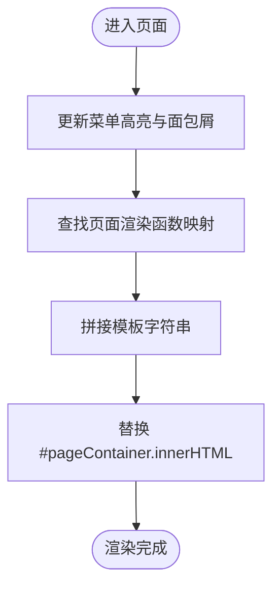
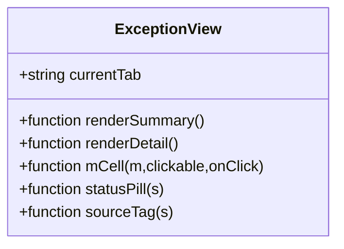
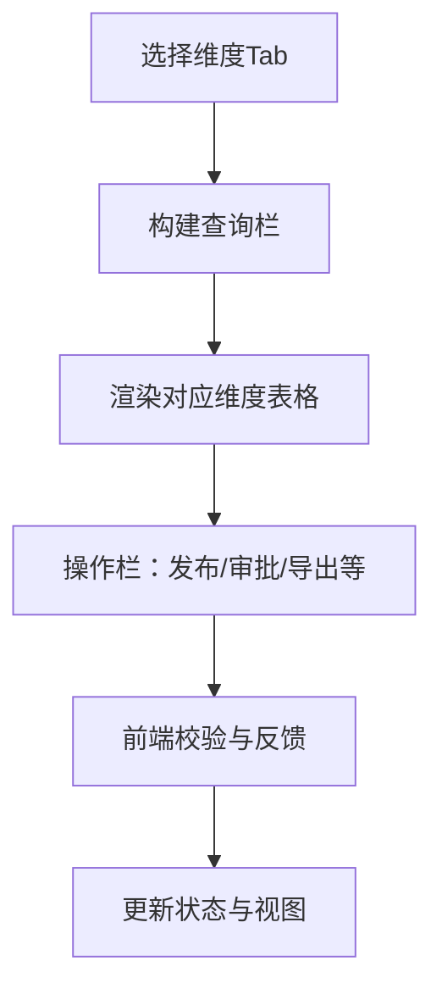
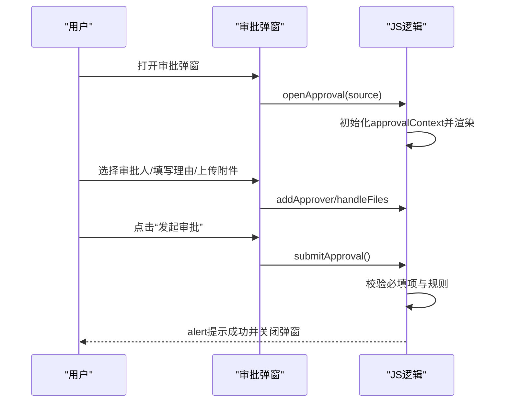
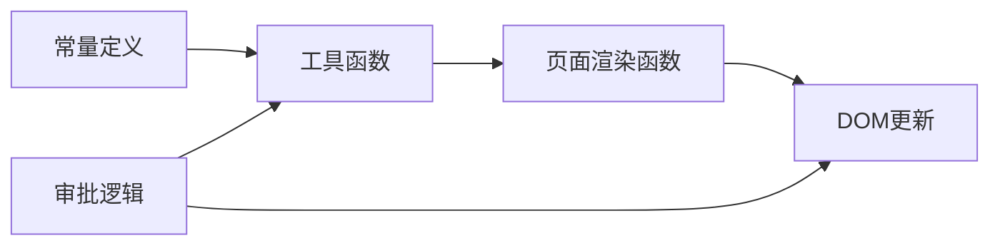

# 调试与优化

<cite>
**本文档引用的文件**   
- [sales-forecast-prototype.html](file://sales-forecast-prototype.html)
- [sales-forecast-prototype_副本.html](file://sales-forecast-prototype_副本.html)
</cite>

## 目录
1. [简介](#简介)
2. [项目结构](#项目结构)
3. [核心组件](#核心组件)
4. [架构总览](#架构总览)
5. [详细组件分析](#详细组件分析)
6. [依赖关系分析](#依赖关系分析)
7. [性能考虑](#性能考虑)
8. [故障排查指南](#故障排查指南)
9. [结论](#结论)
10. [附录：浏览器开发者工具使用技巧](#附录浏览器开发者工具使用技巧)

## 简介
本指南面向“智能销售预测系统”高保真原型的前端调试与优化，覆盖浏览器开发者工具使用、常见问题定位、DOM/内存/渲染优化策略、错误处理与日志记录最佳实践，以及生产环境部署建议与向后端框架迁移的指导。文档内容严格基于仓库中的HTML原型实现进行分析与提炼，帮助读者快速定位问题、提升性能并安全演进到工程化架构。

## 项目结构
该原型为单HTML文件应用，内嵌样式与脚本，采用“页面函数+模板字符串”的方式动态渲染各页面与表格。主要结构包括：
- 布局与导航：侧边栏菜单、顶部面包屑、主内容区
- 页面模块：先行指标预测、历史销售预测、确定性需求、例外需求（双Tab）、计算比例维护、销售预测3+9需求汇总（四Tab）
- 通用能力：弹窗、审批弹窗、分页、查询栏、状态标签、月份单元格等
- 数据与渲染：常量定义、工具函数、页面渲染函数、初始化入口

图表来源
- [sales-forecast-prototype.html:108-126](file://sales-forecast-prototype.html#L108-L126)
- [sales-forecast-prototype.html:140-188](file://sales-forecast-prototype.html#L140-L188)
- [sales-forecast-prototype.html:283-292](file://sales-forecast-prototype.html#L283-L292)

章节来源
- [sales-forecast-prototype.html:1-126](file://sales-forecast-prototype.html#L1-L126)
- [sales-forecast-prototype_副本.html:1-133](file://sales-forecast-prototype_副本.html#L1-L133)

## 核心组件
- 页面路由与切换：通过 switchPage(key) 更新当前页面与菜单高亮，并调用 renderPage() 重新渲染主内容区
- 模板渲染：每个页面由独立的 pageXxx() 函数返回模板字符串，使用 queryBar、selectField、inputField、pagination 等工具拼装
- 表格与单元格：mCell(m, clickable, onClick) 用于展示“修改前/后”对比；statusPill、sourceTag 用于状态与来源标签
- 弹窗与审批：openModal/closeModal 控制通用弹窗；approvalContext + openApproval/renderApprovalBody/submitApproval 管理审批流程与附件上传
- 数据与常量：M_LABELS、PAGE_NAMES、SCM_USERS 等常量集中定义，便于统一维护

章节来源
- [sales-forecast-prototype.html:140-188](file://sales-forecast-prototype.html#L140-L188)
- [sales-forecast-prototype.html:283-292](file://sales-forecast-prototype.html#L283-L292)
- [sales-forecast-prototype.html:149-178](file://sales-forecast-prototype.html#L149-L178)
- [sales-forecast-prototype.html:184-280](file://sales-forecast-prototype.html#L184-L280)

## 架构总览
整体采用“单页应用 + 模板字符串渲染”的轻量架构，无后端依赖，所有数据与交互均在浏览器中完成。关键流程如下：

图表来源
- [sales-forecast-prototype.html:283-292](file://sales-forecast-prototype.html#L283-L292)
- [sales-forecast-prototype.html:184-280](file://sales-forecast-prototype.html#L184-L280)

## 详细组件分析

### 页面切换与渲染
- 职责：根据当前页面键值渲染对应模板，并维护菜单高亮与面包屑标题
- 关键点：renderPage() 将页面函数映射表与当前键值结合，一次性替换 #pageContainer 的内容
- 风险点：频繁 innerHTML 替换可能导致重排重绘；大量表格列会导致横向滚动与渲染压力

图表来源
- [sales-forecast-prototype.html:283-292](file://sales-forecast-prototype.html#L283-L292)

章节来源
- [sales-forecast-prototype.html:283-292](file://sales-forecast-prototype.html#L283-L292)

### 例外需求（双Tab）
- 职责：提供汇总表与明细表两个视图，支持筛选、统计卡片、批量操作按钮
- 关键点：currentTab.exception 控制Tab切换；mCell 展示月度数据前后对比；statusPill/sourceTag 增强可读性
- 风险点：明细表列数极多（最小宽度3600px），在窄屏或低分辨率下体验不佳；大量DOM节点影响滚动性能

图表来源
- [sales-forecast-prototype.html:330-365](file://sales-forecast-prototype.html#L330-L365)

章节来源
- [sales-forecast-prototype.html:330-365](file://sales-forecast-prototype.html#L330-L365)

### 销售预测3+9需求汇总（四Tab）
- 职责：按大区/国区/国家维度汇总，并提供明细表；支持发布、提交审批、撤回、废弃、删除等操作
- 关键点：currentTab.summary 控制四个Tab；legend图例说明“修改前/后”；action-bar集成批量操作
- 风险点：表格列数更多（最小宽度4200px），渲染与交互复杂度更高；状态流转提示需确保一致性

图表来源
- [sales-forecast-prototype.html:384-453](file://sales-forecast-prototype.html#L384-L453)

章节来源
- [sales-forecast-prototype.html:384-453](file://sales-forecast-prototype.html#L384-L453)

### 审批弹窗与附件上传
- 职责：收集申请理由、多级审批人、附件信息，进行前端校验并模拟提交
- 关键点：approvalContext 存储上下文；handleFiles 限制数量与大小；submitApproval 生成审批单号并提示
- 风险点：alert 阻塞用户体验；未实现真实上传与后端交互；附件列表渲染可能重复触发

图表来源
- [sales-forecast-prototype.html:184-280](file://sales-forecast-prototype.html#L184-L280)

章节来源
- [sales-forecast-prototype.html:184-280](file://sales-forecast-prototype.html#L184-L280)

### 通用工具与组件
- 工具函数：$(s)、mkM(b,a)、mCell、statusPill、sourceTag、pagination、queryBar、selectField、inputField、openModal、closeModal
- 作用：减少重复代码，统一样式与行为，提高可维护性
- 风险点：模板字符串拼接复杂度高，易出错；事件绑定使用内联onclick，不利于解耦与测试

章节来源
- [sales-forecast-prototype.html:149-188](file://sales-forecast-prototype.html#L149-L188)

## 依赖关系分析
- 内部依赖：页面渲染函数依赖工具函数与常量；审批流程依赖 approvalContext 状态；表格渲染依赖 mCell/statusPill/sourceTag
- 外部依赖：无第三方库，纯原生HTML/CSS/JS
- 耦合度：页面函数与工具函数相对独立，但模板字符串与内联事件导致一定耦合
- 循环依赖：未发现循环引用

图表来源
- [sales-forecast-prototype.html:140-188](file://sales-forecast-prototype.html#L140-L188)
- [sales-forecast-prototype.html:283-292](file://sales-forecast-prototype.html#L283-L292)

章节来源
- [sales-forecast-prototype.html:140-188](file://sales-forecast-prototype.html#L140-L188)
- [sales-forecast-prototype.html:283-292](file://sales-forecast-prototype.html#L283-L292)

## 性能考虑
- DOM操作优化
  - 避免频繁 innerHTML 替换：合并多次拼接，减少重排重绘
  - 使用 DocumentFragment 或虚拟DOM思想批量更新
  - 对超大表格启用虚拟滚动或分页加载
- 内存管理
  - 及时清理事件监听器与定时器
  - 避免闭包持有大对象引用
  - 附件列表渲染时注意释放临时数组
- 渲染性能
  - 减少模板字符串长度与嵌套层级
  - 使用 CSS will-change 与 GPU加速属性优化动画
  - 图表占位符替换为按需加载的真实图表库
- 网络与资源
  - 压缩静态资源（Gzip/Brotli）
  - 使用CDN缓存第三方库
  - 懒加载非首屏内容与图片

[本节为通用指导，不直接分析具体文件]

## 故障排查指南
- 常见问题定位
  - 页面空白：检查 switchPage 与 renderPage 是否正确映射；确认 #pageContainer 是否存在
  - 表格错位：检查 min-width 与列宽设置；在开发者工具中查看表格布局
  - 弹窗不显示：检查 modal-overlay 的 show 类是否添加；确认事件绑定
  - 审批失败：检查必填项校验逻辑；查看 alert 提示信息
- 调试技巧
  - 使用控制台断点调试 approvalContext 与 currentPage
  - 使用元素面板检查DOM结构与样式冲突
  - 使用性能面板录制渲染过程，识别长任务
- 错误处理与日志
  - 增加 try/catch 包裹关键逻辑
  - 使用 console.warn/error 输出关键步骤
  - 在生产环境禁用console并接入日志服务

章节来源
- [sales-forecast-prototype.html:184-280](file://sales-forecast-prototype.html#L184-L280)
- [sales-forecast-prototype.html:283-292](file://sales-forecast-prototype.html#L283-L292)

## 结论
该原型实现了完整的前端交互与数据展示，适合演示与验证需求。为提升可维护性与性能，建议逐步引入模块化架构、虚拟DOM、状态管理与后端API集成。同时加强错误处理与日志记录，确保生产环境的稳定性与可观测性。

[本节为总结性内容，不直接分析具体文件]

## 附录：浏览器开发者工具使用技巧
- 元素面板
  - 检查DOM结构与样式，定位布局问题
  - 实时编辑CSS与HTML，快速验证修复效果
- 控制台
  - 执行JS表达式，调试变量与函数
  - 设置断点，跟踪函数调用栈
- 性能面板
  - 录制页面加载与交互过程，分析长任务与重排重绘
  - 识别内存泄漏与不必要的计算
- 网络面板
  - 监控请求与响应，分析加载性能
  - 检查缓存策略与资源大小
- 内存面板
  - 拍摄堆快照，比较内存变化
  - 查找未释放的对象与事件监听器

[本节为通用指导，不直接分析具体文件]