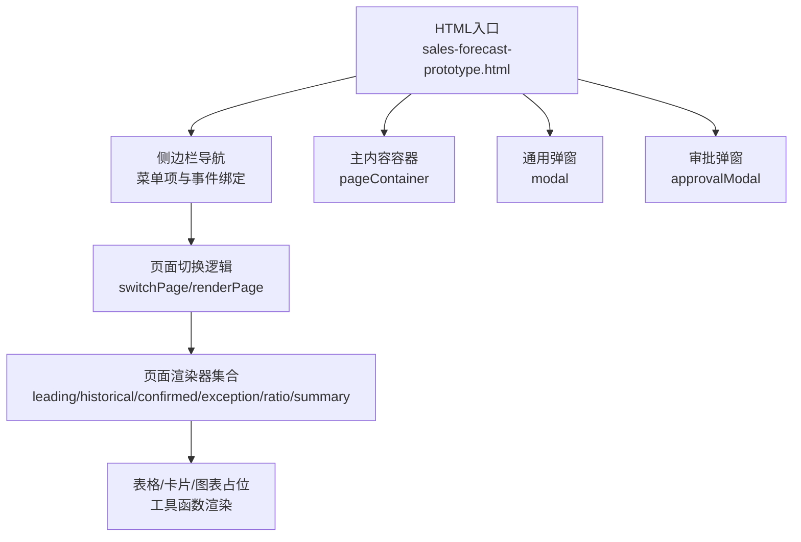
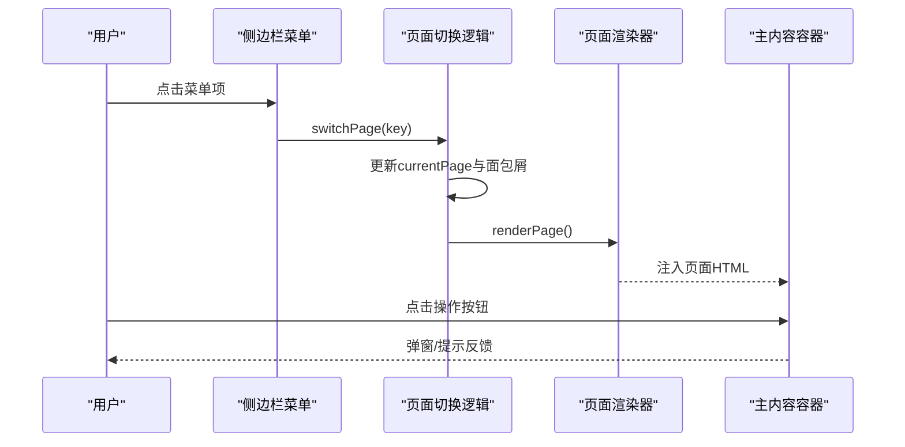
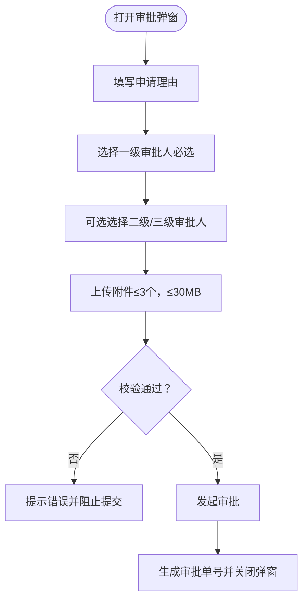
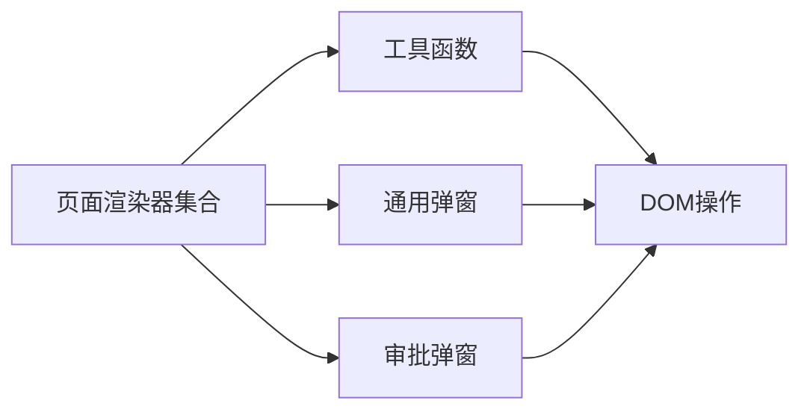

# 项目概述

<cite>
**本文档中引用的文件**   
- [sales-forecast-prototype.html](file://sales-forecast-prototype.html)
- [sales-forecast-prototype_副本.html](file://sales-forecast-prototype_副本.html)
</cite>

## 目录
1. [简介](#简介)
2. [项目结构](#项目结构)
3. [核心组件](#核心组件)
4. [架构总览](#架构总览)
5. [详细组件分析](#详细组件分析)
6. [依赖关系分析](#依赖关系分析)
7. [性能考量](#性能考量)
8. [故障排查指南](#故障排查指南)
9. [结论](#结论)
10. [附录：快速开始与测试](#附录快速开始与测试)

## 简介
本项目是一个零依赖的前端高保真原型，聚焦销售预测业务场景，提供先行指标预测、历史销售预测、确定性需求管理、例外需求处理、计算比例维护以及“3+9”需求汇总等核心模块。原型采用单页应用（SPA）架构，通过侧边导航切换页面，使用内联脚本与模板渲染实现数据展示与交互，无需后端即可运行体验完整流程。

## 项目结构
- 入口文件：单一HTML文件包含样式、结构与脚本，便于直接双击在浏览器中打开。
- 布局结构：左侧固定侧边栏（菜单）、顶部面包屑、右侧主内容区。
- 页面组织：以函数为单位的页面渲染器，按当前页面键值动态渲染到主内容容器。
- 弹窗体系：通用弹窗与审批专用弹窗，支持表单、附件上传与多级别审批人选择。
- 数据模型：以常量数组定义示例数据，覆盖各页面的表格与统计卡片。

图示来源
- [sales-forecast-prototype.html:108-126](file://sales-forecast-prototype.html#L108-L126)
- [sales-forecast-prototype.html:283-292](file://sales-forecast-prototype.html#L283-L292)
- [sales-forecast-prototype.html:127-139](file://sales-forecast-prototype.html#L127-L139)

章节来源
- [sales-forecast-prototype.html:1-126](file://sales-forecast-prototype.html#L1-L126)
- [sales-forecast-prototype_副本.html:1-133](file://sales-forecast-prototype_副本.html#L1-L133)

## 核心组件
- 导航与路由：侧边栏菜单项绑定点击事件，更新当前页面键并触发渲染。
- 页面渲染器：每个业务模块对应一个渲染函数，返回HTML字符串注入主容器。
- 表格与分页：统一的表格样式与分页组件，支持筛选查询条与每页条数选择。
- 统计卡片：关键指标以卡片形式展示，颜色与单位统一。
- 弹窗系统：通用弹窗用于新增/查看；审批弹窗支持多级审批人选择与附件上传。
- 工具函数：日期标签、状态徽章、来源标签、月份单元格对比、分页与查询条生成。

章节来源
- [sales-forecast-prototype.html:141-183](file://sales-forecast-prototype.html#L141-L183)
- [sales-forecast-prototype.html:283-292](file://sales-forecast-prototype.html#L283-L292)
- [sales-forecast-prototype.html:170-178](file://sales-forecast-prototype.html#L170-L178)

## 架构总览
本原型采用“单文件、无框架”的轻量架构：
- 视图层：HTML/CSS负责布局与样式，JS负责DOM操作与模板拼接。
- 控制层：页面切换与用户交互由内联事件处理器驱动。
- 数据层：内存中的常量数组作为示例数据源，不持久化。
- 交互模式：点击菜单切换页面，点击按钮触发弹窗或模拟操作（如提交审批）。

图示来源
- [sales-forecast-prototype.html:283-292](file://sales-forecast-prototype.html#L283-L292)
- [sales-forecast-prototype.html:127-139](file://sales-forecast-prototype.html#L127-L139)

## 详细组件分析

### 先行指标预测
- 功能要点：展示PMI、消费者信心指数、原材料价格指数及综合趋势；提供趋势图占位与月度数据表；支持年份与指标类型筛选。
- 交互要点：导出与生成预测按钮；分页与查询条。
- 数据结构：月度指标行数组，含趋势与权重。

章节来源
- [sales-forecast-prototype.html:295-304](file://sales-forecast-prototype.html#L295-L304)

### 历史销售预测
- 功能要点：对比实际与预测销售额，展示平均准确率与累计金额；柱状图占位；支持产品线、年份与准确率筛选。
- 交互要点：执行预测与导出；分页。
- 数据结构：月度对比行数组，含差异与增长率。

章节来源
- [sales-forecast-prototype.html:307-316](file://sales-forecast-prototype.html#L307-L316)

### 确定性需求
- 功能要点：订单级确定性需求列表，含客户、产品、数量、金额、交付日期与状态；堆叠图占位；支持状态、产品线与客户名称筛选。
- 交互要点：新增需求、导出；分页。
- 数据结构：订单行数组，含状态标签。

章节来源
- [sales-forecast-prototype.html:319-328](file://sales-forecast-prototype.html#L319-L328)

### 例外需求（双Tab）
- 功能要点：
  - 汇总表：按作战区域/国家/机型/产品维度展示M月~M+12的修改前后对比，支持导出。
  - 明细表：全量字段展示，含审批状态、运输方式、贸易术语、客户信息等；支持新增、编辑、删除、导入、下载模板。
- 交互要点：Tab切换、批量选择、状态统计卡片、审批流相关按钮。
- 数据结构：汇总行与明细行数组，含月份对比对象与审批状态。

章节来源
- [sales-forecast-prototype.html:331-365](file://sales-forecast-prototype.html#L331-L365)

### 计算比例维护
- 功能要点：维护历史销售预测在不同时间段的分配比例（M、M1、M2~M4、M5~M6、M7~M12），支持启用/停用与查看详情。
- 交互要点：新增、删除、导出；状态切换；分页。
- 数据结构：比例维护行数组，含创建时间与状态。

章节来源
- [sales-forecast-prototype.html:368-382](file://sales-forecast-prototype.html#L368-L382)

### 销售预测3+9需求汇总（四Tab）
- 功能要点：
  - 大区维度：按大区/机型/产品维度展示12个月份修改前后对比。
  - 国区维度：下钻至国区维度，支持继续下钻。
  - 国家维度：下钻至国家维度，点击月份单元格可弹出该月明细。
  - 明细表：聚合来自确定性需求、例外需求、历史销售预测的多来源数据，展示版本、单据号、审批单号、状态流转说明等。
- 交互要点：发布、提交审批、撤回、废弃、删除、导出；状态标签与流转说明。
- 数据结构：三张维度表与一张明细表，均含月份对比对象与多维编码/名称。

章节来源
- [sales-forecast-prototype.html:385-453](file://sales-forecast-prototype.html#L385-L453)

### 审批弹窗与附件上传
- 功能要点：
  - 申请理由必填校验。
  - 三级审批人选择：一级必选（多选，串行审批），二级/三级可选（多选）。
  - 附件上传：限制格式与大小（≤30MB），最多3个文件。
  - 提交后生成审批单号并提示数据状态更新为“审批中”。
- 交互要点：添加/移除审批人、文件列表管理与移除、提交校验与反馈。

图示来源
- [sales-forecast-prototype.html:185-280](file://sales-forecast-prototype.html#L185-L280)

章节来源
- [sales-forecast-prototype.html:185-280](file://sales-forecast-prototype.html#L185-L280)

## 依赖关系分析
- 页面渲染器之间相互独立，通过renderPage映射表进行调用，降低耦合。
- 工具函数被多个页面复用，提升一致性。
- 弹窗与审批弹窗共享DOM节点，避免重复结构。
- 数据均为内存常量，无外部依赖或网络请求。

图示来源
- [sales-forecast-prototype.html:283-292](file://sales-forecast-prototype.html#L283-L292)
- [sales-forecast-prototype.html:170-183](file://sales-forecast-prototype.html#L170-L183)

章节来源
- [sales-forecast-prototype.html:283-292](file://sales-forecast-prototype.html#L283-L292)
- [sales-forecast-prototype.html:170-183](file://sales-forecast-prototype.html#L170-L183)

## 性能考量
- 渲染策略：每次切换页面时重新拼接HTML字符串并注入容器，适合小规模数据与原型演示。
- 表格宽度：部分明细表设置最小宽度以横向滚动，避免布局挤压。
- 交互开销：弹窗与附件上传在前端完成，无网络IO，响应迅速。
- 可扩展性建议：若数据量增长，可引入虚拟滚动与按需渲染以提升性能。

[本节为通用指导，不直接分析具体文件]

## 故障排查指南
- 页面空白：检查页面容器ID是否正确，确保renderPage被调用。
- 弹窗不显示：确认modal或approvalModal的类名切换逻辑是否生效。
- 附件上传失败：检查文件大小与格式限制逻辑，确认input的accept属性。
- 审批提交未通过：校验申请理由与一级审批人是否已填写/选择。

章节来源
- [sales-forecast-prototype.html:179-183](file://sales-forecast-prototype.html#L179-L183)
- [sales-forecast-prototype.html:263-280](file://sales-forecast-prototype.html#L263-L280)

## 结论
该原型以极简架构实现了完整的销售预测业务流程体验，涵盖从指标预测、历史对比、确定性需求、例外处理、比例维护到“3+9”汇总的全链路。其零依赖、单文件特性便于快速部署与演示，同时具备良好的扩展基础，可在后续迭代中接入真实数据与后端服务。

[本节为总结性内容，不直接分析具体文件]

## 附录：快速开始与测试
- 运行方式：直接在浏览器中打开 sales-forecast-prototype.html 即可体验全部功能。
- 基本操作：
  - 侧边栏点击切换页面。
  - 在各页面中使用查询条与分页进行数据浏览。
  - 在“例外需求”与“3+9汇总”中尝试新增、编辑、删除与导入等操作。
  - 在“例外需求”或“3+9汇总”中点击“提交审批”，进入审批弹窗完成多级审批人选择与附件上传。
- 测试要点：
  - 页面切换与面包屑更新是否正常。
  - 弹窗打开/关闭与表单校验是否生效。
  - 附件上传限制（数量与大小）是否符合预期。
  - 状态标签与来源标签渲染是否正确。

章节来源
- [sales-forecast-prototype.html:108-126](file://sales-forecast-prototype.html#L108-L126)
- [sales-forecast-prototype.html:283-292](file://sales-forecast-prototype.html#L283-L292)
- [sales-forecast-prototype.html:185-280](file://sales-forecast-prototype.html#L185-L280)