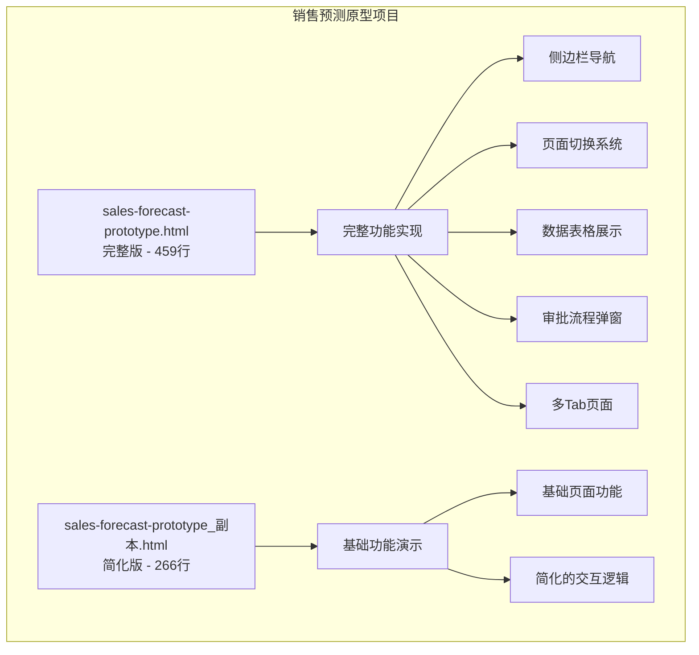
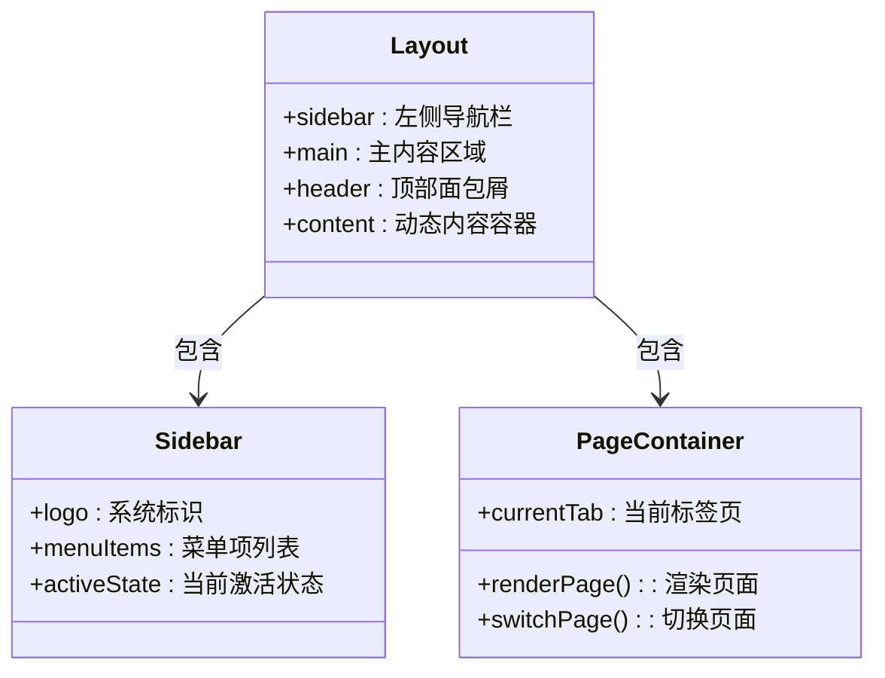
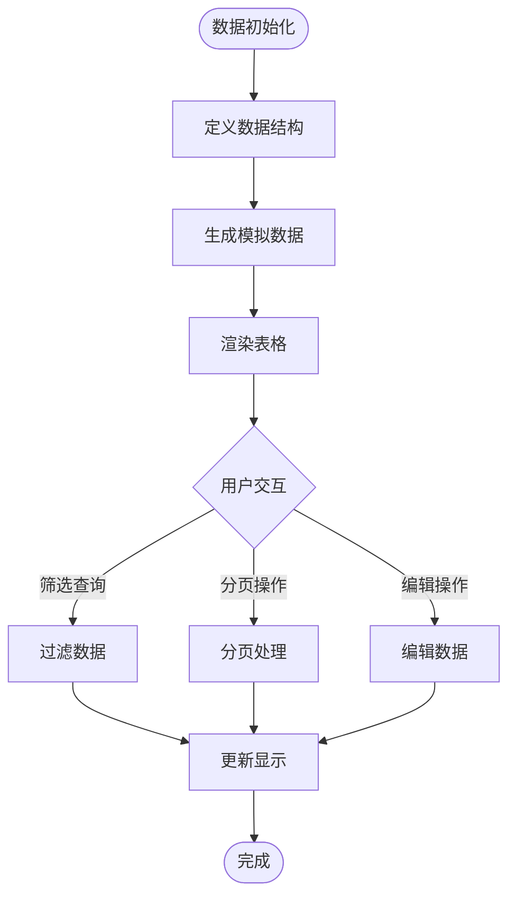
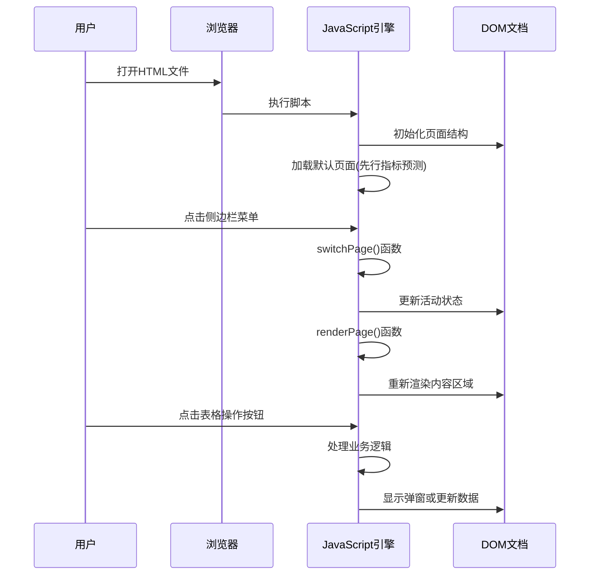
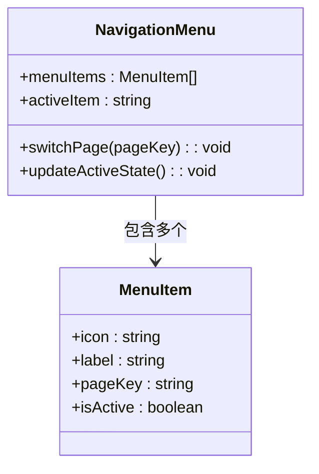
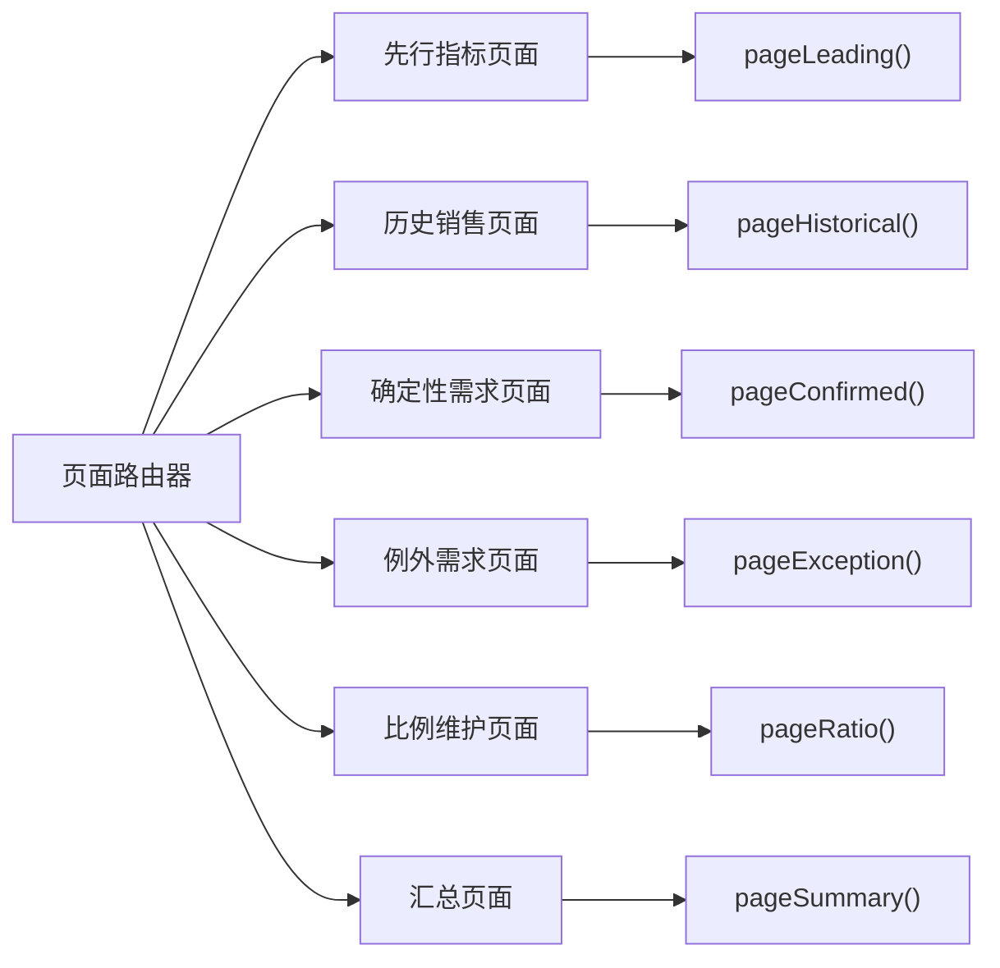
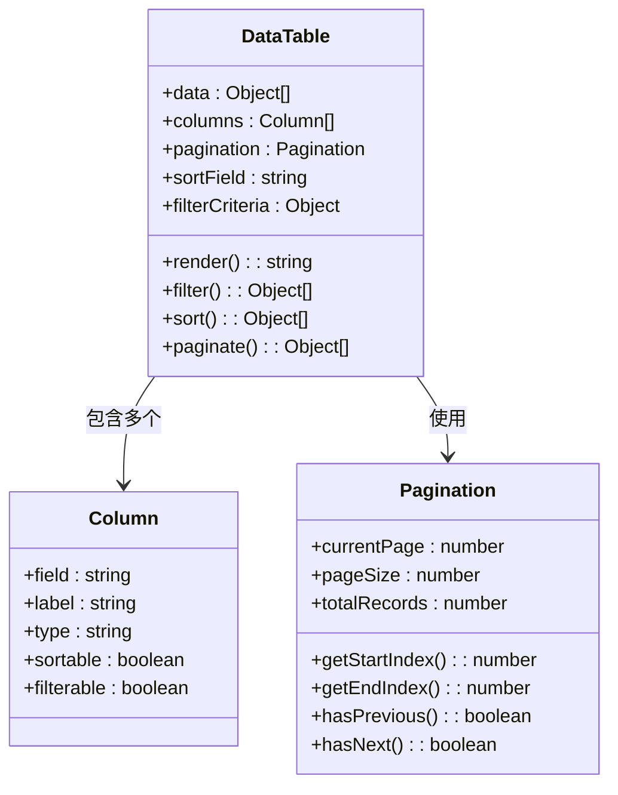
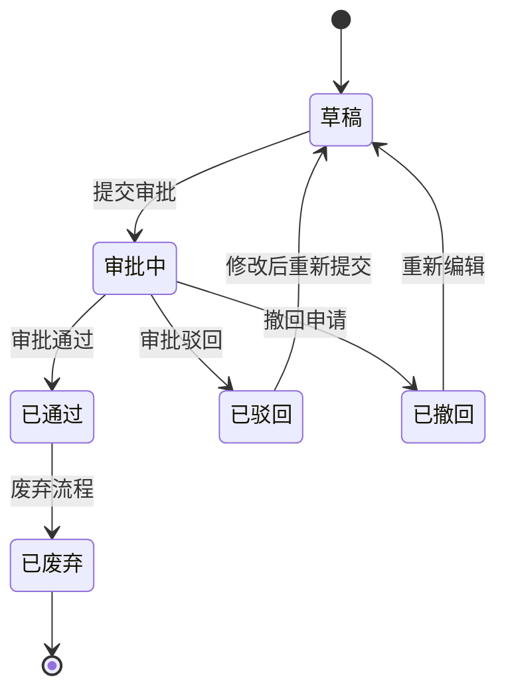
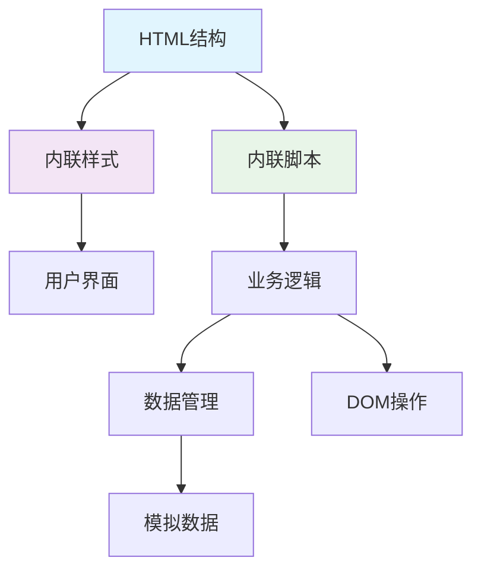

# 快速开始

<cite>
**本文档引用的文件**   
- [sales-forecast-prototype.html](file://sales-forecast-prototype.html)
- [sales-forecast-prototype_副本.html](file://sales-forecast-prototype_副本.html)
</cite>

## 目录
1. [简介](#简介)
2. [项目结构](#项目结构)
3. [核心组件](#核心组件)
4. [架构概览](#架构概览)
5. [详细组件分析](#详细组件分析)
6. [依赖关系分析](#依赖关系分析)
7. [性能考虑](#性能考虑)
8. [故障排除指南](#故障排除指南)
9. [结论](#结论)

## 简介

智能销售预测系统是一个高保真单文件HTML原型，用于展示完整的销售预测业务流程。该系统包含六个主要功能模块：先行指标预测、历史销售预测、确定性需求、例外需求、计算比例维护和3+9需求汇总。

本快速开始指南将帮助您快速了解和使用这个原型系统，包括两个版本的区别说明和基本操作流程。

## 项目结构

该项目由两个单文件HTML原型组成：



**图表来源** 
- [sales-forecast-prototype.html:1-459](file://sales-forecast-prototype.html#L1-L459)
- [sales-forecast-prototype_副本.html:1-266](file://sales-forecast-prototype_副本.html#L1-L266)

### 版本对比

| 特性 | 完整版 (459行) | 简化版 (266行) |
|------|---------------|---------------|
| 文件大小 | 较大，功能完整 | 较小，精简实用 |
| 审批流程 | 完整的三级审批人选择 | 基础审批按钮 |
| 附件上传 | 支持文件上传和预览 | 无此功能 |
| 页面数量 | 6个完整页面 | 3个基础页面 |
| 交互复杂度 | 高级交互体验 | 基础交互 |
| 适用场景 | 完整演示和学习 | 快速演示和教学 |

**章节来源**
- [sales-forecast-prototype.html:1-459](file://sales-forecast-prototype.html#L1-L459)
- [sales-forecast-prototype_副本.html:1-266](file://sales-forecast-prototype_副本.html#L1-L266)

## 核心组件

### 布局系统
系统采用现代化的响应式布局设计：



**图表来源** 
- [sales-forecast-prototype.html:108-126](file://sales-forecast-prototype.html#L108-L126)

### 数据管理
系统使用JavaScript对象存储和管理所有业务数据：



**图表来源** 
- [sales-forecast-prototype.html:141-178](file://sales-forecast-prototype.html#L141-L178)

**章节来源**
- [sales-forecast-prototype.html:108-126](file://sales-forecast-prototype.html#L108-L126)
- [sales-forecast-prototype.html:141-178](file://sales-forecast-prototype.html#L141-L178)

## 架构概览

系统采用单页应用(SPA)架构，通过JavaScript动态渲染不同页面：



**图表来源** 
- [sales-forecast-prototype.html:282-292](file://sales-forecast-prototype.html#L282-L292)

## 详细组件分析

### 侧边栏导航系统

侧边栏是系统的核心导航组件，提供六个主要功能入口：



**图表来源** 
- [sales-forecast-prototype.html:109-121](file://sales-forecast-prototype.html#L109-L121)

#### 导航功能说明

1. **先行指标预测** - 展示PMI指数、消费者信心指数等经济指标
2. **历史销售预测** - 对比实际销售与预测数据的准确性
3. **确定性需求** - 管理已确认的订单和需求
4. **例外需求** - 处理特殊情况和紧急需求
5. **计算比例维护** - 配置预测算法的比例参数
6. **3+9需求汇总** - 多维度汇总展示销售预测数据

**章节来源**
- [sales-forecast-prototype.html:109-121](file://sales-forecast-prototype.html#L109-L121)

### 页面渲染系统

系统采用函数式页面渲染模式，每个页面都有对应的渲染函数：



**图表来源** 
- [sales-forecast-prototype.html:289-292](file://sales-forecast-prototype.html#L289-L292)

### 数据表格组件

系统实现了丰富的表格功能，支持排序、筛选、分页等操作：



**图表来源** 
- [sales-forecast-prototype.html:53-72](file://sales-forecast-prototype.html#L53-L72)

### 审批流程系统

完整版包含完整的三级审批流程：



**图表来源** 
- [sales-forecast-prototype.html:184-280](file://sales-forecast-prototype.html#L184-L280)

**章节来源**
- [sales-forecast-prototype.html:289-292](file://sales-forecast-prototype.html#L289-L292)
- [sales-forecast-prototype.html:184-280](file://sales-forecast-prototype.html#L184-L280)

## 依赖关系分析

系统采用内联样式和脚本，无外部依赖：



**图表来源** 
- [sales-forecast-prototype.html:1-10](file://sales-forecast-prototype.html#L1-L10)

### 内部依赖关系

1. **工具函数依赖** - 通用函数被各个页面组件复用
2. **数据模型依赖** - 统一的日期格式和数据转换
3. **UI组件依赖** - 标准化的按钮、表格、弹窗组件
4. **事件处理依赖** - 统一的事件绑定和处理机制

**章节来源**
- [sales-forecast-prototype.html:141-178](file://sales-forecast-prototype.html#L141-L178)

## 性能考虑

### 优化策略

1. **内存管理** - 使用局部变量减少全局污染
2. **DOM操作优化** - 批量更新DOM元素
3. **事件委托** - 减少事件监听器数量
4. **懒加载** - 按需渲染页面内容

### 性能特点

- **首屏加载** - 单文件加载，无网络请求
- **内存占用** - 轻量级JavaScript代码
- **渲染性能** - 字符串拼接优于DOM操作
- **交互响应** - 即时反馈，无延迟

## 故障排除指南

### 常见问题及解决方案

1. **页面无法显示**
   - 检查浏览器兼容性（支持现代浏览器）
   - 确认文件编码为UTF-8
   - 验证HTML语法正确性

2. **交互功能失效**
   - 检查JavaScript控制台错误
   - 确认事件绑定是否正确
   - 验证DOM元素是否存在

3. **数据显示异常**
   - 检查数据格式是否正确
   - 验证数组索引是否越界
   - 确认字符串模板语法

### 调试技巧

```javascript
// 在浏览器控制台中使用以下命令进行调试
console.log(currentPage); // 查看当前页面
console.log(currentTab);  // 查看当前标签页
document.querySelectorAll('.menu-item'); // 检查菜单元素
```

**章节来源**
- [sales-forecast-prototype.html:148-178](file://sales-forecast-prototype.html#L148-L178)

## 结论

智能销售预测系统原型提供了一个完整的功能演示平台，适合用于产品演示、需求讨论和技术学习。两个版本分别满足不同场景的需求：

- **完整版**适合深入学习系统架构和完整业务流程
- **简化版**适合快速演示和基础功能展示

通过本快速开始指南，新用户可以在5分钟内掌握系统的基本使用方法，理解销售预测的核心业务流程，并为后续的深度学习和定制开发奠定基础。

系统的设计充分考虑了用户体验和可维护性，采用了现代化的前端技术栈和最佳实践，为构建企业级销售预测系统提供了良好的参考模板。