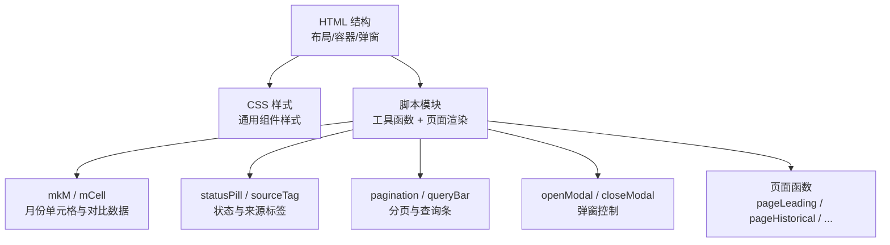
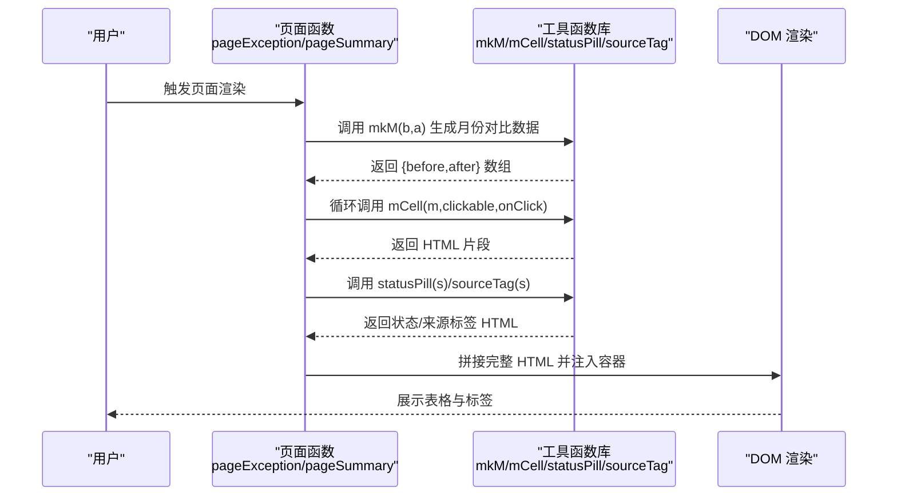
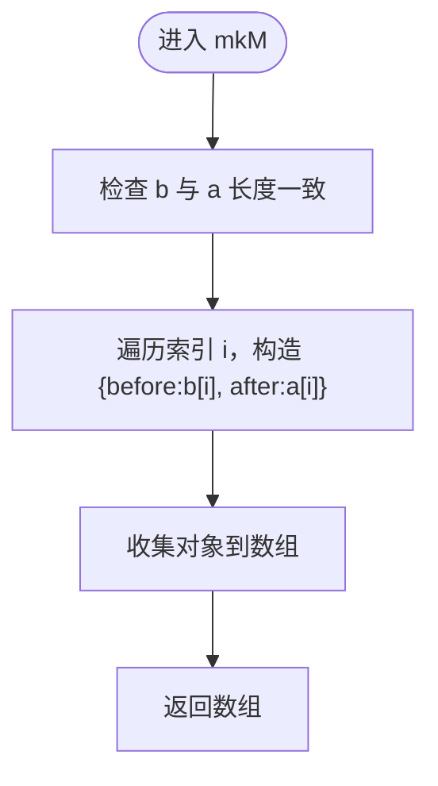
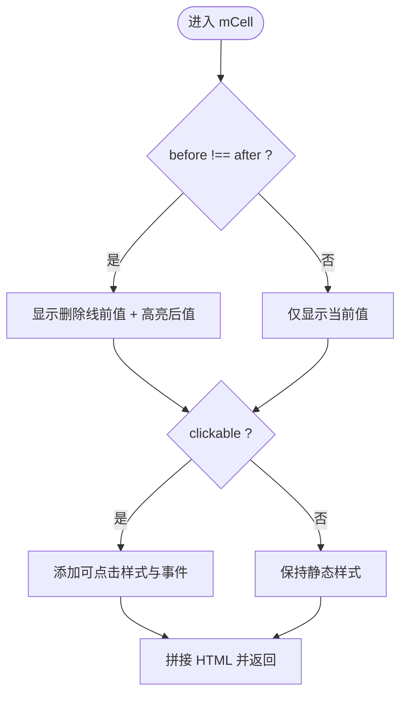
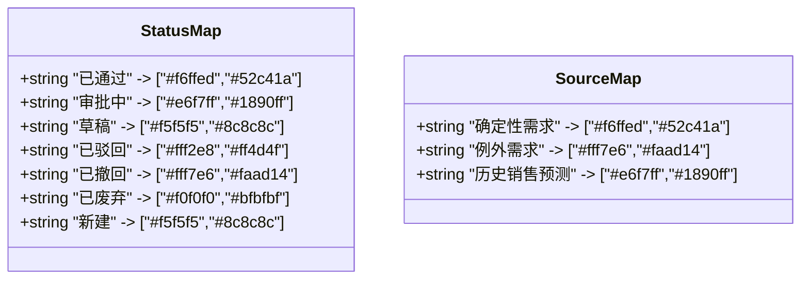
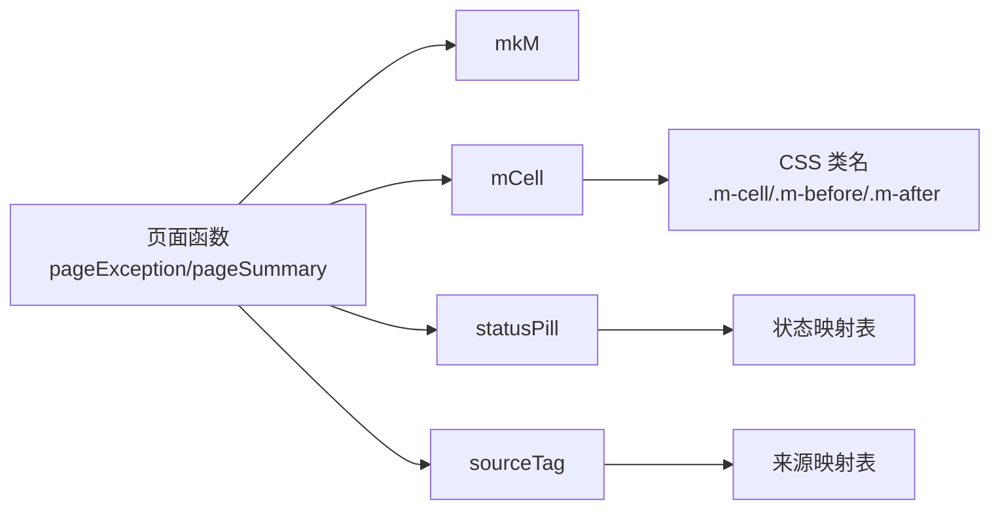

# 工具函数库

<cite>
**本文引用的文件**   
- [sales-forecast-prototype.html](file://sales-forecast-prototype.html)
- [sales-forecast-prototype_副本.html](file://sales-forecast-prototype_副本.html)
</cite>

## 目录
1. [简介](#简介)
2. [项目结构](#项目结构)
3. [核心组件](#核心组件)
4. [架构总览](#架构总览)
5. [详细组件分析](#详细组件分析)
6. [依赖关系分析](#依赖关系分析)
7. [性能考量](#性能考量)
8. [故障排查指南](#故障排查指南)
9. [结论](#结论)
10. [附录](#附录)

## 简介
本技术文档聚焦于销售预测原型中的“工具函数库”，重点解析 mkM、mCell、statusPill、sourceTag 等核心工具函数的实现原理与使用方法，并说明它们如何简化 UI 组件生成、数据格式化与状态显示。文档同时提供参数说明、返回值格式、使用示例以及自定义工具函数的开发规范（命名、参数校验、错误处理最佳实践），帮助开发者快速扩展与维护该原型工具集。

## 项目结构
该原型为单页 HTML 应用，包含：
- 全局样式与布局（侧边栏、主内容区、弹窗）
- 页面渲染逻辑（多页面/多 Tab 切换）
- 工具函数库（UI 组件生成、数据格式化、状态标签渲染）
- 交互逻辑（弹窗、审批流程、分页、查询条）

图表来源
- [sales-forecast-prototype.html:108-126](file://sales-forecast-prototype.html#L108-L126)
- [sales-forecast-prototype.html:140-188](file://sales-forecast-prototype.html#L140-L188)

章节来源
- [sales-forecast-prototype.html:108-126](file://sales-forecast-prototype.html#L108-L126)
- [sales-forecast-prototype.html:140-188](file://sales-forecast-prototype.html#L140-L188)

## 核心组件
本节对四个核心工具函数进行深度解析：mkM、mCell、statusPill、sourceTag。

### mkM：月份对比数据结构生成器
- 作用：将“修改前”和“修改后”两个数值数组按索引配对，生成统一的数据结构，便于后续渲染对比单元格。
- 输入参数：
  - b：number[]，修改前的值数组（长度 N）
  - a：number[]，修改后的值数组（长度 N）
- 返回结果：Array<{before:number, after:number}>，长度为 N 的对象数组，每个对象包含 before 与 after 字段。
- 复杂度：时间 O(N)，空间 O(N)。
- 典型用法：在表格中渲染 M月~M+12 的对比列，配合 mCell 展示差异高亮。
- 使用示例路径：[sales-forecast-prototype.html:332-335](file://sales-forecast-prototype.html#L332-L335)、[sales-forecast-prototype.html:386-391](file://sales-forecast-prototype.html#L386-L391)、[sales-forecast-prototype.html:394-397](file://sales-forecast-prototype.html#L394-L397)、[sales-forecast-prototype.html:400-402](file://sales-forecast-prototype.html#L400-L402)

章节来源
- [sales-forecast-prototype.html:150](file://sales-forecast-prototype.html#L150)
- [sales-forecast-prototype.html:332-335](file://sales-forecast-prototype.html#L332-L335)
- [sales-forecast-prototype.html:386-391](file://sales-forecast-prototype.html#L386-L391)
- [sales-forecast-prototype.html:394-397](file://sales-forecast-prototype.html#L394-L397)
- [sales-forecast-prototype.html:400-402](file://sales-forecast-prototype.html#L400-L402)

### mCell：月份对比单元格渲染器
- 作用：根据传入的 {before, after} 数据渲染一个可点击或静态的单元格，自动判断是否变化并差异化显示。
- 输入参数：
  - m：{before:number, after:number}，由 mkM 生成的单个月份对比对象
  - clickable：boolean，是否可点击（默认 false）
  - onClick：string|undefined，点击时执行的 onclick 表达式字符串（可选）
- 返回结果：HTML 字符串，包含前后值与样式类名；当 before !== after 时，会显示删除线与高亮的新值。
- 复杂度：时间 O(1)，空间 O(1)。
- 典型用法：在表格列中循环渲染每个月的对比单元格，支持点击查看详情。
- 使用示例路径：[sales-forecast-prototype.html:354](file://sales-forecast-prototype.html#L354)、[sales-forecast-prototype.html:427](file://sales-forecast-prototype.html#L427)、[sales-forecast-prototype.html:435](file://sales-forecast-prototype.html#L435)、[sales-forecast-prototype.html:443](file://sales-forecast-prototype.html#L443)

章节来源
- [sales-forecast-prototype.html:151-156](file://sales-forecast-prototype.html#L151-L156)
- [sales-forecast-prototype.html:354](file://sales-forecast-prototype.html#L354)
- [sales-forecast-prototype.html:427](file://sales-forecast-prototype.html#L427)
- [sales-forecast-prototype.html:435](file://sales-forecast-prototype.html#L435)
- [sales-forecast-prototype.html:443](file://sales-forecast-prototype.html#L443)

### statusPill：状态胶囊渲染器
- 作用：根据状态文本生成带背景色与前景色的胶囊标签，用于展示审批状态等。
- 输入参数：
  - s：string，状态文本（如“已通过”“审批中”“草稿”“已驳回”“已撤回”“已废弃”“新建”）
- 返回结果：HTML 字符串，包含  及内联样式（背景与文字颜色）。
- 映射规则：内置状态到颜色的映射表，未匹配则回退到灰色。
- 复杂度：时间 O(1)，空间 O(1)。
- 典型用法：在明细表中渲染审批状态列。
- 使用示例路径：[sales-forecast-prototype.html:362](file://sales-forecast-prototype.html#L362)、[sales-forecast-prototype.html:451](file://sales-forecast-prototype.html#L451)

章节来源
- [sales-forecast-prototype.html:157-161](file://sales-forecast-prototype.html#L157-L161)
- [sales-forecast-prototype.html:362](file://sales-forecast-prototype.html#L362)
- [sales-forecast-prototype.html:451](file://sales-forecast-prototype.html#L451)

### sourceTag：来源标签渲染器
- 作用：根据数据来源类型生成带样式的标签，用于区分“确定性需求”“例外需求”“历史销售预测”。
- 输入参数：
  - s：string，来源类型文本
- 返回结果：HTML 字符串，包含  及内联样式（背景与文字颜色）。
- 映射规则：内置来源类型到颜色的映射表，未匹配则回退到灰色。
- 复杂度：时间 O(1)，空间 O(1)。
- 典型用法：在汇总明细表中渲染数据来源列。
- 使用示例路径：[sales-forecast-prototype.html:443](file://sales-forecast-prototype.html#L443)、[sales-forecast-prototype.html:451](file://sales-forecast-prototype.html#L451)

章节来源
- [sales-forecast-prototype.html:162-166](file://sales-forecast-prototype.html#L162-L166)
- [sales-forecast-prototype.html:443](file://sales-forecast-prototype.html#L443)
- [sales-forecast-prototype.html:451](file://sales-forecast-prototype.html#L451)

## 架构总览
工具函数库与页面渲染的关系如下：
- 数据层：业务数据以数组形式定义，其中月份对比数据通过 mkM 生成结构化对象。
- 视图层：各页面函数（如 pageException、pageSummary）通过模板字符串拼接 HTML，调用 mCell、statusPill、sourceTag 等工具函数生成 UI 片段。
- 交互层：分页、查询条、弹窗等通用交互由 pagination、queryBar、openModal/closeModal 等工具函数提供。

图表来源
- [sales-forecast-prototype.html:332-335](file://sales-forecast-prototype.html#L332-L335)
- [sales-forecast-prototype.html:354](file://sales-forecast-prototype.html#L354)
- [sales-forecast-prototype.html:427](file://sales-forecast-prototype.html#L427)
- [sales-forecast-prototype.html:443](file://sales-forecast-prototype.html#L443)
- [sales-forecast-prototype.html:451](file://sales-forecast-prototype.html#L451)

## 详细组件分析

### mkM 流程图

图表来源
- [sales-forecast-prototype.html:150](file://sales-forecast-prototype.html#L150)

章节来源
- [sales-forecast-prototype.html:150](file://sales-forecast-prototype.html#L150)

### mCell 渲染逻辑
- 判断是否变化：比较 before 与 after
- 动态类名：clickable 为真时添加可点击样式
- 事件绑定：onClick 非空时注入 onclick 属性
- 差异高亮：变化时显示删除线的前值与高亮的后值

图表来源
- [sales-forecast-prototype.html:151-156](file://sales-forecast-prototype.html#L151-L156)

章节来源
- [sales-forecast-prototype.html:151-156](file://sales-forecast-prototype.html#L151-L156)

### statusPill 与 sourceTag 映射表
- statusPill：状态→颜色映射（背景与前景）
- sourceTag：来源类型→颜色映射（背景与前景）
- 未匹配状态/来源时，回退到灰色默认样式

图表来源
- [sales-forecast-prototype.html:157-166](file://sales-forecast-prototype.html#L157-L166)

章节来源
- [sales-forecast-prototype.html:157-166](file://sales-forecast-prototype.html#L157-L166)

## 依赖关系分析
- 工具函数之间低耦合：mkM 不依赖其他工具；mCell 依赖 CSS 类名；statusPill/sourceTag 依赖各自映射表。
- 页面函数依赖工具函数：pageException/pageSummary 等通过模板字符串调用工具函数生成 HTML。
- 无外部依赖：纯前端 HTML/CSS/JS，无需第三方库。

图表来源
- [sales-forecast-prototype.html:332-335](file://sales-forecast-prototype.html#L332-L335)
- [sales-forecast-prototype.html:354](file://sales-forecast-prototype.html#L354)
- [sales-forecast-prototype.html:427](file://sales-forecast-prototype.html#L427)
- [sales-forecast-prototype.html:443](file://sales-forecast-prototype.html#L443)
- [sales-forecast-prototype.html:451](file://sales-forecast-prototype.html#L451)

章节来源
- [sales-forecast-prototype.html:332-335](file://sales-forecast-prototype.html#L332-L335)
- [sales-forecast-prototype.html:354](file://sales-forecast-prototype.html#L354)
- [sales-forecast-prototype.html:427](file://sales-forecast-prototype.html#L427)
- [sales-forecast-prototype.html:443](file://sales-forecast-prototype.html#L443)
- [sales-forecast-prototype.html:451](file://sales-forecast-prototype.html#L451)

## 性能考量
- 时间复杂度：mkM 为 O(N)，mCell/statusPill/sourceTag 为 O(1)，整体渲染线性于数据量。
- 内存占用：mkM 生成新数组，注意大数据量时的内存开销。
- 渲染优化：避免频繁 DOM 操作，尽量批量拼接 HTML 后一次性注入。
- 可扩展性：新增状态/来源类型只需更新映射表，不影响其他逻辑。

## 故障排查指南
- 数据长度不一致：mkM 要求 b 与 a 长度相同，否则会导致索引越界或渲染异常。
- 未匹配状态/来源：statusPill/sourceTag 未命中映射时会回退到灰色，需检查传入值是否正确。
- 点击事件无效：mCell 的 onClick 需要传入有效的 onclick 表达式字符串，确保上下文与作用域正确。
- 样式缺失：确认 CSS 类名 .m-cell/.m-before/.m-after/.pill/.tag 存在且未被覆盖。

章节来源
- [sales-forecast-prototype.html:150](file://sales-forecast-prototype.html#L150)
- [sales-forecast-prototype.html:151-156](file://sales-forecast-prototype.html#L151-L156)
- [sales-forecast-prototype.html:157-166](file://sales-forecast-prototype.html#L157-L166)

## 结论
mkM、mCell、statusPill、sourceTag 构成了销售预测原型的核心工具函数库，分别负责数据格式化、单元格渲染、状态与来源标签生成。它们以低耦合、高内聚的方式支撑页面渲染与交互，提升了代码复用性与可维护性。遵循本文提供的开发规范与最佳实践，开发者可以安全地扩展工具集，满足更多 UI 组件与数据展示需求。

## 附录

### 自定义工具函数开发指南
- 命名规范：
  - 动词+名词：如 renderStatus、formatSource
  - 短小精悍：避免过长名称，保持可读性
- 参数验证：
  - 前置校验：检查必填参数类型与范围（如数组长度、字符串非空）
  - 默认值：为可选参数提供合理默认值
- 错误处理：
  - 抛出明确错误信息（如 InvalidInputError）
  - 降级策略：未知状态/来源回退到默认样式
- 返回值：
  - 明确返回类型（字符串、对象、数组）
  - 避免副作用：尽量纯函数设计
- 测试建议：
  - 单元测试：覆盖边界条件与异常路径
  - 集成测试：与页面渲染流程联合验证

章节来源
- [sales-forecast-prototype.html:150](file://sales-forecast-prototype.html#L150)
- [sales-forecast-prototype.html:151-156](file://sales-forecast-prototype.html#L151-L156)
- [sales-forecast-prototype.html:157-166](file://sales-forecast-prototype.html#L157-L166)