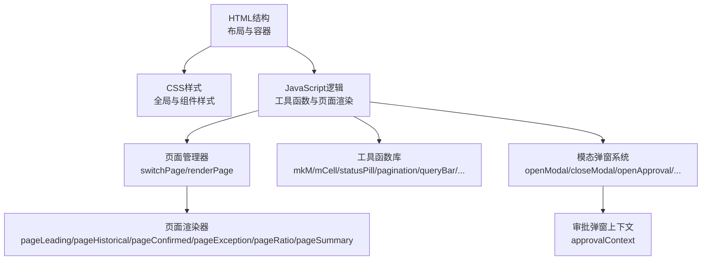
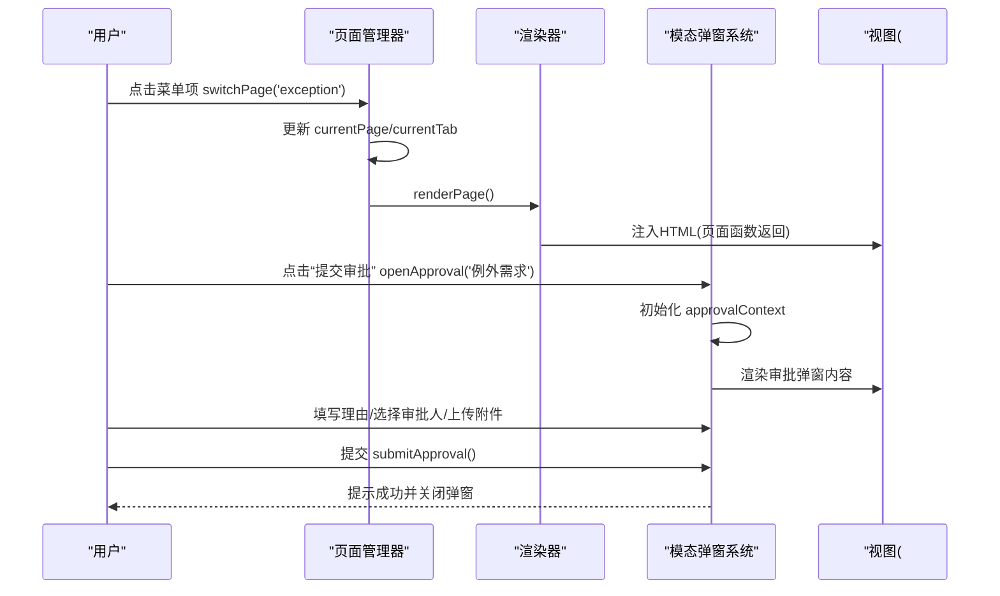
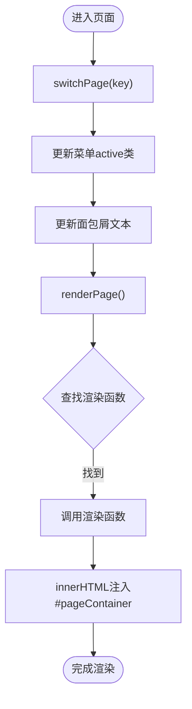
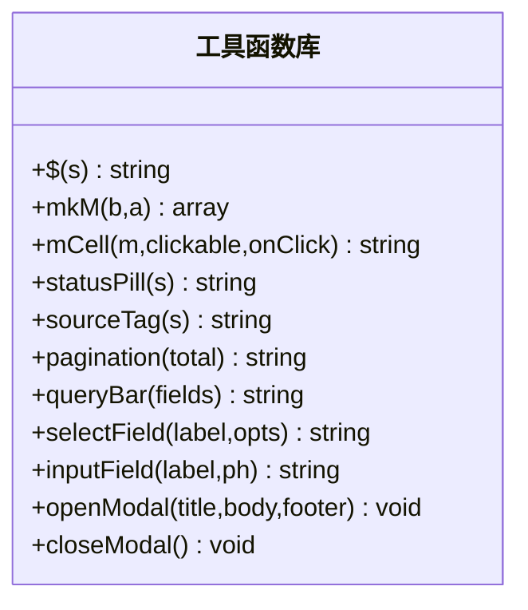
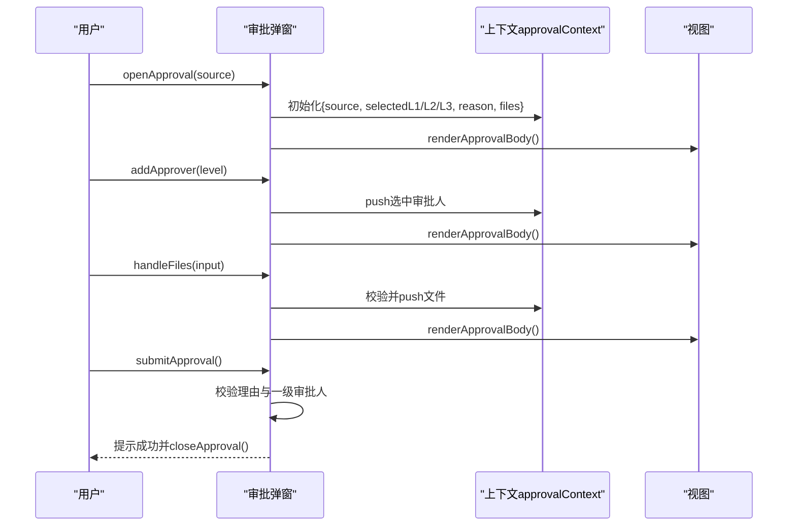
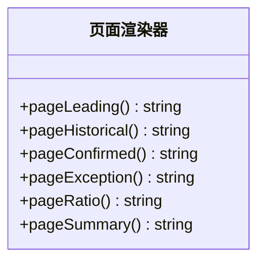
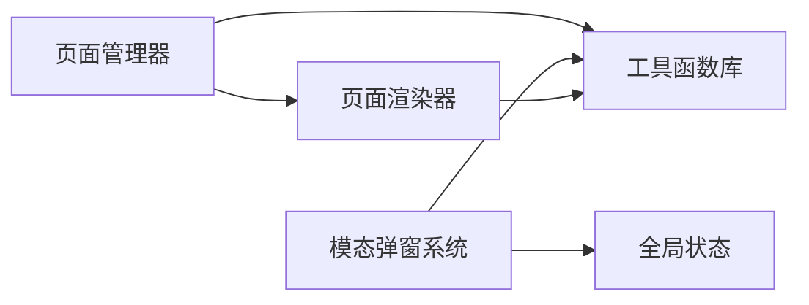

# 技术架构

<cite>
**本文档引用的文件**
- [sales-forecast-prototype.html](file://sales-forecast-prototype.html)
- [sales-forecast-prototype_副本.html](file://sales-forecast-prototype_副本.html)
</cite>

## 目录
1. [简介](#简介)
2. [项目结构](#项目结构)
3. [核心组件](#核心组件)
4. [架构总览](#架构总览)
5. [详细组件分析](#详细组件分析)
6. [依赖关系分析](#依赖关系分析)
7. [性能考虑](#性能考虑)
8. [故障排查指南](#故障排查指南)
9. [结论](#结论)
10. [附录：扩展与维护指南](#附录扩展与维护指南)

## 简介
本技术架构文档面向“智能销售预测系统”的高保真原型，聚焦于单页应用（SPA）的架构设计、数据流与组件关系，涵盖页面管理系统、工具函数库、模态弹窗系统。系统采用函数式编程风格、模块化组织、声明式UI与数据驱动渲染，提供统一的DOM操作策略、事件处理机制、状态管理模式与性能优化建议，帮助开发者快速扩展与维护。

## 项目结构
该原型为单HTML文件实现，包含样式、模板与脚本三部分，按职责划分为：
- 全局样式与布局：侧边栏、头部、内容区、通用组件样式
- 页面容器与路由：通过JS切换页面，渲染到主内容区
- 工具函数库：DOM选择器、表格单元格、分页、查询栏、表单字段、模态框等
- 页面渲染器：每个业务页面一个函数，返回声明式HTML字符串
- 模态弹窗系统：通用弹窗与审批弹窗，管理上下文与交互流程

图表来源
- [sales-forecast-prototype.html:108-126](file://sales-forecast-prototype.html#L108-L126)
- [sales-forecast-prototype.html:140-188](file://sales-forecast-prototype.html#L140-L188)
- [sales-forecast-prototype.html:282-292](file://sales-forecast-prototype.html#L282-L292)

章节来源
- [sales-forecast-prototype.html:1-126](file://sales-forecast-prototype.html#L1-L126)
- [sales-forecast-prototype_副本.html:1-133](file://sales-forecast-prototype_副本.html#L1-L133)

## 核心组件
- 页面管理系统
  - 入口：switchPage(key)更新当前页面与菜单高亮，renderPage()根据映射表调用对应渲染函数，将结果注入#pageContainer
  - 映射：pages对象维护页面键到渲染函数的映射，支持新增页面时仅增加映射与渲染函数
- 工具函数库
  - DOM选择器：$(s)封装querySelector
  - 数据转换：mkM(b,a)生成前后对比数组
  - UI组件：mCell、statusPill、sourceTag、pagination、queryBar、selectField、inputField
  - 弹窗控制：openModal、closeModal
- 模态弹窗系统
  - 通用弹窗：标题、内容、底部按钮区域，动态插入HTML
  - 审批弹窗：独立上下文approvalContext，支持多级审批人选择、附件上传、校验与提交

章节来源
- [sales-forecast-prototype.html:148-188](file://sales-forecast-prototype.html#L148-L188)
- [sales-forecast-prototype.html:282-292](file://sales-forecast-prototype.html#L282-L292)
- [sales-forecast-prototype.html:184-280](file://sales-forecast-prototype.html#L184-L280)

## 架构总览
系统采用“数据驱动+声明式渲染”的函数式架构：
- 数据层：常量与静态数据定义（如M_LABELS、PAGE_NAMES、SCM_USERS、各页面数据数组）
- 渲染层：每个页面函数返回HTML字符串，由renderPage统一注入
- 交互层：事件直接绑定在HTML字符串中（onclick），触发工具函数或页面逻辑
- 状态层：currentPage、currentTab、approvalContext作为全局状态，驱动视图更新

图表来源
- [sales-forecast-prototype.html:282-292](file://sales-forecast-prototype.html#L282-L292)
- [sales-forecast-prototype.html:184-280](file://sales-forecast-prototype.html#L184-L280)

## 详细组件分析

### 页面管理系统
- 职责：维护当前页面与标签状态，负责菜单高亮与面包屑更新，调度渲染
- 关键流程：
  - switchPage(key)：设置currentPage，更新菜单active类，更新面包屑文本，调用renderPage
  - renderPage()：根据currentPage从pages映射获取渲染函数，执行后拼接stack容器，写入#pageContainer
- 扩展点：新增页面需添加菜单项、PAGE_NAMES映射、pages映射与渲染函数

图表来源
- [sales-forecast-prototype.html:282-292](file://sales-forecast-prototype.html#L282-L292)

章节来源
- [sales-forecast-prototype.html:282-292](file://sales-forecast-prototype.html#L282-L292)

### 工具函数库
- $(s)：简化DOM选择
- mkM(b,a)：将前后值数组转换为{before, after}对象数组，用于月度单元格渲染
- mCell(m,clickable,onClick)：渲染月度单元格，支持修改前/后对比与点击交互
- statusPill(s)、sourceTag(s)：状态与来源标签的颜色化展示
- pagination(total)：生成分页控件HTML
- queryBar(fields)：生成查询栏，包含筛选字段与查询/重置按钮
- selectField(label,opts)、inputField(label,ph)：生成下拉与输入框字段
- openModal(title,body,footer)、closeModal()：通用弹窗显示与隐藏

图表来源
- [sales-forecast-prototype.html:148-188](file://sales-forecast-prototype.html#L148-L188)

章节来源
- [sales-forecast-prototype.html:148-188](file://sales-forecast-prototype.html#L148-L188)

### 模态弹窗系统
- 通用弹窗：通过openModal传入标题、内容与底部按钮，自动注入并显示；closeModal移除show类隐藏
- 审批弹窗：
  - 上下文：approvalContext包含来源、各级审批人列表、申请理由、附件列表
  - 渲染：renderApprovalBody动态生成审批人选择、附件上传区域与校验提示
  - 交互：addApprover/removeApprover、handleFiles/removeFile、submitApproval进行状态更新与校验
  - 校验：必填理由、至少选择一个一级审批人、附件数量与大小限制

图表来源
- [sales-forecast-prototype.html:184-280](file://sales-forecast-prototype.html#L184-L280)

章节来源
- [sales-forecast-prototype.html:184-280](file://sales-forecast-prototype.html#L184-L280)

### 页面渲染器
- pageLeading：先行指标预测，包含统计卡片、趋势图占位、表格与分页
- pageHistorical：历史销售预测，包含准确率统计、对比图占位、表格与分页
- pageConfirmed：确定性需求，包含订单统计、堆叠图占位、表格与分页
- pageException：例外需求，双Tab（汇总/明细），含复杂表格、状态统计、操作按钮
- pageRatio：计算比例维护，含多字段编辑与启用/停用状态
- pageSummary：3+9需求汇总，四Tab（大区/国区/国家/明细），含跨维度钻取与状态流转说明

图表来源
- [sales-forecast-prototype.html:294-453](file://sales-forecast-prototype.html#L294-L453)

章节来源
- [sales-forecast-prototype.html:294-453](file://sales-forecast-prototype.html#L294-L453)

## 依赖关系分析
- 页面渲染器依赖工具函数库（mCell、statusPill、pagination、queryBar等）
- 模态弹窗系统依赖工具函数库与全局状态（approvalContext）
- 页面管理器依赖所有页面渲染器与工具函数库
- 无外部框架依赖，纯原生JS与HTML/CSS实现

图表来源
- [sales-forecast-prototype.html:140-188](file://sales-forecast-prototype.html#L140-L188)
- [sales-forecast-prototype.html:282-292](file://sales-forecast-prototype.html#L282-L292)
- [sales-forecast-prototype.html:294-453](file://sales-forecast-prototype.html#L294-L453)

章节来源
- [sales-forecast-prototype.html:140-188](file://sales-forecast-prototype.html#L140-L188)
- [sales-forecast-prototype.html:282-292](file://sales-forecast-prototype.html#L282-L292)
- [sales-forecast-prototype.html:294-453](file://sales-forecast-prototype.html#L294-L453)

## 性能考虑
- 渲染策略：使用innerHTML批量注入，减少多次DOM操作开销
- 事件绑定：直接在HTML字符串中内联onclick，避免额外事件监听器注册
- 数据量控制：分页组件限制每页显示条数，避免大表格一次性渲染
- 可优化点：
  - 引入虚拟滚动或增量渲染以应对超大表格
  - 将频繁调用的工具函数缓存结果（如分页HTML）
  - 使用requestAnimationFrame优化动画与重绘

[本节为通用指导，不直接分析具体文件]

## 故障排查指南
- 页面不显示：检查switchPage是否正确更新currentPage与菜单active类；确认renderPage中的pages映射是否包含新页面
- 弹窗不显示：确认modal-overlay的show类是否正确添加；检查openModal参数是否完整
- 审批弹窗异常：检查approvalContext初始化是否完整；校验逻辑是否阻止提交；附件数量与大小限制是否符合预期
- 表格渲染错误：检查mkM生成的数据结构是否与mCell期望一致；确保字段名与模板变量匹配

章节来源
- [sales-forecast-prototype.html:282-292](file://sales-forecast-prototype.html#L282-L292)
- [sales-forecast-prototype.html:179-182](file://sales-forecast-prototype.html#L179-L182)
- [sales-forecast-prototype.html:184-280](file://sales-forecast-prototype.html#L184-L280)

## 结论
该原型采用简洁高效的函数式架构，通过声明式渲染与工具函数库实现快速开发与迭代。页面管理系统与模态弹窗系统职责清晰，便于扩展与维护。建议在后续演进中引入更严格的状态管理与异步数据处理，以提升可测试性与可维护性。

[本节为总结，不直接分析具体文件]

## 附录：扩展与维护指南
- 添加新功能页面
  - 在菜单中添加menu-item，绑定switchPage(key)
  - 在PAGE_NAMES中添加键值映射
  - 在pages映射中添加渲染函数引用
  - 实现渲染函数，返回HTML字符串
- 修改现有模块
  - 工具函数：保持接口稳定，避免破坏现有调用方
  - 页面渲染器：仅调整HTML结构与数据绑定，不改变工具函数签名
  - 模态弹窗：扩展approvalContext字段与校验逻辑
- 优化代码结构
  - 将重复的HTML片段提取为工具函数
  - 使用常量集中管理颜色、状态码等配置
  - 引入单元测试覆盖关键工具函数与渲染逻辑

[本节为通用指导，不直接分析具体文件]