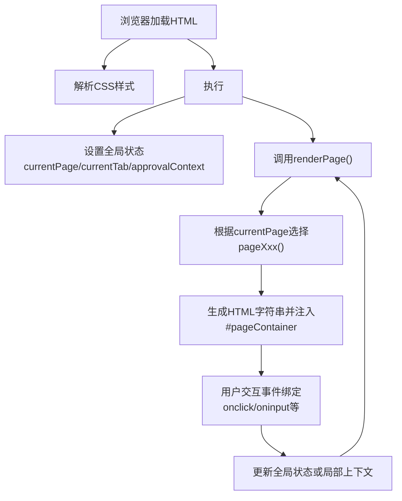
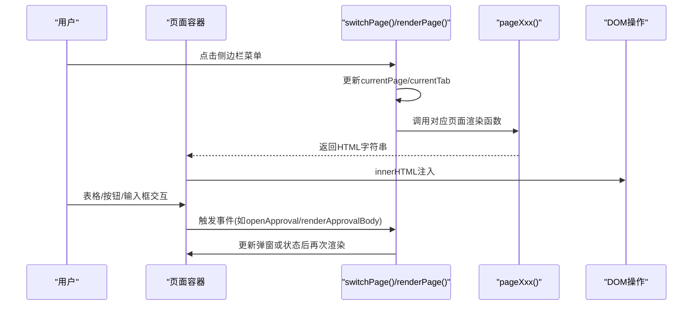
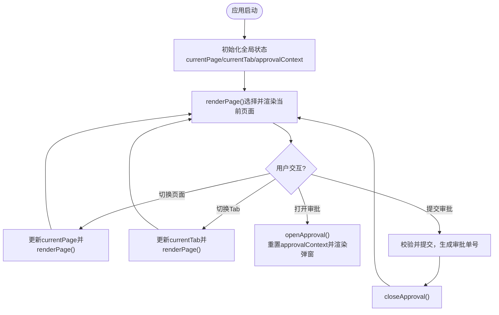
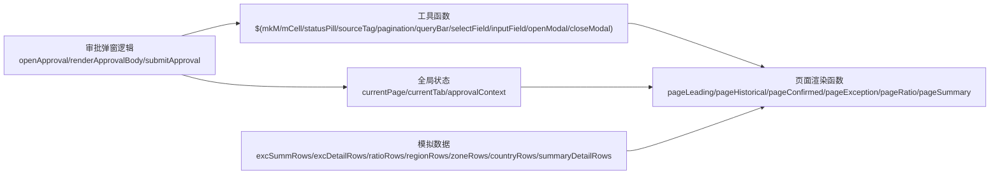

# 数据流模式

<cite>
**本文档中引用的文件**   
- [sales-forecast-prototype.html](file://sales-forecast-prototype.html)
- [sales-forecast-prototype_副本.html](file://sales-forecast-prototype_副本.html)
</cite>

## 目录
1. [简介](#简介)
2. [项目结构](#项目结构)
3. [核心组件](#核心组件)
4. [架构总览](#架构总览)
5. [详细组件分析](#详细组件分析)
6. [依赖关系分析](#依赖关系分析)
7. [性能考量](#性能考量)
8. [故障排查指南](#故障排查指南)
9. [结论](#结论)
10. [附录：扩展指南](#附录扩展指南)

## 简介
本文件面向开发者与实施人员，系统化阐述“智能销售预测系统”高保真原型的数据流模式，覆盖数据定义、状态管理、渲染更新的数据流向；解释模拟数据的组织结构、全局状态变量的作用域与生命周期；梳理数据验证规则、业务逻辑处理与错误处理策略；并提供数据层扩展指导（新增数据模型、实现数据转换、保持数据一致性）。

该原型采用单页应用（SPA）风格，通过页面函数按需渲染DOM，使用少量全局变量维护当前页面与Tab状态，配合工具函数完成表单、表格、分页、弹窗等通用交互。

## 项目结构
- 单一HTML文件承载样式、模板与脚本，便于快速演示与迭代。
- 页面路由由JavaScript控制，通过切换菜单项触发页面渲染。
- 每个页面对应一个渲染函数，返回HTML字符串注入到主容器。
- 全局状态集中在顶部常量与变量中，供各页面共享。

图表来源
- [sales-forecast-prototype.html:140-147](file://sales-forecast-prototype.html#L140-L147)
- [sales-forecast-prototype.html:283-292](file://sales-forecast-prototype.html#L283-L292)

章节来源
- [sales-forecast-prototype.html:1-126](file://sales-forecast-prototype.html#L1-L126)
- [sales-forecast-prototype.html:140-147](file://sales-forecast-prototype.html#L140-L147)
- [sales-forecast-prototype.html:283-292](file://sales-forecast-prototype.html#L283-L292)

## 核心组件
- 全局常量与状态
  - 月份标签M_LABELS用于统一展示M月~M+12。
  - PAGE_NAMES映射页面键值与标题。
  - SCM_USERS为审批人候选池。
  - currentPage、currentTab、approvalContext分别维护当前页面、子Tab与审批弹窗上下文。
- 工具函数
  - $(s)简化DOM查询。
  - mkM(b,a)将前后两期数组转换为可渲染的月度单元格数据结构。
  - mCell(m,clickable,onClick)渲染单个月度单元格，支持差异高亮与点击回调。
  - statusPill(s)、sourceTag(s)将状态/来源转为带样式的标签。
  - pagination(total)、queryBar(fields)提供分页与查询栏模板。
  - selectField(label,opts)、inputField(label,ph)构建表单控件。
  - openModal/closeModal管理通用弹窗。
- 页面渲染器
  - pageLeading/historical/confirmed/exception/ratio/summary分别负责六个主页面。
  - exception与summary内部含多Tab，通过currentTab控制。
- 审批弹窗
  - openApproval/closeApproval/renderApprovalBody管理提交审批流程，包括理由、多级审批人选择、附件上传与校验。

章节来源
- [sales-forecast-prototype.html:142-147](file://sales-forecast-prototype.html#L142-L147)
- [sales-forecast-prototype.html:149-182](file://sales-forecast-prototype.html#L149-L182)
- [sales-forecast-prototype.html:184-280](file://sales-forecast-prototype.html#L184-L280)
- [sales-forecast-prototype.html:294-453](file://sales-forecast-prototype.html#L294-L453)

## 架构总览
整体采用“状态驱动渲染”的轻量前端架构：
- 状态层：全局变量保存当前页面、Tab与审批上下文。
- 视图层：页面函数返回HTML字符串，直接注入容器。
- 交互层：内联事件处理器更新状态并触发重新渲染。
- 数据层：模拟数据以常量数组形式声明，按维度组织（大区/国区/国家/明细）。

图表来源
- [sales-forecast-prototype.html:283-292](file://sales-forecast-prototype.html#L283-L292)
- [sales-forecast-prototype.html:184-280](file://sales-forecast-prototype.html#L184-L280)

## 详细组件分析

### 数据定义与模拟数据结构
- 月份标签与页面名称
  - M_LABELS：用于表格列头与月度单元格渲染。
  - PAGE_NAMES：用于面包屑标题显示。
- 审批人池
  - SCM_USERS：作为审批人下拉选项与去重依据。
- 月度单元格数据
  - mkM(b,a)将“修改前/后”两期数值映射为对象数组，mCell据此渲染差异。
- 汇总与明细数据
  - 例外需求汇总excSummRows、明细excDetailRows。
  - 比例维护ratioRows。
  - 3+9汇总regionRows/zoneRows/countryRows/summaryDetailRows。
- 数据结构特点
  - 所有列表均为纯数据数组，无类封装。
  - 字段命名遵循“编码/名称”成对出现，便于跨维度关联。
  - 时间戳与版本字段用于审计与版本控制。

章节来源
- [sales-forecast-prototype.html:142-147](file://sales-forecast-prototype.html#L142-L147)
- [sales-forecast-prototype.html:331-344](file://sales-forecast-prototype.html#L331-L344)
- [sales-forecast-prototype.html:368-374](file://sales-forecast-prototype.html#L368-L374)
- [sales-forecast-prototype.html:385-411](file://sales-forecast-prototype.html#L385-L411)

### 状态管理与生命周期
- 全局状态
  - currentPage：当前主页面键值，影响renderPage选择的渲染函数。
  - currentTab：嵌套Tab状态，如exception与summary各自维护独立Tab键。
  - approvalContext：审批弹窗临时上下文，包含来源、审批人、理由、附件。
- 生命周期
  - 页面初始化时调用renderPage()渲染默认页面。
  - 用户切换菜单时更新currentPage并重新渲染。
  - Tab切换仅更新currentTab并重新渲染当前页面。
  - 审批弹窗打开时重置approvalContext，关闭时隐藏弹窗。

图表来源
- [sales-forecast-prototype.html:283-292](file://sales-forecast-prototype.html#L283-L292)
- [sales-forecast-prototype.html:184-280](file://sales-forecast-prototype.html#L184-L280)

章节来源
- [sales-forecast-prototype.html:145-147](file://sales-forecast-prototype.html#L145-L147)
- [sales-forecast-prototype.html:283-292](file://sales-forecast-prototype.html#L283-L292)
- [sales-forecast-prototype.html:184-280](file://sales-forecast-prototype.html#L184-L280)

### 渲染更新的数据流向
- 页面渲染
  - renderPage()根据currentPage映射到具体pageXxx()函数，返回HTML字符串注入#pageContainer。
- 表格渲染
  - 各页面通过map遍历数据数组生成<tr>行，结合工具函数渲染单元格（如mCell、statusPill、sourceTag）。
- 交互更新
  - 内联onclick/oninput直接更新全局状态或局部上下文，随后调用renderPage()或局部渲染函数刷新视图。
- 弹窗渲染
  - openModal/closeModal控制通用弹窗；审批弹窗通过renderApprovalBody动态生成内容。

章节来源
- [sales-forecast-prototype.html:289-292](file://sales-forecast-prototype.html#L289-L292)
- [sales-forecast-prototype.html:179-182](file://sales-forecast-prototype.html#L179-L182)
- [sales-forecast-prototype.html:191-249](file://sales-forecast-prototype.html#L191-L249)

### 数据验证规则与业务逻辑
- 表单与输入
  - 必填校验：申请理由必填；一级审批人必选。
  - 附件限制：最多3个，单个不超过30MB，格式受accept约束。
- 状态流转
  - 审批状态：草稿→审批中→已通过/已驳回/已撤回；已驳回/已撤回→废弃→已废弃。
  - 操作权限：编辑/删除按钮根据审批状态动态启用/禁用。
- 计算与展示
  - 月度单元格差异高亮：before≠after时显示删除线与高亮。
  - 统计卡片：根据数据聚合展示关键指标（数量、金额、趋势等）。

章节来源
- [sales-forecast-prototype.html:274-280](file://sales-forecast-prototype.html#L274-L280)
- [sales-forecast-prototype.html:447-452](file://sales-forecast-prototype.html#L447-L452)
- [sales-forecast-prototype.html:151-166](file://sales-forecast-prototype.html#L151-L166)

### 错误处理策略
- 前端校验
  - 空值提示：未填写申请理由或未选择一级审批人时弹出alert。
  - 附件超限：超过数量或大小限制时提示并阻止添加。
- 用户体验
  - 按钮禁用：不符合条件的操作按钮置灰不可用。
  - 状态标签：不同状态使用不同颜色与文案，便于识别。

章节来源
- [sales-forecast-prototype.html:263-280](file://sales-forecast-prototype.html#L263-L280)
- [sales-forecast-prototype.html:360-363](file://sales-forecast-prototype.html#L360-L363)

## 依赖关系分析
- 模块耦合
  - 页面函数依赖工具函数进行渲染与交互。
  - 审批弹窗依赖SCM_USERS与全局approvalContext。
- 外部依赖
  - 无第三方库，纯原生JS与HTML/CSS。
- 潜在循环依赖
  - 无函数间相互调用导致的循环依赖。

图表来源
- [sales-forecast-prototype.html:149-182](file://sales-forecast-prototype.html#L149-L182)
- [sales-forecast-prototype.html:294-453](file://sales-forecast-prototype.html#L294-L453)
- [sales-forecast-prototype.html:184-280](file://sales-forecast-prototype.html#L184-L280)

章节来源
- [sales-forecast-prototype.html:149-182](file://sales-forecast-prototype.html#L149-L182)
- [sales-forecast-prototype.html:294-453](file://sales-forecast-prototype.html#L294-L453)

## 性能考量
- 渲染方式
  - 全量innerHTML替换可能导致频繁重排；建议对大数据表格采用虚拟滚动或增量更新。
- 事件绑定
  - 大量内联onclick可能增加内存占用；建议事件委托或框架化绑定。
- 数据规模
  - 当前为小样本演示数据；若扩展到千级行，需引入分页、懒加载与缓存。

[本节为通用指导，不直接分析具体文件]

## 故障排查指南
- 常见问题
  - 页面不渲染：检查currentPage是否正确映射到pageXxx函数。
  - 弹窗不显示：确认modal-overlay的show类是否被正确添加。
  - 审批提交失败：检查必填字段与附件限制逻辑。
- 调试建议
  - 在关键函数入口打印日志（如renderPage、submitApproval）。
  - 使用浏览器控制台检查DOM结构与事件绑定。

章节来源
- [sales-forecast-prototype.html:283-292](file://sales-forecast-prototype.html#L283-L292)
- [sales-forecast-prototype.html:179-182](file://sales-forecast-prototype.html#L179-L182)
- [sales-forecast-prototype.html:274-280](file://sales-forecast-prototype.html#L274-L280)

## 结论
该原型实现了清晰的数据流模式：以全局状态为中心，页面函数按需渲染，工具函数统一处理UI细节，审批弹窗集中管理复杂交互。数据以模拟数组形式组织，便于快速迭代与演示。未来可扩展为真实后端集成，同时保持现有数据契约不变。

[本节为总结性内容，不直接分析具体文件]

## 附录：扩展指南

### 如何添加新的数据模型
- 步骤
  - 在顶部常量区域新增数据数组（参考excSummRows/regionRows等结构）。
  - 在对应页面函数中引用新数据，生成表格行与统计卡片。
  - 如需新增Tab，更新currentTab映射并在renderPage中处理。
- 注意事项
  - 保持字段命名一致（编码/名称成对）。
  - 确保月度单元格数据符合mkM格式。

章节来源
- [sales-forecast-prototype.html:331-344](file://sales-forecast-prototype.html#L331-L344)
- [sales-forecast-prototype.html:385-411](file://sales-forecast-prototype.html#L385-L411)

### 如何实现数据转换
- 月度单元格转换
  - 使用mkM(b,a)将两期数组转换为对象数组，再由mCell渲染。
- 状态与来源标签
  - 使用statusPill与sourceTag将枚举值转换为带样式的标签。
- 分页与查询
  - 使用pagination与queryBar生成通用UI，后续可接入真实筛选逻辑。

章节来源
- [sales-forecast-prototype.html:149-169](file://sales-forecast-prototype.html#L149-L169)
- [sales-forecast-prototype.html:151-166](file://sales-forecast-prototype.html#L151-L166)

### 如何保持数据一致性
- 规范
  - 所有列表数据使用相同字段约定（编码/名称、时间戳、版本）。
  - 状态枚举集中管理（如审批状态、来源类型）。
- 校验
  - 在提交与变更处统一校验必填项与约束条件。
- 审计
  - 保留创建/修改人与时间，便于追踪变更历史。

章节来源
- [sales-forecast-prototype.html:331-344](file://sales-forecast-prototype.html#L331-L344)
- [sales-forecast-prototype.html:447-452](file://sales-forecast-prototype.html#L447-L452)