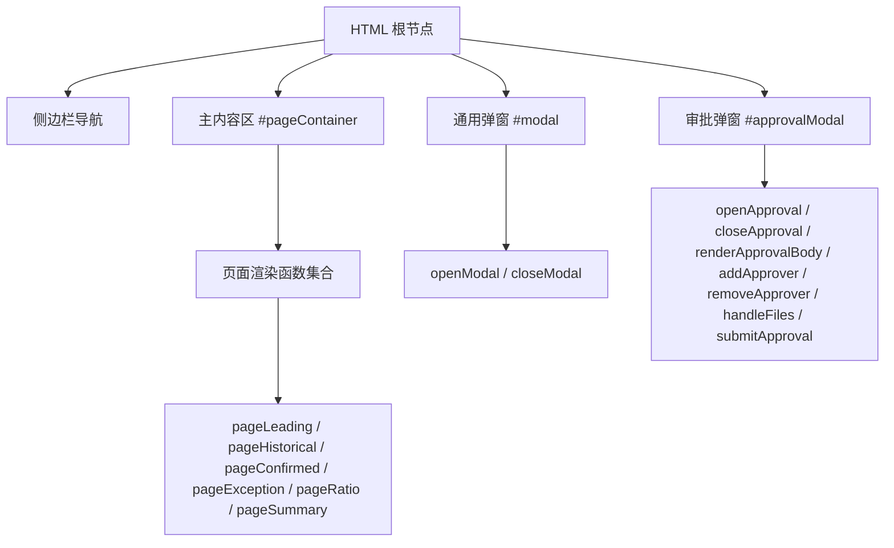
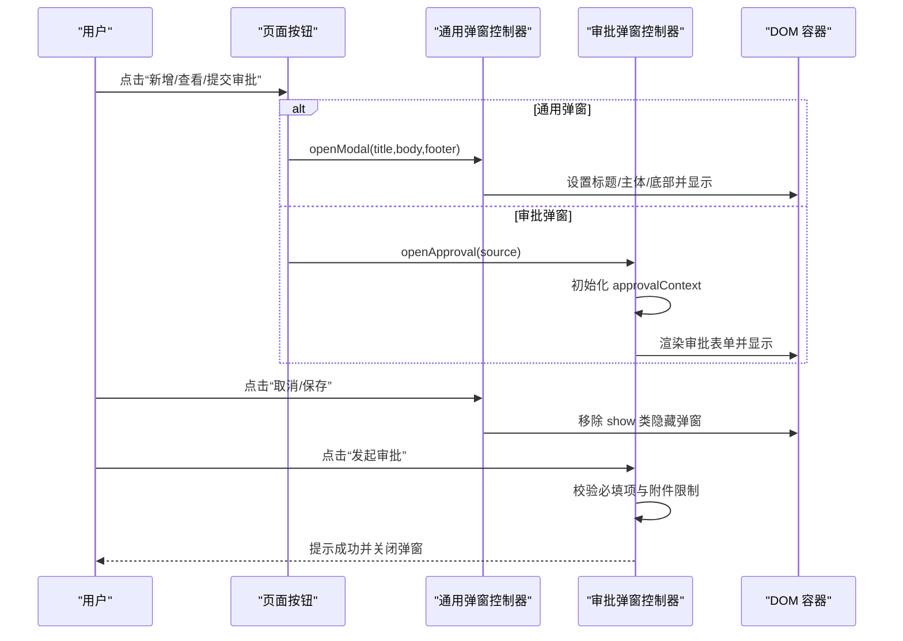
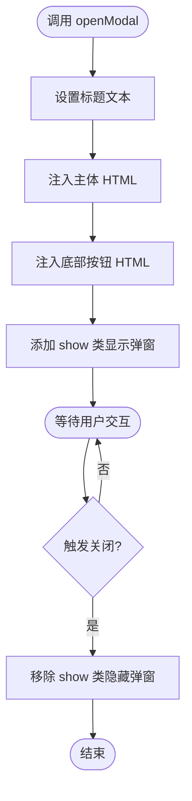
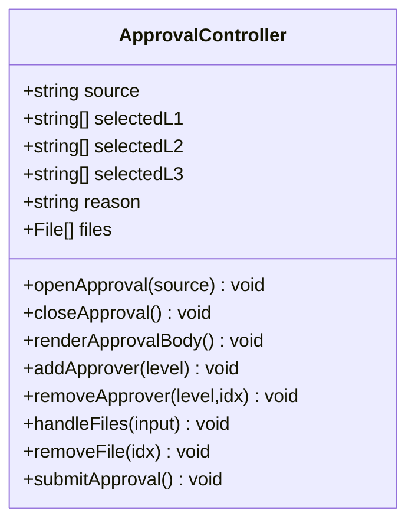
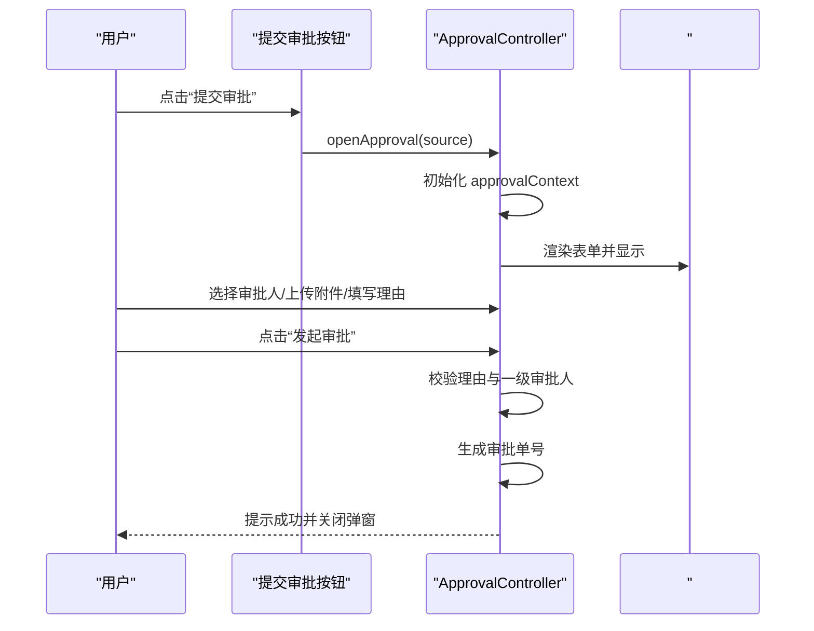
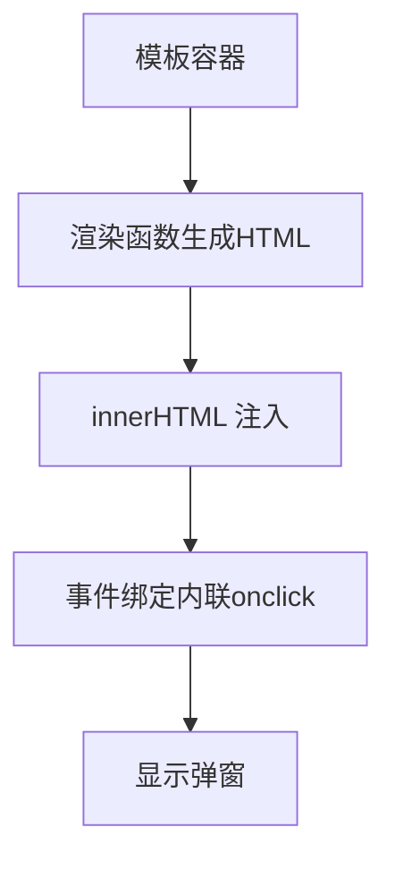
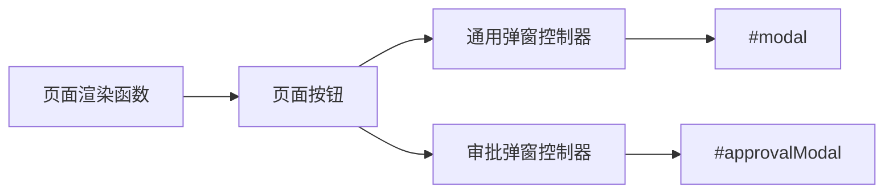

# 模态弹窗系统

<cite>
**本文档中引用的文件**   
- [sales-forecast-prototype.html](file://sales-forecast-prototype.html)
- [sales-forecast-prototype_副本.html](file://sales-forecast-prototype_副本.html)
</cite>

## 目录
1. [简介](#简介)
2. [项目结构](#项目结构)
3. [核心组件](#核心组件)
4. [架构总览](#架构总览)
5. [详细组件分析](#详细组件分析)
6. [依赖关系分析](#依赖关系分析)
7. [性能考量](#性能考量)
8. [故障排查指南](#故障排查指南)
9. [结论](#结论)
10. [附录：扩展与最佳实践](#附录扩展与最佳实践)

## 简介
本技术文档聚焦于“智能销售预测系统”高保真原型中的模态弹窗子系统，重点说明：
- 通用弹窗 openModal/closeModal 的实现原理、状态管理与事件处理
- 专用审批弹窗 openApproval/closeApproval 的特殊功能（多级审批人选择、附件上传、表单校验）
- 弹窗模板结构与动态内容渲染机制
- 表单交互逻辑与数据绑定方式
- 如何扩展新的专用弹窗与复杂业务逻辑

该原型采用纯前端实现，通过 DOM 操作与内联脚本完成页面切换、表格渲染与弹窗交互，适合快速验证业务流程与交互体验。

## 项目结构
整体为单 HTML 文件，包含样式、布局、页面内容与脚本逻辑。关键结构如下：
- 侧边栏导航与主内容区
- 通用弹窗容器（overlay + modal）
- 专用审批弹窗容器（独立 overlay + modal）
- 工具函数与页面渲染函数
- 各页面模块（先行指标预测、历史销售预测、确定性需求、例外需求、计算比例维护、销售预测3+9需求汇总）

**图表来源** 
- [sales-forecast-prototype.html:108-139](file://sales-forecast-prototype.html#L108-L139)
- [sales-forecast-prototype.html:179-182](file://sales-forecast-prototype.html#L179-L182)
- [sales-forecast-prototype.html:185-280](file://sales-forecast-prototype.html#L185-L280)

**章节来源**
- [sales-forecast-prototype.html:108-139](file://sales-forecast-prototype.html#L108-L139)

## 核心组件
- 通用弹窗
  - 打开/关闭：openModal(title, body, footer)、closeModal()
  - 作用：统一承载任意标题、主体内容与底部按钮的弹窗
  - 使用场景：新增/编辑表单、查看详情等
- 审批弹窗
  - 打开/关闭：openApproval(source)、closeApproval()
  - 特殊能力：申请理由输入、三级审批人多选（一级必选）、附件上传（最多3个，单文件≤30MB）、提交校验与成功提示
  - 使用场景：提交审批流程（如“例外需求”“销售预测3+9需求汇总”）

**章节来源**
- [sales-forecast-prototype.html:179-182](file://sales-forecast-prototype.html#L179-L182)
- [sales-forecast-prototype.html:185-280](file://sales-forecast-prototype.html#L185-L280)

## 架构总览
弹窗子系统由“容器 + 控制器 + 渲染器”组成：
- 容器：DOM 元素（#modal、#approvalModal）负责显示/隐藏
- 控制器：JS 函数（openModal/closeModal、openApproval/closeApproval）管理生命周期与状态
- 渲染器：动态生成 HTML（表单、列表、标签、分页等），注入到容器

**图表来源** 
- [sales-forecast-prototype.html:179-182](file://sales-forecast-prototype.html#L179-L182)
- [sales-forecast-prototype.html:185-280](file://sales-forecast-prototype.html#L185-L280)

## 详细组件分析

### 通用弹窗 openModal/closeModal
- 设计要点
  - 通过 innerHTML 动态注入标题、主体与底部按钮
  - 通过 CSS 类 .show 控制 overlay 的 display:flex/block
  - 支持传入任意 HTML 片段作为 body/footer，便于复用
- 典型用法
  - 新增/编辑表单：在 body 中插入表单字段，footer 放置“取消/保存”
  - 查看详情：body 中展示只读信息，footer 仅“关闭”
- 注意事项
  - 避免 XSS：若 body/footer 来自外部输入，需做转义或白名单过滤
  - 事件绑定：动态注入的元素需在渲染后重新绑定事件（当前原型通过内联 onclick 直接绑定）

**图表来源** 
- [sales-forecast-prototype.html:179-182](file://sales-forecast-prototype.html#L179-L182)

**章节来源**
- [sales-forecast-prototype.html:179-182](file://sales-forecast-prototype.html#L179-L182)

### 专用审批弹窗 openApproval/closeApproval
- 设计要点
  - 独立容器 #approvalModal，固定布局与样式
  - 全局状态 approvalContext 存储申请理由、各级审批人、附件列表
  - 渲染函数 renderApprovalBody 根据状态动态生成表单与附件列表
  - 支持多级审批人选择（L1/L2/L3），其中 L1 必选；支持多选中删除
  - 附件上传限制：最多3个，单文件不超过30MB，类型限制图片/Excel/Word/PDF
  - 提交校验：申请理由非空、至少一个一级审批人；成功后生成随机审批单号并提示
- 交互流程
  - 打开：初始化上下文 → 渲染表单 → 显示弹窗
  - 选择审批人：从下拉选择添加至 chips，支持移除
  - 上传附件：校验数量与大小，更新附件列表
  - 提交：校验通过后关闭弹窗并提示结果

**图表来源** 
- [sales-forecast-prototype.html:185-280](file://sales-forecast-prototype.html#L185-L280)

**图表来源** 
- [sales-forecast-prototype.html:185-280](file://sales-forecast-prototype.html#L185-L280)

**章节来源**
- [sales-forecast-prototype.html:185-280](file://sales-forecast-prototype.html#L185-L280)

### 弹窗模板结构与动态内容渲染
- 模板结构
  - 通用弹窗：#modal（overlay + modal），包含 #modalTitle、#modalBody、#modalFooter
  - 审批弹窗：#approvalModal（overlay + modal），包含 #approvalBody 与固定底部按钮
- 动态渲染
  - 通过 innerHTML 注入 HTML 字符串
  - 使用工具函数生成表单字段（selectField/inputField）、分页（pagination）、查询栏（queryBar）
  - mCell 用于月份单元格的前后值对比展示，支持点击展开详情

**图表来源** 
- [sales-forecast-prototype.html:128-139](file://sales-forecast-prototype.html#L128-L139)
- [sales-forecast-prototype.html:170-178](file://sales-forecast-prototype.html#L170-L178)

**章节来源**
- [sales-forecast-prototype.html:128-139](file://sales-forecast-prototype.html#L128-L139)
- [sales-forecast-prototype.html:170-178](file://sales-forecast-prototype.html#L170-L178)

### 表单处理与用户交互逻辑
- 表单字段
  - 审批弹窗包含 textarea（申请理由）、select（审批人）、file input（附件）
- 交互逻辑
  - 审批人选择：从 select 取值，去重后加入数组，渲染 chips，支持移除
  - 附件上传：读取 input.files，校验数量与大小，更新数组并渲染列表
  - 提交校验：检查理由与一级审批人，成功后关闭弹窗并提示
- 事件绑定
  - 使用内联 onclick 直接绑定，简化原型开发，但需注意作用域与重复绑定问题

**章节来源**
- [sales-forecast-prototype.html:191-280](file://sales-forecast-prototype.html#L191-L280)

## 依赖关系分析
- 组件耦合
  - 通用弹窗与审批弹窗共享 overlay/modal 样式，但各自独立容器与控制器
  - 页面渲染函数与弹窗控制器解耦，通过按钮事件触发
- 外部依赖
  - 无第三方库，纯原生 DOM API 与 CSS
- 潜在循环依赖
  - 当前实现无循环引用，函数间调用清晰

**图表来源** 
- [sales-forecast-prototype.html:179-182](file://sales-forecast-prototype.html#L179-L182)
- [sales-forecast-prototype.html:185-280](file://sales-forecast-prototype.html#L185-L280)

**章节来源**
- [sales-forecast-prototype.html:179-182](file://sales-forecast-prototype.html#L179-L182)
- [sales-forecast-prototype.html:185-280](file://sales-forecast-prototype.html#L185-L280)

## 性能考量
- 渲染性能
  - 大量 innerHTML 拼接可能影响性能，建议对大数据集进行虚拟滚动或分页加载
- 内存占用
  - approvalContext 存储临时数据，关闭弹窗后可清理以减少内存占用
- 事件绑定
  - 内联 onclick 简单高效，但频繁重建 DOM 可能导致事件重复绑定，建议使用事件委托

[本节为通用指导，不直接分析具体文件]

## 故障排查指南
- 弹窗无法显示
  - 检查 #modal 或 #approvalModal 是否存在 show 类
  - 确认 innerHTML 注入是否成功
- 审批弹窗校验失败
  - 检查申请理由是否为空
  - 检查一级审批人是否至少选择一个
- 附件上传异常
  - 检查文件大小是否超过30MB
  - 检查文件数量是否超过3个
  - 检查文件类型是否符合限制

**章节来源**
- [sales-forecast-prototype.html:274-280](file://sales-forecast-prototype.html#L274-L280)

## 结论
本模态弹窗系统以简洁的原型实现提供了通用弹窗与专用审批弹窗的核心功能，满足快速验证业务流程的需求。通过清晰的职责分离与动态渲染机制，开发者可轻松扩展新的弹窗类型与业务逻辑。建议在后续迭代中引入更健壮的事件绑定、数据校验与性能优化策略。

[本节为总结性内容，不直接分析具体文件]

## 附录：扩展与最佳实践
- 创建新专用弹窗的步骤
  - 在 HTML 中添加新的弹窗容器（overlay + modal）
  - 定义独立的控制器函数（openXxx/closeXxx）
  - 实现渲染函数，根据状态动态生成表单与交互元素
  - 在页面按钮中绑定 openXxx 调用
- 复杂业务逻辑处理建议
  - 将业务逻辑封装为独立函数，避免内联脚本过长
  - 使用事件委托减少重复绑定
  - 对动态内容进行安全处理，防止 XSS
  - 增加错误边界与用户反馈

[本节为概念性指导，不直接分析具体文件]