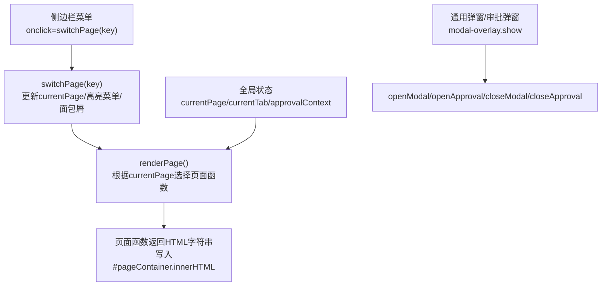
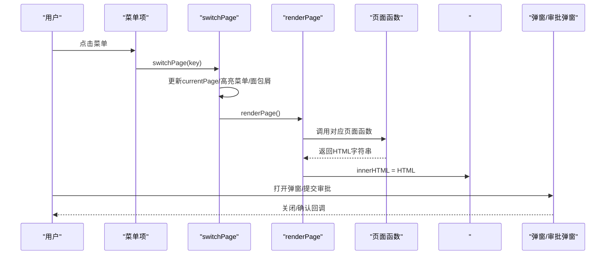
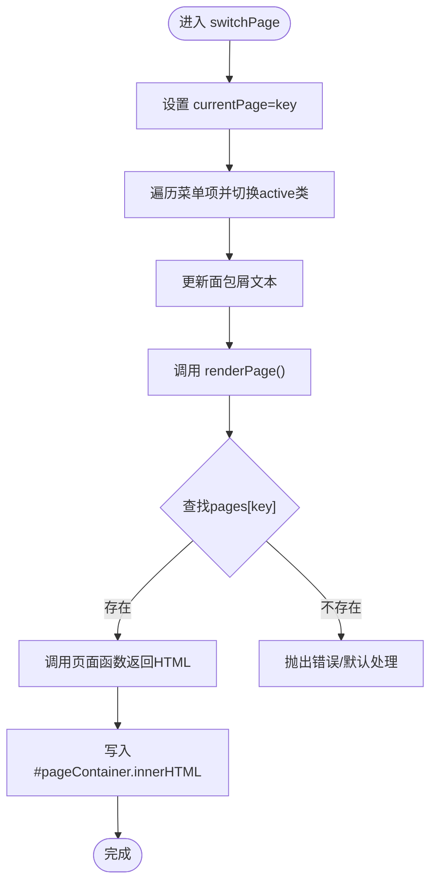
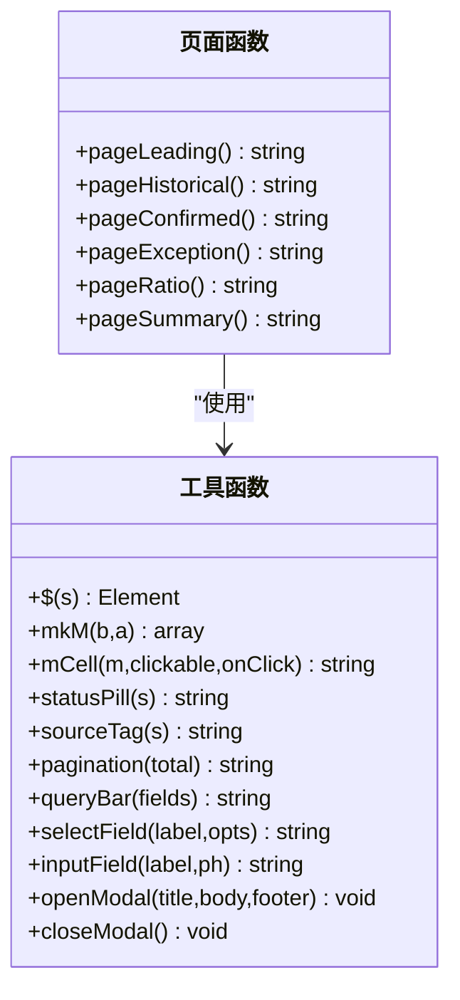
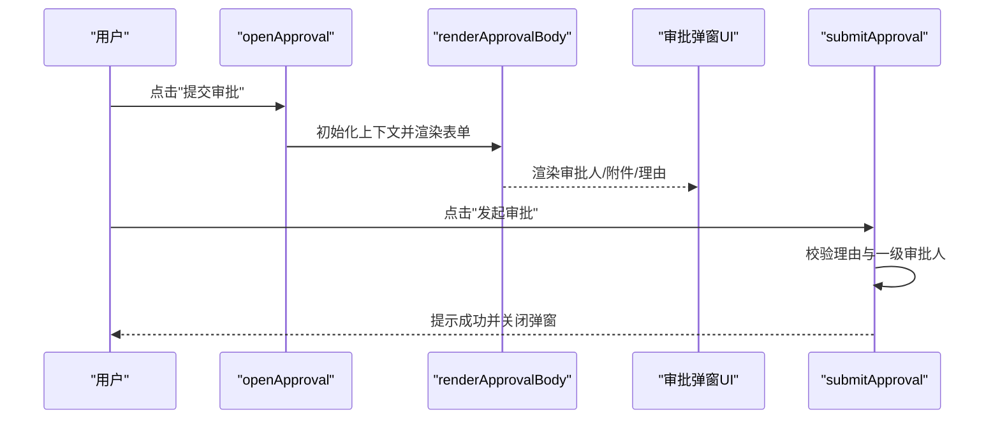
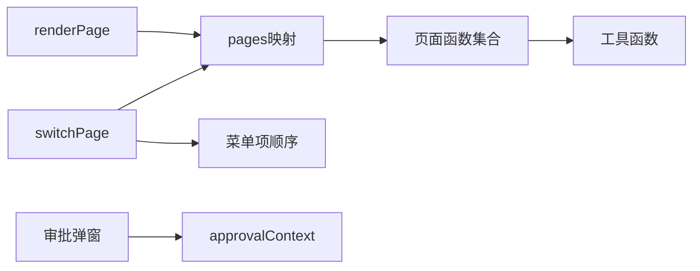

# 页面管理系统

<cite>
**本文档中引用的文件**
- [sales-forecast-prototype.html](file://sales-forecast-prototype.html)
- [sales-forecast-prototype_副本.html](file://sales-forecast-prototype_副本.html)
</cite>

## 目录
1. [简介](#简介)
2. [项目结构](#项目结构)
3. [核心组件](#核心组件)
4. [架构总览](#架构总览)
5. [详细组件分析](#详细组件分析)
6. [依赖关系分析](#依赖关系分析)
7. [性能考虑](#性能考虑)
8. [故障排查指南](#故障排查指南)
9. [结论](#结论)
10. [附录：扩展新页面指南](#附录扩展新页面指南)

## 简介
本技术文档面向“销售预测原型页面管理系统”，聚焦于单页应用（SPA）的页面切换机制、路由逻辑与状态管理。重点说明 switchPage 函数的实现原理、renderPage 的动态渲染策略、页面与菜单项的关联方式，以及页面生命周期管理与 DOM 操作策略。同时提供扩展新页面的实操指导，帮助开发者快速添加新的页面函数与配置映射。

## 项目结构
该原型为单 HTML 文件实现的 SPA，包含样式、布局、脚本三部分。核心要点如下：
- 侧边栏菜单项通过 onclick 调用 switchPage(key) 触发页面切换
- 主内容区由 #pageContainer 承载，每次切换时清空并重新渲染当前页面 HTML
- 全局状态包括 currentPage、currentTab、approvalContext 等，用于控制页面与子 Tab 显示
- 通用弹窗与审批弹窗通过 modal-overlay 控制显隐



图表来源
- [sales-forecast-prototype.html:113-126](file://sales-forecast-prototype.html#L113-L126)
- [sales-forecast-prototype.html:283-292](file://sales-forecast-prototype.html#L283-L292)
- [sales-forecast-prototype.html:179-182](file://sales-forecast-prototype.html#L179-L182)
- [sales-forecast-prototype.html:185-280](file://sales-forecast-prototype.html#L185-L280)

章节来源
- [sales-forecast-prototype.html:108-126](file://sales-forecast-prototype.html#L108-L126)
- [sales-forecast-prototype.html:138-146](file://sales-forecast-prototype.html#L138-L146)

## 核心组件
- 页面路由与切换
  - switchPage：设置当前页面 key、更新菜单高亮、更新面包屑文本、调用 renderPage
  - renderPage：维护 pages 映射表，按 currentPage 调用对应页面函数，将返回的 HTML 注入容器
- 页面函数
  - pageLeading、pageHistorical、pageConfirmed、pageException、pageRatio、pageSummary
  - 每个函数返回一段完整 HTML 片段，包含查询栏、统计卡片、表格、分页等
- 状态管理
  - currentPage：当前页面 key
  - currentTab：页面内 Tab 状态（如 exception、summary）
  - approvalContext：审批弹窗上下文（来源、审批人、附件等）
- 工具函数
  - $(s)、mkM、mCell、statusPill、sourceTag、pagination、queryBar、selectField、inputField、openModal、closeModal
  - 审批相关：openApproval、closeApproval、renderApprovalBody、addApprover、removeApprover、handleFiles、removeFile、submitApproval

章节来源
- [sales-forecast-prototype.html:283-292](file://sales-forecast-prototype.html#L283-L292)
- [sales-forecast-prototype.html:295-453](file://sales-forecast-prototype.html#L295-L453)
- [sales-forecast-prototype.html:148-182](file://sales-forecast-prototype.html#L148-L182)
- [sales-forecast-prototype.html:185-280](file://sales-forecast-prototype.html#L185-L280)

## 架构总览
下图展示了从用户点击菜单到页面渲染的完整流程，以及弹窗交互的生命周期。



图表来源
- [sales-forecast-prototype.html:113-126](file://sales-forecast-prototype.html#L113-L126)
- [sales-forecast-prototype.html:283-292](file://sales-forecast-prototype.html#283-L292)
- [sales-forecast-prototype.html:179-182](file://sales-forecast-prototype.html#L179-L182)
- [sales-forecast-prototype.html:185-280](file://sales-forecast-prototype.html#L185-L280)

## 详细组件分析

### 页面切换与路由逻辑
- switchPage
  - 职责：更新全局 currentPage；同步菜单 active 状态；更新面包屑标题；触发渲染
  - 关键点：菜单项顺序与页面 key 数组一一对应，确保高亮正确
- renderPage
  - 职责：维护 pages 映射（key -> 页面函数），动态选择并执行页面函数，生成 HTML 并注入容器
  - 关键点：每次切换都会替换容器 innerHTML，属于全量重绘模式



图表来源
- [sales-forecast-prototype.html:283-292](file://sales-forecast-prototype.html#L283-L292)

章节来源
- [sales-forecast-prototype.html:283-292](file://sales-forecast-prototype.html#L283-L292)

### 页面函数与内容渲染
- 页面函数列表与职责
  - pageLeading：先行指标预测（指标趋势图占位、统计卡片、数据表格）
  - pageHistorical：历史销售预测（实际 vs 预测对比、准确率统计）
  - pageConfirmed：确定性需求（订单列表、月度分布图占位）
  - pageException：例外需求（双 Tab：汇总表/明细表，含复杂列与状态标签）
  - pageRatio：计算比例维护（区域维度比例配置，启用/停用）
  - pageSummary：销售预测3+9需求汇总（四 Tab：大区/国区/国家/明细）
- 渲染策略
  - 每个页面函数返回模板字符串，使用工具函数拼装查询栏、统计卡片、表格、分页等
  - 表格单元格支持“修改前/后”对比展示（mCell）、状态标签（statusPill）、来源标签（sourceTag）



图表来源
- [sales-forecast-prototype.html:295-453](file://sales-forecast-prototype.html#L295-L453)
- [sales-forecast-prototype.html:148-182](file://sales-forecast-prototype.html#L148-L182)

章节来源
- [sales-forecast-prototype.html:295-453](file://sales-forecast-prototype.html#L295-L453)

### 页面内 Tab 状态管理
- 例外需求（exception）
  - 两个 Tab：summary（汇总表）、detail（明细表）
  - currentTab.exception 控制当前 Tab，点击按钮直接赋值并调用 renderPage
- 销售预测3+9需求汇总（summary）
  - 四个 Tab：region（大区维度）、zone（国区维度）、country（国家维度）、detail（明细表）
  - currentTab.summary 控制当前 Tab，点击按钮直接赋值并调用 renderPage

```mermaid
stateDiagram-v2
[*] --> 初始化
初始化 --> 例外需求摘要 : "currentTab.exception='summary'"
初始化 --> 例外需求明细 : "currentTab.exception='detail'"
例外需求摘要 --> 例外需求明细 : "点击'查看详情'"
例外需求明细 --> 例外需求摘要 : "点击'汇总表'"
初始化 --> 汇总-大区 : "currentTab.summary='region'"
初始化 --> 汇总-国区 : "currentTab.summary='zone'"
初始化 --> 汇总-国家 : "currentTab.summary='country'"
初始化 --> 汇总-明细 : "currentTab.summary='detail'"
```

图表来源
- [sales-forecast-prototype.html:145-146](file://sales-forecast-prototype.html#L145-L146)
- [sales-forecast-prototype.html:345-365](file://sales-forecast-prototype.html#L345-L365)
- [sales-forecast-prototype.html:412-453](file://sales-forecast-prototype.html#L412-L453)

章节来源
- [sales-forecast-prototype.html:145-146](file://sales-forecast-prototype.html#L145-L146)
- [sales-forecast-prototype.html:345-365](file://sales-forecast-prototype.html#L345-L365)
- [sales-forecast-prototype.html:412-453](file://sales-forecast-prototype.html#L412-L453)

### 弹窗与审批流程
- 通用弹窗
  - openModal：设置标题、主体、底部按钮，显示 modal-overlay
  - closeModal：隐藏弹窗
- 审批弹窗
  - openApproval：初始化审批上下文（来源、审批人、附件），渲染审批表单
  - addApprover/removeApprover：管理多级审批人选择
  - handleFiles/removeFile：附件上传与移除校验
  - submitApproval：校验必填项，生成审批单号，提示成功并关闭弹窗



图表来源
- [sales-forecast-prototype.html:185-280](file://sales-forecast-prototype.html#L185-L280)

章节来源
- [sales-forecast-prototype.html:179-182](file://sales-forecast-prototype.html#L179-L182)
- [sales-forecast-prototype.html:185-280](file://sales-forecast-prototype.html#L185-L280)

## 依赖关系分析
- 模块耦合
  - switchPage 依赖 PAGE_NAMES 映射与菜单项顺序
  - renderPage 依赖 pages 映射与页面函数命名约定
  - 页面函数依赖工具函数进行 UI 拼装
  - 审批弹窗依赖 approvalContext 状态
- 外部依赖
  - DOM API：document.querySelector、classList、innerHTML
  - 无第三方库，纯原生 JS/CSS



图表来源
- [sales-forecast-prototype.html:283-292](file://sales-forecast-prototype.html#L283-L292)
- [sales-forecast-prototype.html:148-182](file://sales-forecast-prototype.html#L148-L182)
- [sales-forecast-prototype.html:185-280](file://sales-forecast-prototype.html#L185-L280)

章节来源
- [sales-forecast-prototype.html:283-292](file://sales-forecast-prototype.html#L283-L292)
- [sales-forecast-prototype.html:148-182](file://sales-forecast-prototype.html#L148-L182)
- [sales-forecast-prototype.html:185-280](file://sales-forecast-prototype.html#L185-L280)

## 性能考虑
- 全量重绘
  - renderPage 每次替换容器 innerHTML，属于全量重绘，简单直观但可能带来不必要的 DOM 重建
  - 建议：在页面函数内部缓存静态 HTML 片段，减少重复拼接
- 大表格渲染
  - 明细表列数较多（如例外需求明细、汇总明细），可能导致首屏渲染耗时
  - 建议：引入虚拟滚动或分页懒加载，按需渲染可视区域
- 事件绑定
  - 大量 onclick 内联绑定，便于原型开发但不利于维护与性能
  - 建议：统一事件委托至容器，减少绑定数量
- 弹窗渲染
  - 审批弹窗频繁渲染，注意避免重复创建节点
  - 建议：复用 DOM 节点，仅更新必要字段

[本节为通用性能建议，不直接分析具体文件]

## 故障排查指南
- 页面无法切换
  - 检查 switchPage 中的菜单项顺序与页面 key 数组是否一致
  - 检查 renderPage 的 pages 映射是否包含目标 key
- 面包屑未更新
  - 检查 PAGE_NAMES 映射是否包含目标 key
- 弹窗不显示
  - 检查 modal-overlay 的 show 类是否被正确添加/移除
  - 检查 openModal/closeModal 是否被调用
- 审批失败
  - 检查 submitApproval 的校验逻辑（申请理由、一级审批人）
  - 检查 approvalContext 是否正确初始化

章节来源
- [sales-forecast-prototype.html:283-292](file://sales-forecast-prototype.html#L283-L292)
- [sales-forecast-prototype.html:179-182](file://sales-forecast-prototype.html#L179-L182)
- [sales-forecast-prototype.html:185-280](file://sales-forecast-prototype.html#L185-L280)

## 结论
该原型以极简的单文件 SPA 形式实现了完整的页面切换、状态管理与弹窗交互。其核心在于 switchPage 与 renderPage 的配合，以及页面函数与工具函数的解耦设计。尽管采用全量重绘与内联事件绑定，但在原型阶段具备较高的可维护性与扩展性。后续可通过事件委托、虚拟滚动、节点复用等手段进一步优化性能与可维护性。

[本节为总结性内容，不直接分析具体文件]

## 附录：扩展新页面指南
- 步骤概览
  1. 新增页面函数：定义一个返回 HTML 字符串的函数（例如 pageNewPage）
  2. 注册路由映射：在 renderPage 的 pages 映射中添加 key -> 页面函数
  3. 添加菜单项：在侧边栏新增 menu-item，onclick 调用 switchPage('newPage')
  4. 可选：在 PAGE_NAMES 中添加中文名称，用于面包屑显示
- 注意事项
  - 保持页面函数命名规范与返回结构一致（查询栏、统计卡片、表格、分页）
  - 若页面内含 Tab，需在 currentTab 中新增键值并维护切换逻辑
  - 如需审批功能，复用 openApproval/closeApproval/renderApprovalBody 等函数
- 参考路径
  - 页面函数示例：参见现有 pageLeading/pageHistorical/pageConfirmed/pageException/pageRatio/pageSummary
  - 路由映射与切换：参见 switchPage 与 renderPage
  - 菜单项与面包屑：参见菜单结构与 PAGE_NAMES

章节来源
- [sales-forecast-prototype.html:283-292](file://sales-forecast-prototype.html#L283-L292)
- [sales-forecast-prototype.html:295-453](file://sales-forecast-prototype.html#L295-L453)
- [sales-forecast-prototype.html:113-126](file://sales-forecast-prototype.html#L113-L126)
- [sales-forecast-prototype.html:138-146](file://sales-forecast-prototype.html#L138-L146)