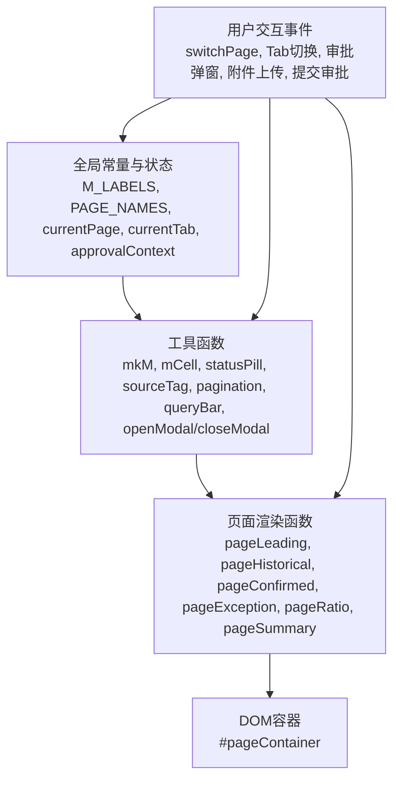
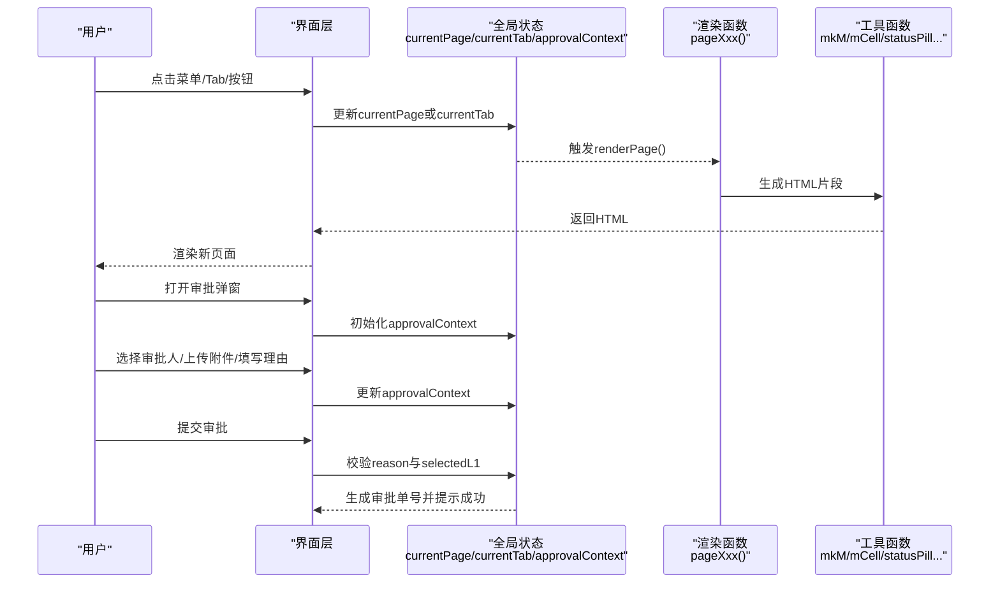
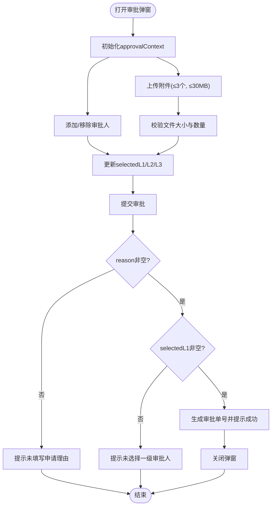
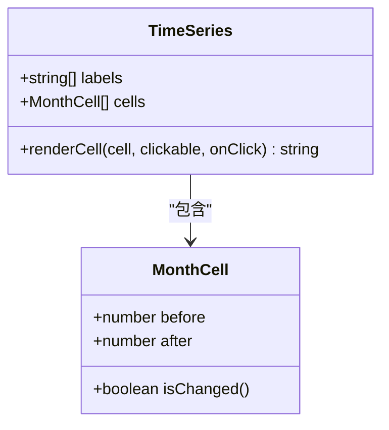
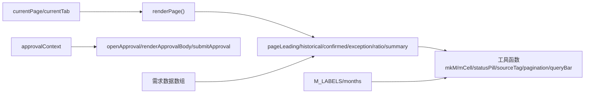

# 数据模型

<cite>
**本文引用的文件**   
- [sales-forecast-prototype.html](file://sales-forecast-prototype.html)
</cite>

## 目录
1. [引言](#引言)
2. [项目结构](#项目结构)
3. [核心组件](#核心组件)
4. [架构总览](#架构总览)
5. [详细组件分析](#详细组件分析)
6. [依赖关系分析](#依赖关系分析)
7. [性能考量](#性能考量)
8. [故障排查指南](#故障排查指南)
9. [结论](#结论)
10. [附录：数据模拟与测试最佳实践](#附录数据模拟与测试最佳实践)

## 引言
本文件面向销售预测系统的数据模型，聚焦以下目标：
- 明确核心数据结构：页面状态管理（currentPage、currentTab）、审批上下文（approvalContext）、各类需求数据数组以及时间序列数据（M月到M+12月的预测数据）。
- 解释数据流向：用户操作→事件处理→状态更新→页面渲染的完整流转机制。
- 定义数据验证规则、业务约束条件与数据生命周期管理。
- 提供数据模拟与测试的最佳实践，确保原型可维护、可扩展、可测试。

## 项目结构
系统为单页应用原型，所有视图与逻辑集中在一个HTML文件中，通过JavaScript脚本驱动页面渲染与交互。关键组织方式如下：
- 常量与全局状态：月份标签、页面名称映射、用户列表、当前页面与Tab状态、审批上下文等。
- 工具函数：DOM选择器、月份单元格渲染、状态标签、分页、查询栏、弹窗控制等。
- 页面渲染函数：每个菜单项对应一个渲染函数，负责生成对应页面的HTML内容。
- 事件处理：页面切换、Tab切换、审批弹窗、附件上传、提交审批等。

图表来源
- [sales-forecast-prototype.html:141-146](file://sales-forecast-prototype.html#L141-L146)
- [sales-forecast-prototype.html:149-178](file://sales-forecast-prototype.html#L149-L178)
- [sales-forecast-prototype.html:283-292](file://sales-forecast-prototype.html#L283-L292)

章节来源
- [sales-forecast-prototype.html:141-146](file://sales-forecast-prototype.html#L141-L146)
- [sales-forecast-prototype.html:149-178](file://sales-forecast-prototype.html#L149-L178)
- [sales-forecast-prototype.html:283-292](file://sales-forecast-prototype.html#L283-L292)

## 核心组件
本节对核心数据模型进行结构化说明，包括字段含义、类型、取值范围与约束。

### 页面状态管理
- currentPage：当前激活的页面键值，用于路由到不同渲染函数。
  - 取值：leading | historical | confirmed | exception | ratio | summary
  - 作用：决定renderPage调用哪个页面渲染函数。
- currentTab：各页面内的子Tab状态，对象形式。
  - 例外需求Tab：exception.summary | exception.detail
  - 汇总Tab：summary.region | summary.zone | summary.country | summary.detail
  - 作用：控制表格维度与列展示。

章节来源
- [sales-forecast-prototype.html:145](file://sales-forecast-prototype.html#L145)
- [sales-forecast-prototype.html:283-292](file://sales-forecast-prototype.html#L283-L292)
- [sales-forecast-prototype.html:346-347](file://sales-forecast-prototype.html#L346-L347)
- [sales-forecast-prototype.html:413-419](file://sales-forecast-prototype.html#L413-L419)

### 审批上下文（approvalContext）
- source：审批来源页面或模块标识（如“例外需求”、“销售预测3+9需求汇总”）。
- selectedL1/L2/L3：各级审批人名单（字符串数组），L1必填且可多选，L2/L3可选。
- reason：申请理由（必填）。
- files：附件列表，每项包含name与size，最多3个，单个不超过30MB。
- 生命周期：
  - 打开审批弹窗时初始化空上下文。
  - 用户添加/移除审批人与附件后实时更新。
  - 提交前校验reason与selectedL1非空；通过后生成审批单号并提示成功。

章节来源
- [sales-forecast-prototype.html:146](file://sales-forecast-prototype.html#L146)
- [sales-forecast-prototype.html:185-189](file://sales-forecast-prototype.html#L185-L189)
- [sales-forecast-prototype.html:191-249](file://sales-forecast-prototype.html#L191-L249)
- [sales-forecast-prototype.html:250-273](file://sales-forecast-prototype.html#L250-L273)
- [sales-forecast-prototype.html:274-280](file://sales-forecast-prototype.html#L274-L280)

### 时间序列数据（M月到M+12月）
- M_LABELS：13个月标签数组，从“M月”到“M+12”。
- mkM(before, after)：将两个长度相同的数值数组转换为13个单元格的序列，每个单元格包含before与after两个值，用于对比修改前后。
- months字段：在各维度汇总与明细中广泛使用，表示该记录在13个月内的预测数量序列。
- 渲染：mCell根据before与after是否相等决定显示样式（修改前划线、修改后高亮）。

章节来源
- [sales-forecast-prototype.html:142](file://sales-forecast-prototype.html#L142)
- [sales-forecast-prototype.html:150](file://sales-forecast-prototype.html#L150)
- [sales-forecast-prototype.html:151-156](file://sales-forecast-prototype.html#L151-L156)
- [sales-forecast-prototype.html:332-335](file://sales-forecast-prototype.html#L332-L335)
- [sales-forecast-prototype.html:386-403](file://sales-forecast-prototype.html#L386-L403)

### 各类需求数据数组
- 确定性需求（confirmedRows）：订单级需求，包含单据号、客户、产品、数量、金额、交付日期、状态等。
- 例外需求汇总（excSummRows）：按作战区域/国家/机型/产品聚合的13个月序列，含国区、大区、事业部信息。
- 例外需求明细（excDetailRows）：行级明细，包含审批单号、需求类型、配置说明、生效数量（修改前后）、运输与贸易条款、客户信息等。
- 历史销售预测计算比例维护（ratioRows）：按区域/国区/国家维度的比例配置（M、M1、M2~M4、M5~M6、M7~M12），支持启用/停用。
- 销售预测3+9需求汇总：
  - 大区维度（regionRows）：大区+机型+产品+13个月序列+事业部。
  - 国区维度（zoneRows）：国区+机型+产品+13个月序列+大区+事业部。
  - 国家维度（countryRows）：作战区域+国家+机型+产品+13个月序列+国区+大区+事业部。
  - 明细表（summaryDetailRows）：版本号、单据号、审批单号、数据来源、需求类型、地理与产品信息、数量变化、运输与贸易条款、客户、创建/修改/审批时间与状态等。

章节来源
- [sales-forecast-prototype.html:320-328](file://sales-forecast-prototype.html#L320-L328)
- [sales-forecast-prototype.html:331-344](file://sales-forecast-prototype.html#L331-L344)
- [sales-forecast-prototype.html:368-374](file://sales-forecast-prototype.html#L368-L374)
- [sales-forecast-prototype.html:385-411](file://sales-forecast-prototype.html#L385-L411)

## 架构总览
下图展示了用户操作到页面渲染的整体数据流与状态变更路径。

图表来源
- [sales-forecast-prototype.html:283-292](file://sales-forecast-prototype.html#L283-L292)
- [sales-forecast-prototype.html:185-189](file://sales-forecast-prototype.html#L185-L189)
- [sales-forecast-prototype.html:250-273](file://sales-forecast-prototype.html#L250-L273)
- [sales-forecast-prototype.html:274-280](file://sales-forecast-prototype.html#L274-L280)

## 详细组件分析

### 页面状态管理（currentPage/currentTab）
- 职责：
  - currentPage决定主页面渲染函数。
  - currentTab决定子Tab内容与列集合。
- 更新路径：
  - switchPage(key)更新currentPage并重新渲染。
  - Tab按钮直接修改currentTab对应键值并触发renderPage。
- 约束：
  - currentTab为嵌套对象，需保证键名与渲染函数一致。
  - 切换Tab时需保持数据一致性（如月份序列、筛选条件）。

章节来源
- [sales-forecast-prototype.html:283-292](file://sales-forecast-prototype.html#L283-L292)
- [sales-forecast-prototype.html:346-347](file://sales-forecast-prototype.html#L346-L347)
- [sales-forecast-prototype.html:413-419](file://sales-forecast-prototype.html#L413-L419)

### 审批上下文（approvalContext）
- 字段与约束：
  - source：来源标识，用于后续审计与展示。
  - selectedL1/L2/L3：审批人名单，L1必填且去重，L2/L3可选。
  - reason：必填，非空校验。
  - files：最多3个，单文件≤30MB，仅记录元数据（name、size）。
- 生命周期：
  - openApproval初始化上下文。
  - addApprover/removeApprover更新审批人列表。
  - handleFiles校验并追加附件。
  - submitApproval执行最终校验与提示。

图表来源
- [sales-forecast-prototype.html:185-189](file://sales-forecast-prototype.html#L185-L189)
- [sales-forecast-prototype.html:250-273](file://sales-forecast-prototype.html#L250-L273)
- [sales-forecast-prototype.html:274-280](file://sales-forecast-prototype.html#L274-L280)

章节来源
- [sales-forecast-prototype.html:185-189](file://sales-forecast-prototype.html#L185-L189)
- [sales-forecast-prototype.html:250-273](file://sales-forecast-prototype.html#L250-L273)
- [sales-forecast-prototype.html:274-280](file://sales-forecast-prototype.html#L274-L280)

### 时间序列数据（M月到M+12月）
- 数据结构：
  - M_LABELS：13个月标签。
  - mkM(before, after)：生成13个单元格对象数组，每个对象包含before与after。
  - months：记录的时间序列，广泛用于汇总与明细。
- 渲染逻辑：
  - mCell根据before与after差异决定样式与可点击行为。
  - 国家维度下，点击单元格可弹出明细查看具体单据的来源与数量变化。

图表来源
- [sales-forecast-prototype.html:142](file://sales-forecast-prototype.html#L142)
- [sales-forecast-prototype.html:150](file://sales-forecast-prototype.html#L150)
- [sales-forecast-prototype.html:151-156](file://sales-forecast-prototype.html#L151-L156)
- [sales-forecast-prototype.html:443](file://sales-forecast-prototype.html#L443)

章节来源
- [sales-forecast-prototype.html:142](file://sales-forecast-prototype.html#L142)
- [sales-forecast-prototype.html:150](file://sales-forecast-prototype.html#L150)
- [sales-forecast-prototype.html:151-156](file://sales-forecast-prototype.html#L151-L156)
- [sales-forecast-prototype.html:443](file://sales-forecast-prototype.html#L443)

### 各类需求数据数组（结构与用途）
- 确定性需求：
  - 字段：docNo、customer、product、qty、amount、date、status。
  - 用途：展示已确认订单与待确认订单，统计总量与金额。
- 例外需求汇总：
  - 字段：areaCode/Name、countryCode/Name、model/productCode/productName、months、zoneCode/Name、regionCode/Name、buName/buCode。
  - 用途：按区域/国家/产品维度聚合13个月预测，支持导出与详情跳转。
- 例外需求明细：
  - 字段：docNo、lineNo、approvalNo、demandType、buName/buCode、model/productCode/productName、optional/configDesc/demandNote、qtyBefore/qtyAfter、expectedDate/deliveryDate、area/country/region/zone、unitPrice/totalAmt、shipMethod/orderType、originPort/destPort、transportMode/tradeTerms、customerCode/customerName、createTime/creator/modifier/modifyTime/version、approvalTime/approvalStatus。
  - 用途：行级管理与审批流程，支持编辑/删除/查看等操作。
- 历史销售预测计算比例维护：
  - 字段：id、areaCode/Name、zoneCode/Name、regionCode/Name、countryCode/Name、mM/m1/m2m4/m5m6/m7m12、createTime、status。
  - 用途：维护不同区域的预测比例，支持启用/停用与查看详情。
- 销售预测3+9需求汇总：
  - 大区/国区/国家维度：均包含地理与产品信息、13个月序列、事业部信息。
  - 明细表：版本化单据，包含来源类型、需求类型、地理与产品信息、数量变化、运输与贸易条款、客户、创建/修改/审批信息与状态。

章节来源
- [sales-forecast-prototype.html:320-328](file://sales-forecast-prototype.html#L320-L328)
- [sales-forecast-prototype.html:331-344](file://sales-forecast-prototype.html#L331-L344)
- [sales-forecast-prototype.html:368-374](file://sales-forecast-prototype.html#L368-L374)
- [sales-forecast-prototype.html:385-411](file://sales-forecast-prototype.html#L385-L411)

## 依赖关系分析
- 渲染函数依赖工具函数：
  - pageException/pageSummary等依赖mkM、mCell、statusPill、sourceTag、pagination、queryBar。
- 状态依赖：
  - currentPage与currentTab驱动渲染函数选择与Tab内容。
  - approvalContext影响审批弹窗内容与提交校验。
- 数据依赖：
  - 各需求数据数组被对应渲染函数读取并生成表格。
  - 时间序列数据（months）贯穿汇总与明细，统一由mkM构建。

图表来源
- [sales-forecast-prototype.html:283-292](file://sales-forecast-prototype.html#L283-L292)
- [sales-forecast-prototype.html:149-178](file://sales-forecast-prototype.html#L149-L178)
- [sales-forecast-prototype.html:185-189](file://sales-forecast-prototype.html#L185-L189)
- [sales-forecast-prototype.html:331-344](file://sales-forecast-prototype.html#L331-L344)

章节来源
- [sales-forecast-prototype.html:283-292](file://sales-forecast-prototype.html#L283-L292)
- [sales-forecast-prototype.html:149-178](file://sales-forecast-prototype.html#L149-L178)
- [sales-forecast-prototype.html:185-189](file://sales-forecast-prototype.html#L185-L189)
- [sales-forecast-prototype.html:331-344](file://sales-forecast-prototype.html#L331-L344)

## 性能考量
- DOM操作：每次renderPage会替换#pageContainer的innerHTML，频繁切换可能导致重绘开销。建议：
  - 缓存静态HTML片段。
  - 对大表格采用虚拟滚动或分页加载。
- 时间序列渲染：mCell为每个单元格生成HTML，13列×多行可能产生大量字符串拼接。建议：
  - 预编译模板或使用更高效渲染库。
- 审批弹窗：handleFiles逐文件校验与push，注意避免重复与超限。建议：
  - 批量校验与去重。
- 状态更新：currentTab与currentPage直接修改全局变量，需注意并发与一致性。建议：
  - 引入不可变状态与单向数据流。

[本节为通用指导，不直接分析具体文件]

## 故障排查指南
- 页面不切换：
  - 检查switchPage是否正确更新currentPage与菜单active类。
  - 确认renderPage能正确调用对应渲染函数。
- Tab不生效：
  - 检查currentTab键名是否与渲染函数一致。
  - 确认Tab按钮onclick是否正确赋值并触发renderPage。
- 审批弹窗异常：
  - 校验reason与selectedL1是否为空。
  - 检查files数量与大小限制。
- 时间序列显示异常：
  - 确认mkM传入的before与after数组长度一致。
  - 检查mCell渲染逻辑是否正确区分修改前后。

章节来源
- [sales-forecast-prototype.html:283-292](file://sales-forecast-prototype.html#L283-L292)
- [sales-forecast-prototype.html:346-347](file://sales-forecast-prototype.html#L346-L347)
- [sales-forecast-prototype.html:274-280](file://sales-forecast-prototype.html#L274-L280)
- [sales-forecast-prototype.html:150](file://sales-forecast-prototype.html#L150)
- [sales-forecast-prototype.html:151-156](file://sales-forecast-prototype.html#L151-L156)

## 结论
本数据模型以简洁的全局状态与工具函数为核心，支撑多页面与多Tab的渲染与交互。时间序列数据通过统一的mkM与mCell实现一致的展示与对比。审批上下文提供了完整的审批流程前端支撑。建议在后续迭代中引入更严格的状态管理与性能优化策略，以提升系统的可维护性与用户体验。

[本节为总结性内容，不直接分析具体文件]

## 附录：数据模拟与测试最佳实践
- 数据模拟：
  - 使用mkM生成标准时间序列，覆盖边界情况（如全部相同、全部递增/递减、部分为空）。
  - 构造多区域/国家/产品线组合的需求数据，验证聚合与分页逻辑。
  - 模拟审批场景：无reason、无L1、附件超限、重复审批人等。
- 单元测试：
  - 针对工具函数：mkM、mCell、statusPill、sourceTag、pagination、queryBar。
  - 针对状态更新：switchPage、Tab切换、addApprover/removeApprover、handleFiles、submitApproval。
  - 针对渲染函数：确保输入数据与输出HTML结构一致。
- 集成测试：
  - 模拟用户操作序列（切换页面→选择Tab→打开审批→提交），验证状态与渲染结果。
  - 验证大表格渲染性能与内存占用。
- 回归测试：
  - 每次修改后运行全量用例，确保无破坏性变更。

[本节为通用指导，不直接分析具体文件]