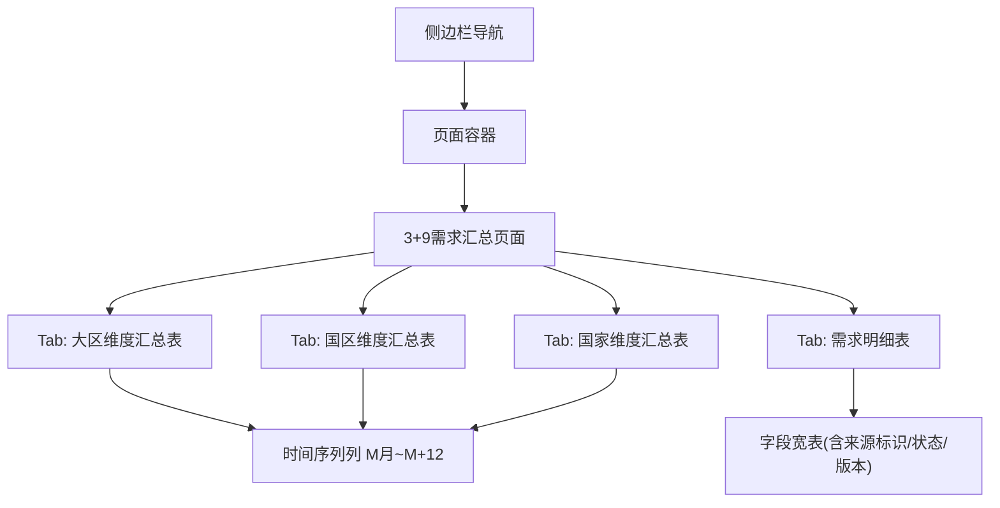
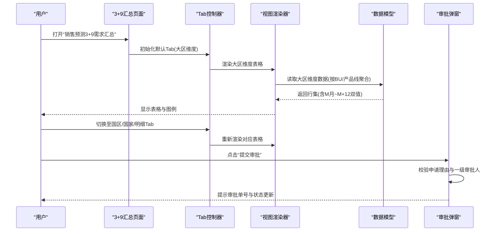
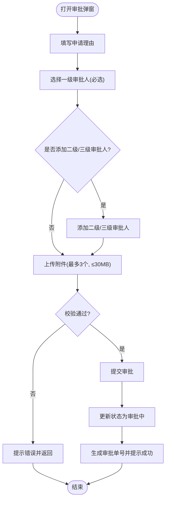
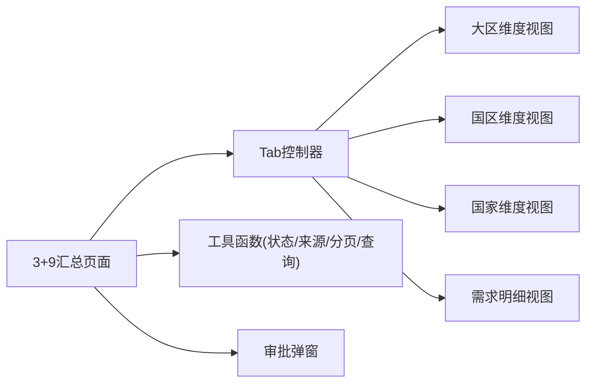

# 3+9需求汇总分析

<cite>
**本文档引用的文件**   
- [sales-forecast-prototype.html](file://sales-forecast-prototype.html)
- [sales-forecast-prototype_副本.html](file://sales-forecast-prototype_副本.html)
</cite>

## 目录
1. [简介](#简介)
2. [项目结构](#项目结构)
3. [核心组件](#核心组件)
4. [架构总览](#架构总览)
5. [详细组件分析](#详细组件分析)
6. [依赖关系分析](#依赖关系分析)
7. [性能考虑](#性能考虑)
8. [故障排查指南](#故障排查指南)
9. [结论](#结论)
10. [附录](#附录)

## 简介
本模块聚焦“销售预测3+9需求汇总”能力，提供多维度（大区、国区、国家）三级钻取分析与四Tab页（大区维度汇总表、国区维度汇总表、国家维度汇总表、需求明细表）的统一视图。系统支持M月到M+12月的13个月时间序列展示，内置状态机（草稿→提交审批→审批中→已通过/已驳回/已撤回；已驳回/已撤回→废弃→已废弃），并提供发布与审批流程操作、批量操作与导出能力。数据来源标识区分确定性需求、例外需求、历史销售预测三类来源类型，便于追溯与审计。

## 项目结构
该原型采用单页应用结构，通过侧边栏菜单切换页面，主内容区动态渲染各页面。3+9需求汇总页面包含四个Tab：大区维度、国区维度、国家维度、需求明细。每个Tab均具备查询过滤、图例说明、分页、导出等通用交互。

图表来源
- [sales-forecast-prototype.html:384-453](file://sales-forecast-prototype.html#L384-L453)

章节来源
- [sales-forecast-prototype.html:1-126](file://sales-forecast-prototype.html#L1-L126)
- [sales-forecast-prototype.html:384-453](file://sales-forecast-prototype.html#L384-L453)

## 核心组件
- 时间序列数据模型：统一使用“修改前/修改后”双值结构，用于对比展示M月到M+12月的13个月预测数据。
- 三维度汇总数据模型：大区维度按BU与产品线聚合；国区维度按区域与产品线聚合；国家维度按作战区域与国家聚合。
- 明细数据模型：包含单据号、版本号、审批单号、来源类型、需求类型、地理维度、产品维度、数量前后对比、日期、价格金额、发运与贸易条款、客户信息、审计字段与审批状态。
- 审批弹窗组件：支持申请理由、多级审批人选择（一级必选可多选串行）、附件上传（最多3个，单文件≤30MB）。
- 工具函数：状态标签、来源标签、分页、查询栏、月份单元格渲染等。

章节来源
- [sales-forecast-prototype.html:141-176](file://sales-forecast-prototype.html#L141-L176)
- [sales-forecast-prototype.html:184-280](file://sales-forecast-prototype.html#L184-L280)
- [sales-forecast-prototype.html:384-453](file://sales-forecast-prototype.html#L384-L453)

## 架构总览
3+9需求汇总页面由“查询过滤层 + 数据展示层 + 交互控制层”构成。查询过滤层提供年份、产品线、作战区域等筛选；数据展示层以表格形式呈现多维汇总与明细，并内嵌时间序列列；交互控制层负责Tab切换、详情跳转、批量操作、导入导出、审批弹窗等。

图表来源
- [sales-forecast-prototype.html:384-453](file://sales-forecast-prototype.html#L384-L453)
- [sales-forecast-prototype.html:184-280](file://sales-forecast-prototype.html#L184-L280)

## 详细组件分析

### 一、时间序列数据与展示（M月到M+12月）
- 数据结构：每列包含“修改前/修改后”两个数值，差异时以删除线与高亮显示，便于快速识别变更。
- 展示方式：在三个汇总Tab中，时间序列列固定为M月、M+1到M+12共13列；在国家维度某列上支持点击弹出当月明细对比。
- 图例：明确“修改前/修改后”的视觉含义，提升可读性。

章节来源
- [sales-forecast-prototype.html:141-176](file://sales-forecast-prototype.html#L141-L176)
- [sales-forecast-prototype.html:422-445](file://sales-forecast-prototype.html#L422-L445)

### 二、大区维度汇总表
- 聚合维度：按“大区编码/名称 + 机型 + 产品编码/名称 + BU名称/编码”进行聚合。
- 字段结构：大区基础信息、产品与BU信息、13个月时间序列、操作入口（下钻至国区维度）。
- 数据逻辑：同一大区同产品线的多来源需求合并为一条记录，时间序列按来源叠加计算。

章节来源
- [sales-forecast-prototype.html:384-429](file://sales-forecast-prototype.html#L384-L429)

### 三、国区维度汇总表
- 聚合维度：按“国区编码/名称 + 机型 + 产品编码/名称 + 大区编码/名称 + BU名称/编码”进行聚合。
- 字段结构：国区基础信息、产品与BU信息、13个月时间序列、操作入口（下钻至国家维度）。
- 数据逻辑：同一国区同产品线的多来源需求合并为一条记录，时间序列按来源叠加计算。

章节来源
- [sales-forecast-prototype.html:430-437](file://sales-forecast-prototype.html#L430-L437)

### 四、国家维度汇总表
- 聚合维度：按“作战区域编码/名称 + 国家编码/名称 + 机型 + 产品编码/名称 + 国区/大区/BU信息”进行聚合。
- 字段结构：国家与地理维度信息、产品与BU信息、13个月时间序列、操作入口（下钻至明细表）。
- 交互增强：时间序列列支持点击查看当月明细对比（含来源标识与前后数量）。

章节来源
- [sales-forecast-prototype.html:438-445](file://sales-forecast-prototype.html#L438-L445)

### 五、需求明细表
- 字段结构：版本号、单据号、审批单号、来源类型（确定性需求/例外需求/历史销售预测）、需求类型、地理维度（作战区域/国家/国区/大区）、产品维度（机型/产品编码/名称/选配/配置说明）、数量前后对比、预计入库/要求交货、单价/总金额、发运计收、订单型/储备型、港口、运输方式、贸易术语、客户信息、审计字段（创建/修改/审批时间、创建人/修改人）、审批状态、操作。
- 操作能力：批量勾选、发布、提交审批、撤回、废弃、删除、导出；历史销售预测来源支持“修改”。
- 状态流转：草稿→提交审批→审批中→已通过/已驳回/已撤回；已驳回/已撤回→废弃→已废弃。

章节来源
- [sales-forecast-prototype.html:446-453](file://sales-forecast-prototype.html#L446-L453)

### 六、审批流程与弹窗
- 输入项：申请理由（必填）、一级审批人（必选，可多选，串行审批）、二级/三级审批人（可选，可多选）、附件（最多3个，单文件≤30MB）。
- 校验规则：未填写申请理由或未选择一级审批人将阻止提交。
- 反馈：提交成功后生成审批单号，并将数据状态更新为“审批中”。

图表来源
- [sales-forecast-prototype.html:184-280](file://sales-forecast-prototype.html#L184-L280)

章节来源
- [sales-forecast-prototype.html:184-280](file://sales-forecast-prototype.html#L184-L280)

### 七、数据来源标识系统
- 确定性需求：来自合同订单或已确认需求，强调可执行性与交付约束。
- 例外需求：临时大单、紧急调拨、风险备货等异常场景，需审批管控。
- 历史销售预测：基于历史数据的预测需求，支持后续修正。
- 展示方式：通过不同颜色标签区分来源类型，便于统计与审计。

章节来源
- [sales-forecast-prototype.html:162-166](file://sales-forecast-prototype.html#L162-L166)
- [sales-forecast-prototype.html:404-411](file://sales-forecast-prototype.html#L404-L411)

### 八、发布与审批流程操作指南
- 发布：在需求明细表顶部提供“发布”按钮，用于将当前版本发布生效。
- 提交审批：点击“提交审批”，填写申请理由并选择至少一名一级审批人，支持添加附件。
- 撤回/废弃/删除：根据状态限制操作权限（如仅草稿/已驳回/已撤回可编辑或删除）。
- 批量操作：支持勾选多条记录进行批量导出等操作。
- 导出：各Tab均提供导出按钮，便于离线分析与归档。

章节来源
- [sales-forecast-prototype.html:446-453](file://sales-forecast-prototype.html#L446-L453)
- [sales-forecast-prototype.html:184-280](file://sales-forecast-prototype.html#L184-L280)

## 依赖关系分析
- 页面与Tab：3+9汇总页面依赖Tab控制器管理当前Tab状态，渲染对应表格。
- 数据与视图：各维度表格依赖统一的时间序列渲染函数与工具函数（状态标签、来源标签、分页、查询栏）。
- 审批弹窗：独立于表格渲染，但会触发状态更新与提示。

图表来源
- [sales-forecast-prototype.html:384-453](file://sales-forecast-prototype.html#L384-L453)
- [sales-forecast-prototype.html:184-280](file://sales-forecast-prototype.html#L184-L280)

章节来源
- [sales-forecast-prototype.html:384-453](file://sales-forecast-prototype.html#L384-L453)
- [sales-forecast-prototype.html:184-280](file://sales-forecast-prototype.html#L184-L280)

## 性能考虑
- 大数据量表格：建议对时间序列列进行虚拟滚动或分页加载，避免一次性渲染过多DOM节点。
- 查询过滤：前端过滤适合小规模数据，大规模数据应结合后端接口实现服务端过滤与分页。
- 审批弹窗：附件上传需做前端校验（大小、数量、格式），减少无效请求。
- 状态与来源标签：复用渲染函数，避免重复计算。

[本节为通用指导，不直接分析具体文件]

## 故障排查指南
- 审批提交失败：检查是否填写申请理由与选择至少一名一级审批人；确认附件数量与大小限制。
- 状态不可操作：根据当前状态判断是否允许编辑/删除（如仅草稿/已驳回/已撤回可编辑或删除）。
- 时间序列无变化：确认数据源是否存在“修改前/修改后”差异，若无差异则不会高亮显示。
- 导出为空：检查查询条件是否过严导致无结果，或数据尚未发布。

章节来源
- [sales-forecast-prototype.html:184-280](file://sales-forecast-prototype.html#L184-L280)
- [sales-forecast-prototype.html:446-453](file://sales-forecast-prototype.html#L446-L453)

## 结论
3+9需求汇总分析模块通过统一的三维度汇总与明细视图，结合时间序列对比与严格的审批流程，实现了从宏观到微观的可追溯分析。数据来源标识清晰，状态机规范，便于业务决策与合规审计。建议在工程化落地时强化服务端能力与性能优化，确保大规模数据下的稳定体验。

[本节为总结性内容，不直接分析具体文件]

## 附录
- 关键常量与枚举：
  - 月份标签：M月、M+1到M+12（共13个月）
  - 状态枚举：草稿、审批中、已通过、已驳回、已撤回、已废弃
  - 来源类型：确定性需求、例外需求、历史销售预测
- 常用操作路径：
  - 大区维度 → 国区维度 → 国家维度 → 需求明细（逐级下钻）
  - 需求明细 → 提交审批 → 审批中 → 通过后生效

章节来源
- [sales-forecast-prototype.html:141-176](file://sales-forecast-prototype.html#L141-L176)
- [sales-forecast-prototype.html:446-453](file://sales-forecast-prototype.html#L446-L453)